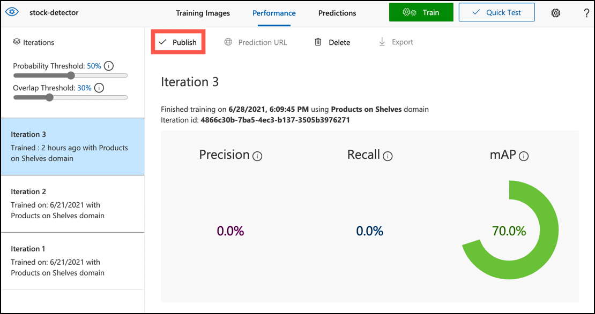

<!--
CO_OP_TRANSLATOR_METADATA:
{
  "original_hash": "1c9e5fa8b7be726c75a97232b1e41c97",
  "translation_date": "2025-08-28T14:27:08+00:00",
  "source_file": "5-retail/lessons/2-check-stock-device/README.md",
  "language_code": "sl"
}
-->
# Preverjanje zalog z IoT napravo


> Sketchnote avtorja [Nitya Narasimhan](https://github.com/nitya). Kliknite na sliko za večjo različico.

## Kviz pred predavanjem

[Kviz pred predavanjem](https://black-meadow-040d15503.1.azurestaticapps.net/quiz/39)

## Uvod

V prejšnji lekciji ste se naučili o različnih uporabah prepoznavanja objektov v maloprodaji. Prav tako ste se naučili, kako trenirati model za prepoznavanje objektov, da identificira zaloge. V tej lekciji se boste naučili, kako uporabiti vaš model za prepoznavanje objektov na IoT napravi za štetje zalog.

V tej lekciji bomo obravnavali:

* [Štetje zalog](../../../../../5-retail/lessons/2-check-stock-device)
* [Klicanje modela za prepoznavanje objektov z IoT naprave](../../../../../5-retail/lessons/2-check-stock-device)
* [Omejevalni okvirji](../../../../../5-retail/lessons/2-check-stock-device)
* [Ponovno treniranje modela](../../../../../5-retail/lessons/2-check-stock-device)
* [Štetje zalog](../../../../../5-retail/lessons/2-check-stock-device)

> 🗑 To je zadnja lekcija v tem projektu, zato po zaključku te lekcije in naloge ne pozabite počistiti svojih storitev v oblaku. Te storitve boste potrebovali za dokončanje naloge, zato se prepričajte, da jo najprej dokončate.
>
> Če potrebujete navodila, si oglejte [vodnik za čiščenje projekta](../../../clean-up.md).

## Štetje zalog

Modeli za prepoznavanje objektov se lahko uporabljajo za preverjanje zalog, bodisi za štetje zalog ali za zagotavljanje, da so zaloge na pravem mestu. IoT naprave s kamerami se lahko namestijo po celotni trgovini za spremljanje zalog, začenši z vročimi točkami, kjer je pomembno, da so izdelki ponovno založeni, kot so območja z majhnim številom dragocenih izdelkov.

Na primer, če kamera kaže na police, ki lahko držijo 8 pločevink paradižnikovega koncentrata, in model za prepoznavanje objektov zazna le 7 pločevink, potem ena manjka in jo je treba ponovno založiti.


Na zgornji sliki je model za prepoznavanje objektov zaznal 7 pločevink paradižnikovega koncentrata na polici, ki lahko drži 8 pločevink. IoT naprava ne samo da lahko pošlje obvestilo o potrebi po ponovnem založenju, ampak lahko celo poda informacijo o lokaciji manjkajočega izdelka, kar je pomemben podatek, če uporabljate robote za ponovno založenje polic.

> 💁 Odvisno od trgovine in priljubljenosti izdelka, ponovno založenje verjetno ne bi bilo potrebno, če manjka le ena pločevinka. Potrebno bi bilo zgraditi algoritem, ki določa, kdaj ponovno založiti na podlagi vaših izdelkov, strank in drugih kriterijev.

✅ V katerih drugih scenarijih bi lahko kombinirali prepoznavanje objektov in robote?

Včasih so na policah napačne zaloge. To je lahko posledica človeške napake pri ponovnem založenju ali strank, ki si premislijo glede nakupa in izdelek postavijo nazaj na prvo razpoložljivo mesto. Ko gre za ne-pokvarljive izdelke, kot so konzervirani izdelki, je to le nadloga. Če pa gre za pokvarljive izdelke, kot so zamrznjeni ali ohlajeni izdelki, to lahko pomeni, da izdelka ni več mogoče prodati, saj je nemogoče ugotoviti, kako dolgo je bil izdelek zunaj zamrzovalnika.

Prepoznavanje objektov se lahko uporabi za zaznavanje nepričakovanih predmetov, kar omogoča IoT napravi, da opozori človeka ali robota, da izdelek čim prej vrne na pravo mesto.


Na zgornji sliki je pločevinka baby koruze postavljena na polico poleg paradižnikovega koncentrata. Model za prepoznavanje objektov je to zaznal, kar omogoča IoT napravi, da obvesti človeka ali robota, da pločevinko vrne na pravo mesto.

## Klicanje modela za prepoznavanje objektov z IoT naprave

Model za prepoznavanje objektov, ki ste ga trenirali v prejšnji lekciji, lahko pokličete z vaše IoT naprave.

### Naloga - objavite iteracijo vašega modela za prepoznavanje objektov

Iteracije se objavijo iz portala Custom Vision.

1. Odprite portal Custom Vision na [CustomVision.ai](https://customvision.ai) in se prijavite, če ga še nimate odprtega. Nato odprite vaš projekt `stock-detector`.

1. Izberite zavihek **Performance** med možnostmi na vrhu.

1. Izberite najnovejšo iteracijo s seznama *Iterations* na strani.

1. Kliknite gumb **Publish** za iteracijo.

    

1. V pogovornem oknu *Publish Model* nastavite *Prediction resource* na vir `stock-detector-prediction`, ki ste ga ustvarili v prejšnji lekciji. Ime pustite kot `Iteration2` in kliknite gumb **Publish**.

1. Ko je iteracija objavljena, kliknite gumb **Prediction URL**. To bo prikazalo podrobnosti o API-ju za napovedovanje, ki jih boste potrebovali za klicanje modela z vaše IoT naprave. Spodnji del je označen *If you have an image file*, in to so podrobnosti, ki jih potrebujete. Kopirajte prikazani URL, ki bo nekaj takega:

    ```output
    https://<location>.api.cognitive.microsoft.com/customvision/v3.0/Prediction/<id>/detect/iterations/Iteration2/image
    ```

    Kjer bo `<location>` lokacija, ki ste jo uporabili pri ustvarjanju vira Custom Vision, in `<id>` bo dolga ID sestavljena iz črk in številk.

    Prav tako kopirajte vrednost *Prediction-Key*. To je varnostni ključ, ki ga morate posredovati, ko kličete model. Samo aplikacije, ki posredujejo ta ključ, lahko uporabljajo model, vse druge aplikacije so zavrnjene.

    

✅ Ko je objavljena nova iteracija, bo imela drugačno ime. Kako mislite, da bi spremenili iteracijo, ki jo uporablja IoT naprava?

### Naloga - klicanje modela za prepoznavanje objektov z IoT naprave

Sledite ustreznemu vodniku spodaj, da uporabite model za prepoznavanje objektov z vaše IoT naprave:

* [Arduino - Wio Terminal](wio-terminal-object-detector.md)
* [Enokartični računalnik - Raspberry Pi/Virtualna naprava](single-board-computer-object-detector.md)

## Omejevalni okvirji

Ko uporabljate model za prepoznavanje objektov, ne dobite le zaznanih objektov z njihovimi oznakami in verjetnostmi, ampak tudi omejevalne okvirje objektov. Ti določajo, kje je model zaznal objekt z dano verjetnostjo.

> 💁 Omejevalni okvir je okvir, ki določa območje, ki vsebuje zaznani objekt, okvir, ki določa mejo za objekt.

Rezultati napovedi v zavihku **Predictions** v Custom Vision imajo omejevalne okvirje narisane na sliki, ki je bila poslana za napovedovanje.


Na zgornji sliki so bile zaznane 4 pločevinke paradižnikovega koncentrata. V rezultatih je rdeč kvadrat prekril vsak zaznani objekt na sliki, kar označuje omejevalni okvir za sliko.

✅ Odprite napovedi v Custom Vision in si oglejte omejevalne okvirje.

Omejevalni okvirji so določeni s 4 vrednostmi - zgoraj, levo, višina in širina. Te vrednosti so na lestvici od 0-1, kar predstavlja položaje kot odstotek velikosti slike. Izvor (položaj 0,0) je zgornji levi del slike, zato je zgornja vrednost razdalja od vrha, spodnji del omejevalnega okvirja pa je zgornji del plus višina.


Zgornja slika je široka 600 slikovnih pik in visoka 800 slikovnih pik. Omejevalni okvir se začne 320 slikovnih pik navzdol, kar daje zgornjo koordinato 0.4 (800 x 0.4 = 320). Od leve se omejevalni okvir začne 240 slikovnih pik čez, kar daje levo koordinato 0.4 (600 x 0.4 = 240). Višina omejevalnega okvirja je 240 slikovnih pik, kar daje vrednost višine 0.3 (800 x 0.3 = 240). Širina omejevalnega okvirja je 120 slikovnih pik, kar daje vrednost širine 0.2 (600 x 0.2 = 120).

| Koordinata | Vrednost |
| ---------- | -------: |
| Zgoraj     | 0.4      |
| Levo       | 0.4      |
| Višina     | 0.3      |
| Širina     | 0.2      |

Uporaba odstotkovnih vrednosti od 0-1 pomeni, da ne glede na to, na kakšno velikost je slika skalirana, omejevalni okvir začne 0.4 poti vzdolž in navzdol ter je 0.3 višine in 0.2 širine.

Omejevalne okvirje lahko uporabite v kombinaciji z verjetnostmi za oceno, kako natančno je zaznavanje. Na primer, model za prepoznavanje objektov lahko zazna več objektov, ki se prekrivajo, na primer zazna eno pločevinko znotraj druge. Vaša koda lahko pregleda omejevalne okvirje, razume, da je to nemogoče, in ignorira vse objekte, ki se znatno prekrivajo z drugimi objekti.


V zgornjem primeru en omejevalni okvir označuje napovedano pločevinko paradižnikovega koncentrata z verjetnostjo 78.3%. Drugi omejevalni okvir je nekoliko manjši in je znotraj prvega omejevalnega okvirja z verjetnostjo 64.3%. Vaša koda lahko preveri omejevalne okvirje, vidi, da se popolnoma prekrivajo, in ignorira nižjo verjetnost, saj ni mogoče, da bi bila ena pločevinka znotraj druge.

✅ Ali lahko pomislite na situacijo, kjer je veljavno zaznati en objekt znotraj drugega?

## Ponovno treniranje modela

Tako kot pri klasifikatorju slik lahko ponovno trenirate svoj model z uporabo podatkov, zajetih z vašo IoT napravo. Uporaba teh podatkov iz resničnega sveta bo zagotovila, da vaš model dobro deluje, ko ga uporabljate z IoT napravo.

Za razliko od klasifikatorja slik ne morete preprosto označiti slike. Namesto tega morate pregledati vsak omejevalni okvir, ki ga je model zaznal. Če je okvir okoli napačne stvari, ga je treba izbrisati, če je na napačnem mestu, ga je treba prilagoditi.

### Naloga - ponovno treniranje modela

1. Prepričajte se, da ste zajeli vrsto slik z vašo IoT napravo.

1. V zavihku **Predictions** izberite sliko. Videli boste rdeče okvirje, ki označujejo omejevalne okvirje zaznanih objektov.

1. Preglejte vsak omejevalni okvir. Najprej ga izberite in videli boste pojavno okno z oznako. Uporabite ročice na vogalih omejevalnega okvirja, da prilagodite velikost, če je potrebno. Če je oznaka napačna, jo odstranite z gumbom **X** in dodajte pravilno oznako. Če omejevalni okvir ne vsebuje objekta, ga izbrišite z gumbom za smetnjak.

1. Zaprite urejevalnik, ko končate, in slika se bo premaknila iz zavihka **Predictions** v zavihek **Training Images**. Postopek ponovite za vse napovedi.

1. Uporabite gumb **Train**, da ponovno trenirate svoj model. Ko je treniranje končano, objavite iteracijo in posodobite svojo IoT napravo, da uporablja URL nove iteracije.

1. Ponovno namestite svojo kodo in preizkusite svojo IoT napravo.

## Štetje zalog

Z uporabo kombinacije števila zaznanih objektov in omejevalnih okvirjev lahko štejete zaloge na polici.

### Naloga - štetje zalog

Sledite ustreznemu vodniku spodaj, da štejete zaloge z uporabo rezultatov modela za prepoznavanje objektov z vaše IoT naprave:

* [Arduino - Wio Terminal](wio-terminal-count-stock.md)
* [Enokartični računalnik - Raspberry Pi/Virtualna naprava](single-board-computer-count-stock.md)

---

## 🚀 Izziv

Ali lahko zaznate napačne zaloge? Trenirajte svoj model na več objektih, nato posodobite svojo aplikacijo, da vas opozori, če so zaznane napačne zaloge.

Morda pojdite še korak dlje in zaznajte zaloge, ki so postavljene ena ob drugi na isti polici, ter preverite, ali je kaj postavljeno na napačno mesto, tako da določite omejitve na omejevalnih okvirjih.

## Kviz po predavanju

[Kviz po predavanju](https://black-meadow-040d15503.1.azurestaticapps.net/quiz/40)

## Pregled in samostojno učenje

* Več o tem, kako zasnovati celovit sistem za zaznavanje zalog, si preberite v [vodniku o vzorcu zaznavanja pomanjkanja zalog na robu na Microsoft Docs](https://docs.microsoft.com/hybrid/app-solutions/pattern-out-of-stock-at-edge?WT.mc_id=academic-17441-jabenn).
* Spoznajte druge načine za gradnjo celovitih rešitev za maloprodajo, ki združujejo različne IoT in oblačne storitve, tako da si ogledate [video "Behind the scenes of a retail solution - Hands On!" na YouTubu](https://www.youtube.com/watch?v=m3Pc300x2Mw).

## Naloga

[Uporabite svoj model za prepoznavanje objektov na robu](assignment.md)

---

**Omejitev odgovornosti**:  
Ta dokument je bil preveden z uporabo storitve za prevajanje z umetno inteligenco [Co-op Translator](https://github.com/Azure/co-op-translator). Čeprav si prizadevamo za natančnost, vas prosimo, da upoštevate, da lahko avtomatizirani prevodi vsebujejo napake ali netočnosti. Izvirni dokument v njegovem maternem jeziku je treba obravnavati kot avtoritativni vir. Za ključne informacije priporočamo profesionalni človeški prevod. Ne prevzemamo odgovornosti za morebitna nesporazumevanja ali napačne razlage, ki bi nastale zaradi uporabe tega prevoda.