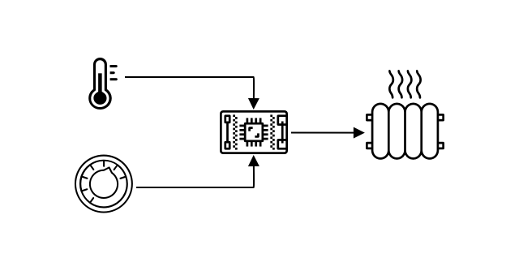

<!--
CO_OP_TRANSLATOR_METADATA:
{
  "original_hash": "9dd7f645ad1c6f20b72fee512987f772",
  "translation_date": "2025-08-28T13:37:19+00:00",
  "source_file": "1-getting-started/lessons/2-deeper-dive/README.md",
  "language_code": "sr"
}
-->
# Дубље истраживање IoT-а

> Скица од [Nitya Narasimhan](https://github.com/nitya). Кликните на слику за већу верзију.

Ова лекција је предавана као део [Hello IoT серије](https://youtube.com/playlist?list=PLmsFUfdnGr3xRts0TIwyaHyQuHaNQcb6-) из [Microsoft Reactor](https://developer.microsoft.com/reactor/?WT.mc_id=academic-17441-jabenn). Лекција је предавана кроз два видеа - један сат лекције и један сат додатног времена за дубље истраживање делова лекције и одговарање на питања.

> 🎥 Кликните на слике изнад да бисте погледали видео записе

## Квиз пре предавања

[Квиз пре предавања](https://black-meadow-040d15503.1.azurestaticapps.net/quiz/3)

## Увод

Ова лекција дубље истражује неке од концепата покривених у претходној лекцији.

У овој лекцији обрадићемо:

* [Компоненте IoT апликације](../../../../../1-getting-started/lessons/2-deeper-dive)
* [Дубље истраживање микроконтролера](../../../../../1-getting-started/lessons/2-deeper-dive)
* [Дубље истраживање рачунара са једном плочом](../../../../../1-getting-started/lessons/2-deeper-dive)

## Компоненте IoT апликације

Две компоненте IoT апликације су *Интернет* и *ствар*. Погледајмо ове две компоненте детаљније.

### Ствар

**Ствар** у IoT-у се односи на уређај који може да интерагује са физичким светом. Ови уређаји су обично мали, јефтини рачунари, који раде на ниским брзинама и користе мало енергије - на пример, једноставни микроконтролери са килобајтима RAM-а (за разлику од гигабајта у PC-у) који раде на само неколико стотина мегахерца (за разлику од гигахерца у PC-у), али понекад троше толико мало енергије да могу да раде недељама, месецима или чак годинама на батеријама.

Ови уређаји интерагују са физичким светом, било коришћењем сензора за прикупљање података из окружења или контролисањем излаза или актуатора за прављење физичких промена. Типичан пример за ово је паметни термостат - уређај који има сензор температуре, средство за подешавање жељене температуре као што је точкић или екран осетљив на додир, и везу са системом за грејање или хлађење који се може укључити када је детектована температура ван жељеног опсега. Сензор температуре детектује да је соба превише хладна, а актуатор укључује грејање.

Постоји огроман спектар различитих ствари које могу деловати као IoT уређаји, од наменског хардвера који детектује једну ствар, до уређаја опште намене, па чак и ваш паметни телефон! Паметни телефон може користити сензоре за детектовање света око себе и актуаторе за интеракцију са светом - на пример, користећи GPS сензор за детектовање ваше локације и звучник за давање упутстава за навигацију до одредишта.

✅ Размислите о другим системима које имате око себе који читају податке са сензора и користе их за доношење одлука. Један пример би био термостат на рерни. Можете ли пронаћи још?

### Интернет

**Интернет** страна IoT апликације састоји се од апликација са којима IoT уређај може да се повеже ради слања и примања података, као и других апликација које могу да обрађују податке са IoT уређаја и помажу у доношењу одлука о томе које захтеве послати актуаторима IoT уређаја.

Једна типична поставка би била да постоји нека врста cloud сервиса са којим се IoT уређај повезује, а овај cloud сервис обрађује ствари као што су безбедност, као и примање порука од IoT уређаја и слање порука назад уређају. Овај cloud сервис би се затим повезао са другим апликацијама које могу да обрађују или чувају податке сензора, или да користе податке сензора са подацима из других система за доношење одлука.

Уређаји такође не морају увек директно да се повезују на Интернет преко WiFi-а или жичаних веза. Неки уређаји користе mesh мрежу за међусобну комуникацију преко технологија као што је Bluetooth, повезујући се преко хаб уређаја који има Интернет везу.

У примеру паметног термостата, термостат би се повезао користећи кућни WiFi са cloud сервисом који ради у облаку. Он би слао податке о температури овом cloud сервису, а одатле би се подаци записивали у неку врсту базе података, омогућавајући власнику куће да провери тренутне и прошле температуре користећи апликацију на телефону. Други сервис у облаку би знао коју температуру власник куће жели и слао поруке назад IoT уређају преко cloud сервиса да каже систему за грејање да се укључи или искључи.

Још паметнија верзија могла би користити AI у облаку са подацима из других сензора повезаних са другим IoT уређајима као што су сензори за детектовање присуства који откривају које собе се користе, као и податке као што су временски услови и чак ваш календар, за доношење одлука о томе како паметно подесити температуру. На пример, могла би искључити грејање ако из вашег календара прочита да сте на одмору, или искључити грејање по собама у зависности од тога које собе користите, учећи из података да буде све прецизнија током времена.

✅ Који други подаци би могли помоћи да Интернет повезан термостат буде паметнији?

### IoT на ивици

Иако I у IoT-у означава Интернет, ови уређаји не морају да се повезују на Интернет. У неким случајевима, уређаји могу да се повежу на 'edge' уређаје - gateway уређаје који раде на вашој локалној мрежи, што значи да можете обрађивати податке без позива преко Интернета. Ово може бити брже када имате много података или спору Интернет везу, омогућава вам да радите офлајн где Интернет конекција није могућа, као на броду или у области погођеној катастрофом када одговарате на хуманитарну кризу, и омогућава вам да задржите податке приватним. Неки уређаји ће садржати код за обраду креиран коришћењем cloud алата и извршавати га локално за прикупљање и реаговање на податке без коришћења Интернет везе за доношење одлука.

Један пример за ово је паметни кућни уређај као што је Apple HomePod, Amazon Alexa или Google Home, који ће слушати ваш глас користећи AI моделе обучене у облаку, али који раде локално на уређају. Ови уређаји ће се 'пробудити' када се изговори одређена реч или фраза, и тек тада слати ваш говор преко Интернета ради обраде. Уређај ће престати да шаље говор у одговарајућем тренутку, као када детектује паузу у вашем говору. Све што кажете пре него што пробудите уређај са речју за буђење, и све што кажете након што је уређај престао да слуша, неће бити послато преко Интернета провајдеру уређаја, и стога ће бити приватно.

✅ Размислите о другим сценаријима где је приватност важна, па би обрада података била боље обављена на ивици него у облаку. Као наговештај - размислите о IoT уређајима са камерама или другим уређајима за снимање слика.

### IoT безбедност

Са било којом Интернет везом, безбедност је важан аспект. Постоји стара шала да 'S у IoT-у означава Security' - нема 'S' у IoT-у, што имплицира да није безбедан.

IoT уређаји се повезују на cloud сервис, и стога су само онолико безбедни колико је безбедан тај cloud сервис - ако ваш cloud сервис дозвољава било ком уређају да се повеже, онда се могу слати злонамерни подаци или могу се дешавати вирусни напади. Ово може имати веома стварне последице у стварном свету, јер IoT уређаји интерагују и контролишу друге уређаје. На пример, [Stuxnet worm](https://wikipedia.org/wiki/Stuxnet) је манипулисао вентилима у центрифугама да их оштети. Хакери су такође искористили [лошу безбедност да приступе baby monitor-има](https://www.npr.org/sections/thetwo-way/2018/06/05/617196788/s-c-mom-says-baby-monitor-was-hacked-experts-say-many-devices-are-vulnerable) и другим кућним уређајима за надзор.

> 💁 Понекад IoT уређаји и edge уређаји раде на мрежи потпуно изолованој од Интернета како би подаци остали приватни и безбедни. Ово је познато као [air-gapping](https://wikipedia.org/wiki/Air_gap_(networking)).

## Дубље истраживање микроконтролера

У претходној лекцији представили смо микроконтролере. Сада ћемо их детаљније истражити.

### CPU

CPU је 'мозак' микроконтролера. То је процесор који извршава ваш код и може слати податке и примати податке од било којих повезаних уређаја. CPU-и могу садржати једно или више језгара - у суштини један или више CPU-а који могу радити заједно да извршавају ваш код.

CPU-и се ослањају на сат који откуцава милионе или милијарде пута у секунди. Сваки откуцај, или циклус, синхронизује радње које CPU може да изврши. Са сваким откуцајем, CPU може извршити инструкцију из програма, као што је преузимање података са спољашњег уређаја или извршавање математичке операције. Овај редован циклус омогућава да се све радње заврше пре него што се обради следећа инструкција.

Што је бржи циклус сата, више инструкција може бити обрађено сваке секунде, и стога је CPU бржи. Брзине CPU-а се мере у [Hertz (Hz)](https://wikipedia.org/wiki/Hertz), стандардној јединици где 1 Hz значи један циклус или откуцај сата у секунди.

> 🎓 Брзине CPU-а се често дају у MHz или GHz. 1MHz је 1 милион Hz, 1GHz је 1 милијарда Hz.

> 💁 CPU-и извршавају програме користећи [fetch-decode-execute циклус](https://wikipedia.org/wiki/Instruction_cycle). За сваки откуцај сата, CPU ће преузети следећу инструкцију из меморије, декодирати је, а затим је извршити, као што је коришћење аритметичко-логичке јединице (ALU) за сабирање два броја. Нека извршења ће трајати више откуцаја да се заврше, па ће следећи циклус бити извршен на следећем откуцају након што је инструкција завршена.

Микроконтролери имају много ниже брзине сата од десктоп или лаптоп рачунара, па чак и већине паметних телефона. На пример, Wio Terminal има CPU који ради на 120MHz или 120,000,000 циклуса у секунди.

✅ Просечан PC или Mac има CPU са више језгара који раде на више гигахерца, што значи да сат откуцава милијарде пута у секунди. Истражите брзину сата вашег рачунара и упоредите колико је пута бржи од Wio Terminal-а.

Сваки циклус сата троши енергију и генерише топлоту. Што су бржи откуцаји, више енергије се троши и више топлоте се генерише. PC-и имају хладњаке и вентилаторе за уклањање топлоте, без којих би се прегрејали и угасили у року од неколико секунди. Микроконтролери често немају ниједно од овога јер раде много хладније и стога много спорије. PC-и раде на струју из мреже или великим батеријама неколико сати, микроконтролери могу радити данима, месецима или чак годинама на малим батеријама. Микроконтролери такође могу имати језгра која раде на различитим брзинама, прелазећи на спорија језгра са ниском потрошњом када је оптерећење CPU-а мало како би се смањила потрошња енергије.

> 💁 Неки PC-и и Mac-ови усвајају исти микс брзих језгара са високом потрошњом и споријих језгара са ниском потрошњом, прелазећи ради уштеде батерије. На пример, M1 чип у најновијим Apple лаптоповима може се пребацивати између 4 језгра за перформансе и 4 језгра за ефика
🎓 Програмска меморија чува ваш код и остаје сачувана чак и када нема струје.
🎓 RAM се користи за покретање вашег програма и ресетује се када нема напајања

Као и код CPU-а, меморија на микроконтролеру је за редове величине мања од меморије на PC-ју или Mac-у. Типичан PC може имати 8 гигабајта (GB) RAM-а, или 8,000,000,000 бајтова, где сваки бајт има довољно простора за чување једног слова или броја од 0-255. Микроконтролер би имао само килобајте (KB) RAM-а, где је килобајт 1,000 бајтова. Wio терминал поменут горе има 192KB RAM-а, или 192,000 бајтова - више од 40,000 пута мање од просечног PC-ја!

Дијаграм испод показује релативну разлику у величини између 192KB и 8GB - мала тачка у центру представља 192KB.

Простор за складиштење програма је такође мањи него на PC-ју. Типичан PC може имати хард диск од 500GB за складиштење програма, док микроконтролер може имати само килобајте или можда неколико мегабајта (MB) складишта (1MB је 1,000KB, или 1,000,000 бајтова). Wio терминал има 4MB простора за складиштење програма.

✅ Урадите мало истраживање: Колико RAM-а и простора за складиштење има рачунар који користите за читање овога? Како се то упоређује са микроконтролером?

### Улаз/Излаз

Микроконтролери захтевају улазне и излазне (I/O) конекције за читање података са сензора и слање контролних сигнала актуаторима. Обично садрже одређени број пинова за општу намену (GPIO). Ови пинови могу бити конфигурисани у софтверу као улазни (примају сигнал) или излазни (шаљу сигнал).

🧠⬅️ Улазни пинови се користе за читање вредности са сензора

🧠➡️ Излазни пинови шаљу инструкције актуаторима

✅ О овоме ћете више научити у наредном часу.

#### Задатак

Истражите Wio терминал.

Ако користите Wio терминал за ове лекције, пронађите GPIO пинове. Пронађите секцију *Pinout diagram* на [страници производа Wio терминала](https://www.seeedstudio.com/Wio-Terminal-p-4509.html) да бисте сазнали који пинови су који. Wio терминал долази са налепницом коју можете залепити на задњу страну са бројевима пинова, па је додајте сада ако то већ нисте урадили.

### Физичка величина

Микроконтролери су обично малих димензија, а најмањи, [Freescale Kinetis KL03 MCU је довољно мали да стане у удубљење голф лоптице](https://www.edn.com/tiny-arm-cortex-m0-based-mcu-shrinks-package/). Само CPU у PC-ју може бити величине 40mm x 40mm, а то не укључује хладњаке и вентилаторе потребне да CPU ради дуже од неколико секунди без прегревања, што је знатно веће од комплетног микроконтролера. Wio терминал развојни комплет са микроконтролером, кућиштем, екраном и низом конекција и компоненти није много већи од голог Intel i9 CPU-а, и знатно мањи од CPU-а са хладњаком и вентилатором!

| Уређај                          | Величина              |
| ------------------------------- | --------------------- |
| Freescale Kinetis KL03          | 1.6mm x 2mm x 1mm     |
| Wio терминал                    | 72mm x 57mm x 12mm    |
| Intel i9 CPU, хладњак и вентилатор | 136mm x 145mm x 103mm |

### Оквири и оперативни системи

Због своје мале брзине и величине меморије, микроконтролери не покрећу оперативни систем (OS) у смислу десктоп рачунара. Оперативни систем који покреће ваш рачунар (Windows, Linux или macOS) захтева много меморије и процесорске снаге за обављање задатака који су потпуно непотребни за микроконтролер. Запамтите да су микроконтролери обично програмирани да обављају један или више веома специфичних задатака, за разлику од рачунара опште намене као што су PC или Mac који морају да подрже кориснички интерфејс, пуштају музику или филмове, пружају алате за писање докумената или кода, играње игара или прегледање интернета.

Да бисте програмирали микроконтролер без OS-а, потребан вам је алат који вам омогућава да изградите свој код на начин који микроконтролер може да покрене, користећи API-је који могу да комуницирају са периферијама. Сваки микроконтролер је различит, па произвођачи обично подржавају стандардне оквире који вам омогућавају да следите стандардни 'рецепт' за изградњу вашег кода и његово покретање на било ком микроконтролеру који подржава тај оквир.

Можете програмирати микроконтролере користећи OS - често назван реално-временски оперативни систем (RTOS), јер су дизајнирани да обрађују слање података ка и од периферија у реалном времену. Ови оперативни системи су веома лагани и пружају функције као што су:

* Мултитрединг, који омогућава вашем коду да истовремено покреће више блокова кода, било на више језгара или наизменично на једном језгру
* Мрежно повезивање за сигурну комуникацију преко интернета
* Компоненте графичког корисничког интерфејса (GUI) за изградњу корисничких интерфејса (UI) на уређајима који имају екране.

✅ Прочитајте више о различитим RTOS-има: [Azure RTOS](https://azure.microsoft.com/services/rtos/?WT.mc_id=academic-17441-jabenn), [FreeRTOS](https://www.freertos.org), [Zephyr](https://www.zephyrproject.org)

#### Arduino

[Arduino](https://www.arduino.cc) је вероватно најпопуларнији оквир за микроконтролере, посебно међу студентима, хобистима и креаторима. Arduino је платформа за електронику отвореног кода која комбинује софтвер и хардвер. Можете купити плоче компатибилне са Arduino-ом од самог Arduino-а или од других произвођача, а затим кодирати користећи Arduino оквир.

Arduino плоче се кодирају у C или C++. Коришћење C/C++ омогућава вашем коду да буде веома мали и брз, што је потребно на ограниченом уређају као што је микроконтролер. Језгро Arduino апликације назива се скица и представља C/C++ код са 2 функције - `setup` и `loop`. Када се плоча покрене, Arduino оквирни код ће једном покренути функцију `setup`, а затим ће поново и поново покретати функцију `loop`, континуирано је извршавајући док се напајање не искључи.

Ваш код за подешавање би се писао у функцији `setup`, као што је повезивање на WiFi и cloud услуге или иницијализација пинова за улаз и излаз. Ваш код за обраду би се налазио у функцији `loop`, као што је читање са сензора и слање вредности у cloud. Обично бисте укључили кашњење у сваком циклусу, на пример, ако желите да се подаци са сензора шаљу сваких 10 секунди, додали бисте кашњење од 10 секунди на крају циклуса како би микроконтролер могао да спава, штедећи енергију, а затим поново покренуо циклус када је потребно 10 секунди касније.

✅ Ова архитектура програма је позната као *петља догађаја* или *петља порука*. Многе апликације користе ово у позадини и то је стандард за већину десктоп апликација које раде на оперативним системима као што су Windows, macOS или Linux. Функција `loop` слуша поруке од компоненти корисничког интерфејса као што су дугмад или уређаји као што је тастатура, и реагује на њих. Можете прочитати више у овом [чланку о петљи догађаја](https://wikipedia.org/wiki/Event_loop).

Arduino пружа стандардне библиотеке за интеракцију са микроконтролерима и I/O пиновима, са различитим имплементацијама у позадини за рад на различитим микроконтролерима. На пример, функција [`delay`](https://www.arduino.cc/reference/en/language/functions/time/delay/) ће паузирати програм на одређени период, функција [`digitalRead`](https://www.arduino.cc/reference/en/language/functions/digital-io/digitalread/) ће прочитати вредност `HIGH` или `LOW` са датог пина, без обзира на то на којој плочи се код извршава. Ове стандардне библиотеке значе да код написан за једну Arduino плочу може бити поново компајлиран за било коју другу Arduino плочу и радиће, под условом да су пинови исти и да плоче подржавају исте функције.

Постоји велики екосистем трећих страна Arduino библиотека које вам омогућавају да додате додатне функције вашим Arduino пројектима, као што је коришћење сензора и актуатора или повезивање на cloud IoT услуге.

##### Задатак

Истражите Wio терминал.

Ако користите Wio терминал за ове лекције, поново прочитајте код који сте написали у претходном часу. Пронађите функције `setup` и `loop`. Пратите серијски излаз за функцију `loop` која се позива више пута. Покушајте да додате код у функцију `setup` за писање на серијски порт и посматрајте да се овај код позива само једном сваки пут када поново покренете уређај. Покушајте да поново покренете уређај помоћу прекидача за напајање са стране да бисте показали да се ово позива сваки пут када се уређај поново покрене.

## Дубље истраживање рачунара на једној плочи

У претходном часу смо представили рачунаре на једној плочи. Сада ћемо их детаљније истражити.

### Raspberry Pi

[Raspberry Pi Foundation](https://www.raspberrypi.org) је добротворна организација из Велике Британије основана 2009. године ради промовисања изучавања рачунарских наука, посебно на школском нивоу. Као део ове мисије, развили су рачунар на једној плочи, назван Raspberry Pi. Raspberry Pi тренутно је доступан у 3 варијанте - пуна верзија, мањи Pi Zero и модул за рачунар који се може уградити у ваш финални IoT уређај.

Најновија итерација пуне верзије Raspberry Pi је Raspberry Pi 4B. Овај модел има четворојезгарни (4 језгра) CPU који ради на 1.5GHz, 2, 4 или 8GB RAM-а, гигабитни етернет, WiFi, 2 HDMI порта који подржавају 4k екране, аудио и композитни видео излазни порт, USB портове (2 USB 2.0, 2 USB 3.0), 40 GPIO пинова, конектор за камеру за Raspberry Pi модул камере и слот за SD картицу. Све ово на плочи величине 88mm x 58mm x 19.5mm која се напаја USB-C адаптером од 3A. Ови модели почињу од 35 америчких долара, што је много јефтиније од PC-ја или Mac-а.

> 💁 Постоји и Pi400, све-у-једном рачунар са Pi4 уграђеним у тастатуру.

Pi Zero је много мањи, са нижом снагом. Има једнојезгарни CPU од 1GHz, 512MB RAM-а, WiFi (у Zero W моделу), један HDMI порт, један микро-USB порт, 40 GPIO пинова, конектор за камеру за Raspberry Pi модул камере и слот за SD картицу. Мери 65mm x 30mm x 5mm и троши веома мало енергије. Zero кошта 5 америчких долара, док W верзија са WiFi-јем кошта 10 америчких долара.

> 🎓 CPU-и у оба модела су ARM процесори, за разлику од Intel/AMD x86 или x64 процесора који се налазе у већини PC-јева и Mac-ова. Ови процесори су слични онима који се налазе у неким микроконтролерима, као и у скоро свим мобилним телефонима, Microsoft Surface X-у и новим Apple Silicon Mac-овима.

Све варијанте Raspberry Pi-а покрећу верзију Debian Linux-а названу Raspberry Pi OS. Овај OS је доступан као лајт верзија без десктопа, што је савршено за 'headless' пројекте где вам није потребан екран, или као пуна верзија са комплетним десктоп окружењем, веб прегледачем, канцеларијским апликацијама, алатима за кодирање и играма. Пошто је OS верзија Debian Linux-а, можете инсталирати било коју апликацију или алат који ради на Debian-у и направљен је за ARM процесор унутар Pi-а.

#### Задатак

Истражите Raspberry Pi.

Ако користите Raspberry Pi за ове лекције, прочитајте о различитим хардверским компонентама на плочи.

* Можете пронаћи детаље о процесорима који се користе на [страници документације о хардверу Raspberry Pi-а](https://www.raspberrypi.org/documentation/hardware/raspberrypi/). Прочитајте о процесору који се користи у Pi-ју који користите.
* Лоцирајте GPIO пинове. Прочитајте више о њима на [документацији о GPIO пиновима Raspberry Pi-а](https://www.raspberrypi.org/documentation/hardware/raspberrypi/gpio/README.md). Користите [водич за коришћење GPIO пинова](https://www.raspberrypi.org/documentation/usage/gpio/README.md) да идентификујете различите пинове на вашем Pi-ју.

### Програмирање рачунара на једној плочи

Рачунари на једној плочи су комплетни рачунари који покрећу комплетан OS. То значи да постоји широк спектар програмских језика, оквира и алата које можете користити за њихово кодирање, за разлику од микроконтролера који се ослањају на подршку за плочу у оквирима као што је Arduino. Већина програмских језика има библиотеке које могу приступити GPIO пиновима за слање и
### Употреба рачунарских плоча у професионалним IoT пројектима

Рачунарске плоче се користе у професионалним IoT пројектима, а не само као развојни комплети. Оне могу бити моћан начин за контролу хардвера и извршавање сложених задатака, као што је покретање модела машинског учења. На пример, постоји [Raspberry Pi 4 compute module](https://www.raspberrypi.org/blog/raspberry-pi-compute-module-4/) који пружа све могућности Raspberry Pi 4, али у компактном и јефтинијем облику без већине портова, дизајниран за уградњу у прилагођени хардвер.

---

## 🚀 Изазов

Изазов у претходној лекцији био је да наведете што више IoT уређаја који се налазе у вашем дому, школи или радном месту. За сваки уређај на овој листи, да ли мислите да су засновани на микроконтролерима, рачунарским плочама или чак комбинацији оба?

## Квиз након предавања

[Квиз након предавања](https://black-meadow-040d15503.1.azurestaticapps.net/quiz/4)

## Преглед и самостално учење

* Прочитајте [Arduino водич за почетнике](https://www.arduino.cc/en/Guide/Introduction) да бисте боље разумели Arduino платформу.
* Прочитајте [увод у Raspberry Pi 4](https://www.raspberrypi.org/products/raspberry-pi-4-model-b/) да бисте сазнали више о Raspberry Pi уређајима.
* Сазнајте више о неким концептима и акронимима у [чланку "Шта су CPU, MPU, MCU и GPU" у часопису Electrical Engineering Journal](https://www.eejournal.com/article/what-the-faq-are-cpus-mpus-mcus-and-gpus/).

✅ Користите ове водиче, заједно са ценама које су приказане путем линкова у [хардверском водичу](../../../hardware.md), да одлучите коју хардверску платформу желите да користите или да ли бисте радије користили виртуелни уређај.

## Задатак

[Упоредите и контрастирајте микроконтролере и рачунарске плоче](assignment.md)

---

**Одрицање од одговорности**:  
Овај документ је преведен коришћењем услуге за превођење помоћу вештачке интелигенције [Co-op Translator](https://github.com/Azure/co-op-translator). Иако се трудимо да обезбедимо тачност, молимо вас да имате у виду да аутоматски преводи могу садржати грешке или нетачности. Оригинални документ на његовом изворном језику треба сматрати ауторитативним извором. За критичне информације препоручује се професионални превод од стране људи. Не преузимамо одговорност за било каква погрешна тумачења или неспоразуме који могу настати услед коришћења овог превода.