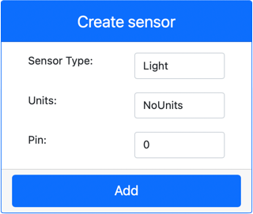

<!--
CO_OP_TRANSLATOR_METADATA:
{
  "original_hash": "11f10c6760fb8202cf368422702fdf70",
  "translation_date": "2025-08-28T14:16:15+00:00",
  "source_file": "1-getting-started/lessons/3-sensors-and-actuators/virtual-device-sensor.md",
  "language_code": "sr"
}
-->
# Направите ноћно светло - Виртуелни IoT хардвер

У овом делу лекције, додаћете сензор светлости вашем виртуелном IoT уређају.

## Виртуелни хардвер

Ноћном светлу је потребан један сензор, креиран у CounterFit апликацији.

Сензор је **сензор светлости**. У физичком IoT уређају, то би био [фотодиода](https://wikipedia.org/wiki/Photodiode) који претвара светлост у електрични сигнал. Сензори светлости су аналогни сензори који шаљу целобројну вредност која указује на релативну количину светлости, али која није усклађена са стандардним јединицама мере као што је [лукс](https://wikipedia.org/wiki/Lux).

### Додајте сензоре у CounterFit

Да бисте користили виртуелни сензор светлости, потребно је да га додате у CounterFit апликацију.

#### Задатак - додајте сензоре у CounterFit

Додајте сензор светлости у CounterFit апликацију.

1. Уверите се да је CounterFit веб апликација покренута из претходног дела задатка. Ако није, покрените је.

1. Креирајте сензор светлости:

    1. У оквиру *Create sensor* у панелу *Sensors*, отворите падајући мени *Sensor type* и изаберите *Light*.

    1. Оставите *Units* подешено на *NoUnits*.

    1. Уверите се да је *Pin* подешен на *0*.

    1. Изаберите дугме **Add** да бисте креирали сензор светлости на пину 0.

    

    Сензор светлости ће бити креиран и појавиће се на листи сензора.

    

## Програмирајте сензор светлости

Уређај сада може бити програмиран да користи уграђени сензор светлости.

### Задатак - програмирајте сензор светлости

Програмирајте уређај.

1. Отворите пројекат ноћног светла у VS Code-у који сте креирали у претходном делу задатка. Ако је потребно, затворите и поново покрените терминал како бисте били сигурни да ради у виртуелном окружењу.

1. Отворите датотеку `app.py`.

1. Додајте следећи код на врх датотеке `app.py` са осталим `import` изјавама како бисте увезли потребне библиотеке:

    ```python
    import time
    from counterfit_shims_grove.grove_light_sensor_v1_2 import GroveLightSensor
    ```

    Изјава `import time` увози Python модул `time` који ће се користити касније у овом задатку.

    Изјава `from counterfit_shims_grove.grove_light_sensor_v1_2 import GroveLightSensor` увози `GroveLightSensor` из CounterFit Grove shim Python библиотека. Ова библиотека садржи код за интеракцију са сензором светлости креираним у CounterFit апликацији.

1. Додајте следећи код на дно датотеке како бисте креирали инстанце класа које управљају сензором светлости:

    ```python
    light_sensor = GroveLightSensor(0)
    ```

    Линија `light_sensor = GroveLightSensor(0)` креира инстанцу класе `GroveLightSensor` која се повезује на пин **0** - CounterFit Grove пин на који је сензор светлости повезан.

1. Додајте бесконачну петљу након горњег кода како бисте очитавали вредност сензора светлости и исписивали је у конзолу:

    ```python
    while True:
        light = light_sensor.light
        print('Light level:', light)
    ```

    Ово ће очитати тренутни ниво светлости користећи својство `light` класе `GroveLightSensor`. Ово својство чита аналогну вредност са пина. Та вредност се затим исписује у конзолу.

1. Додајте кратку паузу од једне секунде на крају `while` петље, јер није потребно континуирано проверавати нивое светлости. Паузирање смањује потрошњу енергије уређаја.

    ```python
    time.sleep(1)
    ```

1. Из VS Code терминала, покрените следећу команду да бисте покренули вашу Python апликацију:

    ```sh
    python3 app.py
    ```

    Вредности светлости ће бити исписане у конзолу. У почетку ће ова вредност бити 0.

1. У CounterFit апликацији, промените вредност сензора светлости коју ће апликација очитавати. Ово можете урадити на два начина:

    * Унесите број у поље *Value* за сензор светлости, а затим изаберите дугме **Set**. Број који унесете биће вредност коју сензор враћа.

    * Означите поље *Random* и унесите *Min* и *Max* вредности, а затим изаберите дугме **Set**. Сваки пут када сензор очита вредност, она ће бити насумичан број између *Min* и *Max*.

    Вредности које подесите биће исписане у конзолу. Промените *Value* или *Random* подешавања како бисте променили вредност.

    ```output
    (.venv) ➜  GroveTest python3 app.py 
    Light level: 143
    Light level: 244
    Light level: 246
    Light level: 253
    ```

> 💁 Овај код можете пронаћи у фасцикли [code-sensor/virtual-device](../../../../../1-getting-started/lessons/3-sensors-and-actuators/code-sensor/virtual-device).

😀 Ваш програм за ноћно светло је успешно завршен!

---

**Одрицање од одговорности**:  
Овај документ је преведен коришћењем услуге за превођење помоћу вештачке интелигенције [Co-op Translator](https://github.com/Azure/co-op-translator). Иако се трудимо да превод буде тачан, молимо вас да имате у виду да аутоматизовани преводи могу садржати грешке или нетачности. Оригинални документ на његовом изворном језику треба сматрати меродавним извором. За критичне информације препоручује се професионални превод од стране људи. Не преузимамо одговорност за било каква погрешна тумачења или неспоразуме који могу настати услед коришћења овог превода.