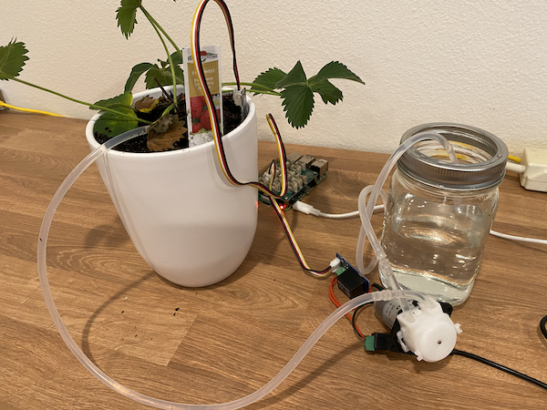

<!--
CO_OP_TRANSLATOR_METADATA:
{
  "original_hash": "f7bb24ba53fb627ddb38a8b24a05e594",
  "translation_date": "2025-08-28T15:17:07+00:00",
  "source_file": "2-farm/lessons/3-automated-plant-watering/README.md",
  "language_code": "sr"
}
-->
# Аутоматско заливање биљака


> Скица од [Нитије Нарасимхан](https://github.com/nitya). Кликните на слику за већу верзију.

Ова лекција је део [IoT за почетнике Пројекат 2 - серија о дигиталној пољопривреди](https://youtube.com/playlist?list=PLmsFUfdnGr3yCutmcVg6eAUEfsGiFXgcx) из [Microsoft Reactor](https://developer.microsoft.com/reactor/?WT.mc_id=academic-17441-jabenn).

[](https://youtu.be/g9FfZwv9R58)

## Квиз пре предавања

[Квиз пре предавања](https://black-meadow-040d15503.1.azurestaticapps.net/quiz/13)

## Увод

У претходној лекцији научили сте како да пратите влажност земљишта. У овој лекцији ћете научити како да направите основне компоненте аутоматског система за заливање који реагује на влажност земљишта. Такође ћете научити о времену - како сензори могу да захтевају време да реагују на промене и како актуатори могу да захтевају време да промене својства која сензори мере.

У овој лекцији обрадићемо:

* [Контрола уређаја велике снаге са IoT уређаја мале снаге](../../../../../2-farm/lessons/3-automated-plant-watering)
* [Контрола релеја](../../../../../2-farm/lessons/3-automated-plant-watering)
* [Контрола биљке преко MQTT](../../../../../2-farm/lessons/3-automated-plant-watering)
* [Време сензора и актуатора](../../../../../2-farm/lessons/3-automated-plant-watering)
* [Додавање времена серверу за контролу биљке](../../../../../2-farm/lessons/3-automated-plant-watering)

## Контрола уређаја велике снаге са IoT уређаја мале снаге

IoT уређаји користе низак напон. Иако је то довољно за сензоре и актуаторе мале снаге као што су LED диоде, то је премало за контролу већих уређаја, као што је пумпа за воду која се користи за наводњавање. Чак и мале пумпе које можете користити за собне биљке троше превише струје за IoT развојни комплет и могле би да оштете плочу.

> 🎓 Струја, мерена у амперима (A), представља количину електричне енергије која пролази кроз коло. Напон обезбеђује потисак, а струја је количина која се потискује. Више о струји можете прочитати на [страници о електричној струји на Википедији](https://wikipedia.org/wiki/Electric_current).

Решење за ово је да пумпа буде повезана на спољни извор напајања, а да се користи актуатор за укључивање пумпе, слично као што бисте укључили светло. Потребна је мала количина енергије (у облику енергије вашег тела) да ваш прст притисне прекидач, што повезује светло са електричном мрежом која ради на 110v/240v.


> 🎓 [Електрична мрежа](https://wikipedia.org/wiki/Mains_electricity) односи се на струју која се испоручује домовима и предузећима кроз националну инфраструктуру у многим деловима света.

✅ IoT уређаји обично могу да обезбеде 3.3V или 5V, са мање од 1 ампера (1A) струје. Упоредите то са електричном мрежом која је најчешће на 230V (120V у Северној Америци и 100V у Јапану) и може да обезбеди снагу за уређаје који троше 30A.

Постоји велики број актуатора који то могу да ураде, укључујући механичке уређаје које можете причврстити на постојеће прекидаче који имитирају прст који их укључује. Најпопуларнији је релеј.

### Релеји

Релеј је електромеханички прекидач који претвара електрични сигнал у механички покрет који укључује прекидач. Језгро релеја је електромагнет.

> 🎓 [Електромагнети](https://wikipedia.org/wiki/Electromagnet) су магнети који се стварају пропуштањем струје кроз калем жице. Када је струја укључена, калем постаје магнетизован. Када је струја искључена, калем губи магнетизам.


У релеју, контролно коло напаја електромагнет. Када је електромагнет укључен, он повлачи полугу која помера прекидач, затварајући пар контаката и завршавајући излазно коло.


Када је контролно коло искључено, електромагнет се искључује, ослобађајући полугу и отварајући контакте, искључујући излазно коло. Релеји су дигитални актуатори - висок сигнал релеју га укључује, низак сигнал га искључује.

Излазно коло може се користити за напајање додатног хардвера, као што је систем за наводњавање. IoT уређај може укључити релеј, завршавајући излазно коло које напаја систем за наводњавање, и биљке се заливају. IoT уређај затим може искључити релеј, прекидајући струју систему за наводњавање, искључујући воду.


У горњем видеу, релеј се укључује. LED диода на релеју светли да би указала да је укључен (неки релејни панели имају LED диоде које указују да ли је релеј укључен или искључен), и струја се шаље пумпи, укључујући је и пумпајући воду у биљку.

> 💁 Релеји се такође могу користити за пребацивање између два излазна кола уместо укључивања и искључивања једног. Како се полуга помера, она помера прекидач са завршетка једног излазног кола на завршетак другог излазног кола, обично делећи заједничку везу за напајање или заједничку везу за уземљење.

✅ Урадите истраживање: Постоји више типова релеја, са разликама као што су да ли контролно коло укључује или искључује релеј када се струја примени, или више излазних кола. Сазнајте више о овим различитим типовима.

Када се полуга помери, обично можете чути како прави контакт са електромагнетом уз јасно дефинисан звук клика.

> 💁 Релеј може бити ожичен тако да прављење везе заправо прекида струју релеју, искључујући релеј, што затим шаље струју релеју укључујући га поново, и тако даље. То значи да ће релеј кликнути изузетно брзо правећи зујање. Овако су радили неки од првих зујалица коришћених у електричним звонима на вратима.

### Снага релеја

Електромагнету није потребно много снаге да се активира и повуче полугу, може се контролисати помоћу 3.3V или 5V излазног напона са IoT развојног комплета. Излазно коло може носити много више снаге, у зависности од релеја, укључујући напон електричне мреже или чак веће нивое снаге за индустријску употребу. На овај начин IoT развојни комплет може контролисати систем за наводњавање, од мале пумпе за једну биљку, до масивног индустријског система за целу комерцијалну фарму.


Горња слика приказује Grove релеј. Контролно коло се повезује са IoT уређајем и укључује или искључује релеј користећи 3.3V или 5V. Излазно коло има два терминала, било који може бити напајање или уземљење. Излазно коло може да поднесе до 250V при 10A, што је довољно за низ уређаја који се напајају из електричне мреже. Можете набавити релеје који могу да поднесу чак и веће нивое снаге.


На горњој слици, струја се испоручује пумпи преко релеја. Црвена жица повезује +5V терминал USB напајања са једним терминалом излазног кола релеја, а друга црвена жица повезује други терминал излазног кола са пумпом. Црна жица повезује пумпу са уземљењем на USB напајању. Када се релеј укључи, он завршава коло, шаљући 5V пумпи, укључујући пумпу.

## Контрола релеја

Можете контролисати релеј са вашег IoT развојног комплета.

### Задатак - контрола релеја

Прођите кроз одговарајући водич за контролу релеја помоћу вашег IoT уређаја:

* [Arduino - Wio Terminal](wio-terminal-relay.md)
* [Рачунар на једној плочи - Raspberry Pi](pi-relay.md)
* [Рачунар на једној плочи - Виртуелни уређај](virtual-device-relay.md)

## Контрола биљке преко MQTT

До сада је ваш релеј контролисан директно од стране IoT уређаја на основу једног очитавања влажности земљишта. У комерцијалном систему за наводњавање, логика контроле ће бити централизована, омогућавајући доношење одлука о заливању користећи податке са више сензора, и омогућавајући промену било које конфигурације на једном месту. Да бисте симулирали ово, можете контролисати релеј преко MQTT.

### Задатак - контрола релеја преко MQTT

1. Додајте одговарајуће MQTT библиотеке/pip пакете и код вашем пројекту `soil-moisture-sensor` за повезивање на MQTT. Именујте ID клијента као `soilmoisturesensor_client` са вашим ID-ом као префиксом.

    > ⚠️ Можете се позвати на [упутства за повезивање на MQTT у пројекту 1, лекција 4 ако је потребно](../../../1-getting-started/lessons/4-connect-internet/README.md#connect-your-iot-device-to-mqtt).

1. Додајте одговарајући код уређаја за слање телеметрије са подешавањима влажности земљишта. За поруку телеметрије, именујте својство `soil_moisture`.

    > ⚠️ Можете се позвати на [упутства за слање телеметрије на MQTT у пројекту 1, лекција 4 ако је потребно](../../../1-getting-started/lessons/4-connect-internet/README.md#send-telemetry-from-your-iot-device).

1. Направите локални серверски код за претплату на телеметрију и слање команде за контролу релеја у фасцикли названој `soil-moisture-sensor-server`. Именујте својство у поруци команде `relay_on`, и поставите ID клијента као `soilmoisturesensor_server` са вашим ID-ом као префиксом. Задржите исту структуру као код серверског кода који сте написали за пројекат 1, лекција 4 јер ћете додавати овај код касније у овој лекцији.

    > ⚠️ Можете се позвати на [упутства за слање телеметрије на MQTT](../../../1-getting-started/lessons/4-connect-internet/README.md#write-the-server-code) и [слање команди преко MQTT](../../../1-getting-started/lessons/4-connect-internet/README.md#send-commands-to-the-mqtt-broker) у пројекту 1, лекција 4 ако је потребно.

1. Додајте одговарајући код уређаја за контролу релеја из примљених команди, користећи својство `relay_on` из поруке. Пошаљите true за `relay_on` ако је `soil_moisture` већи од 450, иначе пошаљите false, исто као логика коју сте додали за IoT уређај раније.

    > ⚠️ Можете се позвати на [упутства за реаговање на команде из MQTT у пројекту 1, лекција 4 ако је потребно](../../../1-getting-started/lessons/4-connect-internet/README.md#handle-commands-on-the-iot-device).

> 💁 Овај код можете пронаћи у фасцикли [code-mqtt](../../../../../2-farm/lessons/3-automated-plant-watering/code-mqtt).

Уверите се да код ради на вашем уређају и локалном серверу, и тестирајте га променом нивоа влажности земљишта, било променом вредности које шаље виртуелни сензор, или променом нивоа влажности земљишта додавањем воде или уклањањем сензора из земљишта.

## Време сензора и актуатора

У лекцији 3 направили сте ноћно светло - LED диоду која се укључује чим сензор светлости открије низак ниво светлости. Сензор светлости је тренутно открио промену нивоа светлости, и уређај је могао брзо да реагује, ограничен само дужином кашњења у функцији `loop` или `while True:` петљи. Као IoT програмер, не можете увек рачунати на тако брз повратни циклус.

### Време за влажност земљишта

Ако сте радили претходну лекцију о влажности земљишта користећи физички сензор, приметили сте да је било потребно неколико секунди да очитавање влажности земљишта падне након што сте залили биљку. Ово није зато што је сензор спор, већ зато што је потребно време да вода продре кроз земљиште.
💁 Ако сте заливали превише близу сензора, можда сте приметили да је очитавање брзо пало, а затим се поново повећало – ово је узроковано тиме што се вода у близини сензора шири кроз остатак земљишта, смањујући влагу земљишта у близини сензора.


На дијаграму изнад, очитавање влажности земљишта показује 658. Биљка се залива, али ово очитавање се не мења одмах, јер вода још није стигла до сензора. Заливање може чак бити завршено пре него што вода стигне до сензора, а вредност пада како би одразила нови ниво влажности.

Ако пишете код за контролу система за наводњавање преко релеја на основу нивоа влажности земљишта, морали бисте узети у обзир ово кашњење и изградити паметније временско управљање у вашем IoT уређају.

✅ Одвојите тренутак да размислите како бисте могли то да урадите.

### Контрола времена сензора и актуатора

Замислите да сте добили задатак да изградите систем за наводњавање фарме. На основу типа земљишта, идеалан ниво влажности земљишта за узгајане биљке утврђен је као аналогно очитавање напона од 400-450.

Могли бисте програмирати уређај на исти начин као ноћно светло - све време док сензор очитава изнад 450, укључите релеј да укључи пумпу. Проблем је што води треба времена да стигне од пумпе, кроз земљиште до сензора. Сензор ће зауставити воду када детектује ниво од 450, али ниво воде ће наставити да пада јер пумпана вода наставља да продире кроз земљиште. Крајњи резултат је расипање воде и ризик од оштећења корена.

✅ Запамтите - превише воде може бити исто толико лоше за биљке као и премало, и расипа драгоцен ресурс.

Боље решење је разумети да постоји кашњење између укључивања актуатора и промене својства које сензор очитава. То значи да не само да сензор треба да сачека неко време пре поновног мерења вредности, већ актуатор треба да се искључи на неко време пре него што се изврши следеће мерење сензора.

Колико дуго релеј треба да буде укључен сваки пут? Боље је бити опрезан и укључити релеј само на кратко време, затим сачекати да вода продре кроз земљиште, па поново проверити нивое влажности. На крају крајева, увек можете поново укључити пумпу да додате више воде, али не можете уклонити воду из земљишта.

> 💁 Ова врста контроле времена је веома специфична за IoT уређај који градите, својство које мерите и сензоре и актуаторе који се користе.



На пример, имам јагоду са сензором влажности земљишта и пумпом коју контролише релеј. Приметио сам да када додам воду, потребно је око 20 секунди да се очитавање влажности земљишта стабилизује. То значи да морам искључити релеј и сачекати 20 секунди пре него што проверим нивое влажности. Радије бих имао премало воде него превише - увек могу поново укључити пумпу, али не могу извадити воду из биљке.


То значи да би најбољи процес био циклус заливања који изгледа овако:

* Укључите пумпу на 5 секунди
* Сачекајте 20 секунди
* Проверите влажност земљишта
* Ако је ниво и даље изнад онога што је потребно, поновите горе наведене кораке

5 секунди може бити предуго за пумпу, посебно ако су нивои влажности само мало изнад потребног нивоа. Најбољи начин да знате које време да користите је да пробате, а затим прилагодите када имате податке сензора, уз сталну повратну петљу. Ово може довести до прецизнијег временског управљања, као што је укључивање пумпе на 1 секунду за сваких 100 изнад потребног нивоа влажности земљишта, уместо фиксних 5 секунди.

✅ Урадите мало истраживања: Да ли постоје други временски фактори које треба узети у обзир? Могу ли се биљке заливати било када када је влажност земљишта прениска, или постоје одређена доба дана која су добра или лоша за заливање биљака?

> 💁 Прогнозе времена такође могу бити узете у обзир приликом контроле аутоматизованих система за заливање за спољашње узгајање. Ако се очекује киша, онда се заливање може одложити до након што киша престане. У том тренутку земљиште може бити довољно влажно да не треба заливање, што је много ефикасније него расипати воду заливањем непосредно пре кише.

## Додајте временско управљање вашем серверу за контролу биљака

Код сервера може бити модификован да дода контролу око временског циклуса заливања и чекања да се нивои влажности земљишта промене. Логика сервера за контролу времена релеја је:

1. Примљена телеметријска порука
1. Проверите ниво влажности земљишта
1. Ако је у реду, не радите ништа. Ако је очитавање превисоко (што значи да је влажност земљишта прениска), онда:
    1. Пошаљите команду за укључивање релеја
    1. Сачекајте 5 секунди
    1. Пошаљите команду за искључивање релеја
    1. Сачекајте 20 секунди да се нивои влажности земљишта стабилизују

Циклус заливања, процес од примања телеметријске поруке до спремности за поновну обраду нивоа влажности земљишта, траје око 25 секунди. Телеметријске поруке шаљемо сваких 10 секунди, тако да постоји преклапање где се порука прима док сервер чека да се нивои влажности земљишта стабилизују, што би могло започети нови циклус заливања.

Постоје две опције за решавање овог проблема:

* Промените код IoT уређаја да шаље телеметрију само једном у минуту, тако да ће циклус заливања бити завршен пре него што се пошаље следећа порука
* Одјавите се са телеметрије током циклуса заливања

Прва опција није увек добро решење за велике фарме. Фармер можда жели да прикупи нивое влажности земљишта док се земљиште залива ради касније анализе, на пример да буде свестан протока воде у различитим областима на фарми како би водио прецизније заливање. Друга опција је боља - код само игнорише телеметрију када не може да је користи, али телеметрија је и даље ту за друге услуге које могу да се претплате на њу.

> 💁 IoT подаци се не шаљу само са једног уређаја на једну услугу, већ многи уређаји могу слати податке брокеру, а многе услуге могу слушати податке са брокера. На пример, једна услуга може слушати податке о влажности земљишта и чувати их у бази података за каснију анализу. Друга услуга може такође слушати исту телеметрију за контролу система за наводњавање.

### Задатак - додајте временско управљање вашем серверу за контролу биљака

Ажурирајте код вашег сервера да укључи релеј на 5 секунди, а затим сачека 20 секунди.

1. Отворите фасциклу `soil-moisture-sensor-server` у VS Code ако већ није отворена. Уверите се да је виртуелно окружење активирано.

1. Отворите датотеку `app.py`

1. Додајте следећи код у датотеку `app.py` испод постојећих увоза:

    ```python
    import threading
    ```

    Ова изјава увози `threading` из Python библиотека, што омогућава Python-у да извршава други код док чека.

1. Додајте следећи код пре функције `handle_telemetry` која обрађује телеметријске поруке примљене од стране серверског кода:

    ```python
    water_time = 5
    wait_time = 20
    ```

    Ово дефинише колико дуго треба да ради релеј (`water_time`), и колико дуго треба чекати након тога да се провери влажност земљишта (`wait_time`).

1. Испод овог кода, додајте следеће:

    ```python
    def send_relay_command(client, state):
        command = { 'relay_on' : state }
        print("Sending message:", command)
        client.publish(server_command_topic, json.dumps(command))
    ```

    Овај код дефинише функцију названу `send_relay_command` која шаље команду преко MQTT-а за контролу релеја. Телеметрија се креира као речник, а затим се конвертује у JSON стринг. Вредност која се прослеђује у `state` одређује да ли релеј треба да буде укључен или искључен.

1. Након функције `send_relay_code`, додајте следећи код:

    ```python
    def control_relay(client):
        print("Unsubscribing from telemetry")
        mqtt_client.unsubscribe(client_telemetry_topic)
    
        send_relay_command(client, True)
        time.sleep(water_time)
        send_relay_command(client, False)
    
        time.sleep(wait_time)
    
        print("Subscribing to telemetry")
        mqtt_client.subscribe(client_telemetry_topic)
    ```

    Ово дефинише функцију за контролу релеја на основу потребног временског управљања. Она почиње одјављивањем са телеметрије тако да поруке о влажности земљишта не буду обрађене док се заливање дешава. Затим шаље команду за укључивање релеја. Затим чека `water_time` пре него што пошаље команду за искључивање релеја. На крају чека да се нивои влажности земљишта стабилизују током `wait_time` секунди. Затим се поново претплаћује на телеметрију.

1. Промените функцију `handle_telemetry` на следеће:

    ```python
    def handle_telemetry(client, userdata, message):
        payload = json.loads(message.payload.decode())
        print("Message received:", payload)
    
        if payload['soil_moisture'] > 450:
            threading.Thread(target=control_relay, args=(client,)).start()
    ```

    Овај код проверава ниво влажности земљишта. Ако је већи од 450, земљишту је потребно заливање, па позива функцију `control_relay`. Ова функција се извршава на посебној нити, која ради у позадини.

1. Уверите се да ваш IoT уређај ради, а затим покрените овај код. Промените нивое влажности земљишта и посматрајте шта се дешава са релејем - требало би да се укључи на 5 секунди, а затим остане искључен најмање 20 секунди, укључујући се само ако нивои влажности земљишта нису довољни.

    ```output
    (.venv) ➜  soil-moisture-sensor-server ✗ python app.py
    Message received: {'soil_moisture': 457}
    Unsubscribing from telemetry
    Sending message: {'relay_on': True}
    Sending message: {'relay_on': False}
    Subscribing to telemetry
    Message received: {'soil_moisture': 302}
    ```

    Добар начин да тестирате ово у симулираном систему за наводњавање је да користите суво земљиште, а затим ручно сипате воду док је релеј укључен, престајући да сипате када се релеј искључи.

> 💁 Овај код можете пронаћи у фасцикли [code-timing](../../../../../2-farm/lessons/3-automated-plant-watering/code-timing).

> 💁 Ако желите да користите пумпу за изградњу стварног система за наводњавање, можете користити [6V водену пумпу](https://www.seeedstudio.com/6V-Mini-Water-Pump-p-1945.html) са [USB терминалним напајањем](https://www.adafruit.com/product/3628). Уверите се да је напајање ка или од пумпе повезано преко релеја.

---

## 🚀 Изазов

Можете ли смислити неке друге IoT или електричне уређаје који имају сличан проблем где је потребно време да резултати актуатора стигну до сензора? Вероватно имате неколико у вашем дому или школи.

* Која својства они мере?
* Колико времена је потребно да се својство промени након што се актуатор користи?
* Да ли је у реду да се својство промени преко потребне вредности?
* Како се може вратити на потребну вредност ако је потребно?

## Квиз након предавања

[Квиз након предавања](https://black-meadow-040d15503.1.azurestaticapps.net/quiz/14)

## Преглед и самостално учење

* Прочитајте више о релејима, укључујући њихову историјску употребу у телефонским централама, на [страници о релејима на Википедији](https://wikipedia.org/wiki/Relay).

## Задатак

[Изградите ефикаснији циклус заливања](assignment.md)

---

**Одрицање од одговорности**:  
Овај документ је преведен коришћењем услуге за превођење помоћу вештачке интелигенције [Co-op Translator](https://github.com/Azure/co-op-translator). Иако се трудимо да обезбедимо тачност, молимо вас да имате у виду да аутоматски преводи могу садржати грешке или нетачности. Оригинални документ на његовом изворном језику треба сматрати ауторитативним извором. За критичне информације препоручује се професионални превод од стране људи. Не преузимамо одговорност за било каква погрешна тумачења или неспоразуме који могу настати услед коришћења овог превода.