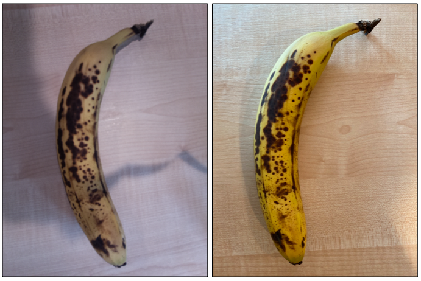

<!--
CO_OP_TRANSLATOR_METADATA:
{
  "original_hash": "557f4ee96b752e0651d2e6e74aa6bd14",
  "translation_date": "2025-08-28T12:23:29+00:00",
  "source_file": "4-manufacturing/lessons/2-check-fruit-from-device/README.md",
  "language_code": "sr"
}
-->
# Провера квалитета воћа помоћу IoT уређаја


> Скица коју је направила [Нитија Нарасимхан](https://github.com/nitya). Кликните на слику за већу верзију.

## Квиз пре предавања

[Квиз пре предавања](https://black-meadow-040d15503.1.azurestaticapps.net/quiz/31)

## Увод

У претходној лекцији сте научили о класификаторима слика и како их обучити да препознају добро и лоше воће. Да бисте користили овај класификатор слика у IoT апликацији, потребно је да будете у могућности да снимите слику помоћу неке врсте камере и пошаљете ту слику у облак ради класификације.

У овој лекцији ћете научити о сензорима камера и како их користити са IoT уређајем за снимање слика. Такође ћете научити како да позовете класификатор слика са свог IoT уређаја.

У овој лекцији ћемо обрадити:

* [Сензори камера](../../../../../4-manufacturing/lessons/2-check-fruit-from-device)
* [Снимање слике помоћу IoT уређаја](../../../../../4-manufacturing/lessons/2-check-fruit-from-device)
* [Објављивање класификатора слика](../../../../../4-manufacturing/lessons/2-check-fruit-from-device)
* [Класификација слика са IoT уређаја](../../../../../4-manufacturing/lessons/2-check-fruit-from-device)
* [Унапређење модела](../../../../../4-manufacturing/lessons/2-check-fruit-from-device)

## Сензори камера

Сензори камера, како и само име каже, су камере које можете повезати са својим IoT уређајем. Они могу снимати статичне слике или стримовати видео. Неки враћају необрађене податке о слици, док други компресују податке у датотеке као што су JPEG или PNG. Камере које раде са IoT уређајима обично су мање и нижег квалитета него што сте можда навикли, али постоје и камере високе резолуције које могу парирати врхунским телефонима. Можете набавити различите заменљиве објективе, поставке са више камера, инфрацрвене термалне камере или UV камере.


Већина сензора камера користи сензоре слике где је сваки пиксел фотодиода. Објектив фокусира слику на сензор слике, а хиљаде или милиони фотодиода детектују светлост која пада на њих и бележе то као податке о пикселима.

> 💁 Објективи обрћу слике, а сензор камере их затим враћа у исправан положај. Исто се дешава и у вашим очима - оно што видите детектује се наопако на задњем делу ока, а ваш мозак то исправља.

> 🎓 Сензор слике је познат као сензор активних пиксела (APS), а најпопуларнији тип APS је комплементарни метал-оксид полупроводнички сензор, или CMOS. Можда сте чули термин CMOS сензор који се користи за сензоре камера.

Сензори камера су дигитални сензори који шаљу податке о слици у дигиталном облику, обично уз помоћ библиотеке која омогућава комуникацију. Камере се повезују користећи протоколе као што је SPI како би омогућиле слање великих количина података - слике су знатно веће од појединачних бројева са сензора као што је сензор температуре.

✅ Која су ограничења у вези са величином слике код IoT уређаја? Размислите о ограничењима, посебно код хардвера микроконтролера.

## Снимање слике помоћу IoT уређаја

Можете користити свој IoT уређај за снимање слике која ће бити класификована.

### Задатак - снимање слике помоћу IoT уређаја

Пратите одговарајући водич за снимање слике помоћу свог IoT уређаја:

* [Arduino - Wio Terminal](wio-terminal-camera.md)
* [Рачунар са једном плочом - Raspberry Pi](pi-camera.md)
* [Рачунар са једном плочом - Виртуелни уређај](virtual-device-camera.md)

## Објављивање класификатора слика

Класификатор слика сте обучили у претходној лекцији. Пре него што га можете користити са својим IoT уређајем, потребно је да објавите модел.

### Итерације модела

Када сте обучавали свој модел у претходној лекцији, можда сте приметили да картица **Performance** приказује итерације са стране. Када сте први пут обучили модел, видели сте *Iteration 1* током обуке. Када сте унапредили модел користећи слике за предвиђање, видели сте *Iteration 2* током обуке.

Сваки пут када обучите модел, добијате нову итерацију. Ово је начин да пратите различите верзије вашег модела обучене на различитим скуповима података. Када радите **Quick Test**, постоји падајући мени који можете користити за избор итерације, тако да можете упоредити резултате из више итерација.

Када будете задовољни са итерацијом, можете је објавити како би била доступна за коришћење из спољашњих апликација. На овај начин можете имати објављену верзију коју користе ваши уређаји, а затим радити на новој верзији кроз више итерација и објавити је када будете задовољни.

### Задатак - објављивање итерације

Итерације се објављују из портала Custom Vision.

1. Покрените портал Custom Vision на [CustomVision.ai](https://customvision.ai) и пријавите се ако већ нисте. Затим отворите свој пројекат `fruit-quality-detector`.

1. Изаберите картицу **Performance** из опција на врху.

1. Изаберите најновију итерацију са листе *Iterations* са стране.

1. Кликните на дугме **Publish** за итерацију.

    

1. У дијалогу *Publish Model*, подесите *Prediction resource* на ресурс `fruit-quality-detector-prediction` који сте креирали у претходној лекцији. Оставите име као `Iteration2` и кликните на дугме **Publish**.

1. Када се објави, кликните на дугме **Prediction URL**. Ово ће приказати детаље о Prediction API-ју, који ће вам бити потребни за позивање модела са вашег IoT уређаја. Доњи део је означен са *If you have an image file*, и то су детаљи који су вам потребни. Копирајте URL који је приказан, који ће изгледати отприлике овако:

    ```output
    https://<location>.api.cognitive.microsoft.com/customvision/v3.0/Prediction/<id>/classify/iterations/Iteration2/image
    ```

    Где ће `<location>` бити локација коју сте користили приликом креирања ресурса Custom Vision, а `<id>` ће бити дугачак ID састављен од слова и бројева.

    Такође копирајте вредност *Prediction-Key*. Ово је сигурносни кључ који морате проследити када позивате модел. Само апликације које проследе овај кључ могу користити модел, све друге апликације ће бити одбијене.

    

✅ Када се објави нова итерација, она ће имати другачије име. Како мислите да бисте променили итерацију коју IoT уређај користи?

## Класификација слика са IoT уређаја

Сада можете користити ове детаље за повезивање како бисте позвали класификатор слика са свог IoT уређаја.

### Задатак - класификација слика са IoT уређаја

Пратите одговарајући водич за класификацију слика помоћу свог IoT уређаја:

* [Arduino - Wio Terminal](wio-terminal-classify-image.md)
* [Рачунар са једном плочом - Raspberry Pi/Виртуелни IoT уређај](single-board-computer-classify-image.md)

## Унапређење модела

Можда ћете приметити да резултати које добијате када користите камеру повезану са вашим IoT уређајем не одговарају вашим очекивањима. Предвиђања нису увек тачна као када користите слике отпремљене са вашег рачунара. Ово је зато што је модел обучен на различитим подацима од оних који се користе за предвиђања.

Да бисте добили најбоље резултате за класификатор слика, желите да обучите модел са сликама које су што сличније сликама које се користе за предвиђања. Ако сте, на пример, користили камеру телефона за снимање слика за обуку, квалитет слике, оштрина и боја ће бити другачији од камере повезане са IoT уређајем.



На слици изнад, слика банане са леве стране је снимљена помоћу Raspberry Pi камере, док је слика са десне стране снимљена исте банане на истој локацији помоћу iPhone-а. Приметна је разлика у квалитету - слика са iPhone-а је оштрија, са светлијим бојама и већим контрастом.

✅ Шта још може узроковати да слике снимљене вашим IoT уређајем имају нетачна предвиђања? Размислите о окружењу у којем се IoT уређај може користити, који фактори могу утицати на снимљену слику?

Да бисте унапредили модел, можете га поново обучити користећи слике снимљене са IoT уређаја.

### Задатак - унапређење модела

1. Класификујте више слика зрелог и незрелог воћа помоћу свог IoT уређаја.

1. У порталу Custom Vision, поново обучите модел користећи слике на картици *Predictions*.

    > ⚠️ Можете се подсетити [упутстава за поновну обуку класификатора из лекције 1 ако је потребно](../1-train-fruit-detector/README.md#retrain-your-image-classifier).

1. Ако ваше слике изгледају веома другачије од оригиналних које су коришћене за обуку, можете обрисати све оригиналне слике тако што ћете их изабрати на картици *Training Images* и кликнути на дугме **Delete**. Да бисте изабрали слику, померите курсор преко ње и појавиће се квачице, изаберите ту квачицу да бисте изабрали или поништили избор слике.

1. Обучите нову итерацију модела и објавите је користећи горе наведене кораке.

1. Ажурирајте URL крајње тачке у свом коду и поново покрените апликацију.

1. Понављајте ове кораке док не будете задовољни резултатима предвиђања.

---

## 🚀 Изазов

Колико резолуција слике или осветљење утичу на предвиђање?

Покушајте да промените резолуцију слика у коду свог уређаја и видите да ли то утиче на квалитет слика. Такође покушајте да промените осветљење.

Ако бисте креирали производни уређај за продају фармама или фабрикама, како бисте осигурали да увек даје конзистентне резултате?

## Квиз након предавања

[Квиз након предавања](https://black-meadow-040d15503.1.azurestaticapps.net/quiz/32)

## Преглед и самостално учење

Свој модел Custom Vision сте обучили користећи портал. Ово зависи од доступности слика - а у стварном свету можда нећете моћи да добијете податке за обуку који одговарају ономе што камера на вашем уређају снима. Ово можете заобићи тако што ћете обучавати директно са свог уређаја користећи API за обуку, како бисте обучили модел користећи слике снимљене са вашег IoT уређаја.

* Прочитајте више о API-ју за обуку у [брзом старту за коришћење Custom Vision SDK](https://docs.microsoft.com/azure/cognitive-services/custom-vision-service/quickstarts/image-classification?WT.mc_id=academic-17441-jabenn&tabs=visual-studio&pivots=programming-language-python)

## Задатак

[Одговорите на резултате класификације](assignment.md)

---

**Одрицање од одговорности**:  
Овај документ је преведен коришћењем услуге за превођење помоћу вештачке интелигенције [Co-op Translator](https://github.com/Azure/co-op-translator). Иако се трудимо да превод буде тачан, молимо вас да имате у виду да аутоматизовани преводи могу садржати грешке или нетачности. Оригинални документ на његовом изворном језику треба сматрати меродавним извором. За критичне информације препоручује се професионални превод од стране људи. Не преузимамо одговорност за било каква погрешна тумачења или неспоразуме који могу настати услед коришћења овог превода.