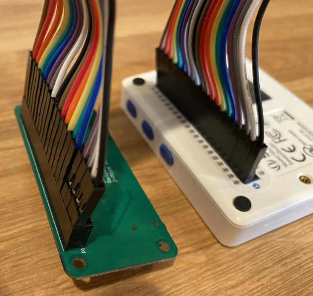
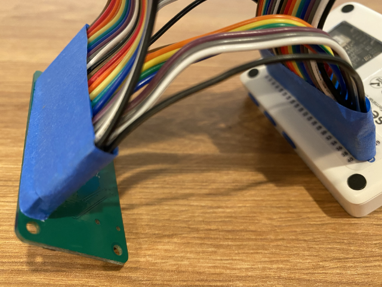

<!--
CO_OP_TRANSLATOR_METADATA:
{
  "original_hash": "93d352de36526b8990e41dd538100324",
  "translation_date": "2025-08-28T12:55:18+00:00",
  "source_file": "6-consumer/lessons/1-speech-recognition/wio-terminal-microphone.md",
  "language_code": "sr"
}
-->
# Конфигуришите свој микрофон и звучнике - Wio Terminal

У овом делу лекције, додаћете звучнике свом Wio Terminal-у. Wio Terminal већ има уграђен микрофон, који се може користити за снимање говора.

## Хардвер

Wio Terminal већ има уграђен микрофон, који се може користити за снимање звука за препознавање говора.

Да бисте додали звучник, можете користити [ReSpeaker 2-Mics Pi Hat](https://www.seeedstudio.com/ReSpeaker-2-Mics-Pi-HAT.html). Ово је екстерна плоча која садржи 2 MEMS микрофона, као и конектор за звучник и прикључак за слушалице.

Биће вам потребне или слушалице, звучник са 3.5мм прикључком, или звучник са JST конектором, као што је [Mono Enclosed Speaker - 2W 6 Ohm](https://www.seeedstudio.com/Mono-Enclosed-Speaker-2W-6-Ohm-p-2832.html).

За повезивање ReSpeaker 2-Mics Pi Hat-а биће вам потребни 40 пин-то-пин (такође познати као мушко-мушко) каблови за повезивање.

> 💁 Ако сте вешти у лемљењу, можете користити [40 Pin Raspberry Pi Hat Adapter Board For Wio Terminal](https://www.seeedstudio.com/40-Pin-Raspberry-Pi-Hat-Adapter-Board-For-Wio-Terminal-p-4730.html) за повезивање ReSpeaker-а.

Такође ће вам бити потребна SD картица за преузимање и репродукцију звука. Wio Terminal подржава SD картице до 16GB капацитета, које морају бити форматиране као FAT32 или exFAT.

### Задатак - повежите ReSpeaker Pi Hat

1. Са искљученим Wio Terminal-ом, повежите ReSpeaker 2-Mics Pi Hat са Wio Terminal-ом користећи каблове за повезивање и GPIO прикључке на задњој страни Wio Terminal-а:

    Пинови треба да буду повезани на следећи начин:

    

1. Поставите ReSpeaker и Wio Terminal тако да GPIO прикључци буду окренути нагоре, са леве стране.

1. Почните од горњег левог прикључка на GPIO прикључку ReSpeaker-а. Повежите пин-то-пин кабл од горњег левог прикључка ReSpeaker-а до горњег левог прикључка Wio Terminal-а.

1. Понављајте овај процес низ леву страну GPIO прикључака. Уверите се да су пинови чврсто повезани.

    

    

    > 💁 Ако су ваши каблови за повезивање у облику траке, држите их заједно - то ће олакшати осигурање да су сви каблови повезани редом.

1. Поновите процес користећи десне GPIO прикључке на ReSpeaker-у и Wio Terminal-у. Ови каблови треба да иду око већ постављених каблова.

    

    

    > 💁 Ако су ваши каблови за повезивање у облику траке, поделите их у две траке. Провуците их са обе стране постојећих каблова.

    > 💁 Можете користити лепљиву траку да држите пинове у блоку како бисте спречили испадање током повезивања.
    >
    > 

1. Биће вам потребно да додате звучник.

    * Ако користите звучник са JST каблом, повежите га са JST портом на ReSpeaker-у.

      

    * Ако користите звучник са 3.5мм прикључком или слушалице, уметните их у 3.5мм прикључак.

      

### Задатак - подесите SD картицу

1. Повежите SD картицу са својим рачунаром, користећи екстерни читач ако ваш рачунар нема слот за SD картице.

1. Форматирајте SD картицу користећи одговарајући алат на вашем рачунару, водећи рачуна да користите FAT32 или exFAT фајл систем.

1. Уметните SD картицу у слот за SD картице на левој страни Wio Terminal-а, одмах испод дугмета за укључивање. Уверите се да је картица потпуно уметнута и да кликне - можда ће вам бити потребан танак алат или друга SD картица да је потиснете до краја.

    

    > 💁 Да бисте извадили SD картицу, потребно је благо је потиснути унутра, након чега ће искочити. Биће вам потребан танак алат, као што је равни шрафцигер или друга SD картица.

---

**Одрицање од одговорности**:  
Овај документ је преведен коришћењем услуге за превођење помоћу вештачке интелигенције [Co-op Translator](https://github.com/Azure/co-op-translator). Иако се трудимо да обезбедимо тачност, молимо вас да имате у виду да аутоматски преводи могу садржати грешке или нетачности. Оригинални документ на његовом изворном језику треба сматрати ауторитативним извором. За критичне информације препоручује се професионални превод од стране људи. Не преузимамо одговорност за било каква погрешна тумачења или неспоразуме који могу настати услед коришћења овог превода.