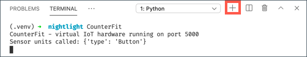

<!--
CO_OP_TRANSLATOR_METADATA:
{
  "original_hash": "52b4de6144b2efdced7797a5339d6035",
  "translation_date": "2025-08-27T21:57:25+00:00",
  "source_file": "1-getting-started/lessons/1-introduction-to-iot/virtual-device.md",
  "language_code": "sv"
}
-->
# Virtuell enkortsdator

Istället för att köpa en IoT-enhet tillsammans med sensorer och ställdon kan du använda din dator för att simulera IoT-hårdvara. [CounterFit-projektet](https://github.com/CounterFit-IoT/CounterFit) låter dig köra en app lokalt som simulerar IoT-hårdvara som sensorer och ställdon, och du kan komma åt dessa från lokal Python-kod som skrivs på samma sätt som om du skulle använda en Raspberry Pi med fysisk hårdvara.

## Installation

För att använda CounterFit behöver du installera viss gratis programvara på din dator.

### Uppgift

Installera den nödvändiga programvaran.

1. Installera Python. Se [Pythons nedladdningssida](https://www.python.org/downloads/) för instruktioner om hur du installerar den senaste versionen av Python.

1. Installera Visual Studio Code (VS Code). Detta är den editor du kommer att använda för att skriva din virtuella enhetskod i Python. Se [VS Code-dokumentationen](https://code.visualstudio.com?WT.mc_id=academic-17441-jabenn) för instruktioner om hur du installerar VS Code.

    > 💁 Du är fri att använda vilken Python-IDE eller editor du föredrar för dessa lektioner, men instruktionerna kommer att baseras på användning av VS Code.

1. Installera VS Code-tillägget Pylance. Detta är ett tillägg för VS Code som ger stöd för Python-språket. Se [Pylance-tilläggets dokumentation](https://marketplace.visualstudio.com/items?WT.mc_id=academic-17441-jabenn&itemName=ms-python.vscode-pylance) för instruktioner om hur du installerar detta tillägg i VS Code.

Instruktionerna för att installera och konfigurera CounterFit-appen kommer att ges vid rätt tidpunkt i uppdragsinstruktionerna, eftersom den installeras per projekt.

## Hello world

Det är traditionellt att när man börjar med ett nytt programmeringsspråk eller en ny teknik skapa en "Hello World"-applikation – en liten applikation som skriver ut något som texten `"Hello World"` för att visa att alla verktyg är korrekt konfigurerade.

Hello World-appen för den virtuella IoT-hårdvaran kommer att säkerställa att du har Python och Visual Studio Code korrekt installerade. Den kommer också att ansluta till CounterFit för de virtuella IoT-sensorerna och ställdonen. Den kommer inte att använda någon hårdvara, utan bara ansluta för att bevisa att allt fungerar.

Denna app kommer att finnas i en mapp som heter `nightlight`, och den kommer att återanvändas med olika kod i senare delar av detta uppdrag för att bygga nattlampa-applikationen.

### Konfigurera en virtuell Python-miljö

En av de kraftfulla funktionerna i Python är möjligheten att installera [Pip-paket](https://pypi.org) – dessa är paket med kod skrivna av andra och publicerade på Internet. Du kan installera ett Pip-paket på din dator med ett kommando och sedan använda det paketet i din kod. Du kommer att använda Pip för att installera ett paket för att kommunicera med CounterFit.

Som standard, när du installerar ett paket, är det tillgängligt överallt på din dator, och detta kan leda till problem med paketversioner – till exempel att en applikation är beroende av en version av ett paket som slutar fungera när du installerar en ny version för en annan applikation. För att undvika detta problem kan du använda en [virtuell Python-miljö](https://docs.python.org/3/library/venv.html), i princip en kopia av Python i en dedikerad mapp, och när du installerar Pip-paket installeras de bara i den mappen.

> 💁 Om du använder en Raspberry Pi så konfigurerade du inte en virtuell miljö på den enheten för att hantera Pip-paket, utan du använder globala paket, eftersom Grove-paketen installeras globalt av installationsskriptet.

#### Uppgift – konfigurera en virtuell Python-miljö

Konfigurera en virtuell Python-miljö och installera Pip-paketen för CounterFit.

1. Från din terminal eller kommandorad, kör följande på en plats du väljer för att skapa och navigera till en ny katalog:

    ```sh
    mkdir nightlight
    cd nightlight
    ```

1. Kör nu följande för att skapa en virtuell miljö i `.venv`-mappen:

    ```sh
    python3 -m venv .venv
    ```

    > 💁 Du måste uttryckligen kalla på `python3` för att skapa den virtuella miljön, ifall du har Python 2 installerat utöver Python 3 (den senaste versionen). Om du har Python 2 installerat kommer anropet `python` att använda Python 2 istället för Python 3.

1. Aktivera den virtuella miljön:

    * På Windows:
        * Om du använder Kommandotolken eller Kommandotolken via Windows Terminal, kör:

            ```cmd
            .venv\Scripts\activate.bat
            ```

        * Om du använder PowerShell, kör:

            ```powershell
            .\.venv\Scripts\Activate.ps1
            ```

            > Om du får ett felmeddelande om att körning av skript är inaktiverad på detta system, måste du aktivera körning av skript genom att ställa in en lämplig exekveringspolicy. Du kan göra detta genom att starta PowerShell som administratör och sedan köra följande kommando:

            ```powershell
            Set-ExecutionPolicy -ExecutionPolicy Unrestricted
            ```

            Skriv `Y` när du ombeds bekräfta. Starta sedan om PowerShell och försök igen.

            Du kan återställa denna exekveringspolicy vid ett senare tillfälle om det behövs. Du kan läsa mer om detta på [sidan om exekveringspolicyer på Microsoft Docs](https://docs.microsoft.com/powershell/module/microsoft.powershell.core/about/about_execution_policies?WT.mc_id=academic-17441-jabenn).

    * På macOS eller Linux, kör:

        ```cmd
        source ./.venv/bin/activate
        ```

    > 💁 Dessa kommandon bör köras från samma plats där du körde kommandot för att skapa den virtuella miljön. Du behöver aldrig navigera in i `.venv`-mappen, du bör alltid köra aktiveringskommandot och alla kommandon för att installera paket eller köra kod från mappen du var i när du skapade den virtuella miljön.

1. När den virtuella miljön har aktiverats kommer standardkommandot `python` att köra den version av Python som användes för att skapa den virtuella miljön. Kör följande för att få versionen:

    ```sh
    python --version
    ```

    Utdata bör innehålla följande:

    ```output
    (.venv) ➜  nightlight python --version
    Python 3.9.1
    ```

    > 💁 Din Python-version kan vara annorlunda – så länge den är version 3.6 eller högre är det bra. Om inte, ta bort denna mapp, installera en nyare version av Python och försök igen.

1. Kör följande kommandon för att installera Pip-paketen för CounterFit. Dessa paket inkluderar huvudappen CounterFit samt shims för Grove-hårdvara. Dessa shims låter dig skriva kod som om du programmerade med fysiska sensorer och ställdon från Grove-ekosystemet men anslutna till virtuella IoT-enheter.

    ```sh
    pip install CounterFit
    pip install counterfit-connection
    pip install counterfit-shims-grove
    ```

    Dessa Pip-paket kommer endast att installeras i den virtuella miljön och kommer inte att vara tillgängliga utanför denna.

### Skriv koden

När den virtuella Python-miljön är klar kan du skriva koden för "Hello World"-applikationen.

#### Uppgift – skriv koden

Skapa en Python-applikation som skriver ut `"Hello World"` till konsolen.

1. Från din terminal eller kommandorad, kör följande inuti den virtuella miljön för att skapa en Python-fil som heter `app.py`:

    * På Windows, kör:

        ```cmd
        type nul > app.py
        ```

    * På macOS eller Linux, kör:

        ```cmd
        touch app.py
        ```

1. Öppna den aktuella mappen i VS Code:

    ```sh
    code .
    ```

    > 💁 Om din terminal returnerar `command not found` på macOS betyder det att VS Code inte har lagts till i din PATH. Du kan lägga till VS Code i din PATH genom att följa instruktionerna i [avsnittet om att starta från kommandoraden i VS Code-dokumentationen](https://code.visualstudio.com/docs/setup/mac?WT.mc_id=academic-17441-jabenn#_launching-from-the-command-line) och köra kommandot därefter. VS Code läggs till i din PATH som standard på Windows och Linux.

1. När VS Code startar kommer det att aktivera den virtuella Python-miljön. Den valda virtuella miljön kommer att visas i statusfältet längst ner:

    

1. Om VS Code-terminalen redan körs när VS Code startar kommer den inte att ha den virtuella miljön aktiverad i sig. Det enklaste är att stänga terminalen med knappen **Kill the active terminal instance**:

    

    Du kan se om terminalen har den virtuella miljön aktiverad eftersom namnet på den virtuella miljön kommer att vara ett prefix på terminalprompten. Till exempel kan det vara:

    ```sh
    (.venv) ➜  nightlight
    ```

    Om du inte har `.venv` som ett prefix på prompten är den virtuella miljön inte aktiv i terminalen.

1. Starta en ny VS Code-terminal genom att välja *Terminal -> New Terminal*, eller trycka på `` CTRL+` ``. Den nya terminalen kommer att ladda den virtuella miljön, och anropet för att aktivera detta kommer att visas i terminalen. Prompten kommer också att ha namnet på den virtuella miljön (`.venv`):

    ```output
    ➜  nightlight source .venv/bin/activate
    (.venv) ➜  nightlight 
    ```

1. Öppna filen `app.py` från VS Code Explorer och lägg till följande kod:

    ```python
    print('Hello World!')
    ```

    Funktionen `print` skriver ut det som skickas till den till konsolen.

1. Från VS Code-terminalen, kör följande för att köra din Python-app:

    ```sh
    python app.py
    ```

    Följande kommer att visas i utdata:

    ```output
    (.venv) ➜  nightlight python app.py 
    Hello World!
    ```

😀 Ditt "Hello World"-program var en framgång!

### Anslut "hårdvaran"

Som ett andra "Hello World"-steg kommer du att köra CounterFit-appen och ansluta din kod till den. Detta är den virtuella motsvarigheten till att ansluta IoT-hårdvara till en utvecklingssats.

#### Uppgift – anslut "hårdvaran"

1. Från VS Code-terminalen, starta CounterFit-appen med följande kommando:

    ```sh
    counterfit
    ```

    Appen kommer att börja köras och öppnas i din webbläsare:

    

    Den kommer att markeras som *Disconnected*, med LED-lampan i det övre högra hörnet släckt.

1. Lägg till följande kod högst upp i `app.py`:

    ```python
    from counterfit_connection import CounterFitConnection
    CounterFitConnection.init('127.0.0.1', 5000)
    ```

    Denna kod importerar klassen `CounterFitConnection` från modulen `counterfit_connection`, som kommer från Pip-paketet `counterfit-connection` som du installerade tidigare. Den initierar sedan en anslutning till CounterFit-appen som körs på `127.0.0.1`, vilket är en IP-adress du alltid kan använda för att komma åt din lokala dator (ofta kallad *localhost*), på port 5000.

    > 💁 Om du har andra appar som körs på port 5000 kan du ändra detta genom att uppdatera porten i koden och köra CounterFit med `CounterFit --port <port_number>`, där `<port_number>` ersätts med den port du vill använda.

1. Du behöver starta en ny VS Code-terminal genom att välja knappen **Create a new integrated terminal**. Detta eftersom CounterFit-appen körs i den aktuella terminalen.

    

1. I denna nya terminal, kör filen `app.py` som tidigare. Statusen för CounterFit kommer att ändras till **Connected** och LED-lampan kommer att tändas.

    

> 💁 Du kan hitta denna kod i mappen [code/virtual-device](../../../../../1-getting-started/lessons/1-introduction-to-iot/code/virtual-device).

😀 Din anslutning till hårdvaran var en framgång!

---

**Ansvarsfriskrivning**:  
Detta dokument har översatts med hjälp av AI-översättningstjänsten [Co-op Translator](https://github.com/Azure/co-op-translator). Även om vi strävar efter noggrannhet, vänligen notera att automatiska översättningar kan innehålla fel eller felaktigheter. Det ursprungliga dokumentet på sitt originalspråk bör betraktas som den auktoritativa källan. För kritisk information rekommenderas professionell mänsklig översättning. Vi ansvarar inte för eventuella missförstånd eller feltolkningar som uppstår vid användning av denna översättning.