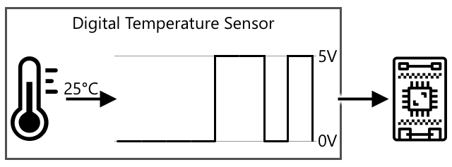
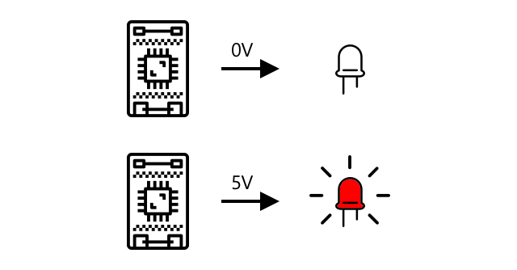

<!--
CO_OP_TRANSLATOR_METADATA:
{
  "original_hash": "e9ee00eb5fc55922a73762acc542166b",
  "translation_date": "2025-08-27T22:03:27+00:00",
  "source_file": "1-getting-started/lessons/3-sensors-and-actuators/README.md",
  "language_code": "sv"
}
-->
# Interagera med den fysiska världen med sensorer och aktuatorer


> Sketchnote av [Nitya Narasimhan](https://github.com/nitya). Klicka på bilden för en större version.

Denna lektion ingick i [Hello IoT-serien](https://youtube.com/playlist?list=PLmsFUfdnGr3xRts0TIwyaHyQuHaNQcb6-) från [Microsoft Reactor](https://developer.microsoft.com/reactor/?WT.mc_id=academic-17441-jabenn). Lektionen presenterades i två videor - en timmes lektion och en timmes frågestund där delar av lektionen fördjupades och frågor besvarades.

[](https://youtu.be/Lqalu1v6aF4)

[](https://youtu.be/qR3ekcMlLWA)

> 🎥 Klicka på bilderna ovan för att se videorna

## Quiz före lektionen

[Quiz före lektionen](https://black-meadow-040d15503.1.azurestaticapps.net/quiz/5)

## Introduktion

Denna lektion introducerar två viktiga koncept för din IoT-enhet - sensorer och aktuatorer. Du kommer också att få praktisk erfarenhet av båda, genom att lägga till en ljussensor till ditt IoT-projekt och sedan lägga till en LED som styrs av ljusnivåer, vilket i praktiken skapar en nattlampa.

I denna lektion kommer vi att gå igenom:

* [Vad är sensorer?](../../../../../1-getting-started/lessons/3-sensors-and-actuators)
* [Använd en sensor](../../../../../1-getting-started/lessons/3-sensors-and-actuators)
* [Sensortyper](../../../../../1-getting-started/lessons/3-sensors-and-actuators)
* [Vad är aktuatorer?](../../../../../1-getting-started/lessons/3-sensors-and-actuators)
* [Använd en aktuator](../../../../../1-getting-started/lessons/3-sensors-and-actuators)
* [Aktuatortyper](../../../../../1-getting-started/lessons/3-sensors-and-actuators)

## Vad är sensorer?

Sensorer är hårdvaruenheter som känner av den fysiska världen - det vill säga att de mäter en eller flera egenskaper runt omkring sig och skickar informationen till en IoT-enhet. Sensorer täcker ett enormt utbud av enheter eftersom det finns så många saker som kan mätas, från naturliga egenskaper som lufttemperatur till fysiska interaktioner som rörelse.

Några vanliga sensorer inkluderar:

* Temperatursensorer - dessa känner av lufttemperaturen eller temperaturen på det de är nedsänkta i. För hobbyister och utvecklare kombineras dessa ofta med lufttryck och luftfuktighet i en enda sensor.
* Knappar - dessa känner av när de har tryckts in.
* Ljussensorer - dessa upptäcker ljusnivåer och kan vara för specifika färger, UV-ljus, IR-ljus eller allmänt synligt ljus.
* Kameror - dessa känner av en visuell representation av världen genom att ta ett fotografi eller strömma video.
* Accelerometrar - dessa känner av rörelse i flera riktningar.
* Mikrofoner - dessa känner av ljud, antingen allmänna ljudnivåer eller riktat ljud.

✅ Gör lite research. Vilka sensorer har din telefon?

Alla sensorer har en sak gemensamt - de omvandlar det de känner av till en elektrisk signal som kan tolkas av en IoT-enhet. Hur denna elektriska signal tolkas beror på sensorn, samt kommunikationsprotokollet som används för att kommunicera med IoT-enheten.

## Använd en sensor

Följ den relevanta guiden nedan för att lägga till en sensor till din IoT-enhet:

* [Arduino - Wio Terminal](wio-terminal-sensor.md)
* [Enkortsdator - Raspberry Pi](pi-sensor.md)
* [Enkortsdator - Virtuell enhet](virtual-device-sensor.md)

## Sensortyper

Sensorer är antingen analoga eller digitala.

### Analoga sensorer

Några av de mest grundläggande sensorerna är analoga sensorer. Dessa sensorer tar emot en spänning från IoT-enheten, sensorens komponenter justerar denna spänning, och spänningen som returneras från sensorn mäts för att ge sensorvärdet.

> 🎓 Spänning är ett mått på hur mycket kraft det finns för att flytta elektricitet från en plats till en annan, till exempel från den positiva polen på ett batteri till den negativa polen. Ett standard AA-batteri är till exempel 1,5V (V är symbolen för volt) och kan driva elektricitet med en kraft på 1,5V från sin positiva pol till sin negativa pol. Olika elektriska hårdvaror kräver olika spänningar för att fungera, till exempel kan en LED lysa med mellan 2-3V, men en 100W glödlampa skulle behöva 240V. Du kan läsa mer om spänning på [Wikipedia-sidan om spänning](https://wikipedia.org/wiki/Voltage).

Ett exempel på detta är en potentiometer. Detta är en ratt som du kan rotera mellan två positioner och sensorn mäter rotationen.


IoT-enheten skickar en elektrisk signal till potentiometern med en spänning, till exempel 5 volt (5V). När potentiometern justeras ändrar den spänningen som kommer ut på andra sidan. Föreställ dig att du har en potentiometer märkt som en ratt som går från 0 till [11](https://wikipedia.org/wiki/Up_to_eleven), som en volymknapp på en förstärkare. När potentiometern är i helt avstängt läge (0) kommer 0V (0 volt) att komma ut. När den är i helt påslaget läge (11) kommer 5V (5 volt) att komma ut.

> 🎓 Detta är en förenkling, och du kan läsa mer om potentiometrar och variabla resistorer på [Wikipedia-sidan om potentiometrar](https://wikipedia.org/wiki/Potentiometer).

Spänningen som kommer ut från sensorn läses sedan av IoT-enheten, och enheten kan reagera på den. Beroende på sensorn kan denna spänning vara ett godtyckligt värde eller mappas till en standardenhet. Till exempel kan en analog temperatursensor baserad på en [termistor](https://wikipedia.org/wiki/Thermistor) ändra sin resistans beroende på temperaturen. Utgångsspänningen kan sedan omvandlas till en temperatur i Kelvin, och motsvarande till °C eller °F, genom beräkningar i kod.

✅ Vad tror du händer om sensorn returnerar en högre spänning än vad som skickades (till exempel från en extern strömkälla)? ⛔️ TESTA INTE detta.

#### Analog till digital konvertering

IoT-enheter är digitala - de kan inte arbeta med analoga värden, de arbetar endast med 0:or och 1:or. Detta innebär att analoga sensorvärden måste konverteras till en digital signal innan de kan bearbetas. Många IoT-enheter har analog-till-digital-omvandlare (ADC) för att konvertera analoga ingångar till digitala representationer av deras värde. Sensorer kan också arbeta med ADC via en anslutningskort. Till exempel, i Seeed Grove-ekosystemet med en Raspberry Pi, ansluts analoga sensorer till specifika portar på en 'hat' som sitter på Pi ansluten till Pi:s GPIO-pinnar, och denna hat har en ADC för att konvertera spänningen till en digital signal som kan skickas från Pi:s GPIO-pinnar.

Föreställ dig att du har en analog ljussensor ansluten till en IoT-enhet som använder 3,3V och returnerar ett värde på 1V. Denna 1V betyder ingenting i den digitala världen, så den måste konverteras. Spänningen kommer att konverteras till ett analogt värde med en skala beroende på enheten och sensorn. Ett exempel är Seeed Grove-ljussensorn som ger värden från 0 till 1 023. För denna sensor som körs på 3,3V skulle en utgång på 1V vara ett värde på 300. En IoT-enhet kan inte hantera 300 som ett analogt värde, så värdet skulle konverteras till `0000000100101100`, den binära representationen av 300 av Grove-hatten. Detta skulle sedan bearbetas av IoT-enheten.

✅ Om du inte kan binär, gör lite research för att lära dig hur siffror representeras med 0:or och 1:or. [BBC Bitesize introduktion till binär](https://www.bbc.co.uk/bitesize/guides/zwsbwmn/revision/1) är en bra startpunkt.

Ur ett kodningsperspektiv hanteras allt detta vanligtvis av bibliotek som följer med sensorerna, så du behöver inte oroa dig för denna konvertering själv. För Grove-ljussensorn skulle du använda Python-biblioteket och kalla på egenskapen `light`, eller använda Arduino-biblioteket och kalla på `analogRead` för att få ett värde på 300.

### Digitala sensorer

Digitala sensorer, precis som analoga sensorer, upptäcker världen omkring dem genom förändringar i elektrisk spänning. Skillnaden är att de skickar en digital signal, antingen genom att endast mäta två tillstånd eller genom att använda en inbyggd ADC. Digitala sensorer blir allt vanligare för att undvika behovet av att använda en ADC antingen i ett anslutningskort eller på själva IoT-enheten.

Den enklaste digitala sensorn är en knapp eller brytare. Detta är en sensor med två tillstånd, på eller av.


Pinnar på IoT-enheter, såsom GPIO-pinnar, kan mäta denna signal direkt som en 0 eller 1. Om spänningen som skickas är densamma som spänningen som returneras, läses värdet som 1, annars läses värdet som 0. Det finns inget behov av att konvertera signalen, den kan bara vara 1 eller 0.

> 💁 Spänningar är aldrig exakta, särskilt eftersom komponenterna i en sensor har viss resistans, så det finns vanligtvis en tolerans. Till exempel arbetar GPIO-pinnarna på en Raspberry Pi med 3,3V och läser en returspänning över 1,8V som en 1, under 1,8V som 0.

* 3,3V går in i knappen. Knappen är avstängd så 0V kommer ut, vilket ger ett värde på 0
* 3,3V går in i knappen. Knappen är påslagen så 3,3V kommer ut, vilket ger ett värde på 1

Mer avancerade digitala sensorer läser analoga värden och konverterar dem sedan med inbyggda ADC till digitala signaler. Till exempel kommer en digital temperatursensor fortfarande att använda en termoelement på samma sätt som en analog sensor och fortfarande mäta förändringen i spänning som orsakas av termoelementets resistans vid aktuell temperatur. Istället för att returnera ett analogt värde och förlita sig på enheten eller anslutningskortet för att konvertera till en digital signal, kommer en ADC inbyggd i sensorn att konvertera värdet och skicka det som en serie 0:or och 1:or till IoT-enheten. Dessa 0:or och 1:or skickas på samma sätt som den digitala signalen för en knapp, där 1 är full spänning och 0 är 0V.



Att skicka digital data gör det möjligt för sensorer att bli mer komplexa och skicka mer detaljerad data, till och med krypterad data för säkra sensorer. Ett exempel är en kamera. Detta är en sensor som fångar en bild och skickar den som digital data som innehåller den bilden, vanligtvis i ett komprimerat format som JPEG, för att läsas av IoT-enheten. Den kan till och med strömma video genom att fånga bilder och skicka antingen hela bilden bild för bild eller en komprimerad videoström.

## Vad är aktuatorer?

Aktuatorer är motsatsen till sensorer - de omvandlar en elektrisk signal från din IoT-enhet till en interaktion med den fysiska världen, såsom att avge ljus eller ljud, eller att röra en motor.

Några vanliga aktuatorer inkluderar:

* LED - dessa avger ljus när de slås på
* Högtalare - dessa avger ljud baserat på signalen som skickas till dem, från en enkel summer till en ljudhögtalare som kan spela musik
* Stegmotor - dessa omvandlar en signal till en definierad mängd rotation, såsom att vrida en ratt 90°
* Relä - dessa är brytare som kan slås på eller av med en elektrisk signal. De tillåter en liten spänning från en IoT-enhet att slå på större spänningar.
* Skärmar - dessa är mer komplexa aktuatorer och visar information på en multi-segment display. Skärmar varierar från enkla LED-displayer till högupplösta videomonitorer.

✅ Gör lite research. Vilka aktuatorer har din telefon?

## Använd en aktuator

Följ den relevanta guiden nedan för att lägga till en aktuator till din IoT-enhet, styrd av sensorn, för att bygga en IoT-nattlampa. Den kommer att samla ljusnivåer från ljussensorn och använda en aktuator i form av en LED för att avge ljus när den upptäckta ljusnivån är för låg.


* [Arduino - Wio Terminal](wio-terminal-actuator.md)
* [Enkortsdator - Raspberry Pi](pi-actuator.md)
* [Enkortsdator - Virtuell enhet](virtual-device-actuator.md)

## Aktuatortyper

Precis som sensorer är aktuatorer antingen analoga eller digitala.

### Analoga aktuatorer

Analoga aktuatorer tar en analog signal och omvandlar den till någon form av interaktion, där interaktionen ändras baserat på den tillförda spänningen.

Ett exempel är en dimbar lampa, såsom de du kanske har i ditt hem. Mängden spänning som tillförs lampan avgör hur starkt den lyser.


Precis som med sensorer arbetar den faktiska IoT-enheten med digitala signaler, inte analoga. Detta innebär att för att skicka en analog signal behöver IoT-enheten en digital-till-analog-omvandlare (DAC), antingen direkt på IoT-enheten eller på en anslutningskort. Denna omvandlare konverterar 0:or och 1:or från IoT-enheten till en analog spänning som aktuatorn kan använda.

✅ Vad tror du händer om IoT-enheten skickar en högre spänning än vad aktuatorn klarar av?  
⛔️ TESTA INTE detta.

#### Pulsbreddsmodulering

Ett annat alternativ för att konvertera digitala signaler från en IoT-enhet till en analog signal är pulsbreddsmodulering. Detta innebär att skicka många korta digitala pulser som fungerar som om det vore en analog signal.

Till exempel kan du använda PWM för att kontrollera hastigheten på en motor.

Föreställ dig att du styr en motor med en 5V strömkälla. Du skickar en kort puls till din motor, där spänningen höjs till 5V under två hundradels sekunder (0,02s). Under den tiden kan din motor rotera en tiondels varv, eller 36°. Signalen pausar sedan i två hundradels sekunder (0,02s), och skickar en låg signal (0V). Varje cykel av på och av varar 0,04s. Cykeln upprepas sedan.


Detta innebär att du under en sekund har 25 pulser på 5V som varar 0,02s och roterar motorn, följt av 0,02s paus med 0V där motorn inte roterar. Varje puls roterar motorn en tiondels varv, vilket innebär att motorn gör 2,5 varv per sekund. Du har använt en digital signal för att rotera motorn med 2,5 varv per sekund, eller 150 [varv per minut](https://wikipedia.org/wiki/Revolutions_per_minute) (en icke-standardiserad måttenhet för rotationshastighet).

```output
25 pulses per second x 0.1 rotations per pulse = 2.5 rotations per second
2.5 rotations per second x 60 seconds in a minute = 150rpm
```

> 🎓 När en PWM-signal är på halva tiden och av halva tiden kallas det för en [50% arbetscykel](https://wikipedia.org/wiki/Duty_cycle). Arbetscykler mäts som procentandelen tid signalen är i på-läge jämfört med av-läge.


Du kan ändra motorhastigheten genom att ändra storleken på pulserna. Till exempel, med samma motor kan du behålla samma cykeltid på 0,04s, men halvera på-pulsen till 0,01s och öka av-pulsen till 0,03s. Du har samma antal pulser per sekund (25), men varje på-puls är hälften så lång. En halvlång puls roterar motorn en tjugondels varv, och vid 25 pulser per sekund kommer motorn att göra 1,25 varv per sekund eller 75rpm. Genom att ändra pulsens längd i en digital signal har du halverat hastigheten på en analog motor.

```output
25 pulses per second x 0.05 rotations per pulse = 1.25 rotations per second
1.25 rotations per second x 60 seconds in a minute = 75rpm
```

✅ Hur skulle du hålla motorrotationen jämn, särskilt vid låga hastigheter? Skulle du använda ett litet antal långa pulser med långa pauser eller många mycket korta pulser med mycket korta pauser?

> 💁 Vissa sensorer använder också PWM för att konvertera analoga signaler till digitala signaler.

> 🎓 Du kan läsa mer om pulsbreddsmodulering på [Wikipedia-sidan om pulsbreddsmodulering](https://wikipedia.org/wiki/Pulse-width_modulation).

### Digitala aktuatorer

Digitala aktuatorer, precis som digitala sensorer, har antingen två tillstånd som styrs av hög eller låg spänning, eller har en inbyggd DAC som kan konvertera en digital signal till en analog.

En enkel digital aktuator är en LED. När en enhet skickar en digital signal med värdet 1 skickas en hög spänning som tänder LED-lampan. När en digital signal med värdet 0 skickas sjunker spänningen till 0V och LED-lampan släcks.



✅ Vilka andra enkla tvåtillståndsaktuatorer kan du komma på? Ett exempel är en solenoid, som är en elektromagnet som kan aktiveras för att göra saker som att flytta en dörrregel för att låsa/öppna en dörr.

Mer avancerade digitala aktuatorer, såsom skärmar, kräver att den digitala datan skickas i vissa format. De kommer vanligtvis med bibliotek som gör det enklare att skicka rätt data för att styra dem.

---

## 🚀 Utmaning

Utmaningen i de två senaste lektionerna var att lista så många IoT-enheter som du kan hitta i ditt hem, skola eller arbetsplats och avgöra om de är byggda kring mikrokontroller eller enkortsdatorer, eller till och med en blandning av båda.

För varje enhet du listade, vilka sensorer och aktuatorer är de anslutna till? Vad är syftet med varje sensor och aktuator som är anslutna till dessa enheter?

## Quiz efter lektionen

[Quiz efter lektionen](https://black-meadow-040d15503.1.azurestaticapps.net/quiz/6)

## Granskning & Självstudier

* Läs om elektricitet och kretsar på [ThingLearn](http://thinglearn.jenlooper.com/curriculum/).  
* Läs om de olika typerna av temperatursensorer på [Seeed Studios guide för temperatursensorer](https://www.seeedstudio.com/blog/2019/10/14/temperature-sensors-for-arduino-projects/)  
* Läs om LED-lampor på [Wikipedia-sidan om LED](https://wikipedia.org/wiki/Light-emitting_diode)  

## Uppgift

[Undersök sensorer och aktuatorer](assignment.md)

---

**Ansvarsfriskrivning**:  
Detta dokument har översatts med hjälp av AI-översättningstjänsten [Co-op Translator](https://github.com/Azure/co-op-translator). Även om vi strävar efter noggrannhet, bör det noteras att automatiserade översättningar kan innehålla fel eller inexaktheter. Det ursprungliga dokumentet på dess ursprungliga språk bör betraktas som den auktoritativa källan. För kritisk information rekommenderas professionell mänsklig översättning. Vi ansvarar inte för eventuella missförstånd eller feltolkningar som uppstår vid användning av denna översättning.