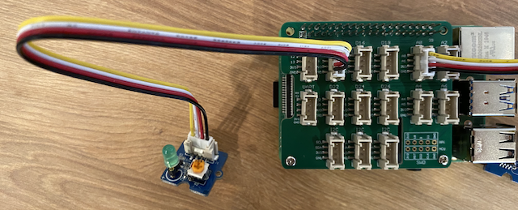

<!--
CO_OP_TRANSLATOR_METADATA:
{
  "original_hash": "4db8a3879a53490513571df2f6cf7641",
  "translation_date": "2025-08-27T22:07:01+00:00",
  "source_file": "1-getting-started/lessons/3-sensors-and-actuators/pi-actuator.md",
  "language_code": "sv"
}
-->
# Bygg en nattlampa - Raspberry Pi

I den här delen av lektionen kommer du att lägga till en LED till din Raspberry Pi och använda den för att skapa en nattlampa.

## Hårdvara

Nattlampan behöver nu en aktuator.

Aktuatoren är en **LED**, en [ljusemitterande diod](https://wikipedia.org/wiki/Light-emitting_diode) som avger ljus när ström går igenom den. Detta är en digital aktuator som har två lägen: på och av. Att skicka ett värde på 1 tänder LED-lampan, och 0 släcker den. LED-lampan är en extern Grove-aktuator och måste anslutas till Grove Base-hatten på Raspberry Pi.

Nattlampans logik i pseudokod är:

```output
Check the light level.
If the light is less than 300
    Turn the LED on
Otherwise
    Turn the LED off
```

### Anslut LED-lampan

Grove LED kommer som en modul med ett urval av LED-lampor, vilket gör att du kan välja färg.

#### Uppgift - anslut LED-lampan

Anslut LED-lampan.


1. Välj din favorit-LED och sätt in benen i de två hålen på LED-modulen.

    LED-lampor är ljusemitterande dioder, och dioder är elektroniska komponenter som bara kan leda ström i en riktning. Detta innebär att LED-lampan måste anslutas åt rätt håll, annars fungerar den inte.

    Ett av benen på LED-lampan är den positiva pinnen, det andra är den negativa pinnen. LED-lampan är inte helt rund och är något plattare på ena sidan. Den något plattare sidan är den negativa pinnen. När du ansluter LED-lampan till modulen, se till att pinnen vid den rundade sidan är ansluten till sockeln märkt **+** på utsidan av modulen, och den plattare sidan är ansluten till sockeln närmare mitten av modulen.

1. LED-modulen har en vridknapp som gör att du kan justera ljusstyrkan. Vrid denna helt uppåt till att börja med genom att rotera den moturs så långt det går med en liten stjärnskruvmejsel.

1. Sätt in ena änden av en Grove-kabel i sockeln på LED-modulen. Den går bara in på ett sätt.

1. Med Raspberry Pi avstängd, anslut den andra änden av Grove-kabeln till den digitala sockeln märkt **D5** på Grove Base-hatten som är ansluten till Pi. Denna sockel är den andra från vänster, på raden av socklar bredvid GPIO-pinnarna.



## Programmera nattlampan

Nattlampan kan nu programmeras med hjälp av Grove ljussensor och Grove LED.

### Uppgift - programmera nattlampan

Programmera nattlampan.

1. Starta Pi och vänta tills den har startat upp.

1. Öppna nattlampa-projektet i VS Code som du skapade i den tidigare delen av denna uppgift, antingen direkt på Pi eller ansluten med hjälp av Remote SSH-tillägget.

1. Lägg till följande kod i filen `app.py` för att importera ett nödvändigt bibliotek. Detta ska läggas till högst upp, under de andra `import`-raderna.

    ```python
    from grove.grove_led import GroveLed
    ```

    `from grove.grove_led import GroveLed`-satsen importerar `GroveLed` från Grove Python-biblioteken. Detta bibliotek innehåller kod för att interagera med en Grove LED.

1. Lägg till följande kod efter deklarationen av `light_sensor` för att skapa en instans av klassen som hanterar LED-lampan:

    ```python
    led = GroveLed(5)
    ```

    Raden `led = GroveLed(5)` skapar en instans av klassen `GroveLed` som ansluter till pin **D5** - den digitala Grove-pinnen som LED-lampan är ansluten till.

    > 💁 Alla socklar har unika pinnummer. Pinnar 0, 2, 4 och 6 är analoga pinnar, pinnar 5, 16, 18, 22, 24 och 26 är digitala pinnar.

1. Lägg till en kontroll inuti `while`-loopen, och före `time.sleep`, för att kontrollera ljusnivåerna och tända eller släcka LED-lampan:

    ```python
    if light < 300:
        led.on()
    else:
        led.off()
    ```

    Denna kod kontrollerar värdet `light`. Om detta är mindre än 300 anropas metoden `on` i klassen `GroveLed`, som skickar ett digitalt värde på 1 till LED-lampan och tänder den. Om ljusvärdet är större än eller lika med 300 anropas metoden `off`, som skickar ett digitalt värde på 0 till LED-lampan och släcker den.

    > 💁 Denna kod ska vara indragen på samma nivå som raden `print('Light level:', light)` för att vara inuti while-loopen!

    > 💁 När digitala värden skickas till aktuatorer är ett värde på 0 lika med 0V, och ett värde på 1 är den maximala spänningen för enheten. För Raspberry Pi med Grove-sensorer och aktuatorer är spänningen för 1 3,3V.

1. Från VS Code-terminalen, kör följande för att köra din Python-app:

    ```sh
    python3 app.py
    ```

    Ljusvärden kommer att skrivas ut i konsolen.

    ```output
    pi@raspberrypi:~/nightlight $ python3 app.py 
    Light level: 634
    Light level: 634
    Light level: 634
    Light level: 230
    Light level: 104
    Light level: 290
    ```

1. Täck över och avtäcka ljussensorn. Notera hur LED-lampan tänds om ljusnivån är 300 eller mindre, och släcks när ljusnivån är större än 300.

    > 💁 Om LED-lampan inte tänds, kontrollera att den är ansluten åt rätt håll och att vridknappen är inställd på max.


> 💁 Du kan hitta denna kod i mappen [code-actuator/pi](../../../../../1-getting-started/lessons/3-sensors-and-actuators/code-actuator/pi).

😀 Ditt nattlampa-program blev en framgång!

---

**Ansvarsfriskrivning**:  
Detta dokument har översatts med hjälp av AI-översättningstjänsten [Co-op Translator](https://github.com/Azure/co-op-translator). Även om vi strävar efter noggrannhet, bör du vara medveten om att automatiska översättningar kan innehålla fel eller inexaktheter. Det ursprungliga dokumentet på dess originalspråk bör betraktas som den auktoritativa källan. För kritisk information rekommenderas professionell mänsklig översättning. Vi ansvarar inte för eventuella missförstånd eller feltolkningar som uppstår vid användning av denna översättning.