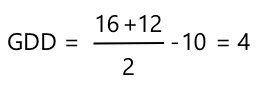

<!--
CO_OP_TRANSLATOR_METADATA:
{
  "original_hash": "d105b44deae539165855c976dcdeca99",
  "translation_date": "2025-08-27T22:46:52+00:00",
  "source_file": "2-farm/lessons/1-predict-plant-growth/README.md",
  "language_code": "sv"
}
-->
# Förutsäg växttillväxt med IoT


> Sketchnote av [Nitya Narasimhan](https://github.com/nitya). Klicka på bilden för en större version.

## Quiz före föreläsningen

[Quiz före föreläsningen](https://black-meadow-040d15503.1.azurestaticapps.net/quiz/9)

## Introduktion

Växter behöver vissa saker för att växa - vatten, koldioxid, näringsämnen, ljus och värme. I denna lektion kommer du att lära dig hur man beräknar växters tillväxt- och mognadshastigheter genom att mäta lufttemperaturen.

I denna lektion kommer vi att täcka:

* [Digitalt jordbruk](../../../../../2-farm/lessons/1-predict-plant-growth)
* [Varför är temperatur viktigt inom jordbruk?](../../../../../2-farm/lessons/1-predict-plant-growth)
* [Mät omgivningstemperatur](../../../../../2-farm/lessons/1-predict-plant-growth)
* [Växande grad-dagar (GDD)](../../../../../2-farm/lessons/1-predict-plant-growth)
* [Beräkna GDD med hjälp av temperatursensordata](../../../../../2-farm/lessons/1-predict-plant-growth)

## Digitalt jordbruk

Digitalt jordbruk förändrar hur vi odlar genom att använda verktyg för att samla in, lagra och analysera data från jordbruket. Vi befinner oss just nu i en period som Världsekonomiskt forum beskriver som den "Fjärde industriella revolutionen", och framväxten av digitalt jordbruk har kallats den "Fjärde jordbruksrevolutionen" eller "Jordbruk 4.0".

> 🎓 Termen Digitalt jordbruk inkluderar också hela "jordbrukets värdekedja", det vill säga hela resan från gård till bord. Det inkluderar att spåra produktkvalitet när maten transporteras och bearbetas, lager- och e-handelssystem, till och med appar för traktorrental!

Dessa förändringar gör det möjligt för bönder att öka avkastningen, använda mindre gödningsmedel och bekämpningsmedel samt vattna mer effektivt. Även om det främst används i rikare länder, sjunker priserna på sensorer och andra enheter gradvis, vilket gör dem mer tillgängliga i utvecklingsländer.

Några tekniker som möjliggörs av digitalt jordbruk är:

* Temperaturmätning - att mäta temperaturen gör det möjligt för bönder att förutsäga växters tillväxt och mognad.
* Automatiserad bevattning - att mäta jordfuktighet och slå på bevattningssystem när jorden är för torr, istället för att använda tidsinställd bevattning. Tidsinställd bevattning kan leda till att grödor får för lite vatten under en varm, torr period, eller för mycket vatten under regn. Genom att vattna endast när jorden behöver det kan bönder optimera sin vattenanvändning.
* Skadedjurskontroll - bönder kan använda kameror på automatiserade robotar eller drönare för att kontrollera skadedjur och sedan applicera bekämpningsmedel endast där det behövs, vilket minskar mängden bekämpningsmedel som används och minskar avrinningen av bekämpningsmedel till lokala vattendrag.

✅ Gör lite efterforskningar. Vilka andra tekniker används för att förbättra jordbruksavkastningen?

> 🎓 Termen "Precision Agriculture" används för att definiera observation, mätning och respons på grödor på en fältbasis, eller till och med på delar av ett fält. Detta inkluderar att mäta vatten-, närings- och skadedjursnivåer och svara exakt, till exempel genom att vattna endast en liten del av ett fält.

## Varför är temperatur viktigt inom jordbruk?

När man lär sig om växter får de flesta lära sig om vikten av vatten, ljus, koldioxid och näringsämnen. Växter behöver också värme för att växa - det är därför växter blommar på våren när temperaturen stiger, varför snödroppar eller påskliljor kan börja växa tidigt efter en kort varm period, och varför växthus och drivhus är så bra på att få växter att växa.

> 🎓 Drivhus och växthus gör liknande jobb, men med en viktig skillnad. Drivhus värms upp artificiellt och gör det möjligt för bönder att kontrollera temperaturen mer exakt, medan växthus förlitar sig på solen för värme och vanligtvis endast har fönster eller andra öppningar för att släppa ut värme.

Växter har en bas- eller minimitemperatur, optimal temperatur och maxtemperatur, alla baserade på dagliga medeltemperaturer.

* Bas-temperatur - detta är den minsta dagliga medeltemperaturen som krävs för att en växt ska växa.
* Optimal temperatur - detta är den bästa dagliga medeltemperaturen för att få maximal tillväxt.
* Maxtemperatur - detta är den högsta temperaturen en växt kan tåla. Över denna temperatur slutar växten att växa för att försöka bevara vatten och överleva.

> 💁 Dessa är medeltemperaturer, genomsnittet av dag- och nattemperaturer. Växter behöver också olika temperaturer dag och natt för att fotosyntetisera mer effektivt och spara energi på natten.

Varje växtart har olika värden för sin bas-, optimala och maximala temperatur. Det är därför vissa växter trivs i varma länder och andra i kallare länder.

✅ Gör lite efterforskningar. För några växter du har i din trädgård, skola eller lokala park, se om du kan hitta deras bas-temperatur.


Grafen ovan visar ett exempel på en tillväxthastighet i förhållande till temperatur. Upp till bas-temperaturen sker ingen tillväxt. Tillväxthastigheten ökar upp till den optimala temperaturen och minskar sedan efter att ha nått denna topp. Vid maxtemperaturen upphör tillväxten.

Formen på denna graf varierar mellan olika växtarter. Vissa har skarpare nedgångar över den optimala temperaturen, medan andra har långsammare ökningar från bas till optimal.

> 💁 För att en bonde ska få bästa tillväxt behöver de känna till de tre temperaturvärdena och förstå grafens form för de växter de odlar.

Om en bonde kan kontrollera temperaturen, till exempel i ett kommersiellt drivhus, kan de optimera för sina växter. Ett kommersiellt drivhus som odlar tomater kommer till exempel att ha temperaturen inställd på cirka 25°C under dagen och 20°C på natten för att få snabbast tillväxt.

> 🍅 Genom att kombinera dessa temperaturer med artificiellt ljus, gödningsmedel och kontrollerade CO2-nivåer kan kommersiella odlare odla och skörda året runt.

## Mät omgivningstemperatur

Temperatursensorer kan användas med IoT-enheter för att mäta omgivningstemperaturen.

### Uppgift - mät temperatur

Följ den relevanta guiden för att övervaka temperaturer med din IoT-enhet:

* [Arduino - Wio Terminal](wio-terminal-temp.md)
* [Enkortsdator - Raspberry Pi](pi-temp.md)
* [Enkortsdator - Virtuell enhet](virtual-device-temp.md)

## Växande grad-dagar

Växande grad-dagar (även kända som växande grad-enheter) är ett sätt att mäta växters tillväxt baserat på temperaturen. Förutsatt att en växt har tillräckligt med vatten, näringsämnen och CO2, bestämmer temperaturen tillväxthastigheten.

Växande grad-dagar, eller GDD, beräknas per dag som den genomsnittliga temperaturen i Celsius för en dag över växtens bas-temperatur. Varje växt behöver ett visst antal GDD för att växa, blomma eller producera och mogna en gröda. Ju fler GDD per dag, desto snabbare växer växten.

> 🇺🇸 För amerikaner kan växande grad-dagar också beräknas med Fahrenheit. 5 GDD (växande grad-dagar i Celsius) motsvarar 9 GDD (växande grad-dagar i Fahrenheit).

Den fullständiga formeln för GDD är lite komplicerad, men det finns en förenklad ekvation som ofta används som en bra approximation:


* **GDD** - detta är antalet växande grad-dagar
* **T max** - detta är den dagliga maxtemperaturen i grader Celsius
* **T min** - detta är den dagliga mintemperaturen i grader Celsius
* **T bas** - detta är växtens bas-temperatur i grader Celsius

> 💁 Det finns variationer som hanterar T max över 30°C eller T min under T bas, men vi ignorerar dessa för nu.

### Exempel - Majs 🌽

Beroende på sort behöver majs mellan 800 och 2 700 GDD för att mogna, med en bas-temperatur på 10°C.

På den första dagen över bas-temperaturen uppmättes följande temperaturer:

| Mätning    | Temp °C |
| :--------- | :-----: |
| Maximal    | 16      |
| Minimal    | 12      |

Om vi sätter in dessa siffror i vår beräkning:

* T max = 16
* T min = 12
* T bas = 10

Detta ger en beräkning av:



Majsen fick 4 GDD den dagen. Om vi antar en majsort som behöver 800 GDD för att mogna, kommer den att behöva ytterligare 796 GDD för att nå mognad.

✅ Gör lite efterforskningar. För några växter du har i din trädgård, skola eller lokala park, se om du kan hitta antalet GDD som krävs för att nå mognad eller producera grödor.

## Beräkna GDD med hjälp av temperatursensordata

Växter växer inte på fasta datum - till exempel kan du inte plantera ett frö och veta att växten kommer att bära frukt exakt 100 dagar senare. Istället kan en bonde ha en ungefärlig uppfattning om hur lång tid en växt tar att växa, och sedan kontrollera dagligen för att se när grödorna är redo.

Detta har en stor arbetskraftspåverkan på en stor gård och riskerar att bonden missar grödor som är redo oväntat tidigt. Genom att mäta temperaturer kan bonden beräkna GDD som en växt har fått, vilket gör att de bara behöver kontrollera nära den förväntade mognaden.

Genom att samla in temperaturdata med en IoT-enhet kan en bonde automatiskt bli meddelad när växter är nära mognad. En typisk arkitektur för detta är att IoT-enheterna mäter temperaturen och sedan publicerar denna telemetridata över Internet med något som MQTT. Serverkod lyssnar sedan på denna data och sparar den någonstans, till exempel i en databas. Detta innebär att data kan analyseras senare, till exempel ett nattligt jobb för att beräkna dagens GDD, summera GDD för varje gröda hittills och varna om en växt är nära mognad.


Serverkoden kan också komplettera data genom att lägga till extra information. Till exempel kan IoT-enheten publicera en identifierare för att indikera vilken enhet det är, och serverkoden kan använda detta för att slå upp enhetens plats och vilka grödor den övervakar. Den kan också lägga till grundläggande data som aktuell tid, eftersom vissa IoT-enheter inte har den nödvändiga hårdvaran för att hålla reda på en exakt tid eller kräver ytterligare kod för att läsa aktuell tid över Internet.

✅ Varför tror du att olika fält kan ha olika temperaturer?

### Uppgift - publicera temperaturinformation

Följ den relevanta guiden för att publicera temperaturdata över MQTT med din IoT-enhet så att den kan analyseras senare:

* [Arduino - Wio Terminal](wio-terminal-temp-publish.md)
* [Enkortsdator - Raspberry Pi/Virtuell IoT-enhet](single-board-computer-temp-publish.md)

### Uppgift - fånga och lagra temperaturinformationen

När IoT-enheten publicerar telemetri kan serverkoden skrivas för att prenumerera på denna data och lagra den. Istället för att spara den i en databas kommer serverkoden att spara den i en kommaseparerad värdefil (CSV). CSV-filer lagrar data som rader av värden som text, med varje värde separerat av ett komma och varje post på en ny rad. De är ett bekvämt, läsbart och välstödd sätt att spara data som en fil.

CSV-filen kommer att ha två kolumner - *datum* och *temperatur*. Kolumnen *datum* sätts som det aktuella datumet och tiden då meddelandet mottogs av servern, *temperaturen* kommer från telemetrimeddelandet.

1. Upprepa stegen i lektion 4 för att skapa serverkod för att prenumerera på telemetri. Du behöver inte lägga till kod för att publicera kommandon.

    Stegen för detta är:

    * Konfigurera och aktivera en Python Virtual Environment

    * Installera paho-mqtt pip-paketet

    * Skriv koden för att lyssna på MQTT-meddelanden som publiceras på telemetriämnet

      > ⚠️ Du kan hänvisa till [instruktionerna i lektion 4 för att skapa en Python-app för att ta emot telemetri om det behövs](../../../1-getting-started/lessons/4-connect-internet/README.md#receive-telemetry-from-the-mqtt-broker).

    Namnge mappen för detta projekt `temperature-sensor-server`.

1. Se till att `client_name` återspeglar detta projekt:

    ```cpp
    client_name = id + 'temperature_sensor_server'
    ```

1. Lägg till följande importeringar högst upp i filen, under de befintliga importeringarna:

    ```python
    from os import path
    import csv
    from datetime import datetime
    ```

    Detta importerar ett bibliotek för att läsa filer, ett bibliotek för att interagera med CSV-filer och ett bibliotek för att hantera datum och tider.

1. Lägg till följande kod före funktionen `handle_telemetry`:

    ```python
    temperature_file_name = 'temperature.csv'
    fieldnames = ['date', 'temperature']
    
    if not path.exists(temperature_file_name):
        with open(temperature_file_name, mode='w') as csv_file:
            writer = csv.DictWriter(csv_file, fieldnames=fieldnames)
            writer.writeheader()
    ```

    Denna kod deklarerar några konstanter för namnet på filen att skriva till och namnet på kolumnrubrikerna för CSV-filen. Den första raden i en CSV-fil innehåller traditionellt kolumnrubriker separerade av kommatecken.

    Koden kontrollerar sedan om CSV-filen redan finns. Om den inte finns skapas den med kolumnrubrikerna på första raden.

1. Lägg till följande kod i slutet av funktionen `handle_telemetry`:

    ```python
    with open(temperature_file_name, mode='a') as temperature_file:        
        temperature_writer = csv.DictWriter(temperature_file, fieldnames=fieldnames)
        temperature_writer.writerow({'date' : datetime.now().astimezone().replace(microsecond=0).isoformat(), 'temperature' : payload['temperature']})
    ```
Den här koden öppnar CSV-filen och lägger till en ny rad i slutet. Raden innehåller aktuellt datum och tid formaterat i ett läsbart format, följt av temperaturen som tas emot från IoT-enheten. Data lagras i [ISO 8601-format](https://wikipedia.org/wiki/ISO_8601) med tidszon, men utan mikrosekunder.

1. Kör den här koden på samma sätt som tidigare och se till att din IoT-enhet skickar data. En CSV-fil som heter `temperature.csv` kommer att skapas i samma mapp. Om du öppnar den kommer du att se datum/tider och temperaturmätningar:

    ```output
    date,temperature
    2021-04-19T17:21:36-07:00,25
    2021-04-19T17:31:36-07:00,24
    2021-04-19T17:41:36-07:00,25
    ```

1. Kör den här koden under en längre tid för att samla in data. Helst bör du köra den under en hel dag för att samla tillräckligt med data för GDD-beräkningar.

    
> 💁 Om du använder en virtuell IoT-enhet, välj kryssrutan för slumpmässighet och ställ in ett intervall för att undvika att få samma temperatur varje gång temperaturen returneras.
     

    > 💁 Om du vill köra detta under en hel dag måste du se till att datorn som din serverkod körs på inte går i viloläge, antingen genom att ändra dina energisparinställningar eller genom att köra något som [detta Python-skript för att hålla systemet aktivt](https://github.com/jaqsparow/keep-system-active).
    
> 💁 Du hittar den här koden i mappen [code-server/temperature-sensor-server](../../../../../2-farm/lessons/1-predict-plant-growth/code-server/temperature-sensor-server).

### Uppgift - beräkna GDD med hjälp av den lagrade datan

När servern har samlat in temperaturdata kan GDD för en växt beräknas.

Stegen för att göra detta manuellt är:

1. Hitta bastemperaturen för växten. Till exempel är bastemperaturen för jordgubbar 10°C.

1. Från `temperature.csv`, hitta dagens högsta och lägsta temperaturer.

1. Använd GDD-beräkningen som gavs tidigare för att beräkna GDD.

Till exempel, om dagens högsta temperatur är 25°C och den lägsta är 12°C:


* 25 + 12 = 37
* 37 / 2 = 18.5
* 18.5 - 10 = 8.5

Därför har jordgubbarna fått **8.5** GDD. Jordgubbar behöver cirka 250 GDD för att bära frukt, så det är fortfarande en bit kvar.

---

## 🚀 Utmaning

Växter behöver mer än värme för att växa. Vilka andra saker behövs?

För dessa, ta reda på om det finns sensorer som kan mäta dem. Vad sägs om aktuatorer för att kontrollera dessa nivåer? Hur skulle du sätta ihop en eller flera IoT-enheter för att optimera växttillväxt?

## Quiz efter föreläsningen

[Quiz efter föreläsningen](https://black-meadow-040d15503.1.azurestaticapps.net/quiz/10)

## Granskning & Självstudier

* Läs mer om digitalt jordbruk på [Wikipedia-sidan om digitalt jordbruk](https://wikipedia.org/wiki/Digital_agriculture). Läs också mer om precisionsjordbruk på [Wikipedia-sidan om precisionsjordbruk](https://wikipedia.org/wiki/Precision_agriculture).
* Den fullständiga beräkningen av växande grad-dagar är mer komplicerad än den förenklade som ges här. Läs mer om den mer komplicerade ekvationen och hur man hanterar temperaturer under baslinjen på [Wikipedia-sidan om växande grad-dagar](https://wikipedia.org/wiki/Growing_degree-day).
* Mat kan bli en bristvara i framtiden om vi fortsätter att använda samma metoder för jordbruk. Lär dig mer om högteknologiska jordbrukstekniker i denna [Hi-Tech Farms of Future-video på YouTube](https://www.youtube.com/watch?v=KIEOuKD9KX8).

## Uppgift

[Visualisera GDD-data med hjälp av en Jupyter Notebook](assignment.md)

---

**Ansvarsfriskrivning**:  
Detta dokument har översatts med hjälp av AI-översättningstjänsten [Co-op Translator](https://github.com/Azure/co-op-translator). Även om vi strävar efter noggrannhet, bör du vara medveten om att automatiserade översättningar kan innehålla fel eller felaktigheter. Det ursprungliga dokumentet på dess ursprungliga språk bör betraktas som den auktoritativa källan. För kritisk information rekommenderas professionell mänsklig översättning. Vi ansvarar inte för eventuella missförstånd eller feltolkningar som uppstår vid användning av denna översättning.