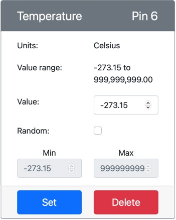

<!--
CO_OP_TRANSLATOR_METADATA:
{
  "original_hash": "70e5a428b607cd5a9a4f422c2a4df03d",
  "translation_date": "2025-08-27T22:51:16+00:00",
  "source_file": "2-farm/lessons/1-predict-plant-growth/virtual-device-temp.md",
  "language_code": "sv"
}
-->
# Mäta temperatur - Virtuell IoT-hårdvara

I denna del av lektionen kommer du att lägga till en temperatursensor till din virtuella IoT-enhet.

## Virtuell hårdvara

Den virtuella IoT-enheten kommer att använda en simulerad Grove Digital Humidity and Temperature-sensor. Detta gör att labbet förblir detsamma som att använda en Raspberry Pi med en fysisk Grove DHT11-sensor.

Sensorn kombinerar en **temperatursensor** med en **fuktighetssensor**, men i detta labb är du endast intresserad av temperatursensorkomponenten. På en fysisk IoT-enhet skulle temperatursensorn vara en [termistor](https://wikipedia.org/wiki/Thermistor) som mäter temperatur genom att känna av en förändring i resistans när temperaturen ändras. Temperatursensorer är vanligtvis digitala sensorer som internt omvandlar den uppmätta resistansen till en temperatur i grader Celsius (eller Kelvin, eller Fahrenheit).

### Lägg till sensorer i CounterFit

För att använda en virtuell fuktighets- och temperatursensor behöver du lägga till de två sensorerna i CounterFit-appen.

#### Uppgift - lägg till sensorer i CounterFit

Lägg till fuktighets- och temperatursensorerna i CounterFit-appen.

1. Skapa en ny Python-app på din dator i en mapp som heter `temperature-sensor` med en enda fil som heter `app.py` och en Python-virtuell miljö, och lägg till CounterFit pip-paket.

    > ⚠️ Du kan hänvisa till [instruktionerna för att skapa och ställa in ett CounterFit Python-projekt i lektion 1 om det behövs](../../../1-getting-started/lessons/1-introduction-to-iot/virtual-device.md).

1. Installera ett ytterligare Pip-paket för att installera en CounterFit-shim för DHT11-sensorn. Se till att du installerar detta från en terminal med den virtuella miljön aktiverad.

    ```sh
    pip install counterfit-shims-seeed-python-dht
    ```

1. Se till att CounterFit-webbappen körs.

1. Skapa en fuktighetssensor:

    1. I *Create sensor*-rutan i *Sensors*-panelen, öppna rullgardinsmenyn *Sensor type* och välj *Humidity*.

    1. Låt *Units* vara inställda på *Percentage*.

    1. Kontrollera att *Pin* är inställd på *5*.

    1. Välj knappen **Add** för att skapa fuktighetssensorn på Pin 5.

    

    Fuktighetssensorn kommer att skapas och visas i sensorlistan.

    

1. Skapa en temperatursensor:

    1. I *Create sensor*-rutan i *Sensors*-panelen, öppna rullgardinsmenyn *Sensor type* och välj *Temperature*.

    1. Låt *Units* vara inställda på *Celsius*.

    1. Kontrollera att *Pin* är inställd på *6*.

    1. Välj knappen **Add** för att skapa temperatursensorn på Pin 6.

    

    Temperatursensorn kommer att skapas och visas i sensorlistan.

    

## Programmera temperatursensorappen

Temperatursensorappen kan nu programmeras med hjälp av CounterFit-sensorerna.

### Uppgift - programmera temperatursensorappen

Programmera temperatursensorappen.

1. Se till att `temperature-sensor`-appen är öppen i VS Code.

1. Öppna filen `app.py`.

1. Lägg till följande kod högst upp i `app.py` för att ansluta appen till CounterFit:

    ```python
    from counterfit_connection import CounterFitConnection
    CounterFitConnection.init('127.0.0.1', 5000)
    ```

1. Lägg till följande kod i filen `app.py` för att importera de nödvändiga biblioteken:

    ```python
    import time
    from counterfit_shims_seeed_python_dht import DHT
    ```

    `from seeed_dht import DHT`-satsen importerar `DHT`-sensor-klassen för att interagera med en virtuell Grove-temperatursensor med hjälp av en shim från modulen `counterfit_shims_seeed_python_dht`.

1. Lägg till följande kod efter koden ovan för att skapa en instans av klassen som hanterar den virtuella fuktighets- och temperatursensorn:

    ```python
    sensor = DHT("11", 5)
    ```

    Detta deklarerar en instans av `DHT`-klassen som hanterar den virtuella **D**igitala **H**umidity och **T**emperature-sensorn. Den första parametern talar om för koden att sensorn som används är en virtuell *DHT11*-sensor. Den andra parametern talar om för koden att sensorn är ansluten till port `5`.

    > 💁 CounterFit simulerar denna kombinerade fuktighets- och temperatursensor genom att ansluta till två sensorer, en fuktighetssensor på den pin som anges när `DHT`-klassen skapas, och en temperatursensor som körs på nästa pin. Om fuktighetssensorn är på pin 5, förväntar sig shimen att temperatursensorn är på pin 6.

1. Lägg till en oändlig loop efter koden ovan för att hämta värdet från temperatursensorn och skriva ut det till konsolen:

    ```python
    while True:
        _, temp = sensor.read()
        print(f'Temperature {temp}°C')
    ```

    Anropet till `sensor.read()` returnerar en tuple med fuktighet och temperatur. Du behöver bara temperaturvärdet, så fuktigheten ignoreras. Temperaturvärdet skrivs sedan ut till konsolen.

1. Lägg till en kort paus på tio sekunder i slutet av loopen eftersom temperaturvärden inte behöver kontrolleras kontinuerligt. En paus minskar enhetens strömförbrukning.

    ```python
    time.sleep(10)
    ```

1. Från VS Code-terminalen med en aktiverad virtuell miljö, kör följande för att köra din Python-app:

    ```sh
    python app.py
    ```

1. Från CounterFit-appen, ändra värdet på temperatursensorn som kommer att läsas av appen. Du kan göra detta på två sätt:

    * Ange ett nummer i *Value*-rutan för temperatursensorn och välj sedan knappen **Set**. Numret du anger kommer att vara värdet som sensorn returnerar.

    * Markera kryssrutan *Random* och ange ett *Min*- och *Max*-värde, och välj sedan knappen **Set**. Varje gång sensorn läser ett värde kommer den att läsa ett slumpmässigt nummer mellan *Min* och *Max*.

    Du bör se de värden du ställer in visas i konsolen. Ändra *Value* eller inställningarna för *Random* för att se värdet ändras.

    ```output
    (.venv) ➜  temperature-sensor python app.py
    Temperature 28.25°C
    Temperature 30.71°C
    Temperature 25.17°C
    ```

> 💁 Du kan hitta denna kod i mappen [code-temperature/virtual-device](../../../../../2-farm/lessons/1-predict-plant-growth/code-temperature/virtual-device).

😀 Din temperatursensorprogram var en framgång!

---

**Ansvarsfriskrivning**:  
Detta dokument har översatts med hjälp av AI-översättningstjänsten [Co-op Translator](https://github.com/Azure/co-op-translator). Även om vi strävar efter noggrannhet, bör du vara medveten om att automatiserade översättningar kan innehålla fel eller felaktigheter. Det ursprungliga dokumentet på dess ursprungliga språk bör betraktas som den auktoritativa källan. För kritisk information rekommenderas professionell mänsklig översättning. Vi ansvarar inte för eventuella missförstånd eller feltolkningar som uppstår vid användning av denna översättning.