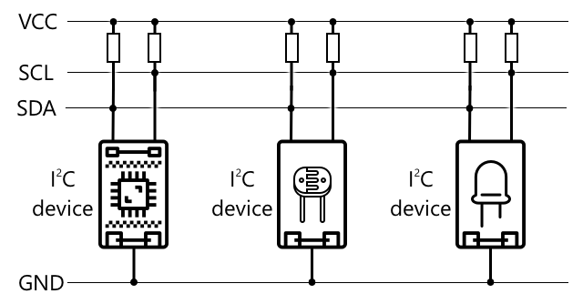
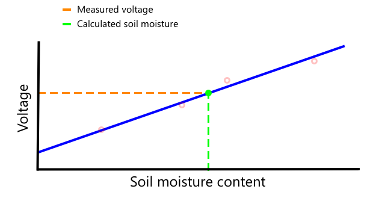

<!--
CO_OP_TRANSLATOR_METADATA:
{
  "original_hash": "4fb20273d299dc8d07a8f06c9cd0cdd9",
  "translation_date": "2025-08-27T22:23:25+00:00",
  "source_file": "2-farm/lessons/2-detect-soil-moisture/README.md",
  "language_code": "sv"
}
-->
C, uttalat *I-kvadrat-C*, är ett protokoll för flera styrenheter och flera enheter, där varje ansluten enhet kan fungera som styrenhet eller perifer enhet som kommunicerar över I²C-bussen (namnet på ett kommunikationssystem som överför data). Data skickas som adresserade paket, där varje paket innehåller adressen till den anslutna enheten det är avsett för.

> 💁 Denna modell kallades tidigare master/slave, men denna terminologi håller på att fasas ut på grund av dess koppling till slaveri. [Open Source Hardware Association har antagit termerna styrenhet/perifer enhet](https://www.oshwa.org/a-resolution-to-redefine-spi-signal-names/), men du kan fortfarande stöta på referenser till den gamla terminologin.

Enheter har en adress som används när de ansluter till I²C-bussen, och denna adress är vanligtvis hårdkodad på enheten. Till exempel har varje typ av Grove-sensor från Seeed samma adress, så alla ljussensorer har samma adress, alla knappar har samma adress som skiljer sig från ljussensorernas adress. Vissa enheter har sätt att ändra adressen, genom att ändra jumperinställningar eller löda ihop stift.

I²C har en buss som består av två huvudkablar, tillsammans med två strömkablar:

| Kabel | Namn | Beskrivning |
| ---- | --------- | ----------- |
| SDA | Serial Data | Denna kabel används för att skicka data mellan enheter. |
| SCL | Serial Clock | Denna kabel skickar en klocksignal med en hastighet som ställs in av styrenheten. |
| VCC | Voltage common collector | Strömförsörjningen för enheterna. Den är ansluten till SDA- och SCL-kablarna för att ge deras ström via ett pull-up-motstånd som stänger av signalen när ingen enhet är styrenhet. |
| GND | Ground | Ger en gemensam jord för den elektriska kretsen. |

För att skicka data kommer en enhet att utfärda ett startvillkor för att visa att den är redo att skicka data. Den blir då styrenheten. Styrenheten skickar sedan adressen till den enhet den vill kommunicera med, tillsammans med information om den vill läsa eller skriva data. Efter att data har överförts skickar styrenheten ett stoppvillkor för att indikera att den är klar. Därefter kan en annan enhet bli styrenhet och skicka eller ta emot data.

I2C har hastighetsbegränsningar med tre olika lägen som körs i fasta hastigheter. Det snabbaste är High Speed-läget med en maximal hastighet på 3,4 Mbps (megabit per sekund), även om väldigt få enheter stöder den hastigheten. Raspberry Pi är till exempel begränsad till fast läge vid 400 Kbps (kilobit per sekund). Standardläget körs vid 100 Kbps.

> 💁 Om du använder en Raspberry Pi med en Grove Base hat som din IoT-hårdvara, kommer du att kunna se ett antal I2C-uttag på kortet som du kan använda för att kommunicera med I2C-sensorer. Analoga Grove-sensorer använder också I2C med en ADC för att skicka analoga värden som digital data, så ljussensorn du använde simulerade en analog pinne, med värdet skickat över I2C eftersom Raspberry Pi endast stöder digitala pinnar.

### Universal asynkron mottagare-sändare (UART)

UART involverar fysisk kretsdesign som gör det möjligt för två enheter att kommunicera. Varje enhet har två kommunikationspinnar - sändning (Tx) och mottagning (Rx), där Tx-pinnen på den första enheten är ansluten till Rx-pinnen på den andra, och Tx-pinnen på den andra enheten är ansluten till Rx-pinnen på den första. Detta gör det möjligt att skicka data i båda riktningarna.

* Enhet 1 skickar data från sin Tx-pinne, som tas emot av enhet 2 på dess Rx-pinne
* Enhet 1 tar emot data på sin Rx-pinne som skickas av enhet 2 från dess Tx-pinne

> 🎓 Data skickas en bit i taget, och detta kallas *seriell* kommunikation. De flesta operativsystem och mikrokontroller har *seriella portar*, det vill säga anslutningar som kan skicka och ta emot seriell data som är tillgängliga för din kod.

UART-enheter har en [baud rate](https://wikipedia.org/wiki/Symbol_rate) (även känd som symbolhastighet), vilket är hastigheten som data skickas och tas emot i bitar per sekund. En vanlig baud rate är 9 600, vilket innebär att 9 600 bitar (0:or och 1:or) av data skickas varje sekund.

UART använder start- och stoppbitar - det vill säga den skickar en startbit för att indikera att den är på väg att skicka en byte (8 bitar) data, och sedan en stoppbit efter att den skickat de 8 bitarna.

UART-hastigheten beror på hårdvaran, men även de snabbaste implementeringarna överstiger inte 6,5 Mbps (megabit per sekund, eller miljoner bitar, 0 eller 1, skickade per sekund).

Du kan använda UART över GPIO-pinnar - du kan ställa in en pinne som Tx och en annan som Rx, och sedan ansluta dessa till en annan enhet.

> 💁 Om du använder en Raspberry Pi med en Grove Base hat som din IoT-hårdvara, kommer du att kunna se ett UART-uttag på kortet som du kan använda för att kommunicera med sensorer som använder UART-protokollet.

### Serial Peripheral Interface (SPI)

SPI är utformat för att kommunicera över korta avstånd, såsom på en mikrokontroller för att prata med en lagringsenhet som flashminne. Det är baserat på en controller/periferimodell med en enda controller (vanligtvis processorn på IoT-enheten) som interagerar med flera periferienheter. Controllern styr allt genom att välja en periferienhet och skicka eller begära data.

> 💁 Precis som I2C är termerna controller och periferienhet nyliga förändringar, så du kan se de äldre termerna fortfarande användas.

SPI-controllrar använder tre kablar, tillsammans med en extra kabel per periferienhet. Periferienheter använder fyra kablar. Dessa kablar är:

| Kabel | Namn | Beskrivning |
| ---- | --------- | ----------- |
| COPI | Controller Output, Peripheral Input | Denna kabel används för att skicka data från controllern till periferienheten. |
| CIPO | Controller Input, Peripheral Output | Denna kabel används för att skicka data från periferienheten till controllern. |
| SCLK | Serial Clock | Denna kabel skickar en klocksignal med en hastighet som ställs in av controllern. |
| CS   | Chip Select | Controllern har flera kablar, en per periferienhet, och varje kabel ansluts till CS-kabeln på motsvarande periferienhet. |

CS-kabeln används för att aktivera en periferienhet åt gången, och kommunicerar över COPI- och CIPO-kablarna. När controllern behöver byta periferienhet, inaktiverar den CS-kabeln som är ansluten till den aktuellt aktiva periferienheten, och aktiverar sedan kabeln som är ansluten till den periferienhet den vill kommunicera med nästa gång.

SPI är *full-duplex*, vilket innebär att controllern kan skicka och ta emot data samtidigt från samma periferienhet med hjälp av COPI- och CIPO-kablarna. SPI använder en klocksignal på SCLK-kabeln för att hålla enheterna synkroniserade, så till skillnad från att skicka direkt över UART behöver den inte start- och stoppbitar.

Det finns inga definierade hastighetsbegränsningar för SPI, med implementeringar som ofta kan överföra flera megabyte data per sekund.

IoT-utvecklingskit stöder ofta SPI över några av GPIO-pinnarna. Till exempel, på en Raspberry Pi kan du använda GPIO-pinnar 19, 21, 23, 24 och 26 för SPI.

### Trådlöst

Vissa sensorer kan kommunicera över standard trådlösa protokoll, såsom Bluetooth (främst Bluetooth Low Energy, eller BLE), LoRaWAN (ett **Lo**ng **Ra**nge lågströmsnätverksprotokoll), eller WiFi. Dessa möjliggör fjärrsensorer som inte är fysiskt anslutna till en IoT-enhet.

Ett sådant exempel är kommersiella jordfuktighetssensorer. Dessa mäter jordfuktigheten i ett fält och skickar sedan data över LoRaWAN till en hubbenhet, som bearbetar data eller skickar den över Internet. Detta gör det möjligt för sensorn att vara långt ifrån IoT-enheten som hanterar data, vilket minskar strömförbrukningen och behovet av stora WiFi-nätverk eller långa kablar.

BLE är populärt för avancerade sensorer som fitnessspårare som används på handleden. Dessa kombinerar flera sensorer och skickar sensordata till en IoT-enhet, till exempel din telefon, via BLE.

✅ Har du några Bluetooth-sensorer på dig, i ditt hem eller i din skola? Dessa kan inkludera temperatursensorer, närvarosensorer, enhetsspårare och fitnessenheter.

Ett populärt sätt för kommersiella enheter att ansluta är Zigbee. Zigbee använder WiFi för att bilda mesh-nätverk mellan enheter, där varje enhet ansluter till så många närliggande enheter som möjligt, och bildar ett stort antal anslutningar som ett spindelnät. När en enhet vill skicka ett meddelande till Internet kan den skicka det till de närmaste enheterna, som sedan vidarebefordrar det till andra närliggande enheter och så vidare, tills det når en koordinator och kan skickas till Internet.

> 🐝 Namnet Zigbee hänvisar till honungsbinas dans efter deras återkomst till bikupan.

## Mäta fuktighetsnivåer i jord

Du kan mäta fuktighetsnivån i jord med hjälp av en jordfuktighetssensor, en IoT-enhet och en krukväxt eller en närliggande jordplätt.

### Uppgift - mäta jordfuktighet

Följ den relevanta guiden för att mäta jordfuktighet med din IoT-enhet:

* [Arduino - Wio Terminal](wio-terminal-soil-moisture.md)
* [Enkorts-dator - Raspberry Pi](pi-soil-moisture.md)
* [Enkorts-dator - Virtuell enhet](virtual-device-soil-moisture.md)

## Sensorkalibrering

Sensorer förlitar sig på att mäta elektriska egenskaper såsom resistans eller kapacitans.

> 🎓 Resistans, mätt i ohm (Ω), är hur mycket motstånd det finns mot den elektriska strömmen som passerar genom något. När en spänning appliceras på ett material, beror mängden ström som passerar genom det på materialets resistans. Du kan läsa mer på [Wikipedia-sidan om elektrisk resistans](https://wikipedia.org/wiki/Electrical_resistance_and_conductance).

> 🎓 Kapacitans, mätt i farad (F), är förmågan hos en komponent eller krets att samla och lagra elektrisk energi. Du kan läsa mer om kapacitans på [Wikipedia-sidan om kapacitans](https://wikipedia.org/wiki/Capacitance).

Dessa mätningar är inte alltid användbara - föreställ dig en temperatursensor som gav dig en mätning på 22,5 kΩ! Istället måste det uppmätta värdet konverteras till en användbar enhet genom att kalibreras - det vill säga att matcha de uppmätta värdena till den uppmätta kvantiteten för att möjliggöra nya mätningar att konverteras till rätt enhet.

Vissa sensorer kommer förkalibrerade. Till exempel var temperatursensorn du använde i den senaste lektionen redan kalibrerad så att den kan returnera en temperaturmätning i °C. På fabriken skulle den första sensorn som skapades utsättas för en rad kända temperaturer och resistansen mätas. Detta skulle sedan användas för att bygga en beräkning som kan konvertera från det uppmätta värdet i Ω (enheten för resistans) till °C.

> 💁 Formeln för att beräkna resistans från temperatur kallas [Steinhart–Hart-ekvationen](https://wikipedia.org/wiki/Steinhart–Hart_equation).

### Kalibrering av jordfuktighetssensor

Jordfuktighet mäts med gravimetriskt eller volymetriskt vatteninnehåll.

* Gravimetriskt är vikten av vatten i en enhetsvikt av jord, mätt som antalet kilogram vatten per kilogram torr jord
* Volymetriskt är volymen av vatten i en enhetsvolym av jord, mätt som antalet kubikmeter vatten per kubikmeter torr jord

> 🇺🇸 För amerikaner, på grund av enhetens konsistens, kan dessa mätas i pounds istället för kilogram eller kubikfot istället för kubikmeter.

Jordfuktighetssensorer mäter elektrisk resistans eller kapacitans - detta varierar inte bara med jordfuktighet, utan också med jordtyp eftersom komponenterna i jorden kan förändra dess elektriska egenskaper. Idealiskt bör sensorer kalibreras - det vill säga ta avläsningar från sensorn och jämföra dem med mätningar som hittas med en mer vetenskaplig metod. Till exempel kan ett laboratorium beräkna den gravimetriska jordfuktigheten med hjälp av prover från ett specifikt fält som tas några gånger per år, och dessa siffror används för att kalibrera sensorn, matcha sensoravläsningen till den gravimetriska jordfuktigheten.

Grafen ovan visar hur man kalibrerar en sensor. Spänningen fångas för ett jordprov som sedan mäts i ett laboratorium genom att jämföra den fuktiga vikten med den torra vikten (genom att mäta vikten våt, sedan torka i en ugn och mäta torr). När några avläsningar har tagits kan detta plottas på en graf och en linje anpassas till punkterna. Denna linje kan sedan användas för att konvertera jordfuktighetssensoravläsningar tagna av en IoT-enhet till faktiska jordfuktighetsmätningar.

💁 För resistiva jordfuktighetssensorer ökar spänningen när jordfuktigheten ökar. För kapacitiva jordfuktighetssensorer minskar spänningen när jordfuktigheten ökar, så graferna för dessa skulle luta nedåt, inte uppåt.

Grafen ovan visar en spänningsavläsning från en jordfuktighetssensor, och genom att följa den till linjen på grafen kan den faktiska jordfuktigheten beräknas.

Denna metod innebär att bonden bara behöver få några laboratoriemätningar för ett fält, och sedan kan de använda IoT-enheter för att mäta jordfuktighet - vilket drastiskt påskyndar tiden för att ta mätningar.

---

## 🚀 Utmaning

Resistiva och kapacitiva jordfuktighetssensorer har ett antal skillnader. Vilka är dessa skillnader, och vilken typ (om någon) är bäst för en bonde att använda? Förändras detta svar mellan utvecklingsländer och utvecklade länder?

## Efterföreläsningsquiz

[Efterföreläsningsquiz](https://black-meadow-040d15503.1.azurestaticapps.net/quiz/12)

## Granskning & Självstudier

Läs om hårdvaran och protokollen som används av sensorer och aktuatorer:

* [GPIO Wikipedia-sida](https://wikipedia.org/wiki/General-purpose_input/output)
* [UART Wikipedia-sida](https://wikipedia.org/wiki/Universal_asynchronous_receiver-transmitter)
* [SPI Wikipedia-sida](https://wikipedia.org/wiki/Serial_Peripheral_Interface)
* [I2C Wikipedia-sida](https://wikipedia.org/wiki/I²C)
* [Zigbee Wikipedia-sida](https://wikipedia.org/wiki/Zigbee)

## Uppgift

[Kalibrera din sensor](assignment.md)

---

**Ansvarsfriskrivning**:  
Detta dokument har översatts med hjälp av AI-översättningstjänsten [Co-op Translator](https://github.com/Azure/co-op-translator). Även om vi strävar efter noggrannhet, bör du vara medveten om att automatiska översättningar kan innehålla fel eller brister. Det ursprungliga dokumentet på dess originalspråk bör betraktas som den auktoritativa källan. För kritisk information rekommenderas professionell mänsklig översättning. Vi ansvarar inte för eventuella missförstånd eller feltolkningar som uppstår vid användning av denna översättning.