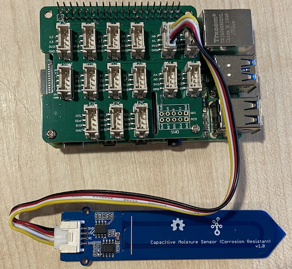

<!--
CO_OP_TRANSLATOR_METADATA:
{
  "original_hash": "9d4d00a47d5d0f3e6ce42c0d1020064a",
  "translation_date": "2025-08-27T22:21:51+00:00",
  "source_file": "2-farm/lessons/2-detect-soil-moisture/pi-soil-moisture.md",
  "language_code": "sv"
}
-->
# Mät jordfuktighet - Raspberry Pi

I den här delen av lektionen kommer du att lägga till en kapacitiv jordfuktighetssensor till din Raspberry Pi och läsa av värden från den.

## Hårdvara

Raspberry Pi behöver en kapacitiv jordfuktighetssensor.

Sensorn du kommer att använda är en [Kapacitiv jordfuktighetssensor](https://www.seeedstudio.com/Grove-Capacitive-Moisture-Sensor-Corrosion-Resistant.html), som mäter jordfuktighet genom att detektera jordens kapacitans, en egenskap som förändras när jordens fuktighet ändras. När jordfuktigheten ökar, minskar spänningen.

Detta är en analog sensor, så den använder en analog pin och 10-bitars ADC i Grove Base Hat på Pi för att omvandla spänningen till en digital signal från 1-1 023. Denna signal skickas sedan via I²C via GPIO-pinnarna på Pi.

### Anslut jordfuktighetssensorn

Grove jordfuktighetssensor kan anslutas till Raspberry Pi.

#### Uppgift - anslut jordfuktighetssensorn

Anslut jordfuktighetssensorn.


1. Sätt in ena änden av en Grove-kabel i kontakten på jordfuktighetssensorn. Den går bara att sätta in på ett sätt.

1. Med Raspberry Pi avstängd, anslut den andra änden av Grove-kabeln till den analoga kontakten märkt **A0** på Grove Base Hat som är ansluten till Pi. Denna kontakt är den andra från höger, på raden av kontakter bredvid GPIO-pinnarna.



1. Sätt in jordfuktighetssensorn i jorden. Den har en "högsta positionslinje" - en vit linje tvärs över sensorn. Sätt in sensorn upp till, men inte förbi, denna linje.


## Programmera jordfuktighetssensorn

Raspberry Pi kan nu programmeras för att använda den anslutna jordfuktighetssensorn.

### Uppgift - programmera jordfuktighetssensorn

Programmera enheten.

1. Starta Pi och vänta tills den har startat upp.

1. Starta VS Code, antingen direkt på Pi eller anslut via Remote SSH-tillägget.

    > ⚠️ Du kan hänvisa till [instruktionerna för att ställa in och starta VS Code i nightlight - lektion 1 om det behövs](../../../1-getting-started/lessons/1-introduction-to-iot/pi.md).

1. Skapa en ny mapp i hemmakatalogen för användaren `pi` via terminalen och kalla den `soil-moisture-sensor`. Skapa en fil i denna mapp som heter `app.py`.

1. Öppna denna mapp i VS Code.

1. Lägg till följande kod i filen `app.py` för att importera några nödvändiga bibliotek:

    ```python
    import time
    from grove.adc import ADC
    ```

    `import time`-satsen importerar `time`-modulen som kommer att användas senare i denna uppgift.

    `from grove.adc import ADC`-satsen importerar `ADC` från Grove Python-biblioteken. Detta bibliotek innehåller kod för att interagera med den analoga till digitala omvandlaren på Pi Base Hat och läsa spänningar från analoga sensorer.

1. Lägg till följande kod nedanför detta för att skapa en instans av klassen `ADC`:

    ```python
    adc = ADC()
    ```

1. Lägg till en oändlig loop som läser från denna ADC på A0-pinnen och skriver resultatet till konsolen. Denna loop kan sedan pausa i 10 sekunder mellan avläsningarna.

    ```python
    while True:
        soil_moisture = adc.read(0)
        print("Soil moisture:", soil_moisture)

        time.sleep(10)
    ```

1. Kör Python-appen. Du kommer att se jordfuktighetsmätningarna skrivas ut i konsolen. Tillsätt lite vatten i jorden eller ta bort sensorn från jorden och se värdet ändras.

    ```output
    pi@raspberrypi:~/soil-moisture-sensor $ python3 app.py 
    Soil moisture: 615
    Soil moisture: 612
    Soil moisture: 498
    Soil moisture: 493
    Soil moisture: 490
    Soil Moisture: 388
    ```

    I exempelutdata ovan kan du se spänningen sjunka när vatten tillsätts.

> 💁 Du kan hitta denna kod i [code/pi](../../../../../2-farm/lessons/2-detect-soil-moisture/code/pi)-mappen.

😀 Ditt program för jordfuktighetssensorn blev en framgång!

---

**Ansvarsfriskrivning**:  
Detta dokument har översatts med hjälp av AI-översättningstjänsten [Co-op Translator](https://github.com/Azure/co-op-translator). Även om vi strävar efter noggrannhet, bör du vara medveten om att automatiserade översättningar kan innehålla fel eller felaktigheter. Det ursprungliga dokumentet på dess ursprungliga språk bör betraktas som den auktoritativa källan. För kritisk information rekommenderas professionell mänsklig översättning. Vi ansvarar inte för eventuella missförstånd eller feltolkningar som uppstår vid användning av denna översättning.