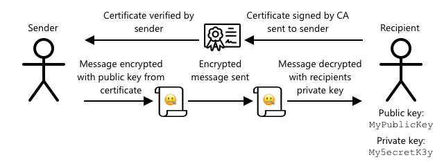

<!--
CO_OP_TRANSLATOR_METADATA:
{
  "original_hash": "81c437c568eee1b0dda1f04e88150d37",
  "translation_date": "2025-08-27T22:34:58+00:00",
  "source_file": "2-farm/lessons/6-keep-your-plant-secure/README.md",
  "language_code": "sv"
}
-->
# Håll din växt säker


> Sketchnote av [Nitya Narasimhan](https://github.com/nitya). Klicka på bilden för en större version.

## Quiz före föreläsningen

[Quiz före föreläsningen](https://black-meadow-040d15503.1.azurestaticapps.net/quiz/19)

## Introduktion

I de senaste lektionerna har du skapat en IoT-enhet för jordövervakning och anslutit den till molnet. Men vad händer om hackare som arbetar för en konkurrerande jordbrukare lyckas ta kontroll över dina IoT-enheter? Tänk om de skickar höga fuktighetsvärden så att dina växter aldrig får vatten, eller aktiverar ditt bevattningssystem så att det körs hela tiden, vilket dödar dina växter genom övervattning och kostar dig en förmögenhet i vatten?

I denna lektion kommer du att lära dig om att säkra IoT-enheter. Eftersom detta är den sista lektionen för detta projekt kommer du också att lära dig hur du städar upp dina molnresurser för att minska eventuella kostnader.

I denna lektion kommer vi att täcka:

* [Varför behöver du säkra IoT-enheter?](../../../../../2-farm/lessons/6-keep-your-plant-secure)
* [Kryptografi](../../../../../2-farm/lessons/6-keep-your-plant-secure)
* [Säkra dina IoT-enheter](../../../../../2-farm/lessons/6-keep-your-plant-secure)
* [Generera och använd ett X.509-certifikat](../../../../../2-farm/lessons/6-keep-your-plant-secure)

> 🗑 Detta är den sista lektionen i detta projekt, så efter att du har slutfört denna lektion och uppgiften, glöm inte att städa upp dina molntjänster. Du kommer att behöva tjänsterna för att slutföra uppgiften, så se till att göra det först.
>
> Se [guiden för att städa upp ditt projekt](../../../clean-up.md) vid behov för instruktioner om hur du gör detta.

## Varför behöver du säkra IoT-enheter?

IoT-säkerhet handlar om att säkerställa att endast förväntade enheter kan ansluta till din molnbaserade IoT-tjänst och skicka telemetri, och att endast din molntjänst kan skicka kommandon till dina enheter. IoT-data kan också vara personlig, inklusive medicinsk eller känslig information, så hela din applikation måste ta hänsyn till säkerhet för att förhindra att denna data läcker ut.

Om din IoT-applikation inte är säker finns det flera risker:

* En falsk enhet kan skicka felaktiga data, vilket får din applikation att reagera felaktigt. Till exempel kan de skicka konstant höga fuktighetsvärden, vilket innebär att ditt bevattningssystem aldrig aktiveras och dina växter dör av vattenbrist.
* Obehöriga användare kan läsa data från IoT-enheter, inklusive personlig eller affärskritisk information.
* Hackare kan skicka kommandon för att kontrollera en enhet på ett sätt som kan orsaka skada på enheten eller ansluten hårdvara.
* Genom att ansluta till en IoT-enhet kan hackare använda detta för att få tillgång till ytterligare nätverk och komma åt privata system.
* Illvilliga användare kan få tillgång till personlig data och använda detta för utpressning.

Dessa är verkliga scenarier och händer hela tiden. Några exempel gavs i tidigare lektioner, men här är några fler:

* År 2018 använde hackare en öppen WiFi-åtkomstpunkt på en termostat för ett akvarium för att få tillgång till ett casinos nätverk och stjäla data. [The Hacker News - Casino Gets Hacked Through Its Internet-Connected Fish Tank Thermometer](https://thehackernews.com/2018/04/iot-hacking-thermometer.html)
* År 2016 lanserade Mirai Botnet en överbelastningsattack mot Dyn, en internetleverantör, vilket slog ut stora delar av internet. Denna botnet använde skadlig kod för att ansluta till IoT-enheter som DVR:er och kameror som använde standardanvändarnamn och lösenord, och därifrån lanserades attacken. [The Guardian - DDoS attack that disrupted internet was largest of its kind in history, experts say](https://www.theguardian.com/technology/2016/oct/26/ddos-attack-dyn-mirai-botnet)
* Spiral Toys hade en databas med användare av deras CloudPets-anslutna leksaker offentligt tillgänglig på internet. [Troy Hunt - Data from connected CloudPets teddy bears leaked and ransomed, exposing kids' voice messages](https://www.troyhunt.com/data-from-connected-cloudpets-teddy-bears-leaked-and-ransomed-exposing-kids-voice-messages/).
* Strava taggade löpare som du sprang förbi och visade deras rutter, vilket gjorde det möjligt för främlingar att effektivt se var du bor. [Kim Komndo - Fitness app could lead a stranger right to your home — change this setting](https://www.komando.com/security-privacy/strava-fitness-app-privacy/755349/).

✅ Gör lite research: Sök efter fler exempel på IoT-hack och dataintrång i IoT, särskilt med personliga föremål som internetanslutna tandborstar eller vågar. Fundera på vilken påverkan dessa hack kan ha på offren eller kunderna.

> 💁 Säkerhet är ett enormt ämne, och denna lektion kommer bara att beröra några av grunderna kring att ansluta din enhet till molnet. Andra ämnen som inte kommer att täckas inkluderar övervakning av dataförändringar under överföring, direkt hackning av enheter eller förändringar av enhetskonfigurationer. IoT-hackning är ett sådant hot att verktyg som [Azure Defender for IoT](https://azure.microsoft.com/services/azure-defender-for-iot/?WT.mc_id=academic-17441-jabenn) har utvecklats. Dessa verktyg är liknande antivirus- och säkerhetsverktyg som du kanske har på din dator, men designade för små, strömsnåla IoT-enheter.

## Kryptografi

När en enhet ansluter till en IoT-tjänst använder den en ID för att identifiera sig. Problemet är att detta ID kan klonas – en hackare kan sätta upp en skadlig enhet som använder samma ID som en riktig enhet men skickar falska data.


Lösningen på detta är att konvertera den data som skickas till ett krypterat format, med hjälp av ett värde som endast är känt av enheten och molnet. Denna process kallas *kryptering*, och värdet som används för att kryptera data kallas en *krypteringsnyckel*.


Molntjänsten kan sedan konvertera data tillbaka till ett läsbart format, med en process som kallas *dekryptering*, med antingen samma krypteringsnyckel eller en *dekrypteringsnyckel*. Om det krypterade meddelandet inte kan dekrypteras med nyckeln har enheten blivit hackad och meddelandet avvisas.

Tekniken för att utföra kryptering och dekryptering kallas *kryptografi*.

### Tidig kryptografi

De tidigaste typerna av kryptografi var substitutionschiffer, som går tillbaka 3 500 år. Substitutionschiffer innebär att man ersätter en bokstav med en annan. Till exempel innebär [Caesar-chiffer](https://wikipedia.org/wiki/Caesar_cipher) att alfabetet flyttas med ett definierat antal steg, där endast avsändaren av det krypterade meddelandet och den avsedda mottagaren vet hur många bokstäver som ska flyttas.

[Vigenère-chiffer](https://wikipedia.org/wiki/Vigenère_cipher) tog detta vidare genom att använda ord för att kryptera text, så att varje bokstav i den ursprungliga texten flyttades med olika antal steg, istället för att alltid flyttas med samma antal bokstäver.

Kryptografi användes för en mängd olika ändamål, såsom att skydda en krukmakarens glasyrrecept i antika Mesopotamien, skriva hemliga kärleksbrev i Indien eller hålla antika egyptiska magiska besvärjelser hemliga.

### Modern kryptografi

Modern kryptografi är mycket mer avancerad och gör det svårare att knäcka än tidiga metoder. Modern kryptografi använder komplicerad matematik för att kryptera data med alldeles för många möjliga nycklar för att göra brute force-attacker möjliga.

Kryptografi används på många olika sätt för säker kommunikation. Om du läser denna sida på GitHub kanske du märker att webbadressen börjar med *HTTPS*, vilket betyder att kommunikationen mellan din webbläsare och GitHubs webbservrar är krypterad. Om någon skulle kunna läsa internettrafiken mellan din webbläsare och GitHub skulle de inte kunna läsa datan eftersom den är krypterad. Din dator kan till och med kryptera all data på din hårddisk så att om någon stjäl den, kan de inte läsa någon av din data utan ditt lösenord.

> 🎓 HTTPS står för HyperText Transfer Protocol **Secure**

Tyvärr är inte allt säkert. Vissa enheter har ingen säkerhet, andra är säkrade med lättknäckta nycklar, eller ibland använder alla enheter av samma typ samma nyckel. Det har funnits rapporter om mycket personliga IoT-enheter som alla har samma lösenord för att ansluta till dem via WiFi eller Bluetooth. Om du kan ansluta till din egen enhet kan du ansluta till någon annans. När du väl är ansluten kan du få tillgång till mycket privat data eller kontroll över deras enhet.

> 💁 Trots komplexiteten i modern kryptografi och påståenden om att bryta kryptering kan ta miljarder år, har framväxten av kvantdatorer lett till möjligheten att bryta all känd kryptering på mycket kort tid!

### Symmetriska och asymmetriska nycklar

Kryptering finns i två typer – symmetrisk och asymmetrisk.

**Symmetrisk** kryptering använder samma nyckel för att kryptera och dekryptera data. Både avsändaren och mottagaren måste känna till samma nyckel. Detta är den minst säkra typen, eftersom nyckeln måste delas på något sätt. För att en avsändare ska kunna skicka ett krypterat meddelande till en mottagare kan avsändaren först behöva skicka nyckeln till mottagaren.


Om nyckeln blir stulen under överföringen, eller om avsändaren eller mottagaren blir hackad och nyckeln hittas, kan krypteringen knäckas.


**Asymmetrisk** kryptering använder två nycklar – en krypteringsnyckel och en dekrypteringsnyckel, kallad en offentlig/privat nyckelpar. Den offentliga nyckeln används för att kryptera meddelandet, men kan inte användas för att dekryptera det, den privata nyckeln används för att dekryptera meddelandet men kan inte användas för att kryptera det.


Mottagaren delar sin offentliga nyckel, och avsändaren använder denna för att kryptera meddelandet. När meddelandet skickas dekrypterar mottagaren det med sin privata nyckel. Asymmetrisk kryptering är säkrare eftersom den privata nyckeln hålls privat av mottagaren och aldrig delas. Alla kan ha den offentliga nyckeln eftersom den endast kan användas för att kryptera meddelanden.

Symmetrisk kryptering är snabbare än asymmetrisk kryptering, asymmetrisk är säkrare. Vissa system använder båda – asymmetrisk kryptering används för att kryptera och dela den symmetriska nyckeln, och den symmetriska nyckeln används sedan för att kryptera all data. Detta gör det säkrare att dela den symmetriska nyckeln mellan avsändare och mottagare, och snabbare när data krypteras och dekrypteras.

## Säkra dina IoT-enheter

IoT-enheter kan säkras med symmetrisk eller asymmetrisk kryptering. Symmetrisk är enklare, men mindre säker.

### Symmetriska nycklar

När du ställde in din IoT-enhet för att interagera med IoT Hub använde du en anslutningssträng. Ett exempel på en anslutningssträng är:

```output
HostName=soil-moisture-sensor.azure-devices.net;DeviceId=soil-moisture-sensor;SharedAccessKey=Bhry+ind7kKEIDxubK61RiEHHRTrPl7HUow8cEm/mU0=
```

Denna anslutningssträng består av tre delar separerade med semikolon, där varje del är en nyckel och ett värde:

| Nyckel | Värde | Beskrivning |
| --- | ----- | ----------- |
| HostName | `soil-moisture-sensor.azure-devices.net` | URL för IoT Hub |
| DeviceId | `soil-moisture-sensor` | Enhetens unika ID |
| SharedAccessKey | `Bhry+ind7kKEIDxubK61RiEHHRTrPl7HUow8cEm/mU0=` | En symmetrisk nyckel som är känd av enheten och IoT Hub |

Den sista delen av denna anslutningssträng, `SharedAccessKey`, är den symmetriska nyckeln som är känd av både enheten och IoT Hub. Denna nyckel skickas aldrig från enheten till molnet eller från molnet till enheten. Istället används den för att kryptera data som skickas eller tas emot.

✅ Gör ett experiment. Vad tror du händer om du ändrar `SharedAccessKey`-delen av anslutningssträngen när du ansluter din IoT-enhet? Testa det.

När enheten först försöker ansluta skickar den en delad åtkomstsignatur (SAS-token) som består av URL:en för IoT Hub, en tidsstämpel för när åtkomstsignaturen kommer att löpa ut (vanligtvis 1 dag från nuvarande tid) och en signatur. Denna signatur består av URL:en och utgångstiden krypterad med den delade åtkomstnyckeln från anslutningssträngen.

IoT Hub dekrypterar denna signatur med den delade åtkomstnyckeln, och om det dekrypterade värdet matchar URL:en och utgångstiden tillåts enheten att ansluta. Den verifierar också att den aktuella tiden är före utgångstiden för att förhindra att en skadlig enhet fångar SAS-token från en riktig enhet och använder den.

Detta är ett elegant sätt att verifiera att avsändaren är rätt enhet. Genom att skicka viss känd data både i okrypterad och krypterad form kan servern verifiera enheten genom att säkerställa att när den dekrypterar den krypterade datan, matchar resultatet den okrypterade versionen som skickades. Om det matchar har både avsändaren och mottagaren samma symmetriska krypteringsnyckel.
💁 Eftersom din IoT-enhet har en utgångstid behöver den veta den exakta tiden, vanligtvis hämtad från en [NTP](https://wikipedia.org/wiki/Network_Time_Protocol)-server. Om tiden inte är korrekt kommer anslutningen att misslyckas.
Efter anslutningen kommer all data som skickas till IoT Hub från enheten, eller till enheten från IoT Hub, att krypteras med den delade åtkomstnyckeln.

✅ Vad tror du händer om flera enheter delar samma anslutningssträng?

> 💁 Det är en dålig säkerhetspraxis att lagra denna nyckel i koden. Om en hacker får tag på din källkod kan de få tag på din nyckel. Det blir också svårare vid kodsläpp eftersom du måste kompilera om med en uppdaterad nyckel för varje enhet. Det är bättre att ladda denna nyckel från en hårdvarusäkerhetsmodul - ett chip på IoT-enheten som lagrar krypterade värden som kan läsas av din kod.
>
> När man lär sig IoT är det ofta enklare att lägga nyckeln i koden, som du gjorde i en tidigare lektion, men du måste se till att denna nyckel inte checkas in i offentlig versionskontroll.

Enheter har två nycklar och två motsvarande anslutningssträngar. Detta gör det möjligt att rotera nycklarna - det vill säga byta från en nyckel till en annan om den första blir komprometterad, och generera om den första nyckeln.

### X.509-certifikat

När du använder asymmetrisk kryptering med ett par av offentlig/privat nyckel måste du tillhandahålla din offentliga nyckel till alla som vill skicka data till dig. Problemet är, hur kan mottagaren av din nyckel vara säker på att det faktiskt är din offentliga nyckel och inte någon annan som låtsas vara du? Istället för att tillhandahålla en nyckel kan du istället tillhandahålla din offentliga nyckel i ett certifikat som har verifierats av en betrodd tredje part, kallad ett X.509-certifikat.

X.509-certifikat är digitala dokument som innehåller den offentliga nyckeln i paret av offentlig/privat nyckel. De utfärdas vanligtvis av en av flera betrodda organisationer som kallas [Certifikatutfärdare](https://wikipedia.org/wiki/Certificate_authority) (CAs) och är digitalt signerade av CA för att indikera att nyckeln är giltig och kommer från dig. Du litar på certifikatet och att den offentliga nyckeln kommer från den som certifikatet säger att den kommer från, eftersom du litar på CA, på samma sätt som du skulle lita på ett pass eller körkort eftersom du litar på landet som utfärdar det. Certifikat kostar pengar, så du kan också "självsignera", det vill säga skapa ett certifikat själv som är signerat av dig, för teständamål.

> 💁 Du bör aldrig använda ett självsignerat certifikat för en produktionsrelease.

Dessa certifikat har ett antal fält, inklusive vem den offentliga nyckeln kommer från, detaljer om CA som utfärdade det, hur länge det är giltigt och själva den offentliga nyckeln. Innan du använder ett certifikat är det god praxis att verifiera det genom att kontrollera att det signerades av den ursprungliga CA.

✅ Du kan läsa en fullständig lista över fälten i certifikatet i [Microsofts guide om att förstå X.509-certifikat](https://docs.microsoft.com/azure/iot-hub/tutorial-x509-certificates?WT.mc_id=academic-17441-jabenn#certificate-fields).

När du använder X.509-certifikat kommer både avsändaren och mottagaren att ha sina egna offentliga och privata nycklar, samt båda ha X.509-certifikat som innehåller den offentliga nyckeln. De utbyter sedan X.509-certifikat på något sätt, använder varandras offentliga nycklar för att kryptera data de skickar och sin egen privata nyckel för att dekryptera data de tar emot.



En stor fördel med att använda X.509-certifikat är att de kan delas mellan enheter. Du kan skapa ett certifikat, ladda upp det till IoT Hub och använda detta för alla dina enheter. Varje enhet behöver då bara känna till den privata nyckeln för att dekryptera meddelanden den tar emot från IoT Hub.

Certifikatet som används av din enhet för att kryptera meddelanden den skickar till IoT Hub publiceras av Microsoft. Det är samma certifikat som många Azure-tjänster använder och är ibland inbyggt i SDK:erna.

> 💁 Kom ihåg, en offentlig nyckel är just det - offentlig. Azures offentliga nyckel kan endast användas för att kryptera data som skickas till Azure, inte för att dekryptera det, så den kan delas överallt, inklusive i källkod. Till exempel kan du se den i [Azure IoT C SDK:s källkod](https://github.com/Azure/azure-iot-sdk-c/blob/master/certs/certs.c).

✅ Det finns mycket facktermer kring X.509-certifikat. Du kan läsa definitionerna av några av de termer du kan stöta på i [Den enkla guiden till X.509-certifikatjargong](https://techcommunity.microsoft.com/t5/internet-of-things/the-layman-s-guide-to-x-509-certificate-jargon/ba-p/2203540?WT.mc_id=academic-17441-jabenn).

## Generera och använd ett X.509-certifikat

Stegen för att generera ett X.509-certifikat är:

1. Skapa ett par av offentlig/privat nyckel. En av de mest använda algoritmerna för att generera ett par av offentlig/privat nyckel kallas [Rivest–Shamir–Adleman](https://wikipedia.org/wiki/RSA_(cryptosystem))(RSA).

1. Skicka in den offentliga nyckeln med tillhörande data för signering, antingen av en CA eller genom självsignering.

Azure CLI har kommandon för att skapa en ny enhetsidentitet i IoT Hub och automatiskt generera paret av offentlig/privat nyckel samt skapa ett självsignerat certifikat.

> 💁 Om du vill se stegen i detalj, istället för att använda Azure CLI, kan du hitta dem i [Microsofts guide om att använda OpenSSL för att skapa självsignerade certifikat](https://docs.microsoft.com/azure/iot-hub/tutorial-x509-self-sign?WT.mc_id=academic-17441-jabenn).

### Uppgift - skapa en enhetsidentitet med ett X.509-certifikat

1. Kör följande kommando för att registrera den nya enhetsidentiteten och automatiskt generera nycklar och certifikat:

    ```sh
    az iot hub device-identity create --device-id soil-moisture-sensor-x509 \
                                      --am x509_thumbprint \
                                      --output-dir . \
                                      --hub-name <hub_name>
    ```

    Ersätt `<hub_name>` med namnet du använde för din IoT Hub.

    Detta kommer att skapa en enhet med ID:t `soil-moisture-sensor-x509` för att skilja från den enhetsidentitet du skapade i den senaste lektionen. Detta kommando kommer också att skapa två filer i den aktuella katalogen:

    * `soil-moisture-sensor-x509-key.pem` - denna fil innehåller den privata nyckeln för enheten.
    * `soil-moisture-sensor-x509-cert.pem` - detta är X.509-certifikatfilen för enheten.

    Håll dessa filer säkra! Den privata nyckelfilen bör inte checkas in i offentlig versionskontroll.

### Uppgift - använd X.509-certifikatet i din enhetskod

Följ den relevanta guiden för att ansluta din IoT-enhet till molnet med hjälp av X.509-certifikatet:

* [Arduino - Wio Terminal](wio-terminal-x509.md)
* [Enkortsdator - Raspberry Pi/Virtual IoT device](single-board-computer-x509.md)

---

## 🚀 Utmaning

Det finns flera sätt att skapa, hantera och ta bort Azure-tjänster som Resursgrupper och IoT Hubs. Ett sätt är [Azure Portal](https://portal.azure.com?WT.mc_id=academic-17441-jabenn) - ett webbaserat gränssnitt som ger dig en GUI för att hantera dina Azure-tjänster.

Gå till [portal.azure.com](https://portal.azure.com?WT.mc_id=academic-17441-jabenn) och undersök portalen. Se om du kan skapa en IoT Hub med hjälp av portalen och sedan ta bort den.

**Tips** - när du skapar tjänster via portalen behöver du inte skapa en Resursgrupp i förväg, en kan skapas när du skapar tjänsten. Se till att ta bort den när du är klar!

Du kan hitta massor av dokumentation, handledningar och guider om Azure Portal i [Azure portal-dokumentationen](https://docs.microsoft.com/azure/azure-portal/?WT.mc_id=academic-17441-jabenn).

## Quiz efter föreläsningen

[Quiz efter föreläsningen](https://black-meadow-040d15503.1.azurestaticapps.net/quiz/20)

## Granskning & Självstudier

* Läs om kryptografins historia på [Wikipedia-sidan om kryptografins historia](https://wikipedia.org/wiki/History_of_cryptography).
* Läs om X.509-certifikat på [Wikipedia-sidan om X.509](https://wikipedia.org/wiki/X.509).

## Uppgift

[Bygg en ny IoT-enhet](assignment.md)

---

**Ansvarsfriskrivning**:  
Detta dokument har översatts med hjälp av AI-översättningstjänsten [Co-op Translator](https://github.com/Azure/co-op-translator). Även om vi strävar efter noggrannhet, bör du vara medveten om att automatiserade översättningar kan innehålla fel eller felaktigheter. Det ursprungliga dokumentet på dess originalspråk bör betraktas som den auktoritativa källan. För kritisk information rekommenderas professionell mänsklig översättning. Vi ansvarar inte för eventuella missförstånd eller feltolkningar som uppstår vid användning av denna översättning.