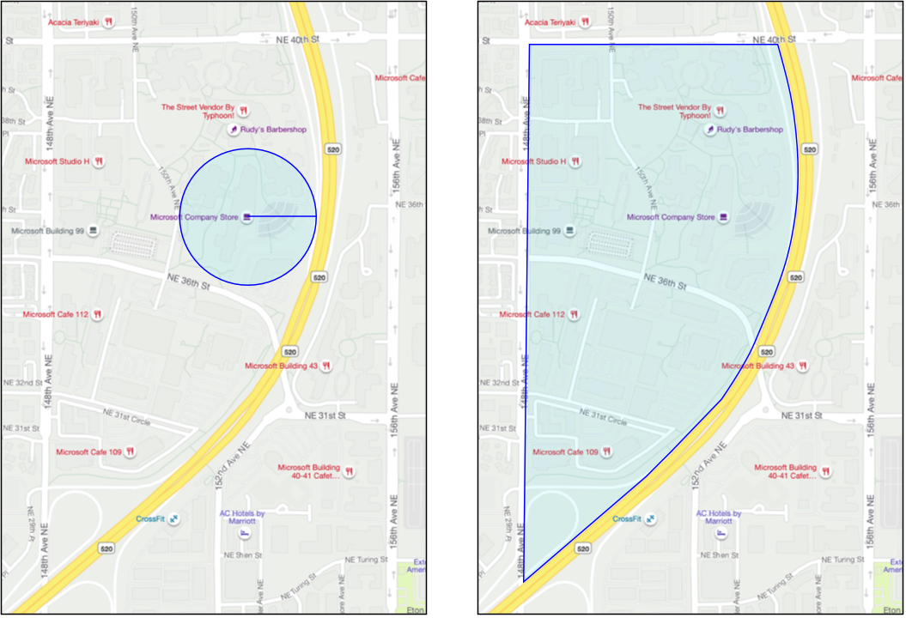

<!--
CO_OP_TRANSLATOR_METADATA:
{
  "original_hash": "078ae664c7b686bf069545e9a5fc95b2",
  "translation_date": "2025-08-27T21:28:22+00:00",
  "source_file": "3-transport/lessons/4-geofences/README.md",
  "language_code": "sv"
}
-->
# Geofences


> Sketchnote av [Nitya Narasimhan](https://github.com/nitya). Klicka på bilden för en större version.

Den här videon ger en översikt av geofences och hur man använder dem i Azure Maps, ämnen som kommer att behandlas i denna lektion:

[](https://www.youtube.com/watch?v=nsrgYhaYNVY)

> 🎥 Klicka på bilden ovan för att titta på videon

## Förkunskapstest

[Förkunskapstest](https://black-meadow-040d15503.1.azurestaticapps.net/quiz/27)

## Introduktion

Under de senaste tre lektionerna har du använt IoT för att spåra lastbilar som transporterar dina produkter från gården till en bearbetningscentral. Du har samlat in GPS-data, skickat det till molnet för lagring och visualiserat det på en karta. Nästa steg för att öka effektiviteten i din leveranskedja är att få en varning när en lastbil är på väg att anlända till bearbetningscentralen, så att personalen som behövs för att lasta av kan vara redo med gaffeltruckar och annan utrustning så snart fordonet anländer. På så sätt kan de lasta av snabbt, och du slipper betala för att en lastbil och förare står och väntar.

I denna lektion kommer du att lära dig om geofences - definierade geospatiala områden, som till exempel ett område inom en 2 km radie från en bearbetningscentral, och hur man testar om GPS-koordinater är innanför eller utanför en geofence, så att du kan se om din GPS-sensor har anlänt till eller lämnat ett område.

I denna lektion kommer vi att behandla:

* [Vad är geofences](../../../../../3-transport/lessons/4-geofences)
* [Definiera en geofence](../../../../../3-transport/lessons/4-geofences)
* [Testa punkter mot en geofence](../../../../../3-transport/lessons/4-geofences)
* [Använd geofences från serverlös kod](../../../../../3-transport/lessons/4-geofences)

> 🗑 Detta är den sista lektionen i detta projekt, så efter att du har slutfört denna lektion och uppgiften, glöm inte att städa upp dina molntjänster. Du kommer att behöva tjänsterna för att slutföra uppgiften, så se till att göra det först.
>
> Se [guiden för att städa upp ditt projekt](../../../clean-up.md) om du behöver instruktioner för hur du gör detta.

## Vad är Geofences

En geofence är en virtuell avgränsning för ett verkligt geografiskt område. Geofences kan vara cirklar definierade som en punkt och en radie (till exempel en cirkel med en diameter på 100 m runt en byggnad), eller en polygon som täcker ett område som en skolzon, stadsgräns eller universitets- eller kontorscampus.



> 💁 Du kanske redan har använt geofences utan att veta om det. Om du har ställt in en påminnelse med hjälp av iOS-påminnelseappen eller Google Keep baserat på en plats, har du använt en geofence. Dessa appar ställer in en geofence baserat på den angivna platsen och varnar dig när din telefon går in i geofencen.

Det finns många anledningar till varför du skulle vilja veta om ett fordon är innanför eller utanför en geofence:

* Förberedelse för avlastning - att få en notifikation om att ett fordon har anlänt till platsen gör att personalen kan vara redo att lasta av fordonet, vilket minskar väntetiden. Detta kan göra det möjligt för en förare att göra fler leveranser per dag med mindre väntetid.
* Skatteefterlevnad - vissa länder, som Nya Zeeland, tar ut vägskatter för dieselfordon baserat på fordonets vikt när de kör på allmänna vägar. Med hjälp av geofences kan du spåra körsträckan på allmänna vägar jämfört med privata vägar på platser som gårdar eller skogsområden.
* Stöldövervakning - om ett fordon endast ska befinna sig inom ett visst område, som på en gård, och det lämnar geofencen, kan det ha blivit stulet.
* Platsöverensstämmelse - vissa delar av en arbetsplats, gård eller fabrik kan vara förbjudna för vissa fordon, till exempel att hålla fordon som transporterar konstgödsel och bekämpningsmedel borta från fält som odlar ekologiska produkter. Om en geofence bryts, är fordonet utanför överensstämmelse och föraren kan meddelas.

✅ Kan du komma på andra användningsområden för geofences?

Azure Maps, tjänsten du använde i förra lektionen för att visualisera GPS-data, låter dig definiera geofences och sedan testa om en punkt är innanför eller utanför geofencen.

## Definiera en geofence

Geofences definieras med hjälp av GeoJSON, precis som punkterna som lades till på kartan i föregående lektion. I detta fall, istället för att vara en `FeatureCollection` av `Point`-värden, är det en `FeatureCollection` som innehåller en `Polygon`.

```json
{
   "type": "FeatureCollection",
   "features": [
     {
       "type": "Feature",
       "geometry": {
         "type": "Polygon",
         "coordinates": [
           [
             [
               -122.13393688201903,
               47.63829579223815
             ],
             [
               -122.13389128446579,
               47.63782047131512
             ],
             [
               -122.13240802288054,
               47.63783312249837
             ],
             [
               -122.13238388299942,
               47.63829037035086
             ],
             [
               -122.13393688201903,
               47.63829579223815
             ]
           ]
         ]
       },
       "properties": {
         "geometryId": "1"
       }
     }
   ]
}
```

Varje punkt på polygonen definieras som ett longitud-, latitudpar i en array, och dessa punkter finns i en array som anges som `coordinates`. I en `Point` i förra lektionen var `coordinates` en array som innehöll 2 värden, latitud och longitud. För en `Polygon` är det en array av arrayer som innehåller 2 värden, longitud och latitud.

> 💁 Kom ihåg, GeoJSON använder `longitud, latitud` för punkter, inte `latitud, longitud`

Polygonens koordinat-array har alltid 1 mer post än antalet punkter på polygonen, där den sista posten är densamma som den första, vilket stänger polygonen. Till exempel, för en rektangel skulle det finnas 5 punkter.


I bilden ovan finns en rektangel. Polygonens koordinater börjar i det övre vänstra hörnet vid 47,-122, sedan rör sig till höger till 47,-121, sedan ner till 46,-121, sedan till vänster till 46,-122, och sedan tillbaka upp till startpunkten vid 47,-122. Detta ger polygonen 5 punkter - övre vänster, övre höger, nedre höger, nedre vänster och sedan övre vänster för att stänga den.

✅ Försök skapa en GeoJSON-polygon runt ditt hem eller din skola. Använd ett verktyg som [GeoJSON.io](https://geojson.io/).

### Uppgift - definiera en geofence

För att använda en geofence i Azure Maps måste den först laddas upp till ditt Azure Maps-konto. När den har laddats upp får du ett unikt ID som du kan använda för att testa en punkt mot geofencen. För att ladda upp geofences till Azure Maps måste du använda kartornas webb-API. Du kan anropa Azure Maps webb-API med ett verktyg som [curl](https://curl.se).

> 🎓 Curl är ett kommandoradsverktyg för att göra förfrågningar mot webbtjänster

1. Om du använder Linux, macOS eller en nyare version av Windows 10 har du förmodligen curl installerat redan. Kör följande från din terminal eller kommandorad för att kontrollera:

    ```sh
    curl --version
    ```

    Om du inte ser versionsinformation för curl måste du installera det från [curl-nedladdningssidan](https://curl.se/download.html).

    > 💁 Om du är erfaren med Postman kan du använda det istället om du föredrar.

1. Skapa en GeoJSON-fil som innehåller en polygon. Du kommer att testa detta med din GPS-sensor, så skapa en polygon runt din nuvarande plats. Du kan antingen skapa en manuellt genom att redigera GeoJSON-exemplet ovan eller använda ett verktyg som [GeoJSON.io](https://geojson.io/).

    GeoJSON måste innehålla en `FeatureCollection` som innehåller en `Feature` med en `geometry` av typen `Polygon`.

    Du **MÅSTE** också lägga till ett `properties`-element på samma nivå som `geometry`-elementet, och detta måste innehålla en `geometryId`:

    ```json
    "properties": {
        "geometryId": "1"
    }
    ```

    Om du använder [GeoJSON.io](https://geojson.io/) måste du manuellt lägga till detta objekt i det tomma `properties`-elementet, antingen efter att du har laddat ner JSON-filen eller i JSON-redigeraren i appen.

    Detta `geometryId` måste vara unikt i denna fil. Du kan ladda upp flera geofences som flera `Features` i `FeatureCollection` i samma GeoJSON-fil, så länge varje har ett unikt `geometryId`. Polygons kan ha samma `geometryId` om de laddas upp från en annan fil vid en annan tidpunkt.

1. Spara denna fil som `geofence.json` och navigera till där den är sparad i din terminal eller konsol.

1. Kör följande curl-kommando för att skapa GeoFence:

    ```sh
    curl --request POST 'https://atlas.microsoft.com/mapData/upload?api-version=1.0&dataFormat=geojson&subscription-key=<subscription_key>' \
         --header 'Content-Type: application/json' \
         --include \
         --data @geofence.json
    ```

    Ersätt `<subscription_key>` i URL:en med API-nyckeln för ditt Azure Maps-konto.

    URL:en används för att ladda upp kartdata via `https://atlas.microsoft.com/mapData/upload`-API:et. Anropet inkluderar en `api-version`-parameter för att specificera vilken Azure Maps-API som ska användas, detta är för att tillåta API:et att förändras över tid men bibehålla bakåtkompatibilitet. Dataformatet som laddas upp är inställt på `geojson`.

    Detta kommer att köra POST-förfrågan till uppladdnings-API:et och returnera en lista med svarshuvuden som inkluderar ett huvud kallat `location`.

    ```output
    content-type: application/json
    location: https://us.atlas.microsoft.com/mapData/operations/1560ced6-3a80-46f2-84b2-5b1531820eab?api-version=1.0
    x-ms-azuremaps-region: West US 2
    x-content-type-options: nosniff
    strict-transport-security: max-age=31536000; includeSubDomains
    x-cache: CONFIG_NOCACHE
    date: Sat, 22 May 2021 21:34:57 GMT
    content-length: 0
    ```

    > 🎓 När du anropar en webbtjänst kan du skicka parametrar till anropet genom att lägga till ett `?` följt av nyckel-värde-par som `key=value`, separerade med ett `&`.

1. Azure Maps bearbetar inte detta omedelbart, så du måste kontrollera om uppladdningsförfrågan har slutförts genom att använda URL:en som ges i `location`-huvudet. Gör en GET-förfrågan till denna plats för att se statusen. Du måste lägga till din prenumerationsnyckel i slutet av `location`-URL:en genom att lägga till `&subscription-key=<subscription_key>` i slutet, där `<subscription_key>` ersätts med API-nyckeln för ditt Azure Maps-konto. Kör följande kommando:

    ```sh
    curl --request GET '<location>&subscription-key=<subscription_key>'
    ```

    Ersätt `<location>` med värdet av `location`-huvudet och `<subscription_key>` med API-nyckeln för ditt Azure Maps-konto.

1. Kontrollera värdet av `status` i svaret. Om det inte är `Succeeded`, vänta en minut och försök igen.

1. När statusen kommer tillbaka som `Succeeded`, titta på `resourceLocation` från svaret. Detta innehåller detaljer om det unika ID:t (kallat UDID) för GeoJSON-objektet. UDID är värdet efter `metadata/` och inte inklusive `api-version`. Till exempel, om `resourceLocation` var:

    ```json
    {
      "resourceLocation": "https://us.atlas.microsoft.com/mapData/metadata/7c3776eb-da87-4c52-ae83-caadf980323a?api-version=1.0"
    }
    ```

    Då skulle UDID vara `7c3776eb-da87-4c52-ae83-caadf980323a`.

    Spara en kopia av detta UDID eftersom du kommer att behöva det för att testa geofencen.

## Testa punkter mot en geofence

När polygonen har laddats upp till Azure Maps kan du testa en punkt för att se om den är innanför eller utanför geofencen. Du gör detta genom att göra en webbförfrågan, där du skickar in geofencens UDID samt latitud och longitud för punkten som ska testas.

När du gör denna förfrågan kan du också skicka ett värde som kallas `searchBuffer`. Detta anger hur noggrann API:et ska vara när det returnerar resultat. Anledningen till detta är att GPS inte är helt exakt, och ibland kan platser vara fel med flera meter eller mer. Standardvärdet för sökbufferten är 50 m, men du kan ange värden från 0 m till 500 m.

När resultaten returneras från API-anropet är en av delarna i resultatet ett `distance`-värde som mäts till den närmaste punkten på kanten av geofencen, med ett positivt värde om punkten är utanför geofencen och ett negativt värde om den är innanför. Om detta avstånd är mindre än sökbufferten returneras det faktiska avståndet i meter, annars är värdet 999 eller -999. 999 betyder att punkten är utanför geofencen med mer än sökbufferten, -999 betyder att den är innanför geofencen med mer än sökbufferten.


I bilden ovan har geofencen en 50 m sökbuffer.

* En punkt i mitten av geofencen, långt innanför sökbufferten, har ett avstånd på **-999**
* En punkt långt utanför sökbufferten har ett avstånd på **999**
* En punkt innanför geofencen och innanför sökbufferten, 6 m från geofencen, har ett avstånd på **6 m**
* En punkt utanför geofencen och innanför sökbufferten, 39 m från geofencen, har ett avstånd på **39 m**

Det är viktigt att känna till avståndet till kanten av geofencen och kombinera detta med annan information, såsom andra GPS-avläsningar, hastighet och väginformation, när man fattar beslut baserat på ett fordons position.

Till exempel, föreställ dig GPS-avläsningar som visar att ett fordon kör längs en väg som går bredvid en geofence. Om en enskild GPS-avläsning är felaktig och placerar fordonet innanför geofencen, trots att det inte finns någon fordonsåtkomst, kan detta ignoreras.


I bilden ovan finns en geofence över en del av Microsofts campus. Den röda linjen visar en lastbil som kör längs 520, med cirklar som representerar GPS-avläsningar. De flesta av dessa är korrekta och ligger längs 520, men en avläsning är felaktig och befinner sig inom geofencen. Det är omöjligt att den avläsningen är korrekt – det finns inga vägar som gör det möjligt för lastbilen att plötsligt svänga av från 520 in på campus och sedan tillbaka till 520. Koden som kontrollerar denna geofence måste ta hänsyn till tidigare avläsningar innan den agerar på resultaten från geofence-testet.

✅ Vilka ytterligare data skulle du behöva för att kontrollera om en GPS-avläsning kan anses vara korrekt?

### Uppgift - testa punkter mot en geofence

1. Börja med att bygga URL:en för web-API-förfrågan. Formatet är:

    ```output
    https://atlas.microsoft.com/spatial/geofence/json?api-version=1.0&deviceId=gps-sensor&subscription-key=<subscription-key>&udid=<UDID>&lat=<lat>&lon=<lon>
    ```

    Ersätt `<subscription_key>` med API-nyckeln för ditt Azure Maps-konto.

    Ersätt `<UDID>` med UDID för geofencen från den tidigare uppgiften.

    Ersätt `<lat>` och `<lon>` med latitud och longitud som du vill testa.

    Denna URL använder API:t `https://atlas.microsoft.com/spatial/geofence/json` för att fråga en geofence definierad med GeoJSON. Den riktar sig mot API-versionen `1.0`. Parametern `deviceId` är obligatorisk och bör vara namnet på enheten som latitud och longitud kommer från.

    Standardvärdet för sökbuffer är 50 m, och du kan ändra detta genom att lägga till en extra parameter `searchBuffer=<distance>`, där `<distance>` är sökbufferavståndet i meter, från 0 till 500.

1. Använd curl för att göra en GET-förfrågan till denna URL:

    ```sh
    curl --request GET '<URL>'
    ```

    > 💁 Om du får en svarskod `BadRequest`, med ett felmeddelande:
    >
    > ```output
    > Invalid GeoJSON: All feature properties should contain a geometryId, which is used for identifying the geofence.
    > ```
    >
    > då saknar din GeoJSON sektionen `properties` med `geometryId`. Du måste korrigera din GeoJSON och sedan upprepa stegen ovan för att ladda upp den igen och få en ny UDID.

1. Svaret kommer att innehålla en lista med `geometries`, en för varje polygon definierad i GeoJSON som användes för att skapa geofencen. Varje geometri har tre intressanta fält: `distance`, `nearestLat` och `nearestLon`.

    ```output
    {
        "geometries": [
            {
                "deviceId": "gps-sensor",
                "udId": "7c3776eb-da87-4c52-ae83-caadf980323a",
                "geometryId": "1",
                "distance": 999.0,
                "nearestLat": 47.645875,
                "nearestLon": -122.142713
            }
        ],
        "expiredGeofenceGeometryId": [],
        "invalidPeriodGeofenceGeometryId": []
    }
    ```

    * `nearestLat` och `nearestLon` är latitud och longitud för en punkt på kanten av geofencen som är närmast den plats som testas.

    * `distance` är avståndet från den plats som testas till den närmaste punkten på kanten av geofencen. Negativa siffror betyder innanför geofencen, positiva utanför. Detta värde kommer att vara mindre än 50 (standardvärdet för sökbuffer) eller 999.

1. Upprepa detta flera gånger med platser både innanför och utanför geofencen.

## Använd geofences från serverlös kod

Du kan nu lägga till en ny trigger i din Functions-app för att testa IoT Hub GPS-händelsedata mot geofencen.

### Konsumentgrupper

Som du kanske minns från tidigare lektioner, tillåter IoT Hub dig att spela upp händelser som har tagits emot av hubben men inte bearbetats. Men vad händer om flera triggers ansluter? Hur vet den vilken som har bearbetat vilka händelser?

Svaret är att den inte kan! Istället kan du definiera flera separata anslutningar för att läsa av händelser, och varje anslutning kan hantera uppspelningen av olästa meddelanden. Dessa kallas *konsumentgrupper*. När du ansluter till slutpunkten kan du specificera vilken konsumentgrupp du vill ansluta till. Varje komponent i din applikation kommer att ansluta till en annan konsumentgrupp.


I teorin kan upp till 5 applikationer ansluta till varje konsumentgrupp, och de kommer alla att ta emot meddelanden när de anländer. Det är bäst att endast ha en applikation som får åtkomst till varje konsumentgrupp för att undvika duplicerad meddelandebearbetning och säkerställa att alla köade meddelanden bearbetas korrekt vid omstart. Till exempel, om du startade din Functions-app lokalt samtidigt som den körs i molnet, skulle båda bearbeta meddelanden, vilket leder till duplicerade blobbar som lagras i lagringskontot.

Om du granskar filen `function.json` för IoT Hub-triggern som du skapade i en tidigare lektion, kommer du att se konsumentgruppen i avsnittet för event hub-triggerbindning:

```json
"consumerGroup": "$Default"
```

När du skapar en IoT Hub får du konsumentgruppen `$Default` skapad som standard. Om du vill lägga till en extra trigger kan du göra detta genom att använda en ny konsumentgrupp.

> 💁 I denna lektion kommer du att använda en annan funktion för att testa geofencen än den som används för att lagra GPS-data. Detta är för att visa hur man använder konsumentgrupper och separerar koden för att göra den lättare att läsa och förstå. I en produktionsapplikation finns det många sätt att strukturera detta – att lägga båda i en funktion, använda en trigger på lagringskontot för att köra en funktion som kontrollerar geofencen, eller använda flera funktioner. Det finns inget "rätt sätt", det beror på resten av din applikation och dina behov.

### Uppgift - skapa en ny konsumentgrupp

1. Kör följande kommando för att skapa en ny konsumentgrupp som heter `geofence` för din IoT Hub:

    ```sh
    az iot hub consumer-group create --name geofence \
                                     --hub-name <hub_name>
    ```

    Ersätt `<hub_name>` med namnet du använde för din IoT Hub.

1. Om du vill se alla konsumentgrupper för en IoT Hub, kör följande kommando:

    ```sh
    az iot hub consumer-group list --output table \
                                   --hub-name <hub_name>
    ```

    Ersätt `<hub_name>` med namnet du använde för din IoT Hub. Detta kommer att lista alla konsumentgrupper.

    ```output
    Name      ResourceGroup
    --------  ---------------
    $Default  gps-sensor
    geofence  gps-sensor
    ```

> 💁 När du körde IoT Hub-händelseövervakningen i en tidigare lektion anslöt den till konsumentgruppen `$Default`. Detta var anledningen till att du inte kan köra händelseövervakningen och en händelsetrigger samtidigt. Om du vill köra båda kan du använda andra konsumentgrupper för alla dina Functions-appar och behålla `$Default` för händelseövervakningen.

### Uppgift - skapa en ny IoT Hub-trigger

1. Lägg till en ny IoT Hub-händelsetrigger i din `gps-trigger` Functions-app som du skapade i en tidigare lektion. Namnge denna funktion `geofence-trigger`.

    > ⚠️ Du kan hänvisa till [instruktionerna för att skapa en IoT Hub-händelsetrigger från projekt 2, lektion 5 om det behövs](../../../2-farm/lessons/5-migrate-application-to-the-cloud/README.md#create-an-iot-hub-event-trigger).

1. Konfigurera IoT Hub-anslutningssträngen i filen `function.json`. Filen `local.settings.json` delas mellan alla triggers i Functions-appen.

1. Uppdatera värdet för `consumerGroup` i filen `function.json` för att referera till den nya konsumentgruppen `geofence`:

    ```json
    "consumerGroup": "geofence"
    ```

1. Du kommer att behöva använda prenumerationsnyckeln för ditt Azure Maps-konto i denna trigger, så lägg till en ny post i filen `local.settings.json` som heter `MAPS_KEY`.

1. Kör Functions-appen för att säkerställa att den ansluter och bearbetar meddelanden. `iot-hub-trigger` från den tidigare lektionen kommer också att köras och ladda upp blobbar till lagring.

    > För att undvika duplicerade GPS-avläsningar i bloblagring kan du stoppa Functions-appen som du har körande i molnet. För att göra detta, använd följande kommando:
    >
    > ```sh
    > az functionapp stop --resource-group gps-sensor \
    >                     --name <functions_app_name>
    > ```
    >
    > Ersätt `<functions_app_name>` med namnet du använde för din Functions-app.
    >
    > Du kan starta om den senare med följande kommando:
    >
    > ```sh
    > az functionapp start --resource-group gps-sensor \
    >                     --name <functions_app_name>
    > ```
    >
    > Ersätt `<functions_app_name>` med namnet du använde för din Functions-app.

### Uppgift - testa geofencen från triggern

Tidigare i denna lektion använde du curl för att fråga en geofence för att se om en punkt befann sig innanför eller utanför. Du kan göra en liknande webbförfrågan från din trigger.

1. För att fråga geofencen behöver du dess UDID. Lägg till en ny post i filen `local.settings.json` som heter `GEOFENCE_UDID` med detta värde.

1. Öppna filen `__init__.py` från den nya triggern `geofence-trigger`.

1. Lägg till följande import högst upp i filen:

    ```python
    import json
    import os
    import requests
    ```

    Paketet `requests` gör det möjligt att göra webbförfrågningar via API. Azure Maps har inget Python-SDK, du måste göra webbförfrågningar via API för att använda det från Python-kod.

1. Lägg till följande två rader i början av metoden `main` för att hämta prenumerationsnyckeln för Maps:

    ```python
    maps_key = os.environ['MAPS_KEY']
    geofence_udid = os.environ['GEOFENCE_UDID']    
    ```

1. Inuti loopen `for event in events`, lägg till följande för att hämta latitud och longitud från varje händelse:

    ```python
    event_body = json.loads(event.get_body().decode('utf-8'))
    lat = event_body['gps']['lat']
    lon = event_body['gps']['lon']
    ```

    Denna kod konverterar JSON från händelsekroppen till en ordbok och extraherar sedan `lat` och `lon` från fältet `gps`.

1. När du använder `requests`, istället för att bygga upp en lång URL som du gjorde med curl, kan du använda endast URL-delen och skicka parametrarna som en ordbok. Lägg till följande kod för att definiera URL:en att anropa och konfigurera parametrarna:

    ```python
    url = 'https://atlas.microsoft.com/spatial/geofence/json'

    params = {
        'api-version': 1.0,
        'deviceId': 'gps-sensor',
        'subscription-key': maps_key,
        'udid' : geofence_udid,
        'lat' : lat,
        'lon' : lon
    }
    ```

    Objekten i ordboken `params` kommer att matcha nyckel-värde-paren du använde när du anropade webbförfrågan via curl.

1. Lägg till följande kodrader för att anropa webbförfrågan:

    ```python
    response = requests.get(url, params=params)
    response_body = json.loads(response.text)
    ```

    Detta anropar URL:en med parametrarna och får tillbaka ett svar.

1. Lägg till följande kod under detta:

    ```python
    distance = response_body['geometries'][0]['distance']

    if distance == 999:
        logging.info('Point is outside geofence')
    elif distance > 0:
        logging.info(f'Point is just outside geofence by a distance of {distance}m')
    elif distance == -999:
        logging.info(f'Point is inside geofence')
    else:
        logging.info(f'Point is just inside geofence by a distance of {distance}m')
    ```

    Denna kod antar en geometri och extraherar avståndet från den enda geometrin. Den loggar sedan olika meddelanden baserat på avståndet.

1. Kör denna kod. Du kommer att se i loggningen om GPS-koordinaterna är innanför eller utanför geofencen, med ett avstånd om punkten är inom 50 m. Testa denna kod med olika geofences baserat på platsen för din GPS-sensor, prova att flytta sensorn (t.ex. ansluten till WiFi från en mobiltelefon eller med olika koordinater på den virtuella IoT-enheten) för att se förändringen.

1. När du är redo, distribuera denna kod till din Functions-app i molnet. Glöm inte att distribuera de nya applikationsinställningarna.

    > ⚠️ Du kan hänvisa till [instruktionerna för att ladda upp applikationsinställningar från projekt 2, lektion 5 om det behövs](../../../2-farm/lessons/5-migrate-application-to-the-cloud/README.md#task---upload-your-application-settings).

    > ⚠️ Du kan hänvisa till [instruktionerna för att distribuera din Functions-app från projekt 2, lektion 5 om det behövs](../../../2-farm/lessons/5-migrate-application-to-the-cloud/README.md#task---deploy-your-functions-app-to-the-cloud).

> 💁 Du hittar denna kod i mappen [code/functions](../../../../../3-transport/lessons/4-geofences/code/functions).

---

## 🚀 Utmaning

I denna lektion lade du till en geofence med en GeoJSON-fil som innehåller en enda polygon. Du kan ladda upp flera polygoner samtidigt, så länge de har olika `geometryId`-värden i sektionen `properties`.

Prova att ladda upp en GeoJSON-fil med flera polygoner och justera din kod för att hitta vilken polygon GPS-koordinaterna är närmast eller befinner sig i.

## Efterföreläsningsquiz

[Efterföreläsningsquiz](https://black-meadow-040d15503.1.azurestaticapps.net/quiz/28)

## Granskning & Självstudier

* Läs mer om geofences och några av deras användningsområden på [Geofencing-sidan på Wikipedia](https://en.wikipedia.org/wiki/Geo-fence).
* Läs mer om Azure Maps geofencing API på [Microsoft Azure Maps Spatial - Get Geofence-dokumentationen](https://docs.microsoft.com/rest/api/maps/spatial/getgeofence?WT.mc_id=academic-17441-jabenn).
* Läs mer om konsumentgrupper i [Funktioner och terminologi i Azure Event Hubs - Event consumers-dokumentationen på Microsoft Docs](https://docs.microsoft.com/azure/event-hubs/event-hubs-features?WT.mc_id=academic-17441-jabenn#event-consumers).

## Uppgift

[Skicka notifikationer med Twilio](assignment.md)

---

**Ansvarsfriskrivning**:  
Detta dokument har översatts med hjälp av AI-översättningstjänsten [Co-op Translator](https://github.com/Azure/co-op-translator). Även om vi strävar efter noggrannhet, bör du vara medveten om att automatiserade översättningar kan innehålla fel eller felaktigheter. Det ursprungliga dokumentet på dess ursprungliga språk bör betraktas som den auktoritativa källan. För kritisk information rekommenderas professionell mänsklig översättning. Vi ansvarar inte för eventuella missförstånd eller feltolkningar som uppstår vid användning av denna översättning.