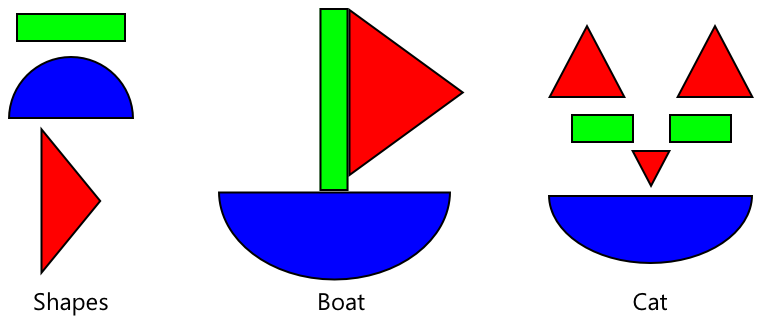

<!--
CO_OP_TRANSLATOR_METADATA:
{
  "original_hash": "f5e63c916d2dd97d58be12aaf76bd9f1",
  "translation_date": "2025-08-27T20:24:32+00:00",
  "source_file": "4-manufacturing/lessons/1-train-fruit-detector/README.md",
  "language_code": "sv"
}
-->
# Träna en detektor för fruktkvalitet


> Sketchnote av [Nitya Narasimhan](https://github.com/nitya). Klicka på bilden för en större version.

Den här videon ger en översikt av Azure Custom Vision-tjänsten, en tjänst som kommer att behandlas i denna lektion.

[](https://www.youtube.com/watch?v=TETcDLJlWR4)

> 🎥 Klicka på bilden ovan för att se videon

## Quiz före föreläsningen

[Quiz före föreläsningen](https://black-meadow-040d15503.1.azurestaticapps.net/quiz/29)

## Introduktion

Den senaste ökningen av artificiell intelligens (AI) och maskininlärning (ML) ger dagens utvecklare en mängd olika möjligheter. ML-modeller kan tränas för att känna igen olika saker i bilder, inklusive omogen frukt, och detta kan användas i IoT-enheter för att hjälpa till att sortera produkter, antingen vid skörd eller under bearbetning i fabriker eller lager.

I denna lektion kommer du att lära dig om bildklassificering - att använda ML-modeller för att skilja mellan bilder av olika saker. Du kommer att lära dig hur man tränar en bildklassificerare för att skilja mellan frukt som är bra och frukt som är dålig, antingen omogen, övermogen, skadad eller rutten.

I denna lektion kommer vi att behandla:

* [Använda AI och ML för att sortera mat](../../../../../4-manufacturing/lessons/1-train-fruit-detector)
* [Bildklassificering via maskininlärning](../../../../../4-manufacturing/lessons/1-train-fruit-detector)
* [Träna en bildklassificerare](../../../../../4-manufacturing/lessons/1-train-fruit-detector)
* [Testa din bildklassificerare](../../../../../4-manufacturing/lessons/1-train-fruit-detector)
* [Träna om din bildklassificerare](../../../../../4-manufacturing/lessons/1-train-fruit-detector)

## Använda AI och ML för att sortera mat

Att föda den globala befolkningen är svårt, särskilt till ett pris som gör mat överkomlig för alla. En av de största kostnaderna är arbetskraft, så bönder vänder sig alltmer till automatisering och verktyg som IoT för att minska sina arbetskostnader. Skörd för hand är arbetsintensivt (och ofta ryggbrytande arbete) och ersätts av maskiner, särskilt i rikare länder. Trots besparingarna i kostnader för att använda maskiner för att skörda finns det en nackdel - förmågan att sortera mat medan den skördas.

Alla grödor mognar inte jämnt. Tomater, till exempel, kan fortfarande ha några gröna frukter på rankan när majoriteten är redo för skörd. Även om det är slöseri att skörda dessa tidigt, är det billigare och enklare för bonden att skörda allt med maskiner och kassera den omogna produkten senare.

✅ Titta på olika frukter eller grönsaker, antingen som växer nära dig på gårdar eller i din trädgård, eller i butiker. Är de alla lika mogna, eller ser du variation?

Den ökade automatiseringen av skörd flyttade sorteringen av produkter från skörden till fabriken. Mat skulle färdas på långa transportband med team av människor som plockade bort produkter som inte uppfyllde kvalitetskraven. Skörden blev billigare tack vare maskiner, men det fanns fortfarande en kostnad för att manuellt sortera mat.


Nästa utveckling var att använda maskiner för att sortera, antingen inbyggda i skördemaskinen eller i bearbetningsanläggningarna. Den första generationen av dessa maskiner använde optiska sensorer för att upptäcka färger, och styrde aktuatorer för att skjuta gröna tomater i en avfallsbehållare med hjälp av spakar eller lufttryck, medan röda tomater fortsatte på ett nätverk av transportband.

I denna video, när tomater faller från ett transportband till ett annat, upptäcks gröna tomater och slängs i en behållare med hjälp av spakar.

✅ Vilka förhållanden skulle du behöva i en fabrik eller på ett fält för att dessa optiska sensorer ska fungera korrekt?

De senaste utvecklingarna av dessa sorteringsmaskiner drar nytta av AI och ML, med modeller som tränats för att skilja bra produkter från dåliga, inte bara genom uppenbara färgskillnader som gröna tomater kontra röda, utan genom mer subtila skillnader i utseende som kan indikera sjukdom eller skador.

## Bildklassificering via maskininlärning

Traditionell programmering innebär att du tar data, tillämpar en algoritm på datan och får ett resultat. Till exempel, i det senaste projektet tog du GPS-koordinater och en geofence, tillämpade en algoritm som tillhandahölls av Azure Maps, och fick tillbaka ett resultat om punkten var innanför eller utanför geofencen. Du matar in mer data, du får mer resultat.


Maskininlärning vänder på detta - du börjar med data och kända resultat, och maskininlärningsalgoritmen lär sig från datan. Du kan sedan ta den tränade algoritmen, kallad en *maskininlärningsmodell* eller *modell*, och mata in ny data och få nya resultat.

> 🎓 Processen där en maskininlärningsalgoritm lär sig från data kallas *träning*. Ingångarna och de kända resultaten kallas *träningsdata*.

Till exempel kan du ge en modell miljontals bilder av omogna bananer som indata för träning, med träningsresultatet satt som `omogen`, och miljontals bilder av mogna bananer som träningsdata med resultatet satt som `mogen`. ML-algoritmen kommer sedan att skapa en modell baserad på denna data. Du ger sedan denna modell en ny bild av en banan och den kommer att förutsäga om den nya bilden är en mogen eller omogen banan.

> 🎓 Resultaten från ML-modeller kallas *förutsägelser*


ML-modeller ger inte ett binärt svar, istället ger de sannolikheter. Till exempel kan en modell ges en bild av en banan och förutsäga `mogen` med 99,7% och `omogen` med 0,3%. Din kod skulle sedan välja den bästa förutsägelsen och avgöra att bananen är mogen.

ML-modellen som används för att upptäcka bilder som denna kallas en *bildklassificerare* - den ges märkta bilder och klassificerar sedan nya bilder baserat på dessa etiketter.

> 💁 Detta är en förenkling, och det finns många andra sätt att träna modeller som inte alltid kräver märkta resultat, såsom osupervised learning. Om du vill lära dig mer om ML, kolla in [ML för nybörjare, en 24-lektionskurs om maskininlärning](https://aka.ms/ML-beginners).

## Träna en bildklassificerare

För att framgångsrikt träna en bildklassificerare behöver du miljontals bilder. Som det visar sig, när du väl har en bildklassificerare tränad på miljontals eller miljarder olika bilder, kan du återanvända den och träna om den med en liten uppsättning bilder och få bra resultat, med en process som kallas *transfer learning*.

> 🎓 Transfer learning är när du överför lärandet från en befintlig ML-modell till en ny modell baserad på ny data.

När en bildklassificerare har tränats för en mängd olika bilder är dess interna funktioner bra på att känna igen former, färger och mönster. Transfer learning gör det möjligt för modellen att ta det den redan har lärt sig om att känna igen bilddelar och använda det för att känna igen nya bilder.



Du kan tänka på detta som lite som barnböcker om former, där när du kan känna igen en halvcirkel, en rektangel och en triangel, kan du känna igen en segelbåt eller en katt beroende på konfigurationen av dessa former. Bildklassificeraren kan känna igen formerna, och transfer learning lär den vilken kombination som gör en båt eller en katt - eller en mogen banan.

Det finns en mängd olika verktyg som kan hjälpa dig att göra detta, inklusive molnbaserade tjänster som kan hjälpa dig att träna din modell och sedan använda den via web-API:er.

> 💁 Att träna dessa modeller kräver mycket datorkraft, vanligtvis via grafikkort (GPU:er). Samma specialiserade hårdvara som gör att spel på din Xbox ser fantastiska ut kan också användas för att träna maskininlärningsmodeller. Genom att använda molnet kan du hyra tid på kraftfulla datorer med GPU:er för att träna dessa modeller, och få tillgång till den datorkraft du behöver, bara för den tid du behöver den.

## Custom Vision

Custom Vision är ett molnbaserat verktyg för att träna bildklassificerare. Det gör det möjligt att träna en klassificerare med endast ett litet antal bilder. Du kan ladda upp bilder via en webbportal, web-API eller ett SDK, och ge varje bild en *tagg* som har klassificeringen av den bilden. Du tränar sedan modellen och testar den för att se hur bra den fungerar. När du är nöjd med modellen kan du publicera versioner av den som kan nås via ett web-API eller ett SDK.


> 💁 Du kan träna en Custom Vision-modell med så lite som 5 bilder per klassificering, men fler är bättre. Du kan få bättre resultat med minst 30 bilder.

Custom Vision är en del av en rad AI-verktyg från Microsoft som kallas Cognitive Services. Dessa är AI-verktyg som kan användas antingen utan någon träning eller med en liten mängd träning. De inkluderar taligenkänning och översättning, språkförståelse och bildanalys. Dessa finns tillgängliga med en gratisnivå som tjänster i Azure.

> 💁 Gratisnivån är mer än tillräcklig för att skapa en modell, träna den och sedan använda den för utvecklingsarbete. Du kan läsa om begränsningarna för gratisnivån på [Custom Vision Limits and quotas-sidan på Microsoft Docs](https://docs.microsoft.com/azure/cognitive-services/custom-vision-service/limits-and-quotas?WT.mc_id=academic-17441-jabenn).

### Uppgift - skapa en Cognitive Services-resurs

För att använda Custom Vision måste du först skapa två Cognitive Services-resurser i Azure med Azure CLI, en för Custom Vision-träning och en för Custom Vision-förutsägelse.

1. Skapa en resursgrupp för detta projekt som heter `fruit-quality-detector`.

1. Använd följande kommando för att skapa en gratis Custom Vision-träningsresurs:

    ```sh
    az cognitiveservices account create --name fruit-quality-detector-training \
                                        --resource-group fruit-quality-detector \
                                        --kind CustomVision.Training \
                                        --sku F0 \
                                        --yes \
                                        --location <location>
    ```

    Ersätt `<location>` med platsen du använde när du skapade resursgruppen.

    Detta kommer att skapa en Custom Vision-träningsresurs i din resursgrupp. Den kommer att kallas `fruit-quality-detector-training` och använda `F0` SKU, vilket är gratisnivån. Alternativet `--yes` betyder att du godkänner villkoren för Cognitive Services.

> 💁 Använd `S0` SKU om du redan har ett gratiskonto som använder någon av Cognitive Services.

1. Använd följande kommando för att skapa en gratis Custom Vision-förutsägelsesresurs:

    ```sh
    az cognitiveservices account create --name fruit-quality-detector-prediction \
                                        --resource-group fruit-quality-detector \
                                        --kind CustomVision.Prediction \
                                        --sku F0 \
                                        --yes \
                                        --location <location>
    ```

    Ersätt `<location>` med platsen du använde när du skapade resursgruppen.

    Detta kommer att skapa en Custom Vision-förutsägelsesresurs i din resursgrupp. Den kommer att kallas `fruit-quality-detector-prediction` och använda `F0` SKU, vilket är gratisnivån. Alternativet `--yes` betyder att du godkänner villkoren för Cognitive Services.

### Uppgift - skapa ett bildklassificeringsprojekt

1. Starta Custom Vision-portalen på [CustomVision.ai](https://customvision.ai) och logga in med det Microsoft-konto du använde för ditt Azure-konto.

1. Följ [avsnittet om att skapa ett nytt projekt i snabbstarten för att bygga en klassificerare på Microsoft Docs](https://docs.microsoft.com/azure/cognitive-services/custom-vision-service/getting-started-build-a-classifier?WT.mc_id=academic-17441-jabenn#create-a-new-project) för att skapa ett nytt Custom Vision-projekt. Användargränssnittet kan ändras och dessa dokument är alltid den mest aktuella referensen.

    Namnge ditt projekt `fruit-quality-detector`.

    När du skapar ditt projekt, se till att använda resursen `fruit-quality-detector-training` som du skapade tidigare. Använd en *Classification*-projekttyp, en *Multiclass*-klassificeringstyp och domänen *Food*.

    

✅ Ta dig tid att utforska Custom Vision-användargränssnittet för din bildklassificerare.

### Uppgift - träna ditt bildklassificeringsprojekt

För att träna en bildklassificerare behöver du flera bilder av frukt, både av bra och dålig kvalitet, för att tagga som bra och dålig, såsom en mogen och en övermogen banan.
💁 Dessa klassificerare kan klassificera bilder av vad som helst, så om du inte har frukt med olika kvalitet till hands kan du använda två olika typer av frukt, eller katter och hundar!
Idealiskt bör varje bild endast visa frukten, med antingen en konsekvent bakgrund eller en stor variation av bakgrunder. Se till att det inte finns något i bakgrunden som är specifikt för mogen kontra omogen frukt.

> 💁 Det är viktigt att inte ha specifika bakgrunder eller specifika föremål som inte är relaterade till det som klassificeras för varje tagg, annars kan klassificeraren bara klassificera baserat på bakgrunden. Det fanns en klassificerare för hudcancer som tränades på födelsemärken, både normala och cancerösa, och de cancerösa hade alla linjaler bredvid sig för att mäta storleken. Det visade sig att klassificeraren var nästan 100 % korrekt på att identifiera linjaler i bilder, inte cancerösa födelsemärken.

Bildklassificerare körs med mycket låg upplösning. Till exempel kan Custom Vision ta tränings- och förutsägningsbilder upp till 10240x10240, men tränar och kör modellen på bilder med upplösningen 227x227. Större bilder krymps till denna storlek, så se till att det du klassificerar tar upp en stor del av bilden, annars kan det bli för litet i den mindre bild som används av klassificeraren.

1. Samla bilder för din klassificerare. Du behöver minst 5 bilder för varje etikett för att träna klassificeraren, men ju fler desto bättre. Du kommer också att behöva några ytterligare bilder för att testa klassificeraren. Dessa bilder bör alla vara olika bilder av samma sak. Till exempel:

    * Använd 2 mogna bananer, ta några bilder av varje från olika vinklar, ta minst 7 bilder (5 för träning, 2 för testning), men helst fler.

        

    * Upprepa samma process med 2 omogna bananer.

    Du bör ha minst 10 träningsbilder, med minst 5 mogna och 5 omogna, och 4 testbilder, 2 mogna, 2 omogna. Dina bilder bör vara png eller jpeg, mindre än 6 MB. Om du skapar dem med en iPhone till exempel kan de vara högupplösta HEIC-bilder, så de måste konverteras och eventuellt krympas. Ju fler bilder desto bättre, och du bör ha ett liknande antal mogna och omogna.

    Om du inte har både mogna och omogna frukter kan du använda olika frukter eller vilka två objekt du har tillgängliga. Du kan också hitta några exempelbilder i [images](../../../../../4-manufacturing/lessons/1-train-fruit-detector/images)-mappen med mogna och omogna bananer som du kan använda.

1. Följ [avsnittet om att ladda upp och tagga bilder i snabbstarten för att bygga en klassificerare på Microsoft Docs](https://docs.microsoft.com/azure/cognitive-services/custom-vision-service/getting-started-build-a-classifier?WT.mc_id=academic-17441-jabenn#upload-and-tag-images) för att ladda upp dina träningsbilder. Tagga den mogna frukten som `ripe` och den omogna frukten som `unripe`.

    

1. Följ [avsnittet om att träna klassificeraren i snabbstarten för att bygga en klassificerare på Microsoft Docs](https://docs.microsoft.com/azure/cognitive-services/custom-vision-service/getting-started-build-a-classifier?WT.mc_id=academic-17441-jabenn#train-the-classifier) för att träna bildklassificeraren på dina uppladdade bilder.

    Du kommer att få välja träningstyp. Välj **Quick Training**.

Klassificeraren kommer sedan att tränas. Det tar några minuter för träningen att slutföras.

> 🍌 Om du bestämmer dig för att äta din frukt medan klassificeraren tränas, se till att du har tillräckligt med bilder att testa med först!

## Testa din bildklassificerare

När din klassificerare är tränad kan du testa den genom att ge den en ny bild att klassificera.

### Uppgift - testa din bildklassificerare

1. Följ [dokumentationen om att testa din modell på Microsoft Docs](https://docs.microsoft.com/azure/cognitive-services/custom-vision-service/test-your-model?WT.mc_id=academic-17441-jabenn#test-your-model) för att testa din bildklassificerare. Använd testbilderna du skapade tidigare, inte några av bilderna du använde för träning.

    

1. Testa alla testbilder du har tillgång till och observera sannolikheterna.

## Träna om din bildklassificerare

När du testar din klassificerare kanske den inte ger de resultat du förväntar dig. Bildklassificerare använder maskininlärning för att göra förutsägelser om vad som finns i en bild, baserat på sannolikheter att vissa funktioner i en bild betyder att den matchar en viss etikett. Den förstår inte vad som finns i bilden - den vet inte vad en banan är eller förstår vad som gör en banan till en banan istället för en båt. Du kan förbättra din klassificerare genom att träna om den med bilder den gör fel på.

Varje gång du gör en förutsägelse med snabbtestalternativet lagras bilden och resultaten. Du kan använda dessa bilder för att träna om din modell.

### Uppgift - träna om din bildklassificerare

1. Följ [dokumentationen om att använda den förutspådda bilden för träning på Microsoft Docs](https://docs.microsoft.com/azure/cognitive-services/custom-vision-service/test-your-model?WT.mc_id=academic-17441-jabenn#use-the-predicted-image-for-training) för att träna om din modell, med rätt tagg för varje bild.

1. När din modell har tränats om, testa med nya bilder.

---

## 🚀 Utmaning

Vad tror du skulle hända om du använde en bild på en jordgubbe med en modell tränad på bananer, eller en bild på en uppblåsbar banan, eller en person i en banandräkt, eller till och med en gul tecknad figur som någon från Simpsons?

Prova och se vad förutsägelserna blir. Du kan hitta bilder att prova med genom att använda [Bing Image search](https://www.bing.com/images/trending).

## Quiz efter föreläsningen

[Quiz efter föreläsningen](https://black-meadow-040d15503.1.azurestaticapps.net/quiz/30)

## Granskning & Självstudier

* När du tränade din klassificerare skulle du ha sett värden för *Precision*, *Recall* och *AP* som betygsätter den modell som skapades. Läs om vad dessa värden är med hjälp av [avsnittet om att utvärdera klassificeraren i snabbstarten för att bygga en klassificerare på Microsoft Docs](https://docs.microsoft.com/azure/cognitive-services/custom-vision-service/getting-started-build-a-classifier?WT.mc_id=academic-17441-jabenn#evaluate-the-classifier)
* Läs om hur du kan förbättra din klassificerare från [hur du förbättrar din Custom Vision-modell på Microsoft Docs](https://docs.microsoft.com/azure/cognitive-services/custom-vision-service/getting-started-improving-your-classifier?WT.mc_id=academic-17441-jabenn)

## Uppgift

[Träna din klassificerare för flera frukter och grönsaker](assignment.md)

---

**Ansvarsfriskrivning**:  
Detta dokument har översatts med hjälp av AI-översättningstjänsten [Co-op Translator](https://github.com/Azure/co-op-translator). Även om vi strävar efter noggrannhet, bör du vara medveten om att automatiserade översättningar kan innehålla fel eller inexaktheter. Det ursprungliga dokumentet på dess originalspråk bör betraktas som den auktoritativa källan. För kritisk information rekommenderas professionell mänsklig översättning. Vi ansvarar inte för eventuella missförstånd eller feltolkningar som uppstår vid användning av denna översättning.