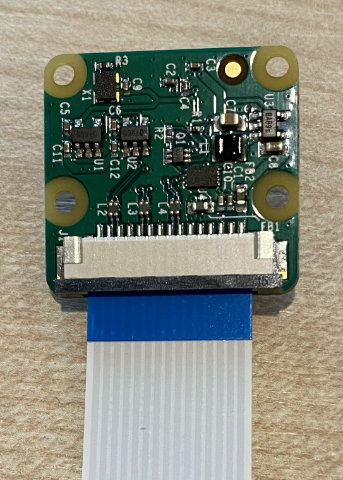

<!--
CO_OP_TRANSLATOR_METADATA:
{
  "original_hash": "c677667095f6133eee418c7e53615d05",
  "translation_date": "2025-08-27T20:41:42+00:00",
  "source_file": "4-manufacturing/lessons/2-check-fruit-from-device/pi-camera.md",
  "language_code": "sv"
}
-->
# Ta en bild - Raspberry Pi

I den här delen av lektionen kommer du att lägga till en kamerasensor till din Raspberry Pi och läsa bilder från den.

## Hårdvara

Raspberry Pi behöver en kamera.

Kameran du kommer att använda är en [Raspberry Pi Camera Module](https://www.raspberrypi.org/products/camera-module-v2/). Den här kameran är designad för att fungera med Raspberry Pi och ansluts via en dedikerad kontakt på Pi.

> 💁 Den här kameran använder [Camera Serial Interface, ett protokoll från Mobile Industry Processor Interface Alliance](https://wikipedia.org/wiki/Camera_Serial_Interface), känt som MIPI-CSI. Detta är ett dedikerat protokoll för att skicka bilder.

## Anslut kameran

Kameran kan anslutas till Raspberry Pi med hjälp av en flatkabel.

### Uppgift - anslut kameran


1. Stäng av Pi.

1. Anslut flatkabeln som följer med kameran till kameran. För att göra detta, dra försiktigt i det svarta plastklippet i hållaren så att det kommer ut lite, skjut sedan in kabeln i uttaget med den blå sidan vänd bort från linsen och metallkontakterna vända mot linsen. När kabeln är helt inskjuten, tryck tillbaka det svarta plastklippet på plats.

    Du kan hitta en animation som visar hur man öppnar klippet och sätter in kabeln i [Raspberry Pi Getting Started with the Camera module documentation](https://projects.raspberrypi.org/en/projects/getting-started-with-picamera/2).

    

1. Ta bort Grove Base Hat från Pi.

1. För flatkabeln genom kamerauttaget i Grove Base Hat. Se till att den blå sidan av kabeln är vänd mot de analoga portarna märkta **A0**, **A1** etc.

    

1. Sätt in flatkabeln i kamerauttaget på Pi. Dra återigen upp det svarta plastklippet, sätt in kabeln och tryck sedan tillbaka klippet. Den blå sidan av kabeln ska vara vänd mot USB- och Ethernet-portarna.

    

1. Sätt tillbaka Grove Base Hat.

## Programmera kameran

Raspberry Pi kan nu programmeras för att använda kameran med hjälp av Python-biblioteket [PiCamera](https://pypi.org/project/picamera/).

### Uppgift - aktivera legacy-kameraläge

Tyvärr, med lanseringen av Raspberry Pi OS Bullseye, ändrades kameramjukvaran som följde med operativsystemet, vilket innebär att PiCamera inte fungerar som standard. Det finns en ersättning på gång, kallad PiCamera2, men den är ännu inte redo att användas.

För tillfället kan du ställa in din Pi i legacy-kameraläge för att tillåta PiCamera att fungera. Kamerauttaget är också inaktiverat som standard, men att aktivera legacy-kameramjukvaran aktiverar automatiskt uttaget.

1. Starta Pi och vänta tills den har startat upp.

1. Starta VS Code, antingen direkt på Pi eller anslut via Remote SSH-tillägget.

1. Kör följande kommandon från din terminal:

    ```sh
    sudo raspi-config nonint do_legacy 0
    sudo reboot
    ```

    Detta kommer att aktivera en inställning för att möjliggöra legacy-kameramjukvaran och sedan starta om Pi för att göra inställningen aktiv.

1. Vänta tills Pi har startat om och starta sedan VS Code igen.

### Uppgift - programmera kameran

Programmera enheten.

1. Skapa en ny mapp i hemmakatalogen för användaren `pi` som heter `fruit-quality-detector` från terminalen. Skapa en fil i den här mappen som heter `app.py`.

1. Öppna den här mappen i VS Code.

1. För att interagera med kameran kan du använda Python-biblioteket PiCamera. Installera Pip-paketet för detta med följande kommando:

    ```sh
    pip3 install picamera
    ```

1. Lägg till följande kod i din `app.py`-fil:

    ```python
    import io
    import time
    from picamera import PiCamera
    ```

    Den här koden importerar några nödvändiga bibliotek, inklusive `PiCamera`-biblioteket.

1. Lägg till följande kod under detta för att initiera kameran:

    ```python
    camera = PiCamera()
    camera.resolution = (640, 480)
    camera.rotation = 0
    
    time.sleep(2)
    ```

    Den här koden skapar ett PiCamera-objekt och ställer in upplösningen till 640x480. Även om högre upplösningar stöds (upp till 3280x2464), fungerar bildklassificeraren med mycket mindre bilder (227x227), så det finns ingen anledning att fånga och skicka större bilder.

    Raden `camera.rotation = 0` ställer in bildens rotation. Flatkabeln går in i botten av kameran, men om din kamera är roterad för att enklare kunna peka på det objekt du vill klassificera, kan du ändra den här raden till antalet grader av rotation.

    

    Om du till exempel hänger flatkabeln över något så att den är ovanför kameran, ställ in rotationen till 180:

    ```python
    camera.rotation = 180
    ```

    Kameran tar några sekunder att starta, därav `time.sleep(2)`.

1. Lägg till följande kod under detta för att fånga bilden som binärdata:

    ```python
    image = io.BytesIO()
    camera.capture(image, 'jpeg')
    image.seek(0)
    ```

    Den här koden skapar ett `BytesIO`-objekt för att lagra binärdata. Bilden läses från kameran som en JPEG-fil och lagras i detta objekt. Objektet har en positionsindikator för att veta var det befinner sig i datan så att mer data kan skrivas till slutet om det behövs, så raden `image.seek(0)` flyttar denna position tillbaka till början så att all data kan läsas senare.

1. Lägg till följande kod under detta för att spara bilden till en fil:

    ```python
    with open('image.jpg', 'wb') as image_file:
        image_file.write(image.read())
    ```

    Den här koden öppnar en fil som heter `image.jpg` för skrivning, läser sedan all data från `BytesIO`-objektet och skriver det till filen.

    > 💁 Du kan fånga bilden direkt till en fil istället för ett `BytesIO`-objekt genom att skicka filnamnet till `camera.capture`-anropet. Anledningen till att använda `BytesIO`-objektet är att du senare i den här lektionen kan skicka bilden till din bildklassificerare.

1. Rikta kameran mot något och kör den här koden.

1. En bild kommer att fångas och sparas som `image.jpg` i den aktuella mappen. Du kommer att se den här filen i VS Code Explorer. Välj filen för att visa bilden. Om den behöver roteras, uppdatera raden `camera.rotation = 0` vid behov och ta en ny bild.

> 💁 Du kan hitta den här koden i mappen [code-camera/pi](../../../../../4-manufacturing/lessons/2-check-fruit-from-device/code-camera/pi).

😀 Ditt kameraprogram blev en framgång!

---

**Ansvarsfriskrivning**:  
Detta dokument har översatts med hjälp av AI-översättningstjänsten [Co-op Translator](https://github.com/Azure/co-op-translator). Även om vi strävar efter noggrannhet, bör du vara medveten om att automatiserade översättningar kan innehålla fel eller felaktigheter. Det ursprungliga dokumentet på dess ursprungliga språk bör betraktas som den auktoritativa källan. För kritisk information rekommenderas professionell mänsklig översättning. Vi ansvarar inte för eventuella missförstånd eller feltolkningar som uppstår vid användning av denna översättning.