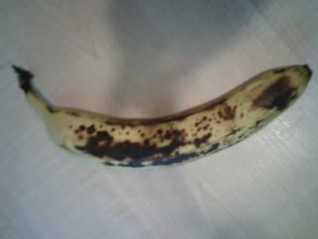

<!--
CO_OP_TRANSLATOR_METADATA:
{
  "original_hash": "160be8c0f558687f6686dca64f10f739",
  "translation_date": "2025-08-27T20:43:37+00:00",
  "source_file": "4-manufacturing/lessons/2-check-fruit-from-device/wio-terminal-camera.md",
  "language_code": "sv"
}
-->
# Ta en bild - Wio Terminal

I denna del av lektionen kommer du att lägga till en kamera till din Wio Terminal och ta bilder med den.

## Hårdvara

Wio Terminal behöver en kamera.

Kameran du kommer att använda är en [ArduCam Mini 2MP Plus](https://www.arducam.com/product/arducam-2mp-spi-camera-b0067-arduino/). Detta är en 2 megapixel kamera baserad på OV2640 bildsensor. Den kommunicerar via ett SPI-gränssnitt för att ta bilder och använder I2C för att konfigurera sensorn.

## Anslut kameran

ArduCam har ingen Grove-sockel, istället ansluts den till både SPI- och I2C-bussarna via GPIO-stiften på Wio Terminal.

### Uppgift - anslut kameran

Anslut kameran.


1. Stiften på basen av ArduCam måste anslutas till GPIO-stiften på Wio Terminal. För att göra det enklare att hitta rätt stift, fäst GPIO-stiftetiketten som följer med Wio Terminal runt stiften:

    

1. Använd jumperkablar för att göra följande anslutningar:

    | ArduCAM-stift | Wio Terminal-stift | Beskrivning                             |
    | ------------- | ------------------ | --------------------------------------- |
    | CS            | 24 (SPI_CS)        | SPI Chip Select                         |
    | MOSI          | 19 (SPI_MOSI)      | SPI Controller Output, Peripheral Input |
    | MISO          | 21 (SPI_MISO)      | SPI Controller Input, Peripheral Output |
    | SCK           | 23 (SPI_SCLK)      | SPI Serial Clock                        |
    | GND           | 6 (GND)            | Jord - 0V                               |
    | VCC           | 4 (5V)             | 5V strömförsörjning                     |
    | SDA           | 3 (I2C1_SDA)       | I2C Serial Data                         |
    | SCL           | 5 (I2C1_SCL)       | I2C Serial Clock                        |

    

    GND- och VCC-anslutningarna ger en 5V strömförsörjning till ArduCam. Den körs på 5V, till skillnad från Grove-sensorer som körs på 3V. Denna ström kommer direkt från USB-C-anslutningen som driver enheten.

    > 💁 För SPI-anslutningen använder stiftetiketterna på ArduCam och Wio Terminal fortfarande den gamla namngivningskonventionen i kod. Instruktionerna i denna lektion kommer att använda den nya namngivningskonventionen, förutom när stiftnamnen används i kod.

1. Du kan nu ansluta Wio Terminal till din dator.

## Programmera enheten för att ansluta till kameran

Wio Terminal kan nu programmeras för att använda den anslutna ArduCAM-kameran.

### Uppgift - programmera enheten för att ansluta till kameran

1. Skapa ett helt nytt Wio Terminal-projekt med PlatformIO. Namnge detta projekt `fruit-quality-detector`. Lägg till kod i `setup`-funktionen för att konfigurera den seriella porten.

1. Lägg till kod för att ansluta till WiFi, med dina WiFi-uppgifter i en fil som heter `config.h`. Glöm inte att lägga till de nödvändiga biblioteken i `platformio.ini`-filen.

1. ArduCam-biblioteket är inte tillgängligt som ett Arduino-bibliotek som kan installeras från `platformio.ini`-filen. Istället måste det installeras från källkoden på deras GitHub-sida. Du kan få detta genom att antingen:

    * Klona repot från [https://github.com/ArduCAM/Arduino.git](https://github.com/ArduCAM/Arduino.git)
    * Gå till repot på GitHub på [github.com/ArduCAM/Arduino](https://github.com/ArduCAM/Arduino) och ladda ner koden som en zip-fil från **Code**-knappen

1. Du behöver bara mappen `ArduCAM` från denna kod. Kopiera hela mappen till `lib`-mappen i ditt projekt.

    > ⚠️ Hela mappen måste kopieras, så koden finns i `lib/ArduCam`. Kopiera inte bara innehållet i `ArduCam`-mappen till `lib`-mappen, kopiera hela mappen.

1. ArduCam-bibliotekskoden fungerar för flera typer av kameror. Kameratypen du vill använda konfigureras med hjälp av kompilatorflaggor - detta håller det byggda biblioteket så litet som möjligt genom att ta bort kod för kameror du inte använder. För att konfigurera biblioteket för OV2640-kameran, lägg till följande i slutet av `platformio.ini`-filen:

    ```ini
    build_flags =
        -DARDUCAM_SHIELD_V2
        -DOV2640_CAM
    ```

    Detta ställer in två kompilatorflaggor:

      * `ARDUCAM_SHIELD_V2` för att tala om för biblioteket att kameran är på ett Arduino-kort, känt som en shield.
      * `OV2640_CAM` för att tala om för biblioteket att endast inkludera kod för OV2640-kameran.

1. Lägg till en headerfil i `src`-mappen som heter `camera.h`. Denna kommer att innehålla kod för att kommunicera med kameran. Lägg till följande kod i denna fil:

    ```cpp
    #pragma once
    
    #include <ArduCAM.h>
    #include <Wire.h>
    
    class Camera
    {
    public:
        Camera(int format, int image_size) : _arducam(OV2640, PIN_SPI_SS)
        {
            _format = format;
            _image_size = image_size;
        }
    
        bool init()
        {
            // Reset the CPLD
            _arducam.write_reg(0x07, 0x80);
            delay(100);
    
            _arducam.write_reg(0x07, 0x00);
            delay(100);
    
            // Check if the ArduCAM SPI bus is OK
            _arducam.write_reg(ARDUCHIP_TEST1, 0x55);
            if (_arducam.read_reg(ARDUCHIP_TEST1) != 0x55)
            {
                return false;
            }
                
            // Change MCU mode
            _arducam.set_mode(MCU2LCD_MODE);
    
            uint8_t vid, pid;
    
            // Check if the camera module type is OV2640
            _arducam.wrSensorReg8_8(0xff, 0x01);
            _arducam.rdSensorReg8_8(OV2640_CHIPID_HIGH, &vid);
            _arducam.rdSensorReg8_8(OV2640_CHIPID_LOW, &pid);
            if ((vid != 0x26) && ((pid != 0x41) || (pid != 0x42)))
            {
                return false;
            }
            
            _arducam.set_format(_format);
            _arducam.InitCAM();
            _arducam.OV2640_set_JPEG_size(_image_size);
            _arducam.OV2640_set_Light_Mode(Auto);
            _arducam.OV2640_set_Special_effects(Normal);
            delay(1000);
    
            return true;
        }
    
        void startCapture()
        {
            _arducam.flush_fifo();
            _arducam.clear_fifo_flag();
            _arducam.start_capture();
        }
    
        bool captureReady()
        {
            return _arducam.get_bit(ARDUCHIP_TRIG, CAP_DONE_MASK);
        }
    
        bool readImageToBuffer(byte **buffer, uint32_t &buffer_length)
        {
            if (!captureReady()) return false;
    
            // Get the image file length
            uint32_t length = _arducam.read_fifo_length();
            buffer_length = length;
    
            if (length >= MAX_FIFO_SIZE)
            {
                return false;
            }
            if (length == 0)
            {
                return false;
            }
    
            // create the buffer
            byte *buf = new byte[length];
    
            uint8_t temp = 0, temp_last = 0;
            int i = 0;
            uint32_t buffer_pos = 0;
            bool is_header = false;
    
            _arducam.CS_LOW();
            _arducam.set_fifo_burst();
            
            while (length--)
            {
                temp_last = temp;
                temp = SPI.transfer(0x00);
                //Read JPEG data from FIFO
                if ((temp == 0xD9) && (temp_last == 0xFF)) //If find the end ,break while,
                {
                    buf[buffer_pos] = temp;
    
                    buffer_pos++;
                    i++;
                    
                    _arducam.CS_HIGH();
                }
                if (is_header == true)
                {
                    //Write image data to buffer if not full
                    if (i < 256)
                    {
                        buf[buffer_pos] = temp;
                        buffer_pos++;
                        i++;
                    }
                    else
                    {
                        _arducam.CS_HIGH();
    
                        i = 0;
                        buf[buffer_pos] = temp;
    
                        buffer_pos++;
                        i++;
    
                        _arducam.CS_LOW();
                        _arducam.set_fifo_burst();
                    }
                }
                else if ((temp == 0xD8) & (temp_last == 0xFF))
                {
                    is_header = true;
    
                    buf[buffer_pos] = temp_last;
                    buffer_pos++;
                    i++;
    
                    buf[buffer_pos] = temp;
                    buffer_pos++;
                    i++;
                }
            }
            
            _arducam.clear_fifo_flag();
    
            _arducam.set_format(_format);
            _arducam.InitCAM();
            _arducam.OV2640_set_JPEG_size(_image_size);
    
            // return the buffer
            *buffer = buf;
        }
    
    private:
        ArduCAM _arducam;
        int _format;
        int _image_size;
    };
    ```

    Detta är låg nivå-kod som konfigurerar kameran med hjälp av ArduCam-biblioteken och extraherar bilder vid behov via SPI-bussen. Denna kod är mycket specifik för ArduCam, så du behöver inte oroa dig för hur den fungerar just nu.

1. I `main.cpp`, lägg till följande kod under de andra `include`-uttalandena för att inkludera denna nya fil och skapa en instans av kameraklassen:

    ```cpp
    #include "camera.h"

    Camera camera = Camera(JPEG, OV2640_640x480);
    ```

    Detta skapar en `Camera` som sparar bilder som JPEG med en upplösning på 640x480. Även om högre upplösningar stöds (upp till 3280x2464), fungerar bildklassificeraren på mycket mindre bilder (227x227), så det finns ingen anledning att ta och skicka större bilder.

1. Lägg till följande kod nedanför detta för att definiera en funktion för att konfigurera kameran:

    ```cpp
    void setupCamera()
    {
        pinMode(PIN_SPI_SS, OUTPUT);
        digitalWrite(PIN_SPI_SS, HIGH);
    
        Wire.begin();
        SPI.begin();
    
        if (!camera.init())
        {
            Serial.println("Error setting up the camera!");
        }
    }
    ```

    Denna `setupCamera`-funktion börjar med att konfigurera SPI-chipselect-stiftet (`PIN_SPI_SS`) som högt, vilket gör Wio Terminal till SPI-kontrollern. Den startar sedan I2C- och SPI-bussarna. Slutligen initierar den kameraklassen som konfigurerar kamerans sensorsinställningar och säkerställer att allt är korrekt anslutet.

1. Anropa denna funktion i slutet av `setup`-funktionen:

    ```cpp
    setupCamera();
    ```

1. Bygg och ladda upp denna kod och kontrollera utdata från den seriella monitorn. Om du ser `Error setting up the camera!` kontrollera anslutningarna för att säkerställa att alla kablar ansluter rätt stift på ArduCam till rätt GPIO-stift på Wio Terminal och att alla jumperkablar sitter korrekt.

## Ta en bild

Wio Terminal kan nu programmeras för att ta en bild när en knapp trycks in.

### Uppgift - ta en bild

1. Mikrokontroller kör din kod kontinuerligt, så det är inte enkelt att trigga något som att ta ett foto utan att reagera på en sensor. Wio Terminal har knappar, så kameran kan ställas in för att triggas av en av knapparna. Lägg till följande kod i slutet av `setup`-funktionen för att konfigurera C-knappen (en av de tre knapparna på toppen, den som är närmast strömbrytaren).

    

    ```cpp
    pinMode(WIO_KEY_C, INPUT_PULLUP);
    ```

    Läget `INPUT_PULLUP` inverterar i princip en ingång. Till exempel, normalt skulle en knapp skicka en låg signal när den inte är intryckt och en hög signal när den är intryckt. När den är inställd på `INPUT_PULLUP` skickar den en hög signal när den inte är intryckt och en låg signal när den är intryckt.

1. Lägg till en tom funktion för att svara på knapptryck innan `loop`-funktionen:

    ```cpp
    void buttonPressed()
    {
        
    }
    ```

1. Anropa denna funktion i `loop`-metoden när knappen trycks in:

    ```cpp
    void loop()
    {
        if (digitalRead(WIO_KEY_C) == LOW)
        {
            buttonPressed();
            delay(2000);
        }
    
        delay(200);
    }
    ```

    Denna kod kontrollerar om knappen är intryckt. Om den är intryckt anropas `buttonPressed`-funktionen och loopen fördröjs i 2 sekunder. Detta är för att ge tid för knappen att släppas så att ett långt tryck inte registreras två gånger.

    > 💁 Knappen på Wio Terminal är inställd på `INPUT_PULLUP`, så den skickar en hög signal när den inte är intryckt och en låg signal när den är intryckt.

1. Lägg till följande kod i `buttonPressed`-funktionen:

    ```cpp
    camera.startCapture();
 
    while (!camera.captureReady())
        delay(100);

    Serial.println("Image captured");

    byte *buffer;
    uint32_t length;

    if (camera.readImageToBuffer(&buffer, length))
    {
        Serial.print("Image read to buffer with length ");
        Serial.println(length);

        delete(buffer);
    }
    ```

    Denna kod börjar kamerans bildtagning genom att anropa `startCapture`. Kamerahårdvaran fungerar inte genom att returnera data när du begär det, istället skickar du en instruktion för att börja ta bilder, och kameran kommer att arbeta i bakgrunden för att ta bilden, konvertera den till en JPEG och lagra den i en lokal buffert på själva kameran. Anropet `captureReady` kontrollerar sedan om bildtagningen är klar.

    När bildtagningen är klar kopieras bilddata från bufferten på kameran till en lokal buffert (array av bytes) med anropet `readImageToBuffer`. Längden på bufferten skickas sedan till den seriella monitorn.

1. Bygg och ladda upp denna kod och kontrollera utdata på den seriella monitorn. Varje gång du trycker på C-knappen tas en bild och du kommer att se bildstorleken skickas till den seriella monitorn.

    ```output
    Connecting to WiFi..
    Connected!
    Image captured
    Image read to buffer with length 9224
    Image captured
    Image read to buffer with length 11272
    ```

    Olika bilder kommer att ha olika storlekar. De komprimeras som JPEG och storleken på en JPEG-fil för en given upplösning beror på vad som finns i bilden.

> 💁 Du kan hitta denna kod i [code-camera/wio-terminal](../../../../../4-manufacturing/lessons/2-check-fruit-from-device/code-camera/wio-terminal)-mappen.

😀 Du har framgångsrikt tagit bilder med din Wio Terminal.

## Valfritt - verifiera kamerabilder med ett SD-kort

Det enklaste sättet att se bilderna som togs av kameran är att skriva dem till ett SD-kort i Wio Terminal och sedan visa dem på din dator. Gör detta steg om du har ett extra microSD-kort och en microSD-kortplats i din dator eller en adapter.

Wio Terminal stöder endast microSD-kort på upp till 16GB i storlek. Om du har ett större SD-kort kommer det inte att fungera.

### Uppgift - verifiera kamerabilder med ett SD-kort

1. Formatera ett microSD-kort som FAT32 eller exFAT med relevanta applikationer på din dator (Disk Utility på macOS, File Explorer på Windows eller med kommandoradsverktyg i Linux).

1. Sätt in microSD-kortet i kortplatsen precis under strömbrytaren. Se till att det är helt inne tills det klickar och stannar på plats, du kan behöva trycka in det med en nagel eller ett tunt verktyg.

1. Lägg till följande `include`-uttalanden högst upp i `main.cpp`-filen:

    ```cpp
    #include "SD/Seeed_SD.h"
    #include <Seeed_FS.h>
    ```

1. Lägg till följande funktion före `setup`-funktionen:

    ```cpp
    void setupSDCard()
    {
        while (!SD.begin(SDCARD_SS_PIN, SDCARD_SPI))
        {
            Serial.println("SD Card Error");
        }
    }
    ```

    Detta konfigurerar SD-kortet med SPI-bussen.

1. Anropa detta från `setup`-funktionen:

    ```cpp
    setupSDCard();
    ```

1. Lägg till följande kod ovanför `buttonPressed`-funktionen:

    ```cpp
    int fileNum = 1;

    void saveToSDCard(byte *buffer, uint32_t length)
    {
        char buff[16];
        sprintf(buff, "%d.jpg", fileNum);
        fileNum++;
    
        File outFile = SD.open(buff, FILE_WRITE );
        outFile.write(buffer, length);
        outFile.close();

        Serial.print("Image written to file ");
        Serial.println(buff);
    }
    ```

    Detta definierar en global variabel för en filräknare. Den används för bildfilnamnen så att flera bilder kan tas med ökande filnamn - `1.jpg`, `2.jpg` och så vidare.

    Den definierar sedan `saveToSDCard` som tar en buffert med byte-data och längden på bufferten. Ett filnamn skapas med hjälp av filräknaren och filräknaren ökas redo för nästa fil. Den binära datan från bufferten skrivs sedan till filen.

1. Anropa `saveToSDCard`-funktionen från `buttonPressed`-funktionen. Anropet ska vara **före** bufferten tas bort:

    ```cpp
    Serial.print("Image read to buffer with length ");
    Serial.println(length);

    saveToSDCard(buffer, length);
    
    delete(buffer);
    ```

1. Bygg och ladda upp denna kod och kontrollera utdata på den seriella monitorn. Varje gång du trycker på C-knappen tas en bild och sparas på SD-kortet.

    ```output
    Connecting to WiFi..
    Connected!
    Image captured
    Image read to buffer with length 16392
    Image written to file 1.jpg
    Image captured
    Image read to buffer with length 14344
    Image written to file 2.jpg
    ```

1. Stäng av microSD-kortet och mata ut det genom att trycka in det lite och släppa, och det kommer att poppa ut. Du kan behöva använda ett tunt verktyg för att göra detta. Anslut microSD-kortet till din dator för att visa bilderna.

    
💁 Det kan ta några bilder för att kamerans vitbalans ska justera sig. Du kommer att märka detta baserat på färgen på de bilder som tas, de första kan se ut att ha fel färg. Du kan alltid kringgå detta genom att ändra koden för att ta några bilder som ignoreras i `setup`-funktionen.


---

**Ansvarsfriskrivning**:  
Detta dokument har översatts med hjälp av AI-översättningstjänsten [Co-op Translator](https://github.com/Azure/co-op-translator). Även om vi strävar efter noggrannhet, bör det noteras att automatiserade översättningar kan innehålla fel eller brister. Det ursprungliga dokumentet på dess originalspråk bör betraktas som den auktoritativa källan. För kritisk information rekommenderas professionell mänsklig översättning. Vi ansvarar inte för eventuella missförstånd eller feltolkningar som uppstår vid användning av denna översättning.