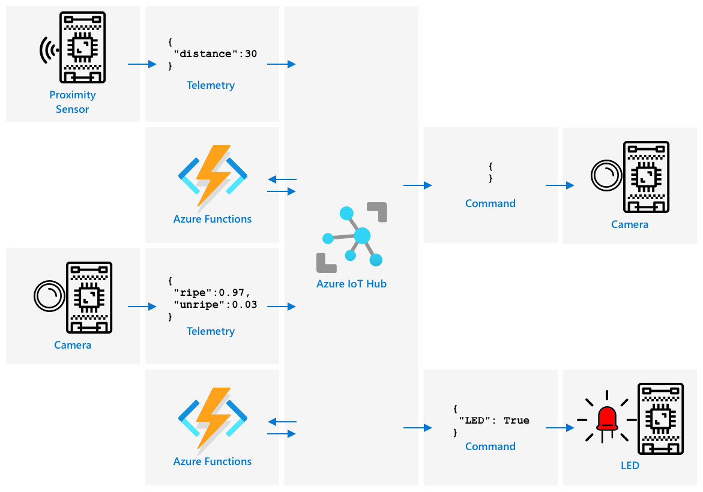

<!--
CO_OP_TRANSLATOR_METADATA:
{
  "original_hash": "f74f4ccb61f00e5f7e9f49c3ed416e36",
  "translation_date": "2025-08-27T20:28:08+00:00",
  "source_file": "4-manufacturing/lessons/4-trigger-fruit-detector/README.md",
  "language_code": "sv"
}
-->
# Utlösa kvalitetskontroll av frukt från en sensor


> Sketchnote av [Nitya Narasimhan](https://github.com/nitya). Klicka på bilden för en större version.

## Quiz före föreläsningen

[Quiz före föreläsningen](https://black-meadow-040d15503.1.azurestaticapps.net/quiz/35)

## Introduktion

En IoT-applikation är inte bara en enskild enhet som samlar in data och skickar den till molnet. Det handlar oftast om flera enheter som samarbetar för att samla in data från den fysiska världen med hjälp av sensorer, fatta beslut baserat på den datan och interagera tillbaka med den fysiska världen via aktuatorer eller visualiseringar.

I denna lektion kommer du att lära dig mer om att designa komplexa IoT-applikationer, integrera flera sensorer, använda flera molntjänster för att analysera och lagra data samt visa en respons via en aktuator. Du kommer att lära dig hur man designar en prototyp för ett system för kvalitetskontroll av frukt, inklusive användning av närhetssensorer för att utlösa IoT-applikationen och hur arkitekturen för denna prototyp skulle se ut.

I denna lektion kommer vi att täcka:

* [Designa komplexa IoT-applikationer](../../../../../4-manufacturing/lessons/4-trigger-fruit-detector)
* [Utforma ett system för kvalitetskontroll av frukt](../../../../../4-manufacturing/lessons/4-trigger-fruit-detector)
* [Utlösa kvalitetskontroll av frukt från en sensor](../../../../../4-manufacturing/lessons/4-trigger-fruit-detector)
* [Data som används för en fruktkvalitetsdetektor](../../../../../4-manufacturing/lessons/4-trigger-fruit-detector)
* [Använda utvecklarenheter för att simulera flera IoT-enheter](../../../../../4-manufacturing/lessons/4-trigger-fruit-detector)
* [Gå över till produktion](../../../../../4-manufacturing/lessons/4-trigger-fruit-detector)

> 🗑 Detta är den sista lektionen i detta projekt, så efter att du har slutfört denna lektion och uppgiften, glöm inte att städa upp dina molntjänster. Du kommer att behöva tjänsterna för att slutföra uppgiften, så se till att göra det först.
>
> Se [guiden för att städa upp ditt projekt](../../../clean-up.md) om du behöver instruktioner för hur du gör detta.

## Designa komplexa IoT-applikationer

IoT-applikationer består av många komponenter. Detta inkluderar en mängd olika saker och en mängd olika internettjänster.

IoT-applikationer kan beskrivas som *saker* (enheter) som skickar data som genererar *insikter*. Dessa *insikter* genererar *åtgärder* för att förbättra en verksamhet eller process. Ett exempel är en motor (saken) som skickar temperaturdata. Denna data används för att utvärdera om motorn presterar som förväntat (insikten). Insikten används för att proaktivt prioritera underhållsschemat för motorn (åtgärden).

* Olika saker samlar in olika datatyper.
* IoT-tjänster ger insikter över den datan, ibland genom att komplettera den med data från andra källor.
* Dessa insikter driver åtgärder, inklusive att styra aktuatorer i enheter eller visualisera data.

### Referensarkitektur för IoT


Diagrammet ovan visar en referensarkitektur för IoT.

> 🎓 En *referensarkitektur* är ett exempel på en arkitektur som du kan använda som referens när du designar nya system. I detta fall, om du bygger ett nytt IoT-system, kan du följa referensarkitekturen och ersätta med dina egna enheter och tjänster där det är lämpligt.

* **Saker** är enheter som samlar in data från sensorer, kanske interagerar med edge-tjänster för att tolka den datan, som bildklassificerare för att tolka bilddata. Datan från enheterna skickas till en IoT-tjänst.
* **Insikter** kommer från serverlösa applikationer eller från analyser som körs på lagrad data.
* **Åtgärder** kan vara kommandon som skickas till enheter eller visualisering av data som gör det möjligt för människor att fatta beslut.


Diagrammet ovan visar några av de komponenter och tjänster som har täckts hittills i dessa lektioner och hur de länkas samman i en referensarkitektur för IoT.

* **Saker** - du har skrivit enhetskod för att samla in data från sensorer och analysera bilder med Custom Vision som körs både i molnet och på en edge-enhet. Denna data skickades till IoT Hub.
* **Insikter** - du har använt Azure Functions för att svara på meddelanden som skickas till en IoT Hub och lagrat data för senare analys i Azure Storage.
* **Åtgärder** - du har styrt aktuatorer baserat på beslut som fattats i molnet och kommandon som skickats till enheterna, och du har visualiserat data med Azure Maps.

✅ Tänk på andra IoT-enheter du har använt, som smarta hushållsapparater. Vilka är sakerna, insikterna och åtgärderna som är involverade i den enheten och dess mjukvara?

Detta mönster kan skalas upp eller ner beroende på behov, genom att lägga till fler enheter och fler tjänster.

### Data och säkerhet

När du definierar arkitekturen för ditt system måste du ständigt överväga data och säkerhet.

* Vilken data skickar och tar emot din enhet?
* Hur ska den datan säkras och skyddas?
* Hur ska åtkomst till enheten och molntjänsten kontrolleras?

✅ Tänk på datasäkerheten för de IoT-enheter du äger. Hur mycket av den datan är personlig och bör hållas privat, både under överföring och när den lagras? Vilken data bör inte lagras?

## Utforma ett system för kvalitetskontroll av frukt

Låt oss nu ta denna idé om saker, insikter och åtgärder och tillämpa den på vår fruktkvalitetsdetektor för att designa en större end-to-end-applikation.

Föreställ dig att du har fått uppgiften att bygga en fruktkvalitetsdetektor som ska användas i en bearbetningsanläggning. Frukt transporteras på ett transportband där anställda för närvarande spenderar tid på att manuellt kontrollera frukten och ta bort omogen frukt när den anländer. För att minska kostnaderna vill anläggningsägaren ha ett automatiserat system.

✅ En av trenderna med IoT:s framväxt (och teknik i allmänhet) är att manuella jobb ersätts av maskiner. Gör lite research: Hur många jobb beräknas gå förlorade till IoT? Hur många nya jobb kommer att skapas för att bygga IoT-enheter?

Du behöver bygga ett system där frukt detekteras när den anländer på transportbandet, fotograferas och kontrolleras med hjälp av en AI-modell som körs på edge. Resultaten skickas sedan till molnet för att lagras, och om frukten är omogen ges en notifikation så att den omogna frukten kan tas bort.

|   |   |
| - | - |
| **Saker** | Detektor för frukt som anländer på transportbandet<br>Kamera för att fotografera och klassificera frukten<br>Edge-enhet som kör klassificeraren<br>Enhet för att notifiera om omogen frukt |
| **Insikter** | Besluta att kontrollera fruktens mognad<br>Lagra resultaten av mognadsklassificeringen<br>Avgöra om det behövs en varning om omogen frukt |
| **Åtgärder** | Skicka ett kommando till en enhet för att fotografera frukten och kontrollera den med en bildklassificerare<br>Skicka ett kommando till en enhet för att varna om frukten är omogen |

### Prototypa din applikation


Diagrammet ovan visar en referensarkitektur för denna prototypapplikation.

* En IoT-enhet med en närhetssensor detekterar fruktens ankomst. Detta skickar ett meddelande till molnet för att indikera att frukt har detekterats.
* En serverlös applikation i molnet skickar ett kommando till en annan enhet för att ta ett fotografi och klassificera bilden.
* En IoT-enhet med en kamera tar en bild och skickar den till en bildklassificerare som körs på edge. Resultaten skickas sedan till molnet.
* En serverlös applikation i molnet lagrar denna information för att senare analyseras för att se vilken procentandel av frukten som är omogen. Om frukten är omogen skickar den ett kommando till en annan IoT-enhet för att varna fabriksarbetare om omogen frukt via en LED.

> 💁 Hela denna IoT-applikation skulle kunna implementeras som en enda enhet, med all logik för att starta bildklassificeringen och styra LED inbyggd. Den skulle kunna använda en IoT Hub bara för att spåra antalet omogna frukter som detekterats och konfigurera enheten. I denna lektion är den utökad för att demonstrera koncepten för storskaliga IoT-applikationer.

För prototypen kommer du att implementera allt detta på en enda enhet. Om du använder en mikrokontroller kommer du att använda en separat edge-enhet för att köra bildklassificeraren. Du har redan lärt dig det mesta av det du behöver för att kunna bygga detta.

## Utlösa kvalitetskontroll av frukt från en sensor

IoT-enheten behöver någon form av trigger för att indikera när frukten är redo att klassificeras. En trigger för detta skulle kunna vara att mäta när frukten är på rätt plats på transportbandet genom att mäta avståndet till en sensor.


Närhetssensorer kan användas för att mäta avståndet från sensorn till ett objekt. De skickar vanligtvis ut en stråle av elektromagnetisk strålning, som en laserstråle eller infrarött ljus, och detekterar sedan strålningen som studsar tillbaka från ett objekt. Tiden mellan att laserstrålen skickas och signalen studsar tillbaka kan användas för att beräkna avståndet till sensorn.

> 💁 Du har förmodligen använt närhetssensorer utan att ens veta om det. De flesta smartphones stänger av skärmen när du håller dem mot örat för att förhindra att du av misstag avslutar ett samtal med örsnibben. Detta fungerar med en närhetssensor som detekterar ett objekt nära skärmen under ett samtal och inaktiverar pekfunktionerna tills telefonen är på ett visst avstånd.

### Uppgift - utlösa kvalitetskontroll av frukt med en avståndssensor

Följ den relevanta guiden för att använda en närhetssensor för att detektera ett objekt med din IoT-enhet:

* [Arduino - Wio Terminal](wio-terminal-proximity.md)
* [Enkortsdator - Raspberry Pi](pi-proximity.md)
* [Enkortsdator - Virtuell enhet](virtual-device-proximity.md)

## Data som används för en fruktkvalitetsdetektor

Prototypen för fruktdetektorn har flera komponenter som kommunicerar med varandra.



* En närhetssensor som mäter avståndet till en frukt och skickar detta till IoT Hub
* Kommandot för att styra kameran som kommer från IoT Hub till kameranheten
* Resultaten av bildklassificeringen som skickas till IoT Hub
* Kommandot för att styra en LED för att varna om frukten är omogen som skickas från IoT Hub till enheten med LED

Det är bra att definiera strukturen för dessa meddelanden i förväg, innan du bygger applikationen.

> 💁 Nästan varje erfaren utvecklare har någon gång i sin karriär spenderat timmar, dagar eller till och med veckor på att jaga buggar orsakade av skillnader i datan som skickas jämfört med vad som förväntas.

Till exempel - om du skickar temperaturinformation, hur skulle du definiera JSON? Du skulle kunna ha ett fält som heter `temperature`, eller använda den vanliga förkortningen `temp`.

```json
{
    "temperature": 20.7
}
```

jämfört med:

```json
{
    "temp": 20.7
}
```

Du måste också överväga enheter - är temperaturen i °C eller °F? Om du mäter temperatur med en konsumentenhet och de ändrar visningsenheterna, måste du se till att enheterna som skickas till molnet förblir konsekventa.

✅ Gör lite research: Hur orsakade problem med enheter att Mars Climate Orbiter, värd 125 miljoner dollar, kraschade?

Tänk på datan som skickas för fruktkvalitetsdetektorn. Hur skulle du definiera varje meddelande? Var skulle du analysera datan och fatta beslut om vilken data som ska skickas?

Till exempel - att utlösa bildklassificeringen med hjälp av närhetssensorn. IoT-enheten mäter avståndet, men var fattas beslutet? Bestämmer enheten att frukten är tillräckligt nära och skickar ett meddelande till IoT Hub för att utlösa klassificeringen? Eller skickar den avståndsmätningar och låter IoT Hub fatta beslutet?

Svaret på frågor som dessa är - det beror på. Varje användningsfall är annorlunda, vilket är anledningen till att du som IoT-utvecklare behöver förstå systemet du bygger, hur det används och datan som detekteras.

* Om beslutet fattas av IoT Hub måste du skicka flera avståndsmätningar.
* Om du skickar för många meddelanden ökar det kostnaden för IoT Hub och mängden bandbredd som behövs av dina IoT-enheter (särskilt i en fabrik med miljontals enheter). Det kan också sakta ner din enhet.
* Om du fattar beslutet på enheten måste du tillhandahålla ett sätt att konfigurera enheten för att finjustera maskinen.

## Använda utvecklarenheter för att simulera flera IoT-enheter

För att bygga din prototyp behöver du din IoT-utvecklingssats för att agera som flera enheter, skicka telemetri och svara på kommandon.

### Simulera flera IoT-enheter på en Raspberry Pi eller virtuell IoT-hårdvara

När du använder en enkortsdator som en Raspberry Pi kan du köra flera applikationer samtidigt. Detta innebär att du kan simulera flera IoT-enheter genom att skapa flera applikationer, en per 'IoT-enhet'. Till exempel kan du implementera varje enhet som en separat Python-fil och köra dem i olika terminalsessioner.
> 💁 Var medveten om att viss hårdvara kanske inte fungerar när den används av flera applikationer som körs samtidigt.
### Simulera flera enheter på en mikrokontroller

Mikrokontrollers är mer komplicerade att simulera flera enheter på. Till skillnad från enkortsdatorer kan du inte köra flera applikationer samtidigt, utan du måste inkludera all logik för alla separata IoT-enheter i en enda applikation.

Några förslag för att göra denna process enklare är:

* Skapa en eller flera klasser per IoT-enhet - till exempel klasser som heter `DistanceSensor`, `ClassifierCamera`, `LEDController`. Varje klass kan ha sina egna `setup`- och `loop`-metoder som anropas av huvudfunktionerna `setup` och `loop`.
* Hantera kommandon på ett enda ställe och dirigera dem till den relevanta enhetsklassen vid behov.
* I huvudfunktionen `loop` behöver du ta hänsyn till tidsaspekten för varje enhet. Till exempel, om du har en enhetsklass som behöver bearbetas var 10:e sekund och en annan som behöver bearbetas varje sekund, använd då en fördröjning på 1 sekund i huvudfunktionen `loop`. Varje anrop till `loop` triggar relevant kod för enheten som behöver bearbetas varje sekund, och använd en räknare för att räkna varje loop och bearbeta den andra enheten när räknaren når 10 (och nollställ räknaren därefter).

## Övergång till produktion

Prototypen kommer att utgöra grunden för ett slutligt produktionssystem. Några av skillnaderna när du går över till produktion kan vara:

* Robustare komponenter - använda hårdvara som är designad för att tåla buller, värme, vibrationer och stress i en fabriksmiljö.
* Använda intern kommunikation - vissa komponenter skulle kommunicera direkt och undvika att hoppa till molnet, och endast skicka data till molnet för lagring. Hur detta görs beror på fabrikens uppsättning, antingen genom direkt kommunikation eller genom att köra en del av IoT-tjänsten vid kanten med hjälp av en gateway-enhet.
* Konfigurationsalternativ - varje fabrik och användningsfall är olika, så hårdvaran måste vara konfigurerbar. Till exempel kan närhetssensorn behöva upptäcka olika frukter på olika avstånd. Istället för att hårdkoda avståndet för att trigga klassificeringen, skulle du vilja att detta är konfigurerbart via molnet, till exempel med hjälp av en enhetstvilling.
* Automatisk borttagning av frukt - istället för en LED som varnar för att frukten är omogen, skulle automatiska enheter ta bort den.

✅ Gör lite research: På vilka andra sätt skulle produktionsenheter skilja sig från utvecklingskit?

---

## 🚀 Utmaning

I denna lektion har du lärt dig några av de koncept du behöver känna till för att designa ett IoT-system. Tänk tillbaka på de tidigare projekten. Hur passar de in i referensarkitekturen som visas ovan?

Välj ett av projekten hittills och fundera på designen av en mer komplicerad lösning som kombinerar flera funktioner utöver vad som täckts i projekten. Rita arkitekturen och tänk på alla enheter och tjänster du skulle behöva.

Till exempel - en fordonsövervakningsenhet som kombinerar GPS med sensorer för att övervaka saker som temperaturer i en kyltransport, motorens på- och av-tider, och förarens identitet. Vilka enheter är involverade, vilka tjänster är involverade, vilken data överförs och vilka säkerhets- och integritetsaspekter behöver beaktas?

## Quiz efter föreläsningen

[Quiz efter föreläsningen](https://black-meadow-040d15503.1.azurestaticapps.net/quiz/36)

## Granskning & Självstudier

* Läs mer om IoT-arkitektur i [Azure IoT referensarkitektur-dokumentationen på Microsoft docs](https://docs.microsoft.com/azure/architecture/reference-architectures/iot?WT.mc_id=academic-17441-jabenn)
* Läs mer om enhetstvillingar i [förstå och använd enhetstvillingar i IoT Hub-dokumentationen på Microsoft docs](https://docs.microsoft.com/azure/iot-hub/iot-hub-devguide-device-twins?WT.mc_id=academic-17441-jabenn)
* Läs om OPC-UA, ett kommunikationsprotokoll mellan maskiner som används inom industriell automation på [OPC-UA-sidan på Wikipedia](https://wikipedia.org/wiki/OPC_Unified_Architecture)

## Uppgift

[Bygg en fruktkvalitetsdetektor](assignment.md)

---

**Ansvarsfriskrivning**:  
Detta dokument har översatts med hjälp av AI-översättningstjänsten [Co-op Translator](https://github.com/Azure/co-op-translator). Även om vi strävar efter noggrannhet, bör det noteras att automatiska översättningar kan innehålla fel eller felaktigheter. Det ursprungliga dokumentet på dess originalspråk bör betraktas som den auktoritativa källan. För kritisk information rekommenderas professionell mänsklig översättning. Vi ansvarar inte för eventuella missförstånd eller feltolkningar som uppstår vid användning av denna översättning.