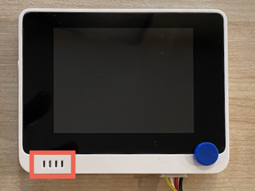

<!--
CO_OP_TRANSLATOR_METADATA:
{
  "original_hash": "93d352de36526b8990e41dd538100324",
  "translation_date": "2025-08-27T21:05:51+00:00",
  "source_file": "6-consumer/lessons/1-speech-recognition/wio-terminal-microphone.md",
  "language_code": "sv"
}
-->
# Konfigurera din mikrofon och högtalare - Wio Terminal

I denna del av lektionen kommer du att lägga till högtalare till din Wio Terminal. Wio Terminal har redan en inbyggd mikrofon som kan användas för att fånga tal.

## Hårdvara

Wio Terminal har redan en inbyggd mikrofon som kan användas för att fånga ljud för taligenkänning.

För att lägga till en högtalare kan du använda [ReSpeaker 2-Mics Pi Hat](https://www.seeedstudio.com/ReSpeaker-2-Mics-Pi-HAT.html). Detta är ett externt kort som innehåller två MEMS-mikrofoner, samt en högtalaranslutning och hörlursuttag.

Du behöver lägga till antingen hörlurar, en högtalare med 3,5 mm kontakt eller en högtalare med JST-anslutning, såsom [Mono Enclosed Speaker - 2W 6 Ohm](https://www.seeedstudio.com/Mono-Enclosed-Speaker-2W-6-Ohm-p-2832.html).

För att ansluta ReSpeaker 2-Mics Pi Hat behöver du 40 pin-till-pin (även kallade han-till-han) jumperkablar.

> 💁 Om du är bekväm med att löda kan du använda [40 Pin Raspberry Pi Hat Adapter Board For Wio Terminal](https://www.seeedstudio.com/40-Pin-Raspberry-Pi-Hat-Adapter-Board-For-Wio-Terminal-p-4730.html) för att ansluta ReSpeaker.

Du kommer också att behöva ett SD-kort för att ladda ner och spela upp ljud. Wio Terminal stöder endast SD-kort upp till 16 GB i storlek, och dessa måste vara formaterade som FAT32 eller exFAT.

### Uppgift - anslut ReSpeaker Pi Hat

1. Med Wio Terminal avstängd, anslut ReSpeaker 2-Mics Pi Hat till Wio Terminal med hjälp av jumperkablarna och GPIO-kontakterna på baksidan av Wio Terminal:

    Stiften måste anslutas på följande sätt:

    

1. Placera ReSpeaker och Wio Terminal med GPIO-kontakterna uppåt och på vänster sida.

1. Börja från kontakten längst upp till vänster på GPIO-kontakten på ReSpeaker. Anslut en pin-till-pin jumperkabel från den översta vänstra kontakten på ReSpeaker till den översta vänstra kontakten på Wio Terminal.

1. Upprepa detta hela vägen ner på GPIO-kontakterna på vänster sida. Se till att stiften sitter ordentligt.

    

    

    > 💁 Om dina jumperkablar är anslutna i band, håll dem alla tillsammans - det gör det lättare att säkerställa att du har anslutit alla kablar i rätt ordning.

1. Upprepa processen med de högra GPIO-kontakterna på ReSpeaker och Wio Terminal. Dessa kablar måste gå runt de kablar som redan är på plats.

    

    

    > 💁 Om dina jumperkablar är anslutna i band, dela dem i två band. Passera ett på varje sida av de befintliga kablarna.

    > 💁 Du kan använda tejp för att hålla stiften i ett block för att förhindra att några lossnar medan du ansluter dem.
    >
    > 

1. Du behöver lägga till en högtalare.

    * Om du använder en högtalare med JST-kabel, anslut den till JST-porten på ReSpeaker.

      

    * Om du använder en högtalare med 3,5 mm kontakt eller hörlurar, sätt in dem i 3,5 mm kontaktuttaget.

      

### Uppgift - ställ in SD-kortet

1. Anslut SD-kortet till din dator, använd en extern läsare om du inte har en SD-kortplats.

1. Formatera SD-kortet med lämpligt verktyg på din dator, och se till att använda filsystemet FAT32 eller exFAT.

1. Sätt in SD-kortet i SD-kortplatsen på vänster sida av Wio Terminal, precis under strömbrytaren. Se till att kortet är helt insatt och klickar på plats - du kan behöva ett tunt verktyg eller ett annat SD-kort för att hjälpa till att trycka det hela vägen in.

    

    > 💁 För att mata ut SD-kortet måste du trycka in det lite och det kommer att matas ut. Du behöver ett tunt verktyg för detta, såsom en platt skruvmejsel eller ett annat SD-kort.

---

**Ansvarsfriskrivning**:  
Detta dokument har översatts med hjälp av AI-översättningstjänsten [Co-op Translator](https://github.com/Azure/co-op-translator). Även om vi strävar efter noggrannhet, bör du vara medveten om att automatiska översättningar kan innehålla fel eller felaktigheter. Det ursprungliga dokumentet på dess ursprungliga språk bör betraktas som den auktoritativa källan. För kritisk information rekommenderas professionell mänsklig översättning. Vi ansvarar inte för eventuella missförstånd eller feltolkningar som uppstår vid användning av denna översättning.