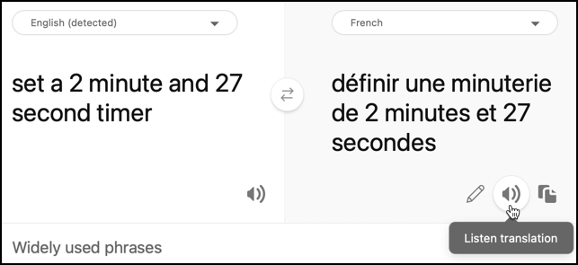

<!--
CO_OP_TRANSLATOR_METADATA:
{
  "original_hash": "bbb5aa34221fe129dd3ce4d9ec33831a",
  "translation_date": "2025-08-27T21:15:37+00:00",
  "source_file": "6-consumer/lessons/4-multiple-language-support/pi-translate-speech.md",
  "language_code": "sv"
}
-->
# Översätt tal - Raspberry Pi

I den här delen av lektionen kommer du att skriva kod för att översätta text med hjälp av översättningstjänsten.

## Konvertera text till tal med översättningstjänsten

REST-API:t för tal-tjänsten stöder inte direkta översättningar, men du kan använda översättningstjänsten för att översätta texten som genereras av tal-till-text-tjänsten, samt texten för det talade svaret. Den här tjänsten har ett REST-API som du kan använda för att översätta text.

### Uppgift - använd översättningsresursen för att översätta text

1. Din smarta timer kommer att ha två språk inställda - språket på servern som användes för att träna LUIS (samma språk används också för att bygga meddelanden som ska talas till användaren), och språket som talas av användaren. Uppdatera variabeln `language` till att vara det språk som användaren kommer att tala, och lägg till en ny variabel som heter `server_language` för språket som användes för att träna LUIS:

    ```python
    language = '<user language>'
    server_language = '<server language>'
    ```

    Ersätt `<user language>` med lokalnamnet för det språk du kommer att tala, till exempel `fr-FR` för franska eller `zn-HK` för kantonesiska.

    Ersätt `<server language>` med lokalnamnet för språket som användes för att träna LUIS.

    Du kan hitta en lista över de stödda språken och deras lokalnamn i [dokumentationen om språk- och röststöd på Microsoft Docs](https://docs.microsoft.com/azure/cognitive-services/speech-service/language-support?WT.mc_id=academic-17441-jabenn#speech-to-text).

    > 💁 Om du inte talar flera språk kan du använda en tjänst som [Bing Translate](https://www.bing.com/translator) eller [Google Translate](https://translate.google.com) för att översätta från ditt föredragna språk till ett språk du väljer. Dessa tjänster kan sedan spela upp ljud av den översatta texten.
    >
    > Till exempel, om du tränar LUIS på engelska men vill använda franska som användarspråk, kan du översätta meningar som "set a 2 minute and 27 second timer" från engelska till franska med Bing Translate, och sedan använda knappen **Lyssna på översättning** för att tala översättningen i din mikrofon.
    >
    > 

1. Lägg till API-nyckeln för översättningstjänsten under `speech_api_key`:

    ```python
    translator_api_key = '<key>'
    ```

    Ersätt `<key>` med API-nyckeln för din översättningstjänstresurs.

1. Ovanför funktionen `say`, definiera en funktion `translate_text` som kommer att översätta text från serverns språk till användarens språk:

    ```python
    def translate_text(text, from_language, to_language):
    ```

    Språken som översätts från och till skickas till denna funktion - din app behöver konvertera från användarspråk till serverspråk när den känner igen tal, och från serverspråk till användarspråk när den ger talat feedback.

1. Inuti denna funktion, definiera URL och headers för REST-API-anropet:

    ```python
    url = f'https://api.cognitive.microsofttranslator.com/translate?api-version=3.0'

    headers = {
        'Ocp-Apim-Subscription-Key': translator_api_key,
        'Ocp-Apim-Subscription-Region': location,
        'Content-type': 'application/json'
    }
    ```

    URL:en för detta API är inte platsberoende, istället skickas platsen som en header. API-nyckeln används direkt, så till skillnad från tal-tjänsten finns det inget behov av att hämta en åtkomsttoken från tokenutgivaren API.

1. Nedanför detta definiera parametrarna och kroppen för anropet:

    ```python
    params = {
        'from': from_language,
        'to': to_language
    }

    body = [{
        'text' : text
    }]
    ```

    `params` definierar parametrarna som ska skickas till API-anropet, där språken som översätts från och till anges. Detta anrop kommer att översätta text från språket `from` till språket `to`.

    `body` innehåller texten som ska översättas. Detta är en array, eftersom flera textblock kan översättas i samma anrop.

1. Gör anropet till REST-API:t och hämta svaret:

    ```python
    response = requests.post(url, headers=headers, params=params, json=body)
    ```

    Svaret som kommer tillbaka är en JSON-array, med ett objekt som innehåller översättningarna. Detta objekt har en array för översättningar av alla objekt som skickades i kroppen.

    ```json
    [
        {
            "translations": [
                {
                    "text": "Set a 2 minute 27 second timer.",
                    "to": "en"
                }
            ]
        }
    ]
    ```

1. Returnera egenskapen `text` från den första översättningen från det första objektet i arrayen:

    ```python
    return response.json()[0]['translations'][0]['text']
    ```

1. Uppdatera `while True`-loopen för att översätta texten från anropet till `convert_speech_to_text` från användarspråket till serverspråket:

    ```python
    if len(text) > 0:
        print('Original:', text)
        text = translate_text(text, language, server_language)
        print('Translated:', text)

        message = Message(json.dumps({ 'speech': text }))
        device_client.send_message(message)
    ```

    Denna kod skriver också ut den ursprungliga och översatta versionen av texten till konsolen.

1. Uppdatera funktionen `say` för att översätta texten som ska sägas från serverspråket till användarspråket:

    ```python
    def say(text):
        print('Original:', text)
        text = translate_text(text, server_language, language)
        print('Translated:', text)
        speech = get_speech(text)
        play_speech(speech)
    ```

    Denna kod skriver också ut den ursprungliga och översatta versionen av texten till konsolen.

1. Kör din kod. Se till att din funktionsapp körs och begär en timer på användarspråket, antingen genom att tala det språket själv eller använda en översättningsapp.

    ```output
    pi@raspberrypi:~/smart-timer $ python3 app.py
    Connecting
    Connected
    Using voice fr-FR-DeniseNeural
    Original: Définir une minuterie de 2 minutes et 27 secondes.
    Translated: Set a timer of 2 minutes and 27 seconds.
    Original: 2 minute 27 second timer started.
    Translated: 2 minute 27 seconde minute a commencé.
    Original: Times up on your 2 minute 27 second timer.
    Translated: Chronométrant votre minuterie de 2 minutes 27 secondes.
    ```

    > 💁 På grund av olika sätt att säga något på olika språk kan du få översättningar som skiljer sig något från de exempel du gav LUIS. Om detta är fallet, lägg till fler exempel i LUIS, träna om och publicera modellen igen.

> 💁 Du kan hitta denna kod i [code/pi](../../../../../6-consumer/lessons/4-multiple-language-support/code/pi)-mappen.

😀 Ditt flerspråkiga timerprogram blev en framgång!

---

**Ansvarsfriskrivning**:  
Detta dokument har översatts med hjälp av AI-översättningstjänsten [Co-op Translator](https://github.com/Azure/co-op-translator). Även om vi strävar efter noggrannhet, bör du vara medveten om att automatiserade översättningar kan innehålla fel eller felaktigheter. Det ursprungliga dokumentet på dess originalspråk bör betraktas som den auktoritativa källan. För kritisk information rekommenderas professionell mänsklig översättning. Vi ansvarar inte för eventuella missförstånd eller feltolkningar som uppstår vid användning av denna översättning.