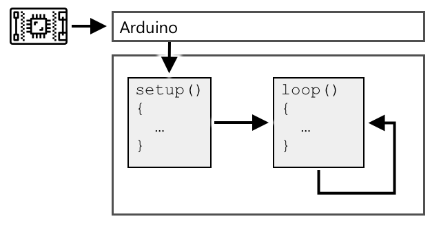

<!--
CO_OP_TRANSLATOR_METADATA:
{
  "original_hash": "9dd7f645ad1c6f20b72fee512987f772",
  "translation_date": "2025-08-27T21:58:13+00:00",
  "source_file": "1-getting-started/lessons/2-deeper-dive/README.md",
  "language_code": "sw"
}
-->
# Uchambuzi wa Kina wa IoT

> Sketchnote na [Nitya Narasimhan](https://github.com/nitya). Bofya picha kwa toleo kubwa zaidi.

Somo hili lilifundishwa kama sehemu ya [mfululizo wa Hello IoT](https://youtube.com/playlist?list=PLmsFUfdnGr3xRts0TIwyaHyQuHaNQcb6-) kutoka [Microsoft Reactor](https://developer.microsoft.com/reactor/?WT.mc_id=academic-17441-jabenn). Somo lilifundishwa kupitia video mbili - somo la saa moja, na kipindi cha maswali na majibu cha saa moja kilichochambua zaidi sehemu za somo na kujibu maswali.

> 🎥 Bofya picha hapo juu kutazama video

## Jaribio la kabla ya somo

[Jaribio la kabla ya somo](https://black-meadow-040d15503.1.azurestaticapps.net/quiz/3)

## Utangulizi

Somo hili linachambua kwa kina baadhi ya dhana zilizofunikwa katika somo lililopita.

Katika somo hili tutajadili:

* [Vipengele vya programu ya IoT](../../../../../1-getting-started/lessons/2-deeper-dive)
* [Uchambuzi wa kina wa microcontrollers](../../../../../1-getting-started/lessons/2-deeper-dive)
* [Uchambuzi wa kina wa kompyuta za bodi moja](../../../../../1-getting-started/lessons/2-deeper-dive)

## Vipengele vya programu ya IoT

Vipengele viwili vya programu ya IoT ni *Intaneti* na *kifaa*. Hebu tuangalie vipengele hivi viwili kwa undani zaidi.

### Kifaa

Sehemu ya **Kifaa** katika IoT inahusu kifaa kinachoweza kuingiliana na ulimwengu wa kimwili. Vifaa hivi mara nyingi ni kompyuta ndogo, za bei nafuu, zinazofanya kazi kwa kasi ndogo na kutumia nguvu kidogo - kwa mfano, microcontrollers rahisi zenye kilobaiti za RAM (tofauti na gigabaiti kwenye PC) zinazofanya kazi kwa mamia machache ya megahertz (tofauti na gigahertz kwenye PC), lakini wakati mwingine hutumia nguvu kidogo sana kiasi kwamba zinaweza kufanya kazi kwa wiki, miezi au hata miaka kwa betri.

Vifaa hivi huingiliana na ulimwengu wa kimwili, ama kwa kutumia sensa kukusanya data kutoka mazingira yao au kwa kudhibiti matokeo au actuators kufanya mabadiliko ya kimwili. Mfano wa kawaida wa hili ni thermostat ya kisasa - kifaa chenye sensa ya joto, njia ya kuweka joto linalotakiwa kama vile kidhibiti au skrini ya kugusa, na muunganisho na mfumo wa kupasha au kupoza ambao unaweza kuwashwa wakati joto lililogunduliwa liko nje ya kiwango kinachotakiwa. Sensa ya joto hugundua kuwa chumba ni baridi sana na actuator huwasha mfumo wa kupasha joto.

Kuna aina nyingi za vifaa vinavyoweza kufanya kazi kama vifaa vya IoT, kuanzia vifaa maalum vinavyogundua kitu kimoja, hadi vifaa vya matumizi ya jumla, hata simu yako ya mkononi! Simu ya mkononi inaweza kutumia sensa kugundua ulimwengu unaozunguka, na actuators kuingiliana na ulimwengu - kwa mfano, kutumia sensa ya GPS kugundua eneo lako na spika kukupa maelekezo ya kufika mahali fulani.

✅ Fikiria mifumo mingine unayoizunguka ambayo husoma data kutoka kwa sensa na kuitumia kufanya maamuzi. Mfano mmoja ungeweza kuwa thermostat kwenye oveni. Je, unaweza kupata mifano zaidi?

### Intaneti

Sehemu ya **Intaneti** ya programu ya IoT inajumuisha programu ambazo kifaa cha IoT kinaweza kuunganishwa nazo kutuma na kupokea data, pamoja na programu nyingine zinazoweza kuchakata data kutoka kwa kifaa cha IoT na kusaidia kufanya maamuzi kuhusu maombi ya kutuma kwa actuators za kifaa cha IoT.

Mpangilio wa kawaida ungekuwa kuwa na aina fulani ya huduma ya wingu ambayo kifaa cha IoT kinaunganishwa nayo, na huduma hii ya wingu hushughulikia mambo kama usalama, pamoja na kupokea ujumbe kutoka kwa kifaa cha IoT, na kutuma ujumbe kurudi kwa kifaa. Huduma hii ya wingu kisha itaunganishwa na programu nyingine zinazoweza kuchakata au kuhifadhi data ya sensa, au kutumia data ya sensa pamoja na data kutoka kwa mifumo mingine kufanya maamuzi.

Vifaa pia havihitaji kuunganishwa moja kwa moja na Intaneti yenyewe kupitia WiFi au muunganisho wa waya. Baadhi ya vifaa hutumia mtandao wa mesh kuzungumza na kila mmoja kupitia teknolojia kama Bluetooth, vikijumuishwa kupitia kifaa cha hub chenye muunganisho wa Intaneti.

Kwa mfano wa thermostat ya kisasa, thermostat ingeunganishwa kwa kutumia WiFi ya nyumbani na huduma ya wingu inayofanya kazi kwenye wingu. Ingetuma data ya joto kwa huduma hii ya wingu, na kutoka hapo itaandikwa kwenye hifadhidata ya aina fulani inayomruhusu mmiliki wa nyumba kuangalia joto la sasa na la zamani kwa kutumia programu ya simu. Huduma nyingine kwenye wingu ingejua joto ambalo mmiliki wa nyumba anataka, na kutuma ujumbe kurudi kwa kifaa cha IoT kupitia huduma ya wingu ili kuambia mfumo wa kupasha joto kuwasha au kuzima.

Toleo la kisasa zaidi linaweza kutumia AI kwenye wingu pamoja na data kutoka kwa sensa nyingine zilizounganishwa na vifaa vingine vya IoT kama sensa za uwepo zinazogundua vyumba vinavyotumika, pamoja na data kama hali ya hewa na hata kalenda yako, kufanya maamuzi ya jinsi ya kuweka joto kwa njia ya kisasa. Kwa mfano, linaweza kuzima mfumo wa kupasha joto ikiwa linasoma kutoka kwa kalenda yako kuwa uko likizoni, au kuzima mfumo wa kupasha joto kwa msingi wa chumba kwa chumba kulingana na vyumba unavyotumia, likijifunza kutoka kwa data kuwa sahihi zaidi kwa muda.

✅ Ni data gani nyingine inaweza kusaidia kufanya thermostat inayounganishwa na Intaneti kuwa ya kisasa zaidi?

### IoT kwenye Edge

Ingawa herufi I katika IoT inasimama kwa Intaneti, vifaa hivi havihitaji kuunganishwa na Intaneti. Katika baadhi ya matukio, vifaa vinaweza kuunganishwa na vifaa vya 'edge' - vifaa vya lango vinavyofanya kazi kwenye mtandao wako wa ndani, kumaanisha unaweza kuchakata data bila kufanya simu kupitia Intaneti. Hii inaweza kuwa haraka zaidi unapokuwa na data nyingi au muunganisho wa Intaneti wa polepole, inakuruhusu kufanya kazi nje ya mtandao ambapo muunganisho wa Intaneti hauwezekani kama vile kwenye meli au katika eneo la maafa wakati wa kukabiliana na mgogoro wa kibinadamu, na inakuruhusu kuweka data kuwa ya faragha. Baadhi ya vifaa vitakuwa na msimbo wa kuchakata ulioundwa kwa kutumia zana za wingu na kuendesha hii ndani ya nchi ili kukusanya na kujibu data bila kutumia muunganisho wa Intaneti kufanya uamuzi.

Mfano mmoja wa hili ni kifaa cha nyumbani cha kisasa kama Apple HomePod, Amazon Alexa, au Google Home, ambacho kitasikiliza sauti yako kwa kutumia mifano ya AI iliyofunzwa kwenye wingu, lakini inayoendesha ndani ya kifaa. Vifaa hivi vitawashwa unaposema neno au kifungu fulani, na ni hapo tu ndipo sauti yako itatumwa kupitia Intaneti kwa uchakataji. Kifaa kitasimama kutuma sauti wakati wa kufaa kama vile kinapogundua pause katika hotuba yako. Kila kitu unachosema kabla ya kuwasha kifaa kwa neno la kuamsha, na kila kitu unachosema baada ya kifaa kusimama kusikiliza hakitatumwa kupitia Intaneti kwa mtoa huduma wa kifaa, na kwa hivyo kitakuwa cha faragha.

✅ Fikiria hali nyingine ambapo faragha ni muhimu hivyo uchakataji wa data ungekuwa bora kufanywa kwenye edge badala ya wingu. Kama kidokezo - fikiria vifaa vya IoT vyenye kamera au vifaa vingine vya picha juu yake.

### Usalama wa IoT

Kwa muunganisho wowote wa Intaneti, usalama ni jambo muhimu la kuzingatia. Kuna utani wa zamani kwamba 'herufi S katika IoT inasimama kwa Usalama' - hakuna 'S' katika IoT, ikimaanisha si salama.

Vifaa vya IoT vinaunganishwa na huduma ya wingu, na kwa hivyo ni salama tu kama huduma hiyo ya wingu - ikiwa huduma yako ya wingu inaruhusu kifaa chochote kuunganishwa basi data mbaya inaweza kutumwa, au mashambulizi ya virusi yanaweza kufanyika. Hii inaweza kuwa na athari halisi za ulimwengu kwani vifaa vya IoT vinaingiliana na kudhibiti vifaa vingine. Kwa mfano, [kirusi cha Stuxnet](https://wikipedia.org/wiki/Stuxnet) kilibadilisha vali kwenye centrifuges kuziharibu. Wadukuzi pia wamefaidika na [usalama duni kufikia vifaa vya kufuatilia watoto](https://www.npr.org/sections/thetwo-way/2018/06/05/617196788/s-c-mom-says-baby-monitor-was-hacked-experts-say-many-devices-are-vulnerable) na vifaa vingine vya ufuatiliaji wa nyumbani.

> 💁 Wakati mwingine vifaa vya IoT na vifaa vya edge vinaendeshwa kwenye mtandao uliojitenga kabisa na Intaneti ili kuweka data kuwa ya faragha na salama. Hii inajulikana kama [air-gapping](https://wikipedia.org/wiki/Air_gap_(networking)).

## Uchambuzi wa kina wa microcontrollers

Katika somo lililopita, tulianzisha microcontrollers. Sasa hebu tuangalie kwa undani zaidi.

### CPU

CPU ni 'ubongo' wa microcontroller. Ni processor inayotekeleza msimbo wako na inaweza kutuma data kwa na kupokea data kutoka kwa vifaa vilivyounganishwa. CPU zinaweza kuwa na msingi mmoja au zaidi - kimsingi CPU moja au zaidi zinazoweza kufanya kazi pamoja kuendesha msimbo wako.

CPU hutegemea saa inayodunda mara nyingi mamilioni au mabilioni kwa sekunde. Kila dundo, au mzunguko, husawazisha vitendo ambavyo CPU inaweza kuchukua. Kwa kila dundo, CPU inaweza kutekeleza maagizo kutoka kwa programu, kama vile kupata data kutoka kwa kifaa cha nje au kufanya hesabu ya kihisabati. Mzunguko huu wa kawaida huruhusu vitendo vyote kukamilika kabla ya agizo linalofuata kushughulikiwa.

Kadri mzunguko wa saa unavyokuwa wa haraka, ndivyo maagizo yanavyoweza kushughulikiwa kwa sekunde, na kwa hivyo CPU inakuwa ya haraka zaidi. Kasi ya CPU hupimwa kwa [Hertz (Hz)](https://wikipedia.org/wiki/Hertz), kipimo cha kawaida ambapo 1 Hz inamaanisha mzunguko mmoja au dundo la saa kwa sekunde.

> 🎓 Kasi za CPU mara nyingi hupewa kwa MHz au GHz. 1MHz ni milioni 1 Hz, 1GHz ni bilioni 1 Hz.

> 💁 CPU hutekeleza programu kwa kutumia [mzunguko wa fetch-decode-execute](https://wikipedia.org/wiki/Instruction_cycle). Kwa kila dundo la saa, CPU itachukua agizo linalofuata kutoka kwa kumbukumbu, kulifafanua, kisha kulitekeleza kama vile kutumia kitengo cha mantiki ya hesabu (ALU) kuongeza namba 2. Baadhi ya utekelezaji utachukua mizunguko mingi kukimbia, hivyo mzunguko unaofuata utaendeshwa kwenye dundo linalofuata baada ya agizo kukamilika.

Microcontrollers zina kasi ya saa ya chini sana ikilinganishwa na kompyuta za mezani au laptop, au hata simu nyingi za mkononi. Kwa mfano, Wio Terminal ina CPU inayofanya kazi kwa 120MHz au mizunguko 120,000,000 kwa sekunde.

✅ Kompyuta ya kawaida ya PC au Mac ina CPU yenye msingi mingi inayofanya kazi kwa GigaHertz nyingi, ikimaanisha saa inadunda mabilioni ya mara kwa sekunde. Tafiti kasi ya saa ya kompyuta yako na ulinganishe jinsi ilivyo haraka zaidi kuliko Wio Terminal.

Kila mzunguko wa saa hutumia nguvu na huzalisha joto. Kadri dundo linavyokuwa la haraka, ndivyo nguvu zaidi zinavyotumika na joto zaidi huzalishwa. PC zina heatsinks na feni za kuondoa joto, bila hivyo zingepata joto kupita kiasi na kuzima ndani ya sekunde chache. Microcontrollers mara nyingi hazina vifaa hivyo kwani zinafanya kazi kwa baridi zaidi na kwa hivyo kwa kasi ndogo zaidi. PC zinaendeshwa kwa nguvu za umeme au betri kubwa kwa masaa machache, microcontrollers zinaweza kufanya kazi kwa siku, miezi, au hata miaka kwa betri ndogo. Microcontrollers pia zinaweza kuwa na msingi unaofanya kazi kwa kasi tofauti, kubadilisha hadi msingi wa kasi ya chini wakati mahitaji ya CPU ni madogo ili kupunguza matumizi ya nguvu.

> 💁 Baadhi ya PC na Mac zinachukua mchanganyiko huo wa msingi wa kasi ya juu na msingi wa kasi ya chini, kubadilisha ili kuokoa betri. Kwa mfano, chipu ya M1 kwenye laptop za hivi karibuni za Apple inaweza kubadilisha kati ya msingi 4 wa utendaji na msingi 4 wa ufanisi ili kuboresha maisha ya betri au kasi kulingana na kazi inayofanywa.

✅ Fanya utafiti kidogo: Soma kuhusu CPU kwenye [makala ya Wikipedia kuhusu CPU](https://wikipedia.org/wiki/Central_processing_unit)

#### Kazi

Chunguza Wio Terminal.

Ikiwa unatumia Wio Terminal kwa masomo haya, jaribu kupata CPU. Tafuta sehemu ya *Muhtasari wa Vifaa* kwenye [ukurasa wa bidhaa wa Wio Terminal](https://www.seeedstudio.com/Wio-Terminal-p-4509.html) kwa picha ya mambo ya ndani, na jaribu kupata CPU kupitia dirisha la plastiki wazi nyuma.

### Kumbukumbu

Microcontrollers kwa kawaida huwa na aina mbili za kumbukumbu - kumbukumbu ya programu na kumbukumbu ya random-access (RAM).

Kumbukumbu ya programu ni isiyobadilika, ambayo inamaanisha chochote kilichoandikwa humo hubaki hata pale kifaa kinapokosa nguvu. Hii ndiyo kumbukumbu inayohifadhi msimbo wa programu yako.

RAM ni kumbukumbu inayotumiwa na programu kuendesha, ikijumuisha vigezo vilivyotengwa na programu yako na data iliyokusanywa kutoka kwa vifaa vya pembeni. RAM ni ya kubadilika, wakati nguvu inapokatika yaliyomo hupotea, kimsingi ikirejesha programu yako.
> 🎓 Kumbukumbu ya programu huhifadhi msimbo wako na hubaki hata pale ambapo hakuna umeme.
🎓 RAM hutumika kuendesha programu yako na huwekwa upya inapokosa nguvu

Kama ilivyo kwa CPU, kumbukumbu kwenye microcontroller ni ndogo sana ikilinganishwa na PC au Mac. PC ya kawaida inaweza kuwa na RAM ya Gigabytes 8 (GB), au bytes 8,000,000,000, ambapo kila byte ina nafasi ya kutosha kuhifadhi herufi moja au nambari kutoka 0-255. Microcontroller inaweza kuwa na Kilobytes (KB) tu za RAM, ambapo kilobyte ni bytes 1,000. Wio terminal iliyotajwa hapo juu ina RAM ya 192KB, au bytes 192,000 - zaidi ya mara 40,000 chini ya PC ya wastani!

Mchoro hapa chini unaonyesha tofauti ya ukubwa kati ya 192KB na 8GB - nukta ndogo katikati inawakilisha 192KB.

Hifadhi ya programu pia ni ndogo kuliko PC. PC ya kawaida inaweza kuwa na diski ngumu ya 500GB kwa hifadhi ya programu, wakati microcontroller inaweza kuwa na kilobytes tu au labda megabytes chache (MB) za hifadhi (1MB ni 1,000KB, au bytes 1,000,000). Wio terminal ina hifadhi ya programu ya 4MB.

✅ Fanya utafiti kidogo: Kompyuta unayotumia kusoma hii ina RAM na hifadhi kiasi gani? Inalinganishwa vipi na microcontroller?

### Ingizo/Toleo

Microcontrollers zinahitaji viunganishi vya ingizo na toleo (I/O) kusoma data kutoka kwa sensorer na kutuma ishara za kudhibiti kwa actuators. Kwa kawaida huwa na pini za matumizi ya jumla za ingizo/toleo (GPIO). Pini hizi zinaweza kusanidiwa kwa programu kuwa ingizo (yaani zinapokea ishara), au toleo (zinatuma ishara).

🧠⬅️ Pini za ingizo hutumika kusoma maadili kutoka kwa sensorer

🧠➡️ Pini za toleo hutuma maagizo kwa actuators

✅ Utajifunza zaidi kuhusu hili katika somo linalofuata.

#### Kazi

Chunguza Wio Terminal.

Ikiwa unatumia Wio Terminal kwa masomo haya, tafuta pini za GPIO. Tafuta sehemu ya *Pinout diagram* kwenye [ukurasa wa bidhaa wa Wio Terminal](https://www.seeedstudio.com/Wio-Terminal-p-4509.html) ili kujifunza ni pini zipi ni zipi. Wio Terminal inakuja na stika unayoweza kuweka nyuma yenye namba za pini, kwa hivyo ongeza hii sasa ikiwa bado hujafanya.

### Ukubwa wa kimwili

Microcontrollers kwa kawaida ni ndogo kwa ukubwa, na ndogo zaidi, [Freescale Kinetis KL03 MCU ni ndogo kiasi cha kutosha kutoshea kwenye shimo la mpira wa gofu](https://www.edn.com/tiny-arm-cortex-m0-based-mcu-shrinks-package/). CPU pekee kwenye PC inaweza kupima 40mm x 40mm, na hiyo haijumuishi vifaa vya kupoza na feni zinazohitajika kuhakikisha CPU inaweza kuendesha kwa zaidi ya sekunde chache bila kupashwa moto, kubwa zaidi kuliko microcontroller kamili. Kifaa cha maendeleo cha Wio terminal chenye microcontroller, kipochi, skrini na anuwai ya viunganishi na vipengele si kikubwa sana kuliko CPU ya Intel i9 tupu, na ni ndogo sana kuliko CPU yenye kifaa cha kupoza na feni!

| Kifaa                          | Ukubwa                  |
| ------------------------------- | --------------------- |
| Freescale Kinetis KL03          | 1.6mm x 2mm x 1mm     |
| Wio terminal                    | 72mm x 57mm x 12mm    |
| Intel i9 CPU, Heat sink na feni | 136mm x 145mm x 103mm |

### Mfumo na mifumo ya uendeshaji

Kwa sababu ya kasi yao ndogo na ukubwa wa kumbukumbu, microcontrollers hazina mfumo wa uendeshaji (OS) kwa maana ya desktop. Mfumo wa uendeshaji unaofanya kompyuta yako ifanye kazi (Windows, Linux au macOS) unahitaji kumbukumbu nyingi na nguvu ya usindikaji kuendesha kazi ambazo hazihitajiki kabisa kwa microcontroller. Kumbuka kwamba microcontrollers kwa kawaida huandaliwa kufanya moja au zaidi ya kazi maalum, tofauti na kompyuta ya matumizi ya jumla kama PC au Mac ambayo inahitaji kusaidia kiolesura cha mtumiaji, kucheza muziki au filamu, kutoa zana za kuandika nyaraka au programu, kucheza michezo, au kuvinjari mtandao.

Kuandaa microcontroller bila OS unahitaji baadhi ya zana zinazokuruhusu kujenga programu yako kwa njia ambayo microcontroller inaweza kuendesha, kwa kutumia APIs zinazoweza kuzungumza na vifaa vyovyote vya pembeni. Kila microcontroller ni tofauti, kwa hivyo watengenezaji kwa kawaida huunga mkono mifumo ya kawaida inayokuruhusu kufuata 'mapishi' ya kawaida ili kujenga programu yako na kuiendesha kwenye microcontroller yoyote inayounga mkono mfumo huo.

Unaweza kuandaa microcontrollers kwa kutumia OS - mara nyingi hujulikana kama mfumo wa uendeshaji wa wakati halisi (RTOS), kwani hizi zimeundwa kushughulikia kutuma data kwenda na kutoka kwa vifaa vya pembeni kwa wakati halisi. Mifumo hii ya uendeshaji ni nyepesi sana na hutoa vipengele kama:

* Multi-threading, kuruhusu programu yako kuendesha zaidi ya kizuizi kimoja cha programu kwa wakati mmoja, ama kwenye cores nyingi au kwa kuchukua zamu kwenye core moja
* Mtandao kuruhusu mawasiliano kupitia mtandao kwa usalama
* Vipengele vya kiolesura cha mtumiaji (GUI) kwa kujenga kiolesura cha mtumiaji (UI) kwenye vifaa vyenye skrini.

✅ Soma kuhusu RTOS tofauti: [Azure RTOS](https://azure.microsoft.com/services/rtos/?WT.mc_id=academic-17441-jabenn), [FreeRTOS](https://www.freertos.org), [Zephyr](https://www.zephyrproject.org)

#### Arduino

[Arduino](https://www.arduino.cc) labda ni mfumo maarufu zaidi wa microcontroller, hasa miongoni mwa wanafunzi, wapenda teknolojia na watengenezaji. Arduino ni jukwaa la kielektroniki la chanzo huria linalochanganya programu na vifaa. Unaweza kununua bodi zinazooana na Arduino kutoka kwa Arduino wenyewe au kutoka kwa watengenezaji wengine, kisha kuandika programu kwa kutumia mfumo wa Arduino.

Bodi za Arduino zinaandikwa kwa C au C++. Kutumia C/C++ kunaruhusu programu yako kuunganishwa kuwa ndogo sana na kuendeshwa haraka, kitu kinachohitajika kwenye kifaa chenye vikwazo kama microcontroller. Msingi wa programu ya Arduino unajulikana kama sketch na ni programu ya C/C++ yenye kazi 2 - `setup` na `loop`. Wakati bodi inapoanza, programu ya mfumo wa Arduino itaendesha kazi ya `setup` mara moja, kisha itaendesha kazi ya `loop` tena na tena, ikiendesha kwa mfululizo hadi nguvu izimwe.

Ungeandika programu yako ya kuanzisha kwenye kazi ya `setup`, kama vile kuunganisha kwenye WiFi na huduma za wingu au kuanzisha pini za ingizo na toleo. Programu yako ya `loop` ingekuwa na programu ya usindikaji, kama kusoma kutoka kwa sensorer na kutuma thamani kwa wingu. Kwa kawaida ungejumuisha kuchelewesha katika kila mzunguko, kwa mfano, ikiwa unataka tu data ya sensorer kutumwa kila sekunde 10 ungeongeza kuchelewesha kwa sekunde 10 mwishoni mwa mzunguko ili microcontroller iweze kulala, kuokoa nguvu, kisha kuendesha mzunguko tena inapohitajika sekunde 10 baadaye.

✅ Muundo huu wa programu unajulikana kama *event loop* au *message loop*. Programu nyingi hutumia hii kwa siri na ni kiwango cha kawaida kwa programu nyingi za desktop zinazoendesha kwenye OS kama Windows, macOS au Linux. `loop` husikiliza ujumbe kutoka kwa vipengele vya kiolesura cha mtumiaji kama vile vifungo, au vifaa kama kibodi, na kujibu. Unaweza kusoma zaidi katika [makala kuhusu event loop](https://wikipedia.org/wiki/Event_loop).

Arduino hutoa maktaba za kawaida za kuingiliana na microcontrollers na pini za I/O, na utekelezaji tofauti chini ya kapoti kuendesha kwenye microcontrollers tofauti. Kwa mfano, [`delay` function](https://www.arduino.cc/reference/en/language/functions/time/delay/) itasimamisha programu kwa muda uliotolewa, [`digitalRead` function](https://www.arduino.cc/reference/en/language/functions/digital-io/digitalread/) itasoma thamani ya `HIGH` au `LOW` kutoka kwa pini iliyotolewa, bila kujali bodi ambayo programu inaendeshwa. Maktaba hizi za kawaida zinamaanisha kwamba programu ya Arduino iliyoandikwa kwa bodi moja inaweza kuunganishwa tena kwa bodi nyingine yoyote ya Arduino na itaendeshwa, mradi pini ni sawa na bodi zinaunga mkono vipengele sawa.

Kuna mfumo mkubwa wa maktaba za Arduino za watu wengine zinazokuruhusu kuongeza vipengele vya ziada kwenye miradi yako ya Arduino, kama vile kutumia sensorer na actuators au kuunganisha kwenye huduma za IoT za wingu.

##### Kazi

Chunguza Wio Terminal.

Ikiwa unatumia Wio Terminal kwa masomo haya, soma tena programu uliyoiandika katika somo la mwisho. Tafuta kazi za `setup` na `loop`. Angalia toleo la serial kwa kazi ya loop inayoitwa mara kwa mara. Jaribu kuongeza programu kwenye kazi ya `setup` ili kuandika kwenye serial port na uone kwamba programu hii inaitwa mara moja tu kila wakati unapoanzisha upya. Jaribu kuanzisha upya kifaa chako kwa swichi ya nguvu upande ili kuonyesha kwamba hii inaitwa kila wakati kifaa kinapoanzishwa upya.

## Kuchunguza zaidi kompyuta za bodi moja

Katika somo la mwisho, tulianzisha kompyuta za bodi moja. Sasa tuzichunguze kwa undani zaidi.

### Raspberry Pi

[Raspberry Pi Foundation](https://www.raspberrypi.org) ni shirika la hisani kutoka Uingereza lililoanzishwa mwaka 2009 ili kukuza masomo ya sayansi ya kompyuta, hasa katika ngazi ya shule. Kama sehemu ya dhamira hii, walitengeneza kompyuta ya bodi moja, inayoitwa Raspberry Pi. Raspberry Pis kwa sasa zinapatikana katika aina 3 - toleo la ukubwa kamili, Pi Zero ndogo, na moduli ya kompyuta inayoweza kujengwa kwenye kifaa chako cha mwisho cha IoT.

Toleo la hivi karibuni la Raspberry Pi ya ukubwa kamili ni Raspberry Pi 4B. Hii ina CPU ya quad-core (4 core) inayokimbia kwa 1.5GHz, RAM ya 2, 4, au 8GB, gigabit ethernet, WiFi, bandari 2 za HDMI zinazounga mkono skrini za 4k, bandari ya sauti na video ya mchanganyiko, bandari za USB (2 USB 2.0, 2 USB 3.0), pini 40 za GPIO, kiunganishi cha kamera kwa moduli ya kamera ya Raspberry Pi, na nafasi ya kadi ya SD. Yote haya kwenye bodi ya 88mm x 58mm x 19.5mm na inaendeshwa na usambazaji wa nguvu wa USB-C wa 3A. Hizi zinaanza kwa US$35, bei nafuu zaidi kuliko PC au Mac.

> 💁 Pia kuna Pi400 kompyuta yote katika moja yenye Pi4 iliyojengwa ndani ya kibodi.

Pi Zero ni ndogo zaidi, yenye nguvu ndogo. Ina CPU ya msingi mmoja ya 1GHz, RAM ya 512MB, WiFi (katika modeli ya Zero W), bandari moja ya HDMI, bandari moja ya micro-USB, pini 40 za GPIO, kiunganishi cha kamera kwa moduli ya kamera ya Raspberry Pi, na nafasi ya kadi ya SD. Inapima 65mm x 30mm x 5mm, na hutumia nguvu kidogo sana. Zero ni US$5, na toleo la W lenye WiFi ni US$10.

> 🎓 CPU katika zote hizi ni processors za ARM, tofauti na processors za Intel/AMD x86 au x64 unazopata katika PC na Mac nyingi. Hizi ni sawa na CPU unazopata katika baadhi ya microcontrollers, pamoja na karibu simu zote za mkononi, Microsoft Surface X, na Mac mpya za Apple Silicon.

Aina zote za Raspberry Pi zinaendesha toleo la Debian Linux linaloitwa Raspberry Pi OS. Hili linapatikana kama toleo la lite bila desktop, ambalo ni kamili kwa miradi ya 'headless' ambapo huhitaji skrini, au toleo kamili lenye mazingira kamili ya desktop, na kivinjari cha wavuti, programu za ofisi, zana za kuandika programu na michezo. Kwa kuwa OS ni toleo la Debian Linux, unaweza kusakinisha programu yoyote au zana inayofanya kazi kwenye Debian na imejengwa kwa processor ya ARM ndani ya Pi.

#### Kazi

Chunguza Raspberry Pi.

Ikiwa unatumia Raspberry Pi kwa masomo haya, soma kuhusu vipengele tofauti vya vifaa kwenye bodi.

* Unaweza kupata maelezo kuhusu processors zinazotumika kwenye [ukurasa wa nyaraka za vifaa vya Raspberry Pi](https://www.raspberrypi.org/documentation/hardware/raspberrypi/). Soma kuhusu processor inayotumika kwenye Pi unayotumia.
* Tafuta pini za GPIO. Soma zaidi kuhusu hizi kwenye [nyaraka za GPIO za Raspberry Pi](https://www.raspberrypi.org/documentation/hardware/raspberrypi/gpio/README.md). Tumia [Mwongozo wa Matumizi ya Pini za GPIO](https://www.raspberrypi.org/documentation/usage/gpio/README.md) kutambua pini tofauti kwenye Pi yako.

### Kuandaa kompyuta za bodi moja

Kompyuta za bodi moja ni kompyuta kamili, zinazoendesha OS kamili. Hii inamaanisha kuna anuwai ya lugha za programu, mifumo na zana unazoweza kutumia kuziandaa, tofauti na microcontrollers ambazo zinategemea msaada wa bodi katika mifumo kama Arduino. Lugha nyingi za programu zina maktaba zinazoweza kufikia pini za GPIO kutuma na kupokea data kutoka kwa sensorer na actuators.

✅ Je, ni lugha gani za programu unazozifahamu? Je, zinaungwa mkono kwenye Linux?

Lugha ya programu inayotumika zaidi kwa kujenga programu za IoT kwenye Raspberry Pi ni Python. Kuna mfumo mkubwa wa vifaa vilivyoundwa kwa ajili ya Pi, na karibu vyote hivi vinajumuisha programu husika inayohitajika kuzitumia kama maktaba za Python. Baadhi ya mifumo hii inategemea 'hats' - inaitwa hivyo kwa sababu hukaa juu ya Pi kama kofia na kuunganishwa na soketi kubwa kwenye pini 40 za GPIO. Hats hizi hutoa uwezo wa ziada, kama skrini, sensorer, magari yanayodhibitiwa kwa mbali, au adapta zinazokuruhusu kuunganisha sensorer na nyaya zilizo sanifishwa.
### Matumizi ya Kompyuta za Bodi Moja katika Utekelezaji wa Kitaalamu wa IoT

Kompyuta za bodi moja zinatumika katika utekelezaji wa kitaalamu wa IoT, si tu kama vifaa vya watengenezaji. Zinatoa njia yenye nguvu ya kudhibiti vifaa na kutekeleza majukumu magumu kama kuendesha mifano ya kujifunza kwa mashine. Kwa mfano, kuna [Raspberry Pi 4 compute module](https://www.raspberrypi.org/blog/raspberry-pi-compute-module-4/) ambayo inatoa nguvu zote za Raspberry Pi 4 lakini katika muundo mdogo na wa bei nafuu bila sehemu nyingi, iliyoundwa ili kusakinishwa kwenye vifaa maalum.

---

## 🚀 Changamoto

Changamoto katika somo lililopita ilikuwa kuorodhesha vifaa vingi vya IoT unavyoweza ambavyo vipo nyumbani kwako, shuleni au kazini. Kwa kila kifaa katika orodha hii, unadhani vimejengwa kwa kutumia microcontrollers, kompyuta za bodi moja, au hata mchanganyiko wa vyote?

## Jaribio la Baada ya Somo

[Jaribio la Baada ya Somo](https://black-meadow-040d15503.1.azurestaticapps.net/quiz/4)

## Mapitio na Kujisomea

* Soma [Mwongozo wa kuanza na Arduino](https://www.arduino.cc/en/Guide/Introduction) ili kuelewa zaidi kuhusu jukwaa la Arduino.
* Soma [Utangulizi wa Raspberry Pi 4](https://www.raspberrypi.org/products/raspberry-pi-4-model-b/) ili kujifunza zaidi kuhusu Raspberry Pi.
* Jifunze zaidi kuhusu baadhi ya dhana na vifupisho katika [Makala ya "What the FAQ are CPUs, MPUs, MCUs, and GPUs" katika Jarida la Uhandisi wa Umeme](https://www.eejournal.com/article/what-the-faq-are-cpus-mpus-mcus-and-gpus/).

✅ Tumia miongozo hii, pamoja na gharama zilizoonyeshwa kwa kufuata viungo katika [Mwongozo wa vifaa](../../../hardware.md) kuamua ni jukwaa gani la vifaa unalotaka kutumia, au kama ungependa kutumia kifaa cha mtandaoni.

## Kazi

[Linganisha na tofautisha microcontrollers na kompyuta za bodi moja](assignment.md)

---

**Kanusho**:  
Hati hii imetafsiriwa kwa kutumia huduma ya kutafsiri ya AI [Co-op Translator](https://github.com/Azure/co-op-translator). Ingawa tunajitahidi kuhakikisha usahihi, tafadhali fahamu kuwa tafsiri za kiotomatiki zinaweza kuwa na makosa au kutokuwa sahihi. Hati ya asili katika lugha yake ya awali inapaswa kuzingatiwa kama chanzo cha mamlaka. Kwa taarifa muhimu, tafsiri ya kitaalamu ya binadamu inapendekezwa. Hatutawajibika kwa kutoelewana au tafsiri zisizo sahihi zinazotokana na matumizi ya tafsiri hii.