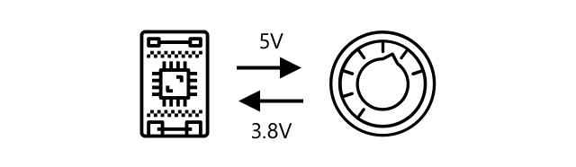
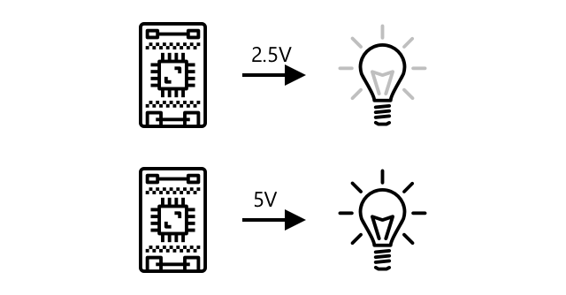
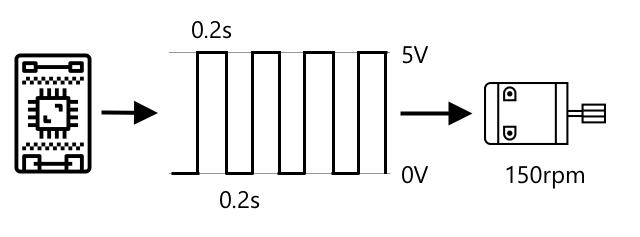

<!--
CO_OP_TRANSLATOR_METADATA:
{
  "original_hash": "e9ee00eb5fc55922a73762acc542166b",
  "translation_date": "2025-08-27T22:25:53+00:00",
  "source_file": "1-getting-started/lessons/3-sensors-and-actuators/README.md",
  "language_code": "sw"
}
-->
# Kuingiliana na Ulimwengu wa Kifaa kwa Vihisi na Vichochezi


> Sketchnote na [Nitya Narasimhan](https://github.com/nitya). Bofya picha kwa toleo kubwa zaidi.

Somo hili lilifundishwa kama sehemu ya [Hello IoT series](https://youtube.com/playlist?list=PLmsFUfdnGr3xRts0TIwyaHyQuHaNQcb6-) kutoka [Microsoft Reactor](https://developer.microsoft.com/reactor/?WT.mc_id=academic-17441-jabenn). Somo lilifundishwa kupitia video mbili - somo la saa moja, na saa moja ya maswali na majibu kwa undani zaidi kuhusu sehemu za somo na kujibu maswali.

[](https://youtu.be/Lqalu1v6aF4)

[](https://youtu.be/qR3ekcMlLWA)

> 🎥 Bofya picha zilizo juu kutazama video

## Jaribio la Kabla ya Somo

[Jaribio la Kabla ya Somo](https://black-meadow-040d15503.1.azurestaticapps.net/quiz/5)

## Utangulizi

Somo hili linaanzisha dhana mbili muhimu kwa kifaa chako cha IoT - vihisi na vichochezi. Pia utapata uzoefu wa vitendo na vyote viwili, ukiongeza kihisi cha mwanga kwenye mradi wako wa IoT, kisha ukiongeza LED inayodhibitiwa na viwango vya mwanga, kwa ufanisi ukijenga taa ya usiku.

Katika somo hili tutashughulikia:

* [Vihisi ni nini?](../../../../../1-getting-started/lessons/3-sensors-and-actuators)
* [Kutumia kihisi](../../../../../1-getting-started/lessons/3-sensors-and-actuators)
* [Aina za vihisi](../../../../../1-getting-started/lessons/3-sensors-and-actuators)
* [Vichochezi ni nini?](../../../../../1-getting-started/lessons/3-sensors-and-actuators)
* [Kutumia kichochezi](../../../../../1-getting-started/lessons/3-sensors-and-actuators)
* [Aina za vichochezi](../../../../../1-getting-started/lessons/3-sensors-and-actuators)

## Vihisi ni nini?

Vihisi ni vifaa vya maunzi vinavyotambua ulimwengu wa kifaa - yaani vinapima mali moja au zaidi zinazowazunguka na kutuma taarifa kwa kifaa cha IoT. Vihisi vinajumuisha anuwai kubwa ya vifaa kwa kuwa kuna mambo mengi yanayoweza kupimwa, kuanzia mali za asili kama joto la hewa hadi mwingiliano wa kimwili kama harakati.

Baadhi ya vihisi vya kawaida ni:

* Vihisi vya joto - vinatambua joto la hewa au joto la kitu ambacho vimezama ndani yake. Kwa watengenezaji na wabunifu, mara nyingi vihisi hivi vinachanganywa na vihisi vya shinikizo la hewa na unyevunyevu katika kihisi kimoja.
* Vitufe - vinatambua wakati vimebonyezwa.
* Vihisi vya mwanga - vinatambua viwango vya mwanga na vinaweza kuwa kwa rangi maalum, mwanga wa UV, mwanga wa IR, au mwanga wa kawaida unaoonekana.
* Kamera - vinatambua mwakilishi wa kuona wa ulimwengu kwa kuchukua picha au kutiririsha video.
* Vihisi vya kasi - vinatambua harakati katika mwelekeo mbalimbali.
* Maikrofoni - vinatambua sauti, iwe viwango vya sauti vya jumla au sauti ya mwelekeo.

✅ Fanya utafiti. Kifaa chako cha simu kina vihisi gani?

Vihisi vyote vina sifa moja ya pamoja - vinabadilisha kile vinachotambua kuwa ishara ya umeme ambayo inaweza kufasiriwa na kifaa cha IoT. Jinsi ishara hii ya umeme inavyofasiriwa inategemea kihisi, pamoja na itifaki ya mawasiliano inayotumika kuwasiliana na kifaa cha IoT.

## Kutumia kihisi

Fuata mwongozo husika hapa chini ili kuongeza kihisi kwenye kifaa chako cha IoT:

* [Arduino - Wio Terminal](wio-terminal-sensor.md)
* [Kompyuta ya bodi moja - Raspberry Pi](pi-sensor.md)
* [Kompyuta ya bodi moja - Kifaa cha mtandaoni](virtual-device-sensor.md)

## Aina za vihisi

Vihisi ni vya analogi au dijitali.

### Vihisi vya analogi

Baadhi ya vihisi vya msingi zaidi ni vya analogi. Vihisi hivi hupokea voltage kutoka kwa kifaa cha IoT, vipengele vya kihisi vinarekebisha voltage hiyo, na voltage inayorudishwa kutoka kwa kihisi inapimwa ili kutoa thamani ya kihisi.

> 🎓 Voltage ni kipimo cha nguvu ya kusukuma umeme kutoka sehemu moja hadi nyingine, kama vile kutoka kwa terminal chanya ya betri hadi terminal hasi. Kwa mfano, betri ya kawaida ya AA ni 1.5V (V ni alama ya volts) na inaweza kusukuma umeme kwa nguvu ya 1.5V kutoka terminal yake chanya hadi terminal yake hasi. Vifaa tofauti vya umeme vinahitaji voltage tofauti ili kufanya kazi, kwa mfano, LED inaweza kuwaka kwa voltage kati ya 2-3V, lakini balbu ya mwanga ya 100W ingehitaji 240V. Unaweza kusoma zaidi kuhusu voltage kwenye [ukurasa wa Voltage wa Wikipedia](https://wikipedia.org/wiki/Voltage).

Mfano mmoja wa hili ni potentiometer. Hii ni kidhibiti unachoweza kuzungusha kati ya nafasi mbili na kihisi kinapima mzunguko.



Kifaa cha IoT kitatoa ishara ya umeme kwa potentiometer kwa voltage, kama vile volts 5 (5V). Potentiometer inaporekebishwa inabadilisha voltage inayotoka upande mwingine. Fikiria una potentiometer iliyoandikwa kama kidhibiti kinachokwenda kutoka 0 hadi [11](https://wikipedia.org/wiki/Up_to_eleven), kama kidhibiti cha sauti kwenye amplifier. Wakati potentiometer iko katika nafasi ya kuzimwa kabisa (0) basi 0V (volts 0) itatoka. Wakati iko katika nafasi ya kuwashwa kabisa (11), 5V (volts 5) itatoka.

> 🎓 Hii ni rahisi sana, na unaweza kusoma zaidi kuhusu potentiometer na resistors zinazobadilika kwenye [ukurasa wa Wikipedia wa potentiometer](https://wikipedia.org/wiki/Potentiometer).

Voltage inayotoka kwenye kihisi kisha inasomwa na kifaa cha IoT, na kifaa kinaweza kuitikia. Kulingana na kihisi, voltage hii inaweza kuwa thamani ya kiholela au inaweza kuhusiana na kipimo cha kawaida. Kwa mfano, kihisi cha joto cha analogi kinachotegemea [thermistor](https://wikipedia.org/wiki/Thermistor) hubadilisha upinzani wake kulingana na joto. Voltage inayotoka inaweza kisha kubadilishwa kuwa joto katika Kelvin, na kwa hiyo kuwa °C au °F, kwa mahesabu katika msimbo.

✅ Unadhani nini kinatokea ikiwa kihisi kitarudisha voltage ya juu kuliko ile iliyotumwa (kwa mfano inayotoka kwa chanzo cha umeme cha nje)? ⛔️ USIJARIBU hili.

#### Ubadilishaji wa analogi kuwa dijitali

Vifaa vya IoT ni dijitali - haviwezi kufanya kazi na thamani za analogi, vinafanya kazi tu na 0 na 1. Hii inamaanisha kuwa thamani za kihisi za analogi zinahitaji kubadilishwa kuwa ishara ya dijitali kabla ya kusindika. Vifaa vingi vya IoT vina ubadilishaji wa analogi kuwa dijitali (ADCs) ili kubadilisha pembejeo za analogi kuwa uwakilishi wa dijitali wa thamani zao. Vihisi vinaweza pia kufanya kazi na ADCs kupitia bodi ya kiunganishi. Kwa mfano, katika mfumo wa Seeed Grove na Raspberry Pi, vihisi vya analogi vinaunganishwa na bandari maalum kwenye 'hat' inayokaa juu ya Pi iliyounganishwa na pini za GPIO za Pi, na hat hii ina ADC ya kubadilisha voltage kuwa ishara ya dijitali inayoweza kutumwa kutoka kwa pini za GPIO za Pi.

Fikiria una kihisi cha mwanga cha analogi kilichounganishwa na kifaa cha IoT kinachotumia 3.3V na kinarejesha thamani ya 1V. Hii 1V haina maana yoyote katika ulimwengu wa dijitali, kwa hivyo inahitaji kubadilishwa. Voltage itabadilishwa kuwa thamani ya analogi kwa kutumia kipimo kulingana na kifaa na kihisi. Mfano mmoja ni kihisi cha mwanga cha Seeed Grove ambacho kinatoa thamani kutoka 0 hadi 1,023. Kwa kihisi hiki kinachotumia 3.3V, matokeo ya 1V yatakuwa thamani ya 300. Kifaa cha IoT hakiwezi kushughulikia 300 kama thamani ya analogi, kwa hivyo thamani itabadilishwa kuwa `0000000100101100`, uwakilishi wa binary wa 300 na hat ya Grove. Hii kisha itasindika na kifaa cha IoT.

✅ Ikiwa hujui binary, basi fanya utafiti kidogo kujifunza jinsi nambari zinavyowakilishwa na 0 na 1. [Somo la utangulizi wa binary la BBC Bitesize](https://www.bbc.co.uk/bitesize/guides/zwsbwmn/revision/1) ni mahali pazuri pa kuanzia.

Kwa mtazamo wa usimbaji, yote haya kwa kawaida hushughulikiwa na maktaba zinazokuja na vihisi, kwa hivyo huhitaji kuwa na wasiwasi kuhusu ubadilishaji huu mwenyewe. Kwa kihisi cha mwanga cha Grove unaweza kutumia maktaba ya Python na kuita mali ya `light`, au kutumia maktaba ya Arduino na kuita `analogRead` kupata thamani ya 300.

### Vihisi vya dijitali

Vihisi vya dijitali, kama vile vya analogi, hutambua ulimwengu wa kifaa kwa kutumia mabadiliko ya voltage ya umeme. Tofauti ni kwamba vinatoa ishara ya dijitali, ama kwa kupima hali mbili tu au kwa kutumia ADC iliyojengwa ndani. Vihisi vya dijitali vinazidi kuwa vya kawaida ili kuepuka hitaji la kutumia ADC ama kwenye bodi ya kiunganishi au kwenye kifaa cha IoT chenyewe.

Kihisi rahisi zaidi cha dijitali ni kitufe au swichi. Hiki ni kihisi chenye hali mbili, kuwashwa au kuzimwa.


Pini kwenye vifaa vya IoT kama pini za GPIO zinaweza kupima ishara hii moja kwa moja kama 0 au 1. Ikiwa voltage iliyotumwa ni sawa na voltage iliyorejeshwa, thamani inayosomwa ni 1, vinginevyo thamani inayosomwa ni 0. Hakuna haja ya kubadilisha ishara, inaweza kuwa 1 au 0 tu.

> 💁 Voltage kamwe si sahihi hasa kwa kuwa vipengele katika kihisi vitakuwa na upinzani fulani, kwa hivyo kwa kawaida kuna uvumilivu. Kwa mfano, pini za GPIO kwenye Raspberry Pi hufanya kazi kwa 3.3V, na husoma ishara ya kurudi juu ya 1.8V kama 1, chini ya 1.8V kama 0.

* 3.3V inaingia kwenye kitufe. Kitufe kimezimwa kwa hivyo 0V inatoka, ikitoa thamani ya 0
* 3.3V inaingia kwenye kitufe. Kitufe kimewashwa kwa hivyo 3.3V inatoka, ikitoa thamani ya 1

Vihisi vya dijitali vya hali ya juu zaidi husoma thamani za analogi, kisha kuzibadilisha kwa kutumia ADC zilizojengwa ndani kuwa ishara za dijitali. Kwa mfano, kihisi cha joto cha dijitali bado kitatumia thermocouple kwa njia sawa na kihisi cha analogi, na bado kitapima mabadiliko ya voltage yanayosababishwa na upinzani wa thermocouple kwa joto la sasa. Badala ya kurudisha thamani ya analogi na kutegemea kifaa au bodi ya kiunganishi kubadilisha kuwa ishara ya dijitali, ADC iliyojengwa ndani ya kihisi itabadilisha thamani na kuituma kama mfululizo wa 0 na 1 kwa kifaa cha IoT. 0 na 1 hizi zitatumwa kwa njia sawa na ishara ya dijitali kwa kitufe ambapo 1 ni voltage kamili na 0 ni 0V.


Kutuma data ya dijitali kunaruhusu vihisi kuwa vya hali ya juu zaidi na kutuma data ya kina zaidi, hata data iliyosimbwa kwa vihisi salama. Mfano mmoja ni kamera. Hiki ni kihisi kinachokamata picha na kuituma kama data ya dijitali inayojumuisha picha hiyo, kwa kawaida katika muundo uliobanwa kama JPEG, kusomwa na kifaa cha IoT. Inaweza hata kutiririsha video kwa kukamata picha na kutuma ama picha kamili fremu kwa fremu au mkondo wa video uliobanwa.

## Vichochezi ni nini?

Vichochezi ni kinyume cha vihisi - vinabadilisha ishara ya umeme kutoka kwa kifaa chako cha IoT kuwa mwingiliano na ulimwengu wa kifaa kama vile kutoa mwanga au sauti, au kuendesha motor.

Baadhi ya vichochezi vya kawaida ni:

* LED - vinatoa mwanga wakati vinawashwa
* Spika - vinatoa sauti kulingana na ishara inayotumwa kwao, kuanzia buzzer ya msingi hadi spika ya sauti inayoweza kucheza muziki
* Motor ya hatua - vinabadilisha ishara kuwa kiasi fulani cha mzunguko, kama vile kuzungusha kidhibiti kwa digrii 90°
* Relay - hizi ni swichi zinazoweza kuwashwa au kuzimwa na ishara ya umeme. Zinaruhusu voltage ndogo kutoka kwa kifaa cha IoT kuwasha voltage kubwa.
* Skrini - hizi ni vichochezi vya hali ya juu zaidi na huonyesha taarifa kwenye onyesho lenye sehemu nyingi. Skrini zinatofautiana kutoka kwa maonyesho rahisi ya LED hadi monitor za video zenye azimio la juu.

✅ Fanya utafiti. Kifaa chako cha simu kina vichochezi gani?

## Kutumia kichochezi

Fuata mwongozo husika hapa chini ili kuongeza kichochezi kwenye kifaa chako cha IoT, kinachodhibitiwa na kihisi, ili kujenga taa ya usiku ya IoT. Itakusanya viwango vya mwanga kutoka kwa kihisi cha mwanga, na kutumia kichochezi kwa njia ya LED kutoa mwanga wakati kiwango cha mwanga kilichotambuliwa ni kidogo sana.


* [Arduino - Wio Terminal](wio-terminal-actuator.md)
* [Kompyuta ya bodi moja - Raspberry Pi](pi-actuator.md)
* [Kompyuta ya bodi moja - Kifaa cha mtandaoni](virtual-device-actuator.md)

## Aina za vichochezi

Kama vihisi, vichochezi ni vya analogi au dijitali.

### Vichochezi vya analogi

Vichochezi vya analogi huchukua ishara ya analogi na kuibadilisha kuwa aina fulani ya mwingiliano, ambapo mwingiliano hubadilika kulingana na voltage inayotolewa.

Mfano mmoja ni taa inayoweza kupunguzwa mwanga, kama zile unazoweza kuwa nazo nyumbani kwako. Kiasi cha voltage kinachotolewa kwa taa huamua jinsi inavyong'aa.


Kama ilivyo kwa sensa, kifaa halisi cha IoT hufanya kazi kwa ishara za kidijitali, si za analogi. Hii inamaanisha ili kutuma ishara ya analogi, kifaa cha IoT kinahitaji kigeuzi cha kidijitali kwenda analogi (DAC), aidha moja kwa moja kwenye kifaa cha IoT, au kwenye bodi ya kiunganishi. Hii itabadilisha 0s na 1s kutoka kwa kifaa cha IoT kuwa voltage ya analogi ambayo actuator inaweza kutumia.

✅ Unadhani nini kitatokea ikiwa kifaa cha IoT kitatoa voltage ya juu zaidi kuliko ile ambayo actuator inaweza kushughulikia?  
⛔️ USIJARIBU hili.

#### Modulation ya Upana wa Mapigo

Njia nyingine ya kubadilisha ishara za kidijitali kutoka kwa kifaa cha IoT kuwa ishara ya analogi ni modulation ya upana wa mapigo (PWM). Hii inahusisha kutuma mapigo mafupi ya kidijitali mengi ambayo hufanya kazi kana kwamba ni ishara ya analogi.

Kwa mfano, unaweza kutumia PWM kudhibiti kasi ya motor.

Fikiria unadhibiti motor yenye usambazaji wa 5V. Unatuma pigo fupi kwa motor yako, ukibadilisha voltage kuwa ya juu (5V) kwa sekunde mbili ya mia (0.02s). Katika muda huo motor yako inaweza kuzunguka sehemu moja ya kumi ya mzunguko, au 36°. Ishara kisha inasimama kwa sekunde mbili ya mia (0.02s), ikituma ishara ya chini (0V). Kila mzunguko wa kuwasha kisha kuzima hudumu 0.04s. Mzunguko kisha unarudiwa.



Hii inamaanisha kwa sekunde moja unakuwa na mapigo 25 ya 5V ya 0.02s yanayozungusha motor, kila moja ikifuatiwa na pause ya 0.02s ya 0V ambayo haizungushi motor. Kila pigo huzungusha motor sehemu moja ya kumi ya mzunguko, ikimaanisha motor inakamilisha mizunguko 2.5 kwa sekunde. Umetumia ishara ya kidijitali kuzungusha motor kwa mizunguko 2.5 kwa sekunde, au 150 [mizunguko kwa dakika](https://wikipedia.org/wiki/Revolutions_per_minute) (kipimo kisicho rasmi cha kasi ya mzunguko).

```output
25 pulses per second x 0.1 rotations per pulse = 2.5 rotations per second
2.5 rotations per second x 60 seconds in a minute = 150rpm
```

> 🎓 Wakati ishara ya PWM iko juu kwa nusu ya muda, na chini kwa nusu ya muda inajulikana kama [mzunguko wa wajibu wa 50%](https://wikipedia.org/wiki/Duty_cycle). Mizunguko ya wajibu hupimwa kama asilimia ya muda ambao ishara iko katika hali ya juu ikilinganishwa na hali ya chini.


Unaweza kubadilisha kasi ya motor kwa kubadilisha ukubwa wa mapigo. Kwa mfano, kwa motor ile ile unaweza kuweka muda wa mzunguko ule ule wa 0.04s, na pigo la juu likipunguzwa nusu hadi 0.01s, na pause ya chini ikiongezeka hadi 0.03s. Unakuwa na idadi ile ile ya mapigo kwa sekunde (25), lakini kila pigo la juu ni nusu ya urefu. Pigo la nusu urefu huzungusha motor sehemu moja ya ishirini ya mzunguko, na kwa mapigo 25 kwa sekunde itakamilisha mizunguko 1.25 kwa sekunde au 75rpm. Kwa kubadilisha kasi ya mapigo ya ishara ya kidijitali umepunguza kasi ya motor ya analogi kwa nusu.

```output
25 pulses per second x 0.05 rotations per pulse = 1.25 rotations per second
1.25 rotations per second x 60 seconds in a minute = 75rpm
```

✅ Je, ungewezaje kuweka mzunguko wa motor kuwa laini, hasa kwa kasi ya chini? Je, ungetumia idadi ndogo ya mapigo marefu na pause ndefu au mapigo mafupi sana na pause fupi sana?

> 💁 Baadhi ya sensa pia hutumia PWM kubadilisha ishara za analogi kuwa za kidijitali.

> 🎓 Unaweza kusoma zaidi kuhusu modulation ya upana wa mapigo kwenye [ukurasa wa Wikipedia wa modulation ya upana wa mapigo](https://wikipedia.org/wiki/Pulse-width_modulation).

### Actuators za Kidijitali

Actuators za kidijitali, kama sensa za kidijitali, huwa na hali mbili zinazodhibitiwa na voltage ya juu au ya chini au zina DAC iliyojengwa ndani hivyo zinaweza kubadilisha ishara ya kidijitali kuwa ya analogi.

Actuator moja rahisi ya kidijitali ni LED. Wakati kifaa kinatuma ishara ya kidijitali ya 1, voltage ya juu inatumwa ambayo huwasha LED. Wakati ishara ya kidijitali ya 0 inatumwa, voltage hushuka hadi 0V na LED huzimika.


✅ Ni actuators gani nyingine rahisi zenye hali mbili unaweza kufikiria? Mfano mmoja ni solenoid, ambayo ni sumaku ya umeme inayoweza kuanzishwa kufanya mambo kama kusogeza bolt ya mlango kufunga/kufungua mlango.

Actuators za kidijitali za hali ya juu zaidi, kama skrini, zinahitaji data ya kidijitali kutumwa kwa fomati fulani. Kwa kawaida huja na maktaba zinazorahisisha kutuma data sahihi ya kuzidhibiti.

---

## 🚀 Changamoto

Changamoto katika masomo mawili yaliyopita ilikuwa kuorodhesha vifaa vingi vya IoT unavyoweza ambavyo vipo nyumbani kwako, shuleni au kazini na kuamua kama vimejengwa kuzunguka microcontrollers au kompyuta za bodi moja, au hata mchanganyiko wa vyote viwili.

Kwa kila kifaa ulichoorodhesha, ni sensa na actuators gani vimeunganishwa navyo? Ni nini kusudi la kila sensa na actuator iliyounganishwa na vifaa hivi?

## Jaribio la Baada ya Somo

[Jaribio la Baada ya Somo](https://black-meadow-040d15503.1.azurestaticapps.net/quiz/6)

## Mapitio na Kujisomea

* Soma kuhusu umeme na mizunguko kwenye [ThingLearn](http://thinglearn.jenlooper.com/curriculum/).  
* Soma kuhusu aina tofauti za sensa za joto kwenye [Mwongozo wa Sensa za Joto wa Seeed Studios](https://www.seeedstudio.com/blog/2019/10/14/temperature-sensors-for-arduino-projects/)  
* Soma kuhusu LEDs kwenye [ukurasa wa Wikipedia wa LED](https://wikipedia.org/wiki/Light-emitting_diode)  

## Kazi ya Nyumbani

[Chunguza sensa na actuators](assignment.md)  

---

**Kanusho**:  
Hati hii imetafsiriwa kwa kutumia huduma ya tafsiri ya AI [Co-op Translator](https://github.com/Azure/co-op-translator). Ingawa tunajitahidi kuhakikisha usahihi, tafadhali fahamu kuwa tafsiri za kiotomatiki zinaweza kuwa na makosa au kutokuwa sahihi. Hati ya asili katika lugha yake ya awali inapaswa kuzingatiwa kama chanzo cha mamlaka. Kwa taarifa muhimu, tafsiri ya kitaalamu ya binadamu inapendekezwa. Hatutawajibika kwa kutoelewana au tafsiri zisizo sahihi zinazotokana na matumizi ya tafsiri hii.