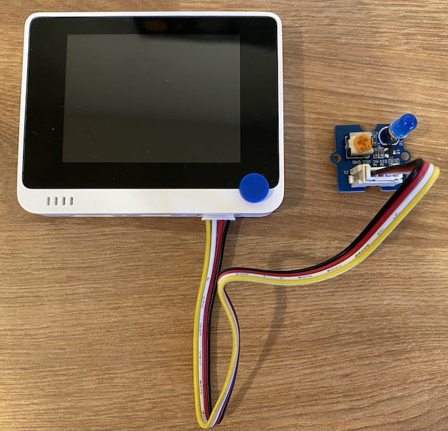

<!--
CO_OP_TRANSLATOR_METADATA:
{
  "original_hash": "db44083b4dc6fb06eac83c4f16448940",
  "translation_date": "2025-08-27T22:31:56+00:00",
  "source_file": "1-getting-started/lessons/3-sensors-and-actuators/wio-terminal-actuator.md",
  "language_code": "sw"
}
-->
# Jenga taa ya usiku - Wio Terminal

Katika sehemu hii ya somo, utaongeza LED kwenye Wio Terminal yako na kuitumia kuunda taa ya usiku.

## Vifaa vya Kifaa

Taa ya usiku sasa inahitaji kifaa cha kutenda.

Kifaa cha kutenda ni **LED**, [diode inayotoa mwanga](https://wikipedia.org/wiki/Light-emitting_diode) ambayo hutoa mwanga wakati umeme unapita kupitia. Hii ni kifaa cha kutenda cha kidijitali ambacho kina hali mbili, kuwashwa na kuzimwa. Kutuma thamani ya 1 huwasha LED, na 0 huzima. Hii ni kifaa cha nje cha Grove na inahitaji kuunganishwa na Wio Terminal.

Mantiki ya taa ya usiku kwa pseudo-code ni:

```output
Check the light level.
If the light is less than 300
    Turn the LED on
Otherwise
    Turn the LED off
```

### Unganisha LED

LED ya Grove inakuja kama moduli yenye chaguo la LEDs, ikikuruhusu kuchagua rangi.

#### Kazi - unganisha LED

Unganisha LED.


1. Chagua LED unayopenda na ingiza miguu yake kwenye mashimo mawili kwenye moduli ya LED.

    LEDs ni diodes zinazotoa mwanga, na diodes ni vifaa vya kielektroniki vinavyoweza kubeba umeme kwa njia moja tu. Hii inamaanisha LED inahitaji kuunganishwa kwa njia sahihi, vinginevyo haitafanya kazi.

    Moja ya miguu ya LED ni pini ya chanya, nyingine ni pini ya hasi. LED si mviringo kikamilifu, na ni bapa kidogo upande mmoja. Upande ulio bapa kidogo ni pini ya hasi. Unapounganisha LED kwenye moduli, hakikisha pini iliyo karibu na upande wa mviringo imeunganishwa na soketi iliyoandikwa **+** upande wa nje wa moduli, na upande ulio bapa umeunganishwa na soketi iliyo karibu na katikati ya moduli.

1. Moduli ya LED ina kitufe cha kuzungusha kinachokuruhusu kudhibiti mwangaza. Zungusha kitufe hiki hadi mwisho kwa kuzungusha kinyume na saa kadri inavyoweza kwa kutumia bisibisi ndogo ya kichwa cha Phillips.

1. Ingiza mwisho mmoja wa kebo ya Grove kwenye soketi ya moduli ya LED. Itaingia kwa njia moja tu.

1. Ukiwa na Wio Terminal imekatwa kutoka kwa kompyuta yako au chanzo kingine cha nguvu, unganisha mwisho mwingine wa kebo ya Grove kwenye soketi ya Grove ya upande wa kulia kwenye Wio Terminal ukiangalia skrini. Hii ni soketi iliyo mbali zaidi na kitufe cha nguvu.

    > 💁 Soketi ya Grove ya upande wa kulia inaweza kutumika na sensa za analogi au kidijitali na vifaa vya kutenda. Soketi ya upande wa kushoto ni kwa sensa za analogi pekee. C itafundishwa katika somo la baadaye.



## Programu ya taa ya usiku

Taa ya usiku sasa inaweza kupangwa kwa kutumia sensa ya mwanga iliyojengwa ndani na LED ya Grove.

### Kazi - panga taa ya usiku

Panga taa ya usiku.

1. Fungua mradi wa taa ya usiku katika VS Code uliouunda katika sehemu ya awali ya kazi hii.

1. Ongeza mstari ufuatao chini ya kazi ya `setup`:

    ```cpp
    pinMode(D0, OUTPUT);
    ```

    Mstari huu unasanidi pini inayotumika kuwasiliana na LED kupitia Grove port.

    Pini ya `D0` ni pini ya kidijitali kwa soketi ya Grove ya upande wa kulia. Pini hii imewekwa kuwa `OUTPUT`, ikimaanisha inaunganishwa na kifaa cha kutenda na data itaandikwa kwenye pini.

1. Ongeza msimbo ufuatao mara moja kabla ya `delay` katika kazi ya loop:

    ```cpp
    if (light < 300)
    {
        digitalWrite(D0, HIGH);
    }
    else
    {
        digitalWrite(D0, LOW);
    }
    ```

    Msimbo huu unakagua thamani ya `light`. Ikiwa thamani hii ni chini ya 300, inatuma thamani ya `HIGH` kwenye pini ya kidijitali ya `D0`. Thamani hii ya `HIGH` ni 1, inayowasha LED. Ikiwa mwanga ni mkubwa au sawa na 300, thamani ya `LOW` ya 0 inatumwa kwenye pini, ikizima LED.

    > 💁 Unapotuma thamani za kidijitali kwa vifaa vya kutenda, thamani ya LOW ni 0v, na thamani ya HIGH ni voltage ya juu kwa kifaa. Kwa Wio Terminal, voltage ya HIGH ni 3.3V.

1. Unganisha tena Wio Terminal kwenye kompyuta yako, na pakia msimbo mpya kama ulivyofanya awali.

1. Unganisha Serial Monitor. Thamani za mwanga zitaonyeshwa kwenye terminal.

    ```output
    > Executing task: platformio device monitor <

    --- Available filters and text transformations: colorize, debug, default, direct, hexlify, log2file, nocontrol, printable, send_on_enter, time
    --- More details at http://bit.ly/pio-monitor-filters
    --- Miniterm on /dev/cu.usbmodem101  9600,8,N,1 ---
    --- Quit: Ctrl+C | Menu: Ctrl+T | Help: Ctrl+T followed by Ctrl+H ---
    Light value: 4
    Light value: 5
    Light value: 4
    Light value: 158
    Light value: 343
    Light value: 348
    Light value: 344
    ```

1. Funika na kufunua sensa ya mwanga. Angalia jinsi LED inavyowaka ikiwa kiwango cha mwanga ni 300 au chini, na kuzima wakati kiwango cha mwanga ni zaidi ya 300.


> 💁 Unaweza kupata msimbo huu katika folda ya [code-actuator/wio-terminal](../../../../../1-getting-started/lessons/3-sensors-and-actuators/code-actuator/wio-terminal).

😀 Programu yako ya taa ya usiku imefanikiwa!

---

**Kanusho**:  
Hati hii imetafsiriwa kwa kutumia huduma ya tafsiri ya AI [Co-op Translator](https://github.com/Azure/co-op-translator). Ingawa tunajitahidi kwa usahihi, tafadhali fahamu kuwa tafsiri za kiotomatiki zinaweza kuwa na makosa au kutokuwa sahihi. Hati ya asili katika lugha yake ya awali inapaswa kuzingatiwa kama chanzo cha mamlaka. Kwa taarifa muhimu, inashauriwa kutumia huduma ya tafsiri ya kibinadamu ya kitaalamu. Hatutawajibika kwa maelewano mabaya au tafsiri zisizo sahihi zinazotokana na matumizi ya tafsiri hii.