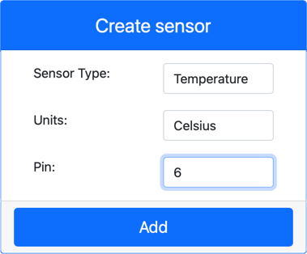

<!--
CO_OP_TRANSLATOR_METADATA:
{
  "original_hash": "70e5a428b607cd5a9a4f422c2a4df03d",
  "translation_date": "2025-08-27T23:21:56+00:00",
  "source_file": "2-farm/lessons/1-predict-plant-growth/virtual-device-temp.md",
  "language_code": "sw"
}
-->
# Pima joto - Vifaa vya IoT vya Kijumla

Katika sehemu hii ya somo, utaongeza kihisi cha joto kwenye kifaa chako cha IoT cha kijumla.

## Vifaa vya Kijumla

Kifaa cha IoT cha kijumla kitatumia kihisi cha **Grove Digital Humidity and Temperature** kilichosimuliwa. Hii inafanya maabara hii kuwa sawa na kutumia Raspberry Pi na kihisi halisi cha Grove DHT11.

Kihisi hiki kinachanganya **kihisi cha joto** na **kihisi cha unyevunyevu**, lakini katika maabara hii utajihusisha tu na sehemu ya kihisi cha joto. Katika kifaa halisi cha IoT, kihisi cha joto kingekuwa [thermistor](https://wikipedia.org/wiki/Thermistor) ambacho hupima joto kwa kuhisi mabadiliko ya upinzani kadri joto linavyobadilika. Vihisi vya joto mara nyingi ni vihisi vya kidijitali ambavyo ndani yake hubadilisha upinzani uliopimwa kuwa joto katika nyuzi za Celsius (au Kelvin, au Fahrenheit).

### Ongeza vihisi kwenye CounterFit

Ili kutumia kihisi cha unyevunyevu na joto cha kijumla, unahitaji kuongeza vihisi viwili kwenye programu ya CounterFit.

#### Kazi - ongeza vihisi kwenye CounterFit

Ongeza vihisi vya unyevunyevu na joto kwenye programu ya CounterFit.

1. Tengeneza programu mpya ya Python kwenye kompyuta yako katika folda inayoitwa `temperature-sensor` yenye faili moja inayoitwa `app.py` na mazingira ya kawaida ya Python, kisha ongeza pakiti za CounterFit pip.

    > ⚠️ Unaweza kurejelea [maelekezo ya kutengeneza na kusanidi mradi wa Python wa CounterFit katika somo la 1 ikiwa unahitaji](../../../1-getting-started/lessons/1-introduction-to-iot/virtual-device.md).

1. Sakinisha pakiti ya ziada ya Pip ili kusakinisha shim ya CounterFit kwa kihisi cha DHT11. Hakikisha unafanya hivi kutoka kwa terminal yenye mazingira ya kawaida yakiwa yamewezeshwa.

    ```sh
    pip install counterfit-shims-seeed-python-dht
    ```

1. Hakikisha programu ya wavuti ya CounterFit inaendelea kufanya kazi.

1. Tengeneza kihisi cha unyevunyevu:

    1. Katika kisanduku cha *Create sensor* kwenye paneli ya *Sensors*, shusha kisanduku cha *Sensor type* na uchague *Humidity*.

    1. Acha *Units* zikiwa zimewekwa kwa *Percentage*.

    1. Hakikisha *Pin* imewekwa kwa *5*.

    1. Chagua kitufe cha **Add** ili kutengeneza kihisi cha unyevunyevu kwenye Pin 5.

    

    Kihisi cha unyevunyevu kitatengenezwa na kuonekana kwenye orodha ya vihisi.

    

1. Tengeneza kihisi cha joto:

    1. Katika kisanduku cha *Create sensor* kwenye paneli ya *Sensors*, shusha kisanduku cha *Sensor type* na uchague *Temperature*.

    1. Acha *Units* zikiwa zimewekwa kwa *Celsius*.

    1. Hakikisha *Pin* imewekwa kwa *6*.

    1. Chagua kitufe cha **Add** ili kutengeneza kihisi cha joto kwenye Pin 6.

    

    Kihisi cha joto kitatengenezwa na kuonekana kwenye orodha ya vihisi.

    

## Programu ya kihisi cha joto

Sasa programu ya kihisi cha joto inaweza kuandikwa kwa kutumia vihisi vya CounterFit.

### Kazi - andika programu ya kihisi cha joto

Andika programu ya kihisi cha joto.

1. Hakikisha programu ya `temperature-sensor` imefunguliwa kwenye VS Code.

1. Fungua faili ya `app.py`.

1. Ongeza msimbo ufuatao juu ya `app.py` ili kuunganisha programu na CounterFit:

    ```python
    from counterfit_connection import CounterFitConnection
    CounterFitConnection.init('127.0.0.1', 5000)
    ```

1. Ongeza msimbo ufuatao kwenye faili ya `app.py` ili kuingiza maktaba zinazohitajika:

    ```python
    import time
    from counterfit_shims_seeed_python_dht import DHT
    ```

    Kauli ya `from seeed_dht import DHT` inaingiza darasa la `DHT` ili kuingiliana na kihisi cha joto cha Grove cha kijumla kwa kutumia shim kutoka moduli ya `counterfit_shims_seeed_python_dht`.

1. Ongeza msimbo ufuatao baada ya msimbo hapo juu ili kuunda mfano wa darasa linalosimamia kihisi cha unyevunyevu na joto cha kijumla:

    ```python
    sensor = DHT("11", 5)
    ```

    Hii inatangaza mfano wa darasa la `DHT` linalosimamia kihisi cha **D**igital **H**umidity na **T**emperature cha kijumla. Kigezo cha kwanza kinaambia msimbo kuwa kihisi kinachotumika ni kihisi cha kijumla cha *DHT11*. Kigezo cha pili kinaambia msimbo kuwa kihisi kimeunganishwa kwenye bandari `5`.

    > 💁 CounterFit inasimulia kihisi hiki cha unyevunyevu na joto kilichounganishwa kwa kuunganisha na vihisi viwili, kihisi cha unyevunyevu kwenye pini iliyotolewa wakati darasa la `DHT` linatengenezwa, na kihisi cha joto kinachofanya kazi kwenye pini inayofuata. Ikiwa kihisi cha unyevunyevu kiko kwenye pini 5, shim inatarajia kihisi cha joto kuwa kwenye pini 6.

1. Ongeza kitanzi kisicho na mwisho baada ya msimbo hapo juu ili kuchukua thamani ya kihisi cha joto na kuitoa kwenye koni:

    ```python
    while True:
        _, temp = sensor.read()
        print(f'Temperature {temp}°C')
    ```

    Simu ya `sensor.read()` inarudisha jozi ya unyevunyevu na joto. Unahitaji tu thamani ya joto, kwa hivyo unyevunyevu unapuuzwa. Thamani ya joto kisha inatolewa kwenye koni.

1. Ongeza muda mfupi wa sekunde kumi mwishoni mwa `loop` kwani viwango vya joto havihitaji kuchunguzwa kila wakati. Muda wa kulala unapunguza matumizi ya nguvu ya kifaa.

    ```python
    time.sleep(10)
    ```

1. Kutoka kwa Terminal ya VS Code yenye mazingira ya kawaida yakiwa yamewezeshwa, endesha msimbo ufuatao ili kuendesha programu yako ya Python:

    ```sh
    python app.py
    ```

1. Kutoka kwa programu ya CounterFit, badilisha thamani ya kihisi cha joto ambayo itasomwa na programu. Unaweza kufanya hivi kwa njia mbili:

    * Weka namba kwenye kisanduku cha *Value* cha kihisi cha joto, kisha chagua kitufe cha **Set**. Namba unayoingiza itakuwa thamani inayorudishwa na kihisi.

    * Angalia kisanduku cha *Random*, na weka thamani ya *Min* na *Max*, kisha chagua kitufe cha **Set**. Kila wakati kihisi kinaposoma thamani, kitatoa namba ya nasibu kati ya *Min* na *Max*.

    Unapaswa kuona thamani unazoweka zikitokea kwenye koni. Badilisha *Value* au mipangilio ya *Random* ili kuona thamani ikibadilika.

    ```output
    (.venv) ➜  temperature-sensor python app.py
    Temperature 28.25°C
    Temperature 30.71°C
    Temperature 25.17°C
    ```

> 💁 Unaweza kupata msimbo huu katika folda ya [code-temperature/virtual-device](../../../../../2-farm/lessons/1-predict-plant-growth/code-temperature/virtual-device).

😀 Programu yako ya kihisi cha joto imefanikiwa!

---

**Kanusho**:  
Hati hii imetafsiriwa kwa kutumia huduma ya tafsiri ya AI [Co-op Translator](https://github.com/Azure/co-op-translator). Ingawa tunajitahidi kwa usahihi, tafadhali fahamu kuwa tafsiri za kiotomatiki zinaweza kuwa na makosa au kutokuwa sahihi. Hati ya asili katika lugha yake ya awali inapaswa kuzingatiwa kama chanzo cha mamlaka. Kwa taarifa muhimu, inashauriwa kutumia tafsiri ya kitaalamu ya binadamu. Hatutawajibika kwa maelewano mabaya au tafsiri zisizo sahihi zinazotokana na matumizi ya tafsiri hii.