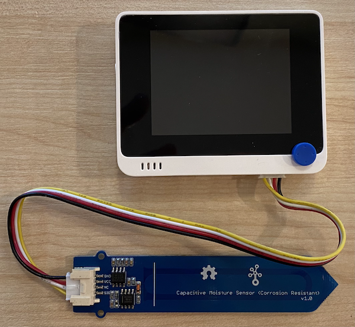

<!--
CO_OP_TRANSLATOR_METADATA:
{
  "original_hash": "0d55caa8c23d73635b7559102cd17b8a",
  "translation_date": "2025-08-27T22:55:51+00:00",
  "source_file": "2-farm/lessons/2-detect-soil-moisture/wio-terminal-soil-moisture.md",
  "language_code": "sw"
}
-->
# Pima unyevu wa udongo - Wio Terminal

Katika sehemu hii ya somo, utaongeza kihisi cha unyevu wa udongo cha capacitive kwenye Wio Terminal yako, na kusoma thamani kutoka kwake.

## Vifaa

Wio Terminal inahitaji kihisi cha unyevu wa udongo cha capacitive.

Kihisi utakachotumia ni [Capacitive Soil Moisture Sensor](https://www.seeedstudio.com/Grove-Capacitive-Moisture-Sensor-Corrosion-Resistant.html), ambacho hupima unyevu wa udongo kwa kugundua capacitance ya udongo, mali inayobadilika kadri unyevu wa udongo unavyobadilika. Kadri unyevu wa udongo unavyoongezeka, voltage hupungua.

Hiki ni kihisi cha analogi, kwa hivyo huunganishwa kwenye pini za analogi kwenye Wio Terminal, kwa kutumia ADC ya ndani kuunda thamani kutoka 0-1,023.

### Unganisha kihisi cha unyevu wa udongo

Kihisi cha unyevu wa udongo cha Grove kinaweza kuunganishwa kwenye bandari ya analogi/digitali inayoweza kusanidiwa ya Wio Terminal.

#### Kazi - unganisha kihisi cha unyevu wa udongo

Unganisha kihisi cha unyevu wa udongo.


1. Ingiza mwisho mmoja wa kebo ya Grove kwenye soketi ya kihisi cha unyevu wa udongo. Itaingia kwa njia moja tu.

1. Ukiwa na Wio Terminal imekatwa kutoka kwa kompyuta yako au chanzo kingine cha nguvu, unganisha mwisho mwingine wa kebo ya Grove kwenye soketi ya kulia ya Grove kwenye Wio Terminal unapoangalia skrini. Hii ni soketi iliyo mbali zaidi na kitufe cha nguvu.



1. Ingiza kihisi cha unyevu wa udongo kwenye udongo. Kina mstari wa 'kiwango cha juu zaidi' - mstari mweupe kwenye kihisi. Ingiza kihisi hadi mstari huo lakini usivuke mstari huo.


1. Sasa unaweza kuunganisha Wio Terminal kwenye kompyuta yako.

## Programu ya kihisi cha unyevu wa udongo

Sasa Wio Terminal inaweza kupangwa kutumia kihisi cha unyevu wa udongo kilichounganishwa.

### Kazi - panga kihisi cha unyevu wa udongo

Panga kifaa.

1. Unda mradi mpya wa Wio Terminal ukitumia PlatformIO. Ita mradi huu `soil-moisture-sensor`. Ongeza msimbo kwenye kazi ya `setup` ili kusanidi bandari ya serial.

    > ⚠️ Unaweza kurejelea [maelekezo ya kuunda mradi wa PlatformIO katika mradi wa 1, somo la 1 ikiwa unahitaji](../../../1-getting-started/lessons/1-introduction-to-iot/wio-terminal.md#create-a-platformio-project).

1. Hakuna maktaba kwa ajili ya kihisi hiki, badala yake unaweza kusoma kutoka kwenye pini ya analogi ukitumia kazi ya Arduino [`analogRead`](https://www.arduino.cc/reference/en/language/functions/analog-io/analogread/). Anza kwa kusanidi pini ya analogi kwa pembejeo ili thamani ziweze kusomwa kutoka kwake kwa kuongeza yafuatayo kwenye kazi ya `setup`.

    ```cpp
    pinMode(A0, INPUT);
    ```

    Hii inasanidi pini ya `A0`, pini ya analogi/digitali iliyojumuishwa, kama pini ya pembejeo ambayo voltage inaweza kusomwa kutoka.

1. Ongeza yafuatayo kwenye kazi ya `loop` ili kusoma voltage kutoka kwenye pini hii:

    ```cpp
    int soil_moisture = analogRead(A0);
    ```

1. Chini ya msimbo huu, ongeza msimbo ufuatao ili kuchapisha thamani kwenye bandari ya serial:

    ```cpp
    Serial.print("Soil Moisture: ");
    Serial.println(soil_moisture);
    ```

1. Hatimaye ongeza kuchelewesha kwa sekunde 10 mwishoni:

    ```cpp
    delay(10000);
    ```

1. Jenga na pakia msimbo kwenye Wio Terminal.

    > ⚠️ Unaweza kurejelea [maelekezo ya kuunda mradi wa PlatformIO katika mradi wa 1, somo la 1 ikiwa unahitaji](../../../1-getting-started/lessons/1-introduction-to-iot/wio-terminal.md#write-the-hello-world-app).

1. Baada ya kupakiwa, unaweza kufuatilia unyevu wa udongo ukitumia serial monitor. Ongeza maji kwenye udongo, au ondoa kihisi kutoka kwenye udongo, na uone thamani ikibadilika.

    ```output
    > Executing task: platformio device monitor <
    
    --- Available filters and text transformations: colorize, debug, default, direct, hexlify, log2file, nocontrol, printable, send_on_enter, time
    --- More details at http://bit.ly/pio-monitor-filters
    --- Miniterm on /dev/cu.usbmodem1201  9600,8,N,1 ---
    --- Quit: Ctrl+C | Menu: Ctrl+T | Help: Ctrl+T followed by Ctrl+H ---
    Soil Moisture: 526
    Soil Moisture: 529
    Soil Moisture: 521
    Soil Moisture: 494
    Soil Moisture: 454
    Soil Moisture: 456
    Soil Moisture: 395
    Soil Moisture: 388
    Soil Moisture: 394
    Soil Moisture: 391
    ```

    Katika mfano wa matokeo hapo juu, unaweza kuona voltage ikipungua kadri maji yanavyoongezwa.

> 💁 Unaweza kupata msimbo huu katika folda ya [code/wio-terminal](../../../../../2-farm/lessons/2-detect-soil-moisture/code/wio-terminal).

😀 Programu yako ya kihisi cha unyevu wa udongo imefanikiwa!

---

**Kanusho**:  
Hati hii imetafsiriwa kwa kutumia huduma ya kutafsiri ya AI [Co-op Translator](https://github.com/Azure/co-op-translator). Ingawa tunajitahidi kuhakikisha usahihi, tafsiri za kiotomatiki zinaweza kuwa na makosa au kutokuwa sahihi. Hati ya asili katika lugha yake ya awali inapaswa kuchukuliwa kama chanzo cha mamlaka. Kwa taarifa muhimu, tafsiri ya kitaalamu ya binadamu inapendekezwa. Hatutawajibika kwa kutoelewana au tafsiri zisizo sahihi zinazotokana na matumizi ya tafsiri hii.