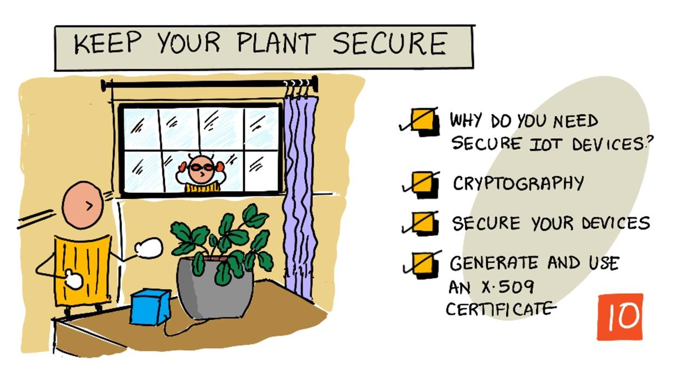
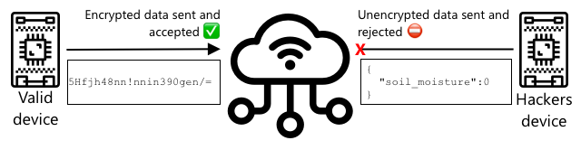

<!--
CO_OP_TRANSLATOR_METADATA:
{
  "original_hash": "81c437c568eee1b0dda1f04e88150d37",
  "translation_date": "2025-08-27T23:03:17+00:00",
  "source_file": "2-farm/lessons/6-keep-your-plant-secure/README.md",
  "language_code": "sw"
}
-->
# Linda mmea wako dhidi ya hatari



> Sketchnote na [Nitya Narasimhan](https://github.com/nitya). Bofya picha kwa toleo kubwa zaidi.

## Maswali ya awali ya somo

[Maswali ya awali ya somo](https://black-meadow-040d15503.1.azurestaticapps.net/quiz/19)

## Utangulizi

Katika masomo ya awali, umeunda kifaa cha IoT cha kufuatilia unyevu wa udongo na kukiunganisha na wingu. Lakini vipi ikiwa wadukuzi wanaofanya kazi kwa mkulima mpinzani watafanikiwa kudhibiti vifaa vyako vya IoT? Vipi ikiwa watatuma data ya unyevu wa udongo isiyo sahihi ili mimea yako isipate maji, au kuwasha mfumo wako wa kumwagilia maji kila wakati, na kusababisha mimea yako kufa kwa maji mengi huku ukipoteza pesa nyingi kwa gharama ya maji?

Katika somo hili, utajifunza jinsi ya kulinda vifaa vya IoT. Kwa kuwa hili ni somo la mwisho kwa mradi huu, pia utajifunza jinsi ya kusafisha rasilimali zako za wingu, kupunguza gharama zozote zinazoweza kutokea.

Katika somo hili tutashughulikia:

* [Kwa nini unahitaji kulinda vifaa vya IoT?](../../../../../2-farm/lessons/6-keep-your-plant-secure)
* [Kriptografia](../../../../../2-farm/lessons/6-keep-your-plant-secure)
* [Linda vifaa vyako vya IoT](../../../../../2-farm/lessons/6-keep-your-plant-secure)
* [Tengeneza na tumia cheti cha X.509](../../../../../2-farm/lessons/6-keep-your-plant-secure)

> 🗑 Hili ni somo la mwisho katika mradi huu, kwa hivyo baada ya kukamilisha somo hili na kazi, usisahau kusafisha huduma zako za wingu. Utahitaji huduma hizo kukamilisha kazi, kwa hivyo hakikisha unamaliza hiyo kwanza.
>
> Rejelea [mwongozo wa kusafisha mradi wako](../../../clean-up.md) ikiwa unahitaji maelekezo ya jinsi ya kufanya hivyo.

## Kwa nini unahitaji kulinda vifaa vya IoT?

Usalama wa IoT unahusisha kuhakikisha kuwa ni vifaa vilivyotarajiwa pekee vinavyoweza kuunganishwa na huduma yako ya wingu ya IoT na kutuma data, na ni huduma yako ya wingu pekee inayoweza kutuma amri kwa vifaa vyako. Data ya IoT inaweza pia kuwa ya kibinafsi, ikiwa ni pamoja na data ya matibabu au ya siri, kwa hivyo programu yako yote inahitaji kuzingatia usalama ili kuzuia data hii kuvuja.

Ikiwa programu yako ya IoT haina usalama, kuna hatari kadhaa:

* Kifaa bandia kinaweza kutuma data isiyo sahihi, na kusababisha programu yako kujibu vibaya. Kwa mfano, kinaweza kutuma data ya unyevu wa udongo ya juu kila wakati, na kusababisha mfumo wako wa kumwagilia maji usiwashwe na mimea yako kufa kwa ukosefu wa maji.
* Watumiaji wasioidhinishwa wanaweza kusoma data kutoka kwa vifaa vya IoT ikiwa ni pamoja na data ya kibinafsi au muhimu kwa biashara.
* Wadukuzi wanaweza kutuma amri za kudhibiti kifaa kwa njia ambayo inaweza kusababisha uharibifu kwa kifaa au vifaa vilivyounganishwa.
* Kwa kuunganishwa na kifaa cha IoT, wadukuzi wanaweza kutumia hii kupata mitandao ya ziada na kupata mifumo ya kibinafsi.
* Watumiaji wenye nia mbaya wanaweza kupata data ya kibinafsi na kuitumia kwa vitisho.

Hizi ni hali halisi za ulimwengu, na hutokea mara kwa mara. Baadhi ya mifano ilitolewa katika masomo ya awali, lakini hapa kuna mingine:

* Mnamo 2018, wadukuzi walitumia sehemu ya WiFi isiyo salama kwenye thermostat ya tanki la samaki kupata mtandao wa kasino na kuiba data. [The Hacker News - Casino Gets Hacked Through Its Internet-Connected Fish Tank Thermometer](https://thehackernews.com/2018/04/iot-hacking-thermometer.html)
* Mnamo 2016, Mirai Botnet ilizindua shambulio la kukataa huduma dhidi ya Dyn, mtoa huduma wa mtandao, na kusababisha sehemu kubwa za mtandao kushindwa kufanya kazi. Botnet hii ilitumia programu hasidi kuunganishwa na vifaa vya IoT kama DVRs na kamera zilizotumia majina ya mtumiaji na nywila za kawaida. [The Guardian - DDoS attack that disrupted internet was largest of its kind in history, experts say](https://www.theguardian.com/technology/2016/oct/26/ddos-attack-dyn-mirai-botnet)
* Spiral Toys ilikuwa na hifadhidata ya watumiaji wa vifaa vyao vya CloudPets iliyokuwa wazi kwa umma kwenye mtandao. [Troy Hunt - Data from connected CloudPets teddy bears leaked and ransomed, exposing kids' voice messages](https://www.troyhunt.com/data-from-connected-cloudpets-teddy-bears-leaked-and-ransomed-exposing-kids-voice-messages/).
* Strava ilionyesha njia za wakimbiaji, ikiruhusu watu wageni kuona mahali unapoishi. [Kim Komndo - Fitness app could lead a stranger right to your home — change this setting](https://www.komando.com/security-privacy/strava-fitness-app-privacy/755349/).

✅ Fanya utafiti: Tafuta mifano zaidi ya udukuzi wa IoT na uvujaji wa data ya IoT, hasa kwa vitu vya kibinafsi kama mswaki au mizani iliyounganishwa na mtandao. Fikiria athari za udukuzi huu kwa wahanga au wateja.

> 💁 Usalama ni mada kubwa, na somo hili litagusia tu baadhi ya misingi ya kuunganisha kifaa chako na wingu. Mada nyingine ambazo hazitashughulikiwa ni pamoja na ufuatiliaji wa mabadiliko ya data wakati wa usafirishaji, udukuzi wa vifaa moja kwa moja, au mabadiliko ya usanidi wa vifaa. Udukuzi wa IoT ni tishio kubwa, na zana kama [Azure Defender for IoT](https://azure.microsoft.com/services/azure-defender-for-iot/?WT.mc_id=academic-17441-jabenn) zimeundwa. Zana hizi ni sawa na programu za kuzuia virusi na usalama unazoweza kuwa nazo kwenye kompyuta yako, lakini zimetengenezwa kwa vifaa vidogo vya IoT vyenye nguvu ndogo.

## Kriptografia

Wakati kifaa kinaunganishwa na huduma ya IoT, kinatumia kitambulisho kutambua chenyewe. Tatizo ni kwamba kitambulisho hiki kinaweza kuigwa - mdukuzi anaweza kuunda kifaa cha uharibifu kinachotumia kitambulisho sawa na kifaa halisi lakini kinatuma data ya uongo.


Njia ya kuzuia hili ni kubadilisha data inayotumwa kuwa muundo usiosomeka, kwa kutumia thamani fulani inayojulikana tu na kifaa na wingu. Mchakato huu unaitwa *usimbaji fiche*, na thamani inayotumika kusimba data inaitwa *ufunguo wa usimbaji fiche*.



Huduma ya wingu inaweza kubadilisha data kuwa muundo unaosomeka tena, kwa kutumia mchakato unaoitwa *ufutaji fiche*, kwa kutumia ufunguo wa usimbaji fiche sawa, au *ufunguo wa ufutaji fiche*. Ikiwa ujumbe uliofichwa hauwezi kufutwa fiche na ufunguo, kifaa kimevamiwa na ujumbe unakataliwa.

Mbinu ya kufanya usimbaji fiche na ufutaji fiche inaitwa *kriptografia*.

### Kriptografia ya awali

Aina za kwanza za kriptografia zilikuwa mbinu za kubadilisha herufi, ambazo zilitumika zaidi ya miaka 3,500 iliyopita. Mbinu hizi zilihusisha kubadilisha herufi moja na nyingine. Kwa mfano, [Caesar cipher](https://wikipedia.org/wiki/Caesar_cipher) ilihusisha kusogeza alfabeti kwa idadi fulani ya nafasi, ambapo mtumaji wa ujumbe uliofichwa na mpokeaji waliokusudiwa pekee walijua idadi ya nafasi za kusogeza.

[Mbinu ya Vigenère cipher](https://wikipedia.org/wiki/Vigenère_cipher) ilichukua hatua zaidi kwa kutumia maneno kuficha maandishi, ili kila herufi katika maandishi ya awali isogezwe kwa idadi tofauti ya nafasi, badala ya kusogeza kwa idadi sawa kila wakati.

Kriptografia ilitumika kwa madhumuni mbalimbali, kama kulinda mapishi ya glasi ya mfinyanzi huko Mesopotamia ya kale, kuandika barua za mapenzi za siri nchini India, au kuweka uchawi wa Misri ya kale kuwa siri.

### Kriptografia ya kisasa

Kriptografia ya kisasa ni ya hali ya juu zaidi, na kufanya iwe vigumu kuvunjwa kuliko mbinu za awali. Kriptografia ya kisasa hutumia hesabu ngumu kusimba data kwa funguo nyingi sana zinazowezekana, na kufanya mashambulio ya nguvu ya moja kwa moja kuwa magumu.

Kriptografia hutumika kwa njia nyingi za mawasiliano salama. Ikiwa unasoma ukurasa huu kwenye GitHub, unaweza kugundua kuwa anwani ya tovuti inaanza na *HTTPS*, ikimaanisha kuwa mawasiliano kati ya kivinjari chako na seva za GitHub yamefichwa. Ikiwa mtu angeweza kusoma trafiki ya mtandao kati ya kivinjari chako na GitHub, hawangeweza kusoma data hiyo kwa kuwa imefichwa. Kompyuta yako inaweza hata kuficha data yote kwenye diski yake kuu ili ikiwa mtu ataiba, asiweze kusoma data yako bila nywila yako.

> 🎓 HTTPS inasimama kwa HyperText Transfer Protocol **Secure**

Kwa bahati mbaya, si kila kitu ni salama. Vifaa vingine havina usalama, vingine vinalindwa kwa funguo rahisi kuvunjwa, au wakati mwingine hata vifaa vyote vya aina moja vinatumia ufunguo sawa. Kumekuwa na matukio ya vifaa vya IoT vya kibinafsi sana ambavyo vyote vina nywila sawa ya kuunganishwa kupitia WiFi au Bluetooth. Ikiwa unaweza kuunganishwa na kifaa chako, unaweza kuunganishwa na kifaa cha mtu mwingine. Mara tu unapounganishwa, unaweza kufikia data ya kibinafsi sana, au kudhibiti kifaa chao.

> 💁 Licha ya ugumu wa kriptografia ya kisasa na madai kwamba kuvunja usimbaji fiche kunaweza kuchukua mabilioni ya miaka, kuibuka kwa kompyuta za quantum kumeleta uwezekano wa kuvunja usimbaji fiche wote unaojulikana kwa muda mfupi sana!

### Funguo za usimbaji fiche za symmetri na asymmetri

Usimbaji fiche unakuja kwa aina mbili - symmetri na asymmetri.

**Symmetri** hutumia ufunguo sawa kusimba na kufuta data. Mtumaji na mpokeaji wote wanahitaji kujua ufunguo sawa. Hii ni aina isiyo salama zaidi, kwa kuwa ufunguo unahitaji kushirikiwa kwa namna fulani. Ili mtumaji kutuma ujumbe uliofichwa kwa mpokeaji, mtumaji anaweza kwanza kuhitaji kutuma ufunguo kwa mpokeaji.


Ikiwa ufunguo utaibiwa wakati wa usafirishaji, au mtumaji au mpokeaji atavamiwa na ufunguo ukapatikana, usimbaji fiche unaweza kuvunjwa.


**Asymmetri** hutumia funguo 2 - ufunguo wa kusimba na ufunguo wa kufuta, unaojulikana kama jozi ya funguo ya umma/binafsi. Ufunguo wa umma hutumika kusimba ujumbe, lakini hauwezi kutumika kufuta, na ufunguo wa binafsi hutumika kufuta ujumbe lakini hauwezi kutumika kusimba.


Mpokeaji hushiriki ufunguo wake wa umma, na mtumaji hutumia huu kusimba ujumbe. Mara tu ujumbe unapotumwa, mpokeaji hufuta kwa kutumia ufunguo wake wa binafsi. Usimbaji fiche wa asymmetri ni salama zaidi kwa kuwa ufunguo wa binafsi unahifadhiwa na mpokeaji na haujawahi kushirikiwa. Mtu yeyote anaweza kuwa na ufunguo wa umma kwa kuwa unaweza kutumika tu kusimba ujumbe.

Usimbaji fiche wa symmetri ni wa haraka zaidi kuliko wa asymmetri, lakini wa asymmetri ni salama zaidi. Mifumo mingine itatumia zote mbili - kutumia usimbaji fiche wa asymmetri kusimba na kushiriki ufunguo wa symmetri, kisha kutumia ufunguo wa symmetri kusimba data yote. Hii inafanya iwe salama zaidi kushiriki ufunguo wa symmetri kati ya mtumaji na mpokeaji, na haraka wakati wa kusimba na kufuta data.

## Linda vifaa vyako vya IoT

Vifaa vya IoT vinaweza kulindwa kwa kutumia usimbaji fiche wa symmetri au asymmetri. Symmetri ni rahisi, lakini si salama sana.

### Funguo za symmetri

Wakati uliweka kifaa chako cha IoT kuingiliana na IoT Hub, ulitumia mnyororo wa muunganisho. Mfano wa mnyororo wa muunganisho ni:

```output
HostName=soil-moisture-sensor.azure-devices.net;DeviceId=soil-moisture-sensor;SharedAccessKey=Bhry+ind7kKEIDxubK61RiEHHRTrPl7HUow8cEm/mU0=
```

Mnyororo huu wa muunganisho unajumuisha sehemu tatu zilizotenganishwa na semi-colons, ambapo kila sehemu ni ufunguo na thamani:

| Ufunguo | Thamani | Maelezo |
| --- | ----- | ----------- |
| HostName | `soil-moisture-sensor.azure-devices.net` | URL ya IoT Hub |
| DeviceId | `soil-moisture-sensor` | Kitambulisho cha kipekee cha kifaa |
| SharedAccessKey | `Bhry+ind7kKEIDxubK61RiEHHRTrPl7HUow8cEm/mU0=` | Ufunguo wa symmetri unaojulikana na kifaa na IoT Hub |

Sehemu ya mwisho ya mnyororo huu wa muunganisho, `SharedAccessKey`, ni ufunguo wa symmetri unaojulikana na kifaa na IoT Hub. Ufunguo huu haujawahi kutumwa kutoka kwa kifaa kwenda kwa wingu, au kutoka kwa wingu kwenda kwa kifaa. Badala yake, hutumika kusimba data inayotumwa au kupokelewa.

✅ Fanya jaribio. Unadhani nini kitatokea ikiwa utabadilisha sehemu ya `SharedAccessKey` ya mnyororo wa muunganisho wakati wa kuunganisha kifaa chako cha IoT? Jaribu.

Wakati kifaa kinajaribu kuunganishwa kwa mara ya kwanza, kinatuma tokeni ya ufikiaji wa pamoja (SAS) inayojumuisha URL ya IoT Hub, muda wa kumalizika kwa tokeni ya ufikiaji (kawaida ni siku 1 kutoka wakati wa sasa), na saini. Saini hii inajumuisha URL na muda wa kumalizika muda wake uliosimbwa kwa ufunguo wa ufikiaji wa pamoja kutoka kwa mnyororo wa muunganisho.

IoT Hub hufuta saini hii kwa ufunguo wa ufikiaji wa pamoja, na ikiwa thamani iliyofutwa inalingana na URL na muda wa kumalizika, kifaa kinaruhusiwa kuunganishwa. Pia inathibitisha kuwa wakati wa sasa ni kabla ya muda wa kumalizika, ili kuzuia kifaa cha uharibifu kukamata tokeni ya SAS ya kifaa halisi na kuitumia.

Hii ni njia nzuri ya kuthibitisha kuwa mtumaji ni kifaa sahihi. Kwa kutuma data inayojulikana katika muundo wa wazi na uliofichwa, seva inaweza kuthibitisha kifaa kwa kuhakikisha kuwa inapofuta data iliyofichwa, matokeo yanalingana na toleo la wazi lililotumwa. Ikiwa inalingana, basi mtumaji na mpokeaji wana ufunguo sawa wa usimbaji fiche wa symmetri.
💁 Kwa sababu ya muda wa kuisha, kifaa chako cha IoT kinahitaji kujua muda sahihi, ambao kwa kawaida husomwa kutoka kwa [NTP](https://wikipedia.org/wiki/Network_Time_Protocol) server. Ikiwa muda si sahihi, muunganisho utashindwa.
Baada ya muunganisho, data zote zinazotumwa kwa IoT Hub kutoka kwa kifaa, au kwa kifaa kutoka kwa IoT Hub, zitakuwa zimefichwa kwa kutumia ufunguo wa ufikiaji wa pamoja.

✅ Unadhani nini kitatokea ikiwa vifaa vingi vitatumia mnyororo wa muunganisho mmoja?

> 💁 Ni tabia mbaya ya usalama kuhifadhi ufunguo huu kwenye msimbo. Ikiwa mdukuzi atapata msimbo wako wa chanzo, anaweza kupata ufunguo wako. Pia ni ngumu zaidi wakati wa kutoa msimbo kwani utahitaji kuandaa upya msimbo kwa kila kifaa na ufunguo uliosasishwa. Ni bora kupakia ufunguo huu kutoka kwa moduli ya usalama wa vifaa - chipu kwenye kifaa cha IoT inayohifadhi thamani zilizofichwa ambazo zinaweza kusomwa na msimbo wako.
>
> Wakati wa kujifunza IoT mara nyingi ni rahisi kuweka ufunguo kwenye msimbo, kama ulivyofanya katika somo la awali, lakini lazima uhakikishe kuwa ufunguo huu haujawekwa kwenye udhibiti wa msimbo wa chanzo wa umma.

Vifaa vina funguo 2, na mnyororo wa muunganisho unaolingana 2. Hii inaruhusu kuzungusha funguo - yaani kubadilisha kutoka kwa ufunguo mmoja hadi mwingine ikiwa wa kwanza utaharibika, na kuunda upya ufunguo wa kwanza.

### Vyeti vya X.509

Unapotumia usimbaji fiche usio wa kawaida na jozi ya funguo ya umma/binafsi, unahitaji kutoa ufunguo wako wa umma kwa yeyote anayependa kukutumia data. Tatizo ni, mpokeaji wa ufunguo wako anawezaje kuwa na uhakika kuwa ni ufunguo wako wa umma, si wa mtu mwingine anayejifanya kuwa wewe? Badala ya kutoa ufunguo, unaweza badala yake kutoa ufunguo wako wa umma ndani ya cheti ambacho kimehakikishwa na mhusika wa tatu anayeaminika, kinachoitwa cheti cha X.509.

Vyeti vya X.509 ni hati za kidijitali zinazojumuisha sehemu ya ufunguo wa umma wa jozi ya funguo ya umma/binafsi. Kwa kawaida hutolewa na mojawapo ya mashirika yanayoaminika yanayoitwa [Mamlaka ya Vyeti](https://wikipedia.org/wiki/Certificate_authority) (CAs), na kusainiwa kidijitali na CA kuonyesha kuwa ufunguo ni halali na unatoka kwako. Unakiamini cheti na kwamba ufunguo wa umma unatoka kwa yule cheti kinavyosema unatoka, kwa sababu unakiamini CA, sawa na jinsi unavyoweza kuamini pasipoti au leseni ya kuendesha gari kwa sababu unakiamini nchi inayotoa. Vyeti vinagharimu pesa, kwa hivyo unaweza pia 'kujitia saini mwenyewe', yaani kuunda cheti mwenyewe ambacho kimesainiwa na wewe, kwa madhumuni ya majaribio.

> 💁 Usitumie cheti kilichosainiwa mwenyewe kwa toleo la uzalishaji.

Vyeti hivi vina sehemu kadhaa ndani yake, ikiwa ni pamoja na ni nani ufunguo wa umma unatoka, maelezo ya CA iliyotoa, muda wa uhalali wake, na ufunguo wa umma wenyewe. Kabla ya kutumia cheti, ni tabia nzuri kuhakiki kwa kuangalia kuwa kimesainiwa na CA ya awali.

✅ Unaweza kusoma orodha kamili ya sehemu za cheti katika [Mafunzo ya Microsoft ya Kuelewa Vyeti vya Funguo vya Umma vya X.509](https://docs.microsoft.com/azure/iot-hub/tutorial-x509-certificates?WT.mc_id=academic-17441-jabenn#certificate-fields)

Unapotumia vyeti vya X.509, mtumaji na mpokeaji wote watakuwa na funguo zao za umma na binafsi, pamoja na vyeti vya X.509 vinavyobeba funguo za umma. Kisha wanabadilishana vyeti vya X.509 kwa namna fulani, wakitumia funguo za umma za kila mmoja kuficha data wanayotuma, na funguo zao binafsi kufungua data wanayopokea.


Faida kubwa ya kutumia vyeti vya X.509 ni kwamba vinaweza kushirikiwa kati ya vifaa. Unaweza kuunda cheti kimoja, kukipakia kwenye IoT Hub, na kutumia hiki kwa vifaa vyote vyako. Kila kifaa kinahitaji tu kujua ufunguo binafsi kufungua ujumbe kinachopokea kutoka IoT Hub.

Cheti kinachotumiwa na kifaa chako kuficha ujumbe kinachotuma kwa IoT Hub kinachapishwa na Microsoft. Ni cheti sawa ambacho huduma nyingi za Azure zinatumia, na mara nyingine kimejengwa ndani ya SDKs.

> 💁 Kumbuka, ufunguo wa umma ni wa umma tu - wa Azure unaweza kutumika tu kuficha data inayotumwa kwa Azure, si kufungua, kwa hivyo unaweza kushirikiwa kila mahali, ikiwa ni pamoja na kwenye msimbo wa chanzo. Kwa mfano, unaweza kuiona kwenye [Msimbo wa Chanzo wa Azure IoT C SDK](https://github.com/Azure/azure-iot-sdk-c/blob/master/certs/certs.c).

✅ Kuna msamiati mwingi na vyeti vya X.509. Unaweza kusoma maana ya baadhi ya maneno unayoweza kukutana nayo katika [Mwongozo wa Layman wa Msamiati wa Vyeti vya X.509](https://techcommunity.microsoft.com/t5/internet-of-things/the-layman-s-guide-to-x-509-certificate-jargon/ba-p/2203540?WT.mc_id=academic-17441-jabenn)

## Tengeneza na tumia cheti cha X.509

Hatua za kutengeneza cheti cha X.509 ni:

1. Tengeneza jozi ya funguo ya umma/binafsi. Mojawapo ya algorithmi zinazotumika sana kutengeneza jozi ya funguo ya umma/binafsi inaitwa [Rivest–Shamir–Adleman](https://wikipedia.org/wiki/RSA_(cryptosystem))(RSA).

1. Wasilisha ufunguo wa umma na data inayohusiana kwa kusainiwa, ama na CA, au kwa kujitia saini mwenyewe.

Azure CLI ina amri za kutengeneza utambulisho mpya wa kifaa katika IoT Hub, na kutengeneza moja kwa moja jozi ya funguo ya umma/binafsi na cheti kilichosainiwa mwenyewe.

> 💁 Ikiwa unataka kuona hatua kwa undani, badala ya kutumia Azure CLI, unaweza kuipata katika [Mafunzo ya Kutumia OpenSSL kutengeneza vyeti vilivyosainiwa mwenyewe katika nyaraka za Microsoft IoT Hub](https://docs.microsoft.com/azure/iot-hub/tutorial-x509-self-sign?WT.mc_id=academic-17441-jabenn)

### Kazi - tengeneza utambulisho wa kifaa kwa kutumia cheti cha X.509

1. Endesha amri ifuatayo kusajili utambulisho mpya wa kifaa, ukitengeneza moja kwa moja funguo na vyeti:

    ```sh
    az iot hub device-identity create --device-id soil-moisture-sensor-x509 \
                                      --am x509_thumbprint \
                                      --output-dir . \
                                      --hub-name <hub_name>
    ```

    Badilisha `<hub_name>` na jina ulilotumia kwa IoT Hub yako.

    Hii itatengeneza kifaa chenye ID ya `soil-moisture-sensor-x509` ili kutofautisha na utambulisho wa kifaa ulichotengeneza katika somo la mwisho. Amri hii pia itatengeneza faili 2 katika saraka ya sasa:

    * `soil-moisture-sensor-x509-key.pem` - faili hii ina ufunguo binafsi wa kifaa.
    * `soil-moisture-sensor-x509-cert.pem` - hii ni faili ya cheti cha X.509 cha kifaa.

    Weka faili hizi salama! Faili ya ufunguo binafsi haipaswi kuwekwa kwenye udhibiti wa msimbo wa chanzo wa umma.

### Kazi - tumia cheti cha X.509 katika msimbo wa kifaa chako

Fanya kazi kupitia mwongozo husika kuunganisha kifaa chako cha IoT na wingu kwa kutumia cheti cha X.509:

* [Arduino - Wio Terminal](wio-terminal-x509.md)
* [Kompyuta ya bodi moja - Raspberry Pi/Kifaa cha IoT cha Virtual](single-board-computer-x509.md)

---

## 🚀 Changamoto

Kuna njia nyingi za kutengeneza, kusimamia na kufuta huduma za Azure kama vile Vikundi vya Rasilimali na IoT Hubs. Njia moja ni [Azure Portal](https://portal.azure.com?WT.mc_id=academic-17441-jabenn) - kiolesura cha wavuti kinachokupa GUI ya kusimamia huduma zako za Azure.

Nenda kwenye [portal.azure.com](https://portal.azure.com?WT.mc_id=academic-17441-jabenn) na uchunguze portal. Angalia kama unaweza kutengeneza IoT Hub kwa kutumia portal, kisha uifute.

**Kidokezo** - unapotengeneza huduma kupitia portal, huhitaji kutengeneza Kikundi cha Rasilimali mapema, moja inaweza kutengenezwa wakati unapotengeneza huduma. Hakikisha unafuta baada ya kumaliza!

Unaweza kupata nyaraka nyingi, mafunzo na miongozo kuhusu Azure Portal katika [Nyaraka za Azure Portal](https://docs.microsoft.com/azure/azure-portal/?WT.mc_id=academic-17441-jabenn).

## Jaribio la baada ya somo

[Jaribio la baada ya somo](https://black-meadow-040d15503.1.azurestaticapps.net/quiz/20)

## Mapitio na Kujisomea

* Soma historia ya usimbaji fiche kwenye [Ukurasa wa Historia ya Usimbaji Fiche kwenye Wikipedia](https://wikipedia.org/wiki/History_of_cryptography).
* Soma kuhusu vyeti vya X.509 kwenye [Ukurasa wa X.509 kwenye Wikipedia](https://wikipedia.org/wiki/X.509).

## Kazi ya Nyumbani

[Tengeneza kifaa kipya cha IoT](assignment.md)

---

**Kanusho**:  
Hati hii imetafsiriwa kwa kutumia huduma ya kutafsiri ya AI [Co-op Translator](https://github.com/Azure/co-op-translator). Ingawa tunajitahidi kuhakikisha usahihi, tafadhali fahamu kuwa tafsiri za kiotomatiki zinaweza kuwa na makosa au kutokuwa sahihi. Hati ya asili katika lugha yake ya awali inapaswa kuzingatiwa kama chanzo cha mamlaka. Kwa taarifa muhimu, tafsiri ya kitaalamu ya binadamu inapendekezwa. Hatutawajibika kwa kutoelewana au tafsiri zisizo sahihi zinazotokana na matumizi ya tafsiri hii.