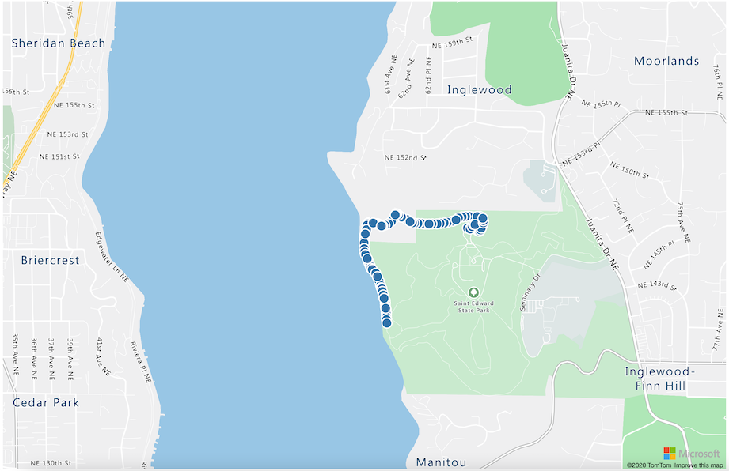

<!--
CO_OP_TRANSLATOR_METADATA:
{
  "original_hash": "9095c61445c2bca7245ef9b59a186a11",
  "translation_date": "2025-08-27T21:49:00+00:00",
  "source_file": "3-transport/lessons/3-visualize-location-data/README.md",
  "language_code": "sw"
}
-->
# Kuonyesha data ya eneo


> Sketchnote na [Nitya Narasimhan](https://github.com/nitya). Bofya picha kwa toleo kubwa zaidi.

Video hii inatoa muhtasari wa Azure Maps na IoT, huduma ambayo itajadiliwa katika somo hili.

[](https://www.youtube.com/watch?v=P5i2GFTtb2s)

> 🎥 Bofya picha hapo juu kutazama video

## Jaribio la awali la somo

[Jaribio la awali la somo](https://black-meadow-040d15503.1.azurestaticapps.net/quiz/25)

## Utangulizi

Katika somo lililopita ulijifunza jinsi ya kupata data ya GPS kutoka kwa sensa zako na kuihifadhi kwenye wingu katika kontena la kuhifadhi kwa kutumia msimbo usio na seva. Sasa utagundua jinsi ya kuonyesha alama hizo kwenye ramani ya Azure. Utajifunza jinsi ya kuunda ramani kwenye ukurasa wa wavuti, kujifunza kuhusu muundo wa data wa GeoJSON na jinsi ya kuutumia kuonyesha alama zote za GPS zilizokusanywa kwenye ramani yako.

Katika somo hili tutajadili:

* [Data visualization ni nini](../../../../../3-transport/lessons/3-visualize-location-data)
* [Huduma za ramani](../../../../../3-transport/lessons/3-visualize-location-data)
* [Kuunda rasilimali ya Azure Maps](../../../../../3-transport/lessons/3-visualize-location-data)
* [Kuonyesha ramani kwenye ukurasa wa wavuti](../../../../../3-transport/lessons/3-visualize-location-data)
* [Muundo wa GeoJSON](../../../../../3-transport/lessons/3-visualize-location-data)
* [Kuonyesha data ya GPS kwenye ramani kwa kutumia GeoJSON](../../../../../3-transport/lessons/3-visualize-location-data)

> 💁 Somo hili litahusisha kiasi kidogo cha HTML na JavaScript. Ikiwa ungependa kujifunza zaidi kuhusu maendeleo ya wavuti kwa kutumia HTML na JavaScript, angalia [Maendeleo ya wavuti kwa wanaoanza](https://github.com/microsoft/Web-Dev-For-Beginners).

## Data visualization ni nini

Data visualization, kama jina linavyopendekeza, ni kuhusu kuonyesha data kwa njia zinazofanya iwe rahisi kwa binadamu kuelewa. Kwa kawaida inahusishwa na chati na grafu, lakini ni njia yoyote ya kuwakilisha data kwa picha ili kusaidia binadamu sio tu kuelewa data vizuri, bali pia kufanya maamuzi.

Kwa mfano rahisi - katika mradi wa shamba ulirekodi vipimo vya unyevu wa udongo. Jedwali la data ya unyevu wa udongo iliyorekodiwa kila saa kwa tarehe 1 Juni 2021 linaweza kuwa kama ifuatavyo:

| Tarehe           | Usomaji |
| ---------------- | ------: |
| 01/06/2021 00:00 |     257 |
| 01/06/2021 01:00 |     268 |
| 01/06/2021 02:00 |     295 |
| 01/06/2021 03:00 |     305 |
| 01/06/2021 04:00 |     325 |
| 01/06/2021 05:00 |     359 |
| 01/06/2021 06:00 |     398 |
| 01/06/2021 07:00 |     410 |
| 01/06/2021 08:00 |     429 |
| 01/06/2021 09:00 |     451 |
| 01/06/2021 10:00 |     460 |
| 01/06/2021 11:00 |     452 |
| 01/06/2021 12:00 |     420 |
| 01/06/2021 13:00 |     408 |
| 01/06/2021 14:00 |     431 |
| 01/06/2021 15:00 |     462 |
| 01/06/2021 16:00 |     432 |
| 01/06/2021 17:00 |     402 |
| 01/06/2021 18:00 |     387 |
| 01/06/2021 19:00 |     360 |
| 01/06/2021 20:00 |     358 |
| 01/06/2021 21:00 |     354 |
| 01/06/2021 22:00 |     356 |
| 01/06/2021 23:00 |     362 |

Kwa binadamu, kuelewa data hiyo inaweza kuwa ngumu. Ni ukuta wa namba bila maana yoyote. Kama hatua ya kwanza ya kuonyesha data hii, inaweza kuchorwa kwenye chati ya mstari:


Hii inaweza kuboreshwa zaidi kwa kuongeza mstari unaoonyesha wakati mfumo wa kumwagilia kiotomatiki ulipoanzishwa kwenye usomaji wa unyevu wa udongo wa 450:


Chati hii inaonyesha haraka sio tu viwango vya unyevu wa udongo vilivyokuwa, lakini pia alama ambapo mfumo wa kumwagilia ulianzishwa.

Chati sio zana pekee ya kuonyesha data. Vifaa vya IoT vinavyofuatilia hali ya hewa vinaweza kuwa na programu za wavuti au simu zinazowakilisha hali ya hewa kwa kutumia alama, kama alama ya wingu kwa siku za mawingu, wingu la mvua kwa siku za mvua na kadhalika. Kuna njia nyingi za kuonyesha data, nyingi zikiwa za kitaalamu, nyingine za kufurahisha.

✅ Fikiria kuhusu njia ambazo umewahi kuona data ikionyeshwa. Ni njia zipi zilikuwa wazi zaidi na zilikuruhusu kufanya maamuzi haraka zaidi?

Uwakilishi bora wa data unaruhusu binadamu kufanya maamuzi haraka. Kwa mfano, kuwa na ukuta wa vipimo vinavyoonyesha kila aina ya usomaji kutoka kwa mashine za viwandani ni ngumu kuchakata, lakini taa nyekundu inayowaka wakati kitu kinakwenda vibaya inaruhusu binadamu kufanya uamuzi. Wakati mwingine uwakilishi bora wa data ni taa inayowaka!

Unapofanya kazi na data ya GPS, uwakilishi wa wazi zaidi unaweza kuwa kuonyesha data hiyo kwenye ramani. Ramani inayoonyesha malori ya usafirishaji kwa mfano, inaweza kusaidia wafanyakazi katika kiwanda cha usindikaji kuona wakati malori yatakapofika. Ikiwa ramani hii inaonyesha zaidi ya picha za malori katika maeneo yao ya sasa, lakini inatoa wazo la yaliyomo ndani ya lori, basi wafanyakazi katika kiwanda wanaweza kupanga ipasavyo - ikiwa wanaona lori la friji liko karibu wanajua kuandaa nafasi kwenye friji.

## Huduma za ramani

Kufanya kazi na ramani ni zoezi la kuvutia, na kuna nyingi za kuchagua kama Bing Maps, Leaflet, Open Street Maps, na Google Maps. Katika somo hili, utajifunza kuhusu [Azure Maps](https://azure.microsoft.com/services/azure-maps/?WT.mc_id=academic-17441-jabenn) na jinsi zinavyoweza kuonyesha data yako ya GPS.


Azure Maps ni "mkusanyiko wa huduma za kijiografia na SDK zinazotumia data mpya ya ramani kutoa muktadha wa kijiografia kwa programu za wavuti na simu." Watengenezaji wanapewa zana za kuunda ramani nzuri, za kuingiliana ambazo zinaweza kufanya mambo kama kutoa njia za trafiki zilizopendekezwa, kutoa taarifa kuhusu matukio ya trafiki, urambazaji wa ndani, uwezo wa kutafuta, taarifa za mwinuko, huduma za hali ya hewa na zaidi.

✅ Jaribu baadhi ya [mifano ya msimbo wa ramani](https://docs.microsoft.com/samples/browse?WT.mc_id=academic-17441-jabenn&products=azure-maps)

Unaweza kuonyesha ramani kama turubai tupu, vigae, picha za setilaiti, picha za setilaiti na barabara zilizowekwa juu, aina mbalimbali za ramani za kijivu, ramani zilizo na kivuli cha mwinuko, ramani za mtazamo wa usiku, na ramani ya mwonekano wa juu. Unaweza kupata masasisho ya wakati halisi kwenye ramani zako kwa kuzichanganya na [Azure Event Grid](https://azure.microsoft.com/services/event-grid/?WT.mc_id=academic-17441-jabenn). Unaweza kudhibiti tabia na mwonekano wa ramani zako kwa kuwezesha vidhibiti mbalimbali kuruhusu ramani kuguswa na matukio kama kubana, kuvuta, na kubofya. Ili kudhibiti mwonekano wa ramani yako, unaweza kuongeza tabaka zinazojumuisha viputo, mistari, poligoni, ramani za joto, na zaidi. Ni mtindo gani wa ramani unayotekeleza inategemea chaguo lako la SDK.

Unaweza kufikia API za Azure Maps kwa kutumia [REST API](https://docs.microsoft.com/javascript/api/azure-maps-rest/?WT.mc_id=academic-17441-jabenn&view=azure-maps-typescript-latest), [Web SDK](https://docs.microsoft.com/azure/azure-maps/how-to-use-map-control?WT.mc_id=academic-17441-jabenn), au, ikiwa unajenga programu ya simu, [Android SDK](https://docs.microsoft.com/azure/azure-maps/how-to-use-android-map-control-library?WT.mc_id=academic-17441-jabenn&pivots=programming-language-java-android).

Katika somo hili, utatumia Web SDK kuchora ramani na kuonyesha njia ya eneo la GPS la sensa yako.

## Kuunda rasilimali ya Azure Maps

Hatua yako ya kwanza ni kuunda akaunti ya Azure Maps.

### Kazi - kuunda rasilimali ya Azure Maps

1. Endesha amri ifuatayo kutoka kwa Terminal au Command Prompt kuunda rasilimali ya Azure Maps katika kikundi chako cha rasilimali `gps-sensor`:

    ```sh
    az maps account create --name gps-sensor \
                           --resource-group gps-sensor \
                           --accept-tos \
                           --sku S1
    ```

    Hii itaunda rasilimali ya Azure Maps inayoitwa `gps-sensor`. Kiwango kinachotumika ni `S1`, ambacho ni kiwango cha kulipia kinachojumuisha vipengele mbalimbali, lakini kwa idadi kubwa ya miito bila malipo.

    > 💁 Ili kuona gharama ya kutumia Azure Maps, angalia [ukurasa wa bei wa Azure Maps](https://azure.microsoft.com/pricing/details/azure-maps/?WT.mc_id=academic-17441-jabenn).

1. Utahitaji funguo ya API kwa rasilimali ya ramani. Tumia amri ifuatayo kupata funguo hii:

    ```sh
    az maps account keys list --name gps-sensor \
                              --resource-group gps-sensor \
                              --output table
    ```

    Chukua nakala ya thamani ya `PrimaryKey`.

## Kuonyesha ramani kwenye ukurasa wa wavuti

Sasa unaweza kuchukua hatua inayofuata ambayo ni kuonyesha ramani yako kwenye ukurasa wa wavuti. Tutatumia faili moja tu ya `html` kwa programu yako ndogo ya wavuti; kumbuka kwamba katika mazingira ya uzalishaji au timu, programu yako ya wavuti itakuwa na sehemu nyingi zaidi zinazohusika!

### Kazi - kuonyesha ramani kwenye ukurasa wa wavuti

1. Unda faili inayoitwa index.html katika folda mahali fulani kwenye kompyuta yako ya ndani. Ongeza markup ya HTML kushikilia ramani:

    ```html
    <html>
    <head>
        <style>
            #myMap {
                width:100%;
                height:100%;
            }
        </style>
    </head>
    
    <body onload="init()">
        <div id="myMap"></div>
    </body>
    </html>
    ```

    Ramani itapakia katika `div` ya `myMap`. Mitindo michache inaruhusu iweze kufunika upana na urefu wa ukurasa.

    > 🎓 `div` ni sehemu ya ukurasa wa wavuti ambayo inaweza kupewa jina na kupangwa.

1. Chini ya tagi ya kufungua `<head>`, ongeza karatasi ya mitindo ya nje kudhibiti mwonekano wa ramani, na script ya nje kutoka Web SDK kudhibiti tabia yake:

    ```html
    <link rel="stylesheet" href="https://atlas.microsoft.com/sdk/javascript/mapcontrol/2/atlas.min.css" type="text/css" />
    <script src="https://atlas.microsoft.com/sdk/javascript/mapcontrol/2/atlas.min.js"></script>
    ```

    Karatasi hii ya mitindo ina mipangilio ya jinsi ramani inavyoonekana, na faili ya script ina msimbo wa kupakia ramani. Kuongeza msimbo huu ni sawa na kujumuisha faili za kichwa za C++ au kuingiza moduli za Python.

1. Chini ya script hiyo, ongeza block ya script kuzindua ramani.

    ```javascript
    <script type='text/javascript'>
        function init() {
            var map = new atlas.Map('myMap', {
                center: [-122.26473, 47.73444],
                zoom: 12,
                authOptions: {
                    authType: "subscriptionKey",
                    subscriptionKey: "<subscription_key>",

                }
            });
        }
    </script>
    ```

    Badilisha `<subscription_key>` na funguo ya API ya akaunti yako ya Azure Maps.

    Ikiwa utafungua faili yako ya `index.html` kwenye kivinjari cha wavuti, unapaswa kuona ramani ikipakiwa, na ikilenga eneo la Seattle.

    

    ✅ Jaribu vigezo vya zoom na center kubadilisha mwonekano wa ramani yako. Unaweza kuongeza viwianishi tofauti vinavyolingana na latitudo na longitudo ya data yako ili kuhamisha ramani.

> 💁 Njia bora ya kufanya kazi na programu za wavuti kwa ndani ni kusakinisha [http-server](https://www.npmjs.com/package/http-server). Utahitaji [node.js](https://nodejs.org/) na [npm](https://www.npmjs.com/) kusakinishwa kabla ya kutumia zana hii. Mara baada ya zana hizo kusakinishwa, unaweza kwenda kwenye eneo la faili yako ya `index.html` na kuandika `http-server`. Programu ya wavuti itafunguka kwenye seva ya wavuti ya ndani [http://127.0.0.1:8080/](http://127.0.0.1:8080/).

## Muundo wa GeoJSON

Sasa kwa kuwa programu yako ya wavuti iko tayari na ramani inaonyeshwa, unahitaji kutoa data ya GPS kutoka kwa akaunti yako ya kuhifadhi na kuionyesha katika tabaka la alama juu ya ramani. Kabla ya kufanya hivyo, hebu tuangalie muundo wa [GeoJSON](https://wikipedia.org/wiki/GeoJSON) unaohitajika na Azure Maps.

[GeoJSON](https://geojson.org/) ni kiwango cha wazi cha JSON kilicho na muundo maalum ulioundwa kushughulikia data maalum ya kijiografia. Unaweza kujifunza kuhusu GeoJSON kwa kujaribu data ya sampuli kwa kutumia [geojson.io](https://geojson.io), ambayo pia ni zana muhimu ya kutatua matatizo ya faili za GeoJSON.

Data ya sampuli ya GeoJSON inaonekana kama hii:

```json
{
  "type": "FeatureCollection",
  "features": [
    {
      "type": "Feature",
      "geometry": {
        "type": "Point",
        "coordinates": [
          -2.10237979888916,
          57.164918677004714
        ]
      }
    }
  ]
}
```

Kinachovutia zaidi ni jinsi data inavyopangwa kama `Feature` ndani ya `FeatureCollection`. Ndani ya kitu hicho kuna `geometry` na `coordinates` zinazoonyesha latitudo na longitudo.

✅ Unapojenga GeoJSON yako, zingatia mpangilio wa `latitude` na `longitude` katika kitu, au alama zako hazitaonekana mahali zinapopaswa! GeoJSON inatarajia data katika mpangilio wa `lon,lat` kwa alama, sio `lat,lon`.

`Geometry` inaweza kuwa na aina tofauti, kama alama moja au poligoni. Katika mfano huu, ni alama yenye viwianishi viwili vilivyobainishwa, longitudo, na latitudo.
✅ Azure Maps inaunga mkono GeoJSON ya kawaida pamoja na baadhi ya [vipengele vilivyoboreshwa](https://docs.microsoft.com/azure/azure-maps/extend-geojson?WT.mc_id=academic-17441-jabenn) ikiwa ni pamoja na uwezo wa kuchora miduara na maumbo mengine ya kijiometri.

## Onyesha data ya GPS kwenye Ramani kwa kutumia GeoJSON

Sasa uko tayari kutumia data kutoka kwenye hifadhi uliyotengeneza katika somo lililopita. Kama ukumbusho, data hiyo imehifadhiwa kama faili kadhaa kwenye hifadhi ya blob, kwa hivyo utahitaji kufikia faili hizo na kuzichanganua ili Azure Maps iweze kutumia data hiyo.

### Kazi - sanidi hifadhi ili ipatikane kutoka kwenye ukurasa wa wavuti

Ukifanya ombi kwa hifadhi yako ili kufikia data, unaweza kushangaa kuona makosa yakitokea kwenye console ya kivinjari chako. Hii ni kwa sababu unahitaji kuweka ruhusa za [CORS](https://developer.mozilla.org/docs/Web/HTTP/CORS) kwenye hifadhi hii ili kuruhusu programu za wavuti za nje kusoma data yake.

> 🎓 CORS inasimama kwa "Cross-Origin Resource Sharing" na mara nyingi inahitaji kuwekwa wazi katika Azure kwa sababu za usalama. Inazuia tovuti ambazo haujatarajia kufikia data yako.

1. Endesha amri ifuatayo ili kuwezesha CORS:

    ```sh
    az storage cors add --methods GET \
                        --origins "*" \
                        --services b \
                        --account-name <storage_name> \
                        --account-key <key1>
    ```

    Badilisha `<storage_name>` na jina la akaunti yako ya hifadhi. Badilisha `<key1>` na ufunguo wa akaunti ya hifadhi yako.

    Amri hii inaruhusu tovuti yoyote (alama ya nyota `*` inamaanisha yoyote) kufanya ombi la *GET*, yaani kupata data, kutoka kwenye akaunti yako ya hifadhi. `--services b` inamaanisha tumia mpangilio huu tu kwa blobs.

### Kazi - pakia data ya GPS kutoka hifadhi

1. Badilisha maudhui yote ya kazi ya `init` na msimbo ufuatao:

    ```javascript
    fetch("https://<storage_name>.blob.core.windows.net/gps-data/?restype=container&comp=list")
        .then(response => response.text())
        .then(str => new window.DOMParser().parseFromString(str, "text/xml"))
        .then(xml => {
            let blobList = Array.from(xml.querySelectorAll("Url"));
                blobList.forEach(async blobUrl => {
                    loadJSON(blobUrl.innerHTML)                
        });
    })
    .then( response => {
        map = new atlas.Map('myMap', {
            center: [-122.26473, 47.73444],
            zoom: 14,
            authOptions: {
                authType: "subscriptionKey",
                subscriptionKey: "<subscription_key>",
    
            }
        });
        map.events.add('ready', function () {
            var source = new atlas.source.DataSource();
            map.sources.add(source);
            map.layers.add(new atlas.layer.BubbleLayer(source));
            source.add(features);
        })
    })
    ```

    Badilisha `<storage_name>` na jina la akaunti yako ya hifadhi. Badilisha `<subscription_key>` na ufunguo wa API wa akaunti yako ya Azure Maps.

    Kuna mambo kadhaa yanayotokea hapa. Kwanza, msimbo unachukua data yako ya GPS kutoka kwenye kontena la blob kwa kutumia URL iliyojengwa kwa kutumia jina la akaunti yako ya hifadhi. URL hii inachukua kutoka `gps-data`, ikionyesha aina ya rasilimali ni kontena (`restype=container`), na inaorodhesha taarifa kuhusu blobs zote. Orodha hii haitarudisha blobs zenyewe, lakini itarudisha URL kwa kila blob ambayo inaweza kutumika kupakia data ya blob.

    > 💁 Unaweza kuweka URL hii kwenye kivinjari chako ili kuona maelezo ya blobs zote kwenye kontena lako. Kila kipengele kitakuwa na mali ya `Url` ambayo unaweza pia kupakia kwenye kivinjari chako ili kuona maudhui ya blob.

    Msimbo huu kisha unapakia kila blob, ukipiga kazi ya `loadJSON`, ambayo itaundwa baadaye. Kisha inaunda udhibiti wa ramani, na inaongeza msimbo kwenye tukio la `ready`. Tukio hili linaitwa wakati ramani inaonyeshwa kwenye ukurasa wa wavuti.

    Tukio la ready linaunda chanzo cha data cha Azure Maps - kontena linalobeba data ya GeoJSON ambayo itajazwa baadaye. Chanzo cha data hiki kisha kinatumika kuunda safu ya bubbles - yaani seti ya miduara kwenye ramani iliyowekwa katikati ya kila nukta kwenye GeoJSON.

1. Ongeza kazi ya `loadJSON` kwenye sehemu ya script, chini ya kazi ya `init`:

    ```javascript
    var map, features;

    function loadJSON(file) {
        var xhr = new XMLHttpRequest();
        features = [];
        xhr.onreadystatechange = function () {
            if (xhr.readyState === XMLHttpRequest.DONE) {
                if (xhr.status === 200) {
                    gps = JSON.parse(xhr.responseText)
                    features.push(
                        new atlas.data.Feature(new atlas.data.Point([parseFloat(gps.gps.lon), parseFloat(gps.gps.lat)]))
                    )
                }
            }
        };
        xhr.open("GET", file, true);
        xhr.send();
    }    
    ```

    Kazi hii inaitwa na utaratibu wa fetch ili kuchanganua data ya JSON na kuibadilisha ili isomwe kama kuratibu za longitudo na latitudo kama geoJSON. 
    Baada ya kuchanganuliwa, data inakuwa sehemu ya kipengele cha geoJSON `Feature`. Ramani itaanzishwa na miduara midogo itaonekana kuzunguka njia ambayo data yako inaonyesha:

1. Pakia ukurasa wa HTML kwenye kivinjari chako. Utapakia ramani, kisha utapakia data yote ya GPS kutoka hifadhi na kuonyesha kwenye ramani.

    

> 💁 Unaweza kupata msimbo huu kwenye [code](../../../../../3-transport/lessons/3-visualize-location-data/code) folda.

---

## 🚀 Changamoto

Ni vizuri kuonyesha data tuli kwenye ramani kama alama. Je, unaweza kuboresha programu hii ya wavuti ili kuongeza uhuishaji na kuonyesha njia ya alama kwa muda, kwa kutumia faili za json zilizo na timestamp? Hapa kuna [baadhi ya mifano](https://azuremapscodesamples.azurewebsites.net/) ya kutumia uhuishaji ndani ya ramani.

## Maswali ya baada ya somo

[Maswali ya baada ya somo](https://black-meadow-040d15503.1.azurestaticapps.net/quiz/26)

## Mapitio na Kujifunza Mwenyewe

Azure Maps ni muhimu sana kwa kufanya kazi na vifaa vya IoT.

* Tafiti baadhi ya matumizi katika [Azure Maps documentation on Microsoft docs](https://docs.microsoft.com/azure/azure-maps/tutorial-iot-hub-maps?WT.mc_id=academic-17441-jabenn).
* Kuza ujuzi wako wa kutengeneza ramani na njia kwa kutumia [create your first route finding app with Azure Maps self-guided learning module on Microsoft Learn](https://docs.microsoft.com/learn/modules/create-your-first-app-with-azure-maps/?WT.mc_id=academic-17441-jabenn).

## Kazi

[Weka programu yako](assignment.md)

---

**Kanusho**:  
Hati hii imetafsiriwa kwa kutumia huduma ya kutafsiri ya AI [Co-op Translator](https://github.com/Azure/co-op-translator). Ingawa tunajitahidi kuhakikisha usahihi, tafadhali fahamu kuwa tafsiri za kiotomatiki zinaweza kuwa na makosa au kutokuwa sahihi. Hati ya asili katika lugha yake ya awali inapaswa kuzingatiwa kama chanzo cha mamlaka. Kwa taarifa muhimu, tafsiri ya kitaalamu ya binadamu inapendekezwa. Hatutawajibika kwa kutoelewana au tafsiri zisizo sahihi zinazotokana na matumizi ya tafsiri hii.