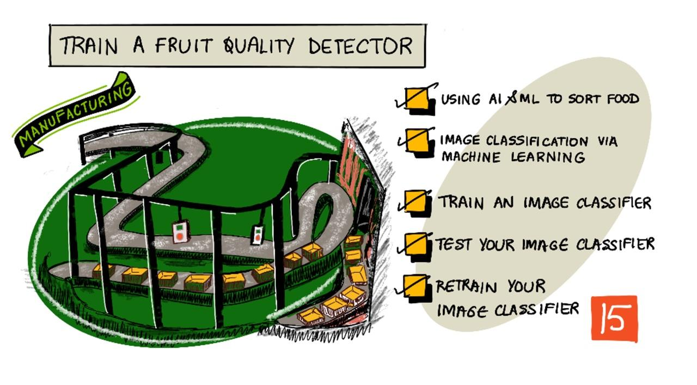

<!--
CO_OP_TRANSLATOR_METADATA:
{
  "original_hash": "f5e63c916d2dd97d58be12aaf76bd9f1",
  "translation_date": "2025-08-27T20:35:37+00:00",
  "source_file": "4-manufacturing/lessons/1-train-fruit-detector/README.md",
  "language_code": "sw"
}
-->
# Kufundisha Kifaa cha Kugundua Ubora wa Matunda



> Sketchnote na [Nitya Narasimhan](https://github.com/nitya). Bofya picha kwa toleo kubwa zaidi.

Video hii inatoa muhtasari wa huduma ya Azure Custom Vision, huduma ambayo itajadiliwa katika somo hili.

[](https://www.youtube.com/watch?v=TETcDLJlWR4)

> 🎥 Bofya picha hapo juu kutazama video

## Jaribio la kabla ya somo

[Jaribio la kabla ya somo](https://black-meadow-040d15503.1.azurestaticapps.net/quiz/29)

## Utangulizi

Kuongezeka kwa kasi kwa Akili Bandia (AI) na Kujifunza kwa Mashine (ML) kunatoa uwezo mkubwa kwa watengenezaji wa programu wa leo. Miundo ya ML inaweza kufundishwa kutambua vitu tofauti kwenye picha, ikiwa ni pamoja na matunda ambayo hayajakomaa, na hii inaweza kutumika kwenye vifaa vya IoT kusaidia kuchagua mazao wakati wa kuvuna au wakati wa usindikaji viwandani au maghalani.

Katika somo hili utajifunza kuhusu uainishaji wa picha - kutumia miundo ya ML kutofautisha kati ya picha za vitu tofauti. Utajifunza jinsi ya kufundisha kifaa cha uainishaji wa picha kutofautisha kati ya matunda mazuri na mabaya, ambayo hayajakoma, yameharibika, au yameoza.

Katika somo hili tutajadili:

* [Kutumia AI na ML kuchagua chakula](../../../../../4-manufacturing/lessons/1-train-fruit-detector)
* [Uainishaji wa picha kupitia Kujifunza kwa Mashine](../../../../../4-manufacturing/lessons/1-train-fruit-detector)
* [Kufundisha kifaa cha uainishaji wa picha](../../../../../4-manufacturing/lessons/1-train-fruit-detector)
* [Kujaribu kifaa chako cha uainishaji wa picha](../../../../../4-manufacturing/lessons/1-train-fruit-detector)
* [Kufundisha tena kifaa chako cha uainishaji wa picha](../../../../../4-manufacturing/lessons/1-train-fruit-detector)

## Kutumia AI na ML kuchagua chakula

Kulisha idadi ya watu duniani ni changamoto, hasa kwa gharama ambayo inafanya chakula kiwe nafuu kwa wote. Moja ya gharama kubwa zaidi ni kazi ya mikono, hivyo wakulima wanazidi kutumia teknolojia na zana kama IoT kupunguza gharama za kazi. Kuvuna kwa mkono ni kazi ngumu (na mara nyingi ni kazi inayochosha), na inabadilishwa na mashine, hasa katika mataifa tajiri. Licha ya akiba ya gharama ya kutumia mashine kuvuna, kuna changamoto - uwezo wa kuchagua chakula wakati wa kuvuna.

Sio mazao yote yanayokomaa kwa wakati mmoja. Kwa mfano, nyanya zinaweza kuwa na matunda ya kijani kwenye shina wakati mengine yamekomaa tayari. Ingawa ni hasara kuvuna haya mapema, ni rahisi na nafuu kwa mkulima kuvuna kila kitu kwa kutumia mashine na kutupa mazao ambayo hayajakoma baadaye.

✅ Angalia matunda au mboga tofauti, iwe yanakua karibu nawe shambani au bustanini, au kwenye maduka. Je, yote yamekomaa kwa kiwango sawa, au unaona tofauti?

Kuongezeka kwa uvunaji wa kiotomatiki kulihamisha kazi ya kuchagua mazao kutoka shambani hadi kiwandani. Chakula kingesafirishwa kwenye mikanda mirefu ya kusafirisha na timu za watu wakichagua mazao na kuondoa yale ambayo hayakufikia viwango vya ubora vinavyohitajika. Kuvuna kulikuwa nafuu kutokana na mashine, lakini bado kulikuwa na gharama ya kuchagua chakula kwa mikono.


Mageuzi yaliyofuata yalikuwa kutumia mashine kuchagua, ama ndani ya mashine ya kuvuna, au kwenye viwanda vya usindikaji. Kizazi cha kwanza cha mashine hizi kilitumia sensa za macho kutambua rangi, zikidhibiti vifaa vya kusukuma nyanya za kijani kwenye pipa la taka kwa kutumia lever au pigo la hewa, na kuacha nyanya nyekundu zikiendelea kwenye mtandao wa mikanda ya kusafirisha.

Katika video hii, nyanya zinapoanguka kutoka mkanda mmoja wa kusafirisha hadi mwingine, nyanya za kijani zinatambuliwa na kusukumwa kwenye pipa kwa kutumia lever.

✅ Ni hali gani unazohitaji kiwandani au shambani ili sensa hizi za macho zifanye kazi vizuri?

Mageuzi ya hivi karibuni ya mashine hizi za kuchagua yanatumia AI na ML, kwa kutumia miundo iliyofundishwa kutofautisha mazao mazuri na mabaya, sio tu kwa tofauti za wazi za rangi kama nyanya za kijani dhidi ya nyekundu, lakini pia kwa tofauti ndogo za mwonekano zinazoweza kuonyesha ugonjwa au majeraha.

## Uainishaji wa picha kupitia Kujifunza kwa Mashine

Programu za jadi ni pale unapochukua data, kutumia algorithimu kwenye data hiyo, na kupata matokeo. Kwa mfano, katika mradi uliopita ulitumia viwianishi vya GPS na geofence, ukatumia algorithimu iliyotolewa na Azure Maps, na ukapata matokeo ya kama sehemu hiyo ilikuwa ndani au nje ya geofence. Ukiingiza data zaidi, unapata matokeo zaidi.


Kujifunza kwa mashine kunabadilisha hili - unaanza na data na matokeo yanayojulikana, na algorithimu ya kujifunza kwa mashine inajifunza kutoka kwa data hiyo. Unaweza kisha kuchukua algorithimu hiyo iliyofundishwa, inayoitwa *mfano wa kujifunza kwa mashine* au *mfano*, na kuingiza data mpya na kupata matokeo mapya.

> 🎓 Mchakato wa algorithimu ya kujifunza kwa mashine kujifunza kutoka kwa data unaitwa *mafunzo*. Data ya kuingiza na matokeo yanayojulikana huitwa *data ya mafunzo*.

Kwa mfano, unaweza kumpa mfano mamilioni ya picha za ndizi ambazo hazijakomaa kama data ya mafunzo ya kuingiza, na matokeo ya mafunzo yakiwa `haijakomaa`, na mamilioni ya picha za ndizi zilizokomaa kama data ya mafunzo ya kuingiza na matokeo yakiwa `imekomaa`. Algorithimu ya ML kisha itaunda mfano kulingana na data hii. Kisha unampa mfano huu picha mpya ya ndizi na itatabiri kama picha mpya ni ya ndizi iliyokomaa au haijakomaa.

> 🎓 Matokeo ya miundo ya ML huitwa *utabiri*


Miundo ya ML haitoi jibu la moja kwa moja, badala yake inatoa uwezekano. Kwa mfano, mfano unaweza kupewa picha ya ndizi na kutabiri `imekomaa` kwa 99.7% na `haijakomaa` kwa 0.3%. Kisha msimbo wako utachagua utabiri bora na kuamua kuwa ndizi imekomaa.

Mfano wa ML unaotumika kutambua picha kama hizi unaitwa *kifaa cha uainishaji wa picha* - kinapewa picha zilizo na lebo, kisha kinatambua picha mpya kulingana na lebo hizi.

> 💁 Hii ni rahisi kuelewa, na kuna njia nyingine nyingi za kufundisha miundo ambayo haihitaji matokeo yaliyo na lebo, kama vile kujifunza bila usimamizi. Ikiwa unataka kujifunza zaidi kuhusu ML, angalia [ML kwa wanaoanza, mtaala wa masomo 24 kuhusu Kujifunza kwa Mashine](https://aka.ms/ML-beginners).

## Kufundisha kifaa cha uainishaji wa picha

Ili kufundisha kifaa cha uainishaji wa picha kwa mafanikio, unahitaji mamilioni ya picha. Hata hivyo, mara tu unapokuwa na kifaa cha uainishaji wa picha kilichofundishwa kwa mamilioni au mabilioni ya picha mbalimbali, unaweza kukitumia tena na kukifundisha tena kwa seti ndogo ya picha na kupata matokeo mazuri, kwa kutumia mchakato unaoitwa *kujifunza kwa uhamisho*.

> 🎓 Kujifunza kwa uhamisho ni pale unapohamisha maarifa kutoka kwa mfano wa ML uliopo kwenda kwa mfano mpya kulingana na data mpya.

Mara tu kifaa cha uainishaji wa picha kinapofundishwa kwa picha mbalimbali, sehemu zake za ndani ni nzuri katika kutambua maumbo, rangi, na mifumo. Kujifunza kwa uhamisho kunaruhusu mfano kutumia kile ambacho tayari kimejifunza katika kutambua sehemu za picha, na kutumia maarifa hayo kutambua picha mpya.


Unaweza kufikiria hili kama vitabu vya maumbo ya watoto, ambapo mara tu unapoweza kutambua nusu duara, mstatili, na pembetatu, unaweza kutambua mashua au paka kulingana na mpangilio wa maumbo haya. Kifaa cha uainishaji wa picha kinaweza kutambua maumbo, na kujifunza kwa uhamisho kunakifundisha mchanganyiko gani unafanya mashua au paka - au ndizi iliyokomaa.

Kuna zana mbalimbali zinazoweza kukusaidia kufanya hivi, ikiwa ni pamoja na huduma za wingu zinazoweza kukusaidia kufundisha mfano wako, kisha kuutumia kupitia API za wavuti.

> 💁 Kufundisha miundo hii kunahitaji nguvu kubwa ya kompyuta, mara nyingi kupitia Graphics Processing Units, au GPUs. Vifaa maalum vya maunzi vinavyofanya michezo kwenye Xbox yako ionekane vizuri pia vinaweza kutumika kufundisha miundo ya kujifunza kwa mashine. Kwa kutumia wingu, unaweza kukodisha muda kwenye kompyuta zenye nguvu na GPUs kufundisha miundo hii, ukipata nguvu ya kompyuta unayohitaji, kwa muda tu unaohitaji.

## Custom Vision

Custom Vision ni zana ya wingu kwa ajili ya kufundisha vifaa vya uainishaji wa picha. Inakuruhusu kufundisha kifaa cha uainishaji kwa kutumia idadi ndogo ya picha. Unaweza kupakia picha kupitia portal ya wavuti, API ya wavuti au SDK, ukitoa kila picha *lebo* inayowakilisha uainishaji wa picha hiyo. Kisha unafundisha mfano, na kuujaribu kuona jinsi unavyofanya kazi. Mara unapokuwa na uhakika na mfano huo, unaweza kuchapisha matoleo yake ambayo yanaweza kufikiwa kupitia API ya wavuti au SDK.


> 💁 Unaweza kufundisha mfano wa Custom Vision kwa picha 5 tu kwa kila uainishaji, lakini zaidi ni bora. Unaweza kupata matokeo bora zaidi ukiwa na angalau picha 30.

Custom Vision ni sehemu ya zana mbalimbali za AI kutoka Microsoft zinazoitwa Cognitive Services. Hizi ni zana za AI zinazoweza kutumika bila mafunzo yoyote, au kwa mafunzo kidogo. Zinajumuisha utambuzi wa sauti na tafsiri, uelewa wa lugha, na uchambuzi wa picha. Zinapatikana kwa kiwango cha bure kama huduma kwenye Azure.

> 💁 Kiwango cha bure kinatosha kuunda mfano, kuufundisha, kisha kuutumia kwa kazi za maendeleo. Unaweza kusoma kuhusu mipaka ya kiwango cha bure kwenye [ukurasa wa Custom Vision Limits and quotas kwenye nyaraka za Microsoft](https://docs.microsoft.com/azure/cognitive-services/custom-vision-service/limits-and-quotas?WT.mc_id=academic-17441-jabenn).

### Kazi - kuunda rasilimali ya cognitive services

Ili kutumia Custom Vision, unahitaji kwanza kuunda rasilimali mbili za cognitive services kwenye Azure kwa kutumia Azure CLI, moja kwa ajili ya mafunzo ya Custom Vision na nyingine kwa ajili ya utabiri wa Custom Vision.

1. Unda Kikundi cha Rasilimali kwa mradi huu kinachoitwa `fruit-quality-detector`

1. Tumia amri ifuatayo kuunda rasilimali ya mafunzo ya Custom Vision ya bure:

    ```sh
    az cognitiveservices account create --name fruit-quality-detector-training \
                                        --resource-group fruit-quality-detector \
                                        --kind CustomVision.Training \
                                        --sku F0 \
                                        --yes \
                                        --location <location>
    ```

    Badilisha `<location>` na eneo ulilotumia wakati wa kuunda Kikundi cha Rasilimali.

    Hii itaunda rasilimali ya mafunzo ya Custom Vision kwenye Kikundi chako cha Rasilimali. Itaitwa `fruit-quality-detector-training` na itatumia `F0` sku, ambayo ni kiwango cha bure. Chaguo la `--yes` linamaanisha unakubali masharti na vigezo vya huduma za cognitive.

> 💁 Tumia `S0` sku ikiwa tayari una akaunti ya bure inayotumia huduma yoyote ya Cognitive Services.

1. Tumia amri ifuatayo kuunda rasilimali ya utabiri ya Custom Vision ya bure:

    ```sh
    az cognitiveservices account create --name fruit-quality-detector-prediction \
                                        --resource-group fruit-quality-detector \
                                        --kind CustomVision.Prediction \
                                        --sku F0 \
                                        --yes \
                                        --location <location>
    ```

    Badilisha `<location>` na eneo ulilotumia wakati wa kuunda Kikundi cha Rasilimali.

    Hii itaunda rasilimali ya utabiri ya Custom Vision kwenye Kikundi chako cha Rasilimali. Itaitwa `fruit-quality-detector-prediction` na itatumia `F0` sku, ambayo ni kiwango cha bure. Chaguo la `--yes` linamaanisha unakubali masharti na vigezo vya huduma za cognitive.

### Kazi - kuunda mradi wa kifaa cha uainishaji wa picha

1. Fungua portal ya Custom Vision kwenye [CustomVision.ai](https://customvision.ai), na ingia kwa akaunti ya Microsoft uliyotumia kwa akaunti yako ya Azure.

1. Fuata [sehemu ya kuunda Mradi mpya kwenye mwongozo wa haraka wa kujenga kifaa cha uainishaji kwenye nyaraka za Microsoft](https://docs.microsoft.com/azure/cognitive-services/custom-vision-service/getting-started-build-a-classifier?WT.mc_id=academic-17441-jabenn#create-a-new-project) kuunda mradi mpya wa Custom Vision. UI inaweza kubadilika na nyaraka hizi daima ni rejeleo la kisasa zaidi.

    Ita mradi wako `fruit-quality-detector`.

    Unapounda mradi wako, hakikisha unatumia rasilimali ya `fruit-quality-detector-training` uliyounda awali. Tumia aina ya mradi wa *Classification*, aina ya uainishaji wa *Multiclass*, na kikoa cha *Food*.

    

✅ Chukua muda kuchunguza UI ya Custom Vision kwa kifaa chako cha uainishaji wa picha.

### Kazi - kufundisha mradi wako wa kifaa cha uainishaji wa picha

Ili kufundisha kifaa cha uainishaji wa picha, utahitaji picha nyingi za matunda, zikiwa nzuri na mbaya, ili kuzipa lebo kama nzuri na mbaya, kama vile ndizi iliyokomaa na ndizi iliyozidi kukomaa.
💁 Vichanganuzi hivi vinaweza kutambua picha za chochote, kwa hivyo ikiwa huna matunda ya ubora tofauti karibu, unaweza kutumia aina mbili tofauti za matunda, au paka na mbwa!
Kila picha inapaswa kuwa ya tunda tu, ikiwa na mandhari ya nyuma inayofanana au mandhari mbalimbali. Hakikisha hakuna kitu katika mandhari ya nyuma kinachohusiana na tunda lililoiva au lisiloiva.

> 💁 Ni muhimu kuepuka mandhari maalum ya nyuma au vitu maalum ambavyo havihusiani na kitu kinachotambuliwa kwa kila lebo, vinginevyo mtambuzi anaweza kutambua kwa msingi wa mandhari ya nyuma. Kulikuwa na mtambuzi wa saratani ya ngozi uliokuwa umefundishwa kwa kutumia picha za alama za ngozi za kawaida na za saratani, ambapo alama za saratani zote zilikuwa na vipimo vya mistari ili kupima ukubwa. Ilibainika kuwa mtambuzi ulikuwa sahihi karibu 100% katika kutambua vipimo vya mistari kwenye picha, si alama za saratani.

Watambuzi wa picha hufanya kazi kwa azimio la chini sana. Kwa mfano, Custom Vision inaweza kuchukua picha za mafunzo na utabiri hadi 10240x10240, lakini hufundisha na kuendesha modeli kwenye picha za ukubwa wa 227x227. Picha kubwa hupunguzwa hadi ukubwa huu, kwa hivyo hakikisha kitu unachotambua kinachukua sehemu kubwa ya picha, vinginevyo kinaweza kuwa kidogo sana katika picha ndogo inayotumiwa na mtambuzi.

1. Kusanya picha kwa ajili ya mtambuzi wako. Utahitaji angalau picha 5 kwa kila lebo ili kufundisha mtambuzi, lakini kadri unavyokuwa na nyingi, ndivyo ilivyo bora. Pia utahitaji picha chache za ziada ili kujaribu mtambuzi. Picha hizi zote zinapaswa kuwa picha tofauti za kitu kimoja. Kwa mfano:

    * Ukitumia ndizi 2 zilizoiva, piga picha za kila moja kutoka pembe tofauti, ukipiga angalau picha 7 (5 za mafunzo, 2 za majaribio), lakini bora zaidi ikiwa nyingi.

        

    * Rudia mchakato huo huo ukitumia ndizi 2 ambazo hazijaiva.

    Unapaswa kuwa na angalau picha 10 za mafunzo, zikiwa na angalau 5 zilizoiva na 5 ambazo hazijaiva, na picha 4 za majaribio, 2 zilizoiva, 2 ambazo hazijaiva. Picha zako zinapaswa kuwa za aina ya png au jpeg, zikiwa na ukubwa chini ya 6MB. Ikiwa utazitengeneza kwa kutumia iPhone kwa mfano, zinaweza kuwa picha za azimio la juu za HEIC, kwa hivyo zitahitaji kubadilishwa na pengine kupunguzwa. Kadri unavyokuwa na picha nyingi, ndivyo ilivyo bora, na unapaswa kuwa na idadi sawa ya zilizoiva na ambazo hazijaiva.

    Ikiwa huna matunda yaliyoiva na yasiyoiva, unaweza kutumia matunda tofauti, au vitu vyovyote viwili ulivyo navyo. Pia unaweza kupata picha za mfano katika [folda ya picha](../../../../../4-manufacturing/lessons/1-train-fruit-detector/images) ya ndizi zilizoiva na ambazo hazijaiva ambazo unaweza kutumia.

1. Fuata [sehemu ya kupakia na kuweka lebo picha ya kuunda mtambuzi haraka kwenye Microsoft docs](https://docs.microsoft.com/azure/cognitive-services/custom-vision-service/getting-started-build-a-classifier?WT.mc_id=academic-17441-jabenn#upload-and-tag-images) ili kupakia picha zako za mafunzo. Weka lebo ya matunda yaliyoiva kama `ripe`, na matunda yasiyoiva kama `unripe`.

    

1. Fuata [sehemu ya kufundisha mtambuzi ya kuunda mtambuzi haraka kwenye Microsoft docs](https://docs.microsoft.com/azure/cognitive-services/custom-vision-service/getting-started-build-a-classifier?WT.mc_id=academic-17441-jabenn#train-the-classifier) ili kufundisha mtambuzi wa picha kwa kutumia picha zako zilizopakiwa.

    Utapewa chaguo la aina ya mafunzo. Chagua **Quick Training**.

Mtambuzi utaanza kufundishwa. Itachukua dakika chache kukamilisha mafunzo.

> 🍌 Ikiwa utaamua kula matunda yako wakati mtambuzi unafundishwa, hakikisha una picha za kutosha za majaribio kwanza!

## Jaribu mtambuzi wako wa picha

Baada ya mtambuzi wako kufundishwa, unaweza kuujaribu kwa kumpa picha mpya ili kutambua.

### Kazi - jaribu mtambuzi wako wa picha

1. Fuata [maelezo ya kujaribu modeli yako kwenye Microsoft docs](https://docs.microsoft.com/azure/cognitive-services/custom-vision-service/test-your-model?WT.mc_id=academic-17441-jabenn#test-your-model) ili kujaribu mtambuzi wako wa picha. Tumia picha za majaribio ulizotengeneza awali, si picha zozote ulizotumia kwa mafunzo.

    

1. Jaribu picha zote za majaribio ulizonazo na angalia uwezekano.

## Fundisha tena mtambuzi wako wa picha

Unapojaribu mtambuzi wako, inaweza kuwa haileti matokeo unayotarajia. Watambuzi wa picha hutumia ujifunzaji wa mashine kufanya utabiri kuhusu kilichomo kwenye picha, kwa msingi wa uwezekano kwamba vipengele fulani vya picha vinamaanisha kuwa inalingana na lebo fulani. Hauwezi kuelewa kilichomo kwenye picha - haujui ndizi ni nini au kuelewa kinachofanya ndizi kuwa ndizi badala ya boti. Unaweza kuboresha mtambuzi wako kwa kuufundisha tena kwa kutumia picha ambazo unapata makosa.

Kila wakati unapofanya utabiri kwa kutumia chaguo la majaribio ya haraka, picha na matokeo huhifadhiwa. Unaweza kutumia picha hizi kufundisha tena modeli yako.

### Kazi - fundisha tena mtambuzi wako wa picha

1. Fuata [maelezo ya kutumia picha zilizotabiriwa kwa mafunzo kwenye Microsoft docs](https://docs.microsoft.com/azure/cognitive-services/custom-vision-service/test-your-model?WT.mc_id=academic-17441-jabenn#use-the-predicted-image-for-training) ili kufundisha tena modeli yako, ukitumia lebo sahihi kwa kila picha.

1. Baada ya modeli yako kufundishwa tena, jaribu kwa picha mpya.

---

## 🚀 Changamoto

Unadhani nini kitatokea ikiwa utatumia picha ya stroberi na modeli iliyofundishwa kwa ndizi, au picha ya ndizi ya mpira, au mtu aliyevaa suti ya ndizi, au hata mhusika wa katuni wa njano kama mtu kutoka Simpsons?

Jaribu na uone utabiri ni nini. Unaweza kupata picha za kujaribu kwa kutumia [Bing Image search](https://www.bing.com/images/trending).

## Maswali ya baada ya somo

[Maswali ya baada ya somo](https://black-meadow-040d15503.1.azurestaticapps.net/quiz/30)

## Mapitio na Kujisomea

* Ulipofundisha mtambuzi wako, uliona thamani za *Precision*, *Recall*, na *AP* ambazo zinapima modeli iliyoundwa. Soma kuhusu thamani hizi kwa kutumia [sehemu ya kutathmini mtambuzi ya kuunda mtambuzi haraka kwenye Microsoft docs](https://docs.microsoft.com/azure/cognitive-services/custom-vision-service/getting-started-build-a-classifier?WT.mc_id=academic-17441-jabenn#evaluate-the-classifier)
* Soma kuhusu jinsi ya kuboresha mtambuzi wako kutoka [jinsi ya kuboresha modeli yako ya Custom Vision kwenye Microsoft docs](https://docs.microsoft.com/azure/cognitive-services/custom-vision-service/getting-started-improving-your-classifier?WT.mc_id=academic-17441-jabenn)

## Kazi

[Fundisha mtambuzi wako kwa matunda na mboga mbalimbali](assignment.md)

---

**Kanusho**:  
Hati hii imetafsiriwa kwa kutumia huduma ya tafsiri ya AI [Co-op Translator](https://github.com/Azure/co-op-translator). Ingawa tunajitahidi kuhakikisha usahihi, tafsiri za kiotomatiki zinaweza kuwa na makosa au kutokuwa sahihi. Hati ya asili katika lugha yake ya awali inapaswa kuchukuliwa kama chanzo cha mamlaka. Kwa taarifa muhimu, tafsiri ya kitaalamu ya binadamu inapendekezwa. Hatutawajibika kwa kutoelewana au tafsiri zisizo sahihi zinazotokana na matumizi ya tafsiri hii.