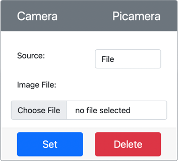

<!--
CO_OP_TRANSLATOR_METADATA:
{
  "original_hash": "3ba7150ffc4a6999f6c3cfb4906ec7df",
  "translation_date": "2025-08-27T20:55:51+00:00",
  "source_file": "4-manufacturing/lessons/2-check-fruit-from-device/virtual-device-camera.md",
  "language_code": "sw"
}
-->
# Kupiga Picha - Vifaa vya IoT vya Kijumla

Katika sehemu hii ya somo, utaongeza kihisi cha kamera kwenye kifaa chako cha IoT cha kijumla, na kusoma picha kutoka kwake.

## Vifaa

Kifaa cha IoT cha kijumla kitakuwa na kamera iliyosimuliwa ambayo inatuma picha kutoka kwa faili au kamera yako ya wavuti.

### Ongeza kamera kwenye CounterFit

Ili kutumia kamera ya kijumla, unahitaji kuongeza moja kwenye programu ya CounterFit.

#### Kazi - ongeza kamera kwenye CounterFit

Ongeza Kamera kwenye programu ya CounterFit.

1. Unda programu mpya ya Python kwenye kompyuta yako ndani ya folda inayoitwa `fruit-quality-detector` yenye faili moja inayoitwa `app.py` na mazingira ya kijumla ya Python, na ongeza vifurushi vya pip vya CounterFit.

    > ⚠️ Unaweza kurejelea [maelekezo ya kuunda na kusanidi mradi wa Python wa CounterFit katika somo la 1 ikiwa inahitajika](../../../1-getting-started/lessons/1-introduction-to-iot/virtual-device.md).

1. Sakinisha kifurushi cha ziada cha Pip ili kusanidi shim ya CounterFit inayoweza kuzungumza na vihisi vya Kamera kwa kusimulia baadhi ya [kifurushi cha Pip cha Picamera](https://pypi.org/project/picamera/). Hakikisha unasakinisha hiki kutoka kwenye terminal yenye mazingira ya kijumla yakiwa yamewashwa.

    ```sh
    pip install counterfit-shims-picamera
    ```

1. Hakikisha programu ya wavuti ya CounterFit inaendelea kufanya kazi.

1. Unda kamera:

    1. Katika kisanduku cha *Create sensor* kwenye paneli ya *Sensors*, shusha kisanduku cha *Sensor type* na uchague *Camera*.

    1. Weka *Name* kuwa `Picamera`.

    1. Chagua kitufe cha **Add** ili kuunda kamera.

    

    Kamera itaundwa na itaonekana kwenye orodha ya vihisi.

    

## Programu ya Kamera

Kifaa cha IoT cha kijumla sasa kinaweza kupangwa kutumia kamera ya kijumla.

### Kazi - panga kamera

Panga kifaa.

1. Hakikisha programu ya `fruit-quality-detector` imefunguliwa kwenye VS Code.

1. Fungua faili ya `app.py`.

1. Ongeza msimbo ufuatao juu ya `app.py` ili kuunganisha programu na CounterFit:

    ```python
    from counterfit_connection import CounterFitConnection
    CounterFitConnection.init('127.0.0.1', 5000)
    ```

1. Ongeza msimbo ufuatao kwenye faili yako ya `app.py`:

    ```python
    import io
    from counterfit_shims_picamera import PiCamera
    ```

    Msimbo huu huingiza baadhi ya maktaba muhimu, ikiwemo darasa la `PiCamera` kutoka kwenye maktaba ya counterfit_shims_picamera.

1. Ongeza msimbo ufuatao chini ya huu ili kuanzisha kamera:

    ```python
    camera = PiCamera()
    camera.resolution = (640, 480)
    camera.rotation = 0
    ```

    Msimbo huu huunda kitu cha PiCamera, huweka azimio kuwa 640x480. Ingawa azimio la juu zaidi linaweza kutumika, kigeuzi cha picha hufanya kazi na picha ndogo zaidi (227x227) kwa hivyo hakuna haja ya kupiga na kutuma picha kubwa zaidi.

    Mstari wa `camera.rotation = 0` huweka mzunguko wa picha kwa nyuzi. Ikiwa unahitaji kuzungusha picha kutoka kamera ya wavuti au faili, weka hii ipasavyo. Kwa mfano, ikiwa unataka kubadilisha picha ya ndizi kwenye kamera ya wavuti katika hali ya mlalo kuwa wima, weka `camera.rotation = 90`.

1. Ongeza msimbo ufuatao chini ya huu ili kupiga picha kama data ya binary:

    ```python
    image = io.BytesIO()
    camera.capture(image, 'jpeg')
    image.seek(0)
    ```

    Msimbo huu huunda kitu cha `BytesIO` kuhifadhi data ya binary. Picha inasomwa kutoka kwenye kamera kama faili ya JPEG na kuhifadhiwa kwenye kitu hiki. Kitu hiki kina kiashiria cha nafasi ili kujua kiko wapi kwenye data ili data zaidi iweze kuandikwa mwishoni ikiwa inahitajika, kwa hivyo mstari wa `image.seek(0)` unarudisha nafasi hii mwanzoni ili data yote iweze kusomwa baadaye.

1. Chini ya hii, ongeza yafuatayo ili kuhifadhi picha kwenye faili:

    ```python
    with open('image.jpg', 'wb') as image_file:
        image_file.write(image.read())
    ```

    Msimbo huu hufungua faili inayoitwa `image.jpg` kwa kuandika, kisha husoma data yote kutoka kwenye kitu cha `BytesIO` na kuiandika kwenye faili.

    > 💁 Unaweza kupiga picha moja kwa moja kwenye faili badala ya kitu cha `BytesIO` kwa kupitisha jina la faili kwenye wito wa `camera.capture`. Sababu ya kutumia kitu cha `BytesIO` ni ili baadaye katika somo hili uweze kutuma picha kwa kigeuzi chako cha picha.

1. Sanidi picha ambayo kamera kwenye CounterFit itapiga. Unaweza kuweka *Source* kuwa *File*, kisha kupakia faili ya picha, au kuweka *Source* kuwa *WebCam*, na picha zitapigwa kutoka kwenye kamera yako ya wavuti. Hakikisha unachagua kitufe cha **Set** baada ya kuchagua picha au kuchagua kamera yako ya wavuti.

    

1. Picha itapigwa na kuhifadhiwa kama `image.jpg` kwenye folda ya sasa. Utaona faili hii kwenye kivinjari cha VS Code. Chagua faili ili kuona picha. Ikiwa inahitaji kuzungushwa, sasisha mstari wa `camera.rotation = 0` kama inavyohitajika na piga picha nyingine.

> 💁 Unaweza kupata msimbo huu kwenye folda ya [code-camera/virtual-iot-device](../../../../../4-manufacturing/lessons/2-check-fruit-from-device/code-camera/virtual-iot-device).

😀 Programu yako ya kamera imefanikiwa!

---

**Kanusho**:  
Hati hii imetafsiriwa kwa kutumia huduma ya kutafsiri ya AI [Co-op Translator](https://github.com/Azure/co-op-translator). Ingawa tunajitahidi kuhakikisha usahihi, tafadhali fahamu kuwa tafsiri za kiotomatiki zinaweza kuwa na makosa au kutokuwa sahihi. Hati ya asili katika lugha yake ya awali inapaswa kuzingatiwa kama chanzo cha mamlaka. Kwa taarifa muhimu, tafsiri ya kitaalamu ya binadamu inapendekezwa. Hatutawajibika kwa kutoelewana au tafsiri zisizo sahihi zinazotokana na matumizi ya tafsiri hii.