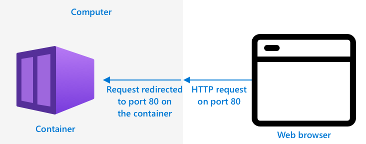

<!--
CO_OP_TRANSLATOR_METADATA:
{
  "original_hash": "2625af24587465c5547ae33d6cc000a5",
  "translation_date": "2025-08-27T20:45:48+00:00",
  "source_file": "4-manufacturing/lessons/3-run-fruit-detector-edge/README.md",
  "language_code": "sw"
}
-->
# Endesha kifaa chako cha kugundua matunda kwenye ukingo


> Sketchnote na [Nitya Narasimhan](https://github.com/nitya). Bofya picha kwa toleo kubwa.

Video hii inatoa muhtasari wa jinsi ya kuendesha viklasifai vya picha kwenye vifaa vya IoT, mada inayoshughulikiwa katika somo hili.

[](https://www.youtube.com/watch?v=_K5fqGLO8us)

## Jaribio la kabla ya somo

[Jaribio la kabla ya somo](https://black-meadow-040d15503.1.azurestaticapps.net/quiz/33)

## Utangulizi

Katika somo la mwisho ulitumia kifaa chako cha kugundua picha kutambua matunda yaliyoiva na yasiyoiva, ukituma picha iliyokamatwa na kamera ya kifaa chako cha IoT kupitia mtandao kwenda huduma ya wingu. Simu hizi huchukua muda, gharama, na kulingana na aina ya data ya picha unayotumia, zinaweza kuwa na athari za faragha.

Katika somo hili utajifunza jinsi ya kuendesha mifano ya kujifunza kwa mashine (ML) kwenye ukingo - kwenye vifaa vya IoT vinavyoendesha kwenye mtandao wako mwenyewe badala ya wingu. Utajifunza faida na hasara za kompyuta ya ukingo ikilinganishwa na kompyuta ya wingu, jinsi ya kupeleka mfano wako wa AI kwenye ukingo, na jinsi ya kuufikia kutoka kwa kifaa chako cha IoT.

Katika somo hili tutashughulikia:

* [Kompyuta ya ukingo](../../../../../4-manufacturing/lessons/3-run-fruit-detector-edge)
* [Azure IoT Edge](../../../../../4-manufacturing/lessons/3-run-fruit-detector-edge)
* [Sajili kifaa cha IoT Edge](../../../../../4-manufacturing/lessons/3-run-fruit-detector-edge)
* [Sanidi kifaa cha IoT Edge](../../../../../4-manufacturing/lessons/3-run-fruit-detector-edge)
* [Hamisha mfano wako](../../../../../4-manufacturing/lessons/3-run-fruit-detector-edge)
* [Andaa kontena lako kwa ajili ya kupelekwa](../../../../../4-manufacturing/lessons/3-run-fruit-detector-edge)
* [Peleka kontena lako](../../../../../4-manufacturing/lessons/3-run-fruit-detector-edge)
* [Tumia kifaa chako cha IoT Edge](../../../../../4-manufacturing/lessons/3-run-fruit-detector-edge)

## Kompyuta ya ukingo

Kompyuta ya ukingo inahusisha kuwa na kompyuta zinazochakata data ya IoT karibu iwezekanavyo na mahali ambapo data inazalishwa. Badala ya kuchakata hii kwenye wingu, inahamishwa kwenye ukingo wa wingu - mtandao wako wa ndani.


Katika masomo yaliyopita, umekuwa na vifaa vinavyokusanya data na kutuma data kwenye wingu ili kuchambuliwa, kuendesha kazi zisizo na seva au mifano ya AI kwenye wingu.


Kompyuta ya ukingo inahusisha kuhamisha baadhi ya huduma za wingu kutoka wingu na kuziweka kwenye kompyuta zinazofanya kazi kwenye mtandao sawa na vifaa vya IoT, zikijumuika na wingu pale tu inapohitajika. Kwa mfano, unaweza kuendesha mifano ya AI kwenye vifaa vya ukingo kuchambua ukomavu wa matunda, na kutuma tu uchambuzi kwenye wingu, kama idadi ya matunda yaliyoiva dhidi ya yasiyoiva.

✅ Fikiria kuhusu programu za IoT ulizojenga hadi sasa. Ni sehemu gani za programu hizo zinaweza kuhamishwa kwenye ukingo.

### Faida

Faida za kompyuta ya ukingo ni:

1. **Kasi** - kompyuta ya ukingo ni bora kwa data inayohitaji hatua za haraka kwani vitendo vinafanyika kwenye mtandao sawa na kifaa, badala ya kufanya simu kupitia mtandao. Hii inawezesha kasi ya juu kwani mitandao ya ndani inaweza kufanya kazi kwa kasi kubwa zaidi kuliko muunganisho wa mtandao, huku data ikisafiri umbali mfupi zaidi.

    > 💁 Licha ya nyaya za nyuzi za macho kutumika kwa muunganisho wa mtandao kuruhusu data kusafiri kwa kasi ya mwanga, data inaweza kuchukua muda kusafiri duniani kote kwenda kwa watoa huduma wa wingu. Kwa mfano, ikiwa unatumia data kutoka Ulaya kwenda huduma za wingu nchini Marekani, inachukua angalau 28ms kwa data kuvuka Atlantiki kwenye nyaya za macho, na hiyo ni bila kuzingatia muda wa kufikisha data kwenye nyaya za Atlantiki, kubadilisha kutoka ishara za umeme hadi mwanga na kurudi tena upande mwingine, kisha kutoka nyaya za macho kwenda kwa mtoa huduma wa wingu.

    Kompyuta ya ukingo pia inahitaji trafiki ndogo ya mtandao, kupunguza hatari ya data yako kupungua kasi kutokana na msongamano kwenye bandwidth ndogo inayopatikana kwa muunganisho wa mtandao.

1. **Upatikanaji wa mbali** - kompyuta ya ukingo hufanya kazi wakati una muunganisho mdogo au hakuna kabisa, au muunganisho ni ghali kutumia kila wakati. Kwa mfano, wakati wa kufanya kazi katika maeneo ya maafa ya kibinadamu ambapo miundombinu ni ndogo, au katika mataifa yanayoendelea.

1. **Gharama za chini** - kukusanya data, kuhifadhi, kuchambua, na kuchochea vitendo kwenye kifaa cha ukingo hupunguza matumizi ya huduma za wingu ambazo zinaweza kupunguza gharama ya jumla ya programu yako ya IoT. Kumekuwa na ongezeko la hivi karibuni la vifaa vilivyoundwa kwa kompyuta ya ukingo, kama vile bodi za kuharakisha AI kama [Jetson Nano kutoka NVIDIA](https://developer.nvidia.com/embedded/jetson-nano-developer-kit), ambazo zinaweza kuendesha kazi za AI kwa kutumia vifaa vya GPU kwenye vifaa vinavyogharimu chini ya US$100.

1. **Faragha na usalama** - kwa kompyuta ya ukingo, data inabaki kwenye mtandao wako na haiwezi kupakiwa kwenye wingu. Hii mara nyingi inapendelewa kwa taarifa nyeti na zinazotambulika binafsi, hasa kwa sababu data haihitaji kuhifadhiwa baada ya kuchambuliwa, ambayo inapunguza sana hatari ya uvujaji wa data. Mifano ni pamoja na data ya matibabu na picha za kamera za usalama.

1. **Kushughulikia vifaa visivyo salama** - ikiwa una vifaa vyenye kasoro za usalama zinazojulikana ambazo hutaki kuunganisha moja kwa moja kwenye mtandao wako au mtandao wa intaneti, basi unaweza kuviunganisha kwenye mtandao tofauti na kifaa cha lango cha IoT Edge. Kifaa hiki cha ukingo kinaweza pia kuwa na muunganisho kwenye mtandao wako mpana au mtandao wa intaneti, na kudhibiti mtiririko wa data kwenda na kurudi.

1. **Msaada kwa vifaa visivyolingana** - ikiwa una vifaa ambavyo haviwezi kuunganishwa na IoT Hub, kwa mfano vifaa vinavyoweza kuunganishwa tu kwa kutumia muunganisho wa HTTP au vifaa ambavyo vina Bluetooth pekee, unaweza kutumia kifaa cha IoT Edge kama kifaa cha lango, kikisambaza ujumbe kwenda IoT Hub.

✅ Fanya utafiti: Ni faida gani nyingine zinaweza kuwepo kwa kompyuta ya ukingo?

### Hasara

Kuna hasara za kompyuta ya ukingo, ambapo wingu linaweza kuwa chaguo linalopendelewa:

1. **Kiwango na kubadilika** - kompyuta ya wingu inaweza kubadilika kulingana na mahitaji ya mtandao na data kwa wakati halisi kwa kuongeza au kupunguza seva na rasilimali nyingine. Kuongeza kompyuta za ukingo kunahitaji kuongeza vifaa zaidi kwa mikono.

1. **Uaminifu na ustahimilivu** - kompyuta ya wingu hutoa seva nyingi mara nyingi katika maeneo mengi kwa ajili ya kurudia na urejeshaji wa maafa. Kuwa na kiwango sawa cha kurudia kwenye ukingo kunahitaji uwekezaji mkubwa na kazi nyingi ya usanidi.

1. **Matengenezo** - watoa huduma za wingu hutoa matengenezo ya mfumo na masasisho.

✅ Fanya utafiti: Ni hasara gani nyingine zinaweza kuwepo kwa kompyuta ya ukingo?

Hasara hizi kwa kweli ni kinyume cha faida za kutumia wingu - unahitaji kujenga na kudhibiti vifaa hivi mwenyewe, badala ya kutegemea utaalamu na kiwango cha watoa huduma wa wingu.

Baadhi ya hatari zinapunguzwa na asili ya kompyuta ya ukingo. Kwa mfano, ikiwa una kifaa cha ukingo kinachoendesha katika kiwanda kinachokusanya data kutoka kwa mashine, huhitaji kufikiria kuhusu baadhi ya hali za urejeshaji wa maafa. Ikiwa umeme wa kiwanda utakatika basi huhitaji kifaa cha ukingo cha akiba kwani mashine zinazozalisha data ambayo kifaa cha ukingo kinachakata pia zitakuwa bila umeme.

Kwa mifumo ya IoT, mara nyingi utataka mchanganyiko wa kompyuta ya wingu na ukingo, ukitumia kila huduma kulingana na mahitaji ya mfumo, wateja wake, na waendeshaji wake.

## Azure IoT Edge


Azure IoT Edge ni huduma inayoweza kukusaidia kuhamisha kazi kutoka wingu kwenda ukingo. Unaweka kifaa kama kifaa cha ukingo, na kutoka wingu unaweza kupeleka msimbo kwenye kifaa hicho cha ukingo. Hii inakuruhusu kuchanganya uwezo wa wingu na ukingo.

> 🎓 *Kazi* ni neno linalotumika kwa huduma yoyote inayofanya kazi fulani, kama vile mifano ya AI, programu, au kazi zisizo na seva.

Kwa mfano, unaweza kufundisha kifaa cha kugundua picha kwenye wingu, kisha kutoka wingu kupeleka kifaa hicho kwenye kifaa cha ukingo. Kifaa chako cha IoT kisha kinatuma picha kwenye kifaa cha ukingo kwa ajili ya kugundua, badala ya kutuma picha hizo kupitia mtandao. Ikiwa unahitaji kupeleka toleo jipya la mfano, unaweza kufundisha kwenye wingu na kutumia IoT Edge kusasisha mfano kwenye kifaa cha ukingo kwa toleo jipya.

> 🎓 Programu inayopelekwa kwenye IoT Edge inajulikana kama *moduli*. Kwa kawaida IoT Edge inaendesha moduli zinazowasiliana na IoT Hub, kama vile moduli za `edgeAgent` na `edgeHub`. Unapopeleka kifaa cha kugundua picha, kinapelekwa kama moduli ya ziada.

IoT Edge imejengwa ndani ya IoT Hub, kwa hivyo unaweza kudhibiti vifaa vya ukingo kwa kutumia huduma sawa unayotumia kudhibiti vifaa vya IoT, kwa kiwango sawa cha usalama.

IoT Edge inaendesha msimbo kutoka *kontena* - programu zilizojitegemea zinazofanya kazi kwa kujitenga na programu nyingine kwenye kompyuta yako. Unapoendesha kontena, linafanya kazi kama kompyuta tofauti inayofanya kazi ndani ya kompyuta yako, ikiwa na programu, huduma, na programu zake zinazofanya kazi. Mara nyingi kontena haziwezi kufikia chochote kwenye kompyuta yako isipokuwa uchague kushiriki vitu kama folda na kontena. Kontena kisha hufichua huduma kupitia mlango wazi ambao unaweza kuunganisha au kufichua kwenye mtandao wako.



Kwa mfano, unaweza kuwa na kontena lenye tovuti inayofanya kazi kwenye mlango 80, mlango wa kawaida wa HTTP, na unaweza kisha kufichua kutoka kwa kompyuta yako pia kwenye mlango 80.

✅ Fanya utafiti: Soma kuhusu kontena na huduma kama Docker au Moby.

Unaweza kutumia Custom Vision kupakua vifaa vya kugundua picha na kuvipeleka kama kontena, ama moja kwa moja kwenye kifaa au kupitia IoT Edge. Mara tu vinapofanya kazi kwenye kontena, vinaweza kufikiwa kwa kutumia API ya REST sawa na toleo la wingu, lakini na endpoint ikielekeza kwenye kifaa cha ukingo kinachoendesha kontena.

## Sajili kifaa cha IoT Edge

Ili kutumia kifaa cha IoT Edge, kinahitaji kusajiliwa kwenye IoT Hub.

### Kazi - sajili kifaa cha IoT Edge

1. Unda IoT Hub katika kikundi cha rasilimali `fruit-quality-detector`. Kipatie jina la kipekee linalohusiana na `fruit-quality-detector`.

1. Sajili kifaa cha IoT Edge kinachoitwa `fruit-quality-detector-edge` kwenye IoT Hub yako. Amri ya kufanya hivi ni sawa na ile inayotumika kusajili kifaa kisicho cha ukingo, isipokuwa unapitisha bendera ya `--edge-enabled`.

    ```sh
    az iot hub device-identity create --edge-enabled \
                                      --device-id fruit-quality-detector-edge \
                                      --hub-name <hub_name>
    ```

    Badilisha `<hub_name>` na jina la IoT Hub yako.

1. Pata mnyororo wa muunganisho wa kifaa chako kwa kutumia amri ifuatayo:

    ```sh
    az iot hub device-identity connection-string show --device-id fruit-quality-detector-edge \
                                                      --output table \
                                                      --hub-name <hub_name>
    ```

    Badilisha `<hub_name>` na jina la IoT Hub yako.

    Chukua nakala ya mnyororo wa muunganisho unaoonyeshwa kwenye matokeo.

## Sanidi kifaa cha IoT Edge

Mara tu unapounda usajili wa kifaa cha ukingo kwenye IoT Hub yako, unaweza kusanidi kifaa cha ukingo.

### Kazi - Sakinisha na anzisha IoT Edge Runtime

**IoT Edge runtime inaendesha kontena za Linux pekee.** Inaweza kuendeshwa kwenye Linux, au kwenye Windows kwa kutumia Mashine za Virtual za Linux.

* Ikiwa unatumia Raspberry Pi kama kifaa chako cha IoT, basi hii inaendesha toleo linaloungwa mkono la Linux na inaweza kuwa mwenyeji wa IoT Edge runtime. Fuata [mwongozo wa kusakinisha Azure IoT Edge kwa Linux kwenye Microsoft docs](https://docs.microsoft.com/azure/iot-edge/how-to-install-iot-edge?WT.mc_id=academic-17441-jabenn) kusakinisha IoT Edge na kuweka mnyororo wa muunganisho.

    > 💁 Kumbuka, Raspberry Pi OS ni toleo la Debian Linux.

* Ikiwa hutumii Raspberry Pi, lakini una kompyuta ya Linux, unaweza kuendesha IoT Edge runtime. Fuata [mwongozo wa kusakinisha Azure IoT Edge kwa Linux kwenye Microsoft docs](https://docs.microsoft.com/azure/iot-edge/how-to-install-iot-edge?WT.mc_id=academic-17441-jabenn) kusakinisha IoT Edge na kuweka mnyororo wa muunganisho.

* Ikiwa unatumia Windows, unaweza kusakinisha IoT Edge runtime kwenye Mashine ya Virtual ya Linux kwa kufuata [sehemu ya kusakinisha na kuanzisha IoT Edge runtime ya mwongozo wa kupeleka moduli yako ya kwanza ya IoT Edge kwenye kifaa cha Windows kwenye Microsoft docs](https://docs.microsoft.com/azure/iot-edge/quickstart?WT.mc_id=academic-17441-jabenn#install-and-start-the-iot-edge-runtime). Unaweza kusimama unapofikia sehemu ya *Deploy a module*.

* Ikiwa unatumia macOS, unaweza kuunda mashine ya virtual (VM) kwenye wingu kutumia kama kifaa chako cha IoT Edge. Hizi ni kompyuta unazoweza kuunda kwenye wingu na kufikia kupitia mtandao. Unaweza kuunda VM ya Linux yenye IoT Edge iliyosakinishwa. Fuata [mwongozo wa kuunda mashine ya virtual inayotumia IoT Edge](vm-iotedge.md) kwa maelekezo ya jinsi ya kufanya hivi.

## Hamisha mfano wako

Ili kuendesha kifaa cha kugundua kwenye ukingo, kinahitaji kuhamishwa kutoka Custom Vision. Custom Vision inaweza kuzalisha aina mbili za mifano - mifano ya kawaida na mifano ya kompakt. Mifano ya kompakt hutumia mbinu mbalimbali kupunguza ukubwa wa mfano, kuufanya uwe mdogo wa kutosha kupakuliwa na kupelekwa kwenye vifaa vya IoT.

Ulipounda kifaa cha kugundua picha, ulitumia kikoa cha *Food*, toleo la mfano ambalo limeboreshwa kwa mafunzo kwenye picha za chakula. Katika Custom Vision, unabadilisha kikoa cha mradi wako, ukitumia data yako ya mafunzo kufundisha mfano mpya na kikoa kipya. Kikoa vyote vinavyoungwa mkono na Custom Vision vinapatikana kama kawaida na kompakt.

### Kazi - fundisha mfano wako kwa kutumia kikoa cha Food (compact)
1. Fungua portal ya Custom Vision kwenye [CustomVision.ai](https://customvision.ai) na ingia ikiwa hujafungua tayari. Kisha fungua mradi wako wa `fruit-quality-detector`.

1. Chagua kitufe cha **Settings** (alama ya ⚙).

1. Katika orodha ya *Domains*, chagua *Food (compact)*.

1. Chini ya *Export Capabilities*, hakikisha *Basic platforms (Tensorflow, CoreML, ONNX, ...)* imechaguliwa.

1. Mwisho wa ukurasa wa Settings, chagua **Save Changes**.

1. Fundisha tena modeli kwa kubonyeza kitufe cha **Train**, ukichagua *Quick training*.

### Kazi - Hamisha modeli yako

Baada ya modeli kufundishwa, inahitaji kuhamishwa kama kontena.

1. Chagua tabo ya **Performance**, na tafuta iteration yako ya hivi karibuni iliyofundishwa kwa kutumia compact domain.

1. Chagua kitufe cha **Export** juu.

1. Chagua **DockerFile**, kisha chagua toleo linalolingana na kifaa chako cha edge:

    * Ikiwa unatumia IoT Edge kwenye kompyuta ya Linux, kompyuta ya Windows au Virtual Machine, chagua toleo la *Linux*.
    * Ikiwa unatumia IoT Edge kwenye Raspberry Pi, chagua toleo la *ARM (Raspberry Pi 3)*.

    
> 🎓 Docker ni mojawapo ya zana maarufu za kusimamia kontena, na DockerFile ni seti ya maagizo ya jinsi ya kusanidi kontena.

1. Chagua **Export** ili Custom Vision iunde faili zinazohitajika, kisha **Download** ili kuzipakua kwenye faili ya zip.

1. Hifadhi faili kwenye kompyuta yako, kisha unzip folda hiyo.

## Andaa kontena lako kwa ajili ya kupelekwa


Baada ya kupakua modeli yako, inahitaji kujengwa kuwa kontena, kisha kusukumwa kwenye container registry - eneo la mtandaoni ambapo unaweza kuhifadhi kontena. IoT Edge inaweza kisha kupakua kontena kutoka kwenye registry na kulisukuma kwenye kifaa chako.


Container registry utakayotumia kwa somo hili ni Azure Container Registry. Huduma hii si ya bure, kwa hivyo ili kuokoa pesa hakikisha unafanya [usafi wa mradi wako](../../../clean-up.md) mara tu unapomaliza.

> 💁 Unaweza kuona gharama za kutumia Azure Container Registry kwenye [ukurasa wa bei wa Azure Container Registry](https://azure.microsoft.com/pricing/details/container-registry/?WT.mc_id=academic-17441-jabenn).

### Kazi - Sakinisha Docker

Ili kujenga na kupeleka classifier, huenda ukahitaji kusakinisha [Docker](https://www.docker.com/).

Utahitaji kufanya hivi tu ikiwa unapanga kujenga kontena kutoka kwenye kifaa tofauti na kile ulichosakinisha IoT Edge - kama sehemu ya kusakinisha IoT Edge, Docker inasakinishwa kwako.

1. Ikiwa unajenga kontena la docker kwenye kifaa tofauti na kifaa chako cha IoT Edge, fuata maelekezo ya usakinishaji wa Docker kwenye [ukurasa wa usakinishaji wa Docker](https://www.docker.com/products/docker-desktop) ili kusakinisha Docker Desktop au injini ya Docker. Hakikisha inafanya kazi baada ya usakinishaji.

### Kazi - Unda rasilimali ya container registry

1. Endesha amri ifuatayo kutoka kwa Terminal au command prompt yako ili kuunda rasilimali ya Azure Container Registry:

    ```sh
    az acr create --resource-group fruit-quality-detector \
                  --sku Basic \
                  --name <Container registry name>
    ```

    Badilisha `<Container registry name>` na jina la kipekee kwa container registry yako, ukitumia herufi na namba pekee. Jenga jina hili kuzunguka `fruitqualitydetector`. Jina hili linakuwa sehemu ya URL ya kufikia container registry, kwa hivyo linahitaji kuwa la kipekee kimataifa.

1. Ingia kwenye Azure Container Registry kwa amri ifuatayo:

    ```sh
    az acr login --name <Container registry name>
    ```

    Badilisha `<Container registry name>` na jina ulilotumia kwa container registry yako.

1. Weka container registry katika hali ya admin ili uweze kuzalisha nenosiri kwa amri ifuatayo:

    ```sh
    az acr update --admin-enabled true \
                 --name <Container registry name>
    ```

    Badilisha `<Container registry name>` na jina ulilotumia kwa container registry yako.

1. Zalisha nywila kwa container registry yako kwa amri ifuatayo:

    ```sh
     az acr credential renew --password-name password \
                             --output table \
                             --name <Container registry name>
    ```

    Badilisha `<Container registry name>` na jina ulilotumia kwa container registry yako.

    Chukua nakala ya thamani ya `PASSWORD`, kwani utahitaji hii baadaye.

### Kazi - Jenga kontena lako

Kile ulichopakua kutoka Custom Vision kilikuwa DockerFile kilicho na maagizo ya jinsi kontena linapaswa kujengwa, pamoja na msimbo wa programu ambao utaendeshwa ndani ya kontena ili kuandaa modeli yako ya Custom Vision, pamoja na REST API ya kuipigia simu. Unaweza kutumia Docker kujenga kontena lililotambulishwa kutoka DockerFile, kisha kulisukuma kwenye container registry yako.

> 🎓 Kontena hupewa tag inayofafanua jina na toleo lake. Unapohitaji kusasisha kontena unaweza kujenga kwa tag ile ile lakini toleo jipya.

1. Fungua terminal au command prompt yako na nenda kwenye modeli iliyopakuliwa ambayo uli unzip kutoka Custom Vision.

1. Endesha amri ifuatayo ili kujenga na kutambulisha picha:

    ```sh
    docker build --platform <platform> -t <Container registry name>.azurecr.io/classifier:v1 .
    ```

    Badilisha `<platform>` na jukwaa ambalo kontena hili litaendeshwa. Ikiwa unatumia IoT Edge kwenye Raspberry Pi, weka hii kuwa `linux/armhf`, vinginevyo weka hii kuwa `linux/amd64`.

    > 💁 Ikiwa unakimbia amri hii kutoka kifaa unachokimbia IoT Edge, kama vile Raspberry Pi, unaweza kuondoa sehemu ya `--platform <platform>` kwani inachukua jukwaa la sasa kwa chaguo-msingi.

    Badilisha `<Container registry name>` na jina ulilotumia kwa container registry yako.

    > 💁 Ikiwa unatumia Linux au Raspberry Pi OS huenda ukahitaji kutumia `sudo` kuendesha amri hii.

    Docker itajenga picha, ikisanidi programu zote zinazohitajika. Picha itatambulishwa kama `classifier:v1`.

    ```output
    ➜  d4ccc45da0bb478bad287128e1274c3c.DockerFile.Linux docker build --platform linux/amd64 -t  fruitqualitydetectorjimb.azurecr.io/classifier:v1 .
    [+] Building 102.4s (11/11) FINISHED
     => [internal] load build definition from Dockerfile
     => => transferring dockerfile: 131B
     => [internal] load .dockerignore
     => => transferring context: 2B
     => [internal] load metadata for docker.io/library/python:3.7-slim
     => [internal] load build context
     => => transferring context: 905B
     => [1/6] FROM docker.io/library/python:3.7-slim@sha256:b21b91c9618e951a8cbca5b696424fa5e820800a88b7e7afd66bba0441a764d6
     => => resolve docker.io/library/python:3.7-slim@sha256:b21b91c9618e951a8cbca5b696424fa5e820800a88b7e7afd66bba0441a764d6
     => => sha256:b4d181a07f8025e00e0cb28f1cc14613da2ce26450b80c54aea537fa93cf3bda 27.15MB / 27.15MB
     => => sha256:de8ecf497b753094723ccf9cea8a46076e7cb845f333df99a6f4f397c93c6ea9 2.77MB / 2.77MB
     => => sha256:707b80804672b7c5d8f21e37c8396f319151e1298d976186b4f3b76ead9f10c8 10.06MB / 10.06MB
     => => sha256:b21b91c9618e951a8cbca5b696424fa5e820800a88b7e7afd66bba0441a764d6 1.86kB / 1.86kB
     => => sha256:44073386687709c437586676b572ff45128ff1f1570153c2f727140d4a9accad 1.37kB / 1.37kB
     => => sha256:3d94f0f2ca798607808b771a7766f47ae62a26f820e871dd488baeccc69838d1 8.31kB / 8.31kB
     => => sha256:283715715396fd56d0e90355125fd4ec57b4f0773f306fcd5fa353b998beeb41 233B / 233B
     => => sha256:8353afd48f6b84c3603ea49d204bdcf2a1daada15f5d6cad9cc916e186610a9f 2.64MB / 2.64MB
     => => extracting sha256:b4d181a07f8025e00e0cb28f1cc14613da2ce26450b80c54aea537fa93cf3bda
     => => extracting sha256:de8ecf497b753094723ccf9cea8a46076e7cb845f333df99a6f4f397c93c6ea9
     => => extracting sha256:707b80804672b7c5d8f21e37c8396f319151e1298d976186b4f3b76ead9f10c8
     => => extracting sha256:283715715396fd56d0e90355125fd4ec57b4f0773f306fcd5fa353b998beeb41
     => => extracting sha256:8353afd48f6b84c3603ea49d204bdcf2a1daada15f5d6cad9cc916e186610a9f
     => [2/6] RUN pip install -U pip
     => [3/6] RUN pip install --no-cache-dir numpy~=1.17.5 tensorflow~=2.0.2 flask~=1.1.2 pillow~=7.2.0
     => [4/6] RUN pip install --no-cache-dir mscviplib==2.200731.16
     => [5/6] COPY app /app
     => [6/6] WORKDIR /app
     => exporting to image
     => => exporting layers
     => => writing image sha256:1846b6f134431f78507ba7c079358ed66d944c0e185ab53428276bd822400386
     => => naming to fruitqualitydetectorjimb.azurecr.io/classifier:v1
    ```

### Kazi - Sukuma kontena lako kwenye container registry yako

1. Tumia amri ifuatayo kusukuma kontena lako kwenye container registry yako:

    ```sh
    docker push <Container registry name>.azurecr.io/classifier:v1
    ```

    Badilisha `<Container registry name>` na jina ulilotumia kwa container registry yako.

    > 💁 Ikiwa unatumia Linux huenda ukahitaji kutumia `sudo` kuendesha amri hii.

    Kontena litasukumwa kwenye container registry.

    ```output
    ➜  d4ccc45da0bb478bad287128e1274c3c.DockerFile.Linux docker push fruitqualitydetectorjimb.azurecr.io/classifier:v1
    The push refers to repository [fruitqualitydetectorjimb.azurecr.io/classifier]
    5f70bf18a086: Pushed 
    8a1ba9294a22: Pushed 
    56cf27184a76: Pushed 
    b32154f3f5dd: Pushed 
    36103e9a3104: Pushed 
    e2abb3cacca0: Pushed 
    4213fd357bbe: Pushed 
    7ea163ba4dce: Pushed 
    537313a13d90: Pushed 
    764055ebc9a7: Pushed 
    v1: digest: sha256:ea7894652e610de83a5a9e429618e763b8904284253f4fa0c9f65f0df3a5ded8 size: 2423
    ```

1. Ili kuthibitisha usukumo, unaweza kuorodhesha kontena kwenye registry yako kwa amri ifuatayo:

    ```sh
    az acr repository list --output table \
                           --name <Container registry name> 
    ```

    Badilisha `<Container registry name>` na jina ulilotumia kwa container registry yako.

    ```output
    ➜  d4ccc45da0bb478bad287128e1274c3c.DockerFile.Linux az acr repository list --name fruitqualitydetectorjimb --output table
    Result
    ----------
    classifier
    ```

    Utaona classifier yako ikiorodheshwa kwenye matokeo.

## Peleka kontena lako

Kontena lako sasa linaweza kupelekwa kwenye kifaa chako cha IoT Edge. Ili kupeleka unahitaji kufafanua deployment manifest - hati ya JSON inayoorodhesha moduli zitakazopelekwa kwenye kifaa cha edge.

### Kazi - Unda deployment manifest

1. Unda faili mpya inayoitwa `deployment.json` mahali fulani kwenye kompyuta yako.

1. Ongeza yafuatayo kwenye faili hii:

    ```json
    {
        "content": {
            "modulesContent": {
                "$edgeAgent": {
                    "properties.desired": {
                        "schemaVersion": "1.1",
                        "runtime": {
                            "type": "docker",
                            "settings": {
                                "minDockerVersion": "v1.25",
                                "loggingOptions": "",
                                "registryCredentials": {
                                    "ClassifierRegistry": {
                                        "username": "<Container registry name>",
                                        "password": "<Container registry password>",
                                        "address": "<Container registry name>.azurecr.io"
                                      }
                                }
                            }
                        },
                        "systemModules": {
                            "edgeAgent": {
                                "type": "docker",
                                "settings": {
                                    "image": "mcr.microsoft.com/azureiotedge-agent:1.1",
                                    "createOptions": "{}"
                                }
                            },
                            "edgeHub": {
                                "type": "docker",
                                "status": "running",
                                "restartPolicy": "always",
                                "settings": {
                                    "image": "mcr.microsoft.com/azureiotedge-hub:1.1",
                                    "createOptions": "{\"HostConfig\":{\"PortBindings\":{\"5671/tcp\":[{\"HostPort\":\"5671\"}],\"8883/tcp\":[{\"HostPort\":\"8883\"}],\"443/tcp\":[{\"HostPort\":\"443\"}]}}}"
                                }
                            }
                        },
                        "modules": {
                            "ImageClassifier": {
                                "version": "1.0",
                                "type": "docker",
                                "status": "running",
                                "restartPolicy": "always",
                                "settings": {
                                    "image": "<Container registry name>.azurecr.io/classifier:v1",
                                    "createOptions": "{\"ExposedPorts\": {\"80/tcp\": {}},\"HostConfig\": {\"PortBindings\": {\"80/tcp\": [{\"HostPort\": \"80\"}]}}}"
                                }
                            }
                        }
                    }
                },
                "$edgeHub": {
                    "properties.desired": {
                        "schemaVersion": "1.1",
                        "routes": {
                            "upstream": "FROM /messages/* INTO $upstream"
                        },
                        "storeAndForwardConfiguration": {
                            "timeToLiveSecs": 7200
                        }
                    }
                }
            }
        }
    }
    ```

    > 💁 Unaweza kupata faili hii kwenye folda ya [code-deployment/deployment](../../../../../4-manufacturing/lessons/3-run-fruit-detector-edge/code-deployment/deployment).

    Badilisha sehemu tatu za `<Container registry name>` na jina ulilotumia kwa container registry yako. Moja iko kwenye sehemu ya moduli ya `ImageClassifier`, nyingine mbili ziko kwenye sehemu ya `registryCredentials`.

    Badilisha `<Container registry password>` kwenye sehemu ya `registryCredentials` na nywila ya container registry yako.

1. Kutoka folda inayoshikilia deployment manifest yako, endesha amri ifuatayo:

    ```sh
    az iot edge set-modules --device-id fruit-quality-detector-edge \
                            --content deployment.json \
                            --hub-name <hub_name>
    ```

    Badilisha `<hub_name>` na jina la IoT Hub yako.

    Moduli ya image classifier itapelekwa kwenye kifaa chako cha edge.

### Kazi - Thibitisha classifier inaendesha

1. Unganisha kwenye kifaa cha IoT Edge:

    * Ikiwa unatumia Raspberry Pi kuendesha IoT Edge, unganisha kwa ssh kutoka terminal yako, au kupitia session ya mbali ya SSH kwenye VS Code.
    * Ikiwa unatumia IoT Edge kwenye kontena la Linux kwenye Windows, fuata hatua kwenye [mwongozo wa kuthibitisha usanidi uliofanikiwa](https://docs.microsoft.com/azure/iot-edge/how-to-install-iot-edge-on-windows?WT.mc_id=academic-17441-jabenn&view=iotedge-2018-06&tabs=powershell#verify-successful-configuration) kuungana na kifaa cha IoT Edge.
    * Ikiwa unatumia IoT Edge kwenye mashine ya virtual, unaweza SSH kwenye mashine kwa kutumia `adminUsername` na `password` ulizoweka wakati wa kuunda VM, na kutumia aidha anwani ya IP au jina la DNS:

        ```sh
        ssh <adminUsername>@<IP address>
        ```

        Au:

        ```sh
        ssh <adminUsername>@<DNS Name>
        ```

        Ingiza nywila yako unapoulizwa.

1. Mara tu umeunganishwa, endesha amri ifuatayo kupata orodha ya moduli za IoT Edge:

    ```sh
    iotedge list
    ```

    > 💁 Huenda ukahitaji kuendesha amri hii na `sudo`.

    Utaona moduli zinazoendesha:

    ```output
    jim@fruit-quality-detector-jimb:~$ iotedge list
    NAME             STATUS           DESCRIPTION      CONFIG
    ImageClassifier  running          Up 42 minutes    fruitqualitydetectorjimb.azurecr.io/classifier:v1
    edgeAgent        running          Up 42 minutes    mcr.microsoft.com/azureiotedge-agent:1.1
    edgeHub          running          Up 42 minutes    mcr.microsoft.com/azureiotedge-hub:1.1
    ```

1. Angalia logi za moduli ya Image classifier kwa amri ifuatayo:

    ```sh
    iotedge logs ImageClassifier
    ```

    > 💁 Huenda ukahitaji kuendesha amri hii na `sudo`.

    ```output
    jim@fruit-quality-detector-jimb:~$ iotedge logs ImageClassifier
    2021-07-05 20:30:15.387144: I tensorflow/core/platform/cpu_feature_guard.cc:142] Your CPU supports instructions that this TensorFlow binary was not compiled to use: AVX2 FMA
    2021-07-05 20:30:15.392185: I tensorflow/core/platform/profile_utils/cpu_utils.cc:94] CPU Frequency: 2394450000 Hz
    2021-07-05 20:30:15.392712: I tensorflow/compiler/xla/service/service.cc:168] XLA service 0x55ed9ac83470 executing computations on platform Host. Devices:
    2021-07-05 20:30:15.392806: I tensorflow/compiler/xla/service/service.cc:175]   StreamExecutor device (0): Host, Default Version
    Loading model...Success!
    Loading labels...2 found. Success!
     * Serving Flask app "app" (lazy loading)
     * Environment: production
       WARNING: This is a development server. Do not use it in a production deployment.
       Use a production WSGI server instead.
     * Debug mode: off
     * Running on http://0.0.0.0:80/ (Press CTRL+C to quit)
    ```

### Kazi - Jaribu image classifier

1. Unaweza kutumia CURL kujaribu image classifier kwa kutumia anwani ya IP au jina la mwenyeji wa kompyuta inayokimbia IoT Edge agent. Tafuta anwani ya IP:

    * Ikiwa uko kwenye mashine ile ile ambayo IoT Edge inaendesha, unaweza kutumia `localhost` kama jina la mwenyeji.
    * Ikiwa unatumia VM, unaweza kutumia aidha anwani ya IP au jina la DNS la VM.
    * Vinginevyo unaweza kupata anwani ya IP ya mashine inayokimbia IoT Edge:
      * Kwenye Windows 10, fuata [mwongozo wa kupata anwani yako ya IP](https://support.microsoft.com/windows/find-your-ip-address-f21a9bbc-c582-55cd-35e0-73431160a1b9?WT.mc_id=academic-17441-jabenn).
      * Kwenye macOS, fuata [jinsi ya kupata anwani yako ya IP kwenye Mac](https://www.hellotech.com/guide/for/how-to-find-ip-address-on-mac).
      * Kwenye Linux, fuata sehemu ya kupata anwani yako ya IP ya kibinafsi kwenye [jinsi ya kupata anwani yako ya IP kwenye Linux](https://opensource.com/article/18/5/how-find-ip-address-linux).

1. Unaweza kujaribu kontena kwa faili ya ndani kwa kuendesha amri ya curl ifuatayo:

    ```sh
    curl --location \
         --request POST 'http://<IP address or name>/image' \
         --header 'Content-Type: image/png' \
         --data-binary '@<file_Name>' 
    ```

    Badilisha `<IP address or name>` na anwani ya IP au jina la mwenyeji wa kompyuta inayokimbia IoT Edge. Badilisha `<file_Name>` na jina la faili ya kujaribu.

    Utaona matokeo ya utabiri kwenye matokeo:

    ```output
    {
        "created": "2021-07-05T21:44:39.573181",
        "id": "",
        "iteration": "",
        "predictions": [
            {
                "boundingBox": null,
                "probability": 0.9995615482330322,
                "tagId": "",
                "tagName": "ripe"
            },
            {
                "boundingBox": null,
                "probability": 0.0004384400090202689,
                "tagId": "",
                "tagName": "unripe"
            }
        ],
        "project": ""
    }
    ```

    > 💁 Hakuna haja ya kutoa ufunguo wa utabiri hapa, kwani hii haitumii rasilimali ya Azure. Badala yake usalama ungewekwa kwenye mtandao wa ndani kulingana na mahitaji ya usalama wa ndani, badala ya kutegemea endpoint ya umma na API key.

## Tumia kifaa chako cha IoT Edge

Sasa kwamba Image Classifier yako imepelekwa kwenye kifaa cha IoT Edge, unaweza kuitumia kutoka kifaa chako cha IoT.

### Kazi - Tumia kifaa chako cha IoT Edge

Fanya kazi kupitia mwongozo husika ili kuainisha picha kwa kutumia IoT Edge classifier:

* [Arduino - Wio Terminal](wio-terminal.md)
* [Kompyuta ya bodi moja - Raspberry Pi/Kifaa cha IoT cha Virtual](single-board-computer.md)

### Kufundisha tena modeli

Moja ya changamoto za kuendesha image classifiers kwenye IoT Edge ni kwamba hazijaunganishwa na mradi wako wa Custom Vision. Ikiwa utaangalia tabo ya **Predictions** kwenye Custom Vision hutapata picha zilizoorodheshwa kwa kutumia classifier inayotegemea Edge.

Hii ni tabia inayotarajiwa - picha hazitumwi kwenye wingu kwa ajili ya uainishaji, kwa hivyo hazitapatikana kwenye wingu. Moja ya faida za kutumia IoT Edge ni faragha, kuhakikisha kwamba picha hazitoki kwenye mtandao wako, nyingine ni uwezo wa kufanya kazi bila mtandao, kwa hivyo hakuna kutegemea kupakia picha wakati kifaa hakina muunganisho wa mtandao. Changamoto ni kuboresha modeli yako - ungehitaji kutekeleza njia nyingine ya kuhifadhi picha ambazo zinaweza kuainishwa tena kwa mikono ili kuboresha na kufundisha tena image classifier.

✅ Fikiria njia za kupakia picha ili kufundisha tena classifier.

---

## 🚀 Changamoto

Kuendesha modeli za AI kwenye vifaa vya edge kunaweza kuwa haraka kuliko kwenye wingu - hatua ya mtandao ni fupi. Pia inaweza kuwa polepole kwani vifaa vinavyoendesha modeli vinaweza kuwa na uwezo mdogo wa maunzi kuliko wingu.

Fanya vipimo na linganisha ikiwa simu kwa kifaa chako cha edge ni haraka au polepole kuliko simu kwa wingu? Fikiria sababu za kuelezea tofauti, au kutokuwepo kwa tofauti. Tafiti njia za kuendesha modeli za AI haraka kwenye edge kwa kutumia maunzi maalum.

## Maswali ya baada ya somo

[Maswali ya baada ya somo](https://black-meadow-040d15503.1.azurestaticapps.net/quiz/34)

## Mapitio na Kujisomea

* Soma zaidi kuhusu kontena kwenye [ukurasa wa uhalisia wa OS kwenye Wikipedia](https://wikipedia.org/wiki/OS-level_virtualization).
* Soma zaidi kuhusu kompyuta ya ukingo, kwa msisitizo juu ya jinsi 5G inaweza kusaidia kupanua kompyuta ya ukingo katika [makala ya "kompyuta ya ukingo ni nini na kwa nini ni muhimu?" kwenye NetworkWorld](https://www.networkworld.com/article/3224893/what-is-edge-computing-and-how-its-changing-the-network.html)
* Jifunze zaidi kuhusu kuendesha huduma za AI katika IoT Edge kwa kutazama [kipindi cha "jifunze jinsi ya kutumia Azure IoT Edge kwenye huduma ya AI iliyojengwa tayari kwenye Ukingo kufanya utambuzi wa lugha" cha Learn Live kwenye Microsoft Channel9](https://channel9.msdn.com/Shows/Learn-Live/Sharpen-Your-AI-Edge-Skills-Episode-4-Learn-How-to-Use-Azure-IoT-Edge-on-a-Pre-Built-AI-Service-on-t?WT.mc_id=academic-17441-jabenn)

## Kazi

[Endesha huduma nyingine kwenye ukingo](assignment.md)

---

**Kanusho**:  
Hati hii imetafsiriwa kwa kutumia huduma ya tafsiri ya AI [Co-op Translator](https://github.com/Azure/co-op-translator). Ingawa tunajitahidi kuhakikisha usahihi, tafadhali fahamu kuwa tafsiri za kiotomatiki zinaweza kuwa na makosa au kutokuwa sahihi. Hati ya asili katika lugha yake ya awali inapaswa kuzingatiwa kama chanzo cha mamlaka. Kwa taarifa muhimu, tafsiri ya kitaalamu ya binadamu inapendekezwa. Hatutawajibika kwa kutoelewana au tafsiri zisizo sahihi zinazotokana na matumizi ya tafsiri hii.