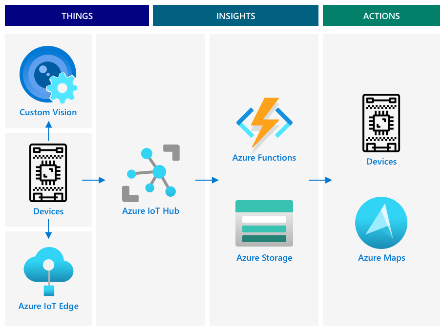
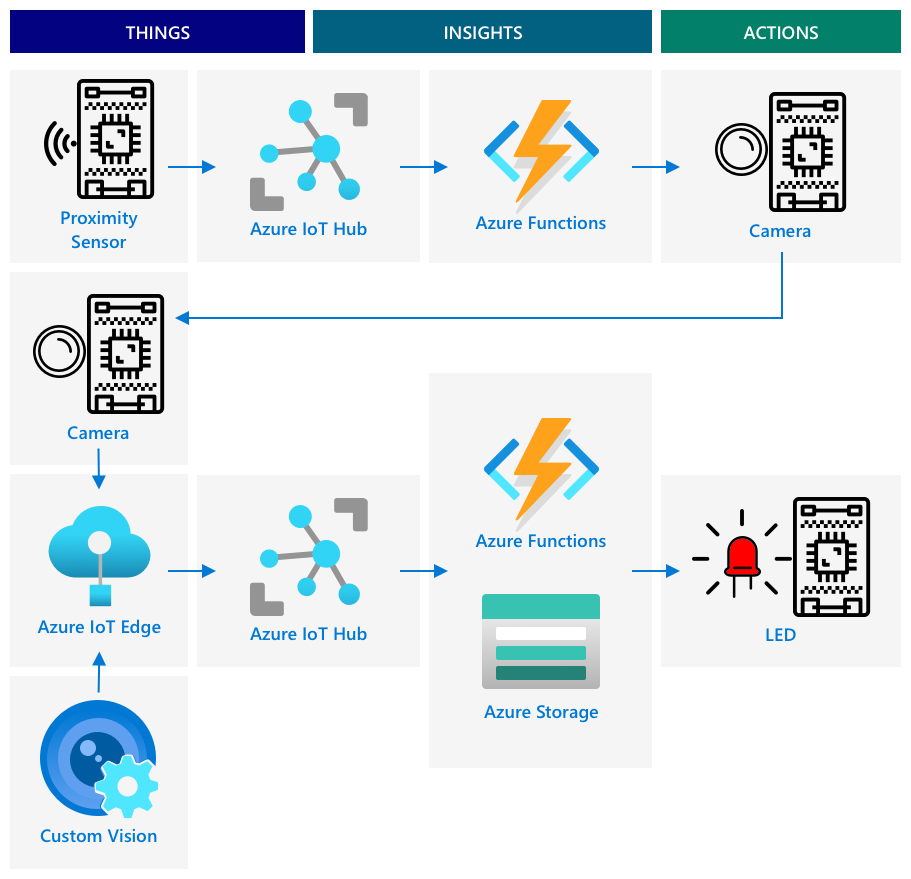

<!--
CO_OP_TRANSLATOR_METADATA:
{
  "original_hash": "f74f4ccb61f00e5f7e9f49c3ed416e36",
  "translation_date": "2025-08-27T20:39:42+00:00",
  "source_file": "4-manufacturing/lessons/4-trigger-fruit-detector/README.md",
  "language_code": "sw"
}
-->
# Kuchochea Utambuzi wa Ubora wa Matunda Kutoka kwa Kihisi


> Sketchnote na [Nitya Narasimhan](https://github.com/nitya). Bofya picha kwa toleo kubwa zaidi.

## Jaribio la Kabla ya Somo

[Jaribio la kabla ya somo](https://black-meadow-040d15503.1.azurestaticapps.net/quiz/35)

## Utangulizi

Programu ya IoT si kifaa kimoja tu kinachokusanya data na kuituma kwenye wingu, mara nyingi ni vifaa vingi vinavyofanya kazi pamoja kukusanya data kutoka kwa ulimwengu wa kimwili kwa kutumia vihisi, kufanya maamuzi kulingana na data hiyo, na kuingiliana tena na ulimwengu wa kimwili kupitia aktueta au vielelezo.

Katika somo hili, utajifunza zaidi kuhusu kubuni programu changamano za IoT, kuingiza vihisi vingi, huduma nyingi za wingu za kuchambua na kuhifadhi data, na kuonyesha majibu kupitia aktueta. Utajifunza jinsi ya kubuni mfano wa mfumo wa kudhibiti ubora wa matunda, ikiwa ni pamoja na kutumia vihisi vya ukaribu kuchochea programu ya IoT, na jinsi usanifu wa mfano huu unavyoweza kuwa.

Katika somo hili tutashughulikia:

* [Kubuni programu changamano za IoT](../../../../../4-manufacturing/lessons/4-trigger-fruit-detector)
* [Kubuni mfumo wa kudhibiti ubora wa matunda](../../../../../4-manufacturing/lessons/4-trigger-fruit-detector)
* [Kuchochea ukaguzi wa ubora wa matunda kutoka kwa kihisi](../../../../../4-manufacturing/lessons/4-trigger-fruit-detector)
* [Data inayotumika kwa kigunduzi cha ubora wa matunda](../../../../../4-manufacturing/lessons/4-trigger-fruit-detector)
* [Kutumia vifaa vya watengenezaji kuiga vifaa vingi vya IoT](../../../../../4-manufacturing/lessons/4-trigger-fruit-detector)
* [Kuhamia kwenye uzalishaji](../../../../../4-manufacturing/lessons/4-trigger-fruit-detector)

> 🗑 Hili ni somo la mwisho katika mradi huu, kwa hivyo baada ya kukamilisha somo hili na kazi, usisahau kusafisha huduma zako za wingu. Utahitaji huduma hizo kukamilisha kazi, kwa hivyo hakikisha unakamilisha hiyo kwanza.
>
> Rejelea [mwongozo wa kusafisha mradi wako](../../../clean-up.md) ikiwa ni lazima kwa maelekezo ya jinsi ya kufanya hivyo.

## Kubuni Programu Changamano za IoT

Programu za IoT zinaundwa na vipengele vingi. Hii inajumuisha vitu mbalimbali, na huduma mbalimbali za mtandao.

Programu za IoT zinaweza kuelezewa kama *vitu* (vifaa) vinavyotuma data inayozalisha *ufahamu*. Huu *ufahamu* huzalisha *vitendo* vya kuboresha biashara au mchakato. Mfano ni injini (kitu) inayotuma data ya joto. Data hii hutumika kutathmini kama injini inafanya kazi kama inavyotarajiwa (ufahamu). Ufahamu hutumika kipaumbele kupanga ratiba ya matengenezo ya injini (kitendo).

* Vitu tofauti hukusanya vipande tofauti vya data.
* Huduma za IoT hutoa ufahamu juu ya data hiyo, wakati mwingine zikiiongezea data kutoka vyanzo vya ziada.
* Ufahamu huu husababisha vitendo, ikiwa ni pamoja na kudhibiti aktueta kwenye vifaa, au kuonyesha data.

### Usanifu wa Marejeleo wa IoT


Mchoro hapo juu unaonyesha usanifu wa marejeleo wa IoT.

> 🎓 *Usanifu wa marejeleo* ni mfano wa usanifu unaoweza kutumia kama rejeleo unapobuni mifumo mipya. Katika kesi hii, ikiwa unajenga mfumo mpya wa IoT unaweza kufuata usanifu wa marejeleo, ukibadilisha vifaa na huduma zako inapofaa.

* **Vitu** ni vifaa vinavyokusanya data kutoka kwa vihisi, labda vikishirikiana na huduma za ukingo kutafsiri data hiyo, kama vile vichanganuzi vya picha kutafsiri data ya picha. Data kutoka kwa vifaa hutumwa kwa huduma ya IoT.
* **Ufahamu** hutoka kwa programu zisizo na seva, au kutoka kwa uchambuzi unaofanywa kwenye data iliyohifadhiwa.
* **Vitendo** vinaweza kuwa amri zinazotumwa kwa vifaa, au vielelezo vya data vinavyoruhusu binadamu kufanya maamuzi.



Mchoro hapo juu unaonyesha baadhi ya vipengele na huduma zilizoshughulikiwa hadi sasa katika masomo haya na jinsi zinavyounganishwa katika usanifu wa marejeleo wa IoT.

* **Vitu** - umeandika msimbo wa kifaa kukusanya data kutoka kwa vihisi, na kuchanganua picha kwa kutumia Custom Vision inayofanya kazi wingu na kwenye kifaa cha ukingo. Data hii ilitumwa kwa IoT Hub.
* **Ufahamu** - umetumia Azure Functions kujibu ujumbe uliotumwa kwa IoT Hub, na kuhifadhi data kwa uchambuzi wa baadaye katika Azure Storage.
* **Vitendo** - umedhibiti aktueta kulingana na maamuzi yaliyofanywa kwenye wingu na amri zilizotumwa kwa vifaa, na umeonyesha data kwa kutumia Azure Maps.

✅ Fikiria kuhusu vifaa vingine vya IoT ulivyotumia, kama vile vifaa vya nyumbani vya kisasa. Ni vitu gani, ufahamu gani, na vitendo gani vinahusika katika kifaa hicho na programu yake?

Mfumo huu unaweza kupanuliwa kuwa mkubwa au mdogo kadri unavyohitaji, kwa kuongeza vifaa zaidi na huduma zaidi.

### Data na Usalama

Unapobainisha usanifu wa mfumo wako, unahitaji kuzingatia mara kwa mara data na usalama.

* Je, kifaa chako kinatuma na kupokea data gani?
* Data hiyo inapaswa kulindwa na kuhifadhiwa vipi?
* Ufikiaji wa kifaa na huduma ya wingu unapaswa kudhibitiwa vipi?

✅ Fikiria kuhusu usalama wa data wa vifaa vyovyote vya IoT unavyomiliki. Ni kiasi gani cha data hiyo ni ya kibinafsi na inapaswa kubaki faragha, wakati wa kusafirishwa au inapohifadhiwa? Ni data gani haipaswi kuhifadhiwa?

## Kubuni Mfumo wa Kudhibiti Ubora wa Matunda

Sasa hebu tuchukue wazo hili la vitu, ufahamu, na vitendo na tulitumie kwa kigunduzi chetu cha ubora wa matunda kubuni programu kubwa ya mwisho hadi mwisho.

Fikiria umepewa kazi ya kujenga kigunduzi cha ubora wa matunda kitakachotumika katika kiwanda cha usindikaji. Matunda husafiri kwenye mfumo wa mkanda wa kusafirisha ambapo kwa sasa wafanyakazi hutumia muda kukagua matunda kwa mkono na kuondoa matunda yasiyoiva yanapowasili. Ili kupunguza gharama, mmiliki wa kiwanda anataka mfumo wa kiotomatiki.

✅ Moja ya mwelekeo unaoibuka na kuongezeka kwa IoT (na teknolojia kwa ujumla) ni kwamba kazi za mikono zinabadilishwa na mashine. Fanya utafiti: Ni kazi ngapi zinakadiriwa kupotea kwa sababu ya IoT? Ni kazi ngapi mpya zitaundwa kwa ajili ya kutengeneza vifaa vya IoT?

Unahitaji kujenga mfumo ambapo matunda hugunduliwa yanapowasili kwenye mkanda wa kusafirisha, kisha yanapigwa picha na kukaguliwa kwa kutumia mfano wa AI unaoendeshwa kwenye ukingo. Matokeo kisha hutumwa kwenye wingu kuhifadhiwa, na ikiwa matunda hayajaiva, taarifa hutolewa ili matunda yasiyoiva yaondolewe.

|   |   |
| - | - |
| **Vitu** | Kigunduzi cha matunda yanayowasili kwenye mkanda wa kusafirisha<br>Kamera ya kupiga picha na kuainisha matunda<br>Kifaa cha ukingo kinachoendesha kigunduzi<br>Kifaa cha kutoa taarifa ya matunda yasiyoiva |
| **Ufahamu** | Kuamua kukagua ukomavu wa matunda<br>Kuhifadhi matokeo ya uainishaji wa ukomavu<br>Kubaini kama kuna haja ya kutoa taarifa kuhusu matunda yasiyoiva |
| **Vitendo** | Kutuma amri kwa kifaa kupiga picha ya matunda na kuyakagua kwa kigunduzi cha picha<br>Kutuma amri kwa kifaa kutoa taarifa kwamba matunda hayajaiva |

### Kutengeneza Mfano wa Programu Yako



Mchoro hapo juu unaonyesha usanifu wa marejeleo kwa programu hii ya mfano.

* Kifaa cha IoT chenye kihisi cha ukaribu hugundua kuwasili kwa matunda. Hii hutuma ujumbe kwenye wingu kusema matunda yamegunduliwa.
* Programu isiyo na seva kwenye wingu hutuma amri kwa kifaa kingine kupiga picha na kuainisha picha hiyo.
* Kifaa cha IoT chenye kamera hupiga picha na kuituma kwa kigunduzi cha picha kinachoendeshwa kwenye ukingo. Matokeo kisha hutumwa kwenye wingu.
* Programu isiyo na seva kwenye wingu huhifadhi taarifa hii kwa uchambuzi wa baadaye ili kuona asilimia ya matunda yasiyoiva. Ikiwa matunda hayajaiva, hutuma amri kwa kifaa kingine cha IoT kutoa taarifa kwa wafanyakazi wa kiwanda kupitia LED.

> 💁 Programu hii yote ya IoT inaweza kutekelezwa kama kifaa kimoja, chenye mantiki yote ya kuanzisha uainishaji wa picha na kudhibiti LED iliyojengwa ndani. Inaweza kutumia IoT Hub tu kufuatilia idadi ya matunda yasiyoiva yaliyogunduliwa na kusanidi kifaa. Katika somo hili, imepanuliwa kuonyesha dhana za programu kubwa za IoT.

Kwa mfano, utatekeleza yote haya kwenye kifaa kimoja. Ikiwa unatumia kidhibiti mdogo, basi utatumia kifaa tofauti cha ukingo kuendesha kigunduzi cha picha. Tayari umejifunza vitu vingi utakavyohitaji ili kuweza kujenga hii.

## Kuchochea Ukaguzi wa Ubora wa Matunda Kutoka kwa Kihisi

Kifaa cha IoT kinahitaji aina fulani ya kichocheo kuonyesha wakati matunda yako tayari kuainishwa. Kichocheo kimoja kwa hili litakuwa kupima wakati matunda yako katika eneo sahihi kwenye mkanda wa kusafirisha kwa kupima umbali hadi kwenye kihisi.


Vihisi vya ukaribu vinaweza kutumika kupima umbali kutoka kwa kihisi hadi kwenye kitu. Kwa kawaida hutuma miale ya mionzi ya sumakuumeme kama vile miale ya leza au mwanga wa infraredi, kisha kugundua mionzi hiyo ikirudi kutoka kwenye kitu. Muda kati ya miale ya leza kutumwa na ishara kurudi unaweza kutumika kuhesabu umbali hadi kwenye kihisi.

> 💁 Huenda umewahi kutumia vihisi vya ukaribu bila hata kujua. Simu nyingi za mkononi huzima skrini unapoiweka sikioni ili kuzuia kugusa kwa bahati mbaya na sikio lako, na hii hufanya kazi kwa kutumia kihisi cha ukaribu, kugundua kitu kilicho karibu na skrini wakati wa simu na kuzima uwezo wa kugusa hadi simu iwe umbali fulani.

### Kazi - Kuchochea Utambuzi wa Ubora wa Matunda Kutoka kwa Kihisi cha Umbali

Fanya kazi kupitia mwongozo husika kutumia kihisi cha ukaribu kugundua kitu kwa kutumia kifaa chako cha IoT:

* [Arduino - Wio Terminal](wio-terminal-proximity.md)
* [Kompyuta ya bodi moja - Raspberry Pi](pi-proximity.md)
* [Kompyuta ya bodi moja - Kifaa cha kawaida](virtual-device-proximity.md)

## Data Inayotumika kwa Kigunduzi cha Ubora wa Matunda

Mfano wa kigunduzi cha matunda una vipengele vingi vinavyowasiliana.


* Kihisi cha ukaribu kinachopima umbali hadi kwenye tunda na kutuma hii kwa IoT Hub
* Amri ya kudhibiti kamera inayotoka kwa IoT Hub kwenda kwenye kifaa cha kamera
* Matokeo ya uainishaji wa picha yanayotumwa kwa IoT Hub
* Amri ya kudhibiti LED kutoa taarifa wakati matunda hayajaiva inayotumwa kutoka kwa IoT Hub kwenda kwenye kifaa chenye LED

Ni vyema kufafanua muundo wa ujumbe huu mapema, kabla ya kujenga programu.

> 💁 Karibu kila msanidi programu mwenye uzoefu amewahi wakati fulani katika kazi yake kutumia saa, siku au hata wiki kufuatilia hitilafu zilizotokana na tofauti katika data inayotumwa ikilinganishwa na kile kinachotarajiwa.

Kwa mfano - ikiwa unatumia data ya joto, ungefafanuaje JSON? Unaweza kuwa na uwanja unaoitwa `temperature`, au unaweza kutumia kifupi cha kawaida `temp`.

```json
{
    "temperature": 20.7
}
```

ikilinganishwa na:

```json
{
    "temp": 20.7
}
```

Pia unapaswa kuzingatia vitengo - je, joto liko katika °C au °F? Ikiwa unapima joto kwa kutumia kifaa cha mtumiaji na wanabadilisha vitengo vya kuonyesha, unahitaji kuhakikisha vitengo vinavyotumwa kwenye wingu vinabaki thabiti.

✅ Fanya utafiti: Jinsi gani matatizo ya vitengo yalisababisha ajali ya $125 milioni ya Mars Climate Orbiter?

Fikiria kuhusu data inayotumwa kwa kigunduzi cha ubora wa matunda. Ungefafanuaje kila ujumbe? Ungechanganua data wapi na kufanya maamuzi kuhusu data gani ya kutuma?

Kwa mfano - kuchochea uainishaji wa picha kwa kutumia kihisi cha ukaribu. Kifaa cha IoT hupima umbali, lakini uamuzi unafanywa wapi? Je, kifaa kinaamua kwamba tunda liko karibu vya kutosha na kutuma ujumbe kuambia IoT Hub kuchochea uainishaji? Au kinatuma vipimo vya ukaribu na kuacha IoT Hub kuamua?

Jibu la maswali kama haya ni - inategemea. Kila kesi ya matumizi ni tofauti, ndiyo sababu kama msanidi programu wa IoT unahitaji kuelewa mfumo unaojenga, jinsi unavyotumika, na data inayogunduliwa.

* Ikiwa uamuzi unafanywa na IoT Hub, unahitaji kutuma vipimo vingi vya umbali.
* Ukitumwa ujumbe mwingi, huongeza gharama ya IoT Hub, na kiasi cha data kinachotumika na vifaa vyako vya IoT (hasa katika kiwanda chenye vifaa mamilioni). Pia inaweza kupunguza kasi ya kifaa chako.
* Ikiwa unafanya uamuzi kwenye kifaa, utahitaji kutoa njia ya kusanidi kifaa ili kurekebisha mashine.

## Kutumia Vifaa vya Watengenezaji Kuiga Vifaa Vingi vya IoT

Ili kujenga mfano wako, utahitaji kifaa chako cha IoT kitende kama vifaa vingi, kikituma telemetri na kujibu amri.

### Kuiga Vifaa Vingi vya IoT kwenye Raspberry Pi au Vifaa vya Kawaida vya IoT

Unapotumia kompyuta ya bodi moja kama Raspberry Pi, unaweza kuendesha programu nyingi kwa wakati mmoja. Hii inamaanisha unaweza kuiga vifaa vingi vya IoT kwa kuunda programu nyingi, moja kwa kila 'kifaa cha IoT'. Kwa mfano, unaweza kutekeleza kila kifaa kama faili tofauti ya Python na kuziendesha kwenye vikao tofauti vya terminal.
> 💁 Fahamu kuwa vifaa vingine havitafanya kazi ikiwa vinatumiwa na programu nyingi zinazoendesha kwa wakati mmoja.
### Kusimulia vifaa vingi kwenye microcontroller

Microcontrollers ni changamani zaidi kusimulia vifaa vingi. Tofauti na kompyuta za bodi moja, huwezi kuendesha programu nyingi kwa wakati mmoja; unahitaji kujumuisha mantiki yote ya vifaa tofauti vya IoT katika programu moja.

Baadhi ya mapendekezo ya kufanya mchakato huu kuwa rahisi ni:

* Unda darasa moja au zaidi kwa kila kifaa cha IoT - kwa mfano, madarasa yanayoitwa `DistanceSensor`, `ClassifierCamera`, `LEDController`. Kila moja linaweza kuwa na mbinu zake za `setup` na `loop` zinazoitwa na kazi kuu za `setup` na `loop`.
* Shughulikia amri katika sehemu moja, na uzielekeze kwenye darasa la kifaa husika inapohitajika.
* Katika kazi kuu ya `loop`, utahitaji kuzingatia muda wa kila kifaa tofauti. Kwa mfano, ikiwa una darasa moja la kifaa linalohitaji kuchakata kila sekunde 10, na lingine linalohitaji kuchakata kila sekunde 1, basi katika kazi kuu ya `loop` tumia kuchelewesha kwa sekunde 1. Kila mwito wa `loop` husababisha msimbo husika kwa kifaa kinachohitaji kuchakata kila sekunde, na tumia kaunta kuhesabu kila mwito wa `loop`, ukichakata kifaa kingine wakati kaunta inafikia 10 (na kuanzisha upya kaunta baada ya hapo).

## Kuhamia kwenye uzalishaji

Mfano wa awali utakuwa msingi wa mfumo wa mwisho wa uzalishaji. Baadhi ya tofauti unazoweza kuona unapohamia kwenye uzalishaji ni:

* Vipengele vilivyoboreshwa - kutumia vifaa vilivyoundwa kustahimili kelele, joto, mtetemo, na msongo wa kiwanda.
* Kutumia mawasiliano ya ndani - baadhi ya vipengele vitawasiliana moja kwa moja, kuepuka kuruka hadi kwenye wingu, na kutuma data kwenye wingu tu kwa ajili ya kuhifadhi. Jinsi hii inavyofanyika inategemea usanidi wa kiwanda, iwe kwa mawasiliano ya moja kwa moja, au kwa kuendesha sehemu ya huduma ya IoT kwenye ukingo kwa kutumia kifaa cha lango.
* Chaguo za usanidi - kila kiwanda na matumizi ni tofauti, kwa hivyo vifaa vitahitaji kuwa vinaweza kusanidiwa. Kwa mfano, kihisi cha ukaribu kinaweza kuhitaji kugundua matunda tofauti kwa umbali tofauti. Badala ya kuweka umbali wa kuchochea uainishaji moja kwa moja kwenye msimbo, ungependa hii iweze kusanidiwa kupitia wingu, kwa mfano kwa kutumia device twin.
* Kuondoa matunda kiotomatiki - badala ya LED kuashiria kwamba tunda halijakomaa, vifaa vya kiotomatiki vingeyaondoa.

✅ Fanya utafiti: Ni kwa njia gani nyingine vifaa vya uzalishaji vinatofautiana na vifaa vya watengenezaji?

---

## 🚀 Changamoto

Katika somo hili umejifunza baadhi ya dhana unazohitaji kujua kuhusu jinsi ya kubuni mfumo wa IoT. Kumbuka miradi ya awali. Je, inafaa vipi kwenye usanifu wa marejeo ulioonyeshwa hapo juu?

Chagua moja ya miradi ya awali na fikiria muundo wa suluhisho tata zaidi linalounganisha uwezo mbalimbali zaidi ya yale yaliyoshughulikiwa kwenye miradi. Chora usanifu na fikiria vifaa vyote na huduma unazohitaji.

Kwa mfano - kifaa cha kufuatilia gari kinachochanganya GPS na vihisi vya kufuatilia mambo kama joto kwenye lori lenye friji, nyakati za kuwasha na kuzima injini, na utambulisho wa dereva. Ni vifaa gani vinahusika, huduma gani zinahusika, data gani inatumwa, na masuala gani ya usalama na faragha yanapaswa kuzingatiwa?

## Jaribio baada ya somo

[Jaribio baada ya somo](https://black-meadow-040d15503.1.azurestaticapps.net/quiz/36)

## Mapitio na Kujisomea

* Soma zaidi kuhusu usanifu wa IoT kwenye [hati za usanifu wa marejeo ya Azure IoT kwenye Microsoft docs](https://docs.microsoft.com/azure/architecture/reference-architectures/iot?WT.mc_id=academic-17441-jabenn)
* Soma zaidi kuhusu device twins kwenye [uelewa na matumizi ya device twins katika hati za IoT Hub kwenye Microsoft docs](https://docs.microsoft.com/azure/iot-hub/iot-hub-devguide-device-twins?WT.mc_id=academic-17441-jabenn)
* Soma kuhusu OPC-UA, itifaki ya mawasiliano ya mashine kwa mashine inayotumika katika otomatiki ya viwanda kwenye [ukurasa wa OPC-UA kwenye Wikipedia](https://wikipedia.org/wiki/OPC_Unified_Architecture)

## Kazi

[Jenga kifaa cha kugundua ubora wa matunda](assignment.md)

---

**Kanusho**:  
Hati hii imetafsiriwa kwa kutumia huduma ya kutafsiri ya AI [Co-op Translator](https://github.com/Azure/co-op-translator). Ingawa tunajitahidi kuhakikisha usahihi, tafadhali fahamu kuwa tafsiri za kiotomatiki zinaweza kuwa na makosa au kutokuwa sahihi. Hati asilia katika lugha yake ya awali inapaswa kuchukuliwa kama chanzo cha mamlaka. Kwa taarifa muhimu, tafsiri ya kitaalamu ya binadamu inapendekezwa. Hatutawajibika kwa kutoelewana au tafsiri zisizo sahihi zinazotokana na matumizi ya tafsiri hii.