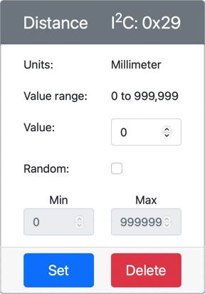

<!--
CO_OP_TRANSLATOR_METADATA:
{
  "original_hash": "7e9f05bdc50a40fd924b1d66934471bf",
  "translation_date": "2025-08-27T20:44:57+00:00",
  "source_file": "4-manufacturing/lessons/4-trigger-fruit-detector/virtual-device-proximity.md",
  "language_code": "sw"
}
-->
# Kugundua Ukaribu - Vifaa vya IoT vya Kijumlisha

Katika sehemu hii ya somo, utaongeza kihisi cha ukaribu kwenye kifaa chako cha IoT cha kijumlisha, na kusoma umbali kutoka kwake.

## Vifaa

Kifaa cha IoT cha kijumlisha kitatumia kihisi cha umbali kilichosimuliwa.

Katika kifaa halisi cha IoT, ungetumia kihisi chenye moduli ya kupima umbali kwa kutumia leza.

### Ongeza kihisi cha umbali kwenye CounterFit

Ili kutumia kihisi cha umbali cha kijumlisha, unahitaji kuongeza kimoja kwenye programu ya CounterFit.

#### Kazi - ongeza kihisi cha umbali kwenye CounterFit

Ongeza kihisi cha umbali kwenye programu ya CounterFit.

1. Fungua msimbo wa `fruit-quality-detector` kwenye VS Code, na hakikisha mazingira ya kijumlisha yamewashwa.

1. Sakinisha kifurushi cha ziada cha Pip ili kusakinisha CounterFit shim inayoweza kuzungumza na vihisi vya umbali kwa kusimulia kifurushi cha [rpi-vl53l0x Pip package](https://pypi.org/project/rpi-vl53l0x/), kifurushi cha Python kinachoshirikiana na [kihisi cha umbali cha VL53L0X](https://wiki.seeedstudio.com/Grove-Time_of_Flight_Distance_Sensor-VL53L0X/). Hakikisha unakifanya hiki kutoka kwenye terminal yenye mazingira ya kijumlisha yamewashwa.

    ```sh
    pip install counterfit-shims-rpi-vl53l0x
    ```

1. Hakikisha programu ya wavuti ya CounterFit inaendelea kufanya kazi.

1. Unda kihisi cha umbali:

    1. Katika kisanduku cha *Create sensor* kwenye paneli ya *Sensors*, shusha kisanduku cha *Sensor type* na uchague *Distance*.

    1. Acha *Units* ziwe `Millimeter`.

    1. Kihisi hiki ni kihisi cha I²C, kwa hivyo weka anwani kuwa `0x29`. Ikiwa ungetumia kihisi halisi cha VL53L0X, kingekuwa na anwani hii tayari.

    1. Chagua kitufe cha **Add** ili kuunda kihisi cha umbali.

    

    Kihisi cha umbali kitaundwa na kitaonekana kwenye orodha ya vihisi.

    

## Programu ya kihisi cha umbali

Kifaa cha IoT cha kijumlisha sasa kinaweza kupangwa kutumia kihisi cha umbali kilichosimuliwa.

### Kazi - panga kihisi cha muda wa kuruka

1. Unda faili mpya kwenye mradi wa `fruit-quality-detector` inayoitwa `distance-sensor.py`.

    > 💁 Njia rahisi ya kusimulia vifaa vingi vya IoT ni kufanya kila kimoja kwenye faili tofauti ya Python, kisha kuviendesha kwa wakati mmoja.

1. Anzisha muunganisho na CounterFit kwa kutumia msimbo ufuatao:

    ```python
    from counterfit_connection import CounterFitConnection
    CounterFitConnection.init('127.0.0.1', 5000)
    ```

1. Ongeza msimbo ufuatao chini ya huu:

    ```python
    import time
    
    from counterfit_shims_rpi_vl53l0x.vl53l0x import VL53L0X
    ```

    Hii inaingiza maktaba ya kihisi shim kwa kihisi cha muda wa kuruka cha VL53L0X.

1. Chini ya hii, ongeza msimbo ufuatao wa kufikia kihisi:

    ```python
    distance_sensor = VL53L0X()
    distance_sensor.begin()
    ```

    Msimbo huu unatangaza kihisi cha umbali, kisha unaanzisha kihisi.

1. Hatimaye, ongeza kitanzi kisicho na mwisho kusoma umbali:

    ```python
    while True:
        distance_sensor.wait_ready()
        print(f'Distance = {distance_sensor.get_distance()} mm')
        time.sleep(1)
    ```

    Msimbo huu unasubiri thamani iwe tayari kusomwa kutoka kwa kihisi, kisha inaichapisha kwenye koni.

1. Endesha msimbo huu.

    > 💁 Usisahau faili hii inaitwa `distance-sensor.py`! Hakikisha unaendesha hii kupitia Python, si `app.py`.

1. Utaona vipimo vya umbali vikionekana kwenye koni. Badilisha thamani kwenye CounterFit ili kuona thamani hii ikibadilika, au tumia thamani za nasibu.

    ```output
    (.venv) ➜  fruit-quality-detector python distance-sensor.py 
    Distance = 37 mm
    Distance = 42 mm
    Distance = 29 mm
    ```

> 💁 Unaweza kupata msimbo huu kwenye folda ya [code-proximity/virtual-iot-device](../../../../../4-manufacturing/lessons/4-trigger-fruit-detector/code-proximity/virtual-iot-device).

😀 Programu yako ya kihisi cha ukaribu imefanikiwa!

---

**Kanusho**:  
Hati hii imetafsiriwa kwa kutumia huduma ya kutafsiri ya AI [Co-op Translator](https://github.com/Azure/co-op-translator). Ingawa tunajitahidi kuhakikisha usahihi, tafadhali fahamu kuwa tafsiri za kiotomatiki zinaweza kuwa na makosa au kutokuwa sahihi. Hati ya asili katika lugha yake ya awali inapaswa kuzingatiwa kama chanzo cha mamlaka. Kwa taarifa muhimu, tafsiri ya kitaalamu ya binadamu inapendekezwa. Hatutawajibika kwa kutoelewana au tafsiri zisizo sahihi zinazotokana na matumizi ya tafsiri hii.