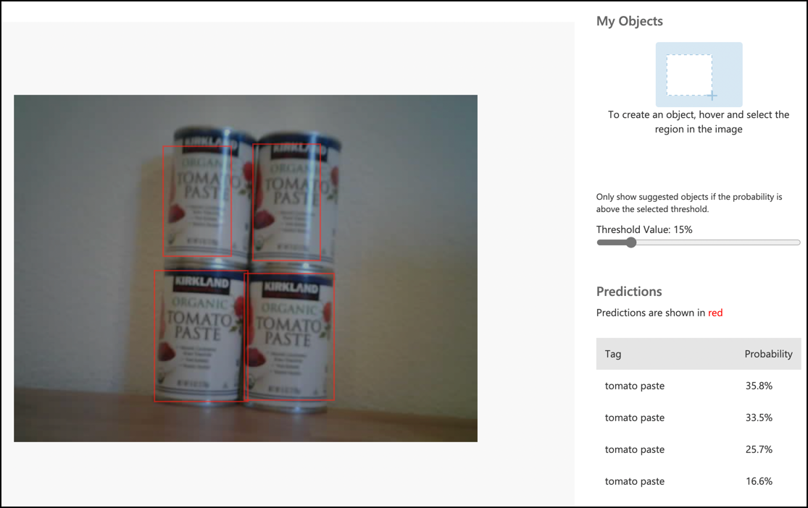

<!--
CO_OP_TRANSLATOR_METADATA:
{
  "original_hash": "a3fdfec1d1e2cb645ea11c2930b51299",
  "translation_date": "2025-08-27T22:46:47+00:00",
  "source_file": "5-retail/lessons/2-check-stock-device/single-board-computer-object-detector.md",
  "language_code": "sw"
}
-->
# Piga simu kwa kigunduzi chako cha vitu kutoka kwa kifaa chako cha IoT - Vifaa vya IoT vya Kijanja na Raspberry Pi

Mara tu kigunduzi chako cha vitu kinapochapishwa, kinaweza kutumika kutoka kwa kifaa chako cha IoT.

## Nakili mradi wa kigunduzi cha picha

Sehemu kubwa ya kigunduzi chako cha hisa ni sawa na kigunduzi cha picha ulichounda katika somo la awali.

### Kazi - nakili mradi wa kigunduzi cha picha

1. Unda folda inayoitwa `stock-counter` kwenye kompyuta yako ikiwa unatumia kifaa cha IoT cha kijanja, au kwenye Raspberry Pi yako. Ikiwa unatumia kifaa cha IoT cha kijanja hakikisha umeanzisha mazingira ya kijanja.

1. Sanidi vifaa vya kamera.

    * Ikiwa unatumia Raspberry Pi utahitaji kufunga PiCamera. Unaweza pia kutaka kuweka kamera katika nafasi moja, kwa mfano, kwa kuning'iniza kebo juu ya sanduku au kopo, au kuifunga kamera kwenye sanduku kwa kutumia mkanda wa pande mbili.
    * Ikiwa unatumia kifaa cha IoT cha kijanja basi utahitaji kusakinisha CounterFit na CounterFit PyCamera shim. Ikiwa utatumia picha tuli, basi piga picha ambazo kigunduzi chako cha vitu hakijaziona bado, ikiwa utatumia kamera ya wavuti hakikisha imewekwa katika njia inayoweza kuona hisa unayogundua.

1. Rudia hatua kutoka [somo la 2 la mradi wa utengenezaji](../../../4-manufacturing/lessons/2-check-fruit-from-device/README.md#task---capture-an-image-using-an-iot-device) ili kunasa picha kutoka kwa kamera.

1. Rudia hatua kutoka [somo la 2 la mradi wa utengenezaji](../../../4-manufacturing/lessons/2-check-fruit-from-device/README.md#task---classify-images-from-your-iot-device) ili kuita kigunduzi cha picha. Sehemu kubwa ya msimbo huu itatumika tena kugundua vitu.

## Badilisha msimbo kutoka kwa kigunduzi cha picha hadi kigunduzi cha vitu

Msimbo uliotumia kugundua picha unafanana sana na msimbo wa kugundua vitu. Tofauti kuu ni njia inayotumika kwenye Custom Vision SDK, na matokeo ya mwito huo.

### Kazi - badilisha msimbo kutoka kwa kigunduzi cha picha hadi kigunduzi cha vitu

1. Futa mistari mitatu ya msimbo inayogundua picha na kuchakata utabiri:

    ```python
    results = predictor.classify_image(project_id, iteration_name, image)
    
    for prediction in results.predictions:
        print(f'{prediction.tag_name}:\t{prediction.probability * 100:.2f}%')
    ```

    Futa mistari hii mitatu.

1. Ongeza msimbo ufuatao kugundua vitu kwenye picha:

    ```python
    results = predictor.detect_image(project_id, iteration_name, image)

    threshold = 0.3
    
    predictions = list(prediction for prediction in results.predictions if prediction.probability > threshold)
    
    for prediction in predictions:
        print(f'{prediction.tag_name}:\t{prediction.probability * 100:.2f}%')
    ```

    Msimbo huu unaita njia ya `detect_image` kwenye predictor ili kuendesha kigunduzi cha vitu. Kisha hukusanya utabiri wote wenye uwezekano juu ya kizingiti, na kuuchapisha kwenye koni.

    Tofauti na kigunduzi cha picha ambacho kinarejesha matokeo moja tu kwa kila lebo, kigunduzi cha vitu kitarudisha matokeo mengi, hivyo yoyote yenye uwezekano mdogo yanapaswa kuchujwa.

1. Endesha msimbo huu na itakamata picha, kupeleka kwa kigunduzi cha vitu, na kuchapisha vitu vilivyogunduliwa. Ikiwa unatumia kifaa cha IoT cha kijanja hakikisha una picha inayofaa imewekwa kwenye CounterFit, au kamera yako ya wavuti imechaguliwa. Ikiwa unatumia Raspberry Pi, hakikisha kamera yako inaelekea kwenye vitu vilivyo kwenye rafu.

    ```output
    pi@raspberrypi:~/stock-counter $ python3 app.py 
    tomato paste:   34.13%
    tomato paste:   33.95%
    tomato paste:   35.05%
    tomato paste:   32.80%
    ```

    > 💁 Unaweza kuhitaji kurekebisha `threshold` hadi thamani inayofaa kwa picha zako.

    Utaweza kuona picha iliyopigwa, na maadili haya kwenye kichupo cha **Predictions** katika Custom Vision.

    

> 💁 Unaweza kupata msimbo huu kwenye folda ya [code-detect/pi](../../../../../5-retail/lessons/2-check-stock-device/code-detect/pi) au [code-detect/virtual-iot-device](../../../../../5-retail/lessons/2-check-stock-device/code-detect/virtual-iot-device).

😀 Programu yako ya kuhesabu hisa imefanikiwa!

---

**Kanusho**:  
Hati hii imetafsiriwa kwa kutumia huduma ya tafsiri ya AI [Co-op Translator](https://github.com/Azure/co-op-translator). Ingawa tunajitahidi kwa usahihi, tafadhali fahamu kuwa tafsiri za kiotomatiki zinaweza kuwa na makosa au kutokuwa sahihi. Hati ya asili katika lugha yake ya awali inapaswa kuzingatiwa kama chanzo cha mamlaka. Kwa taarifa muhimu, inashauriwa kutumia tafsiri ya kitaalamu ya binadamu. Hatutawajibika kwa maelewano mabaya au tafsiri zisizo sahihi zinazotokana na matumizi ya tafsiri hii.