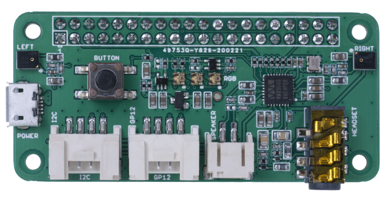
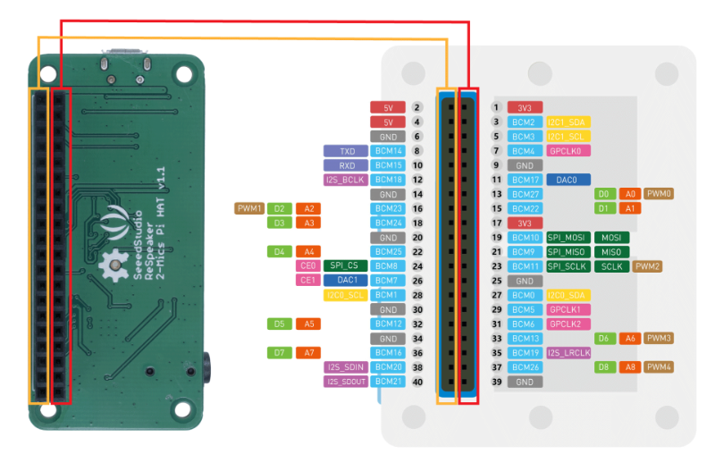

<!--
CO_OP_TRANSLATOR_METADATA:
{
  "original_hash": "93d352de36526b8990e41dd538100324",
  "translation_date": "2025-08-27T21:21:46+00:00",
  "source_file": "6-consumer/lessons/1-speech-recognition/wio-terminal-microphone.md",
  "language_code": "sw"
}
-->
# Sanidi kipaza sauti na spika zako - Wio Terminal

Katika sehemu hii ya somo, utaongeza spika kwenye Wio Terminal yako. Wio Terminal tayari ina kipaza sauti kilichojengwa ndani, ambacho kinaweza kutumika kurekodi sauti.

## Vifaa vya Kifaa

Wio Terminal tayari ina kipaza sauti kilichojengwa ndani, ambacho kinaweza kutumika kurekodi sauti kwa utambuzi wa sauti.

Ili kuongeza spika, unaweza kutumia [ReSpeaker 2-Mics Pi Hat](https://www.seeedstudio.com/ReSpeaker-2-Mics-Pi-HAT.html). Hii ni bodi ya nje yenye vipaza sauti viwili vya MEMS, pamoja na kiunganishi cha spika na tundu la vichwa vya sauti.

Utahitaji kuongeza vichwa vya sauti, spika yenye jack ya 3.5mm, au spika yenye kiunganishi cha JST kama [Mono Enclosed Speaker - 2W 6 Ohm](https://www.seeedstudio.com/Mono-Enclosed-Speaker-2W-6-Ohm-p-2832.html).

Ili kuunganisha ReSpeaker 2-Mics Pi Hat, utahitaji nyaya za jumper za pini-kwa-pini (pia hujulikana kama za kiume-kwa-kiume) zenye pini 40.

> 💁 Ikiwa una uzoefu wa kutumia chuma cha kulehemu, unaweza kutumia [40 Pin Raspberry Pi Hat Adapter Board For Wio Terminal](https://www.seeedstudio.com/40-Pin-Raspberry-Pi-Hat-Adapter-Board-For-Wio-Terminal-p-4730.html) kuunganisha ReSpeaker.

Pia utahitaji kadi ya SD kwa ajili ya kupakua na kucheza sauti. Wio Terminal inasaidia kadi za SD zenye ukubwa wa hadi 16GB pekee, na zinapaswa kuwa na muundo wa FAT32 au exFAT.

### Kazi - unganisha ReSpeaker Pi Hat

1. Ukiwa na Wio Terminal imezimwa, unganisha ReSpeaker 2-Mics Pi Hat kwenye Wio Terminal ukitumia nyaya za jumper na soketi za GPIO nyuma ya Wio Terminal:

    Pini zinapaswa kuunganishwa kwa njia hii:

    

1. Weka ReSpeaker na Wio Terminal zikiwa na soketi za GPIO zikielekea juu, na upande wa kushoto.

1. Anza kutoka soketi ya juu kushoto ya soketi ya GPIO kwenye ReSpeaker. Unganisha waya wa jumper kutoka soketi ya juu kushoto ya ReSpeaker hadi soketi ya juu kushoto ya Wio Terminal.

1. Rudia mchakato huu hadi chini ya soketi za GPIO upande wa kushoto. Hakikisha pini zimeingia vizuri.

    

    

    > 💁 Ikiwa nyaya zako za jumper zimeunganishwa kwenye riboni, ziache pamoja - itakuwa rahisi kuhakikisha umeunganisha nyaya zote kwa mpangilio.

1. Rudia mchakato huu ukitumia soketi za GPIO upande wa kulia wa ReSpeaker na Wio Terminal. Nyaya hizi zinapaswa kupita kuzunguka nyaya ambazo tayari zimeunganishwa.

    

    

    > 💁 Ikiwa nyaya zako za jumper zimeunganishwa kwenye riboni, zigawanye kuwa riboni mbili. Pitisha moja kila upande wa nyaya zilizopo.

    > 💁 Unaweza kutumia mkanda wa gundi kushikilia pini pamoja ili kuzuia zisitoke wakati wa kuziunganisha.

    > 

1. Utahitaji kuongeza spika.

    * Ikiwa unatumia spika yenye waya wa JST, iunganishe kwenye bandari ya JST kwenye ReSpeaker.

      

    * Ikiwa unatumia spika yenye jack ya 3.5mm, au vichwa vya sauti, viingize kwenye tundu la jack ya 3.5mm.

      

### Kazi - sanidi kadi ya SD

1. Unganisha kadi ya SD kwenye kompyuta yako, ukitumia kisomaji cha nje ikiwa huna tundu la kadi ya SD.

1. Fomati kadi ya SD ukitumia zana inayofaa kwenye kompyuta yako, ukihakikisha unatumia mfumo wa faili wa FAT32 au exFAT.

1. Ingiza kadi ya SD kwenye tundu la kadi ya SD upande wa kushoto wa Wio Terminal, chini ya kitufe cha kuwasha. Hakikisha kadi imeingia kabisa na kubofya - unaweza kuhitaji chombo chembamba au kadi nyingine ya SD kusaidia kuisukuma hadi mwisho.

    

    > 💁 Ili kutoa kadi ya SD, unahitaji kuisukuma kidogo na itatoka. Utahitaji chombo chembamba kama bisibisi ya kichwa bapa au kadi nyingine ya SD kufanya hivyo.

---

**Kanusho**:  
Hati hii imetafsiriwa kwa kutumia huduma ya kutafsiri ya AI [Co-op Translator](https://github.com/Azure/co-op-translator). Ingawa tunajitahidi kuhakikisha usahihi, tafadhali fahamu kuwa tafsiri za kiotomatiki zinaweza kuwa na makosa au kutokuwa sahihi. Hati ya asili katika lugha yake ya awali inapaswa kuzingatiwa kama chanzo cha mamlaka. Kwa taarifa muhimu, tafsiri ya kitaalamu ya binadamu inapendekezwa. Hatutawajibika kwa kutoelewana au tafsiri zisizo sahihi zinazotokana na matumizi ya tafsiri hii.