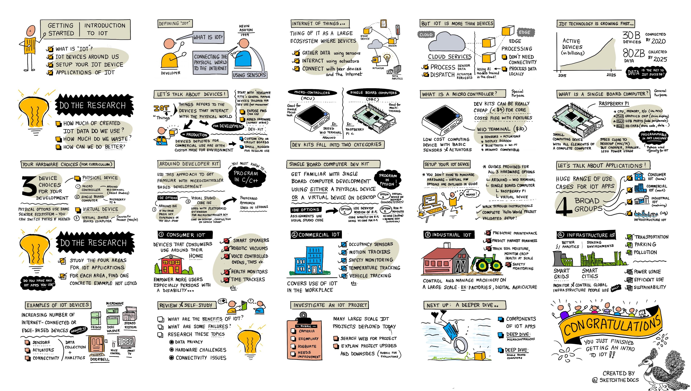

<!--
CO_OP_TRANSLATOR_METADATA:
{
  "original_hash": "9bae08314d8487cb76ddf3d8797e1544",
  "translation_date": "2025-10-11T11:27:00+00:00",
  "source_file": "1-getting-started/lessons/1-introduction-to-iot/README.md",
  "language_code": "ta"
}
-->
# IoT அறிமுகம்

> சித்திரம்: [நித்யா நரசிம்மன்](https://github.com/nitya). பெரிய பதிப்பை பார்க்க படத்தை கிளிக் செய்யவும்.

இந்த பாடம் [Hello IoT series](https://youtube.com/playlist?list=PLmsFUfdnGr3xRts0TIwyaHyQuHaNQcb6-) என்ற தொடரின் ஒரு பகுதியாக [Microsoft Reactor](https://developer.microsoft.com/reactor/?WT.mc_id=academic-17441-jabenn) மூலம் கற்பிக்கப்பட்டது. இந்த பாடம் இரண்டு வீடியோக்களாக கற்பிக்கப்பட்டது - ஒரு மணி நேர பாடம் மற்றும் பாடத்தின் பகுதிகளை ஆழமாக ஆராய்ந்து கேள்விகளுக்கு பதிலளிக்கும் ஒரு மணி நேர அலுவலக நேரம்.

> 🎥 மேலே உள்ள படங்களை கிளிக் செய்து வீடியோக்களை பாருங்கள்

## பாடத்திற்கு முன் வினாடி வினா

[பாடத்திற்கு முன் வினாடி வினா](https://black-meadow-040d15503.1.azurestaticapps.net/quiz/1)

## அறிமுகம்

இந்த பாடம் Internet of Things (IoT) பற்றிய அடிப்படை தலைப்புகளை கையாளுகிறது மற்றும் உங்கள் ஹார்ட்வேரை அமைக்க உதவுகிறது.

இந்த பாடத்தில் நாம் கையாளப்போகிறோம்:

* [‘Internet of Things’ என்றால் என்ன?](../../../../../1-getting-started/lessons/1-introduction-to-iot)
* [IoT சாதனங்கள்](../../../../../1-getting-started/lessons/1-introduction-to-iot)
* [உங்கள் சாதனத்தை அமைக்கவும்](../../../../../1-getting-started/lessons/1-introduction-to-iot)
* [IoT பயன்பாடுகள்](../../../../../1-getting-started/lessons/1-introduction-to-iot)
* [உங்கள் சுற்றியுள்ள IoT சாதனங்களின் உதாரணங்கள்](../../../../../1-getting-started/lessons/1-introduction-to-iot)

## ‘Internet of Things’ என்றால் என்ன?

‘Internet of Things’ என்ற சொல் [Kevin Ashton](https://wikipedia.org/wiki/Kevin_Ashton) என்பவரால் 1999-ல் உருவாக்கப்பட்டது. இது சென்சார்கள் மூலம் இணையத்தை உட்புற உலகத்துடன் இணைப்பதை குறிக்கிறது. அதன் பிறகு, இந்த சொல், சென்சார்கள் மூலம் தரவுகளை சேகரிக்கவோ அல்லது செயல்பாட்டாளர்கள் (actuators) மூலம் உண்மையான உலக தொடர்புகளை வழங்கவோ, பொதுவாக மற்ற சாதனங்கள் அல்லது இணையத்துடன் இணைக்கப்பட்ட சாதனங்களை விவரிக்க பயன்படுத்தப்படுகிறது.

> **சென்சார்கள்** உலகத்திலிருந்து தகவல்களை சேகரிக்கின்றன, உதாரணமாக வேகம், வெப்பநிலை அல்லது இடத்தை அளவிடுதல்.
>
> **செயல்பாட்டாளர்கள்** மின்சிக்னல்களை உண்மையான உலக தொடர்புகளாக மாற்றுகின்றன, உதாரணமாக ஒரு சுவிட்சை இயக்குதல், விளக்குகளை ஏற்றுதல், ஒலிகளை உருவாக்குதல் அல்லது மற்ற ஹார்ட்வேருக்கு கட்டுப்பாட்டு சிக்னல்களை அனுப்புதல்.

IoT என்பது சாதனங்களை விட அதிகமானது - இது சென்சார் தரவுகளை செயலாக்கவோ அல்லது IoT சாதனங்களுடன் இணைக்கப்பட்ட செயல்பாட்டாளர்களுக்கு கோரிக்கைகளை அனுப்பவோ முடியும் மேக அடிப்படையிலான சேவைகளை உள்ளடக்கியது. இது இணைய இணைப்பு இல்லாத அல்லது தேவையற்ற சாதனங்களையும் (edge devices) உள்ளடக்கியது. இவை மேகத்தில் பயிற்றுவிக்கப்பட்ட AI மாதிரிகளைப் பயன்படுத்தி சென்சார் தரவுகளை செயலாக்கி பதிலளிக்க முடியும்.

IoT என்பது வேகமாக வளர்ந்து வரும் தொழில்நுட்ப துறையாகும். 2020 இறுதியில், 30 பில்லியன் IoT சாதனங்கள் இணையத்துடன் இணைக்கப்பட்டன என்று மதிப்பிடப்பட்டது. எதிர்காலத்தை நோக்கி, 2025-க்குள் IoT சாதனங்கள் 80 zettabytes அல்லது 80 டிரில்லியன் கிகாபைட்டுகள் அளவிலான தரவுகளை சேகரிக்கும் என்று மதிப்பிடப்பட்டுள்ளது. இது மிகுந்த அளவிலான தரவாகும்!

✅ சிறு ஆராய்ச்சி செய்யுங்கள்: IoT சாதனங்கள் உருவாக்கும் தரவுகளில் எவ்வளவு பயன்படுத்தப்படுகிறது, எவ்வளவு வீணாகிறது? ஏன் இவ்வளவு தரவுகள் புறக்கணிக்கப்படுகின்றன?

இந்த தரவுதான் IoT-யின் வெற்றியின் முக்கிய அம்சமாகும். ஒரு வெற்றிகரமான IoT டெவலப்பராக இருக்க, நீங்கள் சேகரிக்க வேண்டிய தரவுகளைப் புரிந்துகொள்ள வேண்டும், அதை எப்படி சேகரிக்க வேண்டும், அதைப் பயன்படுத்தி முடிவுகளை எடுக்க வேண்டும், மேலும் அவற்றை உட்புற உலகத்துடன் தொடர்பு கொள்ள பயன்படுத்த வேண்டும்.

## IoT சாதனங்கள்

IoT-யில் உள்ள **T** என்பது **Things**-ஐ குறிக்கிறது - சென்சார்கள் மூலம் தரவுகளை சேகரிக்கவோ அல்லது செயல்பாட்டாளர்கள் மூலம் உண்மையான உலக தொடர்புகளை வழங்கவோ உட்புற உலகத்துடன் தொடர்பு கொள்ளும் சாதனங்கள்.

உற்பத்தி அல்லது வணிக பயன்பாட்டிற்கான சாதனங்கள், உதாரணமாக பயனர் உடற்பயிற்சி டிராக்கர்கள் அல்லது தொழில்துறை இயந்திர கட்டுப்படுத்திகள், பொதுவாக தனிப்பயன் தயாரிப்புகளாக இருக்கும். இவை குறிப்பிட்ட பணிக்கான தேவைகளை பூர்த்தி செய்ய தனிப்பயன் சிர்க்யூட் போர்டுகள் அல்லது தனிப்பயன் செயலிகள் பயன்படுத்துகின்றன, உதாரணமாக கைகளில் பொருத்தும் அளவுக்கு சிறியதாக இருக்க வேண்டும் அல்லது அதிக வெப்பநிலை, அதிக அழுத்தம் அல்லது அதிக அதிர்வு கொண்ட தொழிற்சாலை சூழலில் செயல்பட வலுவாக இருக்க வேண்டும்.

IoT பற்றி கற்றுக்கொள்வதற்கோ அல்லது சாதனத்தின் மாதிரியை உருவாக்குவதற்கோ ஒரு டெவலப்பர் கிட் தேவைப்படும். இவை டெவலப்பர்களுக்கு பயன்படுத்த வடிவமைக்கப்பட்ட பொதுவான IoT சாதனங்கள், பொதுவாக உற்பத்தி சாதனத்தில் இருக்காத அம்சங்களுடன் இருக்கும், உதாரணமாக சென்சார்கள் அல்லது செயல்பாட்டாளர்களை இணைக்க வெளிப்புற பின்கள், டிபகிங் ஆதரவு அல்லது அதிக உற்பத்தி செலவுகளைத் தவிர்க்க கூடுதல் வளங்கள்.

இந்த டெவலப்பர் கிட்கள் பொதுவாக இரண்டு வகைகளாக பிரிக்கப்படுகின்றன - மைக்ரோகண்ட்ரோலர்கள் மற்றும் சிங்கிள்-போர்டு கணினிகள். இவை இங்கு அறிமுகப்படுத்தப்படும், மேலும் அடுத்த பாடத்தில் விரிவாக ஆராயப்படும்.

> 💁 உங்கள் தொலைபேசியும் சென்சார்கள் மற்றும் செயல்பாட்டாளர்களுடன் பொதுவான IoT சாதனமாக கருதப்படலாம், பல்வேறு செயலிகள் சென்சார்கள் மற்றும் செயல்பாட்டாளர்களை பல்வேறு வழிகளில் பயன்படுத்தி மேக சேவைகளுடன் இணைக்கின்றன. சில IoT டுடோரியல்களில் தொலைபேசி செயலியை IoT சாதனமாக பயன்படுத்தும் வழிமுறைகளையும் காணலாம்.

### மைக்ரோகண்ட்ரோலர்கள்

மைக்ரோகண்ட்ரோலர் (MCU, microcontroller unit எனவும் அழைக்கப்படுகிறது) என்பது ஒரு சிறிய கணினி, இது கீழ்க்காணும் கூறுகளை கொண்டுள்ளது:

🧠 ஒரு அல்லது அதற்கு மேற்பட்ட மைய செயலிகள் (CPUs) - மைக்ரோகண்ட்ரோலரின் 'மூளை', இது உங்கள் நிரல்களை இயக்குகிறது

💾 நினைவகம் (RAM மற்றும் நிரல் நினைவகம்) - உங்கள் நிரல், தரவுகள் மற்றும் மாறிகள் சேமிக்கப்படும் இடம்

🔌 நிரல்படுத்தக்கூடிய உள்ளீடு/வெளியீட்டு (I/O) இணைப்புகள் - சென்சார்கள் மற்றும் செயல்பாட்டாளர்கள் போன்ற வெளிப்புற சாதனங்களுடன் தொடர்பு கொள்ள

மைக்ரோகண்ட்ரோலர்கள் பொதுவாக குறைந்த செலவுடைய கணினி சாதனங்கள், தனிப்பயன் ஹார்ட்வேரில் பயன்படுத்தப்படும் சாதனங்களின் சராசரி விலை US$0.50 வரை குறைந்து, சில சாதனங்கள் US$0.03 வரை குறைவாக இருக்கின்றன. டெவலப்பர் கிட்கள் US$4 முதல் தொடங்கலாம், மேலும் அம்சங்களைச் சேர்க்கும்போது செலவுகள் அதிகரிக்கின்றன. [Wio Terminal](https://www.seeedstudio.com/Wio-Terminal-p-4509.html), [Seeed studios](https://www.seeedstudio.com) நிறுவனத்தின் மைக்ரோகண்ட்ரோலர் டெவலப்பர் கிட், சென்சார்கள், செயல்பாட்டாளர்கள், WiFi மற்றும் திரையுடன் US$30 வரை செலவாகும்.

> 💁 மைக்ரோகண்ட்ரோலர்களை இணையத்தில் தேடும்போது **MCU** என்ற சொல் தேடுவதில் கவனமாக இருங்கள், இது Marvel Cinematic Universe பற்றிய பல முடிவுகளைத் தரும், மைக்ரோகண்ட்ரோலர்களை அல்ல.

மைக்ரோகண்ட்ரோலர்கள் குறிப்பிட்ட சில பணிகளைச் செய்ய நிரல்படுத்தப்படுகின்றன, பொதுவான கணினிகள் போல அல்ல. மிகவும் குறிப்பிட்ட சூழல்களைத் தவிர, நீங்கள் மானிட்டர், கீபோர்டு மற்றும் மவுஸ் இணைத்து பொதுவான பணிகளைச் செய்ய முடியாது.

மைக்ரோகண்ட்ரோலர் டெவலப்பர் கிட்கள் பொதுவாக கூடுதல் சென்சார்கள் மற்றும் செயல்பாட்டாளர்களுடன் வருகிறது. பெரும்பாலான போர்டுகளில் நீங்கள் நிரல்படுத்தக்கூடிய ஒரு அல்லது அதற்கு மேற்பட்ட LEDகள் இருக்கும், மேலும் பல்வேறு உற்பத்தியாளர்களின் எகோசிஸ்டம் அல்லது பொதுவான சென்சார்கள் (பொதுவாக வெப்பநிலை சென்சார்கள் போன்றவை) பயன்படுத்துவதற்கான ஸ்டாண்டர்ட் பிளக்கள் அல்லது கட்டமைக்கப்பட்ட சென்சார்கள் இருக்கும். சில மைக்ரோகண்ட்ரோலர்களில் Bluetooth அல்லது WiFi போன்ற இணைப்பு உள்ளடங்கியிருக்கும் அல்லது இந்த இணைப்பைச் சேர்க்க கூடுதல் மைக்ரோகண்ட்ரோலர்கள் போர்டில் இருக்கும்.

> 💁 மைக்ரோகண்ட்ரோலர்கள் பொதுவாக C/C++ மொழியில் நிரல்படுத்தப்படுகின்றன.

### சிங்கிள்-போர்டு கணினிகள்

சிங்கிள்-போர்டு கணினி என்பது ஒரு சிறிய கணினி சாதனம், இது ஒரு சிறிய போர்டில் முழுமையான கணினியின் அனைத்து கூறுகளையும் கொண்டுள்ளது. இவை டெஸ்க்டாப் அல்லது லேப்டாப் PC அல்லது Mac போன்ற சிறிய, குறைந்த சக்தி பயன்படுத்தும், மற்றும் மிகவும் குறைந்த விலை கொண்ட சாதனங்கள்.

Raspberry Pi என்பது மிகவும் பிரபலமான சிங்கிள்-போர்டு கணினிகளில் ஒன்றாகும்.

மைக்ரோகண்ட்ரோலர் போல, சிங்கிள்-போர்டு கணினிகளிலும் CPU, நினைவகம் மற்றும் உள்ளீடு/வெளியீட்டு பின்கள் உள்ளன, ஆனால் இவை கூடுதல் அம்சங்களை கொண்டுள்ளது, உதாரணமாக மானிட்டர்கள், ஆடியோ அவுட்புட்கள் மற்றும் USB போர்டுகளை இணைக்க அனுமதிக்கும் கிராபிக்ஸ் சிப். நிரல்கள் SD கார்டுகள் அல்லது ஹார்டு டிரைவ்களில் சேமிக்கப்படும், மற்றும் ஒரு ஆபரேட்டிங் சிஸ்டம், போர்டில் உள்ள நினைவக சிப் பதிலாக.

> 🎓 சிங்கிள்-போர்டு கணினி என்பது நீங்கள் இதைப் படிக்கிற PC அல்லது Mac-இன் சிறிய, குறைந்த விலை பதிப்பாகும், மேலும் சென்சார்கள் மற்றும் செயல்பாட்டாளர்களுடன் தொடர்பு கொள்ள GPIO (general-purpose input/output) பின்கள் சேர்க்கப்பட்டுள்ளது.

சிங்கிள்-போர்டு கணினிகள் முழுமையான கணினிகள், எனவே எந்த மொழியிலும் நிரல்படுத்தலாம். IoT சாதனங்கள் பொதுவாக Python மொழியில் நிரல்படுத்தப்படுகின்றன.

### மீதமுள்ள பாடங்களுக்கான ஹார்ட்வேரின் தேர்வு

மீதமுள்ள பாடங்கள் அனைத்தும் IoT சாதனத்தை உட்புற உலகத்துடன் தொடர்பு கொள்ள மற்றும் மேகத்துடன் தொடர்பு கொள்ள பயன்படுத்தும் பணிகளை உள்ளடக்கியது. ஒவ்வொரு பாடமும் 3 சாதனத் தேர்வுகளை ஆதரிக்கிறது - Arduino (Seeed Studios Wio Terminal பயன்படுத்தி), அல்லது சிங்கிள்-போர்டு கணினி, ஒரு பிசிகல் சாதனம் (Raspberry Pi 4) அல்லது உங்கள் PC அல்லது Mac-இல் இயங்கும் ஒரு மெய்நிகர் சிங்கிள்-போர்டு கணினி.

அனைத்து பணிகளை முடிக்க தேவையான ஹார்ட்வேரைப் பற்றிய விவரங்களை [ஹார்ட்வேர் வழிகாட்டி](../../../hardware.md)யில் படிக்கலாம்.

> 💁 நீங்கள் எந்த IoT ஹார்ட்வேரையும் வாங்க தேவையில்லை, அனைத்து பணிகளையும் மெய்நிகர் சிங்கிள்-போர்டு கணினி மூலம் செய்யலாம்.

எந்த ஹார்ட்வேரை தேர்வு செய்வது என்பது உங்கள் வீட்டில் அல்லது பள்ளியில் உள்ளதைப் பொறுத்தது, மேலும் நீங்கள் அறிந்த அல்லது கற்றுக்கொள்ள திட்டமிட்டுள்ள நிரல்படுத்தல் மொழியைப் பொறுத்தது. இரண்டு ஹார்ட்வேர்வகைகளும் ஒரே சென்சார் எகோசிஸ்டத்தைப் பயன்படுத்தும், எனவே நீங்கள் ஒரு பாதையில் தொடங்கினால், மற்றதிற்கு மாறலாம், பெரும்பாலான கிட்களை மாற்றாமல். மெய்நிகர் சிங்கிள்-போர்டு கணினி Raspberry Pi-யில் கற்றுக்கொள்வதற்கான சமமானது, மேலும் நீங்கள் சாதனமும் சென்சார்களும் பெறினால், பெரும்பாலான குறியீடுகள் Pi-க்கு மாற்றக்கூடியதாக இருக்கும்.

### Arduino டெவலப்பர் கிட்

மைக்ரோகண்ட்ரோலர் டெவலப்ப்மெண்ட் கற்றுக்கொள்ள ஆர்வமாக இருந்தால், நீங்கள் Arduino சாதனத்தைப் பயன்படுத்தி பணிகளை முடிக்கலாம். C/C++ நிரல்படுத்தல் பற்றிய அடிப்படை அறிவு தேவைப்படும், ஏனெனில் பாடங்கள் Arduino framework, பயன்படுத்தப்படும் சென்சார்கள் மற்றும் செயல்பாட்டாளர்கள், மற்றும் மேகத்துடன் தொடர்பு கொள்ளும் நூலகங்கள் தொடர்பான குறியீடுகளை மட்டுமே கற்பிக்கும்.

பணிகள் [Visual Studio Code](https://code.visualstudio.com/?WT.mc_id=academic-17441-jabenn) மற்றும் [PlatformIO மைக்ரோகண்ட்ரோலர் டெவலப்ப்மெண்ட் நீட்டிப்பு](https://platformio.org) பயன்படுத்தும். நீங்கள் இந்த கருவியில் அனுபவம் பெற்றிருந்தால் Arduino IDE-யை பயன்படுத்தலாம், ஏனெனில் வழிமுறைகள் வழங்கப்படமாட்டாது.

### சிங்கிள்-போர்டு கணினி டெவலப்பர் கிட்

சிங்கிள்-போர்டு கணினிகளைப் பயன்படுத்தி IoT டெவலப்ப்மெண்ட் கற்றுக்கொள்ள ஆர்வமாக இருந்தால், நீங்கள் Raspberry Pi அல்லது உங்கள் PC அல்லது Mac-இல் இயங்கும் மெய்நிகர் சாதனத்தைப் பயன்படுத்தி பணிகளை முடிக்கலாம்.

Python நிரல்படுத்தல் பற்றிய அடிப்படை அறிவு தேவைப்படும், ஏனெனில் பாடங்கள் சென்சார்கள் மற்றும் செயல்பாட்டாளர்கள், மற்றும் மேகத்துடன் தொடர்பு கொள்ளும் நூலகங்கள் தொடர்பான குறியீடுகளை மட்டுமே கற்பிக்கும்.

> 💁 Python மொழியில் நிரல்படுத்த கற்றுக்கொள்ள விரும்பினால், கீழே உள்ள இரண்டு வீடியோ தொடர்களை பாருங்கள்:
>
> * [Python for beginners](https://channel9.msdn.com/Series/Intro-to-Python-Development?WT.mc_id=academic-17441-jabenn)
> * [More Python for beginners](https://channel9.msdn.com/Series/More-Python-for-Beginners?WT.mc_id=academic-7372-jabenn)

பணிகள் [Visual Studio Code](https://code.visualstudio.com/?WT.mc_id=academic-17441-jabenn) பயன்படுத்தும்.

நீங்கள் Raspberry Pi பயன்படுத்தினால், Raspberry Pi OS-இன் முழு டெஸ்க்டாப் பதிப்பைப் பயன்படுத்தி உங்கள் Pi-யை இயக்கலாம், மேலும் [Raspberry Pi OS பதிப்பில் உள்ள VS Code](https://code.visualstudio.com/docs/setup/raspberry-pi?WT.mc_id=academic-17441-jabenn) பயன்படுத்தி Pi-யில் நேரடியாக குறியீடுகளை எழுதலாம். அல்லது உங்கள் Pi-யை headless சாதனமாக இயக்கி, [Remote SSH நீட்டிப்பு](https://code.visualstudio.com/docs/remote/ssh?WT.mc_id=academic-17441-jabenn) பயன்படுத்தி உங்கள் PC அல்லது Mac-இல் இருந்து குறியீடுகளை எழுதலாம், இது Pi-யில் நேரடியாக குறியீடுகளை எழுதுவது போல செயல்பட உதவுகிறது.

மெய்நிகர் சாதனத்தைப் பயன்படுத்தினால், நீங்கள் உங்கள் கணினியில் நேரடியாக குறியீடுகளை எழுதுவீர்கள். சென்சார்கள் மற்றும் செயல்பாட்டாளர்களை அணுகுவதற்குப் பதிலாக, நீங்கள் சென்சார் மதிப்புகளை வரையறுக்கவும், செயல்பாட்டாளர்களின் முடிவுகளை திரையில் காண்பிக்கவும் ஒரு கருவியைப் பயன்படுத்துவீர்கள்.

## உங்கள் சாதனத்தை அமைக்கவும்

உங்கள் IoT சாதனத்தை நிரல்படுத்த தொடங்குவதற்கு முன், சிறு அளவிலான அமைப்பைச் செய்ய வேண்டும். நீங்கள் எந்த சாதனத்தைப் பயன்படுத்தப் போகிறீர்கள் என்பதைப் பொறுத்து கீழே உள்ள தொடர்புடைய வழிமுறைகளைப் பின்பற்றவும்.

> 💁 உங்கள் சாதனம் இன்னும் இல்லையெனில், [ஹார்ட்வேர்
உங்கள் சாதனத்தை அமைத்து 'Hello World' திட்டத்தை முடிக்க தொடர்புடைய வழிகாட்டியைப் பின்பற்றுங்கள். இது IoT இரவுத் விளக்கை உருவாக்குவதற்கான முதல் படியாகும், இந்த தொடக்கப் பகுதியில் உள்ள 4 பாடங்களில்.

* [Arduino - Wio Terminal](wio-terminal.md)
* [Single-board computer - Raspberry Pi](pi.md)
* [Single-board computer - Virtual device](virtual-device.md)

✅ நீங்கள் Arduino மற்றும் Single-board கணினிகளுக்காக VS Code ஐப் பயன்படுத்துவீர்கள். இதை முன்பாகப் பயன்படுத்தவில்லை என்றால், [VS Code தளத்தில்](https://code.visualstudio.com?WT.mc_id=academic-17441-jabenn) இதைப் பற்றி மேலும் படிக்கவும்.

## IoT பயன்பாடுகள்

IoT பல்வேறு பயன்பாடுகளை உள்ளடக்கியது, சில பரந்த பிரிவுகளில்:

* நுகர்வோர் IoT
* வணிக IoT
* தொழில்துறை IoT
* உட்கட்டமைப்பு IoT

✅ சிறு ஆராய்ச்சி செய்யுங்கள்: கீழே விவரிக்கப்பட்டுள்ள பகுதிகளுக்கு, உரையில் கொடுக்கப்படாத ஒரு தெளிவான உதாரணத்தைத் தேடுங்கள்.

### நுகர்வோர் IoT

நுகர்வோர் IoT என்பது வீட்டில் பயன்படுத்த நுகர்வோர் வாங்கும் IoT சாதனங்களை குறிக்கிறது. இந்த சாதனங்களில் சில மிகவும் பயனுள்ளதாக உள்ளன, உதாரணமாக ஸ்மார்ட் ஸ்பீக்கர்கள், ஸ்மார்ட் ஹீட்டிங் அமைப்புகள் மற்றும் ரோபோடிக் வெக்யூம் கிளீனர். மற்றவை அதன் பயன்தன்மையில் சந்தேகத்திற்கிடமாக இருக்கலாம், உதாரணமாக குரல் கட்டுப்பாட்டில் செயல்படும் துடைப்பங்கள், அவற்றை நிறுத்த முடியாத நிலைக்கு கொண்டு செல்லும், ஏனெனில் ஓடும் தண்ணீரின் சத்தத்தால் குரல் கட்டுப்பாட்டை கேட்க முடியாது.

நுகர்வோர் IoT சாதனங்கள், குறிப்பாக 1 பில்லியன் மாற்றுத்திறனாளிகளுக்கு, அவர்களின் சூழலில் மேலும் பலவற்றை அடைய உதவுகின்றன. ரோபோடிக் வெக்யூம் கிளீனர், தானாகவே தரை சுத்தம் செய்யும், இது தானாகவே சுத்தம் செய்ய முடியாத இயக்கம் குறைந்தவர்களுக்கு உதவுகிறது. குரல் கட்டுப்பாட்டில் செயல்படும் அடுப்புகள், குறைந்த பார்வை அல்லது இயக்கக் கட்டுப்பாட்டுள்ளவர்களுக்கு, குரலின் மூலம் அடுப்பை சூடாக்க அனுமதிக்கின்றன. ஆரோக்கிய கண்காணிப்புகள், நோயாளிகளுக்கு தங்களது நிலையை அடிக்கடி மற்றும் விரிவான தகவல்களுடன் கண்காணிக்க உதவுகின்றன. இவை இவ்வளவு பரவலாக உள்ளன, இளம் குழந்தைகளும் கூட COVID தொற்றுநோயின் போது, ஸ்மார்ட் ஹோம் சாதனங்களில் டைமர்களை அமைத்து, பள்ளி வேலைகளை கண்காணிக்க அல்லது வரவிருக்கும் வகுப்புக் கூட்டங்களை நினைவூட்ட அலாரங்களை அமைக்கின்றனர்.

✅ உங்கள் வீட்டில் அல்லது உடலில் உள்ள நுகர்வோர் IoT சாதனங்கள் என்ன?

### வணிக IoT

வணிக IoT என்பது வேலை இடங்களில் IoT பயன்பாட்டை உள்ளடக்கியது. அலுவலக சூழலில், ஒளி மற்றும் வெப்பத்தை நிர்வகிக்க ஆக்கபூர்வமான சென்சார்கள் மற்றும் இயக்க கண்டறியிகள் இருக்கலாம், தேவையில்லாத நேரங்களில் ஒளி மற்றும் வெப்பத்தை அணைக்க, செலவுகளை மற்றும் கார்பன் உமிழ்வுகளை குறைக்க. தொழிற்சாலையில், IoT சாதனங்கள் பாதுகாப்பு அபாயங்களை கண்காணிக்க உதவுகின்றன, உதாரணமாக தொழிலாளர்கள் கடின தொப்பிகள் அணியாதது அல்லது ஆபத்தான அளவுக்கு சத்தம் அதிகரித்தது. சில்லறை வணிகத்தில், IoT சாதனங்கள் குளிர் சேமிப்பகத்தின் வெப்பநிலையை அளக்க, ஒரு ஃப்ரிட்ஜ் அல்லது ஃப்ரீசர் தேவையான வெப்பநிலை வரம்புக்கு வெளியே இருந்தால் கடை உரிமையாளரை எச்சரிக்க, அல்லது தட்டுகளில் உள்ள பொருட்களை கண்காணிக்க, விற்ற பொருட்களை நிரப்ப ஊழியர்களை வழிநடத்த உதவுகின்றன. போக்குவரத்து துறை, வாகன இடங்களை கண்காணிக்க, சாலையில் மைலேஜ் கண்காணிக்க, ஓட்டுநர் நேரம் மற்றும் இடைவெளி இணக்கத்தை கண்காணிக்க, அல்லது ஒரு வாகனம் டெப்போவுக்கு அணுகும்போது ஊழியர்களுக்கு அறிவிக்க, ஏற்றுதல் அல்லது இறக்குதலுக்கு தயாராக IoT சாதனங்களை அதிகமாக நம்புகிறது.

✅ உங்கள் பள்ளி அல்லது வேலை இடத்தில் உள்ள வணிக IoT சாதனங்கள் என்ன?

### தொழில்துறை IoT (IIoT)

தொழில்துறை IoT, அல்லது IIoT, என்பது IoT சாதனங்களை பெரிய அளவில் இயந்திரங்களை கட்டுப்படுத்த மற்றும் நிர்வகிக்க பயன்படுத்துவதை குறிக்கிறது. இது தொழிற்சாலைகள் முதல் டிஜிட்டல் வேளாண்மை வரை பல்வேறு பயன்பாடுகளை உள்ளடக்கியது.

தொழிற்சாலைகள் IoT சாதனங்களை பல்வேறு வழிகளில் பயன்படுத்துகின்றன. இயந்திரங்கள் வெப்பநிலை, அதிர்வு மற்றும் சுழற்சி வேகம் போன்றவற்றை கண்காணிக்க பல சென்சார்களுடன் கண்காணிக்கப்படுகின்றன. இந்த தரவுகள் கண்காணிக்கப்பட்டு, இயந்திரம் குறிப்பிட்ட பொறுமைகளுக்கு வெளியே சென்றால் நிறுத்தப்படலாம் - உதாரணமாக, அது மிகவும் சூடாக இயங்கினால், அது தானாகவே நிறுத்தப்படும். இந்த தரவுகள் காலப்போக்கில் சேகரிக்கப்பட்டு, முன்னறிவிப்பு பராமரிப்பு செய்ய பயன்படுத்தப்படலாம், AI மாதிரிகள் தோல்விக்கு முன்னால் தரவுகளைப் பார்ப்பதன் மூலம், மற்ற தோல்விகளை அவை நிகழ்வதற்கு முன் கணிக்க உதவுகின்றன.

டிஜிட்டல் வேளாண்மை, குறிப்பாக 500 மில்லியன் குடும்பங்களில் உள்ள 2 பில்லியன் மக்கள் [தன்னிறைவு வேளாண்மை](https://wikipedia.org/wiki/Subsistence_agriculture) மூலம் வாழ்வதற்கு, வளர்ந்துவரும் மக்கள் தொகையை உணவளிக்க முக்கியமானது. டிஜிட்டல் வேளாண்மை சில டாலர் சென்சார்களிலிருந்து பெரிய வணிக அமைப்புகளுக்கு மாறுபடுகிறது. ஒரு விவசாயி வெப்பநிலைகளை கண்காணித்து, [வளர்ச்சி டிகிரி நாட்கள்](https://wikipedia.org/wiki/Growing_degree-day) பயன்படுத்தி, ஒரு பயிர் அறுவடைக்கு தயாராக இருக்கும் நேரத்தை கணிக்கலாம். மண் ஈரப்பதம் கண்காணிப்பை தானியங்கி நீர்ப்பாசன அமைப்புகளுடன் இணைத்து, தங்கள் பயிர்களுக்கு தேவையான அளவு தண்ணீரை வழங்கலாம், ஆனால் அதிகமாக இல்லை, தங்கள் பயிர்கள் வறண்டு போகாமல் தண்ணீரை வீணாக்காமல் இருக்க. விவசாயிகள் கூட அதை மேலும் எடுத்துச் சென்று, டிரோன்கள், செயற்கைக்கோள் தரவுகள் மற்றும் AI பயன்படுத்தி, பெரிய விவசாய நிலங்களில் பயிர் வளர்ச்சி, நோய் மற்றும் மண் தரத்தை கண்காணிக்கின்றனர்.

✅ விவசாயிகளுக்கு உதவக்கூடிய மற்ற IoT சாதனங்கள் என்ன?

### உட்கட்டமைப்பு IoT

உட்கட்டமைப்பு IoT என்பது மக்கள் தினமும் பயன்படுத்தும் உள்ளூர் மற்றும் உலகளாவிய உட்கட்டமைப்புகளை கண்காணித்து, கட்டுப்படுத்துவதை குறிக்கிறது.

[ஸ்மார்ட் நகரங்கள்](https://wikipedia.org/wiki/Smart_city) என்பது IoT சாதனங்களைப் பயன்படுத்தி நகரத்தைப் பற்றிய தரவுகளை சேகரித்து, நகரம் எப்படி இயங்குகிறது என்பதை மேம்படுத்தும் நகர்ப்புற பகுதிகள். இந்த நகரங்கள் பொதுவாக உள்ளூர் அரசாங்கங்கள், கல்வி மற்றும் உள்ளூர் வணிகங்களின் ஒத்துழைப்புடன் இயக்கப்படுகின்றன, போக்குவரத்து முதல் நிறுத்தம் மற்றும் மாசு வரை பலவற்றை கண்காணித்து, நிர்வகிக்கின்றன. உதாரணமாக, டென்மார்க்கின் கோபன்ஹேகன் நகரத்தில், காற்று மாசு உள்ளூர் குடிமக்களுக்கு முக்கியமானது, எனவே இது அளக்கப்படுகிறது, மற்றும் சைக்கிள் மற்றும் ஓட்டப்பயிற்சி பாதைகளின் சுத்தமான வழிகளை வழங்க இந்த தரவுகள் பயன்படுத்தப்படுகின்றன.

[ஸ்மார்ட் பவர் கிரிட்கள்](https://wikipedia.org/wiki/Smart_grid) தனிநபர் வீடுகளின் அளவில் பயன்பாட்டு தரவுகளை சேகரிப்பதன் மூலம் மின்சார தேவையின் மேம்பட்ட பகுப்பாய்வுகளை அனுமதிக்கின்றன. இந்த தரவுகள் நாட்டின் அளவில் புதிய மின்நிலையங்களை எங்கு கட்டுவது என்பதற்கான முடிவுகளை வழிநடத்தலாம், மற்றும் தனிநபர் அளவில், அவர்கள் எவ்வளவு மின்சாரத்தை பயன்படுத்துகிறார்கள், எப்போது பயன்படுத்துகிறார்கள், மற்றும் செலவுகளை குறைக்க உதவியாக, உதாரணமாக, இரவில் மின்சார கார்கள் சார்ஜ் செய்ய பரிந்துரைகள் வழங்கலாம்.

✅ நீங்கள் வசிக்கும் இடத்தில் எதை அளக்க IoT சாதனங்களைச் சேர்க்க விரும்புகிறீர்கள்?

## உங்கள் சுற்றியுள்ள IoT சாதனங்களின் உதாரணங்கள்

உங்கள் சுற்றியுள்ள IoT சாதனங்கள் எவ்வளவு அதிகம் உள்ளன என்பதை நீங்கள் ஆச்சரியப்படுவீர்கள். நான் வீட்டிலிருந்து எழுதுகிறேன், மற்றும் எனது வீட்டில் பின்வரும் சாதனங்கள் இணையத்துடன் இணைக்கப்பட்டு, செயல்பாடுகள் போன்ற ஸ்மார்ட் அம்சங்களைக் கொண்டுள்ளன:

* பல ஸ்மார்ட் ஸ்பீக்கர்கள்
* ஃப்ரிட்ஜ், டிஷ்வாஷர், ஓவன் மற்றும் மைக்ரோவேவ்
* சோலார் பேனல்களுக்கான மின்சார கண்காணிப்பு
* ஸ்மார்ட் பிளக்கள்
* வீடியோ டோர்பெல் மற்றும் பாதுகாப்பு கேமராக்கள்
* பல ஸ்மார்ட் அறை சென்சார்களுடன் ஸ்மார்ட் தாபநிலை
* கேரேஜ் கதவு திறப்பான்
* வீட்டு பொழுதுபோக்கு அமைப்புகள் மற்றும் குரல் கட்டுப்பாட்டில் செயல்படும் டிவிக்கள்
* விளக்குகள்
* உடல் மற்றும் ஆரோக்கிய கண்காணிப்புகள்

இந்த வகையான சாதனங்கள் அனைத்தும் சென்சார்கள் மற்றும்/அல்லது செயல்படுத்துபவர்களை கொண்டுள்ளன, மற்றும் இணையத்துடன் தொடர்பு கொண்டுள்ளன. எனது கேரேஜ் கதவு திறந்திருக்கிறதா என நான் என் தொலைபேசியில் பார்க்க முடியும், மற்றும் என் ஸ்மார்ட் ஸ்பீக்கரிடம் அதை மூடச் சொல்ல முடியும். நான் அதை ஒரு டைமருக்கு அமைக்க முடியும், இரவில் திறந்திருந்தால், அது தானாகவே மூடப்படும். எனது கதவுக்கூண்டு மணி அடிக்கும்போது, நான் உலகின் எந்த இடத்திலும் இருந்தாலும், என் தொலைபேசியில் இருந்து யார் இருக்கிறார்கள் என்பதைப் பார்க்க முடியும், மற்றும் கதவுக்கூண்டு உள்ள மைக்ரோஃபோன் மற்றும் ஸ்பீக்கர் மூலம் அவர்களுடன் பேச முடியும். நான் என் இரத்த சர்க்கரை அளவு, இதய துடிப்பு மற்றும் தூக்க முறைமைகளை கண்காணிக்க முடியும், தரவுகளில் முறைமைகளைத் தேடி, என் ஆரோக்கியத்தை மேம்படுத்த முடியும். நான் கிளவுட் மூலம் என் விளக்குகளை கட்டுப்படுத்த முடியும், மற்றும் என் இணைய இணைப்பு முடங்கும்போது இருளில் அமர முடியும்.

---

## 🚀 சவால்

உங்கள் வீட்டில், பள்ளியில் அல்லது வேலை இடத்தில் உள்ள IoT சாதனங்களை ככלவுமாக பட்டியலிடுங்கள் - நீங்கள் நினைப்பதற்கும் அதிகமாக இருக்கலாம்!

## பாடத்திற்குப் பிந்தைய வினாடி வினா

[பாடத்திற்குப் பிந்தைய வினாடி வினா](https://black-meadow-040d15503.1.azurestaticapps.net/quiz/2)

## மதிப்பீடு & சுயபடிப்பு

நுகர்வோர் IoT திட்டங்களின் நன்மைகள் மற்றும் தோல்விகளைப் பற்றி படிக்கவும். இது தவறிய போது, உதாரணமாக, தனியுரிமை பிரச்சினைகள், ஹார்ட்வேர பிரச்சினைகள் அல்லது இணைப்பு இல்லாததால் ஏற்பட்ட பிரச்சினைகள் போன்றவை பற்றிய கட்டுரைகளை செய்தி தளங்களில் சரிபார்க்கவும்.

சில உதாரணங்கள்:

* **[Internet of Sh*t](https://twitter.com/internetofshit)** *(அவதூறு எச்சரிக்கை)* என்ற ட்விட்டர் கணக்கைச் சரிபார்க்கவும், நுகர்வோர் IoT தோல்விகளின் சில நல்ல உதாரணங்களுக்காக.
* [c|net - My Apple Watch saved my life: 5 people share their stories](https://www.cnet.com/news/apple-watch-lifesaving-health-features-read-5-peoples-stories/)
* [c|net - ADT technician pleads guilty to spying on customer camera feeds for years](https://www.cnet.com/news/adt-home-security-technician-pleads-guilty-to-spying-on-customer-camera-feeds-for-years/) *(தொந்தரவு எச்சரிக்கை - ஒப்புதல் இல்லாத கண்காணிப்பு)*

## பணிக்கட்டளை

[ஒரு IoT திட்டத்தை ஆராயுங்கள்](assignment.md)

---

**குறிப்பு**:  
இந்த ஆவணம் [Co-op Translator](https://github.com/Azure/co-op-translator) என்ற AI மொழிபெயர்ப்பு சேவையைப் பயன்படுத்தி மொழிபெயர்க்கப்பட்டுள்ளது. நாங்கள் துல்லியத்திற்காக முயற்சிக்கின்றோம், ஆனால் தானியங்கி மொழிபெயர்ப்புகளில் பிழைகள் அல்லது தவறான தகவல்கள் இருக்கக்கூடும் என்பதை கவனத்தில் கொள்ளவும். அதன் தாய்மொழியில் உள்ள மூல ஆவணம் அதிகாரப்பூர்வ ஆதாரமாக கருதப்பட வேண்டும். முக்கியமான தகவல்களுக்கு, தொழில்முறை மனித மொழிபெயர்ப்பு பரிந்துரைக்கப்படுகிறது. இந்த மொழிபெயர்ப்பைப் பயன்படுத்துவதால் ஏற்படும் எந்த தவறான புரிதல்கள் அல்லது தவறான விளக்கங்களுக்கு நாங்கள் பொறுப்பல்ல.