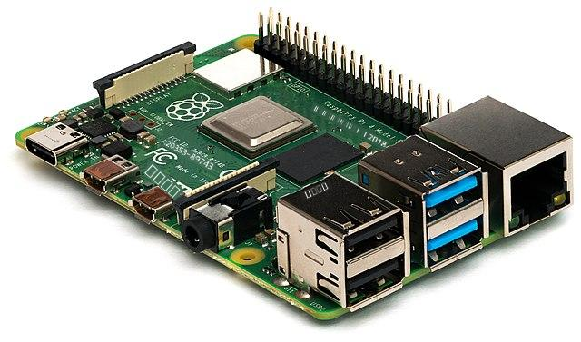
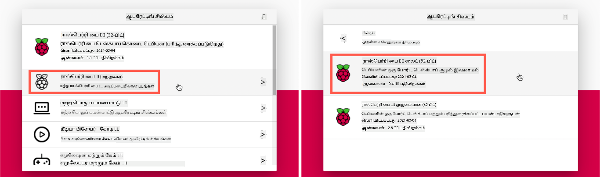
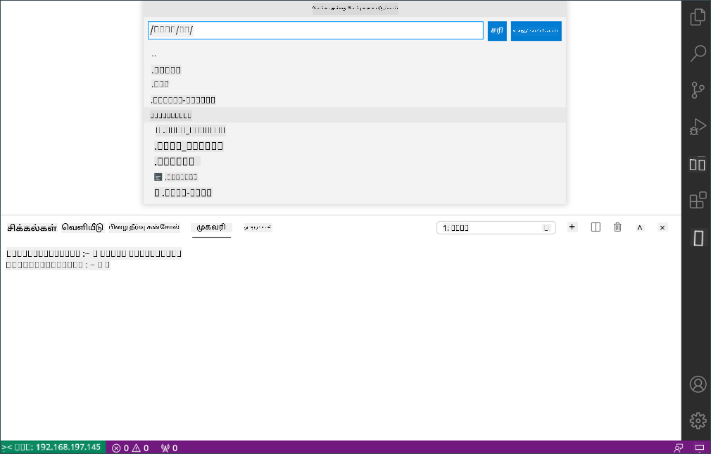

<!--
CO_OP_TRANSLATOR_METADATA:
{
  "original_hash": "8ff0d0a1d29832bb896b9c103b69a452",
  "translation_date": "2025-10-11T11:23:42+00:00",
  "source_file": "1-getting-started/lessons/1-introduction-to-iot/pi.md",
  "language_code": "ta"
}
-->
# ராஸ்பெர்ரி பை

[ராஸ்பெர்ரி பை](https://raspberrypi.org) என்பது ஒரு சிங்கிள்-போர்டு கணினி. நீங்கள் பல்வேறு சாதனங்கள் மற்றும் எகோசிஸ்டம்களைப் பயன்படுத்தி சென்சார்கள் மற்றும் ஆக்டுவேட்டர்களைச் சேர்க்கலாம், மேலும் இந்த பாடங்களுக்காக [Grove](https://www.seeedstudio.com/category/Grove-c-1003.html) எனப்படும் ஒரு ஹார்ட்வேரின் எகோசிஸ்டத்தைப் பயன்படுத்துகிறோம். Python மூலம் உங்கள் பையை நிரலாக்கி Grove சென்சார்கள் அணுகலாம்.



## அமைப்பு

நீங்கள் உங்கள் IoT ஹார்ட்வேராக ராஸ்பெர்ரி பையைப் பயன்படுத்தினால், இரண்டு விருப்பங்கள் உள்ளன - நீங்கள் இந்த பாடங்களை முழுமையாகச் செய்து பையில் நேரடியாக நிரலாக்கலாம் அல்லது 'headless' பையை தொலைதூரமாக இணைத்து உங்கள் கணினியில் இருந்து நிரலாக்கலாம்.

தொடங்குவதற்கு முன், Grove Base Hat-ஐ உங்கள் பையில் இணைக்கவும்.

### பணிகள் - அமைப்பு

Grove base hat-ஐ உங்கள் பையில் நிறுவி பையை அமைக்கவும்.

1. Grove base hat-ஐ உங்கள் பையில் இணைக்கவும். Hat-இல் உள்ள சாக்கெட் பையின் அனைத்து GPIO பின்களுக்கும் பொருந்தும், பின்களை முழுமையாக கீழே தள்ளி Hat-ஐ அடிப்படையில் உறுதியாக அமர்த்தவும். இது பையின் மேல் அமர்ந்து அதை மூடுகிறது.

    

1. உங்கள் பையை எப்படி நிரலாக்க விரும்புகிறீர்கள் என்பதைத் தீர்மானித்து கீழே உள்ள தொடர்புடைய பிரிவுக்கு செல்லவும்:

    * [உங்கள் பையில் நேரடியாக வேலை செய்யவும்](../../../../../1-getting-started/lessons/1-introduction-to-iot)
    * [பையை நிரலாக்க தொலைதூர அணுகல்](../../../../../1-getting-started/lessons/1-introduction-to-iot)

### உங்கள் பையில் நேரடியாக வேலை செய்யவும்

உங்கள் பையில் நேரடியாக வேலை செய்ய விரும்பினால், Raspberry Pi OS-இன் டெஸ்க்டாப் பதிப்பைப் பயன்படுத்தி தேவையான அனைத்து கருவிகளையும் நிறுவலாம்.

#### பணிகள் - உங்கள் பையில் நேரடியாக வேலை செய்யவும்

உங்கள் பையை மேம்படுத்தவும்.

1. [ராஸ்பெர்ரி பை அமைப்பு வழிகாட்டி](https://projects.raspberrypi.org/en/projects/raspberry-pi-setting-up) உள்ள வழிமுறைகளைப் பின்பற்றி உங்கள் பையை அமைக்கவும், அதை கீபோர்டு/மவுஸ்/மானிட்டருடன் இணைக்கவும், உங்கள் WiFi அல்லது ஈதர்நெட் நெட்வொர்க்குடன் இணைக்கவும், மற்றும் மென்பொருளை மேம்படுத்தவும்.

Grove சென்சார்கள் மற்றும் ஆக்டுவேட்டர்களைப் பயன்படுத்த பையை நிரலாக்க, சாதனக் குறியீட்டை எழுத அனுமதிக்கும் ஒரு எடிட்டர் மற்றும் Grove ஹார்ட்வேருடன் தொடர்பு கொள்ளும் பல நூலகங்கள் மற்றும் கருவிகளை நிறுவ வேண்டும்.

1. உங்கள் பை மீண்டும் தொடங்கியவுடன், மேல் மெனு பட்டியில் **Terminal** ஐகானைக் கிளிக் செய்வதன் மூலம் அல்லது *Menu -> Accessories -> Terminal* ஐத் தேர்ந்தெடுக்கவும்.

1. OS மற்றும் நிறுவப்பட்ட மென்பொருள் புதுப்பிக்கப்பட்டுள்ளதா என்பதை உறுதிப்படுத்த கீழே உள்ள கட்டளையை இயக்கவும்:

    ```sh
    sudo apt update && sudo apt full-upgrade --yes
    ```

1. Grove ஹார்ட்வேருக்கான தேவையான அனைத்து நூலகங்களையும் நிறுவ கீழே உள்ள கட்டளைகளை இயக்கவும்:

    ```sh
    sudo apt install git python3-dev python3-pip --yes

    git clone https://github.com/Seeed-Studio/grove.py
    cd grove.py
    sudo pip3 install .

    sudo raspi-config nonint do_i2c 0
    ```

    இது Git மற்றும் Python தொகுப்புகளை நிறுவுவதற்கான Pip-ஐ நிறுவுவதால் தொடங்குகிறது.

    Python-இன் ஒரு சக்திவாய்ந்த அம்சம் [Pip தொகுப்புகளை](https://pypi.org) நிறுவும் திறன் - இவை மற்றவர்களால் எழுதப்பட்ட குறியீட்டின் தொகுப்புகள் மற்றும் இணையத்தில் வெளியிடப்பட்டவை. ஒரு கட்டளையைப் பயன்படுத்தி உங்கள் கணினியில் Pip தொகுப்பை நிறுவி, உங்கள் குறியீட்டில் அந்த தொகுப்பைப் பயன்படுத்தலாம்.

    Seeed Grove Python தொகுப்புகள் மூலத்திலிருந்து நிறுவப்பட வேண்டும். இந்த கட்டளைகள் இந்த தொகுப்புக்கான மூலக் குறியீட்டை உள்ளடக்கிய repo-ஐ கிளோன் செய்து, அதை உள்ளடகமாக நிறுவும்.

    > 💁 பொதுவாக, நீங்கள் ஒரு தொகுப்பை நிறுவும்போது, அது உங்கள் கணினியில் எங்கும் கிடைக்கிறது, இது தொகுப்பு பதிப்புகளுடன் சிக்கல்களை உருவாக்கலாம் - ஒரு பயன்பாடு ஒரு தொகுப்பின் ஒரு பதிப்பைச் சார்ந்தது, ஆனால் மற்றொரு பயன்பாட்டிற்காக புதிய பதிப்பை நிறுவும்போது அது செயலிழக்கிறது. இந்த சிக்கலைத் தவிர்க்க, நீங்கள் [Python virtual environment](https://docs.python.org/3/library/venv.html) ஐப் பயன்படுத்தலாம், இது Python-இன் ஒரு பிரதியை ஒரு தனித்துவமான கோப்பகத்தில் வைத்திருக்கும், மேலும் நீங்கள் Pip தொகுப்புகளை நிறுவும்போது அவை அந்த கோப்பகத்திற்கே நிறுவப்படும். உங்கள் பையைப் பயன்படுத்தும்போது நீங்கள் virtual environments-ஐப் பயன்படுத்த மாட்டீர்கள். Grove நிறுவல் ஸ்கிரிப்ட் Grove Python தொகுப்புகளை உலகளாவிய அளவில் நிறுவுகிறது, எனவே virtual environment-ஐப் பயன்படுத்த நீங்கள் ஒரு virtual environment அமைத்து, பின்னர் Grove தொகுப்புகளை அந்த சூழலில் மீண்டும் கையால் நிறுவ வேண்டும். ஒவ்வொரு திட்டத்திற்கும் புதிய SD கார்டை re-flash செய்யும் பல பை டெவலப்பர்கள் இருப்பதால், உலகளாவிய தொகுப்புகளைப் பயன்படுத்துவது எளிதாக இருக்கும்.

    இறுதியாக, இது I<sup>2</sup>C இடைமுகத்தை இயக்குகிறது.

1. பையை மெனு அல்லது Terminal-இல் கீழே உள்ள கட்டளையை இயக்கி மீண்டும் தொடங்கவும்:

    ```sh
    sudo reboot
    ```

1. பை மீண்டும் தொடங்கியவுடன், Terminal-ஐ மீண்டும் தொடங்கி [Visual Studio Code (VS Code)](https://code.visualstudio.com?WT.mc_id=academic-17441-jabenn) ஐ நிறுவ கீழே உள்ள கட்டளையை இயக்கவும் - இது Python-இல் உங்கள் சாதனக் குறியீட்டை எழுத நீங்கள் பயன்படுத்தும் எடிட்டர்.

    ```sh
    sudo apt install code
    ```

    இது நிறுவப்பட்டவுடன், VS Code மேல் மெனுவில் கிடைக்கும்.

    > 💁 இந்த பாடங்களுக்கு நீங்கள் எந்த Python IDE அல்லது எடிட்டரையும் பயன்படுத்தலாம், ஆனால் பாடங்கள் VS Code-ஐப் பயன்படுத்துவதற்கான வழிமுறைகளை வழங்கும்.

1. Pylance-ஐ நிறுவவும். இது Python மொழி ஆதரவை வழங்கும் VS Code-க்கான ஒரு நீட்டிப்பு. VS Code-இல் இந்த நீட்டிப்பை நிறுவுவதற்கான வழிமுறைகளை [Pylance extension documentation](https://marketplace.visualstudio.com/items?WT.mc_id=academic-17441-jabenn&itemName=ms-python.vscode-pylance) இல் காணலாம்.

### பையை நிரலாக்க தொலைதூர அணுகல்

பையில் நேரடியாக நிரலாக்குவதற்குப் பதிலாக, அது 'headless' ஆக இயங்கலாம், அதாவது கீபோர்டு/மவுஸ்/மானிட்டருடன் இணைக்கப்படாமல், உங்கள் கணினியில் இருந்து Visual Studio Code-ஐப் பயன்படுத்தி அதை அமைத்து நிரலாக்கலாம்.

#### பை OS அமைக்கவும்

தொலைதூரமாக நிரலாக்க, பை OS SD கார்டில் நிறுவப்பட வேண்டும்.

##### பணிகள் - பை OS அமைக்கவும்

Headless பை OS-ஐ அமைக்கவும்.

1. [ராஸ்பெர்ரி பை OS மென்பொருள் பக்கம்](https://www.raspberrypi.org/software/) இருந்து **ராஸ்பெர்ரி பை இமேஜர்** ஐ பதிவிறக்கி நிறுவவும்

1. SD கார்டை உங்கள் கணினியில் செருகவும், தேவையானால் ஒரு அடாப்டரைப் பயன்படுத்தவும்

1. ராஸ்பெர்ரி பை இமேஜரை தொடங்கவும்

1. ராஸ்பெர்ரி பை இமேஜரில் **CHOOSE OS** பொத்தானைத் தேர்ந்தெடுக்கவும், பின்னர் *Raspberry Pi OS (Other)*, அதன்பின் *Raspberry Pi OS Lite (32-bit)* ஐத் தேர்ந்தெடுக்கவும்

    

    > 💁 Raspberry Pi OS Lite என்பது Raspberry Pi OS-இன் ஒரு பதிப்பு, இது டெஸ்க்டாப் UI அல்லது UI அடிப்படையிலான கருவிகளை கொண்டிருக்காது. இவை headless பைக்கு தேவையில்லை மற்றும் நிறுவலை சிறியதாகவும், boot up நேரத்தை வேகமாகவும் மாற்றுகிறது.

1. **CHOOSE STORAGE** பொத்தானைத் தேர்ந்தெடுக்கவும், பின்னர் உங்கள் SD கார்டைத் தேர்ந்தெடுக்கவும்

1. **Advanced Options** ஐ `Ctrl+Shift+X` அழுத்துவதன் மூலம் தொடங்கவும். இந்த விருப்பங்கள் Raspberry Pi OS-ஐ SD கார்டில் இமேஜ் செய்யும் முன் சில முன்-கட்டமைப்புகளை அனுமதிக்கின்றன.

    1. **Enable SSH** செக் பாக்ஸைச் சரிபார்த்து, `pi` பயனருக்கான கடவுச்சொல்லை அமைக்கவும். பின்னர் பையில் உள்நுழைய நீங்கள் இந்த கடவுச்சொல்லைப் பயன்படுத்துவீர்கள்.

    1. நீங்கள் பையை WiFi மூலம் இணைக்க திட்டமிட்டிருந்தால், **Configure WiFi** செக் பாக்ஸைச் சரிபார்த்து, உங்கள் WiFi SSID மற்றும் கடவுச்சொல்லை உள்ளிடவும், மேலும் உங்கள் WiFi நாட்டைத் தேர்ந்தெடுக்கவும். நீங்கள் ஈதர்நெட் கேபிளைப் பயன்படுத்தினால் இதை செய்ய தேவையில்லை. உங்கள் கணினி இருக்கும் அதே நெட்வொர்க்குடன் இணைக்கவும்.

    1. **Set locale settings** செக் பாக்ஸைச் சரிபார்த்து, உங்கள் நாடு மற்றும் நேர மண்டலத்தை அமைக்கவும்

    1. **SAVE** பொத்தானைத் தேர்ந்தெடுக்கவும்

1. OS-ஐ SD கார்டில் எழுத **WRITE** பொத்தானைத் தேர்ந்தெடுக்கவும். நீங்கள் macOS-ஐப் பயன்படுத்தினால், underlying tool-க்கு privileged access தேவைப்படும், எனவே உங்கள் கடவுச்சொல்லை உள்ளிடுமாறு கேட்கப்படும்.

OS SD கார்டில் எழுதப்படும், முடிந்தவுடன் OS SD கார்டை வெளியேற்றும், மேலும் உங்களுக்கு அறிவிக்கப்படும். SD கார்டை உங்கள் கணினியில் இருந்து அகற்றவும், பையில் செருகவும், பையை இயக்கவும், சரியாக boot ஆக 2 நிமிடங்கள் காத்திருக்கவும்.

#### பையை இணைக்கவும்

அடுத்த படி பையை தொலைதூரமாக அணுக வேண்டும். இதை `ssh` பயன்படுத்தி செய்யலாம், இது macOS, Linux மற்றும் சமீபத்திய Windows பதிப்புகளில் கிடைக்கிறது.

##### பணிகள் - பையை இணைக்கவும்

பையை தொலைதூரமாக அணுகவும்.

1. Terminal அல்லது Command Prompt ஐ தொடங்கி, பையுடன் இணைக்க கீழே உள்ள கட்டளையை உள்ளிடவும்:

    ```sh
    ssh pi@raspberrypi.local
    ```

    நீங்கள் Windows-ஐப் பயன்படுத்தி `ssh` நிறுவப்படாத பழைய பதிப்பில் இருந்தால், OpenSSH ஐப் பயன்படுத்தலாம். [OpenSSH நிறுவல் ஆவணத்தில்](https://docs.microsoft.com//windows-server/administration/openssh/openssh_install_firstuse?WT.mc_id=academic-17441-jabenn) நிறுவல் வழிமுறைகளைப் பெறலாம்.

1. இது உங்கள் பையுடன் இணைக்க வேண்டும் மற்றும் கடவுச்சொல்லை கேட்க வேண்டும்.

    `<hostname>.local` ஐப் பயன்படுத்தி உங்கள் நெட்வொர்க்கில் கணினிகளை கண்டறிவது Linux மற்றும் Windows-க்கு சமீபத்திய சேர்க்கையாகும். Linux அல்லது Windows-ஐப் பயன்படுத்தி Hostname கண்டறிய முடியவில்லை என்றால், ZeroConf நெட்வொர்க்கிங் (Apple Bonjour என அழைக்கப்படும்) செயல்படுத்த கூடுதல் மென்பொருளை நிறுவ வேண்டும்:

    1. Linux-ஐப் பயன்படுத்தினால், கீழே உள்ள கட்டளையை இயக்கி Avahi ஐ நிறுவவும்:

        ```sh
        sudo apt-get install avahi-daemon
        ```

    1. Windows-ஐப் பயன்படுத்தினால், ZeroConf ஐ செயல்படுத்த எளிய வழி [Bonjour Print Services for Windows](http://support.apple.com/kb/DL999) ஐ நிறுவுவது. [iTunes for Windows](https://www.apple.com/itunes/download/) ஐ நிறுவுவதன் மூலம் இந்த utility-யின் புதிய பதிப்பைப் பெறலாம் (இது தனியாக கிடைக்கவில்லை).

    > 💁 நீங்கள் `raspberrypi.local` ஐப் பயன்படுத்தி இணைக்க முடியாவிட்டால், உங்கள் பையின் IP முகவரியைப் பயன்படுத்தலாம். [ராஸ்பெர்ரி பை IP முகவரி ஆவணத்தில்](https://www.raspberrypi.org/documentation/remote-access/ip-address.md) IP முகவரியைப் பெற பல வழிகளுக்கான வழிமுறைகளைப் பார்க்கவும்.

1. Raspberry Pi Imager Advanced Options-ல் நீங்கள் அமைத்த கடவுச்சொல்லை உள்ளிடவும்

#### பையில் மென்பொருளை அமைக்கவும்

பையுடன் இணைக்கப்பட்டவுடன், OS புதுப்பிக்கப்பட்டுள்ளதா என்பதை உறுதிப்படுத்தவும், மற்றும் Grove ஹார்ட்வேருடன் தொடர்பு கொள்ள பல நூலகங்கள் மற்றும் கருவிகளை நிறுவவும்.

##### பணிகள் - பையில் மென்பொருளை அமைக்கவும்

நிறுவப்பட்ட பை மென்பொருளை அமைத்து Grove நூலகங்களை நிறுவவும்.

1. உங்கள் `ssh` அமர்வில் இருந்து, பையை புதுப்பித்து பின்னர் மீண்டும் தொடங்க கீழே உள்ள கட்டளையை இயக்கவும்:

    ```sh
    sudo apt update && sudo apt full-upgrade --yes && sudo reboot
    ```

    பை புதுப்பிக்கப்பட்டு மீண்டும் தொடங்கப்படும். பை reboot ஆகும்போது `ssh` அமர்வு முடிவடையும், எனவே 30 விநாடிகள் காத்திருந்து மீண்டும் இணைக்கவும்.

1. மீண்டும் இணைக்கப்பட்ட `ssh` அமர்வில் இருந்து, Grove ஹார்ட்வேருக்கான தேவையான அனைத்து நூலகங்களையும் நிறுவ கீழே உள்ள கட்டளைகளை இயக்கவும்:

    ```sh
    sudo apt install git python3-dev python3-pip --yes

    git clone https://github.com/Seeed-Studio/grove.py
    cd grove.py
    sudo pip3 install .

    sudo raspi-config nonint do_i2c 0
    ```

    இது Git மற்றும் Python தொகுப்புகளை நிறுவுவதற்கான Pip-ஐ நிறுவுவதால் தொடங்குகிறது.

    Python-இன் ஒரு சக்திவாய்ந்த அம்சம் [Pip தொகுப்புகளை](https://pypi.org) நிறுவும் திறன் - இவை மற்றவர்களால் எழுதப்பட்ட குறியீட்டின் தொகுப்புகள் மற்றும் இணையத்தில் வெளியிடப்பட்டவை. ஒரு கட்டளையைப் பயன்படுத்தி உங்கள் கணினியில் Pip தொகுப்பை நிறுவி, உங்கள் குறியீட்டில் அந்த தொகுப்பைப் பயன்படுத்தலாம்.

    Seeed Grove Python தொகுப்புகள் மூலத்திலிருந்து நிறுவப்பட வேண்டும். இந்த கட்டளைகள் இந்த தொகுப்புக்கான மூலக் குறியீட்டை உள்ளடக்கிய repo-ஐ கிளோன் செய்து, அதை உள்ளடகமாக நிறுவும்.

    > 💁 பொதுவாக, நீங்கள் ஒரு தொகுப்பை நிறுவும்போது, அது உங்கள் கணினியில் எங்கும் கிடைக்கிறது, இது தொகுப்பு பதிப்புகளுடன் சிக்கல்களை உருவாக்கலாம் - ஒரு பயன்பாடு ஒரு தொகுப்பின் ஒரு பதிப்பைச் சார்ந்தது, ஆனால் மற்றொரு பயன்பாட்டிற்காக புதிய பதிப்பை நிறுவும்போது அது செயலிழக்கிறது. இந்த சிக்கலைத் தவிர்க்க, நீங்கள் [Python virtual environment](https://docs.python.org/3/library/venv.html) ஐப் பயன்படுத்தலாம், இது Python-இன் ஒரு பிரதியை ஒரு தனித்துவமான கோப்பகத்தில் வைத்திருக்கும், மேலும் நீங்கள் Pip தொகுப்புகளை நிறுவும்போது அவை அந்த கோப்பகத்திற்கே நிறுவப்படும். உங்கள் பையைப் பயன்படுத்தும்போது நீங்கள் virtual environments-ஐப் பயன்படுத்த மாட்டீர்கள். Grove நிறுவல் ஸ்கிரிப்ட் Grove Python தொகுப்புகளை உலகளாவிய அளவில் நிறுவுகிறது, எனவே virtual environment-ஐப் பயன்படுத்த நீங்கள் ஒரு virtual environment அமைத்து, பின்னர் Grove தொகுப்புகளை அந்த சூழலில் மீண்டும் கையால் நிறுவ வேண்டும். ஒவ்வொரு திட்டத்திற்கும் புதிய SD கார்டை re-flash செய்யும் பல பை டெவலப்பர்கள் இருப்பதால், உலகளாவிய தொகுப்புகளைப் பயன்படுத்துவது எளிதாக இருக்கும்.

    இறுதியாக, இது I<sup>2</sup>C இடைமுகத்தை இயக்குகிறது.

1. பையை கீழே உள்ள கட்டளையை இயக்கி மீண்டும் தொடங்கவும்:

    ```sh
    sudo reboot
    ```

    பை reboot ஆகும்போது `ssh` அமர்வு முடிவடையும். மீண்டும் இணைக்க தேவையில்லை.

#### தொலைதூர அணுகலுக்கான VS Code-ஐ அமைக்கவும்

பை அமைக்கப்பட்டவுடன், Visual Studio Code (VS Code) ஐ உங்கள் கணினியில் இருந்து பையை இணைக்க பயன்படுத்தலாம் - இது Python-இல் உங்கள் சாதனக் குறியீட்டை எழுத நீங்கள் பயன்படுத்தும் இலவச டெவலப்பர் டெக்ஸ்ட் எடிட்டர்.

##### பணிகள் - தொலைதூர அணுகலுக்கான VS Code-ஐ அமைக்கவும்

தேவையான மென்பொருளை நிறுவி உங்கள் பையை தொலைதூரமாக இணைக்கவும்.

1. [VS Code ஆவணங்களை](https://code.visualstudio.com?WT.mc_id=academic-17441-jabenn) பின்பற்றி உங்கள் கணினியில் VS Code ஐ நிறுவவும்

1. [VS Code Remote Development using SSH documentation](https://code.visualstudio.com/docs/remote/ssh?WT.mc_id=academic-17441-jabenn) உள்ள வழிமுறைகளைப் பின்பற்றி தேவையான கூறுகளை நிறுவவும்

1. அதே வழிமுறைகளைப் பின்பற்றி VS Code ஐ பையுடன் இணைக்கவும்
1. இணைக்கப்பட்ட பிறகு, [நீட்சிகளை நிர்வகித்தல்](https://code.visualstudio.com/docs/remote/ssh#_managing-extensions?WT.mc_id=academic-17441-jabenn) குறித்த வழிமுறைகளை பின்பற்றி [Pylance extension](https://marketplace.visualstudio.com/items?WT.mc_id=academic-17441-jabenn&itemName=ms-python.vscode-pylance) ஐ Pi-ல் தொலைநிலையாக நிறுவவும்.

## ஹலோ வேர்ல்ட்

புதிய நிரலாக்க மொழி அல்லது தொழில்நுட்பத்துடன் தொடங்கும்போது, 'ஹலோ வேர்ல்ட்' பயன்பாட்டை உருவாக்குவது பாரம்பரியமாகும் - இது ஒரு சிறிய பயன்பாடு, `"Hello World"` போன்ற உரையை வெளியிடும், அனைத்து கருவிகளும் சரியாக உள்ளமைக்கப்பட்டுள்ளன என்பதை உறுதிப்படுத்த.

Pi-க்கான ஹலோ வேர்ல்ட் பயன்பாடு Python மற்றும் Visual Studio Code சரியாக நிறுவப்பட்டுள்ளதா என்பதை உறுதிப்படுத்தும்.

இந்த பயன்பாடு `nightlight` எனும் கோப்புறையில் இருக்கும், மேலும் இந்த பணியின் பிற பகுதிகளில் nightlight பயன்பாட்டை உருவாக்க வேறுபட்ட குறியீடுகளுடன் மீண்டும் பயன்படுத்தப்படும்.

### பணி - ஹலோ வேர்ல்ட்

ஹலோ வேர்ல்ட் பயன்பாட்டை உருவாக்கவும்.

1. VS Code ஐ தொடங்கவும், நேரடியாக Pi-ல் அல்லது உங்கள் கணினியில் இருந்து Remote SSH நீட்சியைப் பயன்படுத்தி Pi-க்கு இணைக்கவும்.

1. *Terminal -> New Terminal* ஐ தேர்வு செய்வதன் மூலம் அல்லது `` CTRL+` `` அழுத்துவதன் மூலம் VS Code Terminal ஐத் தொடங்கவும். இது `pi` பயனரின் முகப்பு அடைவிற்கு திறக்கும்.

1. உங்கள் குறியீடுகளுக்கான ஒரு அடைவை உருவாக்கவும், மேலும் அந்த அடைவிற்குள் `app.py` எனும் Python கோப்பை உருவாக்கவும், கீழே உள்ள கட்டளைகளை இயக்கவும்:

    ```sh
    mkdir nightlight
    cd nightlight
    touch app.py
    ```

1. *File -> Open...* ஐ தேர்வு செய்து *nightlight* கோப்புறையைத் தேர்வு செய்து, **OK** ஐ தேர்வு செய்வதன் மூலம் இந்த கோப்புறையை VS Code-ல் திறக்கவும்.

    

1. VS Code explorer-ல் இருந்து `app.py` கோப்பைத் திறந்து, கீழே உள்ள குறியீட்டை சேர்க்கவும்:

    ```python
    print('Hello World!')
    ```

    `print` செயல்பாடு அதற்கு அனுப்பப்படும் எதையும் கான்சோலில் அச்சிடும்.

1. VS Code Terminal-ல் இருந்து, உங்கள் Python பயன்பாட்டை இயக்க கீழே உள்ளதை இயக்கவும்:

    ```sh
    python app.py
    ```

    > 💁 நீங்கள் Python 2 கூட நிறுவியிருந்தால், இந்தக் குறியீட்டை இயக்க `python3` ஐ வெளிப்படையாக அழைக்க வேண்டியிருக்கும். Python 2 நிறுவப்பட்டிருந்தால், `python` ஐ அழைப்பது Python 2 ஐ பயன்படுத்தும். இயல்பாக, சமீபத்திய Raspberry Pi OS பதிப்புகளில் Python 3 மட்டுமே நிறுவப்பட்டுள்ளது.

    கீழே உள்ள வெளியீடு டெர்மினலில் தோன்றும்:

    ```output
    pi@raspberrypi:~/nightlight $ python3 app.py
    Hello World!
    ```

> 💁 இந்தக் குறியீட்டை [code/pi](../../../../../1-getting-started/lessons/1-introduction-to-iot/code/pi) கோப்புறையில் காணலாம்.

😀 உங்கள் 'ஹலோ வேர்ல்ட்' நிரல் வெற்றிகரமாக செயல்பட்டது!

---

**அறிவிப்பு**:  
இந்த ஆவணம் [Co-op Translator](https://github.com/Azure/co-op-translator) என்ற AI மொழிபெயர்ப்பு சேவையைப் பயன்படுத்தி மொழிபெயர்க்கப்பட்டுள்ளது. நாங்கள் துல்லியத்திற்காக முயற்சிக்கிறோம், ஆனால் தானியங்கி மொழிபெயர்ப்புகளில் பிழைகள் அல்லது தவறுகள் இருக்கக்கூடும் என்பதை தயவுசெய்து கவனத்தில் கொள்ளவும். அதன் சொந்த மொழியில் உள்ள மூல ஆவணம் அதிகாரப்பூர்வ ஆதாரமாக கருதப்பட வேண்டும். முக்கியமான தகவல்களுக்கு, தொழில்முறை மனித மொழிபெயர்ப்பு பரிந்துரைக்கப்படுகிறது. இந்த மொழிபெயர்ப்பைப் பயன்படுத்துவதால் ஏற்படும் எந்த தவறான புரிதல்களுக்கும் அல்லது தவறான விளக்கங்களுக்கும் நாங்கள் பொறுப்பல்ல.