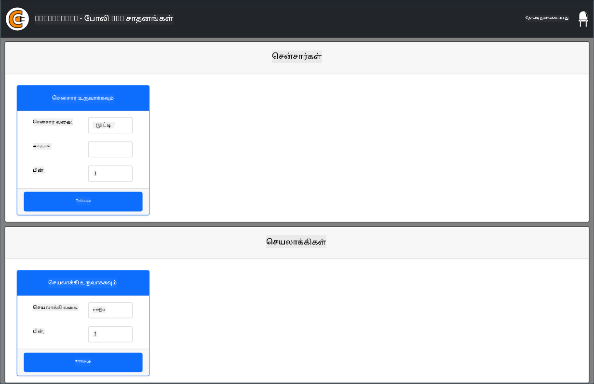
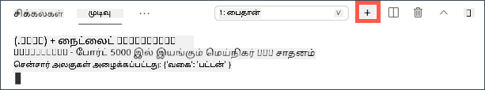

<!--
CO_OP_TRANSLATOR_METADATA:
{
  "original_hash": "52b4de6144b2efdced7797a5339d6035",
  "translation_date": "2025-10-11T11:25:08+00:00",
  "source_file": "1-getting-started/lessons/1-introduction-to-iot/virtual-device.md",
  "language_code": "ta"
}
-->
# வर्चுவல் சிங்கிள்-போர்டு கணினி

IoT சாதனங்களை, சென்சார்கள் மற்றும் ஆக்டுவேட்டர்களுடன் வாங்குவதற்கு பதிலாக, உங்கள் கணினியை IoT ஹார்ட்வேரை சிமுலேட் செய்ய பயன்படுத்தலாம். [CounterFit திட்டம்](https://github.com/CounterFit-IoT/CounterFit) உங்கள் கணினியில் ஒரு செயலியை உள்ளூர் ரீதியாக இயக்க அனுமதிக்கிறது, இது சென்சார்கள் மற்றும் ஆக்டுவேட்டர்களைப் போல IoT ஹார்ட்வேரை சிமுலேட் செய்கிறது, மேலும் Raspberry Pi-யில் பிசியலான ஹார்ட்வேரைப் பயன்படுத்தி நீங்கள் எழுதும் Python குறியீட்டைப் போலவே உள்ளூர் Python குறியீட்டிலிருந்து சென்சார்கள் மற்றும் ஆக்டுவேட்டர்களை அணுகலாம்.

## அமைப்பு

CounterFit-ஐ பயன்படுத்த, உங்கள் கணினியில் சில இலவச மென்பொருளை நிறுவ வேண்டும்.

### பணிகள்

தேவையான மென்பொருளை நிறுவவும்.

1. Python-ஐ நிறுவவும். Python-இன் சமீபத்திய பதிப்பை நிறுவுவதற்கான வழிமுறைகளுக்கு [Python பதிவிறக்க பக்கம்](https://www.python.org/downloads/) பார்க்கவும்.

1. Visual Studio Code (VS Code)-ஐ நிறுவவும். Python-இல் உங்கள் வर्चுவல் சாதன குறியீட்டை எழுத நீங்கள் பயன்படுத்தும் எடிட்டர் இதுவாகும். VS Code-ஐ நிறுவுவதற்கான வழிமுறைகளுக்கு [VS Code ஆவணங்கள்](https://code.visualstudio.com?WT.mc_id=academic-17441-jabenn) பார்க்கவும்.

    > 💁 நீங்கள் விரும்பும் Python IDE அல்லது எடிட்டரை இந்த பாடங்களுக்குப் பயன்படுத்தத் தாராளமாக இருக்கலாம், ஆனால் பாடங்கள் VS Code-ஐப் பயன்படுத்துவதற்கான வழிமுறைகளை வழங்கும்.

1. VS Code Pylance நீட்டிப்பை நிறுவவும். இது Python மொழி ஆதரவை வழங்கும் VS Code-க்கான ஒரு நீட்டிப்பு. VS Code-இல் இந்த நீட்டிப்பை நிறுவுவதற்கான வழிமுறைகளுக்கு [Pylance நீட்டிப்பு ஆவணங்கள்](https://marketplace.visualstudio.com/items?WT.mc_id=academic-17441-jabenn&itemName=ms-python.vscode-pylance) பார்க்கவும்.

CounterFit செயலியை நிறுவ மற்றும் அமைக்க தேவையான வழிமுறைகள் ஒவ்வொரு திட்டத்தின் அடிப்படையில் வழங்கப்படும்.

## ஹெலோ வேர்ல்ட்

ஒரு புதிய நிரலாக்க மொழி அல்லது தொழில்நுட்பத்துடன் தொடங்கும்போது, `"Hello World"` போன்ற ஒரு சிறிய பயன்பாட்டை உருவாக்குவது பாரம்பரியமாகும் - அனைத்து கருவிகளும் சரியாக உள்ளமைக்கப்பட்டுள்ளதைக் காட்ட ஒரு சிறிய பயன்பாடு.

விர்ச்சுவல் IoT ஹார்ட்வேருக்கான ஹெலோ வேர்ல்ட் செயலி Python மற்றும் Visual Studio Code சரியாக நிறுவப்பட்டுள்ளதா என்பதை உறுதிப்படுத்தும். இது CounterFit-இன் விர்ச்சுவல் IoT சென்சார்கள் மற்றும் ஆக்டுவேட்டர்களுடன் இணைக்கும். இது எந்த ஹார்ட்வேரையும் பயன்படுத்தாது, எல்லாம் சரியாக வேலை செய்கிறது என்பதை நிரூபிக்க இணைக்கும்.

இந்த செயலி `nightlight` என்ற கோப்புறையில் இருக்கும், மேலும் இந்த பணிக்கான பிற பகுதிகளில் nightlight பயன்பாட்டை உருவாக்க மாறுபட்ட குறியீட்டுடன் மீண்டும் பயன்படுத்தப்படும்.

### Python வேர்ச்சுவல் சூழலை அமைக்கவும்

Python-இன் சக்திவாய்ந்த அம்சங்களில் ஒன்று [Pip packages](https://pypi.org) நிறுவும் திறன் - இவை மற்றவர்களால் எழுதப்பட்டு இணையத்தில் வெளியிடப்பட்ட குறியீட்டு தொகுப்புகள். நீங்கள் ஒரு கட்டளையுடன் Pip தொகுப்பை உங்கள் கணினியில் நிறுவலாம், பின்னர் அந்த தொகுப்பை உங்கள் குறியீட்டில் பயன்படுத்தலாம். CounterFit-இன் தொடர்பு பேச ஒரு தொகுப்பை நிறுவ நீங்கள் Pip-ஐப் பயன்படுத்துவீர்கள்.

இயல்பாக, நீங்கள் ஒரு தொகுப்பை நிறுவும்போது, அது உங்கள் கணினியில் எங்கும் கிடைக்கும், இது தொகுப்பு பதிப்புகளுடன் சிக்கல்களை உருவாக்கலாம் - ஒரு பயன்பாடு ஒரு தொகுப்பின் ஒரு பதிப்பை சார்ந்திருக்கும், இது மற்றொரு பயன்பாட்டிற்காக புதிய பதிப்பை நிறுவும்போது செயலிழக்கிறது. இந்த சிக்கலைத் தவிர்க்க, நீங்கள் [Python வேர்ச்சுவல் சூழல்](https://docs.python.org/3/library/venv.html) பயன்படுத்தலாம், இது ஒரு தனித்துவமான கோப்புறையில் Python-இன் நகலாகும், மேலும் நீங்கள் Pip தொகுப்புகளை நிறுவும்போது அவை அந்த கோப்புறைக்கு மட்டுமே நிறுவப்படும்.

> 💁 நீங்கள் Raspberry Pi-ஐப் பயன்படுத்தினால், அந்த சாதனத்தில் Pip தொகுப்புகளை நிர்வகிக்க ஒரு வேர்ச்சுவல் சூழலை அமைக்கவில்லை, மாறாக நீங்கள் உலகளாவிய தொகுப்புகளைப் பயன்படுத்துகிறீர்கள், ஏனெனில் Grove தொகுப்புகள் நிறுவுநர் ஸ்கிரிப்ட் மூலம் உலகளாவியமாக நிறுவப்பட்டுள்ளன.

#### பணிகள் - Python வேர்ச்சுவல் சூழலை அமைக்கவும்

Python வேர்ச்சுவல் சூழலை அமைக்கவும் மற்றும் CounterFit-க்கான Pip தொகுப்புகளை நிறுவவும்.

1. உங்கள் டெர்மினல் அல்லது கட்டளை வரியில், புதிய கோப்புறையை உருவாக்கவும் மற்றும் அதில் செல்லவும்:

    ```sh
    mkdir nightlight
    cd nightlight
    ```

1. `.venv` கோப்புறையில் ஒரு வேர்ச்சுவல் சூழலை உருவாக்க கீழே உள்ளதை இயக்கவும்:

    ```sh
    python3 -m venv .venv
    ```

    > 💁 Python 3-ஐ உருவாக்க explicitly `python3`-ஐ அழைக்க வேண்டும், ஏனெனில் Python 2 Python 3-க்கு கூடுதலாக நிறுவப்பட்டிருக்கலாம். Python 2 நிறுவப்பட்டிருந்தால், `python`-ஐ அழைப்பது Python 2-ஐ பயன்படுத்தும்.

1. வேர்ச்சுவல் சூழலை செயல்படுத்தவும்:

    * Windows-ல்:
        * நீங்கள் Command Prompt அல்லது Windows Terminal வழியாக Command Prompt-ஐப் பயன்படுத்தினால், கீழே உள்ளதை இயக்கவும்:

            ```cmd
            .venv\Scripts\activate.bat
            ```

        * நீங்கள் PowerShell-ஐப் பயன்படுத்தினால், கீழே உள்ளதை இயக்கவும்:

            ```powershell
            .\.venv\Scripts\Activate.ps1
            ```

            > இந்த அமைப்பில் ஸ்கிரிப்ட்களை இயக்குவது முடக்கப்பட்டுள்ளது என்ற பிழை வந்தால், ஒரு பொருத்தமான செயல்பாட்டு கொள்கையை அமைப்பதன் மூலம் ஸ்கிரிப்ட்களை இயக்க அனுமதிக்க வேண்டும். இதை செய்ய, PowerShell-ஐ நிர்வாகியாகத் தொடங்கவும், பின்னர் கீழே உள்ள கட்டளையை இயக்கவும்:

            ```powershell
            Set-ExecutionPolicy -ExecutionPolicy Unrestricted
            ```

            உறுதிப்படுத்தும்போது `Y`-ஐ உள்ளிடவும். பின்னர் PowerShell-ஐ மீண்டும் தொடங்கவும் மற்றும் மீண்டும் முயற்சிக்கவும்.

            தேவையானால், நீங்கள் இந்த செயல்பாட்டு கொள்கையை பின்னர் மீட்டமைக்கலாம். இதைப் பற்றிய மேலும் தகவலுக்கு [Execution Policies பக்கம் Microsoft Docs](https://docs.microsoft.com/powershell/module/microsoft.powershell.core/about/about_execution_policies?WT.mc_id=academic-17441-jabenn) பார்க்கவும்.

    * macOS அல்லது Linux-ல், கீழே உள்ளதை இயக்கவும்:

        ```cmd
        source ./.venv/bin/activate
        ```

    > 💁 இந்த கட்டளைகள் நீங்கள் வேர்ச்சுவல் சூழலை உருவாக்கிய இடத்தில் இயக்கப்பட வேண்டும். `.venv` கோப்புறைக்கு நீங்கள் செல்ல வேண்டிய அவசியமில்லை, நீங்கள் எப்போதும் செயல்படுத்தும் கட்டளையை இயக்க வேண்டும் மற்றும் தொகுப்புகளை நிறுவ அல்லது குறியீட்டை இயக்க எந்த கட்டளைகளையும் நீங்கள் வேர்ச்சுவல் சூழலை உருவாக்கிய இடத்தில் இருந்து இயக்க வேண்டும்.

1. வேர்ச்சுவல் சூழல் செயல்படுத்தப்பட்ட பிறகு, இயல்பான `python` கட்டளை வேர்ச்சுவல் சூழலை உருவாக்க பயன்படுத்தப்பட்ட Python பதிப்பை இயக்கும். பதிப்பைப் பெற கீழே உள்ளதை இயக்கவும்:

    ```sh
    python --version
    ```

    வெளியீட்டில் கீழே உள்ளவை இருக்கும்:

    ```output
    (.venv) ➜  nightlight python --version
    Python 3.9.1
    ```

    > 💁 உங்கள் Python பதிப்பு மாறுபடலாம் - இது பதிப்பு 3.6 அல்லது அதற்கு மேல் இருந்தால் நீங்கள் சரியாக இருக்கிறீர்கள். இல்லையெனில், இந்த கோப்புறையை நீக்கவும், Python-இன் புதிய பதிப்பை நிறுவவும் மற்றும் மீண்டும் முயற்சிக்கவும்.

1. CounterFit-க்கான Pip தொகுப்புகளை நிறுவ கீழே உள்ள கட்டளைகளை இயக்கவும். இந்த தொகுப்புகளில் CounterFit செயலி மற்றும் Grove ஹார்ட்வேருக்கான shims அடங்கும். இந்த shims-கள் Grove சூழலின் பிசியலான சென்சார்கள் மற்றும் ஆக்டுவேட்டர்களைப் பயன்படுத்தி நிரலாக்கம் செய்யும் போல குறியீட்டை எழுத அனுமதிக்கின்றன, ஆனால் விர்ச்சுவல் IoT சாதனங்களுடன் இணைக்கப்பட்டுள்ளன.

    ```sh
    pip install CounterFit
    pip install counterfit-connection
    pip install counterfit-shims-grove
    ```

    இந்த Pip தொகுப்புகள் வேர்ச்சுவல் சூழலில் மட்டுமே நிறுவப்படும், மற்றும் இதற்கு வெளியே கிடைக்காது.

### குறியீட்டை எழுதவும்

Python வேர்ச்சுவல் சூழல் தயாராக இருந்தால், 'Hello World' பயன்பாட்டிற்கான குறியீட்டை எழுதலாம்.

#### பணிகள் - குறியீட்டை எழுதவும்

கன்சோலில் `"Hello World"` அச்சிட Python பயன்பாட்டை உருவாக்கவும்.

1. உங்கள் டெர்மினல் அல்லது கட்டளை வரியில், வேர்ச்சுவல் சூழலுக்குள் `app.py` என்ற Python கோப்பை உருவாக்க கீழே உள்ளதை இயக்கவும்:

    * Windows-ல் இருந்து இயக்கவும்:

        ```cmd
        type nul > app.py
        ```

    * macOS அல்லது Linux-ல், கீழே உள்ளதை இயக்கவும்:

        ```cmd
        touch app.py
        ```

1. தற்போதைய கோப்புறையை VS Code-இல் திறக்கவும்:

    ```sh
    code .
    ```

    > 💁 உங்கள் டெர்மினல் macOS-ல் `command not found` என்று திருப்பினால், இது VS Code PATH-க்கு சேர்க்கப்படவில்லை என்று பொருள். PATH-க்கு VS Code-ஐச் சேர்க்க, [VS Code ஆவணங்களில் கட்டளை வரியில் தொடங்கும் பகுதி](https://code.visualstudio.com/docs/setup/mac?WT.mc_id=academic-17441-jabenn#_launching-from-the-command-line) உள்ள வழிமுறைகளைப் பின்பற்றவும் மற்றும் பின்னர் கட்டளையை இயக்கவும். Windows மற்றும் Linux-ல் VS Code இயல்பாக PATH-க்கு நிறுவப்படுகிறது.

1. VS Code தொடங்கும்போது, Python வேர்ச்சுவல் சூழலை செயல்படுத்தும். தேர்ந்தெடுக்கப்பட்ட வேர்ச்சுவல் சூழல் கீழே உள்ள நிலை பட்டியில் தோன்றும்:

    

1. VS Code Terminal VS Code தொடங்கும்போது ஏற்கனவே இயங்கினால், அதில் வேர்ச்சுவல் சூழல் செயல்படுத்தப்படாது. எளிதானது, **Kill the active terminal instance** பொத்தானை பயன்படுத்தி டெர்மினலை முடிக்கவும்:

    

    டெர்மினலில் வேர்ச்சுவல் சூழல் செயல்படுத்தப்பட்டுள்ளதா என்பதை `.venv` என்ற பெயர் டெர்மினல் ப்ராம்ப்ட்டில் முன்னொட்டாக இருக்கும். உதாரணமாக, இது இருக்கலாம்:

    ```sh
    (.venv) ➜  nightlight
    ```

    `.venv` ப்ராம்ப்ட்டில் முன்னொட்டாக இல்லையெனில், டெர்மினலில் வேர்ச்சுவல் சூழல் செயல்படுத்தப்படவில்லை.

1. புதிய VS Code Terminal-ஐ *Terminal -> New Terminal* தேர்வு செய்து அல்லது `` CTRL+` `` அழுத்தி தொடங்கவும். புதிய டெர்மினல் வேர்ச்சுவல் சூழலை ஏற்றும், மற்றும் இதை செயல்படுத்த அழைப்பு டெர்மினலில் தோன்றும். ப்ராம்ப்ட்டில் வேர்ச்சுவல் சூழலின் பெயர் (`.venv`) இருக்கும்:

    ```output
    ➜  nightlight source .venv/bin/activate
    (.venv) ➜  nightlight 
    ```

1. VS Code explorer-இல் இருந்து `app.py` கோப்பைத் திறக்கவும் மற்றும் கீழே உள்ள குறியீட்டைச் சேர்க்கவும்:

    ```python
    print('Hello World!')
    ```

    `print` செயல்பாடு அதற்கு வழங்கப்பட்டதை கன்சோலில் அச்சிடுகிறது.

1. VS Code டெர்மினலில் இருந்து, உங்கள் Python செயலியை இயக்க கீழே உள்ளதை இயக்கவும்:

    ```sh
    python app.py
    ```

    வெளியீட்டில் கீழே உள்ளவை இருக்கும்:

    ```output
    (.venv) ➜  nightlight python app.py 
    Hello World!
    ```

😀 உங்கள் 'Hello World' செயலி வெற்றிகரமாக முடிந்தது!

### 'ஹார்ட்வேரை' இணைக்கவும்

இரண்டாவது 'Hello World' படியாக, CounterFit செயலியை இயக்கி உங்கள் குறியீட்டுடன் இணைக்கவும். இது IoT ஹார்ட்வேரை dev kit-க்கு இணைப்பதற்கான விர்ச்சுவல் சமமானது.

#### பணிகள் - 'ஹார்ட்வேரை' இணைக்கவும்

1. VS Code டெர்மினலில் இருந்து, CounterFit செயலியை கீழே உள்ள கட்டளையுடன் தொடங்கவும்:

    ```sh
    counterfit
    ```

    செயலி இயக்கத் தொடங்கும் மற்றும் உங்கள் வலை உலாவியில் திறக்கும்:

    

    இது *Disconnected* என்று குறிக்கப்படும், மற்றும் மேல் வலது மூலையில் LED அணைக்கப்பட்டிருக்கும்.

1. `app.py`-யின் மேல் பக்கம் கீழே உள்ள குறியீட்டைச் சேர்க்கவும்:

    ```python
    from counterfit_connection import CounterFitConnection
    CounterFitConnection.init('127.0.0.1', 5000)
    ```

    இந்த குறியீடு `counterfit_connection` மாடியுளிருந்து `CounterFitConnection` வகுப்பை இறக்குமதி செய்கிறது, இது நீங்கள் முன்பு நிறுவிய `counterfit-connection` pip தொகுப்பிலிருந்து வருகிறது. பின்னர், `127.0.0.1`-ல் இயங்கும் CounterFit செயலியுடன் இணைப்பை ஆரம்பிக்கிறது, இது உங்கள் உள்ளூர் கணினியை அணுக எப்போதும் பயன்படுத்தக்கூடிய ஒரு IP முகவரியாகும் (*localhost* என்று குறிப்பிடப்படுகிறது), 5000 போர்ட்டில்.

    > 💁 நீங்கள் 5000 போர்ட்டில் இயங்கும் பிற செயலிகளை வைத்திருந்தால், குறியீட்டில் போர்ட்டை புதுப்பித்து, `CounterFit --port <port_number>` பயன்படுத்தி CounterFit-ஐ இயக்குவதன் மூலம் இதை மாற்றலாம், `<port_number>`-ஐ நீங்கள் பயன்படுத்த விரும்பும் போர்ட்டுடன் மாற்றவும்.

1. CounterFit செயலி தற்போதைய டெர்மினலில் இயங்குவதால், புதிய VS Code டெர்மினலை தொடங்க **Create a new integrated terminal** பொத்தானைத் தேர்ந்தெடுக்க வேண்டும்.

    

1. புதிய டெர்மினலில், முன்பு போல `app.py` கோப்பை இயக்கவும். CounterFit-இன் நிலை **Connected** ஆக மாறும் மற்றும் LED ஒளிரும்.

    

> 💁 இந்த குறியீட்டை [code/virtual-device](../../../../../1-getting-started/lessons/1-introduction-to-iot/code/virtual-device) கோப்புறையில் காணலாம்.

😀 உங்கள் ஹார்ட்வேருடன் இணைப்பு வெற்றிகரமாக முடிந்தது!

---

**குறிப்பு**:  
இந்த ஆவணம் [Co-op Translator](https://github.com/Azure/co-op-translator) என்ற AI மொழிபெயர்ப்பு சேவையைப் பயன்படுத்தி மொழிபெயர்க்கப்பட்டுள்ளது. நாங்கள் துல்லியத்திற்காக முயற்சிக்கின்றோம், ஆனால் தானியங்கி மொழிபெயர்ப்புகளில் பிழைகள் அல்லது தவறான தகவல்கள் இருக்கக்கூடும் என்பதை கவனத்தில் கொள்ளவும். அதன் தாய்மொழியில் உள்ள மூல ஆவணம் அதிகாரப்பூர்வ ஆதாரமாக கருதப்பட வேண்டும். முக்கியமான தகவல்களுக்கு, தொழில்முறை மனித மொழிபெயர்ப்பு பரிந்துரைக்கப்படுகிறது. இந்த மொழிபெயர்ப்பைப் பயன்படுத்துவதால் ஏற்படும் எந்த தவறான புரிதல்கள் அல்லது தவறான விளக்கங்களுக்கு நாங்கள் பொறுப்பல்ல.