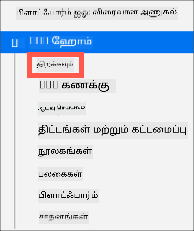
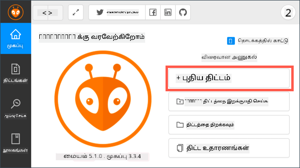
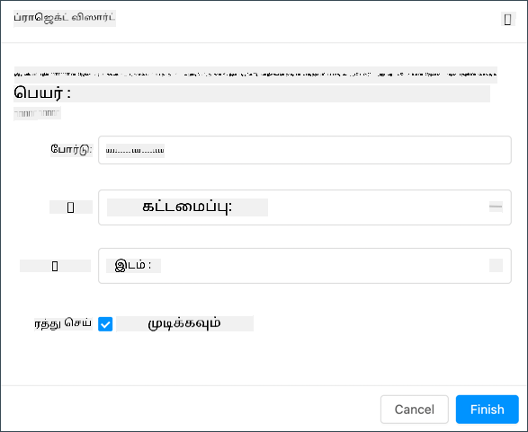
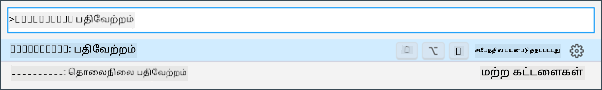
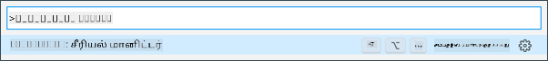

<!--
CO_OP_TRANSLATOR_METADATA:
{
  "original_hash": "a4f0c166010e31fd7b6ca20bc88dec6d",
  "translation_date": "2025-10-11T11:29:10+00:00",
  "source_file": "1-getting-started/lessons/1-introduction-to-iot/wio-terminal.md",
  "language_code": "ta"
}
-->
# Wio Terminal

[Seeed Studios Wio Terminal](https://www.seeedstudio.com/Wio-Terminal-p-4509.html) என்பது Arduino-க்கு இணக்கமான மைக்ரோகண்ட்ரோலர் ஆகும், இதில் WiFi மற்றும் சில சென்சார்கள் மற்றும் ஆக்டுவேட்டர்கள் உள்ளன. மேலும் சென்சார்கள் மற்றும் ஆக்டுவேட்டர்களை சேர்க்கும் போர்ட்கள் உள்ளன, [Grove](https://www.seeedstudio.com/category/Grove-c-1003.html) எனப்படும் ஹார்ட்வேரின் உதவியுடன்.


## அமைப்பு

உங்கள் Wio Terminal-ஐ பயன்படுத்த, உங்கள் கணினியில் சில இலவச மென்பொருட்களை நிறுவ வேண்டும். மேலும், WiFi-க்கு இணைக்கும்முன் Wio Terminal firmware-ஐ புதுப்பிக்க வேண்டும்.

### பணிகள் - அமைப்பு

தேவையான மென்பொருட்களை நிறுவி firmware-ஐ புதுப்பிக்கவும்.

1. Visual Studio Code (VS Code)-ஐ நிறுவவும். இது C/C++-ல் உங்கள் சாதனக் குறியீட்டை எழுத நீங்கள் பயன்படுத்தும் எடிட்டர் ஆகும். VS Code-ஐ நிறுவுவதற்கான வழிமுறைகளுக்கு [VS Code documentation](https://code.visualstudio.com?WT.mc_id=academic-17441-jabenn)-ஐ பார்க்கவும்.

    > 💁 Arduino வளர்ச்சிக்கான மற்றொரு பிரபலமான IDE [Arduino IDE](https://www.arduino.cc/en/software) ஆகும். நீங்கள் ஏற்கனவே இந்த கருவியைப் பயன்படுத்துவதில் பழகியவராக இருந்தால், VS Code மற்றும் PlatformIO-வுக்கு பதிலாக இதைப் பயன்படுத்தலாம். ஆனால் பாடங்கள் VS Code-ஐ அடிப்படையாகக் கொண்டு வழிமுறைகளை வழங்கும்.

1. VS Code PlatformIO extension-ஐ நிறுவவும். இது C/C++-ல் மைக்ரோகண்ட்ரோலர்களை நிரலாக்க ஆதரிக்க VS Code-க்கு ஒரு extension ஆகும். இந்த extension-ஐ VS Code-ல் நிறுவுவதற்கான வழிமுறைகளுக்கு [PlatformIO extension documentation](https://marketplace.visualstudio.com/items?WT.mc_id=academic-17441-jabenn&itemName=platformio.platformio-ide)-ஐ பார்க்கவும். இந்த extension, Microsoft C/C++ extension-ஐ சார்ந்துள்ளது, இது PlatformIO-ஐ நிறுவும்போது தானாகவே நிறுவப்படும்.

1. உங்கள் Wio Terminal-ஐ உங்கள் கணினியுடன் இணைக்கவும். Wio Terminal-க்கு கீழே USB-C போர்ட் உள்ளது, இது உங்கள் கணினியின் USB போர்டுடன் இணைக்கப்பட வேண்டும். Wio Terminal USB-C to USB-A கேபிளுடன் வருகிறது, ஆனால் உங்கள் கணினியில் USB-C போர்ட்கள் மட்டுமே இருந்தால், USB-C கேபிள் அல்லது USB-A to USB-C அடாப்டரை தேவைப்படும்.

1. [Wio Terminal Wiki WiFi Overview documentation](https://wiki.seeedstudio.com/Wio-Terminal-Network-Overview/)-இல் உள்ள வழிமுறைகளைப் பின்பற்றி உங்கள் Wio Terminal-ஐ அமைத்து firmware-ஐ புதுப்பிக்கவும்.

## ஹலோ வேர்ல்ட்

ஒரு புதிய நிரலாக்க மொழி அல்லது தொழில்நுட்பத்துடன் தொடங்கும்போது, `"Hello World"` போன்ற உரையை வெளியிடும் ஒரு சிறிய பயன்பாட்டை உருவாக்குவது வழக்கம். இது அனைத்து கருவிகளும் சரியாக அமைக்கப்பட்டுள்ளதைக் காட்டும்.

Wio Terminal-க்கான ஹலோ வேர்ல்ட் பயன்பாடு, Visual Studio Code மற்றும் PlatformIO சரியாக நிறுவப்பட்டு மைக்ரோகண்ட்ரோலர் வளர்ச்சிக்கான அமைப்பில் உள்ளதா என்பதை உறுதிப்படுத்தும்.

### PlatformIO திட்டத்தை உருவாக்கவும்

முதலாவது படி, Wio Terminal-க்கு அமைக்கப்பட்ட PlatformIO-ஐப் பயன்படுத்தி ஒரு புதிய திட்டத்தை உருவாக்குவது.

#### பணிகள் - PlatformIO திட்டத்தை உருவாக்கவும்

PlatformIO திட்டத்தை உருவாக்கவும்.

1. Wio Terminal-ஐ உங்கள் கணினியுடன் இணைக்கவும்

1. VS Code-ஐ தொடங்கவும்

1. PlatformIO ஐகான் பக்க மெனு பட்டியில் இருக்கும்:

    

    இந்த மெனு உருப்படியைத் தேர்ந்தெடுத்து *PIO Home -> Open* என்பதைத் தேர்ந்தெடுக்கவும்

    

1. வரவேற்பு திரையில் **+ New Project** பொத்தானைத் தேர்ந்தெடுக்கவும்

    

1. *Project Wizard*-இல் திட்டத்தை அமைக்கவும்:

    1. உங்கள் திட்டத்திற்கு `nightlight` என பெயரிடவும்

    1. *Board* dropdown-இல் `WIO` என தட்டச்சு செய்து போர்டுகளை வடிகட்டவும், *Seeeduino Wio Terminal*-ஐத் தேர்ந்தெடுக்கவும்

    1. *Framework*-ஐ *Arduino* ஆகவே விடவும்

    1. *Use default location* checkbox-ஐ தேர்ந்தெடுக்கவும் அல்லது அதை நீக்கி உங்கள் திட்டத்திற்கான இடத்தைத் தேர்ந்தெடுக்கவும்

    1. **Finish** பொத்தானைத் தேர்ந்தெடுக்கவும்

    

    PlatformIO, Wio Terminal-க்கு குறியீட்டை தொகுக்க தேவையான கூறுகளை பதிவிறக்கம் செய்து உங்கள் திட்டத்தை உருவாக்கும். இது சில நிமிடங்கள் ஆகலாம்.

### PlatformIO திட்டத்தை ஆராயவும்

VS Code explorer, PlatformIO wizard உருவாக்கிய பல கோப்புகள் மற்றும் கோப்புறைகளை காட்டும்.

#### கோப்புறைகள்

* `.pio` - இந்த கோப்புறை PlatformIO-க்கு தேவையான தற்காலிக தரவுகளை கொண்டுள்ளது, உதாரணமாக நூலகங்கள் அல்லது தொகுக்கப்பட்ட குறியீடு. இது நீக்கப்பட்டால் தானாகவே மீண்டும் உருவாக்கப்படும், மேலும் உங்கள் திட்டத்தை GitHub போன்ற தளங்களில் பகிரும்போது இதை source code control-க்கு சேர்க்க தேவையில்லை.
* `.vscode` - இந்த கோப்புறை PlatformIO மற்றும் VS Code-யால் பயன்படுத்தப்படும் கட்டமைப்புகளை கொண்டுள்ளது. இது நீக்கப்பட்டால் தானாகவே மீண்டும் உருவாக்கப்படும், மேலும் இதை source code control-க்கு சேர்க்க தேவையில்லை.
* `include` - இந்த கோப்புறை உங்கள் குறியீட்டில் கூடுதல் நூலகங்களைச் சேர்க்க தேவையான வெளிப்புற header கோப்புகளுக்காக உள்ளது. இந்த பாடங்களில் நீங்கள் இந்த கோப்புறையைப் பயன்படுத்தமாட்டீர்கள்.
* `lib` - இந்த கோப்புறை உங்கள் குறியீட்டில் அழைக்க வேண்டிய வெளிப்புற நூலகங்களுக்காக உள்ளது. இந்த பாடங்களில் நீங்கள் இந்த கோப்புறையைப் பயன்படுத்தமாட்டீர்கள்.
* `src` - இந்த கோப்புறை உங்கள் பயன்பாட்டிற்கான முக்கிய மூலக் குறியீட்டை கொண்டுள்ளது. ஆரம்பத்தில், இது `main.cpp` எனும் ஒரு கோப்பை மட்டுமே கொண்டிருக்கும்.
* `test` - இந்த கோப்புறை உங்கள் குறியீட்டிற்கான unit tests-ஐ வைத்திருக்கிறது.

#### கோப்புகள்

* `main.cpp` - `src` கோப்புறையில் உள்ள இந்த கோப்பு உங்கள் பயன்பாட்டிற்கான entry point-ஐ கொண்டுள்ளது. இந்த கோப்பைத் திறக்கவும், இது பின்வரும் குறியீட்டை கொண்டிருக்கும்:

    ```cpp
    #include <Arduino.h>
    
    void setup() {
      // put your setup code here, to run once:
    }
    
    void loop() {
      // put your main code here, to run repeatedly:
    }
    ```

    சாதனம் தொடங்கும்போது, Arduino framework `setup` செயல்பாட்டை ஒருமுறை இயக்கும், பின்னர் `loop` செயல்பாட்டை சாதனம் அணைக்கப்படும் வரை மீண்டும் மீண்டும் இயக்கும்.

* `.gitignore` - இந்த கோப்பு, உங்கள் குறியீட்டை GitHub போன்ற தளங்களில் பதிவேற்றும்போது git source code control-க்கு சேர்க்க வேண்டிய கோப்புகள் மற்றும் கோப்புறைகளை பட்டியலிடுகிறது.

* `platformio.ini` - இந்த கோப்பு உங்கள் சாதனம் மற்றும் பயன்பாட்டிற்கான கட்டமைப்புகளை கொண்டுள்ளது. இந்த கோப்பைத் திறக்கவும், இது பின்வரும் குறியீட்டை கொண்டிருக்கும்:

    ```ini
    [env:seeed_wio_terminal]
    platform = atmelsam
    board = seeed_wio_terminal
    framework = arduino
    ```

    `[env:seeed_wio_terminal]` பகுதி Wio Terminal-க்கான கட்டமைப்புகளை கொண்டுள்ளது. உங்கள் குறியீட்டை பல போர்டுகளுக்கு தொகுக்க பல `env` பகுதிகளை வைத்திருக்கலாம்.

    மற்ற மதிப்புகள் Project Wizard-இல் உள்ள கட்டமைப்புடன் பொருந்தும்:

  * `platform = atmelsam` Wio Terminal பயன்படுத்தும் ஹார்ட்வேரை வரையறுக்கிறது (ATSAMD51 அடிப்படையிலான மைக்ரோகண்ட்ரோலர்)
  * `board = seeed_wio_terminal` மைக்ரோகண்ட்ரோலர் போர்டின் வகையை வரையறுக்கிறது (Wio Terminal)
  * `framework = arduino` இந்த திட்டம் Arduino framework-ஐ பயன்படுத்துவதை வரையறுக்கிறது.

### ஹலோ வேர்ல்ட் பயன்பாட்டை எழுதவும்

இப்போது நீங்கள் ஹலோ வேர்ல்ட் பயன்பாட்டை எழுத தயாராக உள்ளீர்கள்.

#### பணிகள் - ஹலோ வேர்ல்ட் பயன்பாட்டை எழுதவும்

ஹலோ வேர்ல்ட் பயன்பாட்டை எழுதவும்.

1. VS Code-இல் `main.cpp` கோப்பைத் திறக்கவும்

1. குறியீட்டை பின்வருமாறு மாற்றவும்:

    ```cpp
    #include <Arduino.h>

    void setup()
    {
        Serial.begin(9600);

        while (!Serial)
            ; // Wait for Serial to be ready
    
        delay(1000);
    }
    
    void loop()
    {
        Serial.println("Hello World");
        delay(5000);
    }
    ```

    `setup` செயல்பாடு USB போர்டுடன் இணைப்பை ஆரம்பிக்கிறது - இது Wio Terminal உங்கள் கணினியுடன் இணைக்க பயன்படுத்தப்படும் USB போர்ட் ஆகும். `9600` என்ற அளவுரு [baud rate](https://wikipedia.org/wiki/Symbol_rate) (அல்லது Symbol rate) ஆகும், இது ஒரு வினாடிக்கு அனுப்பப்படும் தரவின் வேகத்தை (bits per second) குறிக்கிறது. இந்த அமைப்பு ஒரு வினாடிக்கு 9,600 bits (0s மற்றும் 1s) அனுப்பப்படும் என்பதை குறிக்கிறது. பின்னர், serial port தயாராக இருக்கும் வரை காத்திருக்கிறது.

    `loop` செயல்பாடு `Hello World!` என்ற வரியை serial port-க்கு அனுப்புகிறது, அதாவது `Hello World!` எழுத்துக்களுடன் ஒரு புதிய வரி எழுத்து. பின்னர், 5,000 milliseconds அல்லது 5 seconds தூங்குகிறது. `loop` முடிந்தவுடன், மீண்டும் இயக்கப்படும், மீண்டும், மீண்டும், மைக்ரோகண்ட்ரோலர் இயக்கத்தில் இருக்கும் வரை.

1. உங்கள் Wio Terminal-ஐ upload mode-க்கு மாற்றவும். சாதனத்தில் புதிய குறியீட்டை upload செய்யும் ஒவ்வொரு முறையும் இதைச் செய்ய வேண்டும்:

    1. பவர் சுவிட்சை இரண்டு முறை விரைவாக கீழே இழுக்கவும் - இது ஒவ்வொரு முறையும் மீண்டும் on நிலைக்கு திரும்பும்.

    1. USB போர்டின் வலது பக்கத்தில் உள்ள நீல நிலை LED-ஐ சரிபார்க்கவும். இது pulsing ஆக இருக்க வேண்டும்.
    
    [](https://youtu.be/LeKU_7zLRrQ)
    
    இதைச் செய்யும் முறையை காட்டும் வீடியோவைக் காண மேலே உள்ள படத்தை கிளிக் செய்யவும்.

1. குறியீட்டை Wio Terminal-க்கு build செய்து upload செய்யவும்

    1. VS Code command palette-ஐ திறக்கவும்

    1. `PlatformIO Upload` என type செய்து upload விருப்பத்தைத் தேடவும், *PlatformIO: Upload* என்பதைத் தேர்ந்தெடுக்கவும்

        

        PlatformIO, upload செய்யும் முன் குறியீட்டை build செய்ய தேவையானவை தானாக build செய்யும்.

    1. குறியீடு தொகுக்கப்பட்டு Wio Terminal-க்கு upload செய்யப்படும்

        > 💁 macOS-ஐப் பயன்படுத்தினால், *DISK NOT EJECTED PROPERLY* பற்றிய அறிவிப்பு தோன்றும். இது Wio Terminal flashing செயல்முறையின் ஒரு பகுதியாக drive ஆக mount செய்யப்படும், மேலும் compiled code சாதனத்தில் எழுதப்படும் போது இது disconnect செய்யப்படும். இந்த அறிவிப்பை நீங்கள் புறக்கணிக்கலாம்.

    ⚠️ Upload port கிடைக்கவில்லை என்ற பிழைகள் வந்தால், முதலில் உங்கள் Wio Terminal-ஐ உங்கள் கணினியுடன் இணைத்துள்ளீர்கள், மற்றும் திரையின் இடது பக்கத்தில் உள்ள சுவிட்சை பயன்படுத்தி on செய்துள்ளீர்கள் என்பதை உறுதிப்படுத்தவும். பின்புறத்தில் பச்சை விளக்கு on ஆக இருக்க வேண்டும், மற்றும் நீல விளக்கு pulsing ஆக இருக்க வேண்டும். இன்னும் பிழை வந்தால், on/off சுவிட்சை இரண்டு முறை விரைவாக கீழே இழுத்து Wio Terminal-ஐ upload mode-க்கு மாற்றவும், மற்றும் upload முயற்சிக்கவும்.

PlatformIO-க்கு Serial Monitor உள்ளது, இது Wio Terminal-இல் இருந்து USB கேபிள் மூலம் அனுப்பப்படும் தரவுகளை கண்காணிக்க உதவுகிறது. இது `Serial.println("Hello World");` கட்டளையால் அனுப்பப்படும் தரவுகளை கண்காணிக்க உதவுகிறது.

1. VS Code command palette-ஐ திறக்கவும்

1. `PlatformIO Serial` என type செய்து Serial Monitor விருப்பத்தைத் தேடவும், *PlatformIO: Serial Monitor* என்பதைத் தேர்ந்தெடுக்கவும்

    

    புதிய terminal திறக்கப்படும், மற்றும் serial port மூலம் அனுப்பப்படும் தரவுகள் இந்த terminal-க்கு stream செய்யப்படும்:

    ```output
    > Executing task: platformio device monitor <
    
    --- Available filters and text transformations: colorize, debug, default, direct, hexlify, log2file, nocontrol, printable, send_on_enter, time
    --- More details at http://bit.ly/pio-monitor-filters
    --- Miniterm on /dev/cu.usbmodem101  9600,8,N,1 ---
    --- Quit: Ctrl+C | Menu: Ctrl+T | Help: Ctrl+T followed by Ctrl+H ---
    Hello World
    Hello World
    ```

    `Hello World` ஒவ்வொரு 5 வினாடிகளுக்கும் serial monitor-ல் print செய்யப்படும்.

> 💁 இந்த குறியீட்டை [code/wio-terminal](../../../../../1-getting-started/lessons/1-introduction-to-iot/code/wio-terminal) கோப்புறையில் காணலாம்.

😀 உங்கள் 'ஹலோ வேர்ல்ட்' நிரல் வெற்றிகரமாக முடிந்தது!

---

**குறிப்பு**:  
இந்த ஆவணம் [Co-op Translator](https://github.com/Azure/co-op-translator) என்ற AI மொழிபெயர்ப்பு சேவையைப் பயன்படுத்தி மொழிபெயர்க்கப்பட்டுள்ளது. நாங்கள் துல்லியத்திற்காக முயற்சிக்கின்றோம், ஆனால் தானியங்கி மொழிபெயர்ப்புகளில் பிழைகள் அல்லது தவறான தகவல்கள் இருக்கக்கூடும் என்பதை தயவுசெய்து கவனத்தில் கொள்ளவும். அதன் தாய்மொழியில் உள்ள மூல ஆவணம் அதிகாரப்பூர்வ ஆதாரமாக கருதப்பட வேண்டும். முக்கியமான தகவல்களுக்கு, தொழில்முறை மனித மொழிபெயர்ப்பு பரிந்துரைக்கப்படுகிறது. இந்த மொழிபெயர்ப்பைப் பயன்படுத்துவதால் ஏற்படும் எந்த தவறான புரிதல்கள் அல்லது தவறான விளக்கங்களுக்கு நாங்கள் பொறுப்பல்ல.