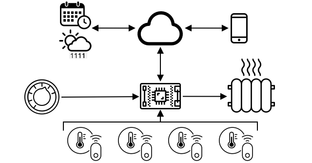
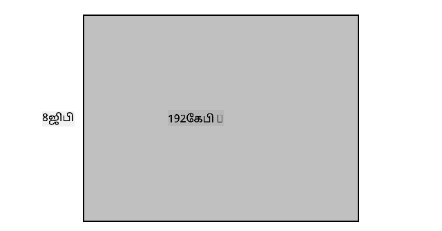
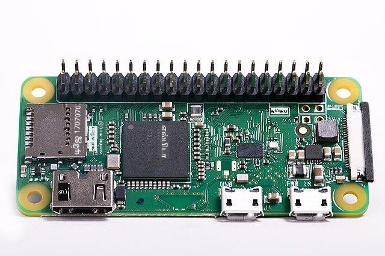

<!--
CO_OP_TRANSLATOR_METADATA:
{
  "original_hash": "9dd7f645ad1c6f20b72fee512987f772",
  "translation_date": "2025-10-11T11:30:02+00:00",
  "source_file": "1-getting-started/lessons/2-deeper-dive/README.md",
  "language_code": "ta"
}
-->
# IoT-ஐ ஆழமாக ஆராய்வது

> ஸ்கெட்ச் நோட்: [நித்யா நரசிம்மன்](https://github.com/nitya). பெரிய பதிப்பை பார்க்க படத்தை கிளிக் செய்யவும்.

இந்த பாடம் [Hello IoT தொடரின்](https://youtube.com/playlist?list=PLmsFUfdnGr3xRts0TIwyaHyQuHaNQcb6-) ஒரு பகுதியாக [Microsoft Reactor](https://developer.microsoft.com/reactor/?WT.mc_id=academic-17441-jabenn) மூலம் கற்பிக்கப்பட்டது. இந்த பாடம் 2 வீடியோக்களாக கற்பிக்கப்பட்டது - ஒரு மணி நேர பாடம் மற்றும் பாடத்தின் பகுதிகளை ஆழமாக ஆராய்ந்து கேள்விகளுக்கு பதிலளிக்கும் ஒரு மணி நேர அலுவலக நேரம்.

> 🎥 மேலே உள்ள படங்களை கிளிக் செய்து வீடியோக்களை பார்க்கவும்

## பாடத்திற்கு முன் வினாடி வினா

[பாடத்திற்கு முன் வினாடி வினா](https://black-meadow-040d15503.1.azurestaticapps.net/quiz/3)

## அறிமுகம்

இந்த பாடம் முந்தைய பாடத்தில் கற்றுக்கொண்ட சில கருத்துகளை ஆழமாக ஆராய்கிறது.

இந்த பாடத்தில் நாம் கற்க இருப்பது:

* [ஒரு IoT பயன்பாட்டின் கூறுகள்](../../../../../1-getting-started/lessons/2-deeper-dive)
* [மைக்ரோகண்ட்ரோலர்களை ஆழமாக ஆராய்வது](../../../../../1-getting-started/lessons/2-deeper-dive)
* [சிங்கிள்-போர்டு கணினிகளை ஆழமாக ஆராய்வது](../../../../../1-getting-started/lessons/2-deeper-dive)

## ஒரு IoT பயன்பாட்டின் கூறுகள்

ஒரு IoT பயன்பாட்டின் இரண்டு முக்கிய கூறுகள் *இணையம்* மற்றும் *தொக்கு* ஆகும். இவை பற்றி மேலும் விரிவாக பார்ப்போம்.

### தொக்கு (The Thing)

IoT-இல் **தொக்கு** என்பது புவியியல் உலகத்துடன் தொடர்பு கொள்ளும் சாதனத்தை குறிக்கிறது. இந்த சாதனங்கள் பொதுவாக சிறிய, குறைந்த விலையுள்ள கணினிகள், குறைந்த வேகத்தில் இயங்கும் மற்றும் குறைந்த மின்சாரத்தை பயன்படுத்தும் வகையில் இருக்கும் - உதாரணமாக, கிலோபைட்டுகள் அளவிலான RAM கொண்ட எளிய மைக்ரோகண்ட்ரோலர்கள் (ஒரு PC-யில் இருக்கும் ஜிகாபைட்டுகளுக்கு பதிலாக), சில நூறு மெகாஹெர்ட்ஸ் வேகத்தில் இயங்கும் (ஒரு PC-யில் இருக்கும் கிகாஹெர்ட்ஸுக்கு பதிலாக), ஆனால் சில சமயங்களில் மிகக் குறைந்த மின்சாரத்தை பயன்படுத்தி வாரங்கள், மாதங்கள் அல்லது ஆண்டுகள் கூட பேட்டரியில் இயங்க முடியும்.

இந்த சாதனங்கள் சென்சார்கள் மூலம் சுற்றுப்புறத்திலிருந்து தரவை சேகரிக்கவோ அல்லது அவுட்புட்கள் அல்லது ஆக்டுவேட்டர்களை கட்டுப்படுத்தி புவியியல் மாற்றங்களை ஏற்படுத்தவோ புவியியல் உலகத்துடன் தொடர்பு கொள்கின்றன. இதற்கான ஒரு பொதுவான உதாரணம் ஸ்மார்ட் தாபமானி (smart thermostat) ஆகும் - இது வெப்பநிலை சென்சார், டயல் அல்லது டச் ஸ்கிரீன் போன்ற ஒரு விருப்ப வெப்பநிலையை அமைக்கும் வழி, மற்றும் வெப்பநிலை கண்டறியப்பட்டால் வெப்பமூட்டும் அல்லது குளிரூட்டும் அமைப்பை இயக்கும் ஒரு இணைப்பை கொண்டிருக்கும். வெப்பநிலை சென்சார் அறை மிகவும் குளிராக இருப்பதை கண்டறிகிறது, அதனைத் தொடர்ந்து ஆக்டுவேட்டர் வெப்பமூட்டியை இயக்குகிறது.

IoT சாதனங்களாக செயல்படக்கூடிய பல்வேறு வகையான "தொக்குகள்" உள்ளன, குறிப்பிட்ட ஒரு செயலை உணரக்கூடிய தனிப்பட்ட ஹார்ட்வேர் முதல் பொதுவான பயன்பாட்டு சாதனங்கள் வரை, உங்கள் ஸ்மார்ட்போனும் கூட! ஒரு ஸ்மார்ட்போன் சென்சார்களைப் பயன்படுத்தி சுற்றுப்புறத்தை உணர முடியும், மற்றும் ஆக்டுவேட்டர்களை பயன்படுத்தி உலகத்துடன் தொடர்பு கொள்ள முடியும் - உதாரணமாக, உங்கள் இருப்பிடத்தை கண்டறிய GPS சென்சாரை பயன்படுத்துவது மற்றும் ஒரு இடத்திற்கான வழிகாட்டுதல்களை வழங்க ஸ்பீக்கரைப் பயன்படுத்துவது.

✅ உங்கள் சுற்றுப்புறத்தில் உள்ள மற்ற சிஸ்டங்களை யோசிக்கவும், அவை சென்சாரிலிருந்து தரவைப் படித்து முடிவுகளை எடுக்கும். ஒரு உதாரணம் ஓவனின் தாபமானி ஆகும். மேலும் பலவற்றை கண்டுபிடிக்க முடியுமா?

### இணையம் (The Internet)

IoT பயன்பாட்டின் **இணையம்** பகுதி IoT சாதனம் தரவை அனுப்பவும் பெறவும் இணைக்கக்கூடிய பயன்பாடுகள், மேலும் IoT சாதனத்திலிருந்து தரவை செயலாக்கவும், IoT சாதனத்தின் ஆக்டுவேட்டர்களுக்கு அனுப்ப வேண்டிய கோரிக்கைகளை முடிவெடுக்கவும் உதவும் பிற பயன்பாடுகளை உள்ளடக்கியது.

ஒரு பொதுவான அமைப்பு IoT சாதனம் இணைக்கக்கூடிய ஒரு வகையான கிளவுட் சேவையை கொண்டிருக்கும், மேலும் இந்த கிளவுட் சேவை பாதுகாப்பு போன்றவற்றை கையாளும், மேலும் IoT சாதனத்திலிருந்து செய்திகளைப் பெறவும், சாதனத்திற்கு மீண்டும் செய்திகளை அனுப்பவும் உதவும். இந்த கிளவுட் சேவை பிற பயன்பாடுகளுடன் இணைக்கப்படும், அவை சென்சார் தரவை செயலாக்கவோ சேமிக்கவோ அல்லது பிற சிஸ்டங்களிலிருந்து தரவுடன் சேர்த்து முடிவுகளை எடுக்கவோ உதவும்.

சாதனங்கள் எப்போதும் நேரடியாக WiFi அல்லது வயர்லெஸ் இணைப்புகள் மூலம் இணையத்துடன் இணைக்கப்படுவதில்லை. சில சாதனங்கள் Bluetooth போன்ற தொழில்நுட்பங்களைப் பயன்படுத்தி ஒருவருக்கொருவர் பேச மெஷ் நெட்வொர்க்கிங் பயன்படுத்துகின்றன, மேலும் இணைய இணைப்பைக் கொண்ட ஒரு ஹப் சாதனம் மூலம் இணைக்கப்படுகின்றன.

ஸ்மார்ட் தாபமானியின் உதாரணத்தில், தாபமானி வீட்டின் WiFi-ஐப் பயன்படுத்தி கிளவுட் சேவையுடன் இணைக்கப்படும். இது வெப்பநிலை தரவை இந்த கிளவுட் சேவைக்கு அனுப்பும், மேலும் அங்கிருந்து இது ஒரு வகையான தரவுத்தொகுப்பில் எழுதப்படும், இது வீட்டின் உரிமையாளருக்கு ஒரு போன் பயன்பாட்டைப் பயன்படுத்தி தற்போதைய மற்றும் முந்தைய வெப்பநிலைகளைச் சரிபார்க்க அனுமதிக்கும். கிளவுட் சேவையில் உள்ள மற்றொரு சேவை வீட்டின் உரிமையாளர் விரும்பும் வெப்பநிலையை அறிந்து, கிளவுட் சேவையின் மூலம் IoT சாதனத்திற்கு மீண்டும் செய்திகளை அனுப்பி, வெப்பமூட்டும் அமைப்பை இயக்க அல்லது நிறுத்தச் சொல்லும்.

மிகவும் புத்திசாலியான பதிப்பு, கிளவுட் உள்ள AI-ஐ பயன்படுத்தி, IoT சாதனங்களுடன் இணைக்கப்பட்ட பிற சென்சார்களிலிருந்து தரவுடன் சேர்த்து முடிவுகளை எடுக்க முடியும். உதாரணமாக, உங்கள் காலண்டரில் நீங்கள் விடுமுறையில் இருப்பதைப் படித்து உங்கள் வெப்பமூட்டியை அணைக்க முடியும், அல்லது நீங்கள் பயன்படுத்தும் அறைகளைப் பொறுத்து அறை வாரியாக வெப்பமூட்டியை அணைக்க முடியும், மேலும் தரவிலிருந்து கற்றுக்கொண்டு நேரத்துடன் மேலும் துல்லியமாக முடிவெடுக்க முடியும்.

✅ இணையத்துடன் இணைக்கப்பட்ட தாபமானியை மேலும் புத்திசாலியாக மாற்ற என்ன தரவுகள் உதவக்கூடும்?

### எட்ஜ் (Edge) IoT

IoT-இல் "I" என்பது இணையத்தைக் குறிக்கிறது, ஆனால் இந்த சாதனங்கள் இணையத்துடன் இணைக்க வேண்டிய அவசியமில்லை. சில சந்தர்ப்பங்களில், சாதனங்கள் 'எட்ஜ்' சாதனங்களுடன் - உங்கள் உள்ளூர் நெட்வொர்க்கில் இயங்கும் கேட்வே சாதனங்களுடன் இணைக்க முடியும், இதனால் தரவை இணையத்துடன் தொடர்பு கொள்ளாமல் செயலாக்க முடியும். இது அதிக அளவிலான தரவுகளுக்கு அல்லது மெதுவான இணைய இணைப்புக்கு வேகமாக இருக்கும், இணைய இணைப்பு சாத்தியமில்லாத இடங்களில், உதாரணமாக ஒரு கப்பலில் அல்லது மனிதாபிமான நெருக்கடி நேரத்தில் செயல்படும் போது ஆஃப்லைனில் இயங்க அனுமதிக்கும், மேலும் தரவை தனிப்பட்டதாக வைத்திருக்க உதவும். சில சாதனங்கள் கிளவுட் கருவிகளைப் பயன்படுத்தி உருவாக்கப்பட்ட செயலாக்க குறியீடுகளை உள்ளடக்கியிருக்கும், மேலும் இணைய இணைப்பை பயன்படுத்தாமல் உள்ளூர் தரவை சேகரிக்கவும் பதிலளிக்கவும் இயங்கும்.

இதற்கான ஒரு உதாரணம் Apple HomePod, Amazon Alexa அல்லது Google Home போன்ற ஸ்மார்ட் ஹோம் சாதனமாகும், இது கிளவுட்-இல் பயிற்சி பெற்ற AI மாதிரிகளைப் பயன்படுத்தி உங்கள் குரலைக் கேட்கும், ஆனால் சாதனத்தில் உள்ளூர் முறையில் இயங்கும். இந்த சாதனங்கள் ஒரு குறிப்பிட்ட வார்த்தை அல்லது வாக்கியத்தைச் சொன்னால் 'விழித்தெழும்', மேலும் உங்கள் பேச்சை செயலாக்க இணையத்துக்கு அனுப்பும். சாதனம் உங்கள் பேச்சில் ஒரு இடைவெளியை கண்டறியும் போது பேச்சை அனுப்புவதை நிறுத்தும். சாதனத்தை விழிப்பூட்டும் வார்த்தையுடன் நீங்கள் சொல்வதற்கும், சாதனம் கேட்குவதை நிறுத்திய பிறகு நீங்கள் சொல்வதற்கும் இடையில் உள்ள அனைத்தும் சாதன வழங்குநருக்கு இணையத்தால் அனுப்பப்படாது, எனவே தனிப்பட்டதாக இருக்கும்.

✅ தனியுரிமை முக்கியமான பிற சூழல்களை யோசிக்கவும், எனவே தரவின் செயலாக்கம் கிளவுட்-இல் செய்யாமல் எட்ஜ்-இல் செய்யப்படும். ஒரு குறிப்பாக - கேமராக்கள் அல்லது பிற இமேஜிங் சாதனங்கள் கொண்ட IoT சாதனங்களை யோசிக்கவும்.

### IoT பாதுகாப்பு

எந்த இணைய இணைப்பிலும், பாதுகாப்பு ஒரு முக்கியமான கருத்தாகும். 'IoT-இல் உள்ள S என்பது Security-ஐ குறிக்கிறது' என்ற பழைய நகைச்சுவை ஒன்று உள்ளது - IoT-இல் 'S' இல்லை, இது பாதுகாப்பற்றது என்பதை குறிக்கிறது.

IoT சாதனங்கள் ஒரு கிளவுட் சேவையுடன் இணைக்கப்படுகின்றன, எனவே அந்த கிளவுட் சேவை எவ்வளவு பாதுகாப்பாக இருக்கிறதோ அதற்கேற்ப IoT சாதனங்களும் பாதுகாப்பாக இருக்கும் - உங்கள் கிளவுட் சேவை எந்த சாதனத்தையும் இணைக்க அனுமதித்தால், தீய தரவை அனுப்பவோ அல்லது வைரஸ் தாக்குதல்களை நடத்தவோ முடியும். இது மிகவும் உண்மையான உலக விளைவுகளை ஏற்படுத்தும், ஏனெனில் IoT சாதனங்கள் பிற சாதனங்களை தொடர்பு கொள்ளவும் கட்டுப்படுத்தவும் செய்கின்றன. உதாரணமாக, [Stuxnet worm](https://wikipedia.org/wiki/Stuxnet) சென்ட்ரிஃபியூஜ்களில் உள்ள வால்வுகளை மாற்றி அவற்றை சேதப்படுத்தியது. ஹேக்கர்கள் [குறைந்த பாதுகாப்பை பயன்படுத்தி குழந்தை கண்காணிப்பு சாதனங்கள்](https://www.npr.org/sections/thetwo-way/2018/06/05/617196788/s-c-mom-says-baby-monitor-was-hacked-experts-say-many-devices-are-vulnerable) மற்றும் பிற வீட்டு கண்காணிப்பு சாதனங்களை அணுகியுள்ளனர்.

> 💁 சில நேரங்களில் IoT சாதனங்கள் மற்றும் எட்ஜ் சாதனங்கள் இணையத்திலிருந்து முற்றிலும் தனிமைப்படுத்தப்பட்ட நெட்வொர்க்கில் இயங்குகின்றன, இதனால் தரவை தனிப்பட்டதாகவும் பாதுகாப்பாகவும் வைத்திருக்க முடியும். இது [ஏர்-கேப்பிங்](https://wikipedia.org/wiki/Air_gap_(networking)) என்று அழைக்கப்படுகிறது.

## மைக்ரோகண்ட்ரோலர்களை ஆழமாக ஆராய்வது

முந்தைய பாடத்தில், மைக்ரோகண்ட்ரோலர்களை அறிமுகப்படுத்தினோம். இப்போது அவற்றை ஆழமாக ஆராய்வோம்.

### CPU

CPU என்பது மைக்ரோகண்ட்ரோலரின் 'மூளை' ஆகும். இது உங்கள் குறியீட்டை இயக்கும் செயலி மற்றும் இணைக்கப்பட்ட சாதனங்களிலிருந்து தரவை அனுப்பவும் பெறவும் முடியும். CPU-கள் ஒரு அல்லது அதற்கு மேற்பட்ட கோர்களைக் கொண்டிருக்கும் - அடிப்படையாக ஒரு அல்லது அதற்கு மேற்பட்ட CPU-கள் உங்கள் குறியீட்டை இயக்க ஒருங்கிணைந்து வேலை செய்யும்.

CPU-கள் ஒரு கடிகாரத்தை நம்புகின்றன, இது ஒரு வினாடிக்கு பல மில்லியன் அல்லது பில்லியன் முறை டிக் செய்யும். ஒவ்வொரு டிக் அல்லது சுழலும் CPU செய்யக்கூடிய செயல்களை ஒத்திசைக்கிறது. ஒவ்வொரு டிக்கிலும், CPU ஒரு நிரலிலிருந்து ஒரு கட்டளையை செயல்படுத்த முடியும், உதாரணமாக ஒரு வெளிப்புற சாதனத்திலிருந்து தரவைப் பெறவோ அல்லது கணித கணக்கீட்டைச் செய்யவோ. இந்த ஒழுங்கான சுழற்சி அனைத்து செயல்களும் அடுத்த கட்டளையை செயலாக்கும் முன் முடிக்கப்படுவதற்கான வாய்ப்பை வழங்குகிறது.

கடிகார சுழற்சி வேகமானதானால், ஒரு வினாடிக்கு செயலாக்கக்கூடிய கட்டளைகளின் எண்ணிக்கை அதிகரிக்கும், எனவே CPU வேகமாக இருக்கும். CPU வேகங்கள் [Hertz (Hz)](https://wikipedia.org/wiki/Hertz) என்ற அளவுகோலால் அளவிடப்படுகின்றன, இதில் 1 Hz என்பது ஒரு வினாடிக்கு ஒரு சுழற்சியை அல்லது கடிகார டிக்கைக் குறிக்கிறது.

> 🎓 CPU வேகங்கள் பெரும்பாலும் MHz அல்லது GHz-ல் கொடுக்கப்படுகின்றன. 1MHz என்பது 1 மில்லியன் Hz, 1GHz என்பது 1 பில்லியன் Hz.

> 💁 CPU-கள் [fetch-decode-execute cycle](https://wikipedia.org/wiki/Instruction_cycle) மூலம் நிரல்களை செயல்படுத்துகின்றன. ஒவ்வொரு கடிகார டிக்கிலும், CPU நினைவகத்திலிருந்து அடுத்த கட்டளையைப் பெறும், அதை டிகோடு செய்யும், பின்னர் இரண்டு எண்களைச் சேர்க்க [arithmetical logic unit (ALU)] போன்றவற்றைப் பயன்படுத்தும். சில செயல்பாடுகள் பல டிக்குகளை இயக்க நேரிடும், எனவே அடுத்த சுழற்சி அந்த கட்டளை முடிந்த பிறகு அடுத்த டிக்கில் இயங்கும்.

மைக்ரோகண்ட்ரோலர்களின் கடிகார வேகங்கள் டெஸ்க்டாப் அல்லது லேப்டாப் கணினிகள் அல்லது பெரும்பாலான ஸ்மார்ட்போன்களைவிட மிகவும் குறைவாக இருக்கும். உதாரணமாக, Wio Terminal-இல் உள்ள CPU 120MHz அல்லது 120,000,000 சுழற்சிகள் ஒரு வினாடிக்கு இயங்குகிறது.

✅ ஒரு சராசரி PC அல்லது Mac பல கோர்களுடன் பல GigaHertz-ல் இயங்கும் CPU-ஐக் கொண்டுள்ளது, அதாவது கடிகார டிக்குகள் ஒரு வினாடிக்கு பில்லியன் முறை இயங்கும். உங்கள் கணினியின் கடிகார வேகத்தை ஆராய்ந்து, அது Wio Terminal-ஐ விட எவ்வளவு முறை வேகமாக உள்ளது என்பதை ஒப்பிடுங்கள்.

ஒவ்வொரு கடிகார சுழற்சியும் மின்சாரத்தை இழுத்து வெப்பத்தை உருவாக்கும். டிக்குகள் வேகமாக இருந்தால், அதிக மின்சாரம் பயன்படுத்தப்படும் மற்றும் அதிக வெப்பம் உருவாகும். PC-களில் வெப்பத்தை அகற்ற வெப்ப சிங்கங்கள் மற்றும் விசிறிகள் உள்ளன, இல்லையெனில் அவை சில வினாடிகளில் அதிக வெப்பம் ஏற்பட்டு நிறுத்தப்படும். மைக்ரோகண்ட்ரோலர்களில் பெரும்பாலும் இவை இரண்டும் இல்லை, ஏனெனில் அவை மிகவும் குளிர்ச்சியாக இயங்குகின்றன, எனவே மிகவும் மெதுவாக இயங்குகின்றன. PC-கள் மெயின்ஸ் மின்சாரம் அல்லது சில மணி நேரங்களுக்கு பெரிய பேட்டரிகளைப் பயன்படுத்தி இயங்குகின்றன, மைக்ரோகண்ட்ரோலர்கள் சிறிய பேட்டரிகளில் நாட்கள், மாதங்கள் அல்லது ஆண்டுகள் இயங்க முடியும். மைக்ரோகண்ட்ரோலர்களில் வேகமான, அதிக மின்சார கோர்களும், மின்சார நுகர்வ
> 🎓 உங்கள் கோடுகளை சேமிக்கும் மெமரி, மின்சாரம் இல்லாதபோதும் நிலைத்திருக்கும்.

> 🎓 RAM உங்கள் கோடுகளை இயக்க பயன்படுத்தப்படுகிறது, மின்சாரம் இல்லாதபோது மீண்டும் அமைக்கப்படும்.

CPU போலவே, மைக்ரோகண்ட்ரோலரில் உள்ள மெமரி ஒரு PC அல்லது Mac-க்கு ஒப்பிடும்போது மிகச் சிறியது. ஒரு சாதாரண PC-க்கு 8 ஜிகாபைட்ஸ் (GB) RAM இருக்கலாம், அதாவது 8,000,000,000 பைட்ஸ், ஒவ்வொரு பைட்டும் ஒரு எழுத்து அல்லது 0-255 வரை ஒரு எண்ணை சேமிக்க போதுமான இடம் கொண்டது. மைக்ரோகண்ட்ரோலரில் RAM கிலோபைட்ஸ் (KB) மட்டுமே இருக்கும், ஒரு கிலோபைட் 1,000 பைட்ஸ் ஆகும். மேலே குறிப்பிடப்பட்ட Wio terminal-க்கு 192KB RAM உள்ளது, அதாவது 192,000 பைட்ஸ் - ஒரு சாதாரண PC-க்கு ஒப்பிடும்போது 40,000 மடங்கு குறைவாக!

கீழே உள்ள வரைபடம் 192KB மற்றும் 8GB இடையேயான அளவின் வித்தியாசத்தை காட்டுகிறது - மையத்தில் உள்ள சிறிய புள்ளி 192KB-ஐ பிரதிநிதித்துவப்படுத்துகிறது.

ப்ரோக்ராம் சேமிப்பு PC-க்கு ஒப்பிடும்போது குறைவாகவே இருக்கும். ஒரு சாதாரண PC-க்கு 500GB ஹார்டு டிரைவ் ப்ரோக்ராம் சேமிப்புக்கு இருக்கலாம், ஆனால் மைக்ரோகண்ட்ரோலரில் கிலோபைட்ஸ் அல்லது சில மெகாபைட்ஸ் (MB) சேமிப்பு மட்டுமே இருக்கலாம் (1MB என்பது 1,000KB அல்லது 1,000,000 பைட்ஸ்). Wio terminal-க்கு 4MB ப்ரோக்ராம் சேமிப்பு உள்ளது.

✅ சிறு ஆராய்ச்சி செய்யுங்கள்: நீங்கள் இதைப் படிக்க பயன்படுத்தும் கணினிக்கு எவ்வளவு RAM மற்றும் சேமிப்பு உள்ளது? இது மைக்ரோகண்ட்ரோலருடன் எப்படி ஒப்பிடப்படுகிறது?

### Input/Output

மைக்ரோகண்ட்ரோலர்கள் சென்சார்களிடமிருந்து தரவைப் படிக்கவும், ஆக்டுவேட்டர்களுக்கு கட்டுப்பாட்டு சிக்னல்களை அனுப்பவும் Input/Output (I/O) இணைப்புகளை தேவைப்படும். அவற்றில் பொதுவாக பல General-Purpose Input/Output (GPIO) பின்கள் இருக்கும். இந்த பின்கள் மென்பொருளில் உள்ளமைக்கப்படலாம், Input (அதாவது சிக்னல் பெறுதல்) அல்லது Output (சிக்னல் அனுப்புதல்) ஆக.

🧠⬅️ Input பின்கள் சென்சார்களிடமிருந்து மதிப்புகளைப் படிக்க பயன்படுத்தப்படும்.

🧠➡️ Output பின்கள் ஆக்டுவேட்டர்களுக்கு வழிகாட்டுதல்களை அனுப்பும்.

✅ இதைப் பற்றிய மேலும் தகவலை அடுத்த பாடத்தில் நீங்கள் கற்றுக்கொள்வீர்கள்.

#### Task

Wio Terminal-ஐ ஆராயுங்கள்.

இந்த பாடங்களுக்கு நீங்கள் Wio Terminal-ஐ பயன்படுத்தினால், GPIO பின்களை கண்டறியுங்கள். [Wio Terminal தயாரிப்பு பக்கம்](https://www.seeedstudio.com/Wio-Terminal-p-4509.html) இல் *Pinout diagram* பகுதியைத் தேடுங்கள், எந்த பின்கள் எவை என்பதை அறிய. Wio Terminal பின எண்களுடன் பின்புறத்தில் ஒட்டக்கூடிய ஸ்டிக்கர் ஒன்றுடன் வருகிறது, இதுவரை நீங்கள் அதைச் சேர்க்கவில்லை என்றால், அதைச் சேர்க்கவும்.

### Physical size

மைக்ரோகண்ட்ரோலர்கள் பொதுவாக சிறிய அளவில் இருக்கும், மிகச் சிறிய [Freescale Kinetis KL03 MCU ஒரு கால் பந்தின் குழியில் பொருந்தும் அளவுக்கு சிறியது](https://www.edn.com/tiny-arm-cortex-m0-based-mcu-shrinks-package/). ஒரு PC CPU 40mm x 40mm அளவைக் கொண்டிருக்கலாம், மேலும் CPU அதிக வெப்பம் ஏற்படாமல் சில விநாடிகள்以上 இயக்கப்படுவதற்காக வெப்ப சோறுகள் மற்றும் விசிறிகள் தேவைப்படும், இது முழு மைக்ரோகண்ட்ரோலருக்கு ஒப்பிடும்போது மிகவும் பெரியது. Wio terminal developer kit, மைக்ரோகண்ட்ரோலர், கேஸ், திரை மற்றும் பல இணைப்புகள் மற்றும் கூறுகளுடன், bare Intel i9 CPU-க்கு ஒப்பிடும்போது மிகச் சிறியது, மேலும் CPU வெப்ப சோறு மற்றும் விசிறியுடன் ஒப்பிடும்போது மிகவும் சிறியது!

| சாதனம்                          | அளவு                  |
| ------------------------------- | --------------------- |
| Freescale Kinetis KL03          | 1.6mm x 2mm x 1mm     |
| Wio terminal                    | 72mm x 57mm x 12mm    |
| Intel i9 CPU, Heat sink and fan | 136mm x 145mm x 103mm |

### Frameworks மற்றும் operating systems

அதிக வேகம் மற்றும் மெமரி அளவு குறைவாக இருப்பதால், மைக்ரோகண்ட்ரோலர்கள் ஒரு operating system (OS) ஐ PC அல்லது Mac-ல் உள்ள OS போல இயக்காது. உங்கள் கணினியை இயக்கும் operating system (Windows, Linux அல்லது macOS) பல மெமரி மற்றும் செயலாக்க சக்தியை தேவைப்படும், இது மைக்ரோகண்ட்ரோலருக்கு தேவையற்றது. மைக்ரோகண்ட்ரோலர்கள் பொதுவாக ஒரு அல்லது அதற்கு மேற்பட்ட குறிப்பிட்ட பணிகளைச் செய்ய நிரலிடப்படுகின்றன, ஆனால் PC அல்லது Mac போன்ற பொதுப் பயன்பாட்டு கணினி ஒரு user interface, இசை அல்லது திரைப்படங்களை இயக்க, ஆவணங்கள் அல்லது கோடுகளை எழுத, விளையாட, அல்லது இணையத்தை உலாவ, ஆதரிக்க வேண்டும்.

OS இல்லாமல் மைக்ரோகண்ட்ரோலரை நிரலிட நீங்கள் சில கருவிகளை தேவைப்படும், இது உங்கள் கோடுகளை மைக்ரோகண்ட்ரோலர் இயக்கக்கூடிய வழியில் உருவாக்க உதவும், எந்த peripherals-க்கும் பேச APIகளைப் பயன்படுத்தும். ஒவ்வொரு மைக்ரோகண்ட்ரோலரும் வேறுபட்டது, எனவே உற்பத்தியாளர்கள் பொதுவாக frameworks-ஐ ஆதரிக்கின்றனர், இது ஒரு 'recipe' பின்பற்ற உங்களை அனுமதிக்கிறது, உங்கள் கோடுகளை உருவாக்கி, framework-ஐ ஆதரிக்கும் எந்த மைக்ரோகண்ட்ரோலரிலும் இயக்க.

நீங்கள் OS-ஐ பயன்படுத்தி மைக்ரோகண்ட்ரோலர்களை நிரலிடலாம் - இது பொதுவாக real-time operating system (RTOS) என்று அழைக்கப்படுகிறது, ஏனெனில் இது real-time-ல் peripherals-க்கு தரவை அனுப்பவும் பெறவும் வடிவமைக்கப்பட்டுள்ளது. இந்த operating systems மிகவும் lightweight ஆக இருக்கும் மற்றும் கீழே உள்ள அம்சங்களை வழங்கும்:

* Multi-threading, உங்கள் கோடுகளை ஒரே நேரத்தில் பல கோடுகளை இயக்க அனுமதிக்கும், பல cores-ல் அல்லது ஒரு core-ல் மாறி மாறி.
* Networking, இணையத்தில் பாதுகாப்பாக தொடர்பு கொள்ள.
* Graphical user interface (GUI) கூறுகள், திரைகள் கொண்ட சாதனங்களில் user interfaces (UI) உருவாக்க.

✅ சில RTOSes பற்றி படிக்கவும்: [Azure RTOS](https://azure.microsoft.com/services/rtos/?WT.mc_id=academic-17441-jabenn), [FreeRTOS](https://www.freertos.org), [Zephyr](https://www.zephyrproject.org)

#### Arduino

[Arduino](https://www.arduino.cc) மாணவர்கள், பொழுதுபோக்கு ஆர்வலர்கள் மற்றும் தயாரிப்பாளர்களிடையே மிகவும் பிரபலமான மைக்ரோகண்ட்ரோலர் framework ஆகும். Arduino ஒரு open source electronics platform ஆகும், இது software மற்றும் hardware-ஐ இணைக்கிறது. Arduino boardகளை Arduino நிறுவனத்திலிருந்து அல்லது பிற உற்பத்தியாளர்களிடமிருந்து வாங்கலாம், பின்னர் Arduino framework-ஐப் பயன்படுத்தி code செய்யலாம்.

Arduino boardகள் C அல்லது C++-ல் code செய்யப்படும். C/C++-ஐப் பயன்படுத்துவது உங்கள் code-ஐ மிகவும் சிறியதாக compile செய்யவும், constrained device போன்ற மைக்ரோகண்ட்ரோலரில் வேகமாக இயக்கவும் உதவுகிறது. Arduino application-இன் core 'sketch' என்று அழைக்கப்படுகிறது, இது C/C++ code ஆகும், 2 functions - `setup` மற்றும் `loop` உடன். board தொடங்கும்போது, Arduino framework code `setup` function-ஐ ஒருமுறை இயக்கும், பின்னர் `loop` function-ஐ தொடர்ந்து இயக்கும், power off செய்யப்படும் வரை.

`setup` function-ல் உங்கள் setup code-ஐ எழுதலாம், WiFi மற்றும் cloud services-க்கு connect செய்ய அல்லது input மற்றும் output-க்கு pins-ஐ initialize செய்ய. உங்கள் loop code-ல் processing code-ஐ எழுதலாம், சென்சாரிலிருந்து மதிப்புகளைப் படிக்கவும், cloud-க்கு அனுப்பவும். ஒவ்வொரு loop-இலும் ஒரு delay சேர்க்கப்படும், உதாரணமாக, சென்சார் தரவை 10 விநாடிகளுக்கு ஒருமுறை அனுப்ப வேண்டும் என்றால், loop முடிவில் 10 விநாடிகள் delay சேர்க்கப்படும், மைக்ரோகண்ட்ரோலர் power save செய்ய தூங்கும், பின்னர் 10 விநாடிகள் கழித்து loop மீண்டும் இயக்கப்படும்.

✅ இந்த program architecture *event loop* அல்லது *message loop* என்று அழைக்கப்படுகிறது. பல applications இதை உள்கட்டமைப்பில் பயன்படுத்துகின்றன, மேலும் Windows, macOS அல்லது Linux போன்ற OSes-ல் இயங்கும் desktop applications-க்கு இது ஒரு தரநிலை ஆகும். `loop` user interface கூறுகள் (buttons போன்றவை) அல்லது keyboard போன்ற சாதனங்களிடமிருந்து messages-ஐ கேட்டு, அவற்றுக்கு பதிலளிக்கிறது. [event loop பற்றிய இந்த கட்டுரையில்](https://wikipedia.org/wiki/Event_loop) மேலும் படிக்கலாம்.

Arduino microcontrollers மற்றும் I/O pins-ஐ interact செய்ய standard libraries-ஐ வழங்குகிறது, இது வேறு microcontrollers-ல் இயங்குவதற்கு வேறு implementations-ஐ பயன்படுத்துகிறது. உதாரணமாக, [`delay` function](https://www.arduino.cc/reference/en/language/functions/time/delay/) கொடுக்கப்பட்ட காலத்திற்கு program-ஐ pause செய்யும், [`digitalRead` function](https://www.arduino.cc/reference/en/language/functions/digital-io/digitalread/) கொடுக்கப்பட்ட pin-இல் இருந்து `HIGH` அல்லது `LOW` மதிப்பை படிக்கும், எந்த board-ல் code இயங்கினாலும். இந்த standard libraries Arduino board ஒன்றுக்கு எழுதப்பட்ட code-ஐ வேறு Arduino board-க்கு recompile செய்ய அனுமதிக்கின்றன, pins ஒரே மாதிரியானவை மற்றும் boardகள் ஒரே அம்சங்களை ஆதரிக்கின்றன என்றால்.

Arduino projects-க்கு கூடுதல் அம்சங்களைச் சேர்க்க third-party Arduino libraries-களின் பெரிய ecosystem உள்ளது, சென்சார்கள் மற்றும் actuators-ஐப் பயன்படுத்த அல்லது cloud IoT services-க்கு connect செய்ய.

##### Task

Wio Terminal-ஐ ஆராயுங்கள்.

இந்த பாடங்களுக்கு நீங்கள் Wio Terminal-ஐ பயன்படுத்தினால், நீங்கள் கடந்த பாடத்தில் எழுதிய code-ஐ மீண்டும் படிக்கவும். `setup` மற்றும் `loop` function-ஐ கண்டறியுங்கள். `loop` function தொடர்ந்து அழைக்கப்படுவதற்கான serial output-ஐ கண்காணிக்கவும். `setup` function-ல் serial port-க்கு எழுத code சேர்க்க முயற்சிக்கவும், இது ஒவ்வொரு reboot-க்கும் ஒருமுறை மட்டுமே அழைக்கப்படும் என்பதை கவனிக்கவும். உங்கள் சாதனத்தை பக்கத்தில் உள்ள power switch-ஐ பயன்படுத்தி reboot செய்ய முயற்சிக்கவும், இது சாதனம் reboot செய்யும் ஒவ்வொரு முறையும் அழைக்கப்படும் என்பதை காட்ட.

## Single-board computers பற்றிய ஆழமான பார்வை

கடந்த பாடத்தில், single-board computers-ஐ அறிமுகப்படுத்தினோம். இப்போது அவற்றைப் பற்றி ஆழமாக பார்ப்போம்.

### Raspberry Pi

[Raspberry Pi Foundation](https://www.raspberrypi.org) என்பது 2009-ல் UK-இல் தொடங்கப்பட்ட ஒரு charity ஆகும், இது குறிப்பாக பள்ளி மட்டத்தில் கணினி அறிவியலைப் படிக்க ஊக்குவிக்கிறது. இந்த நோக்கத்தின் ஒரு பகுதியாக, அவர்கள் Raspberry Pi எனப்படும் single-board computer-ஐ உருவாக்கினர். Raspberry Pi-கள் தற்போது 3 வகைகளில் கிடைக்கின்றன - முழு அளவிலான பதிப்பு, சிறிய Pi Zero, மற்றும் உங்கள் இறுதி IoT சாதனத்தில் உருவாக்கக்கூடிய compute module.

முழு அளவிலான Raspberry Pi-யின் சமீபத்திய iteration Raspberry Pi 4B ஆகும். இது 1.5GHz வேகத்தில் இயங்கும் quad-core (4 core) CPU, 2, 4, அல்லது 8GB RAM, gigabit ethernet, WiFi, 2 HDMI ports (4k திரைகளை ஆதரிக்கும்), audio மற்றும் composite video output port, USB ports (2 USB 2.0, 2 USB 3.0), 40 GPIO pins, Raspberry Pi camera module-க்கு camera connector, மற்றும் SD card slot கொண்டது. இது 88mm x 58mm x 19.5mm அளவிலான board ஆகும், மேலும் 3A USB-C power supply மூலம் இயக்கப்படுகிறது. இவை US$35-ல் தொடங்குகின்றன, PC அல்லது Mac-க்கு ஒப்பிடும்போது மிகவும் மலிவானவை.

> 💁 Pi400 என்பது Pi4-ஐ keyboard-ல் உள்ளடக்கிய ஒரு all-in-one computer ஆகும்.

Pi Zero மிகவும் சிறியது, குறைந்த சக்தி கொண்டது. இது single core 1GHz CPU, 512MB RAM, WiFi (Zero W மாடலில்), single HDMI port, micro-USB port, 40 GPIO pins, Raspberry Pi camera module-க்கு camera connector, மற்றும் SD card slot கொண்டது. இது 65mm x 30mm x 5mm அளவிலானது, மேலும் மிகவும் குறைந்த சக்தி செலவிடுகிறது. Zero US$5, WiFi கொண்ட W பதிப்பு US$10.

> 🎓 இவற்றில் உள்ள CPUs ARM processors ஆகும், Intel/AMD x86 அல்லது x64 processors-க்கு மாறாக, நீங்கள் பெரும்பாலான PCs மற்றும் Macs-ல் காணலாம். இவை சில மைக்ரோகண்ட்ரோலர்களில் காணப்படும் CPUs போன்றவை, மேலும் பெரும்பாலான மொபைல் போன்களில், Microsoft Surface X-ல், மற்றும் புதிய Apple Silicon அடிப்படையிலான Apple Macs-ல் காணப்படும்.

Raspberry Pi-யின் அனைத்து வகைகளும் Raspberry Pi OS எனப்படும் Debian Linux பதிப்பை இயக்குகின்றன. இது lite version-ஆக கிடைக்கிறது, desktop இல்லாமல், இது headless projects-க்கு சிறந்தது, நீங்கள் திரையை தேவைப்படாத போது, அல்லது முழு desktop environment கொண்ட முழு version-ஆக கிடைக்கிறது, web browser, office applications, coding tools மற்றும் games உடன். OS Debian Linux பதிப்பாக இருப்பதால், நீங்கள் Debian-ல் இயங்கும் மற்றும் Pi-யின் ARM processor-க்கு உருவாக்கப்பட்ட எந்த application அல்லது tool-ஐயும் நிறுவலாம்.

#### Task

Raspberry Pi-ஐ ஆராயுங்கள்.

இந்த பாடங்களுக்கு நீங்கள் Raspberry Pi-ஐ பயன்படுத்தினால், board-ல் உள்ள hardware கூறுகள் பற்றிய தகவல்களைப் படிக்கவும்.

* [Raspberry Pi hardware documentation page](https://www.raspberrypi.org/documentation/hardware/raspberrypi/) இல் பயன்படுத்தப்படும் processors பற்றிய விவரங்களைப் படிக்கவும். நீங்கள் பயன்படுத்தும் Pi-யில் உள்ள processor பற்றிய தகவல்களைப் படிக்கவும்.
* GPIO பின்களை கண்டறியுங்கள். [Raspberry Pi GPIO documentation](https://www.raspberrypi.org/documentation/hardware/raspberrypi/gpio/README.md) இல் அவற்றைப் பற்றிய மேலும் தகவல்களைப் படிக்கவும். [GPIO Pin Usage guide](https://www.raspberrypi.org/documentation/usage/gpio/README.md) ஐப் பயன்படுத்தி உங்கள் Pi-யில் உள்ள பின்களின் விவரங்களை அறியவும்.

### Single-board computers-ஐ நிரலிடுதல்

Single-board computers முழு OS-ஐ இயக்கும் முழு கணினிகள் ஆகும். இதனால், மைக்ரோகண்ட்ரோலர்களுக்கு frameworks போன்ற board ஆதரவை நம்பும் தேவையின்றி, அவற்றை code செய்ய programming languages, frameworks மற்றும் tools-களின் பரந்த வரம்பு உள்ளது. பெரும்பாலான programming languages-களுக்கு GPIO pins-ஐ அணுகவும், சென்சார்கள் மற்றும் actuators-களிடமிருந்து தரவை அனுப்பவும் பெறவும் libraries உள்ளன.

✅ நீங்கள் அறிந்த programming languages என்ன? அவை Linux-ல் ஆதரிக்கப்படுகிறதா?
Raspberry Pi-யில் IoT பயன்பாடுகளை உருவாக்க மிகவும் பொதுவாக பயன்படுத்தப்படும் நிரலாக்க மொழி Python ஆகும். Pi-க்கு வடிவமைக்கப்பட்ட பெரும் hardware சூழல் உள்ளது, மேலும் இவற்றில் பெரும்பாலானவை Python libraries ஆக பயன்படுத்த தேவையான தொடர்புடைய code-ஐ கொண்டுள்ளன. இந்த hardware சூழல்களில் சில 'hats' அடிப்படையில் உருவாக்கப்பட்டவை - இவை Pi-யின் மேல் ஒரு தொப்பி போல அமர்ந்து 40 GPIO pins-க்கு பெரிய socket மூலம் இணைகின்றன. இந்த hats கூடுதல் திறன்களை வழங்குகின்றன, உதாரணமாக திரைகள், உணரிகள், remote-controlled cars, அல்லது standardized cables கொண்ட sensors-ஐ இணைக்க adapters.

### தொழில்முறை IoT பயன்பாடுகளில் single-board கணினிகளின் பயன்பாடு

Single-board கணினிகள் தொழில்முறை IoT பயன்பாடுகளுக்கு பயன்படுத்தப்படுகின்றன, developer kits ஆக மட்டுமல்ல. இவை hardware-ஐ கட்டுப்படுத்தவும், machine learning models போன்ற சிக்கலான பணிகளை இயக்கவும் சக்திவாய்ந்த வழியை வழங்குகின்றன. உதாரணமாக, [Raspberry Pi 4 compute module](https://www.raspberrypi.org/blog/raspberry-pi-compute-module-4/) உள்ளது, இது Raspberry Pi 4-ன் சக்தியை முழுமையாக வழங்குகிறது, ஆனால் compact மற்றும் மலிவான வடிவமைப்பில், பெரும்பாலான ports இல்லாமல், custom hardware-இல் நிறுவப்படுவதற்காக வடிவமைக்கப்பட்டுள்ளது.

---

## 🚀 சவால்

கடந்த பாடத்தில் உள்ள சவால் உங்கள் வீடு, பள்ளி அல்லது வேலை இடத்தில் உள்ள IoT சாதனங்களை όσο அதிகமாக பட்டியலிடுவது. இந்த பட்டியலில் உள்ள ஒவ்வொரு சாதனத்திற்கும், அவை microcontrollers அல்லது single-board computers அல்லது இரண்டின் கலவையால் உருவாக்கப்பட்டதா என்று நீங்கள் நினைக்கிறீர்களா?

## பாடத்திற்குப் பிந்தைய வினாடி வினா

[பாடத்திற்குப் பிந்தைய வினாடி வினா](https://black-meadow-040d15503.1.azurestaticapps.net/quiz/4)

## மதிப்பீடு & சுயபடிப்பு

* Arduino தளத்தைப் பற்றி மேலும் அறிய [Arduino getting started guide](https://www.arduino.cc/en/Guide/Introduction) படிக்கவும்.
* Raspberry Pi-களைப் பற்றி மேலும் அறிய [Raspberry Pi 4 அறிமுகம்](https://www.raspberrypi.org/products/raspberry-pi-4-model-b/) படிக்கவும்.
* [Electrical Engineering Journal-இல் உள்ள What the FAQ are CPUs, MPUs, MCUs, and GPUs கட்டுரை](https://www.eejournal.com/article/what-the-faq-are-cpus-mpus-mcus-and-gpus/) மூலம் சில கருத்துகள் மற்றும் சுருக்கங்களைப் பற்றி மேலும் அறிக.

✅ இந்த வழிகாட்டுதல்களைப் பயன்படுத்தி, [hardware guide](../../../hardware.md) லிங்குகளைப் பின்தொடர்ந்து காட்டப்படும் செலவுகளைப் பார்த்து, நீங்கள் எந்த hardware தளத்தைப் பயன்படுத்த விரும்புகிறீர்கள் என்பதை முடிவு செய்யவும் அல்லது ஒரு virtual device-ஐ பயன்படுத்த விரும்புகிறீர்களா என்பதை தீர்மானிக்கவும்.

## பணிக்கான ஒப்பந்தம்

[Microcontrollers மற்றும் single-board computers-ஐ ஒப்பிடவும் மற்றும் மாறுபாடுகளை விளக்கவும்](assignment.md)

---

**குறிப்பு**:  
இந்த ஆவணம் [Co-op Translator](https://github.com/Azure/co-op-translator) என்ற AI மொழிபெயர்ப்பு சேவையை பயன்படுத்தி மொழிபெயர்க்கப்பட்டுள்ளது. எங்கள் நோக்கம் துல்லியமாக இருக்க வேண்டும் என்பதுதான், ஆனால் தானியங்கி மொழிபெயர்ப்புகளில் பிழைகள் அல்லது துல்லியமின்மைகள் இருக்கக்கூடும் என்பதை தயவுசெய்து கவனத்தில் கொள்ளவும். அதன் தாய்மொழியில் உள்ள மூல ஆவணம் அதிகாரப்பூர்வ ஆதாரமாக கருதப்பட வேண்டும். முக்கியமான தகவல்களுக்கு, தொழில்முறை மனித மொழிபெயர்ப்பு பரிந்துரைக்கப்படுகிறது. இந்த மொழிபெயர்ப்பைப் பயன்படுத்துவதால் ஏற்படும் எந்த தவறான புரிதல்கள் அல்லது தவறான விளக்கங்களுக்கு நாங்கள் பொறுப்பல்ல.