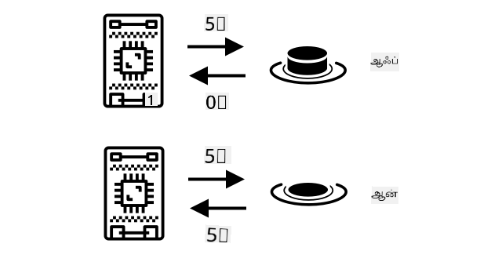
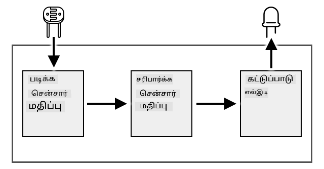
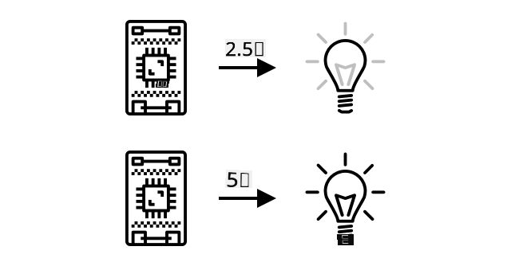
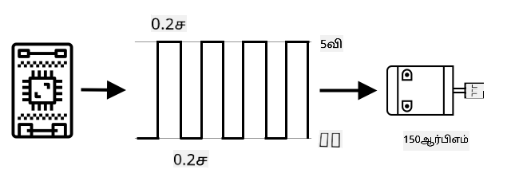
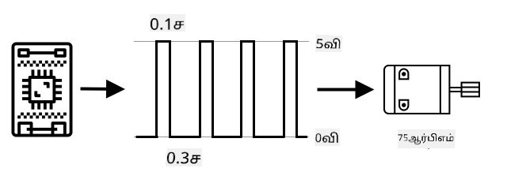
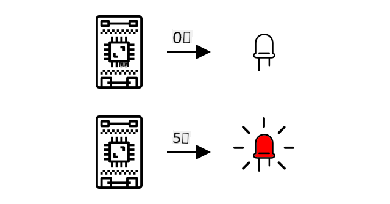

<!--
CO_OP_TRANSLATOR_METADATA:
{
  "original_hash": "e9ee00eb5fc55922a73762acc542166b",
  "translation_date": "2025-10-11T11:33:41+00:00",
  "source_file": "1-getting-started/lessons/3-sensors-and-actuators/README.md",
  "language_code": "ta"
}
-->
# சென்சார்கள் மற்றும் செயல்படுத்திகளுடன் பௌதிக உலகத்துடன் தொடர்பு கொள்ளுங்கள்


> ஸ்கெட்ச் நோட்: [நித்யா நரசிம்மன்](https://github.com/nitya). பெரிய பதிப்பைப் பார்க்க படத்தை கிளிக் செய்யவும்.

இந்த பாடம் [Hello IoT series](https://youtube.com/playlist?list=PLmsFUfdnGr3xRts0TIwyaHyQuHaNQcb6-) என்ற [Microsoft Reactor](https://developer.microsoft.com/reactor/?WT.mc_id=academic-17441-jabenn) தொடர் நிகழ்ச்சியின் ஒரு பகுதியாக கற்பிக்கப்பட்டது. இந்த பாடம் இரண்டு வீடியோக்களாக கற்பிக்கப்பட்டது - ஒரு மணி நேர பாடம் மற்றும் ஒரு மணி நேர அலுவலக நேரம், இதில் பாடத்தின் பகுதிகளை ஆழமாக ஆராய்ந்து கேள்விகளுக்கு பதிலளிக்கப்படுகிறது.

[](https://youtu.be/Lqalu1v6aF4)

[](https://youtu.be/qR3ekcMlLWA)

> 🎥 மேலே உள்ள படங்களை கிளிக் செய்து வீடியோக்களைப் பாருங்கள்

## பாடத்திற்கு முன் வினாடி வினா

[பாடத்திற்கு முன் வினாடி வினா](https://black-meadow-040d15503.1.azurestaticapps.net/quiz/5)

## அறிமுகம்

இந்த பாடம் உங்கள் IoT சாதனத்திற்கான இரண்டு முக்கியமான கருத்துக்களை அறிமுகப்படுத்துகிறது - சென்சார்கள் மற்றும் செயல்படுத்திகள். நீங்கள் இவற்றை இரண்டையும் நேரடியாக கையாளவும் கற்றுக்கொள்வீர்கள், உங்கள் IoT திட்டத்திற்கு ஒரு ஒளி சென்சாரை சேர்த்த பிறகு, ஒளி அளவுகளை கட்டுப்படுத்தும் ஒரு LED ஐ சேர்த்து, ஒரு இரவுக்கால விளக்கை உருவாக்குவீர்கள்.

இந்த பாடத்தில் நாம் கற்கப்போகிறோம்:

* [சென்சார்கள் என்றால் என்ன?](../../../../../1-getting-started/lessons/3-sensors-and-actuators)
* [ஒரு சென்சாரை பயன்படுத்துவது எப்படி](../../../../../1-getting-started/lessons/3-sensors-and-actuators)
* [சென்சார் வகைகள்](../../../../../1-getting-started/lessons/3-sensors-and-actuators)
* [செயல்படுத்திகள் என்றால் என்ன?](../../../../../1-getting-started/lessons/3-sensors-and-actuators)
* [ஒரு செயல்படுத்தியை பயன்படுத்துவது எப்படி](../../../../../1-getting-started/lessons/3-sensors-and-actuators)
* [செயல்படுத்தி வகைகள்](../../../../../1-getting-started/lessons/3-sensors-and-actuators)

## சென்சார்கள் என்றால் என்ன?

சென்சார்கள் என்பது பௌதிக உலகத்தை உணரும் ஹார்ட்வேர் சாதனங்கள் - அதாவது அவை சுற்றியுள்ள ஒரு அல்லது அதற்கு மேற்பட்ட பண்புகளை அளந்து, தகவல்களை IoT சாதனத்திற்கு அனுப்புகின்றன. இயற்கை பண்புகள், உதாரணமாக காற்றின் வெப்பநிலை போன்றவை முதல் இயக்கம் போன்ற பௌதிக தொடர்புகள் வரை பல விஷயங்களை அளவிடும் திறன் கொண்ட சாதனங்கள் சென்சார்கள் ஆகும்.

சில பொதுவான சென்சார்கள்:

* வெப்பநிலை சென்சார்கள் - இவை காற்றின் வெப்பநிலையையோ அல்லது தாங்கள் மூழ்கியுள்ள பொருளின் வெப்பநிலையையோ உணர்கின்றன. ஹாபியிஸ்ட்கள் மற்றும் டெவலப்பர்களுக்கு, இவை பெரும்பாலும் காற்றழுத்தம் மற்றும் ஈரப்பதம் ஆகியவற்றுடன் ஒருங்கிணைக்கப்பட்டிருக்கும்.
* பொத்தான்கள் - இவை அழுத்தப்பட்டால் உணர்கின்றன.
* ஒளி சென்சார்கள் - இவை ஒளி அளவுகளை கண்டறிகின்றன மற்றும் குறிப்பிட்ட நிறங்கள், UV ஒளி, IR ஒளி அல்லது பொதுவான காட்சியளிக்கும் ஒளிக்காக இருக்கலாம்.
* கேமராக்கள் - இவை உலகின் காட்சியளிக்கும் பிரதிபலிப்பை புகைப்படம் எடுப்பதன் மூலம் அல்லது வீடியோ ஸ்ட்ரீமிங் மூலம் உணர்கின்றன.
* ஆக்சிலரோமீட்டர்கள் - இவை பல திசைகளில் இயக்கத்தை உணர்கின்றன.
* மைக்ரோஃபோன்கள் - இவை ஒலியை உணர்கின்றன, பொதுவான ஒலி அளவுகளையோ அல்லது திசைமாற்றிய ஒலியையோ.

✅ சிறிது ஆராய்ச்சி செய்யுங்கள். உங்கள் கைப்பேசியில் என்னென்ன சென்சார்கள் உள்ளன?

அனைத்து சென்சார்களுக்கும் ஒரு பொதுவான அம்சம் உள்ளது - அவை உணரும் எந்த விஷயத்தையும் ஒரு மின்சார சிக்னலாக மாற்றி IoT சாதனத்தால் புரிந்துகொள்ளப்படக்கூடியதாக மாற்றுகின்றன. இந்த மின்சார சிக்னல் எப்படி புரிந்துகொள்ளப்படுகிறது என்பது சென்சாரின் தன்மையையும், IoT சாதனத்துடன் தொடர்பு கொள்ள பயன்படுத்தப்படும் தொடர்பு நெறிமுறையையும் பொறுத்தது.

## ஒரு சென்சாரை பயன்படுத்துவது எப்படி

உங்கள் IoT சாதனத்தில் ஒரு சென்சாரை சேர்க்க கீழே உள்ள வழிகாட்டுதல்களை பின்பற்றவும்:

* [Arduino - Wio Terminal](wio-terminal-sensor.md)
* [Single-board computer - Raspberry Pi](pi-sensor.md)
* [Single-board computer - Virtual device](virtual-device-sensor.md)

## சென்சார் வகைகள்

சென்சார்கள் அனலாக் அல்லது டிஜிட்டல் ஆக இருக்கலாம்.

### அனலாக் சென்சார்கள்

அனைத்து அடிப்படை சென்சார்களும் அனலாக் சென்சார்கள் ஆகும். இந்த சென்சார்கள் IoT சாதனத்திலிருந்து ஒரு மின்னழுத்தத்தைப் பெறுகின்றன, சென்சார் கூறுகள் இந்த மின்னழுத்தத்தை சரிசெய்கின்றன, மேலும் சென்சாரிலிருந்து திரும்பும் மின்னழுத்தம் அளவிடப்பட்டு சென்சார் மதிப்பை அளிக்கிறது.

> 🎓 மின்னழுத்தம் என்பது மின்சாரத்தை ஒரு இடத்திலிருந்து மற்றொரு இடத்திற்கு நகர்த்த எவ்வளவு அழுத்தம் இருக்கிறது என்பதை அளவிடும் ஒரு அளவீடு ஆகும். உதாரணமாக, ஒரு ஸ்டாண்டர்ட் AA பேட்டரி 1.5V (V என்பது வோல்ட்ஸ் என்ற குறியீடு) ஆகும், மேலும் அதன் பாசிட்டிவ் முனையத்திலிருந்து நெகட்டிவ் முனையத்திற்கு 1.5V அழுத்தத்துடன் மின்சாரத்தை நகர்த்த முடியும். மின்சார ஹார்ட்வேர் ஒவ்வொன்றும் வேலை செய்ய வெவ்வேறு மின்னழுத்தங்களை தேவைப்படும், உதாரணமாக, ஒரு LED 2-3V இடையே ஒளிரும், ஆனால் ஒரு 100W ஃபிலமென்ட் விளக்கு 240V தேவைப்படும். மின்னழுத்தம் பற்றிய மேலும் தகவலுக்கு [விக்கிபீடியாவின் மின்னழுத்த பக்கம்](https://wikipedia.org/wiki/Voltage) பார்க்கவும்.

இதற்கான ஒரு உதாரணம் ஒரு பொட்டென்ஷியோமீட்டர் ஆகும். இது இரண்டு நிலைகளுக்கு இடையில் சுழலக்கூடிய ஒரு டயல் ஆகும், மேலும் சென்சார் சுழற்சியை அளவிடுகிறது.


IoT சாதனம் 5 வோல்ட்கள் (5V) போன்ற மின்னழுத்தத்தில் பொட்டென்ஷியோமீட்டருக்கு மின்சார சிக்னலை அனுப்பும். பொட்டென்ஷியோமீட்டர் சரிசெய்யப்படும் போது, மற்ற பக்கத்தில் வரும் மின்னழுத்தத்தை மாற்றும். 

> 🎓 இது ஒரு எளிமையான விளக்கம் மட்டுமே, மேலும் பொட்டென்ஷியோமீட்டர்கள் மற்றும் மாறும் எதிர்ப்பாளர்கள் பற்றிய மேலும் தகவலுக்கு [விக்கிபீடியாவின் பொட்டென்ஷியோமீட்டர் பக்கம்](https://wikipedia.org/wiki/Potentiometer) பார்க்கவும்.

சென்சாரிலிருந்து வரும் மின்னழுத்தத்தை IoT சாதனம் வாசிக்கிறது, மேலும் சாதனம் அதற்கு பதிலளிக்க முடியும். 

✅ சென்சார் அனுப்பிய மின்னழுத்தம் அனுப்பியதை விட அதிகமாக இருந்தால் என்ன நடக்கும் என்று நீங்கள் நினைக்கிறீர்களா? ⛔️ இதை சோதிக்க முயற்சிக்காதீர்கள்.

#### அனலாக் முதல் டிஜிட்டல் மாற்றம்

IoT சாதனங்கள் டிஜிட்டல் ஆகும் - அவை அனலாக் மதிப்புகளுடன் வேலை செய்ய முடியாது, அவை 0 மற்றும் 1 களுடன் மட்டுமே வேலை செய்யும். எனவே, அனலாக் சென்சார் மதிப்புகள் டிஜிட்டல் சிக்னலாக மாற்றப்பட வேண்டும். 

IoT சாதனங்களில் பலவற்றில் அனலாக்-டூ-டிஜிட்டல் மாற்றிகள் (ADCs) உள்ளன, அவை அனலாக் உள்ளீடுகளை டிஜிட்டல் மதிப்புகளாக மாற்றுகின்றன. 

✅ நீங்கள் பைனரி பற்றி தெரியாவிட்டால், 0 மற்றும் 1 களால் எண்கள் எப்படி பிரதிநிதித்துவம் செய்யப்படுகின்றன என்பதைப் பற்றி சிறிது ஆராயுங்கள். [BBC Bitesize இன் பைனரி அறிமுக பாடம்](https://www.bbc.co.uk/bitesize/guides/zwsbwmn/revision/1) ஒரு சிறந்த தொடக்க இடமாகும்.

குறியீட்டு பார்வையில், இது அனைத்தும் பொதுவாக சென்சார்களுடன் வரும் நூலகங்களால் கையாளப்படுகிறது, எனவே இந்த மாற்றத்தை நீங்கள் கவலைப்பட வேண்டியதில்லை.

### டிஜிட்டல் சென்சார்கள்

டிஜிட்டல் சென்சார்கள், அனலாக் சென்சார்களைப் போலவே, மின்சார மின்னழுத்த மாற்றங்களைப் பயன்படுத்தி சுற்றியுள்ள உலகத்தை உணர்கின்றன. 

சரியான டிஜிட்டல் சென்சார் என்பது ஒரு பொத்தான் அல்லது சுவிட்ச் ஆகும். இது இரண்டு நிலைகளை மட்டுமே அளவிடும் சென்சார் ஆகும், ஆன் அல்லது ஆஃப்.



IoT சாதனத்தின் பின்கள், உதாரணமாக GPIO பின்கள், இந்த சிக்னலை நேரடியாக 0 அல்லது 1 ஆக அளவிட முடியும். 

## செயல்படுத்திகள் என்றால் என்ன?

செயல்படுத்திகள் என்பது சென்சார்களுக்கு எதிர்மறையானவை - அவை உங்கள் IoT சாதனத்திலிருந்து மின்சார சிக்னல்களை பௌதிக உலகத்துடன் தொடர்புடைய செயல்பாடுகளாக மாற்றுகின்றன, உதாரணமாக ஒளி அல்லது ஒலியை வெளியிடுவது, அல்லது ஒரு மோட்டாரை இயக்குவது போன்றவை.

சில பொதுவான செயல்படுத்திகள்:

* LED - இவை ஆன் செய்யப்படும் போது ஒளி வெளியிடும்.
* ஸ்பீக்கர் - இவை ஒலி வெளியிடும், ஒரு அடிப்படை பஸ்ஸர் முதல் இசை வாசிக்கும் ஆடியோ ஸ்பீக்கர் வரை.
* ஸ்டெப்பர் மோட்டார் - இவை ஒரு குறிப்பிட்ட அளவு சுழற்சியாக மின்சார சிக்னல்களை மாற்றுகின்றன.
* ரிலே - இவை மின்சார சிக்னலால் ஆன் அல்லது ஆஃப் செய்யக்கூடிய சுவிட்ச்கள். 

✅ சிறிது ஆராய்ச்சி செய்யுங்கள். உங்கள் கைப்பேசியில் என்னென்ன செயல்படுத்திகள் உள்ளன?

## ஒரு செயல்படுத்தியை பயன்படுத்துவது எப்படி

உங்கள் IoT சாதனத்தில் ஒரு செயல்படுத்தியைச் சேர்க்க கீழே உள்ள வழிகாட்டுதல்களை பின்பற்றவும். 



* [Arduino - Wio Terminal](wio-terminal-actuator.md)
* [Single-board computer - Raspberry Pi](pi-actuator.md)
* [Single-board computer - Virtual device](virtual-device-actuator.md)

## செயல்படுத்தி வகைகள்

சென்சார்களைப் போலவே, செயல்படுத்திகளும் அனலாக் அல்லது டிஜிட்டல் ஆக இருக்கலாம்.

### அனலாக் செயல்படுத்திகள்

அனலாக் செயல்படுத்திகள் ஒரு அனலாக் சிக்னலைப் பெற்று அதை ஒரு பௌதிக செயல்பாடாக மாற்றுகின்றன, மேலும் அந்த செயல்பாடு வழங்கப்படும் மின்னழுத்தத்தின் அடிப்படையில் மாறும்.
ஒரு உதாரணம் உங்கள் வீட்டில் இருக்கும் மின்விளக்குகள் போன்ற மின்விளக்குகள். மின்விளக்கிற்கு வழங்கப்படும் மின்னழுத்தத்தின் அளவே அதன் பிரகாசத்தை நிர்ணயிக்கிறது.



சென்சார்கள் போலவே, உண்மையான IoT சாதனம் அனலாக் சிக்னல்களுடன் வேலை செய்யாது, அது டிஜிட்டல் சிக்னல்களுடன் வேலை செய்யும். இதனால், ஒரு அனலாக் சிக்னலை அனுப்ப IoT சாதனத்திற்கு ஒரு டிஜிட்டல்-டூ-அனலாக் கன்வெர்டர் (DAC) தேவைப்படும், είτε IoT சாதனத்தில் நேரடியாகவே, அல்லது ஒரு இணைப்பு போர்டில். இது IoT சாதனத்திலிருந்து வரும் 0 மற்றும் 1-களை அனலாக் மின்னழுத்தமாக மாற்றி செயலி பயன்படுத்தக்கூடியதாக மாற்றும்.

✅ IoT சாதனம் செயலி கையாள முடியாத அளவுக்கு அதிக மின்னழுத்தத்தை அனுப்பினால் என்ன நடக்கும் என்று நீங்கள் நினைக்கிறீர்கள்?
⛔️ இதை சோதிக்க முயற்சிக்காதீர்கள்.

#### பல்ஸ்-விட்த் மோடுலேஷன்

IoT சாதனத்திலிருந்து அனலாக் சிக்னலாக டிஜிட்டல் சிக்னல்களை மாற்ற மற்றொரு விருப்பம் பல்ஸ்-விட்த் மோடுலேஷன் ஆகும். இது அனலாக் சிக்னலாக செயல்படும் பல குறுகிய டிஜிட்டல் பல்ஸ்களை அனுப்புவதைக் கொண்டுள்ளது.

உதாரணமாக, நீங்கள் PWM-ஐ பயன்படுத்தி ஒரு மோட்டாரின் வேகத்தை கட்டுப்படுத்தலாம்.

நீங்கள் 5V மின்சப்ளை கொண்ட ஒரு மோட்டாரை கட்டுப்படுத்துவதாக கற்பனை செய்யுங்கள். உங்கள் மோட்டாருக்கு ஒரு குறுகிய பல்ஸை அனுப்பி, மின்னழுத்தத்தை 0.02 வினாடிகளுக்கு (0.02s) உயர்ந்த (5V) நிலையில் மாற்றுகிறீர்கள். அந்த நேரத்தில் உங்கள் மோட்டார் ஒரு பத்து வட்டத்தை அல்லது 36° சுழலக்கூடியது. பின்னர் சிக்னல் 0.02 வினாடிகளுக்கு (0.02s) இடைநிறுத்தம் செய்யப்படுகிறது, குறைந்த சிக்னல் (0V) அனுப்பப்படுகிறது. ஒவ்வொரு சுழற்சியும் 0.04 வினாடிகள் நீடிக்கும். சுழற்சி மீண்டும் மீண்டும் நடக்கிறது.



இதன் பொருள், ஒரு வினாடியில் 0.02s நீளமான 25 5V பல்ஸ்கள் மோட்டாரை சுழலச் செய்கின்றன, ஒவ்வொன்றும் 0.02s இடைநிறுத்தத்துடன் 0V-ல் மோட்டார் சுழலாமல் இருக்கும். ஒவ்வொரு பல்ஸும் மோட்டாரை ஒரு பத்து வட்டம் சுழலச் செய்கிறது, அதாவது மோட்டார் ஒரு வினாடிக்கு 2.5 வட்டங்களை முடிக்கிறது. நீங்கள் ஒரு டிஜிட்டல் சிக்னலை பயன்படுத்தி மோட்டாரை ஒரு வினாடிக்கு 2.5 வட்டங்கள் அல்லது 150 [மினிட் சுழற்சிகள்](https://wikipedia.org/wiki/Revolutions_per_minute) (சுழற்சியின் வேகத்தை அளவிடும் ஒரு முறை) சுழலச் செய்துள்ளீர்கள்.

```output
25 pulses per second x 0.1 rotations per pulse = 2.5 rotations per second
2.5 rotations per second x 60 seconds in a minute = 150rpm
```

> 🎓 ஒரு PWM சிக்னல் பாதி நேரத்திற்கு இயக்கத்தில் இருக்கும் போது, மற்றும் பாதி நேரத்திற்கு இயக்கத்தில் இல்லாமல் இருக்கும் போது, அதை [50% டியூட்டி சைக்கிள்](https://wikipedia.org/wiki/Duty_cycle) என்று குறிப்பிடுகிறார்கள். டியூட்டி சைக்கிள்கள் சிக்னல் இயக்கத்தில் இருக்கும் நேரத்தை இயக்கத்தில் இல்லாத நேரத்துடன் ஒப்பிடும் சதவீதமாக அளவிடப்படுகின்றன.



நீங்கள் பல்ஸ்களின் அளவை மாற்றி மோட்டாரின் வேகத்தை மாற்றலாம். உதாரணமாக, அதே மோட்டாருடன் 0.04s சுழற்சியின் நேரத்தை ஒரே மாதிரியாக வைத்துக்கொண்டு, இயக்கத்தில் இருக்கும் பல்ஸை 0.01s ஆக குறைத்து, இயக்கத்தில் இல்லாத பல்ஸை 0.03s ஆக அதிகரிக்கலாம். நீங்கள் ஒரு வினாடிக்கு அதே எண்ணிக்கையிலான பல்ஸ்களை (25) வைத்திருக்கிறீர்கள், ஆனால் ஒவ்வொரு இயக்கத்தில் இருக்கும் பல்ஸும் பாதி நீளமாக இருக்கும். ஒரு பாதி நீள பல்ஸு மோட்டாரை ஒரு இருபதாம் வட்டம் சுழலச் செய்யும், மற்றும் 25 பல்ஸ்கள் ஒரு வினாடிக்கு 1.25 வட்டங்களை முடிக்கிறது அல்லது 75rpm. ஒரு டிஜிட்டல் சிக்னலின் புல்ஸ் வேகத்தை மாற்றி, நீங்கள் ஒரு அனலாக் மோட்டாரின் வேகத்தை பாதியாக குறைத்துள்ளீர்கள்.

```output
25 pulses per second x 0.05 rotations per pulse = 1.25 rotations per second
1.25 rotations per second x 60 seconds in a minute = 75rpm
```

✅ மோட்டார் சுழற்சியை மிருதுவாக வைத்திருக்க, குறிப்பாக குறைந்த வேகத்தில், நீங்கள் நீண்ட இடைவெளிகளுடன் குறைந்த எண்ணிக்கையிலான நீண்ட பல்ஸ்களை பயன்படுத்துவீர்களா அல்லது மிகக் குறுகிய இடைவெளிகளுடன் அதிக எண்ணிக்கையிலான குறுகிய பல்ஸ்களை பயன்படுத்துவீர்களா?

> 💁 சில சென்சார்கள் அனலாக் சிக்னல்களை டிஜிட்டல் சிக்னல்களாக மாற்ற PWM-ஐ பயன்படுத்துகின்றன.

> 🎓 புல்ஸ்-விட்த் மோடுலேஷன் பற்றிய மேலும் தகவல்களை [Wikipedia புல்ஸ்-விட்த் மோடுலேஷன் பக்கம்](https://wikipedia.org/wiki/Pulse-width_modulation) இல் படிக்கலாம்.

### டிஜிட்டல் செயலிகள்

டிஜிட்டல் செயலிகள், டிஜிட்டல் சென்சார்கள் போலவே, உயர் அல்லது குறைந்த மின்னழுத்தத்தால் கட்டுப்படுத்தப்படும் இரண்டு நிலைகள் கொண்டவை அல்லது DAC உடன் இணைக்கப்பட்டிருக்கும், எனவே டிஜிட்டல் சிக்னலை அனலாக் சிக்னலாக மாற்ற முடியும்.

ஒரு எளிய டிஜிட்டல் செயலி LED ஆகும். ஒரு சாதனம் 1 என்ற டிஜிட்டல் சிக்னலை அனுப்பும் போது, ஒரு உயர் மின்னழுத்தம் அனுப்பப்படுகிறது, இது LED-ஐ ஒளிரச் செய்கிறது. 0 என்ற டிஜிட்டல் சிக்னல் அனுப்பப்படும் போது, மின்னழுத்தம் 0V ஆக குறைகிறது, மற்றும் LED அணைக்கப்படுகிறது.



✅ மற்ற எளிய 2-நிலை செயலிகளை நீங்கள் யோசிக்க முடியும்? ஒரு உதாரணம் சோலெனாய்டு ஆகும், இது ஒரு மின்காந்தமாக செயல்படுகிறது, இது கதவின் பூட்டை நகர்த்துவதற்கு/திறக்க/மூடுவதற்கு உதவுகிறது.

மேலும் மேம்பட்ட டிஜிட்டல் செயலிகள், உதாரணமாக திரைகள், டிஜிட்டல் தரவுகளை குறிப்பிட்ட வடிவங்களில் அனுப்ப வேண்டும். அவை பொதுவாக அவற்றை கட்டுப்படுத்த சரியான தரவுகளை அனுப்ப எளிதாக்கும் நூலகங்களுடன் வருகிறது.

---

## 🚀 சவால்

கடந்த இரண்டு பாடங்களில் சவால் உங்கள் வீடு, பள்ளி அல்லது வேலை இடத்தில் உள்ள IoT சாதனங்களை जितना முடியும் பட்டியலிடுவது மற்றும் அவை மைக்ரோகண்ட்ரோலர்கள் அல்லது சிங்கிள்-போர்டு கணினிகள் அல்லது இரண்டின் கலவையை அடிப்படையாகக் கொண்டவை என்பதை தீர்மானிப்பது.

நீங்கள் பட்டியலிட்ட ஒவ்வொரு சாதனத்திற்கும், அவை எந்த சென்சார்கள் மற்றும் செயலிகளுடன் இணைக்கப்பட்டுள்ளன? இந்த சாதனங்களுடன் இணைக்கப்பட்டுள்ள ஒவ்வொரு சென்சார் மற்றும் செயலியின் நோக்கம் என்ன?

## பாடத்திற்குப் பிந்தைய வினாடி வினா

[பாடத்திற்குப் பிந்தைய வினாடி வினா](https://black-meadow-040d15503.1.azurestaticapps.net/quiz/6)

## மதிப்பீடு & சுயபடிப்பு

* [ThingLearn](http://thinglearn.jenlooper.com/curriculum/) இல் மின்சாரம் மற்றும் சுற்றுகள் பற்றிய தகவல்களை படிக்கவும்.
* [Seeed Studios Temperature Sensors guide](https://www.seeedstudio.com/blog/2019/10/14/temperature-sensors-for-arduino-projects/) இல் வெவ்வேறு வகையான வெப்பநிலை சென்சார்கள் பற்றிய தகவல்களை படிக்கவும்.
* [Wikipedia LED page](https://wikipedia.org/wiki/Light-emitting_diode) இல் LED-கள் பற்றிய தகவல்களை படிக்கவும்.

## பணிக்கட்டளை

[சென்சார்கள் மற்றும் செயலிகளை ஆராயுங்கள்](assignment.md)

---

**குறிப்பு**:  
இந்த ஆவணம் [Co-op Translator](https://github.com/Azure/co-op-translator) என்ற AI மொழிபெயர்ப்பு சேவையைப் பயன்படுத்தி மொழிபெயர்க்கப்பட்டுள்ளது. நாங்கள் துல்லியத்திற்காக முயற்சிக்கின்றோம், ஆனால் தானியக்க மொழிபெயர்ப்புகளில் பிழைகள் அல்லது தவறான தகவல்கள் இருக்கக்கூடும் என்பதை தயவுசெய்து கவனத்தில் கொள்ளுங்கள். அதன் தாய்மொழியில் உள்ள மூல ஆவணம் அதிகாரப்பூர்வ ஆதாரமாக கருதப்பட வேண்டும். முக்கியமான தகவல்களுக்கு, தொழில்முறை மனித மொழிபெயர்ப்பு பரிந்துரைக்கப்படுகிறது. இந்த மொழிபெயர்ப்பைப் பயன்படுத்துவதால் ஏற்படும் எந்த தவறான புரிதல்கள் அல்லது தவறான விளக்கங்களுக்கு நாங்கள் பொறுப்பல்ல.