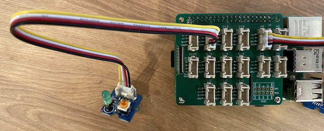

<!--
CO_OP_TRANSLATOR_METADATA:
{
  "original_hash": "4db8a3879a53490513571df2f6cf7641",
  "translation_date": "2025-10-11T11:33:05+00:00",
  "source_file": "1-getting-started/lessons/3-sensors-and-actuators/pi-actuator.md",
  "language_code": "ta"
}
-->
# இரவுத்தூக்க விளக்கை உருவாக்குதல் - ராஸ்பெர்ரி பை

இந்த பாடத்தின் இந்த பகுதியில், உங்கள் ராஸ்பெர்ரி பை-க்கு ஒரு LED ஐ சேர்த்து, அதை பயன்படுத்தி ஒரு இரவுத்தூக்க விளக்கை உருவாக்குவீர்கள்.

## ஹார்ட்வேர்கள்

இப்போது இரவுத்தூக்க விளக்கத்திற்கு ஒரு செயலி தேவை.

செயலி என்பது **LED**, [ஒளி வெளியேற்றும் டையோடு](https://wikipedia.org/wiki/Light-emitting_diode) ஆகும், இது மின்சாரம் பாயும் போது ஒளி வெளியேற்றுகிறது. இது ஒரு டிஜிட்டல் செயலி, இது இரண்டு நிலைகளைக் கொண்டுள்ளது: ஆன் மற்றும் ஆஃப். 1 என்ற மதிப்பை அனுப்புவது LED ஐ ஆன் செய்கிறது, 0 என்ற மதிப்பை அனுப்புவது அதை ஆஃப் செய்கிறது. LED என்பது ஒரு வெளிப்புற Grove செயலி ஆகும், இது ராஸ்பெர்ரி பை-யில் உள்ள Grove Base hat-க்கு இணைக்கப்பட வேண்டும்.

இரவுத்தூக்க விளக்கத்தின் லாஜிக் பseudo-code வடிவத்தில்:

```output
Check the light level.
If the light is less than 300
    Turn the LED on
Otherwise
    Turn the LED off
```

### LED ஐ இணைக்கவும்

Grove LED பல வண்ணங்களில் கிடைக்கும், நீங்கள் உங்கள் விருப்பமான LED ஐ தேர்ந்தெடுக்கலாம்.

#### பணிகள் - LED ஐ இணைக்கவும்

LED ஐ இணைக்கவும்.


1. உங்கள் விருப்பமான LED ஐ தேர்ந்தெடுத்து, அதன் கால்களை LED மாட்யூலில் உள்ள இரண்டு துளைகளில் செருகவும்.

    LED கள் ஒளி வெளியேற்றும் டையோடுகள், டையோடுகள் மின்சாரத்தை ஒரு வழியில் மட்டுமே பாய்ச்ச முடியும். இதனால் LED சரியான வழியில் இணைக்கப்பட வேண்டும், இல்லையெனில் அது வேலை செய்யாது.

    LED கால் ஒன்றின் பாசிடிவ் பின், மற்றொன்று நெகட்டிவ் பின் ஆகும். LED முழுமையாக வட்டமாக இருக்காது, ஒரு பக்கம் சற்று தட்டையாக இருக்கும். சற்று தட்டையான பக்கம் நெகட்டிவ் பின் ஆகும். LED ஐ மாட்யூலுக்கு இணைக்கும் போது, வட்டமான பக்கம் **+** என்று குறிக்கப்பட்டுள்ள சாக்கெட்டில் இணைக்கப்பட வேண்டும், மற்றும் தட்டையான பக்கம் மாட்யூலின் நடுவில் உள்ள சாக்கெட்டில் இணைக்கப்பட வேண்டும்.

1. LED மாட்யூலில் பிரகாசத்தை கட்டுப்படுத்த ஒரு ஸ்பின் பொத்தான் உள்ளது. முதலில் இதை முழுமையாக திருப்பி, பிரகாசத்தை அதிகரிக்கவும். இதை செய்ய ஒரு சிறிய பிலிப்ஸ் தலை ஸ்க்ரூ டிரைவரை பயன்படுத்தவும்.

1. Grove கேபிளின் ஒரு முனையை LED மாட்யூலில் உள்ள சாக்கெட்டில் செருகவும். இது ஒரு வழியில் மட்டுமே செருகப்படும்.

1. ராஸ்பெர்ரி பை ஆஃப் நிலையில் இருக்கும் போது, Grove கேபிளின் மற்ற முனையை Grove Base hat-ல் **D5** என்று குறிக்கப்பட்ட டிஜிட்டல் சாக்கெட்டில் இணைக்கவும். இந்த சாக்கெட் GPIO பின்களுக்குப் பக்கத்தில் உள்ள வரிசையில் இடது பக்கம் இரண்டாவது சாக்கெட் ஆகும்.



## இரவுத்தூக்க விளக்கை நிரலாக்குதல்

இப்போது Grove ஒளி சென்சார் மற்றும் Grove LED ஐ பயன்படுத்தி இரவுத்தூக்க விளக்கை நிரலாக்கலாம்.

### பணிகள் - இரவுத்தூக்க விளக்கை நிரலாக்கவும்

இரவுத்தூக்க விளக்கை நிரலாக்கவும்.

1. பை ஐ ஆன் செய்து, அது தொடங்கும் வரை காத்திருக்கவும்.

1. இந்த பணியின் முந்தைய பகுதியில் நீங்கள் உருவாக்கிய இரவுத்தூக்க விளக்கு திட்டத்தை VS Code-ல் திறக்கவும், இது பை-யில் நேரடியாக இயங்கவோ அல்லது Remote SSH extension-ஐ பயன்படுத்தி இணைக்கவோ இருக்கலாம்.

1. `app.py` கோப்பில் கீழே உள்ள `import` வரிகளுக்கு கீழே தேவையான நூலகத்தை இறக்குமதி செய்ய கீழே உள்ள குறியீட்டை சேர்க்கவும்:

    ```python
    from grove.grove_led import GroveLed
    ```

    `from grove.grove_led import GroveLed` வரி Grove Python நூலகங்களில் இருந்து `GroveLed` ஐ இறக்குமதி செய்கிறது. இந்த நூலகத்தில் Grove LED உடன் தொடர்பு கொள்ள குறியீடு உள்ளது.

1. `light_sensor` அறிவிப்புக்குப் பிறகு, LED ஐ நிர்வகிக்கும் வகுப்பின் ஒரு உதாரணத்தை உருவாக்க கீழே உள்ள குறியீட்டை சேர்க்கவும்:

    ```python
    led = GroveLed(5)
    ```

    `led = GroveLed(5)` வரி **D5** பினுக்கு இணைக்கப்பட்ட GroveLed வகுப்பின் ஒரு உதாரணத்தை உருவாக்குகிறது - LED இணைக்கப்பட்ட டிஜிட்டல் Grove பின்.

    > 💁 அனைத்து சாக்கெட்டுகளுக்கும் தனித்துவமான பின் எண்கள் உள்ளன. பின்கள் 0, 2, 4, மற்றும் 6 analog பின்கள், பின்கள் 5, 16, 18, 22, 24, மற்றும் 26 டிஜிட்டல் பின்கள்.

1. `while` லூப்புக்குள், `time.sleep` க்கு முன் ஒளி நிலைகளைச் சரிபார்த்து LED ஐ ஆன் அல்லது ஆஃப் செய்ய ஒரு சரிபார்ப்பு சேர்க்கவும்:

    ```python
    if light < 300:
        led.on()
    else:
        led.off()
    ```

    இந்த குறியீடு `light` மதிப்பைச் சரிபார்க்கிறது. இது 300 க்கும் குறைவாக இருந்தால், GroveLed வகுப்பின் `on` முறை அழைக்கப்படுகிறது, இது LED ஐ ஆன் செய்ய டிஜிட்டல் மதிப்பு 1 ஐ அனுப்புகிறது. ஒளி மதிப்பு 300 அல்லது அதற்கு மேல் இருந்தால், `off` முறை அழைக்கப்படுகிறது, இது LED ஐ ஆஃப் செய்ய டிஜிட்டல் மதிப்பு 0 ஐ அனுப்புகிறது.

    > 💁 இந்த குறியீடு `print('Light level:', light)` வரியின் அளவுக்கு சமமாக உள்ளடக்கப்பட வேண்டும், இது while லூப்புக்குள் இருக்க வேண்டும்!

    > 💁 செயலிகளுக்கு டிஜிட்டல் மதிப்புகளை அனுப்பும்போது, 0 மதிப்பு 0V ஆகும், மற்றும் 1 மதிப்பு சாதனத்தின் அதிகபட்ச மின்னழுத்தமாகும். ராஸ்பெர்ரி பை Grove சென்சார்கள் மற்றும் செயலிகளுடன், 1 மின்னழுத்தம் 3.3V ஆகும்.

1. VS Code Terminal-ல் இருந்து Python பயன்பாட்டை இயக்க கீழே உள்ளதை இயக்கவும்:

    ```sh
    python3 app.py
    ```

    ஒளி மதிப்புகள் கன்சோலில் வெளியிடப்படும்.

    ```output
    pi@raspberrypi:~/nightlight $ python3 app.py 
    Light level: 634
    Light level: 634
    Light level: 634
    Light level: 230
    Light level: 104
    Light level: 290
    ```

1. ஒளி சென்சாரை மூடவும் மற்றும் திறக்கவும். ஒளி நிலை 300 அல்லது குறைவாக இருந்தால் LED ஒளிரும், மற்றும் ஒளி நிலை 300 க்கும் அதிகமாக இருந்தால் LED ஆஃப் ஆகும் என்பதை கவனிக்கவும்.

    > 💁 LED ஆன் ஆகவில்லை என்றால், அது சரியான வழியில் இணைக்கப்பட்டுள்ளதா என்பதை உறுதிப்படுத்தவும், மற்றும் ஸ்பின் பொத்தான் முழுமையாக ஆன் நிலையில் உள்ளதா என்பதை சரிபார்க்கவும்.


> 💁 இந்த குறியீட்டை [code-actuator/pi](../../../../../1-getting-started/lessons/3-sensors-and-actuators/code-actuator/pi) கோப்பகத்தில் காணலாம்.

😀 உங்கள் இரவுத்தூக்க விளக்கு நிரல் வெற்றிகரமாக முடிந்தது!

---

**குறிப்பு**:  
இந்த ஆவணம் [Co-op Translator](https://github.com/Azure/co-op-translator) என்ற AI மொழிபெயர்ப்பு சேவையைப் பயன்படுத்தி மொழிபெயர்க்கப்பட்டுள்ளது. நாங்கள் துல்லியத்திற்காக முயற்சிக்கின்றோம், ஆனால் தானியங்கி மொழிபெயர்ப்புகளில் பிழைகள் அல்லது தவறான தகவல்கள் இருக்கக்கூடும் என்பதை கவனத்தில் கொள்ளவும். அதன் தாய்மொழியில் உள்ள மூல ஆவணம் அதிகாரப்பூர்வ ஆதாரமாக கருதப்பட வேண்டும். முக்கியமான தகவல்களுக்கு, தொழில்முறை மனித மொழிபெயர்ப்பு பரிந்துரைக்கப்படுகிறது. இந்த மொழிபெயர்ப்பைப் பயன்படுத்துவதால் ஏற்படும் எந்த தவறான புரிதல்கள் அல்லது தவறான விளக்கங்களுக்கு நாங்கள் பொறுப்பல்ல.