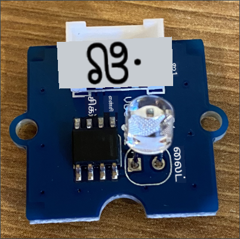
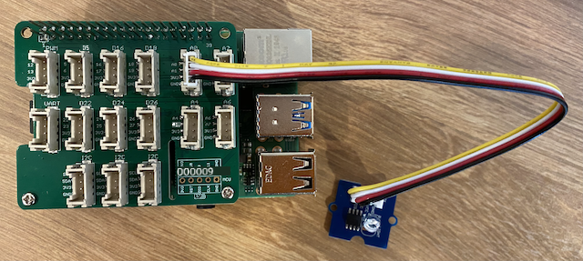

<!--
CO_OP_TRANSLATOR_METADATA:
{
  "original_hash": "ea733bd0cdf2479e082373f765a08678",
  "translation_date": "2025-10-11T11:35:09+00:00",
  "source_file": "1-getting-started/lessons/3-sensors-and-actuators/pi-sensor.md",
  "language_code": "ta"
}
-->
# இரவு விளக்கை உருவாக்குதல் - ராஸ்பெர்ரி பை

இந்த பாடத்தின் இந்த பகுதியில், நீங்கள் உங்கள் ராஸ்பெர்ரி பையில் ஒரு ஒளி உணரியை சேர்க்கப் போகிறீர்கள்.

## ஹார்ட்வேர்கள்

இந்த பாடத்திற்கான உணரியாக **ஒளி உணரி** பயன்படுத்தப்படுகிறது, இது [போட்டோடையோடு](https://wikipedia.org/wiki/Photodiode) ஒளியை மின்சிக்னலாக மாற்றுகிறது. இது ஒரு அனலாக் உணரி, இது 0 முதல் 1,000 வரை ஒரு முழு எண் மதிப்பை அனுப்புகிறது, இது [லக்ஸ்](https://wikipedia.org/wiki/Lux) போன்ற எந்தவொரு நிலையான அளவீட்டு அலகுக்கும் பொருந்தாது.

ஒளி உணரி ஒரு வெளிப்புற Grove உணரி ஆகும், இது ராஸ்பெர்ரி பையில் உள்ள Grove Base ஹாட்டுடன் இணைக்கப்பட வேண்டும்.

### ஒளி உணரியை இணைத்தல்

ஒளி நிலைகளை கண்டறிய பயன்படுத்தப்படும் Grove ஒளி உணரி ராஸ்பெர்ரி பையுடன் இணைக்கப்பட வேண்டும்.

#### பணிகள் - ஒளி உணரியை இணைத்தல்

ஒளி உணரியை இணைக்கவும்



1. Grove கேபிளின் ஒரு முனையை ஒளி உணரி மாட்யூலில் உள்ள சாக்கெட்டில் செருகவும். இது ஒரு வழியில் மட்டுமே செருகப்படும்.

1. ராஸ்பெர்ரி பை ஆஃப் நிலையில் இருக்கும் போது, Grove கேபிளின் மற்ற முனையை பையில் இணைக்கப்பட்ட Grove Base ஹாட்டில் **A0** என்று குறிக்கப்பட்ட அனலாக் சாக்கெட்டில் இணைக்கவும். இந்த சாக்கெட் GPIO பின்களுக்குப் பக்கத்தில் உள்ள சாக்கெட்டுகளின் வரிசையில் வலதுபுறத்திலிருந்து இரண்டாவது சாக்கெட்டாகும்.



## ஒளி உணரியை நிரலாக்குதல்

இப்போது Grove ஒளி உணரியைப் பயன்படுத்தி சாதனத்தை நிரலாக்கலாம்.

### பணிகள் - ஒளி உணரியை நிரலாக்குதல்

சாதனத்தை நிரலாக்கவும்.

1. பையை ஆன் செய்து, அது தொடங்கும் வரை காத்திருக்கவும்

1. இந்த பணியின் முந்தைய பகுதியில் நீங்கள் உருவாக்கிய இரவு விளக்கு திட்டத்தை VS Code-ல் திறக்கவும், இது பையில் நேரடியாக இயங்கவோ அல்லது Remote SSH நீட்டிப்பைப் பயன்படுத்தி இணைக்கவோ இருக்கலாம்.

1. `app.py` கோப்பை திறந்து, அதிலிருந்து அனைத்து குறியீடுகளையும் நீக்கவும்

1. `app.py` கோப்பில் கீழே உள்ள குறியீடுகளை சேர்த்து தேவையான நூலகங்களை இறக்குமதி செய்யவும்:

    ```python
    import time
    from grove.grove_light_sensor_v1_2 import GroveLightSensor
    ```

    `import time` அறிக்கையால் `time` மாட்யூல் இறக்குமதி செய்யப்படுகிறது, இது இந்த பணியில் பின்னர் பயன்படுத்தப்படும்.

    `from grove.grove_light_sensor_v1_2 import GroveLightSensor` அறிக்கையால் Grove Python நூலகங்களில் இருந்து `GroveLightSensor` இறக்குமதி செய்யப்படுகிறது. இந்த நூலகத்தில் Grove ஒளி உணரியுடன் தொடர்பு கொள்ள குறியீடு உள்ளது, இது பை அமைப்பின் போது உலகளவில் நிறுவப்பட்டது.

1. மேலே உள்ள குறியீட்டிற்குப் பிறகு, ஒளி உணரியை நிர்வகிக்கும் வகுப்பின் ஒரு உதாரணத்தை உருவாக்க கீழே உள்ள குறியீட்டை சேர்க்கவும்:

    ```python
    light_sensor = GroveLightSensor(0)
    ```

    `light_sensor = GroveLightSensor(0)` வரி **A0** பினுடன் இணைக்கப்பட்ட `GroveLightSensor` வகுப்பின் ஒரு உதாரணத்தை உருவாக்குகிறது - ஒளி உணரி இணைக்கப்பட்ட அனலாக் Grove பின்.

1. மேலே உள்ள குறியீட்டிற்குப் பிறகு, ஒளி உணரியின் மதிப்பை தொடர்ந்து சரிபார்த்து அதை கன்சோலில் அச்சிட ஒரு முடிவில்லாத லூப்பைச் சேர்க்கவும்:

    ```python
    while True:
        light = light_sensor.light
        print('Light level:', light)
    ```

    இது `GroveLightSensor` வகுப்பின் `light` சொத்தைப் பயன்படுத்தி 0-1,023 அளவிலான தற்போதைய ஒளி நிலையைப் படிக்கும். இந்த சொத்து பினிலிருந்து அனலாக் மதிப்பை படிக்கிறது. இந்த மதிப்பு பின்னர் கன்சோலில் அச்சிடப்படும்.

1. `loop`-இன் இறுதியில் ஒரு சிறிய ஒரு வினாடி தூக்கத்தைச் சேர்க்கவும், ஏனெனில் ஒளி நிலைகளை தொடர்ந்து சரிபார்க்க தேவையில்லை. தூக்கம் சாதனத்தின் மின்சார நுகர்வை குறைக்கிறது.

    ```python
    time.sleep(1)
    ```

1. VS Code டெர்மினலில் இருந்து, உங்கள் Python பயன்பாட்டை இயக்க கீழே உள்ளதை இயக்கவும்:

    ```sh
    python3 app.py
    ```

    ஒளி மதிப்புகள் கன்சோலில் வெளியிடப்படும். ஒளி உணரியை மூடவும், திறக்கவும், மதிப்புகள் மாறும்:

    ```output
    pi@raspberrypi:~/nightlight $ python3 app.py 
    Light level: 634
    Light level: 634
    Light level: 634
    Light level: 230
    Light level: 104
    Light level: 290
    ```

> 💁 இந்த குறியீட்டை [code-sensor/pi](../../../../../1-getting-started/lessons/3-sensors-and-actuators/code-sensor/pi) கோப்புறையில் காணலாம்.

😀 உங்கள் இரவு விளக்கு நிரலுக்கு ஒரு உணரியைச் சேர்த்தது வெற்றிகரமாக முடிந்தது!

---

**குறிப்பு**:  
இந்த ஆவணம் [Co-op Translator](https://github.com/Azure/co-op-translator) என்ற AI மொழிபெயர்ப்பு சேவையைப் பயன்படுத்தி மொழிபெயர்க்கப்பட்டுள்ளது. நாங்கள் துல்லியத்திற்காக முயற்சிக்கின்றோம், ஆனால் தானியக்க மொழிபெயர்ப்புகளில் பிழைகள் அல்லது தவறான தகவல்கள் இருக்கக்கூடும் என்பதை கவனத்தில் கொள்ளவும். அதன் தாய்மொழியில் உள்ள மூல ஆவணம் அதிகாரப்பூர்வ ஆதாரமாக கருதப்பட வேண்டும். முக்கியமான தகவல்களுக்கு, தொழில்முறை மனித மொழிபெயர்ப்பு பரிந்துரைக்கப்படுகிறது. இந்த மொழிபெயர்ப்பைப் பயன்படுத்துவதால் ஏற்படும் எந்த தவறான புரிதல்கள் அல்லது தவறான விளக்கங்களுக்கு நாங்கள் பொறுப்பல்ல.