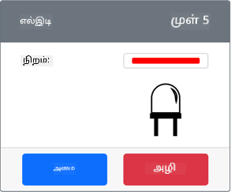

<!--
CO_OP_TRANSLATOR_METADATA:
{
  "original_hash": "9c640f93263fd9adbfda920739e09feb",
  "translation_date": "2025-10-11T11:36:43+00:00",
  "source_file": "1-getting-started/lessons/3-sensors-and-actuators/virtual-device-actuator.md",
  "language_code": "ta"
}
-->
# இரவுத்தொலைச்சுடர் - மெய்நிகர் IoT சாதனம்

இந்த பாடத்தின் இந்த பகுதியில், உங்கள் மெய்நிகர் IoT சாதனத்தில் ஒரு LED ஐ சேர்த்து, அதை பயன்படுத்தி ஒரு இரவுத்தொலைச்சுடரை உருவாக்குவீர்கள்.

## மெய்நிகர் சாதனம்

இரவுத்தொலைச்சுடருக்கு CounterFit செயலியில் உருவாக்கப்பட்ட ஒரு செயலி தேவை.

செயலி என்பது **LED** ஆகும். ஒரு இயல்பான IoT சாதனத்தில், இது [ஒளி-கதிர்வீச்சு டையோடு](https://wikipedia.org/wiki/Light-emitting_diode) ஆகும், இது மின்சாரம் பாயும் போது ஒளி வெளியிடும். இது ஒரு டிஜிட்டல் செயலி, இது இரண்டு நிலைகளைக் கொண்டுள்ளது: ஆன் மற்றும் ஆஃப். 1 என்ற மதிப்பை அனுப்புவது LED ஐ ஆன் செய்யும், மற்றும் 0 அனுப்புவது அதை ஆஃப் செய்யும்.

இரவுத்தொலைச்சுடர் தர்க்கம் பின்வருமாறு உள்ளது:

```output
Check the light level.
If the light is less than 300
    Turn the LED on
Otherwise
    Turn the LED off
```

### CounterFit செயலியில் செயலியை சேர்க்கவும்

மெய்நிகர் LED ஐ பயன்படுத்த, அதை CounterFit செயலியில் சேர்க்க வேண்டும்.

#### பணிகள் - CounterFit செயலியில் செயலியை சேர்க்கவும்

CounterFit செயலியில் LED ஐ சேர்க்கவும்.

1. இந்த பணியின் முந்தைய பகுதியில் CounterFit வலை செயலி இயங்கிக் கொண்டிருக்கிறதா என்பதை உறுதிப்படுத்தவும். இல்லையெனில், அதை தொடங்கி, ஒளி உணரியை மீண்டும் சேர்க்கவும்.

1. ஒரு LED ஐ உருவாக்கவும்:

    1. *Actuator* பகுதியின் *Create actuator* பெட்டியில், *Actuator type* பெட்டியைத் திறந்து *LED* ஐத் தேர்ந்தெடுக்கவும்.

    1. *Pin* ஐ *5* ஆக அமைக்கவும்.

    1. **Add** பொத்தானைத் தேர்ந்தெடுத்து Pin 5 இல் LED ஐ உருவாக்கவும்.

    

    LED உருவாக்கப்பட்டு செயலிகள் பட்டியலில் தோன்றும்.

    

    LED உருவாக்கப்பட்ட பிறகு, *Color* தேர்வியைப் பயன்படுத்தி நிறத்தை மாற்றலாம். நீங்கள் தேர்ந்தெடுத்த பிறகு **Set** பொத்தானைத் தேர்ந்தெடுத்து நிறத்தை மாற்றவும்.

### இரவுத்தொலைச்சுடரை நிரலாக்கவும்

இப்போது CounterFit ஒளி உணரியும் LED ஐப் பயன்படுத்தி இரவுத்தொலைச்சுடரை நிரலாக்கலாம்.

#### பணிகள் - இரவுத்தொலைச்சுடரை நிரலாக்கவும்

இரவுத்தொலைச்சுடரை நிரலாக்கவும்.

1. இந்த பணியின் முந்தைய பகுதியில் நீங்கள் உருவாக்கிய இரவுத்தொலைச்சுடர் திட்டத்தை VS Code இல் திறக்கவும். தேவையானால், மெய்நிகர் சூழலில் இயங்குவதற்காக டெர்மினலை முடித்து மீண்டும் உருவாக்கவும்.

1. `app.py` கோப்பைத் திறக்கவும்.

1. தேவையான நூலகத்தை இறக்குமதி செய்ய `app.py` கோப்பின் மேல் பகுதியில், மற்ற `import` வரிகளின் கீழ் பின்வரும் குறியீட்டைச் சேர்க்கவும்:

    ```python
    from counterfit_shims_grove.grove_led import GroveLed
    ```

    `from counterfit_shims_grove.grove_led import GroveLed` வரி CounterFit Grove shim Python நூலகங்களில் இருந்து `GroveLed` ஐ இறக்குமதி செய்கிறது. இந்த நூலகத்தில் CounterFit செயலியில் உருவாக்கப்பட்ட LED உடன் தொடர்பு கொள்ள குறியீடு உள்ளது.

1. `light_sensor` அறிவிப்பின் பின்னர், LED ஐ நிர்வகிக்கும் வகுப்பின் ஒரு உதாரணத்தை உருவாக்க பின்வரும் குறியீட்டைச் சேர்க்கவும்:

    ```python
    led = GroveLed(5)
    ```

    `led = GroveLed(5)` வரி **5** பினுடன் இணைக்கப்பட்ட `GroveLed` வகுப்பின் ஒரு உதாரணத்தை உருவாக்குகிறது - LED இணைக்கப்பட்ட CounterFit Grove பின்.

1. `while` மடக்குக்குள், மற்றும் `time.sleep` க்கு முன், ஒளி நிலைகளைச் சரிபார்த்து LED ஐ ஆன் அல்லது ஆஃப் செய்ய ஒரு சரிபார்ப்பைச் சேர்க்கவும்:

    ```python
    if light < 300:
        led.on()
    else:
        led.off()
    ```

    இந்த குறியீடு `light` மதிப்பைச் சரிபார்க்கிறது. இது 300 க்கும் குறைவாக இருந்தால், `GroveLed` வகுப்பின் `on` முறை அழைக்கப்படுகிறது, இது LED ஐ ஆன் செய்ய 1 என்ற டிஜிட்டல் மதிப்பை அனுப்புகிறது. ஒளி மதிப்பு 300 அல்லது அதற்கு மேல் இருந்தால், `off` முறை அழைக்கப்படுகிறது, இது LED ஐ ஆஃப் செய்ய 0 என்ற டிஜிட்டல் மதிப்பை அனுப்புகிறது.

    > 💁 இந்த குறியீடு `print('Light level:', light)` வரியின் சம நிலை இடைவெளியில் இருக்க வேண்டும், இதனால் இது while மடக்குக்குள் இருக்கும்!

1. VS Code டெர்மினலில் இருந்து, உங்கள் Python செயலியை இயக்க பின்வரும் குறியீட்டை இயக்கவும்:

    ```sh
    python3 app.py
    ```

    ஒளி மதிப்புகள் கன்சோலில் வெளியிடப்படும்.

    ```output
    (.venv) ➜  GroveTest python3 app.py 
    Light level: 143
    Light level: 244
    Light level: 246
    Light level: 253
    ```

1. *Value* அல்லது *Random* அமைப்புகளை மாற்றி ஒளி நிலையை 300 க்கு மேல் மற்றும் கீழ் மாறவும். LED ஆன் மற்றும் ஆஃப் ஆகும்.


> 💁 இந்த குறியீட்டை [code-actuator/virtual-device](../../../../../1-getting-started/lessons/3-sensors-and-actuators/code-actuator/virtual-device) கோப்பகத்தில் காணலாம்.

😀 உங்கள் இரவுத்தொலைச்சுடர் நிரல் வெற்றிகரமாக முடிந்தது!

---

**குறிப்பு**:  
இந்த ஆவணம் [Co-op Translator](https://github.com/Azure/co-op-translator) என்ற AI மொழிபெயர்ப்பு சேவையைப் பயன்படுத்தி மொழிபெயர்க்கப்பட்டுள்ளது. நாங்கள் துல்லியத்திற்காக முயற்சிக்கிறோம், ஆனால் தானியக்க மொழிபெயர்ப்புகளில் பிழைகள் அல்லது தவறான தகவல்கள் இருக்கக்கூடும் என்பதை கவனத்தில் கொள்ளவும். அதன் தாய்மொழியில் உள்ள மூல ஆவணம் அதிகாரப்பூர்வ ஆதாரமாக கருதப்பட வேண்டும். முக்கியமான தகவல்களுக்கு, தொழில்முறை மனித மொழிபெயர்ப்பு பரிந்துரைக்கப்படுகிறது. இந்த மொழிபெயர்ப்பைப் பயன்படுத்துவதால் ஏற்படும் எந்த தவறான புரிதல்கள் அல்லது தவறான விளக்கங்களுக்கு நாங்கள் பொறுப்பல்ல.