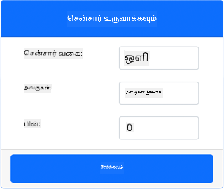
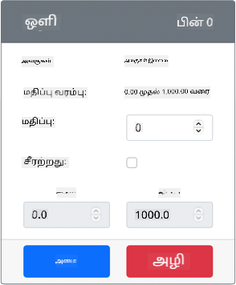

<!--
CO_OP_TRANSLATOR_METADATA:
{
  "original_hash": "11f10c6760fb8202cf368422702fdf70",
  "translation_date": "2025-10-11T11:36:10+00:00",
  "source_file": "1-getting-started/lessons/3-sensors-and-actuators/virtual-device-sensor.md",
  "language_code": "ta"
}
-->
# இரவு விளக்கு உருவாக்குதல் - மெய்நிகர் IoT சாதனம்

இந்த பாடத்தின் இந்த பகுதியில், உங்கள் மெய்நிகர் IoT சாதனத்தில் ஒரு ஒளி உணரியை சேர்க்கப் போகிறீர்கள்.

## மெய்நிகர் சாதனம்

இரவு விளக்கிற்கு CounterFit செயலியில் உருவாக்கப்பட்ட ஒரு உணரியை தேவைப்படும்.

இந்த உணரி ஒரு **ஒளி உணரி** ஆகும். ஒரு இயல்பான IoT சாதனத்தில், இது ஒளியை மின்சார சிக்னலாக மாற்றும் ஒரு [போட்டோடையோடு](https://wikipedia.org/wiki/Photodiode) ஆக இருக்கும். ஒளி உணரிகள் ஒரு சார்ந்த ஒளியின் அளவை குறிக்கும் முழுமையான மதிப்பை அனுப்பும் அனலாக் உணரிகள் ஆகும், இது [லக்ஸ்](https://wikipedia.org/wiki/Lux) போன்ற எந்த ஒரு நிலையான அளவீட்டு அலகுக்கும் பொருந்தாது.

### CounterFit-இல் உணரிகளை சேர்க்கவும்

ஒரு மெய்நிகர் ஒளி உணரியைப் பயன்படுத்த, அதை CounterFit செயலியில் சேர்க்க வேண்டும்.

#### பணிகள் - CounterFit-இல் உணரிகளை சேர்க்கவும்

CounterFit செயலியில் ஒளி உணரியைச் சேர்க்கவும்.

1. இந்த பணியின் முந்தைய பகுதியில் CounterFit வலை செயலி இயங்கிக் கொண்டிருக்கிறதா என்பதை உறுதிப்படுத்தவும். இல்லையெனில், அதை தொடங்கவும்.

1. ஒளி உணரியை உருவாக்கவும்:

    1. *Sensors* பகுதியின் *Create sensor* பெட்டியில், *Sensor type* பட்டியைத் திறந்து *Light* என்பதைத் தேர்ந்தெடுக்கவும்.

    1. *Units* ஐ *NoUnits* ஆகவே விடவும்.

    1. *Pin* ஐ *0* ஆக அமைத்திருக்கிறீர்களா என்பதை உறுதிப்படுத்தவும்.

    1. **Add** பொத்தானைத் தேர்ந்தெடுத்து Pin 0-ல் ஒளி உணரியை உருவாக்கவும்.

    

    ஒளி உணரி உருவாக்கப்பட்டு உணரிகள் பட்டியலில் தோன்றும்.

    

## ஒளி உணரியை நிரலாக்கவும்

இப்போது சாதனம் உள்ளமைக்கப்பட்ட ஒளி உணரியைப் பயன்படுத்த நிரலாக்கப்படலாம்.

### பணிகள் - ஒளி உணரியை நிரலாக்கவும்

சாதனத்தை நிரலாக்கவும்.

1. இந்த பணியின் முந்தைய பகுதியில் நீங்கள் உருவாக்கிய இரவு விளக்கு திட்டத்தை VS Code-இல் திறக்கவும். தேவையானால், மெய்நிகர் சூழலில் இயங்குவதற்காக டெர்மினலை முடித்து மீண்டும் உருவாக்கவும்.

1. `app.py` கோப்பைத் திறக்கவும்.

1. `import` அறிக்கைகளின் மேல்பகுதியில் பின்வரும் குறியீட்டைச் சேர்த்து, தேவையான நூலகங்களை இறக்குமதி செய்யவும்:

    ```python
    import time
    from counterfit_shims_grove.grove_light_sensor_v1_2 import GroveLightSensor
    ```

    `import time` அறிக்கை Python `time` தொகுப்பை இறக்குமதி செய்கிறது, இது இந்த பணியின் பின்னர் பயன்படுத்தப்படும்.

    `from counterfit_shims_grove.grove_light_sensor_v1_2 import GroveLightSensor` அறிக்கை CounterFit Grove shim Python நூலகங்களில் இருந்து `GroveLightSensor` ஐ இறக்குமதி செய்கிறது. இந்த நூலகம் CounterFit செயலியில் உருவாக்கப்பட்ட ஒளி உணரியுடன் தொடர்பு கொள்ளும் குறியீட்டை கொண்டுள்ளது.

1. ஒளி உணரியை நிர்வகிக்கும் வகுப்புகளின் உதாரணங்களை உருவாக்க பின்வரும் குறியீட்டை கோப்பின் கீழே சேர்க்கவும்:

    ```python
    light_sensor = GroveLightSensor(0)
    ```

    `light_sensor = GroveLightSensor(0)` வரி **0** பினுடன் இணைக்கப்பட்ட `GroveLightSensor` வகுப்பின் உதாரணத்தை உருவாக்குகிறது - ஒளி உணரி இணைக்கப்பட்ட CounterFit Grove பின்.

1. மேலே உள்ள குறியீட்டிற்குப் பிறகு ஒரு முடிவில்லா மடக்கு சேர்த்து ஒளி உணரியின் மதிப்பை சரிபார்த்து அதை கன்சோலில் அச்சிடவும்:

    ```python
    while True:
        light = light_sensor.light
        print('Light level:', light)
    ```

    இது `GroveLightSensor` வகுப்பின் `light` சொத்தைப் பயன்படுத்தி தற்போதைய ஒளி நிலையைப் படிக்கும். இந்த சொத்து பினிலிருந்து அனலாக் மதிப்பை வாசிக்கிறது. இந்த மதிப்பு பின்னர் கன்சோலில் அச்சிடப்படும்.

1. `while` மடக்கின் இறுதியில் ஒரு வினாடி நேர இடைவெளியைச் சேர்க்கவும், ஏனெனில் ஒளி நிலைகளை தொடர்ந்து சரிபார்க்க தேவையில்லை. ஒரு இடைவெளி சாதனத்தின் மின்சார நுகர்வை குறைக்கும்.

    ```python
    time.sleep(1)
    ```

1. VS Code டெர்மினலில் இருந்து, உங்கள் Python செயலியை இயக்க பின்வரும் கட்டளையை இயக்கவும்:

    ```sh
    python3 app.py
    ```

    ஒளி மதிப்புகள் கன்சோலில் வெளியிடப்படும். ஆரம்பத்தில் இந்த மதிப்பு 0 ஆக இருக்கும்.

1. CounterFit செயலியில் இருந்து, செயலி வாசிக்கும் ஒளி உணரியின் மதிப்பை மாற்றவும். இதை இரண்டு வழிகளில் செய்யலாம்:

    * ஒளி உணரிக்கான *Value* பெட்டியில் ஒரு எண்ணை உள்ளிடவும், பின்னர் **Set** பொத்தானைத் தேர்ந்தெடுக்கவும். நீங்கள் உள்ளிடும் எண் உணரியால் திரும்ப பெறப்படும் மதிப்பாக இருக்கும்.

    * *Random* செக்பாக்ஸை சரிபார்த்து, *Min* மற்றும் *Max* மதிப்புகளை உள்ளிடவும், பின்னர் **Set** பொத்தானைத் தேர்ந்தெடுக்கவும். ஒவ்வொரு முறை உணரி மதிப்பை வாசிக்கும் போது, அது *Min* மற்றும் *Max* இடையே ஒரு சீரற்ற எண்ணை வாசிக்கும்.

    நீங்கள் அமைக்கும் மதிப்புகள் கன்சோலில் வெளியிடப்படும். மதிப்பை மாற்ற *Value* அல்லது *Random* அமைப்புகளை மாற்றவும்.

    ```output
    (.venv) ➜  GroveTest python3 app.py 
    Light level: 143
    Light level: 244
    Light level: 246
    Light level: 253
    ```

> 💁 இந்த குறியீட்டை [code-sensor/virtual-device](../../../../../1-getting-started/lessons/3-sensors-and-actuators/code-sensor/virtual-device) கோப்பகத்தில் காணலாம்.

😀 உங்கள் இரவு விளக்கு நிரல் வெற்றிகரமாக முடிந்தது!

---

**குறிப்பு**:  
இந்த ஆவணம் [Co-op Translator](https://github.com/Azure/co-op-translator) என்ற AI மொழிபெயர்ப்பு சேவையைப் பயன்படுத்தி மொழிபெயர்க்கப்பட்டுள்ளது. நாங்கள் துல்லியத்திற்காக முயற்சிக்கிறோம், ஆனால் தானியக்க மொழிபெயர்ப்புகளில் பிழைகள் அல்லது தவறான தகவல்கள் இருக்கக்கூடும் என்பதை தயவுசெய்து கவனத்தில் கொள்ளுங்கள். அதன் தாய்மொழியில் உள்ள மூல ஆவணம் அதிகாரப்பூர்வ ஆதாரமாக கருதப்பட வேண்டும். முக்கியமான தகவல்களுக்கு, தொழில்முறை மனித மொழிபெயர்ப்பு பரிந்துரைக்கப்படுகிறது. இந்த மொழிபெயர்ப்பைப் பயன்படுத்துவதால் ஏற்படும் எந்த தவறான புரிதல்கள் அல்லது தவறான விளக்கங்களுக்கு நாங்கள் பொறுப்பல்ல.