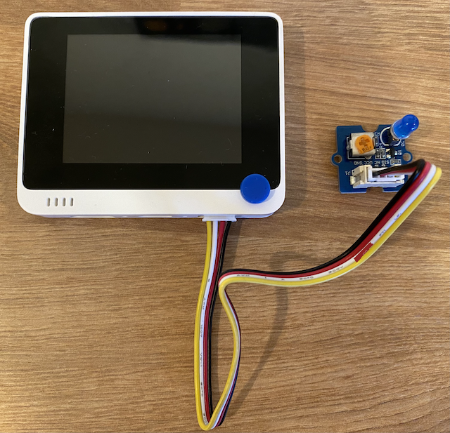

<!--
CO_OP_TRANSLATOR_METADATA:
{
  "original_hash": "db44083b4dc6fb06eac83c4f16448940",
  "translation_date": "2025-10-11T11:35:37+00:00",
  "source_file": "1-getting-started/lessons/3-sensors-and-actuators/wio-terminal-actuator.md",
  "language_code": "ta"
}
-->
# இரவொளி உருவாக்குதல் - Wio Terminal

இந்த பாடத்தின் இந்த பகுதியில், உங்கள் Wio Terminal-க்கு ஒரு LED சேர்த்து அதை இரவொளியாக உருவாக்கப் போகிறீர்கள்.

## ஹார்ட்வேர்கள்

இரவொளிக்கு இப்போது ஒரு செயலி தேவை.

செயலி என்பது **LED**, [ஒளி வெளியிடும் டையோடு](https://wikipedia.org/wiki/Light-emitting_diode) ஆகும், இது மின்சாரம் பாயும் போது ஒளி வெளியிடும். இது ஒரு டிஜிட்டல் செயலி, இது இரண்டு நிலைகளைக் கொண்டுள்ளது: ஆன் மற்றும் ஆஃப். 1 என்ற மதிப்பை அனுப்புவது LED-ஐ ஆன் செய்யும், 0 அனுப்புவது அதை ஆஃப் செய்யும். இது ஒரு வெளிப்புற Grove செயலி, மற்றும் Wio Terminal-க்கு இணைக்கப்பட வேண்டும்.

இரவொளியின் லாஜிக் பseudocode-ல்:

```output
Check the light level.
If the light is less than 300
    Turn the LED on
Otherwise
    Turn the LED off
```

### LED-ஐ இணைத்தல்

Grove LED பல வண்ண LEDகளுடன் ஒரு மாட்யூலாக வருகிறது, இது உங்களுக்கு விருப்பமான வண்ணத்தைத் தேர்ந்தெடுக்க அனுமதிக்கிறது.

#### பணிகள் - LED-ஐ இணைத்தல்

LED-ஐ இணைக்கவும்.


1. உங்களுக்கு பிடித்த LED-ஐ தேர்ந்தெடுத்து, அதன் கால்களை LED மாட்யூலின் இரண்டு துளைகளில் செருகவும்.

    LEDகள் ஒளி வெளியிடும் டையோடுகள், மற்றும் டையோடுகள் மின்சாரம் ஒரே வழியில் செல்லும் மின்னணு சாதனங்கள். இதனால் LED சரியான வழியில் இணைக்கப்பட வேண்டும், இல்லையெனில் அது வேலை செய்யாது.

    LED-இன் கால்களில் ஒன்று நேர்ம பின், மற்றொன்று எதிர்ம பின். LED முழுமையாக வட்டமாக இல்லை, மற்றும் ஒரு பக்கம் சற்று தட்டையாக இருக்கும். சற்று தட்டையான பக்கம் எதிர்ம பின். LED-ஐ மாட்யூலுக்கு இணைக்கும் போது, வட்டமான பக்கத்துக்கு அருகிலுள்ள பின் மாட்யூலின் வெளியே **+** என்று குறிக்கப்பட்ட சாக்கெட்டுடன் இணைக்கப்பட்டிருக்க வேண்டும், மற்றும் தட்டையான பக்கம் மாட்யூலின் நடுவில் உள்ள சாக்கெட்டுடன் இணைக்கப்பட்டிருக்க வேண்டும்.

1. LED மாட்யூலில் ஒரு ஸ்பின் பொத்தான் உள்ளது, இது பிரகாசத்தை கட்டுப்படுத்த அனுமதிக்கிறது. ஆரம்பத்தில் இதை முழுமையாக அதிகரிக்க, சிறிய பிலிப்ஸ் தலை திருகுதாரியைப் பயன்படுத்தி அதை முழுமையாக எதிர்மாறாக சுழற்றவும்.

1. Grove கேபிளின் ஒரு முனையை LED மாட்யூலின் சாக்கெட்டில் செருகவும். இது ஒரே வழியில் மட்டுமே செல்லும்.

1. உங்கள் Wio Terminal-ஐ கணினி அல்லது பிற மின்சார ஆதாரத்திலிருந்து துண்டித்து, Grove கேபிளின் மற்ற முனையை Wio Terminal-இன் திரையைப் பார்க்கும் போது வலது பக்க Grove சாக்கெட்டில் இணைக்கவும். இது மின்சார பொத்தானுக்கு மிகத் தொலைவில் உள்ள சாக்கெட்.

    > 💁 வலது பக்க Grove சாக்கெட் அனலாக் அல்லது டிஜிட்டல் சென்சார்கள் மற்றும் செயலிகளுடன் பயன்படுத்தப்படலாம். இடது பக்க சாக்கெட் I<sup>2</sup>C மற்றும் டிஜிட்டல் சென்சார்கள் மற்றும் செயலிகளுக்காக மட்டுமே. I<sup>2</sup>C ஒரு பின்னர் பாடத்தில் கற்றுக்கொள்ளப்படும்.



## இரவொளியை நிரலாக்குதல்

இரவொளி இப்போது உள்ளமைக்கப்பட்ட ஒளி சென்சார் மற்றும் Grove LED-ஐ பயன்படுத்தி நிரலாக்கப்படலாம்.

### பணிகள் - இரவொளியை நிரலாக்குதல்

இரவொளியை நிரலாக்கவும்.

1. இந்த பணியின் முந்தைய பகுதியில் நீங்கள் உருவாக்கிய VS Code-ல் இரவொளி திட்டத்தைத் திறக்கவும்.

1. `setup` செயல்பாட்டின் கீழே உள்ள வரியைச் சேர்க்கவும்:

    ```cpp
    pinMode(D0, OUTPUT);
    ```

    இந்த வரி Grove போர்ட் மூலம் LED-இன் தொடர்பு கொள்ளும் பினை அமைக்கிறது.

    `D0` பின் வலது பக்க Grove சாக்கெட்டின் டிஜிட்டல் பின் ஆகும். இந்த பின் `OUTPUT` ஆக அமைக்கப்பட்டுள்ளது, இது செயலியுடன் இணைக்கப்பட்டு பினுக்கு தரவுகளை எழுத அனுமதிக்கிறது.

1. `loop` செயல்பாட்டில் `delay`-க்கு முன்பாக உடனடியாக பின்வரும் குறியீட்டைச் சேர்க்கவும்:

    ```cpp
    if (light < 300)
    {
        digitalWrite(D0, HIGH);
    }
    else
    {
        digitalWrite(D0, LOW);
    }
    ```

    இந்த குறியீடு `light` மதிப்பைச் சரிபார்க்கிறது. இது 300-க்கு குறைவாக இருந்தால், `D0` டிஜிட்டல் பினுக்கு `HIGH` மதிப்பை அனுப்புகிறது. இந்த `HIGH` என்பது 1 என்ற மதிப்பு, LED-ஐ ஆன் செய்கிறது. ஒளி 300 அல்லது அதற்கு மேல் இருந்தால், பினுக்கு `LOW` மதிப்பு 0 அனுப்பப்படுகிறது, LED-ஐ ஆஃப் செய்கிறது.

    > 💁 செயலிகளுக்கு டிஜிட்டல் மதிப்புகளை அனுப்பும்போது, LOW மதிப்பு 0v ஆகும், மற்றும் HIGH மதிப்பு சாதனத்திற்கான அதிகபட்ச மின்னழுத்தமாகும். Wio Terminal-க்கு HIGH மின்னழுத்தம் 3.3V ஆகும்.

1. Wio Terminal-ஐ மீண்டும் உங்கள் கணினிக்கு இணைக்கவும், மற்றும் முந்தைய முறையில் புதிய குறியீட்டை பதிவேற்றவும்.

1. Serial Monitor-ஐ இணைக்கவும். ஒளி மதிப்புகள் டெர்மினலுக்கு வெளியிடப்படும்.

    ```output
    > Executing task: platformio device monitor <

    --- Available filters and text transformations: colorize, debug, default, direct, hexlify, log2file, nocontrol, printable, send_on_enter, time
    --- More details at http://bit.ly/pio-monitor-filters
    --- Miniterm on /dev/cu.usbmodem101  9600,8,N,1 ---
    --- Quit: Ctrl+C | Menu: Ctrl+T | Help: Ctrl+T followed by Ctrl+H ---
    Light value: 4
    Light value: 5
    Light value: 4
    Light value: 158
    Light value: 343
    Light value: 348
    Light value: 344
    ```

1. ஒளி சென்சாரை மூடவும் மற்றும் திறக்கவும். ஒளி நிலை 300 அல்லது அதற்கு குறைவாக இருந்தால் LED ஒளிரும், மற்றும் ஒளி நிலை 300-க்கு மேல் இருந்தால் LED ஆஃப் ஆகும் என்பதை கவனிக்கவும்.


> 💁 இந்த குறியீட்டை [code-actuator/wio-terminal](../../../../../1-getting-started/lessons/3-sensors-and-actuators/code-actuator/wio-terminal) கோப்புறையில் காணலாம்.

😀 உங்கள் இரவொளி நிரல் வெற்றிகரமாக முடிந்தது!

---

**குறிப்பு**:  
இந்த ஆவணம் [Co-op Translator](https://github.com/Azure/co-op-translator) என்ற AI மொழிபெயர்ப்பு சேவையைப் பயன்படுத்தி மொழிபெயர்க்கப்பட்டுள்ளது. நாங்கள் துல்லியத்திற்காக முயற்சிக்கின்றோம், ஆனால் தானியங்கி மொழிபெயர்ப்புகளில் பிழைகள் அல்லது தவறான தகவல்கள் இருக்கக்கூடும் என்பதை தயவுசெய்து கவனத்தில் கொள்ளுங்கள். அதன் தாய்மொழியில் உள்ள மூல ஆவணம் அதிகாரப்பூர்வ ஆதாரமாக கருதப்பட வேண்டும். முக்கியமான தகவல்களுக்கு, தொழில்முறை மனித மொழிபெயர்ப்பு பரிந்துரைக்கப்படுகிறது. இந்த மொழிபெயர்ப்பைப் பயன்படுத்துவதால் ஏற்படும் எந்த தவறான புரிதல்கள் அல்லது தவறான விளக்கங்களுக்கு நாங்கள் பொறுப்பல்ல.