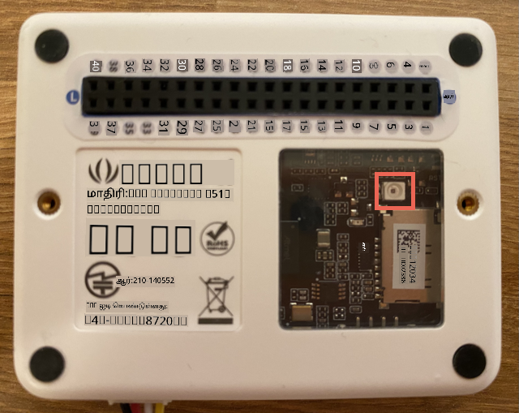

<!--
CO_OP_TRANSLATOR_METADATA:
{
  "original_hash": "7f4ad0ef54f248b85b92187c94cf9dcb",
  "translation_date": "2025-10-11T11:37:23+00:00",
  "source_file": "1-getting-started/lessons/3-sensors-and-actuators/wio-terminal-sensor.md",
  "language_code": "ta"
}
-->
# சென்சார் சேர்க்கவும் - Wio Terminal

இந்த பாடத்தின் இந்த பகுதியில், நீங்கள் உங்கள் Wio Terminal இல் உள்ள ஒளி சென்சாரைப் பயன்படுத்துவீர்கள்.

## ஹார்ட்வேர்கள்

இந்த பாடத்திற்கான சென்சார் ஒரு **ஒளி சென்சார்** ஆகும், இது ஒளியை மின்சார சிக்னலாக மாற்ற [போட்டோடைட்](https://wikipedia.org/wiki/Photodiode) ஐ பயன்படுத்துகிறது. இது ஒரு அனலாக் சென்சார் ஆகும், இது 0 முதல் 1,023 வரை ஒரு முழு எண் மதிப்பை அனுப்புகிறது, இது [லக்ஸ்](https://wikipedia.org/wiki/Lux) போன்ற எந்த தரநிலை அளவீட்டு அலகுக்கும் பொருந்தாது.

ஒளி சென்சார் Wio Terminal இல் உள்ளடக்கப்பட்டுள்ளது மற்றும் பின்புறத்தில் உள்ள தெளிவான பிளாஸ்டிக் சாளரத்தின் வழியாக காணக்கூடியது.



## ஒளி சென்சாரை நிரலாக்கவும்

இப்போது சாதனத்தை உள்ளடக்கப்பட்ட ஒளி சென்சாரைப் பயன்படுத்த நிரலாக்கலாம்.

### பணிகள்

சாதனத்தை நிரலாக்கவும்.

1. நீங்கள் இந்த பணியின் முந்தைய பகுதியில் உருவாக்கிய நைட்லைட் திட்டத்தை VS Code இல் திறக்கவும்.

1. `setup` செயல்பாட்டின் கீழ் பின்வரும் வரியை சேர்க்கவும்:

    ```cpp
    pinMode(WIO_LIGHT, INPUT);
    ```

   இந்த வரி சென்சார் ஹார்ட்வேருடன் தொடர்பு கொள்ள பயன்படுத்தப்படும் பின்களை அமைக்கிறது.

   `WIO_LIGHT` பின் என்பது உள்ளக ஒளி சென்சாருடன் இணைக்கப்பட்ட GPIO பின் எண்ணாகும். இந்த பின் `INPUT` ஆக அமைக்கப்பட்டுள்ளது, அதாவது இது ஒரு சென்சாருடன் இணைக்கப்பட்டுள்ளது மற்றும் பினில் இருந்து தரவைப் படிக்கப்படும்.

1. `loop` செயல்பாட்டின் உள்ளடக்கத்தை நீக்கவும்.

1. தற்போது காலியாக உள்ள `loop` செயல்பாட்டில் பின்வரும் குறியீட்டை சேர்க்கவும்.

    ```cpp
    int light = analogRead(WIO_LIGHT);
    Serial.print("Light value: ");
    Serial.println(light);
    ```

   இந்த குறியீடு `WIO_LIGHT` பினில் இருந்து ஒரு அனலாக் மதிப்பை படிக்கிறது. இது உள்ளக ஒளி சென்சாரில் இருந்து 0-1,023 வரை ஒரு மதிப்பை படிக்கிறது. இந்த மதிப்பு தொடரியல் போர்டுக்கு அனுப்பப்படுகிறது, எனவே இந்த குறியீடு இயங்கும் போது நீங்கள் அதை Serial Monitor இல் படிக்கலாம். `Serial.print` புதிய வரியை இறுதியில் சேர்க்காமல் உரையை எழுதுகிறது, எனவே ஒவ்வொரு வரியும் `Light value:` என தொடங்கி, உண்மையான ஒளி மதிப்புடன் முடியும்.

1. ஒளி நிலைகளை தொடர்ந்து சரிபார்க்க தேவையில்லை என்பதால் `loop` செயல்பாட்டின் இறுதியில் ஒரு வினாடி (1,000ms) தாமதத்தைச் சேர்க்கவும். தாமதம் சாதனத்தின் மின்சார நுகர்வை குறைக்கிறது.

    ```cpp
    delay(1000);
    ```

1. Wio Terminal ஐ மீண்டும் உங்கள் கணினியுடன் இணைக்கவும், மற்றும் முந்தைய முறையில் புதிய குறியீட்டை பதிவேற்றவும்.

1. Serial Monitor ஐ இணைக்கவும். ஒளி மதிப்புகள் டெர்மினலில் வெளியிடப்படும். Wio Terminal இன் பின்புறத்தில் உள்ள ஒளி சென்சாரை மூடவும் மற்றும் திறக்கவும், மதிப்புகள் மாறும்.

    ```output
    > Executing task: platformio device monitor <

    --- Available filters and text transformations: colorize, debug, default, direct, hexlify, log2file, nocontrol, printable, send_on_enter, time
    --- More details at http://bit.ly/pio-monitor-filters
    --- Miniterm on /dev/cu.usbmodem101  9600,8,N,1 ---
    --- Quit: Ctrl+C | Menu: Ctrl+T | Help: Ctrl+T followed by Ctrl+H ---
    Light value: 4
    Light value: 5
    Light value: 4
    Light value: 158
    Light value: 343
    Light value: 348
    Light value: 344
    ```

> 💁 இந்த குறியீட்டை [code-sensor/wio-terminal](../../../../../1-getting-started/lessons/3-sensors-and-actuators/code-sensor/wio-terminal) கோப்புறையில் காணலாம்.

😀 உங்கள் நைட்லைட் திட்டத்தில் சென்சாரை சேர்த்தது வெற்றிகரமாக முடிந்தது!

---

**குறிப்பு**:  
இந்த ஆவணம் [Co-op Translator](https://github.com/Azure/co-op-translator) என்ற AI மொழிபெயர்ப்பு சேவையைப் பயன்படுத்தி மொழிபெயர்க்கப்பட்டுள்ளது. நாங்கள் துல்லியத்திற்காக முயற்சிக்கின்றோம், ஆனால் தானியங்கி மொழிபெயர்ப்புகளில் பிழைகள் அல்லது தவறான தகவல்கள் இருக்கக்கூடும் என்பதை கவனத்தில் கொள்ளவும். அதன் தாய்மொழியில் உள்ள மூல ஆவணம் அதிகாரப்பூர்வ ஆதாரமாக கருதப்பட வேண்டும். முக்கியமான தகவல்களுக்கு, தொழில்முறை மனித மொழிபெயர்ப்பு பரிந்துரைக்கப்படுகிறது. இந்த மொழிபெயர்ப்பைப் பயன்படுத்துவதால் ஏற்படும் எந்த தவறான புரிதல்கள் அல்லது தவறான விளக்கங்களுக்கு நாங்கள் பொறுப்பல்ல.