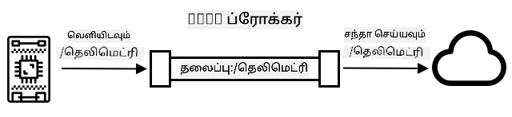
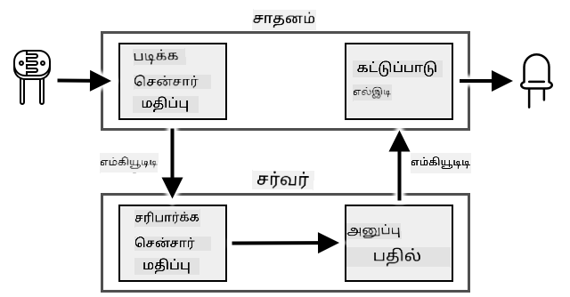
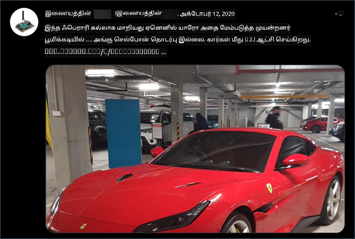

<!--
CO_OP_TRANSLATOR_METADATA:
{
  "original_hash": "71b5040e0b3472f1c0949c9b55f224c0",
  "translation_date": "2025-10-11T11:20:38+00:00",
  "source_file": "1-getting-started/lessons/4-connect-internet/README.md",
  "language_code": "ta"
}
-->
# உங்கள் சாதனத்தை இணையத்துடன் இணைக்கவும்


> ஸ்கெட்ச் நோட்: [நித்யா நரசிம்மன்](https://github.com/nitya). படத்தை கிளிக் செய்து பெரிய பதிப்பைப் பாருங்கள்.

இந்த பாடம் [Hello IoT series](https://youtube.com/playlist?list=PLmsFUfdnGr3xRts0TIwyaHyQuHaNQcb6-) மற்றும் [Microsoft Reactor](https://developer.microsoft.com/reactor/?WT.mc_id=academic-17441-jabenn) மூலம் கற்பிக்கப்பட்டது. இந்த பாடம் 2 வீடியோக்களாக கற்பிக்கப்பட்டது - ஒரு மணி நேர பாடம் மற்றும் ஒரு மணி நேர அலுவலக நேரம், பாடத்தின் பகுதிகளை ஆழமாக ஆராய்ந்து கேள்விகளுக்கு பதிலளிக்க.

[](https://youtu.be/O4dd172mZhs)

[](https://youtu.be/j-cVCzRDE2Q)

> 🎥 மேலே உள்ள படங்களை கிளிக் செய்து வீடியோக்களைப் பாருங்கள்

## பாடத்திற்கு முன் வினாடி வினா

[பாடத்திற்கு முன் வினாடி வினா](https://black-meadow-040d15503.1.azurestaticapps.net/quiz/7)

## அறிமுகம்

IoT இல் உள்ள **I** என்பது **Internet**-ஐ குறிக்கிறது - இது IoT சாதனங்களின் பல அம்சங்களை இயக்கும் கிளவுட் இணைப்பு மற்றும் சேவைகள், சாதனத்துடன் இணைக்கப்பட்ட சென்சார்களிலிருந்து அளவீடுகளை சேகரிப்பது முதல் செயலிகளை கட்டுப்படுத்துவதற்கான செய்திகளை அனுப்புவது வரை. IoT சாதனங்கள் பொதுவாக ஒரு கிளவுட் IoT சேவைக்கு ஒரு நிலையான தொடர்பு நெறிமுறை மூலம் இணைக்கின்றன, மேலும் அந்த சேவை உங்கள் IoT பயன்பாட்டின் மற்ற பகுதிகளுடன் இணைக்கப்பட்டுள்ளது, உங்கள் தரவின் சுற்று சிந்திக்க AI சேவைகள் முதல் கட்டுப்பாடு அல்லது அறிக்கைகளுக்கான வலை பயன்பாடுகள் வரை.

> 🎓 சென்சார்களிலிருந்து சேகரிக்கப்பட்டு கிளவுட் அனுப்பப்படும் தரவுகள் **டெலிமெட்ரி** என அழைக்கப்படுகிறது.

IoT சாதனங்கள் கிளவுட் மூலம் செய்திகளைப் பெற முடியும். பெரும்பாலும், இந்த செய்திகளில் உத்தரவுகள் உள்ளன - அதாவது, உள் செயல்பாடுகளை (மீண்டும் தொடங்குதல் அல்லது ஃபார்ம்வேரை புதுப்பித்தல் போன்றவை) அல்லது செயலியைப் பயன்படுத்தி (ஒளியை இயக்குதல் போன்றவை) ஒரு செயலைச் செய்யும் வழிமுறைகள்.

இந்த பாடம் IoT சாதனங்கள் கிளவுட் இணைக்க பயன்படுத்தும் சில தொடர்பு நெறிமுறைகளை அறிமுகப்படுத்துகிறது, அவை அனுப்பும் அல்லது பெறும் தரவின் வகைகளை அறிமுகப்படுத்துகிறது. மேலும், நீங்கள் இரண்டையும் நேரடியாக அனுபவிக்கலாம், உங்கள் நைட்லைட்டிற்கு இணைய கட்டுப்பாட்டைச் சேர்த்து, LED கட்டுப்பாட்டு லாஜிக் 'சர்வர்' குறியீட்டிற்கு நகர்த்தி, அது உள்ளூர் இயக்கத்தில் இருக்கும்.

இந்த பாடத்தில் நாம் கற்றுக்கொள்ளப் போவது:

* [தொடர்பு நெறிமுறைகள்](../../../../../1-getting-started/lessons/4-connect-internet)
* [Message Queueing Telemetry Transport (MQTT)](../../../../../1-getting-started/lessons/4-connect-internet)
* [டெலிமெட்ரி](../../../../../1-getting-started/lessons/4-connect-internet)
* [உத்தரவுகள்](../../../../../1-getting-started/lessons/4-connect-internet)

## தொடர்பு நெறிமுறைகள்

IoT சாதனங்கள் இணையத்துடன் தொடர்பு கொள்ள பயன்படுத்தப்படும் பல பிரபலமான தொடர்பு நெறிமுறைகள் உள்ளன. மிகவும் பிரபலமானவை பப்ளிஷ்/சப்ஸ்கிரைப் செய்தி பரிமாற்றத்தை ஒரு வகையான ப்ரோக்கர் மூலம் அடிப்படையாகக் கொண்டவை. IoT சாதனங்கள் ப்ரோக்கருடன் இணைக்கப்பட்டு டெலிமெட்ரியை வெளியிடுகின்றன மற்றும் உத்தரவுகளை சப்ஸ்கிரைப் செய்கின்றன. கிளவுட் சேவைகள் ப்ரோக்கருடன் இணைக்கப்பட்டு அனைத்து டெலிமெட்ரி செய்திகளையும் சப்ஸ்கிரைப் செய்கின்றன மற்றும் குறிப்பிட்ட சாதனங்களுக்கு அல்லது சாதனக் குழுக்களுக்கு உத்தரவுகளை வெளியிடுகின்றன.


MQTT என்பது IoT சாதனங்களுக்கு மிகவும் பிரபலமான தொடர்பு நெறிமுறை ஆகும், மேலும் இந்த பாடத்தில் இது கற்றுக்கொள்ளப்படுகிறது. மற்ற நெறிமுறைகள் AMQP மற்றும் HTTP/HTTPS ஆகியவற்றை உள்ளடக்கியவை.

## Message Queueing Telemetry Transport (MQTT)

[MQTT](http://mqtt.org) என்பது சாதனங்களுக்கு இடையே செய்திகளை அனுப்ப ஒரு எளிய, திறந்த தரநிலை செய்தி நெறிமுறை ஆகும். இது 1999 ஆம் ஆண்டில் எண்ணெய் குழாய்களை கண்காணிக்க வடிவமைக்கப்பட்டது, பின்னர் 15 ஆண்டுகளுக்குப் பிறகு IBM மூலம் ஒரு திறந்த தரநிலையாக வெளியிடப்பட்டது.

MQTT-க்கு ஒரு ப்ரோக்கர் மற்றும் பல கிளையன்ட்கள் உள்ளன. அனைத்து கிளையன்ட்களும் ப்ரோக்கருடன் இணைக்கப்பட்டு, ப்ரோக்கர் தொடர்புடைய கிளையன்ட்களுக்கு செய்திகளை வழிமாற்றுகிறது. செய்திகள் தனிப்பட்ட கிளையன்டுக்கு நேரடியாக அனுப்பப்படாமல், பெயரிடப்பட்ட தலைப்புகளைப் பயன்படுத்தி வழிமாற்றப்படுகின்றன. ஒரு கிளையன்ட் ஒரு தலைப்புக்கு வெளியிட முடியும், மேலும் அந்த தலைப்பை சப்ஸ்கிரைப் செய்யும் எந்த கிளையன்ட்களும் செய்தியைப் பெறும்.



✅ ஆராய்ச்சி செய்யுங்கள். உங்களிடம் பல IoT சாதனங்கள் இருந்தால், உங்கள் MQTT ப்ரோக்கர் அனைத்து செய்திகளையும் கையாள முடியும் என்பதை எப்படி உறுதிப்படுத்துவீர்கள்?

### உங்கள் IoT சாதனத்தை MQTT-க்கு இணைக்கவும்

உங்கள் நைட்லைட்டிற்கு இணைய கட்டுப்பாட்டைச் சேர்ப்பதற்கான முதல் பகுதி MQTT ப்ரோக்கருடன் இணைப்பது.

#### பணிகள்

உங்கள் சாதனத்தை MQTT ப்ரோக்கருடன் இணைக்கவும்.

இந்த பாடத்தின் இந்த பகுதியில், உங்கள் IoT நைட்லைட்டை இணையத்துடன் இணைத்து அதை தொலைவிலிருந்து கட்டுப்படுத்த அனுமதிக்க வேண்டும். இந்த பாடத்தின் பின்னர், உங்கள் IoT சாதனம் ஒளியின் அளவை கொண்ட டெலிமெட்ரி செய்தியை MQTT மூலம் ஒரு பொது MQTT ப்ரோக்கருக்கு அனுப்பும், அதை நீங்கள் எழுதும் சில சர்வர் குறியீடு எடுத்துக்கொள்ளும். இந்த குறியீடு ஒளியின் அளவைச் சரிபார்த்து, LED ஐ இயக்க அல்லது அணைக்க சாதனத்திற்கு உத்தரவு செய்தியை மீண்டும் அனுப்பும்.

இத்தகைய அமைப்பிற்கான உண்மையான பயன்பாடுகள் பல ஒளி சென்சார்களிலிருந்து தரவுகளை சேகரித்து, விளக்குகளை இயக்க முடிவு செய்யும் இடத்தில், பல விளக்குகள் உள்ள இடத்தில், உதாரணமாக ஒரு ஸ்டேடியத்தில் பயன்படுத்தப்படலாம். இது ஒரு சென்சார் மேகங்கள் அல்லது ஒரு பறவை மூலம் மூடப்பட்டிருந்தால், ஆனால் மற்ற சென்சார்கள் போதுமான ஒளியை கண்டறிந்தால், விளக்குகள் இயக்கப்படுவதைத் தடுக்கலாம்.

✅ பல சென்சார்களிலிருந்து தரவுகளை மதிப்பீடு செய்து உத்தரவுகளை அனுப்ப வேண்டிய பிற சூழல்களை என்ன?

இந்த பணிக்கான ஒரு பகுதியாக MQTT ப்ரோக்கரை அமைப்பதில் உள்ள சிக்கல்களைத் தவிர்க்க, நீங்கள் [Eclipse Mosquitto](https://www.mosquitto.org) என்ற திறந்த மூல MQTT ப்ரோக்கரை இயக்கும் ஒரு பொது சோதனை சர்வரை பயன்படுத்தலாம். இந்த சோதனை ப்ரோக்கர் [test.mosquitto.org](https://test.mosquitto.org) இல் பொது பயன்பாட்டிற்கு கிடைக்கிறது, மேலும் கணக்கை அமைக்க தேவையில்லை, இது MQTT கிளையன்ட்கள் மற்றும் சர்வர்களை சோதிக்க ஒரு சிறந்த கருவியாகும்.

> 💁 இந்த சோதனை ப்ரோக்கர் பொது மற்றும் பாதுகாப்பற்றது. நீங்கள் வெளியிடும் தகவலை யாரும் கேட்கலாம், எனவே இது தனிப்பட்ட தகவலுடன் பயன்படுத்தப்படக்கூடாது.



MQTT ப்ரோக்கருடன் உங்கள் சாதனத்தை இணைக்க கீழே உள்ள தொடர்பான படியைப் பின்பற்றவும்:

* [Arduino - Wio Terminal](wio-terminal-mqtt.md)
* [Single-board computer - Raspberry Pi/Virtual IoT device](single-board-computer-mqtt.md)

### MQTT பற்றி ஆழமாக அறிய

தலைப்புகள் ஒரு வரிசை அமைப்பைக் கொண்டிருக்கலாம், மேலும் கிளையன்ட்கள் வனவிலங்குகளைப் பயன்படுத்தி வரிசையின் வெவ்வேறு நிலைகளை சப்ஸ்கிரைப் செய்யலாம். உதாரணமாக, நீங்கள் வெப்பநிலை டெலிமெட்ரி செய்திகளை `/telemetry/temperature` தலைப்புக்கு அனுப்பலாம் மற்றும் ஈரப்பதம் செய்திகளை `/telemetry/humidity` தலைப்புக்கு அனுப்பலாம், பின்னர் உங்கள் கிளவுட் பயன்பாட்டில் `/telemetry/*` தலைப்பை சப்ஸ்கிரைப் செய்து வெப்பநிலை மற்றும் ஈரப்பதம் டெலிமெட்ரி செய்திகளைப் பெறலாம்.

செய்திகள் தரவின் உறுதிப்பாட்டை நிர்ணயிக்கும் தரநிலை சேவையுடன் (QoS) அனுப்பப்படலாம்.

* மிக அதிகபட்சம் ஒரு முறை - செய்தி ஒருமுறை மட்டுமே அனுப்பப்படுகிறது, மேலும் கிளையன்ட் மற்றும் ப்ரோக்கர் விநியோகத்தை உறுதிப்படுத்த கூடுதல் நடவடிக்கைகளை எடுக்கவில்லை (fire and forget).
* குறைந்தபட்சம் ஒரு முறை - அனுப்புநர் அங்கீகாரம் பெறும் வரை செய்தியை பல முறை மீண்டும் முயற்சிக்கிறது (acknowledged delivery).
* சரியாக ஒரு முறை - அனுப்புநர் மற்றும் பெறுநர் இரண்டு நிலை கைநழுவல் செயல்பாட்டில் ஈடுபட்டு, செய்தியின் ஒரு பிரதியை மட்டுமே பெறுவதை உறுதிப்படுத்துகின்றனர் (assured delivery).

✅ எந்த சூழல்களில் fire and forget செய்தியை விட assured delivery செய்தி தேவைப்படும்?

MQTT என்ற பெயர் Message Queueing (MQTT இல் உள்ள முதல் எழுத்துக்கள்) என்றாலும், இது உண்மையில் செய்தி வரிசைகளை ஆதரிக்காது. இதன் பொருள், ஒரு கிளையன்ட் துண்டிக்கப்பட்டு, பின்னர் மீண்டும் இணைக்கப்பட்டால், QoS செயல்முறையைப் பயன்படுத்தி ஏற்கனவே செயல்படுத்தத் தொடங்கிய செய்திகளைத் தவிர, துண்டிப்பு காலத்தில் அனுப்பப்பட்ட செய்திகளைப் பெறாது. செய்திகளில் ஒரு retained flag அமைக்கப்படலாம். இது அமைக்கப்பட்டால், MQTT ப்ரோக்கர் அந்த தலைப்பில் அனுப்பப்பட்ட கடைசி செய்தியை சேமித்து, பின்னர் அந்த தலைப்பை சப்ஸ்கிரைப் செய்யும் எந்த கிளையன்ட்களுக்கும் அனுப்பும். இந்த வழியில், கிளையன்ட்கள் எப்போதும் சமீபத்திய செய்தியைப் பெறுவார்கள்.

MQTT நீண்ட இடைவெளிகளில் இணைப்பு இன்னும் உயிருடன் உள்ளதா என்பதைச் சரிபார்க்க keep alive செயல்பாட்டையும் ஆதரிக்கிறது.

> 🦟 [Mosquitto from the Eclipse Foundation](https://mosquitto.org) உங்களுக்கு MQTT ஐ பரிசோதிக்க ஒரு இலவச MQTT ப்ரோக்கரை இயக்க அனுமதிக்கிறது, மேலும் [test.mosquitto.org](https://test.mosquitto.org) இல் உங்கள் குறியீட்டை சோதிக்க ஒரு பொது MQTT ப்ரோக்கரை வழங்குகிறது.

MQTT இணைப்புகள் பொது மற்றும் திறந்தவையாக இருக்கலாம், அல்லது பயனர் பெயர்கள் மற்றும் கடவுச்சொற்கள் அல்லது சான்றிதழ்களைப் பயன்படுத்தி குறியாக்கப்பட்டு பாதுகாக்கப்படலாம்.

> 💁 MQTT TCP/IP மூலம் தொடர்பு கொள்ளுகிறது, HTTP போன்ற அடிப்படை நெட்வொர்க் நெறிமுறையைப் பயன்படுத்துகிறது, ஆனால் வேறொரு போர்டில். நீங்கள் MQTT ஐ வலைசொகெட்டுகள் மூலம் பயன்படுத்தி, உலாவியில் இயங்கும் வலை பயன்பாடுகளுடன் அல்லது firewall அல்லது பிற நெட்வொர்க் விதிகள் MQTT இணைப்புகளைத் தடை செய்யும் சூழல்களில் தொடர்பு கொள்ளலாம்.

## டெலிமெட்ரி

டெலிமெட்ரி என்ற வார்த்தை தொலைவில் அளவிடும் பொருள் கொண்ட கிரேக்க வேர்களிலிருந்து பெறப்பட்டது. டெலிமெட்ரி என்பது சென்சார்களிலிருந்து தரவுகளை சேகரித்து கிளவுட் அனுப்பும் செயல்.

> 💁 டெலிமெட்ரி சாதனங்களில் ஒன்றை 1874 ஆம் ஆண்டில் பிரான்சில் கண்டுபிடித்தனர், இது மொன்ட் பிளாங்கிலிருந்து பாரிசுக்கு நேரடி காலநிலை மற்றும் பனியின் ஆழங்களை அனுப்பியது. அப்போது வயர்லெஸ் தொழில்நுட்பங்கள் கிடைக்காததால் இது பிசிகல் வயர்களை பயன்படுத்தியது.

Lesson 1 இல் உள்ள ஸ்மார்ட் தெர்மோஸ்டேட் எடுத்துக்காட்டை மீண்டும் பார்ப்போம்.


தெர்மோஸ்டேட்டில் டெலிமெட்ரி சேகரிக்க வெப்பநிலை சென்சார்கள் உள்ளன. இது மிகவும் சாத்தியமாக ஒரு வெப்பநிலை சென்சார் உள்ளடக்கப்பட்டிருக்கும், மேலும் இது [Bluetooth Low Energy](https://wikipedia.org/wiki/Bluetooth_Low_Energy) (BLE) போன்ற வயர்லெஸ் நெறிமுறையைப் பயன்படுத்தி பல வெளிப்புற வெப்பநிலை சென்சார்களுடன் இணைக்கப்படலாம்.

அது அனுப்பும் டெலிமெட்ரி தரவின் உதாரணம்:

| பெயர் | மதிப்பு | விளக்கம் |
| ---- | ----- | ----------- |
| `thermostat_temperature` | 18°C | தெர்மோஸ்டேட்டின் உள்ளடக்கப்பட்ட வெப்பநிலை சென்சாரால் அளவிடப்பட்ட வெப்பநிலை |
| `livingroom_temperature` | 19°C | `livingroom` என பெயரிடப்பட்ட தொலைவிலிருந்து வெப்பநிலை சென்சாரால் அளவிடப்பட்ட வெப்பநிலை |
| `bedroom_temperature` | 21°C | `bedroom` என பெயரிடப்பட்ட தொலைவிலிருந்து வெப்பநிலை சென்சாரால் அளவிடப்பட்ட வெப்பநிலை |

கிளவுட் சேவை இந்த டெலிமெட்ரி தரவுகளைப் பயன்படுத்தி, வெப்பநிலையை கட்டுப்படுத்த உத்தரவுகளை அனுப்புவது குறித்து முடிவெடுக்க முடியும்.

### உங்கள் IoT சாதனத்திலிருந்து டெலிமெட்ரி அனுப்பவும்

உங்கள் நைட்லைட்டிற்கு இணைய கட்டுப்பாட்டைச் சேர்ப்பதில் அடுத்த பகுதி, ஒளியின் அளவின் டெலிமெட்ரியை MQTT ப்ரோக்கருக்கு ஒரு டெலிமெட்ரி தலைப்பில் அனுப்புவது.

#### பணிகள் - உங்கள் IoT சாதனத்திலிருந்து டெலிமெட்ரி அனுப்பவும்

ஒளியின் அளவின் டெலிமெட்ரியை MQTT ப்ரோக்கருக்கு அனுப்பவும்.

தரவு JSON என குறியாக்கப்படுகிறது - JavaScript Object Notation என்பதற்கான சுருக்கம், முக்கிய/மதிப்பு ஜோடிகளைப் பயன்படுத்தி உரை வடிவத்தில் தரவுகளை குறியாக்குவதற்கான தரநிலை.

✅ JSON பற்றி நீங்கள் அறிந்திருக்கவில்லை என்றால், [JSON.org ஆவணத்தில்](https://www.json.org/) மேலும் அறியலாம்.

MQTT ப்ரோக்கருக்கு உங்கள் சாதனத்திலிருந்து டெலிமெட்ரி அனுப்ப கீழே உள்ள தொடர்பான படியைப் பின்பற்றவும்:

* [Arduino - Wio Terminal](wio-terminal-telemetry.md)
* [Single-board computer - Raspberry Pi/Virtual IoT device](single-board-computer-telemetry.md)

### MQTT ப்ரோக்கரிலிருந்து டெலிமெட்ரி பெறவும்

டெலிமெட்ரி அனுப்புவதில் எந்த பயனும் இல்லை, அதை கேட்க யாரும் இல்லாவிட்டால். ஒளியின் அளவின் டெலிமெட்ரி அதை செயல்படுத்த கேட்கும் ஏதோ ஒன்றைத் தேவைப்படுகிறது. இந்த 'சர்வர்' குறியீடு ஒரு பெரிய IoT பயன்பாட்டின் பகுதியாக கிளவுட் சேவைக்கு நீங்கள் பிரசுரிக்க வேண்டிய குறியீட்டின் வகை ஆகும், ஆனால் இங்கே நீங்கள் இந்த குறியீட்டை உங்கள் கணினியில் உள்ளூர் இயக்கத்தில் இயக்கப் போகிறீர்கள் (அல்லது உங்கள் Pi இல் நீங்கள் நேரடியாக குறியீடு செய்கிறீர்கள் என்றால்). சர்வர் குறியீடு Python பயன்பாட்டைக் கொண்டுள்ளது, இது ஒளியின் அளவுடன் MQTT மூலம் டெலிமெட்ரி செய்திகளை கேட்கிறது. இந்த பாடத்தின் பின்னர், LED ஐ இயக்க அல்லது அணைக்க உத்தரவு செய்தியுடன் பதிலளிக்க இது செய்கிறது.

✅ ஆராய்ச்சி செய்யுங்கள்: கேட்கும் யாரும் இல்லாவிட்டால் MQTT செய்திகளுக்கு என்ன நடக்கும்?

#### Python மற்றும் VS Code நிறுவவும்

உங்கள் கணினியில் Python மற்றும் VS Code
Python இன் சக்திவாய்ந்த அம்சங்களில் ஒன்று [pip packages](https://pypi.org) நிறுவும் திறன் - இது மற்றவர்களால் எழுதப்பட்ட மற்றும் இணையத்தில் வெளியிடப்பட்ட குறியீட்டு தொகுப்புகள். நீங்கள் ஒரு கட்டளையைப் பயன்படுத்தி உங்கள் கணினியில் ஒரு pip package ஐ நிறுவலாம், பின்னர் உங்கள் குறியீட்டில் அந்த தொகுப்பைப் பயன்படுத்தலாம். MQTT மூலம் தொடர்பு கொள்ள ஒரு package ஐ நிறுவ நீங்கள் pip ஐப் பயன்படுத்தப் போகிறீர்கள்.

இயல்பாக, நீங்கள் ஒரு package ஐ நிறுவும்போது, அது உங்கள் கணினியில் எங்கும் கிடைக்கிறது, இது package பதிப்புகளுடன் தொடர்புடைய சிக்கல்களை உருவாக்கலாம் - உதாரணமாக, ஒரு பயன்பாடு ஒரு package இன் ஒரு பதிப்பைச் சார்ந்திருக்கும், ஆனால் நீங்கள் வேறு பயன்பாட்டிற்காக புதிய பதிப்பை நிறுவும்போது அது செயலிழக்கிறது. இந்த சிக்கலைத் தவிர்க்க, நீங்கள் [Python virtual environment](https://docs.python.org/3/library/venv.html) ஐப் பயன்படுத்தலாம், இது ஒரு குறிப்பிட்ட கோப்பகத்தில் Python இன் நகலாகும், மேலும் நீங்கள் pip packages ஐ நிறுவும்போது அவை அந்த கோப்பகத்திற்கே நிறுவப்படும்.

##### பணிக்கூற்று - Python virtual environment ஐ அமைக்கவும்

Python virtual environment ஐ அமைக்கவும் மற்றும் MQTT pip packages ஐ நிறுவவும்.

1. உங்கள் terminal அல்லது command line இல், புதிய கோப்பகத்தை உருவாக்கவும் மற்றும் அதில் செல்லவும்:

    ```sh
    mkdir nightlight-server
    cd nightlight-server
    ```

1. `.venv` கோப்பகத்தில் ஒரு virtual environment ஐ உருவாக்க கீழே உள்ளதை இயக்கவும்:

    ```sh
    python3 -m venv .venv
    ```

    > 💁 Python 3 ஐப் பயன்படுத்தி virtual environment ஐ உருவாக்க Python 2 கூட நிறுவப்பட்டிருக்க வாய்ப்பு உள்ளதால் `python3` ஐ தெளிவாக அழைக்க வேண்டும். Python 2 நிறுவப்பட்டிருந்தால் `python` ஐ அழைப்பது Python 2 ஐப் பயன்படுத்தும்.

1. virtual environment ஐ செயல்படுத்தவும்:

    * Windows இல்:
        * நீங்கள் Command Prompt அல்லது Windows Terminal வழியாக Command Prompt ஐப் பயன்படுத்தினால், கீழே உள்ளதை இயக்கவும்:

            ```cmd
            .venv\Scripts\activate.bat
            ```

        * PowerShell ஐப் பயன்படுத்தினால், கீழே உள்ளதை இயக்கவும்:

            ```powershell
            .\.venv\Scripts\Activate.ps1
            ```

    * macOS அல்லது Linux இல், கீழே உள்ளதை இயக்கவும்:

        ```cmd
        source ./.venv/bin/activate
        ```

    > 💁 இந்த கட்டளைகள் virtual environment ஐ உருவாக்கிய இடத்திலிருந்து இயக்கப்பட வேண்டும். `.venv` கோப்பகத்திற்குள் செல்ல தேவையில்லை, நீங்கள் activate command ஐ இயக்கவும், packages ஐ நிறுவவும் அல்லது code ஐ இயக்கவும், நீங்கள் virtual environment ஐ உருவாக்கிய கோப்பகத்திலிருந்து.

1. virtual environment செயல்படுத்தப்பட்ட பிறகு, இயல்பான `python` கட்டளை virtual environment ஐ உருவாக்க பயன்படுத்திய Python பதிப்பை இயக்கும். பதிப்பை அறிய கீழே உள்ளதை இயக்கவும்:

    ```sh
    python --version
    ```

    இதற்கான output கீழே உள்ளதைப் போன்றதாக இருக்கும்:

    ```output
    (.venv) ➜  nightlight-server python --version
    Python 3.9.1
    ```

    > 💁 உங்கள் Python பதிப்பு மாறுபடலாம் - இது 3.6 அல்லது அதற்கு மேல் பதிப்பாக இருந்தால் சரி. இல்லையெனில், இந்த கோப்பகத்தை நீக்கி, Python இன் புதிய பதிப்பை நிறுவி மீண்டும் முயற்சிக்கவும்.

1. [Paho-MQTT](https://pypi.org/project/paho-mqtt/) என்ற பிரபலமான MQTT நூலகத்திற்கான pip package ஐ நிறுவ கீழே உள்ள கட்டளைகளை இயக்கவும்:

    ```sh
    pip install paho-mqtt
    ```

    இந்த pip package virtual environment இல் மட்டுமே நிறுவப்படும், இது வெளியே கிடைக்காது.

#### server code எழுதவும்

Python இல் server code இப்போது எழுதலாம்.

##### பணிக்கூற்று - server code எழுதவும்

server code எழுதவும்.

1. virtual environment உள்ளே Python file ஐ உருவாக்க `app.py` என்று பெயரிட கீழே உள்ளதை இயக்கவும்:

    * Windows இல்:

        ```cmd
        type nul > app.py
        ```

    * macOS அல்லது Linux இல்:

        ```cmd
        touch app.py
        ```

1. தற்போதைய கோப்பகத்தை VS Code இல் திறக்கவும்:

    ```sh
    code .
    ```

1. VS Code தொடங்கும்போது, Python virtual environment ஐ செயல்படுத்தும். இது கீழே உள்ள status bar இல் தெரிவிக்கப்படும்:

    

1. VS Code Terminal ஏற்கனவே இயங்கிக் கொண்டிருந்தால், virtual environment அதில் செயல்படுத்தப்படாது. Terminal ஐ **Kill the active terminal instance** பொத்தானை பயன்படுத்தி முடிக்கவும்:

    

1. புதிய VS Code Terminal ஐ *Terminal -> New Terminal* ஐத் தேர்ந்தெடுக்கவும் அல்லது `` CTRL+` `` ஐ அழுத்தவும். புதிய terminal virtual environment ஐ ஏற்றும், activate command இங்கு தோன்றும். virtual environment (`.venv`) பெயரும் prompt இல் இருக்கும்:

    ```output
    ➜  nightlight-server source .venv/bin/activate
    (.venv) ➜  nightlight 
    ```

1. VS Code explorer இல் `app.py` கோப்பைத் திறந்து கீழே உள்ள code ஐச் சேர்க்கவும்:

    ```python
    import json
    import time
    
    import paho.mqtt.client as mqtt
    
    id = '<ID>'
    
    client_telemetry_topic = id + '/telemetry'
    client_name = id + 'nightlight_server'
    
    mqtt_client = mqtt.Client(client_name)
    mqtt_client.connect('test.mosquitto.org')
    
    mqtt_client.loop_start()
    
    def handle_telemetry(client, userdata, message):
        payload = json.loads(message.payload.decode())
        print("Message received:", payload)
    
    mqtt_client.subscribe(client_telemetry_topic)
    mqtt_client.on_message = handle_telemetry
    
    while True:
        time.sleep(2)
    ```

    6வது வரியில் `<ID>` ஐ உங்கள் device code உருவாக்கிய போது பயன்படுத்திய தனித்துவமான ID மூலம் மாற்றவும்.

    ⚠️ இது **அதே ID** ஆக இருக்க வேண்டும், இல்லையெனில் server code சரியான topic க்கு subscribe செய்யவோ அல்லது publish செய்யவோ முடியாது.

    இந்த code ஒரு தனித்துவமான பெயருடன் MQTT client ஐ உருவாக்கி, *test.mosquitto.org* broker க்கு இணைக்கிறது. பின்னர், background thread இல் subscribe செய்யப்பட்ட topic களில் messages க்காக கேட்கும் processing loop ஐ தொடங்குகிறது.

    client பின்னர் telemetry topic இல் messages க்கு subscribe செய்கிறது, மேலும் message பெறப்படும் போது அழைக்கப்படும் function ஐ வரையறுக்கிறது. ஒரு telemetry message பெறப்படும் போது, `handle_telemetry` function அழைக்கப்படும், console இல் message ஐ அச்சிடும்.

    இறுதியாக, ஒரு முடிவில்லாத loop application ஐ இயக்க வைக்கிறது. MQTT client background thread இல் messages க்கு கேட்கிறது மற்றும் முக்கிய application இயங்கும் வரை இயங்குகிறது.

1. VS Code terminal இல் Python app ஐ இயக்க கீழே உள்ளதை இயக்கவும்:

    ```sh
    python app.py
    ```

    app IoT device இல் இருந்து messages கேட்கத் தொடங்கும்.

1. உங்கள் device இயங்கிக் கொண்டிருக்கிறது மற்றும் telemetry messages அனுப்புகிறது என்பதை உறுதிப்படுத்தவும். உங்கள் physical அல்லது virtual device இல் detected light அளவுகளை மாற்றவும். பெறப்படும் messages terminal இல் அச்சிடப்படும்.

    ```output
    (.venv) ➜  nightlight-server python app.py
    Message received: {'light': 0}
    Message received: {'light': 400}
    ```

    nightlight virtual environment இல் app.py கோப்பு இயங்க வேண்டும், nightlight-server virtual environment இல் app.py கோப்பு அனுப்பும் messages ஐ பெற.

> 💁 இந்த code ஐ [code-server/server](../../../../../1-getting-started/lessons/4-connect-internet/code-server/server) கோப்பகத்தில் காணலாம்.

### எவ்வளவு அடிக்கடி telemetry அனுப்ப வேண்டும்?

telemetry உடன் முக்கியமான பரிசீலனை எவ்வளவு அடிக்கடி அளவிடவும் மற்றும் தரவுகளை அனுப்ப வேண்டும் என்பதுதான். பதில் - அது தேவைக்கு ஏற்ப மாறும். நீங்கள் அடிக்கடி அளவிடினால், அளவீட்டில் மாற்றங்களுக்கு விரைவாக பதிலளிக்க முடியும், ஆனால் நீங்கள் அதிக சக்தி, அதிக bandwidth பயன்படுத்துவீர்கள், அதிக தரவுகளை உருவாக்குவீர்கள் மற்றும் அவற்றை செயல்படுத்த cloud resources அதிகம் தேவைப்படும். நீங்கள் தேவையான அளவுக்கு மட்டுமே அளவிட வேண்டும், ஆனால் மிக அதிகமாக அளவிடக்கூடாது.

ஒரு thermostat க்கு, சில நிமிடங்களுக்கு ஒருமுறை அளவிடுவது போதுமானது, ஏனெனில் வெப்பநிலை அடிக்கடி மாறாது. நீங்கள் ஒரு நாளுக்கு ஒருமுறை மட்டுமே அளவிட்டால், ஒரு சூரியநாள் மத்தியில் இரவுநேர வெப்பநிலைக்கு உங்கள் வீட்டை வெப்பமூட்ட முடியும், ஆனால் நீங்கள் ஒவ்வொரு விநாடிக்கும் அளவிட்டால், தேவையற்ற duplicate வெப்பநிலை அளவீடுகள் ஆயிரக்கணக்கில் இருக்கும், இது பயனர்களின் இணைய வேகத்தையும் bandwidth ஐயும் குறைக்கும் (bandwidth திட்டங்களுடன் உள்ளவர்களுக்கு ஒரு பிரச்சினை), அதிக சக்தி பயன்படுத்தும், இது remote sensors போன்ற battery powered devices க்கு ஒரு பிரச்சினையாக இருக்கலாம், மேலும் cloud computing resources ஐ அதிகமாக பயன்படுத்தி அவற்றை செயல்படுத்தவும் சேமிக்கவும் செலவுகளை அதிகரிக்கும்.

ஒரு தொழிற்சாலையில் machinery data ஐ கண்காணிக்கும்போது, அது தோல்வியடையும்போது பேரழிவை ஏற்படுத்தி கோடிக்கணக்கான வருவாய் இழப்பை ஏற்படுத்தும், அப்போது ஒரு விநாடிக்கு பல முறை அளவிடுவது அவசியமாக இருக்கலாம். bandwidth வீணாகும், ஆனால் ஒரு machine ஐ நிறுத்தி சரிசெய்ய வேண்டும் என்பதை காட்டும் telemetry ஐ தவறவிடுவது நல்லதல்ல.

> 💁 இந்த சூழலில், நீங்கள் முதலில் telemetry ஐ செயல்படுத்த edge device ஐ வைத்திருக்கலாம், இது இணையத்தைப் பற்றிய சார்பை குறைக்கும்.

### இணைப்பு இழப்பு

இணைய இணைப்புகள் நம்பகத்தன்மையற்றவை, outages பொதுவானவை. இந்த சூழலில் IoT device என்ன செய்ய வேண்டும் - தரவுகளை இழக்க வேண்டுமா அல்லது இணைப்பு மீண்டும் ஏற்படும் வரை அதை சேமிக்க வேண்டுமா? மீண்டும், பதில் அது தேவைக்கு ஏற்ப மாறும்.

ஒரு thermostat க்கு, புதிய வெப்பநிலை அளவீடு எடுக்கப்பட்டவுடன் தரவுகளை இழக்கலாம். 20 நிமிடங்களுக்கு முன்பு 20.5°C இருந்தது, ஆனால் தற்போது வெப்பநிலை 19°C என்றால், heating on அல்லது off ஆக இருக்க வேண்டும் என்பதை தற்போதைய வெப்பநிலை தீர்மானிக்கிறது.

machinery க்கு, குறிப்பாக trends ஐப் பார்க்க பயன்படுத்தப்படும் தரவுகளை நீங்கள் வைத்திருக்க விரும்பலாம். சில நேரங்களில் machine learning models தரவின் ஒரு குறிப்பிட்ட காலகட்டத்திலிருந்து (முந்தைய ஒரு மணி நேரம் போன்ற) anomalous data ஐ கண்டறிந்து, predictive maintenance க்கு பயன்படுத்தப்படும். இது machine உடனடியாக பழுதுபடும் முன்னர் அதை சரிசெய்ய அல்லது மாற்றுவதற்கான அறிகுறிகளைத் தேடுகிறது. ஒரு machine க்கு அனுப்பப்படும் ஒவ்வொரு bit of telemetry ஐ நீங்கள் விரும்பலாம், எனவே IoT device மீண்டும் இணைக்கும்போது, இணைய outage இல் உருவாக்கப்பட்ட அனைத்து telemetry ஐ அனுப்பும்.

IoT device வடிவமைப்பாளர்கள் IoT device இணைய outage அல்லது signal இழப்பால் பயன்படுத்தப்பட முடியுமா என்பதைப் பரிசீலிக்க வேண்டும். ஒரு smart thermostat இணைய outage காரணமாக cloud க்கு telemetry அனுப்ப முடியாத போது heating ஐ கட்டுப்படுத்த சில decision களை எடுக்க வேண்டும்.

[](https://twitter.com/internetofshit/status/1315736960082808832)

MQTT இல் இணைப்பு இழப்பைச் சமாளிக்க, device மற்றும் server code message delivery ஐ உறுதிப்படுத்த வேண்டும், உதாரணமாக, reply topic இல் additional messages மூலம் reply செய்யப்பட வேண்டும், இல்லையெனில் அவை queue செய்யப்பட வேண்டும், பின்னர் மீண்டும் அனுப்பப்பட வேண்டும்.

## Commands

Commands என்பது cloud இல் இருந்து device க்கு அனுப்பப்படும் messages ஆகும், இது ஒரு செயல்பாட்டைச் செய்ய device ஐ உத்தரவிடுகிறது. பெரும்பாலும் இது actuator மூலம் output ஐ வழங்குவது, ஆனால் இது device க்கு reboot செய்ய அல்லது கூடுதல் telemetry ஐ சேகரித்து command க்கு பதிலளிக்க உத்தரவிடும்.


ஒரு thermostat cloud இல் இருந்து heating ஐ turn on செய்ய command ஐ பெறலாம். அனைத்து sensors இன் telemetry data அடிப்படையில், heating on ஆக இருக்க வேண்டும் என்று cloud service முடிவு செய்தால், அது தொடர்புடைய command ஐ அனுப்பும்.

### MQTT broker க்கு commands அனுப்பவும்

இப்போது, server code IoT device sensed light அளவுகளின் அடிப்படையில் light ஐ கட்டுப்படுத்த command ஐ அனுப்ப வேண்டும்.

1. VS Code இல் server code ஐ திறக்கவும்

1. `client_telemetry_topic` ஐ அறிவிக்கிறதற்கு பிறகு கீழே உள்ள வரியைச் சேர்க்கவும்:

    ```python
    server_command_topic = id + '/commands'
    ```

1. `handle_telemetry` function இன் இறுதியில் கீழே உள்ள code ஐச் சேர்க்கவும்:

    ```python
    command = { 'led_on' : payload['light'] < 300 }
    print("Sending message:", command)
    
    client.publish(server_command_topic, json.dumps(command))
    ```

    இது command topic க்கு JSON message ஐ அனுப்புகிறது, light 300 க்கு குறைவாக இருந்தால் `led_on` true ஆகவும், இல்லையெனில் false ஆகவும். light 300 க்கு குறைவாக இருந்தால், LED ஐ turn on செய்ய device ஐ true அனுப்புகிறது.

1. முன்பே செய்தபடி code ஐ இயக்கவும்

1. உங்கள் physical அல்லது virtual device இல் detected light அளவுகளை மாற்றவும். பெறப்படும் messages மற்றும் அனுப்பப்படும் commands terminal இல் எழுதப்படும்:

    ```output
    (.venv) ➜  nightlight-server python app.py
    Message received: {'light': 0}
    Sending message: {'led_on': True}
    Message received: {'light': 400}
    Sending message: {'led_on': False}
    ```

> 💁 telemetry மற்றும் commands ஒவ்வொன்றும் தனித்த topic இல் அனுப்பப்படுகின்றன. இது பல devices இன் telemetry ஒரே telemetry topic இல் தோன்றும், மற்றும் commands பல devices இல் ஒரே commands topic இல் தோன்றும். நீங்கள் ஒரு குறிப்பிட்ட device க்கு command அனுப்ப விரும்பினால், `/commands/device1`, `/commands/device2` போன்ற தனித்துவமான device id உடன் பல topics ஐப் பயன்படுத்தலாம். அந்த device க்கு மட்டும் messages கேட்க device கேட்கும்.

> 💁 இந்த code ஐ [code-commands/server](../../../../../1-getting-started/lessons/4-connect-internet/code-commands/server) கோப்பகத்தில் காணலாம்.

### IoT device இல் commands ஐ handle செய்யவும்

இப்போது server இல் இருந்து commands அனுப்பப்படுவதால், IoT device இல் code ஐச் சேர்த்து LED ஐ கட்டுப்படுத்தலாம்.

MQTT broker இல் இருந்து commands கேட்க கீழே உள்ள தொடர்புடைய படிகளைப் பின்பற்றவும்:

* [Arduino - Wio Terminal](wio-terminal-commands.md)
* [Single-board computer - Raspberry Pi/Virtual IoT device](single-board-computer-commands.md)

இந்த code எழுதப்பட்டு இயங்கிய பிறகு, light அளவுகளை மாற்றி பரிசோதிக்கவும். server மற்றும் device இல் output ஐப் பார்க்கவும், light அளவுகளை மாற்றும்போது LED ஐ கவனிக்கவும்.

### இணைப்பு இழப்பு

ஒரு IoT device offline ஆக இருந்தால் cloud service command ஐ அனுப்ப என்ன செய்ய வேண்டும்? மீண்டும், பதில் அது தேவைக்கு ஏற்ப மாறும்.

சமீபத்திய command முந்தையதை override செய்தால், முந்தையவை புறக்கணிக்கப்படலாம். cloud service heating ஐ turn on செய்ய command அனுப்பினால், பின்னர் turn off செய்ய command அனுப்பினால், on command புறக்கணிக்கப்படலாம் மற்றும் மீண்டும் அனுப்பப்படாது.

Commands வரிசையில் செயல்படுத்தப்பட வேண்டும், உதாரணமாக robot arm ஐ மேலே நகர்த்தவும், பின்னர் grabber ஐ மூடவும், அவை connectivity மீண்டும் ஏற்படும் போது வரிசையில் அனுப்பப்பட வேண்டும்.

✅ device அல்லது server code commands ஐ எப்போதும் MQTT மூலம் வரிசையில் அனுப்பவும் மற்றும் handle செய்யவும் எப்படி உறுதிப்படுத்த முடியும்?

---

## 🚀 சவால்

கடைசி மூன்று பாடங்களில் சவால் உங்கள் வீட்டில், பள்ளியில் அல்லது வேலை இடத்தில் உள்ள IoT devices ஐ எவ்வளவு அதிகமாக பட்டியலிட முடியும் என்பதைப் பார்க்கும், அவை microcontrollers அல்லது single-board computers அல்லது இரண்டின் கலவையால் உருவாக்கப்பட்டுள்ளதா என்பதை முடிவு செய்யவும், அவை எந்த sensors மற்றும் actuators ஐப் பயன்படுத்துகின்றன என்பதைப் பற்றி யோசிக்கவும்.

இந்த devices க்கு, அவை எந்த messages ஐ அனுப்புகின்றன அல்லது பெறுகின்றன என்பதைப் பற்றி யோசிக்கவும். அவை எந்த telemetry ஐ அனுப்புகின்றன? எந்த messages அல்லது commands ஐ பெறுகின்றன? அவை பாதுகாப்பாக உள்ளனவா என்று நீங்கள் நினைக்கிறீர்களா?

## Post-lecture quiz
[Post-lecture quiz](https://black-meadow-040d15503.1.azurestaticapps.net/quiz/8)

## மதிப்பீடு & சுயபயிற்சி

MQTT பற்றி மேலும் அறிய [MQTT Wikipedia பக்கம்](https://wikipedia.org/wiki/MQTT) பார்க்கவும்.

[Mosquitto](https://www.mosquitto.org) பயன்படுத்தி MQTT broker ஐ நீங்கள் இயக்கி, உங்கள் IoT சாதனம் மற்றும் சர்வர் கோடில் இணைக்க முயற்சிக்கவும்.

> 💁 குறிப்புகள் - இயல்பாக Mosquitto அனானிமஸ் இணைப்புகளை (அதாவது பயனர் பெயர் மற்றும் கடவுச்சொல்லின்றி இணைப்பது) அனுமதிக்காது, மேலும் அது இயங்கும் கணினிக்கு வெளியே இருந்து இணைப்புகளை அனுமதிக்காது.
> இதை [`mosquitto.conf` config file](https://www.mosquitto.org/man/mosquitto-conf-5.html) மூலம் சரிசெய்யலாம், இதை பயன்படுத்தி:
>
> ```sh
> listener 1883 0.0.0.0
> allow_anonymous true
> ```

## பணிக்கூற்று

[MQTT மற்றும் பிற தொடர்பு நெறிமுறைகளை ஒப்பிட்டு மாறுபாடுகளை ஆராயவும்](assignment.md)

---

**குறிப்பு**:  
இந்த ஆவணம் [Co-op Translator](https://github.com/Azure/co-op-translator) என்ற AI மொழிபெயர்ப்பு சேவையைப் பயன்படுத்தி மொழிபெயர்க்கப்பட்டுள்ளது. நாங்கள் துல்லியத்திற்காக முயற்சிக்கின்றோம், ஆனால் தானியங்கி மொழிபெயர்ப்புகளில் பிழைகள் அல்லது தவறான தகவல்கள் இருக்கக்கூடும் என்பதை தயவுசெய்து கவனத்தில் கொள்ளுங்கள். அதன் தாய்மொழியில் உள்ள மூல ஆவணம் அதிகாரப்பூர்வ ஆதாரமாக கருதப்பட வேண்டும். முக்கியமான தகவல்களுக்கு, தொழில்முறை மனித மொழிபெயர்ப்பு பரிந்துரைக்கப்படுகிறது. இந்த மொழிபெயர்ப்பைப் பயன்படுத்துவதால் ஏற்படும் எந்த தவறான புரிதல்கள் அல்லது தவறான விளக்கங்களுக்கு நாங்கள் பொறுப்பல்ல.