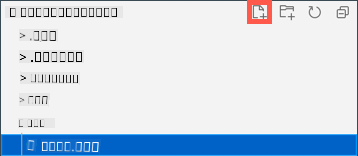

<!--
CO_OP_TRANSLATOR_METADATA:
{
  "original_hash": "d6faf0e8d3c2d6d20c0aef2a305dab18",
  "translation_date": "2025-10-11T11:19:19+00:00",
  "source_file": "1-getting-started/lessons/4-connect-internet/wio-terminal-mqtt.md",
  "language_code": "ta"
}
-->
# உங்கள் இரவுத்தீவிளக்கை இணையத்தின் மூலம் கட்டுப்படுத்துங்கள் - Wio Terminal

IoT சாதனம் *test.mosquitto.org* உடன் MQTT மூலம் தொடர்பு கொள்ள, ஒளி சென்சார் வாசிப்புடன் டெலிமெட்ரி மதிப்புகளை அனுப்பவும், LED ஐ கட்டுப்படுத்த கட்டளைகளை பெறவும் குறியீடு செய்ய வேண்டும்.

இந்த பாடத்தின் இந்த பகுதியில், உங்கள் Wio Terminal ஐ MQTT broker உடன் இணைப்பீர்கள்.

## WiFi மற்றும் MQTT Arduino நூலகங்களை நிறுவவும்

MQTT broker உடன் தொடர்பு கொள்ள, Wio Terminal இல் உள்ள WiFi சிப் பயன்படுத்தவும், MQTT உடன் தொடர்பு கொள்ளவும் Arduino நூலகங்களை நிறுவ வேண்டும். Arduino சாதனங்களுக்கான மேம்பாட்டில், திறந்த மூல குறியீடுகளை கொண்ட நூலகங்கள் மற்றும் பல திறன்களை செயல்படுத்தும் நூலகங்களை நீங்கள் பயன்படுத்தலாம். Seeed Wio Terminal க்கான WiFi மூலம் தொடர்பு கொள்ள நூலகங்களை வெளியிடுகிறது. மற்ற டெவலப்பர்கள் MQTT broker களுடன் தொடர்பு கொள்ள நூலகங்களை வெளியிட்டுள்ளனர், மேலும் நீங்கள் உங்கள் சாதனத்துடன் இவற்றை பயன்படுத்துவீர்கள்.

இந்த நூலகங்கள் மூலக் குறியீடாக வழங்கப்படுகின்றன, அவற்றை PlatformIO இல் தானாக இறக்குமதி செய்து உங்கள் சாதனத்திற்காக தொகுக்கலாம். இந்த வழியில் Arduino நூலகங்கள் Arduino framework ஐ ஆதரிக்கும் எந்த சாதனத்திலும் வேலை செய்யும், அந்த நூலகத்திற்கு தேவையான குறிப்பிட்ட ஹார்ட்வேரை சாதனம் கொண்டிருந்தால். சில நூலகங்கள், உதாரணமாக Seeed WiFi நூலகங்கள், குறிப்பிட்ட ஹார்ட்வேருக்கு மட்டுமே தனிப்பட்டவை.

நூலகங்கள் உலகளாவியமாக நிறுவப்பட்டு, தேவையானால் தொகுக்கப்படலாம், அல்லது குறிப்பிட்ட திட்டத்தில் நிறுவப்படலாம். இந்த பணிக்கான நூலகங்கள் திட்டத்தில் நிறுவப்படும்.

✅ நூலக மேலாண்மை மற்றும் நூலகங்களை எவ்வாறு கண்டறிந்து நிறுவுவது என்பதை [PlatformIO நூலக ஆவணத்தில்](https://docs.platformio.org/en/latest/librarymanager/index.html) மேலும் அறியலாம்.

### பணிக்கூற்று - WiFi மற்றும் MQTT Arduino நூலகங்களை நிறுவவும்

Arduino நூலகங்களை நிறுவவும்.

1. VS Code இல் nightlight திட்டத்தை திறக்கவும்.

1. `platformio.ini` கோப்பின் இறுதியில் பின்வருவனவற்றை சேர்க்கவும்:

    ```ini
    lib_deps =
        seeed-studio/Seeed Arduino rpcWiFi @ 1.0.5
        seeed-studio/Seeed Arduino FS @ 2.1.1
        seeed-studio/Seeed Arduino SFUD @ 2.0.2
        seeed-studio/Seeed Arduino rpcUnified @ 2.1.3
        seeed-studio/Seeed_Arduino_mbedtls @ 3.0.1
    ```

    இது Seeed WiFi நூலகங்களை இறக்குமதி செய்கிறது. `@ <number>` வடிவம் நூலகத்தின் குறிப்பிட்ட பதிப்பு எண்ணை குறிக்கிறது.

    > 💁 நீங்கள் `@ <number>` ஐ நீக்கி எப்போதும் நூலகங்களின் சமீபத்திய பதிப்பைப் பயன்படுத்தலாம், ஆனால் கீழே உள்ள குறியீடு வேலை செய்யும் என்று எந்த உத்தரவாதமும் இல்லை. இங்கு உள்ள குறியீடு இந்த நூலகங்களின் பதிப்புடன் சோதிக்கப்பட்டுள்ளது.

    நூலகங்களைச் சேர்க்க இதுவே போதுமானது. அடுத்த முறை PlatformIO திட்டத்தை உருவாக்கும் போது, இந்த நூலகங்களுக்கான மூலக் குறியீடுகளை பதிவிறக்கி உங்கள் திட்டத்தில் தொகுக்கும்.

1. `lib_deps` இல் பின்வருவனவற்றைச் சேர்க்கவும்:

    ```ini
    knolleary/PubSubClient @ 2.8
    ```

    இது [PubSubClient](https://github.com/knolleary/pubsubclient), ஒரு Arduino MQTT client ஐ இறக்குமதி செய்கிறது.

## WiFi க்கு இணைக்கவும்

இப்போது Wio Terminal WiFi க்கு இணைக்க முடியும்.

### பணிக்கூற்று - WiFi க்கு இணைக்கவும்

Wio Terminal ஐ WiFi க்கு இணைக்கவும்.

1. `src` கோப்புறையில் `config.h` என்ற புதிய கோப்பை உருவாக்கவும். இதை `src` கோப்புறை அல்லது அதில் உள்ள `main.cpp` கோப்பைத் தேர்ந்தெடுத்து, **New file** பொத்தானை எக்ஸ்ப்ளோரரில் தேர்ந்தெடுத்து செய்யலாம். இந்த பொத்தான் உங்கள் கர்சர் எக்ஸ்ப்ளோரர் மீது இருக்கும் போது மட்டுமே தோன்றும்.

    

1. உங்கள் WiFi சான்றுகளை வரையறுக்க இந்த கோப்பில் பின்வரும் குறியீட்டைச் சேர்க்கவும்:

    ```cpp
    #pragma once

    #include <string>
    
    using namespace std;
    
    // WiFi credentials
    const char *SSID = "<SSID>";
    const char *PASSWORD = "<PASSWORD>";
    ```

    `<SSID>` ஐ உங்கள் WiFi இன் SSID ஆக மாற்றவும். `<PASSWORD>` ஐ உங்கள் WiFi கடவுச்சொல்லாக மாற்றவும்.

1. `main.cpp` கோப்பைத் திறக்கவும்.

1. கோப்பின் மேல் பின்வரும் `#include` இயக்கங்களைச் சேர்க்கவும்:

    ```cpp
    #include <PubSubClient.h>
    #include <rpcWiFi.h>
    #include <SPI.h>
    
    #include "config.h"
    ```

    இது நீங்கள் முன்பு சேர்த்த நூலகங்களுக்கான தலைப்பு கோப்புகளை உள்ளடக்குகிறது, மேலும் config தலைப்பு கோப்பையும் சேர்க்கிறது. இந்த தலைப்பு கோப்புகள் PlatformIO க்கு நூலகங்களிலிருந்து குறியீட்டை கொண்டு வர சொல்ல தேவை. இந்த தலைப்பு கோப்புகளை வெளிப்படையாக சேர்க்காமல் சில குறியீடுகள் தொகுக்கப்படாது, மேலும் தொகுப்பாளர் பிழைகள் ஏற்படும்.

1. `setup` செயல்பாட்டின் மேல் பின்வரும் குறியீட்டைச் சேர்க்கவும்:

    ```cpp
    void connectWiFi()
    {
        while (WiFi.status() != WL_CONNECTED)
        {
            Serial.println("Connecting to WiFi..");
            WiFi.begin(SSID, PASSWORD);
            delay(500);
        }
    
        Serial.println("Connected!");
    }
    ```

    இந்த குறியீடு சாதனம் WiFi க்கு இணைக்கப்படாத போது மடக்கி, config தலைப்பு கோப்பிலிருந்து SSID மற்றும் கடவுச்சொல்லைப் பயன்படுத்தி இணைக்க முயற்சிக்கிறது.

1. பின்கள் உள்ளமைக்கப்பட்ட பிறகு, `setup` செயல்பாட்டின் கீழே இந்த செயல்பாட்டிற்கான அழைப்பைச் சேர்க்கவும்.

    ```cpp
    connectWiFi();
    ```

1. WiFi இணைப்பு வேலை செய்கிறது என்பதைச் சரிபார்க்க இந்த குறியீட்டை உங்கள் சாதனத்திற்கு பதிவேற்றவும். நீங்கள் இதை சீரியல் மானிட்டரில் காணலாம்.

    ```output
    > Executing task: platformio device monitor <
    
    --- Available filters and text transformations: colorize, debug, default, direct, hexlify, log2file, nocontrol, printable, send_on_enter, time
    --- More details at http://bit.ly/pio-monitor-filters
    --- Miniterm on /dev/cu.usbmodem1101  9600,8,N,1 ---
    --- Quit: Ctrl+C | Menu: Ctrl+T | Help: Ctrl+T followed by Ctrl+H ---
    Connecting to WiFi..
    Connected!
    ```

## MQTT க்கு இணைக்கவும்

Wio Terminal WiFi க்கு இணைக்கப்பட்ட பிறகு, அது MQTT broker க்கு இணைக்க முடியும்.

### பணிக்கூற்று - MQTT க்கு இணைக்கவும்

MQTT broker க்கு இணைக்கவும்.

1. MQTT broker க்கான இணைப்பு விவரங்களை வரையறுக்க `config.h` கோப்பின் இறுதியில் பின்வரும் குறியீட்டைச் சேர்க்கவும்:

    ```cpp
    // MQTT settings
    const string ID = "<ID>";
    
    const string BROKER = "test.mosquitto.org";
    const string CLIENT_NAME = ID + "nightlight_client";
    ```

    `<ID>` ஐ இந்த சாதன கிளையன்ட் பெயராகவும், பின்னர் இந்த சாதனம் வெளியிடும் மற்றும் சந்தா பெறும் தலைப்புகளுக்கான பெயராகவும் பயன்படுத்தப்படும் தனித்த ID ஆக மாற்றவும். *test.mosquitto.org* broker பொதுவானது மற்றும் பலரால் பயன்படுத்தப்படுகிறது, இந்த பணிக்கான மற்ற மாணவர்களையும் சேர்த்து. தனித்த MQTT கிளையன்ட் பெயர் மற்றும் தலைப்பு பெயர்கள் உங்கள் குறியீடு மற்றவர்களுடன் மோதாமல் இருப்பதை உறுதிசெய்கிறது. இந்த ID ஐ நீங்கள் இந்த பணிக்கான சர்வர் குறியீட்டை உருவாக்கும் போது தேவைப்படும்.

    > 💁 நீங்கள் [GUIDGen](https://www.guidgen.com) போன்ற ஒரு இணையதளத்தைப் பயன்படுத்தி தனித்த ID ஐ உருவாக்கலாம்.

    `BROKER` என்பது MQTT broker இன் URL ஆகும்.

    `CLIENT_NAME` என்பது broker இல் இந்த MQTT கிளையன்டிற்கான தனித்த பெயராகும்.

1. `main.cpp` கோப்பைத் திறக்கவும், `connectWiFi` செயல்பாட்டின் கீழே மற்றும் `setup` செயல்பாட்டின் மேல் பின்வரும் குறியீட்டைச் சேர்க்கவும்:

    ```cpp
    WiFiClient wioClient;
    PubSubClient client(wioClient);
    ```

    இந்த குறியீடு Wio Terminal WiFi நூலகங்களைப் பயன்படுத்தி WiFi கிளையன்டை உருவாக்குகிறது மற்றும் அதை பயன்படுத்தி MQTT கிளையன்டை உருவாக்குகிறது.

1. இந்த குறியீட்டின் கீழே பின்வருவனவற்றைச் சேர்க்கவும்:

    ```cpp
    void reconnectMQTTClient()
    {
        while (!client.connected())
        {
            Serial.print("Attempting MQTT connection...");
    
            if (client.connect(CLIENT_NAME.c_str()))
            {
                Serial.println("connected");
            }
            else
            {
                Serial.print("Retying in 5 seconds - failed, rc=");
                Serial.println(client.state());
                
                delay(5000);
            }
        }
    }
    ```

    இந்த செயல்பாடு MQTT broker க்கு இணைப்பை சோதித்து, இணைக்கப்படவில்லை என்றால் மீண்டும் இணைக்கிறது. இது இணைக்கப்படாத நேரத்தில் மடக்கி, config தலைப்பு கோப்பில் வரையறுக்கப்பட்ட தனித்த கிளையன்ட் பெயரைப் பயன்படுத்தி இணைக்க முயற்சிக்கிறது.

    இணைப்பு தோல்வியடைந்தால், 5 வினாடிகள் கழித்து மீண்டும் முயற்சிக்கிறது.

1. `reconnectMQTTClient` செயல்பாட்டின் கீழே பின்வரும் குறியீட்டைச் சேர்க்கவும்:

    ```cpp
    void createMQTTClient()
    {
        client.setServer(BROKER.c_str(), 1883);
        reconnectMQTTClient();
    }
    ```

    இந்த குறியீடு கிளையன்டிற்கான MQTT broker ஐ அமைக்கிறது, மேலும் செய்தி பெறப்படும் போது callback ஐ அமைக்கிறது. பின்னர் broker க்கு இணைக்க முயற்சிக்கிறது.

1. WiFi இணைக்கப்பட்ட பிறகு `setup` செயல்பாட்டில் `createMQTTClient` செயல்பாட்டை அழைக்கவும்.

1. முழு `loop` செயல்பாட்டை பின்வரும் குறியீட்டுடன் மாற்றவும்:

    ```cpp
    void loop()
    {
        reconnectMQTTClient();
        client.loop();
    
        delay(2000);
    }
    ```

    இந்த குறியீடு MQTT broker க்கு மீண்டும் இணைப்பதன் மூலம் தொடங்குகிறது. இந்த இணைப்புகள் எளிதாக முறிந்துவிடக்கூடும், எனவே அவற்றை அடிக்கடி சோதித்து, தேவையானால் மீண்டும் இணைப்பது நல்லது. பின்னர் MQTT கிளையன்டில் `loop` முறையை அழைக்கிறது, சந்தா பெறும் தலைப்பில் வரும் எந்த செய்திகளையும் செயல்படுத்த. இந்த பயன்பாடு ஒற்றை-தோராயமாக செயல்படுகிறது, எனவே பின்னணி துருவத்தில் செய்திகளைப் பெற முடியாது, எனவே நெட்வொர்க் இணைப்பில் காத்திருக்கும் எந்த செய்திகளையும் செயல்படுத்த முக்கிய துருவத்தில் நேரம் ஒதுக்க வேண்டும்.

    இறுதியாக, 2 வினாடிகள் தாமதம் ஒளி நிலைகள் அடிக்கடி அனுப்பப்படாமல் இருக்கவும், சாதனத்தின் மின்சார நுகர்வை குறைக்கவும் உறுதிசெய்கிறது.

1. உங்கள் Wio Terminal க்கு குறியீட்டை பதிவேற்றவும், WiFi மற்றும் MQTT க்கு சாதனம் இணைக்கப்படுவதை சீரியல் மானிட்டரில் காணவும்.

    ```output
    > Executing task: platformio device monitor <
    
    source /Users/jimbennett/GitHub/IoT-For-Beginners/1-getting-started/lessons/4-connect-internet/code-mqtt/wio-terminal/nightlight/.venv/bin/activate
    --- Available filters and text transformations: colorize, debug, default, direct, hexlify, log2file, nocontrol, printable, send_on_enter, time
    --- More details at http://bit.ly/pio-monitor-filters
    --- Miniterm on /dev/cu.usbmodem1201  9600,8,N,1 ---
    --- Quit: Ctrl+C | Menu: Ctrl+T | Help: Ctrl+T followed by Ctrl+H ---
    Connecting to WiFi..
    Connected!
    Attempting MQTT connection...connected
    ```

> 💁 இந்த குறியீட்டை [code-mqtt/wio-terminal](../../../../../1-getting-started/lessons/4-connect-internet/code-mqtt/wio-terminal) கோப்புறையில் காணலாம்.

😀 நீங்கள் உங்கள் சாதனத்தை MQTT broker க்கு வெற்றிகரமாக இணைத்துவிட்டீர்கள்.

---

**குறிப்பு**:  
இந்த ஆவணம் [Co-op Translator](https://github.com/Azure/co-op-translator) என்ற AI மொழிபெயர்ப்பு சேவையைப் பயன்படுத்தி மொழிபெயர்க்கப்பட்டுள்ளது. நாங்கள் துல்லியத்திற்காக முயற்சிக்கின்றோம், ஆனால் தானியங்கி மொழிபெயர்ப்புகளில் பிழைகள் அல்லது தவறான தகவல்கள் இருக்கக்கூடும் என்பதை தயவுசெய்து கவனத்தில் கொள்ளுங்கள். அதன் தாய்மொழியில் உள்ள மூல ஆவணம் அதிகாரப்பூர்வ ஆதாரமாக கருதப்பட வேண்டும். முக்கியமான தகவல்களுக்கு, தொழில்முறை மனித மொழிபெயர்ப்பு பரிந்துரைக்கப்படுகிறது. இந்த மொழிபெயர்ப்பைப் பயன்படுத்துவதால் ஏற்படும் எந்த தவறான புரிதல்கள் அல்லது தவறான விளக்கங்களுக்கு நாங்கள் பொறுப்பல்ல.