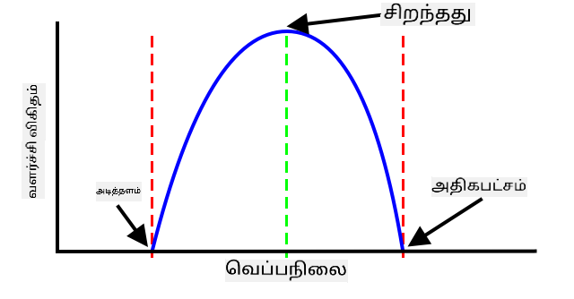
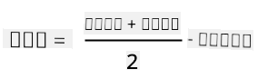
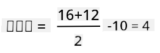
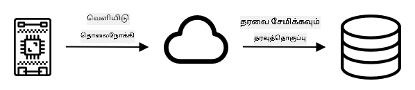
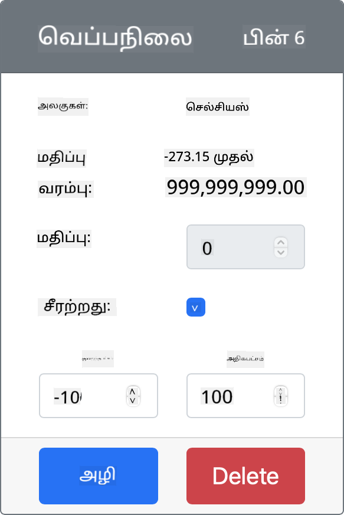
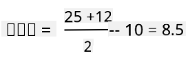

<!--
CO_OP_TRANSLATOR_METADATA:
{
  "original_hash": "d105b44deae539165855c976dcdeca99",
  "translation_date": "2025-10-11T12:36:02+00:00",
  "source_file": "2-farm/lessons/1-predict-plant-growth/README.md",
  "language_code": "ta"
}
-->
# IoT மூலம் செடிகளின் வளர்ச்சியை கணிக்கவும்


> சித்திரம்: [நித்யா நரசிம்மன்](https://github.com/nitya). படத்தை கிளிக் செய்து பெரிய பதிப்பைப் பார்க்கவும்.

## பாடத்திற்கு முன் வினாடி வினா

[பாடத்திற்கு முன் வினாடி வினா](https://black-meadow-040d15503.1.azurestaticapps.net/quiz/9)

## அறிமுகம்

செடிகள் வளர certain தேவைகளை கொண்டிருக்கின்றன - தண்ணீர், கார்பன் டைஆக்சைடு, ஊட்டச்சத்துகள், ஒளி மற்றும் வெப்பம். இந்த பாடத்தில், காற்றின் வெப்பநிலை அளவீட்டின் மூலம் செடிகளின் வளர்ச்சி மற்றும் முதிர்ச்சி விகிதங்களை கணிக்க கற்றுக்கொள்வீர்கள்.

இந்த பாடத்தில் நாம் கவரும் தலைப்புகள்:

* [டிஜிட்டல் வேளாண்மை](../../../../../2-farm/lessons/1-predict-plant-growth)
* [வேளாண்மையில் வெப்பநிலை ஏன் முக்கியம்?](../../../../../2-farm/lessons/1-predict-plant-growth)
* [சுற்றுப்புற வெப்பநிலை அளவீடு](../../../../../2-farm/lessons/1-predict-plant-growth)
* [வளர்ச்சி டிகிரி நாட்கள் (GDD)](../../../../../2-farm/lessons/1-predict-plant-growth)
* [வெப்பநிலை சென்சார் தரவின் மூலம் GDD கணக்கிடுதல்](../../../../../2-farm/lessons/1-predict-plant-growth)

## டிஜிட்டல் வேளாண்மை

டிஜிட்டல் வேளாண்மை என்பது விவசாயத்தை மாற்றி அமைக்கிறது, விவசாயத்திலிருந்து தரவுகளை சேகரிக்க, சேமிக்க மற்றும் பகுப்பாய்வு செய்ய கருவிகளைப் பயன்படுத்துகிறது. உலக பொருளாதார மன்றம் 'நான்காவது தொழில்துறை புரட்சி' என்று விவரிக்கும் காலகட்டத்தில் நாம் இருக்கிறோம், மேலும் டிஜிட்டல் வேளாண்மையின் வளர்ச்சி 'நான்காவது வேளாண்மை புரட்சி' அல்லது 'வேளாண்மை 4.0' என்று அழைக்கப்படுகிறது.

> 🎓 டிஜிட்டல் வேளாண்மை என்ற சொல் 'வேளாண்மை மதிப்புச் சங்கிலி' முழுவதையும் உள்ளடக்குகிறது, அதாவது பண்ணையிலிருந்து மேசை வரை பயணத்தை. இது உணவு கப்பல் மற்றும் செயலாக்கத்தின் போது உற்பத்தி தரத்தை கண்காணிப்பது, கிடங்கு மற்றும் மின் வணிக அமைப்புகள், கூடவே டிராக்டர் வாடகை பயன்பாடுகள் போன்றவற்றை உள்ளடக்குகிறது!

இந்த மாற்றங்கள் விவசாயிகளுக்கு விளைச்சலை அதிகரிக்க, உரங்கள் மற்றும் பூச்சிக்கொல்லிகளை குறைவாக பயன்படுத்த, மேலும் தண்ணீரை திறமையாக பயன்படுத்த அனுமதிக்கின்றன. பெரும்பாலும் செழிப்பான நாடுகளில் பயன்படுத்தப்பட்டாலும், சென்சார்கள் மற்றும் பிற சாதனங்கள் மெதுவாக விலை குறைந்து, வளர்ந்து வரும் நாடுகளில் அவற்றை அணுகக்கூடியதாக மாற்றுகின்றன.

டிஜிட்டல் வேளாண்மை மூலம் செயல்படுத்தப்படும் சில தொழில்நுட்பங்கள்:

* வெப்பநிலை அளவீடு - வெப்பநிலையை அளவிடுவது விவசாயிகளுக்கு செடிகளின் வளர்ச்சி மற்றும் முதிர்ச்சியை கணிக்க உதவுகிறது.
* தானியங்கி நீர்ப்பாசனம் - மண் ஈரப்பதத்தை அளவிடுதல் மற்றும் மண் மிகவும் உலர்ந்திருக்கும் போது நீர்ப்பாசன அமைப்புகளை இயக்குதல், நேரம் அடிப்படையிலான நீர்ப்பாசனத்தை விட. நேரம் அடிப்படையிலான நீர்ப்பாசனம் வெப்பமான, உலர்ந்த காலத்தில் பயிர்கள் குறைவாக நீர்ப்பாசனம் செய்யப்படுவதற்கு அல்லது மழையின் போது அதிகமாக நீர்ப்பாசனம் செய்யப்படுவதற்கு வழிவகுக்கலாம். மண்ணுக்கு தேவைப்படும் போது மட்டுமே நீர்ப்பாசனம் செய்வதன் மூலம் விவசாயிகள் தண்ணீர் பயன்பாட்டை மேம்படுத்தலாம்.
* பூச்சி கட்டுப்பாடு - விவசாயிகள் தானியக்க ரோபோட்கள் அல்லது ட்ரோன்களில் கேமராக்களைப் பயன்படுத்தி பூச்சிகளைச் சரிபார்க்கலாம், பின்னர் பூச்சிக்கொல்லிகளை தேவையான இடங்களில் மட்டுமே பயன்படுத்தலாம், இதனால் பூச்சிக்கொல்லி பயன்பாடு குறைகிறது மற்றும் உள்ளூர் நீர்வழிகளில் பூச்சிக்கொல்லி வெளியேறுதல் குறைகிறது.

✅ சில ஆராய்ச்சி செய்யுங்கள். விளைச்சலை மேம்படுத்த வேளாண்மையில் பயன்படுத்தப்படும் பிற தொழில்நுட்பங்கள் என்ன?

> 🎓 'நுண்ணறிவு வேளாண்மை' என்ற சொல் ஒரு புலம் அடிப்படையில் அல்லது ஒரு புலத்தின் பகுதிகளில் பயிர்களை கவனித்தல், அளவிடுதல் மற்றும் பதிலளிப்பதை வரையறுக்க பயன்படுத்தப்படுகிறது. இது தண்ணீர், ஊட்டச்சத்து மற்றும் பூச்சி நிலைகளை அளவிடுவதையும், துல்லியமாக பதிலளிப்பதையும், உதாரணமாக ஒரு புலத்தின் ஒரு சிறிய பகுதியை மட்டுமே நீர்ப்பாசனம் செய்வதையும் உள்ளடக்குகிறது.

## வேளாண்மையில் வெப்பநிலை ஏன் முக்கியம்?

செடிகளைப் பற்றி கற்றுக்கொள்ளும்போது, ​​பெரும்பாலான மாணவர்கள் தண்ணீர், ஒளி, கார்பன் டைஆக்சைடு (CO<sub>2</sub>) மற்றும் ஊட்டச்சத்துகளின் அவசியத்தைப் பற்றி கற்றுக்கொள்கிறார்கள். செடிகள் வளர வெப்பம் தேவை - இதுவே வெப்பநிலை அதிகரிக்கும் போது செடிகள் வசந்தத்தில் மலர்வதற்கான காரணம், ஒரு குறுகிய வெப்பமான காலத்தால் ஸ்னோடிராப்ஸ் அல்லது டாஃபோடில்கள் விரைவாக முளைக்க முடியும், மேலும் ஹோட்டஹவுஸ் மற்றும் கிரீன்ஹவுஸ் செடிகளை வளர்க்க மிகவும் நல்லவை.

> 🎓 ஹோட்டஹவுஸ் மற்றும் கிரீன்ஹவுஸ் ஒரே மாதிரியான வேலை செய்கின்றன, ஆனால் ஒரு முக்கிய வித்தியாசத்துடன். ஹோட்டஹவுஸ் செயற்கையாக சூடுபடுத்தப்படுகிறது மற்றும் விவசாயிகளுக்கு வெப்பநிலையை மேலும் துல்லியமாகக் கட்டுப்படுத்த அனுமதிக்கிறது, கிரீன்ஹவுஸ் வெப்பத்திற்காக சூரியனை நம்புகிறது மற்றும் வெப்பத்தை வெளியேற்ற சாளரங்கள் அல்லது பிற திறப்புகள் மட்டுமே கட்டுப்பாடு ஆகும்.

செடிகளுக்கு அடிப்படை அல்லது குறைந்தபட்ச வெப்பநிலை, சிறந்த வெப்பநிலை மற்றும் அதிகபட்ச வெப்பநிலை ஆகியவை உள்ளன, இவை அனைத்தும் தினசரி சராசரி வெப்பநிலையை அடிப்படையாகக் கொண்டவை.

* அடிப்படை வெப்பநிலை - செடிகள் வளர தினசரி சராசரி வெப்பநிலை தேவைப்படும் குறைந்தபட்ச அளவு.
* சிறந்த வெப்பநிலை - அதிக வளர்ச்சியைப் பெற சிறந்த தினசரி சராசரி வெப்பநிலை.
* அதிகபட்ச வெப்பநிலை - செடிகள் தாங்கக்கூடிய அதிகபட்ச வெப்பநிலை. இதற்கு மேல் செடிகள் தண்ணீரை பாதுகாக்கவும் உயிர் வாழவும் முயற்சிக்க வளர்ச்சியை நிறுத்தும்.

> 💁 இவை சராசரி வெப்பநிலைகள், தினசரி மற்றும் இரவுநேர வெப்பநிலைகளை சராசரியாகக் கொண்டவை. செடிகள் மேலும் திறமையாக ஒளிச்சேர்க்கை செய்யவும் இரவில் ஆற்றலைச் சேமிக்கவும் தினமும் மற்றும் இரவிலும் வெவ்வேறு வெப்பநிலைகளை தேவைப்படும்.

ஒவ்வொரு செடிகளின் இனத்திற்கும் அவர்களின் அடிப்படை, சிறந்த மற்றும் அதிகபட்ச வெப்பநிலைகளுக்கான மதிப்புகள் வேறுபடுகின்றன. இதுவே சில செடிகள் சூடான நாடுகளில் செழிக்க காரணமாகும், மற்றவை குளிர்ந்த நாடுகளில் செழிக்க காரணமாகும்.

✅ சில ஆராய்ச்சி செய்யுங்கள். உங்கள் தோட்டம், பள்ளி அல்லது உள்ளூர் பூங்காவில் உள்ள எந்த செடிகளுக்கும் அடிப்படை வெப்பநிலை கண்டுபிடிக்க முயற்சிக்கவும்.



மேலே உள்ள வரைபடம் வளர்ச்சி விகிதம் மற்றும் வெப்பநிலை தொடர்பான ஒரு எடுத்துக்காட்டு வரைபடத்தை காட்டுகிறது. அடிப்படை வெப்பநிலைக்கு மேல் வளர்ச்சி இல்லை. வளர்ச்சி விகிதம் சிறந்த வெப்பநிலைக்கு மேல் அதிகரிக்கிறது, பின்னர் இந்த உச்சத்தை அடைந்த பிறகு குறைகிறது. அதிகபட்ச வெப்பநிலையில் வளர்ச்சி நிற்கிறது.

இந்த வரைபடத்தின் வடிவம் செடிகளின் இனத்திலிருந்து இனத்திற்கு மாறுபடுகிறது. சிலவற்றில் சிறந்த வெப்பநிலைக்கு மேல் கூர்மையான சரிவுகள் உள்ளன, சிலவற்றில் அடிப்படையிலிருந்து சிறந்த வெப்பநிலைக்கு மெதுவான உயர்வுகள் உள்ளன.

> 💁 விவசாயி சிறந்த வளர்ச்சியைப் பெற, அவர்கள் மூன்று வெப்பநிலை மதிப்புகளை அறிய வேண்டும் மற்றும் அவர்கள் வளர்க்கும் செடிகளுக்கான வரைபடங்களின் வடிவத்தைப் புரிந்துகொள்ள வேண்டும்.

விவசாயி வெப்பநிலையை கட்டுப்படுத்தும் திறன் கொண்டிருந்தால், உதாரணமாக ஒரு வணிக ஹோட்டஹவுஸ், அப்போது அவர்கள் தங்கள் செடிகளுக்கு சிறந்த முறையில் செயல்படுத்த முடியும். உதாரணமாக, தக்காளி வளர்க்கும் ஒரு வணிக ஹோட்டஹவுஸ், வளர்ச்சியை விரைவாகப் பெற தினமும் 25°C மற்றும் இரவில் 20°C வெப்பநிலையை அமைக்கும்.

> 🍅 இந்த வெப்பநிலைகளை செயற்கை விளக்குகள், உரங்கள் மற்றும் கட்டுப்படுத்தப்பட்ட CO<sub>2</sub> நிலைகளுடன் இணைப்பதன் மூலம், வணிக வளர்ப்பாளர்கள் ஆண்டு முழுவதும் வளர்த்து அறுவடை செய்ய முடியும்.

## சுற்றுப்புற வெப்பநிலை அளவீடு

வெப்பநிலை சென்சார்கள் IoT சாதனங்களுடன் பயன்படுத்தி சுற்றுப்புற வெப்பநிலையை அளவிட முடியும்.

### பணிகள் - வெப்பநிலை அளவிடுதல்

உங்கள் IoT சாதனத்தைப் பயன்படுத்தி வெப்பநிலையை கண்காணிக்க தொடர்புடைய வழிகாட்டுதலைப் பின்பற்றவும்:

* [Arduino - Wio Terminal](wio-terminal-temp.md)
* [Single-board computer - Raspberry Pi](pi-temp.md)
* [Single-board computer - Virtual device](virtual-device-temp.md)

## வளர்ச்சி டிகிரி நாட்கள்

வளர்ச்சி டிகிரி நாட்கள் (அல்லது வளர்ச்சி டிகிரி அலகுகள்) என்பது வெப்பநிலை அடிப்படையில் செடிகளின் வளர்ச்சியை அளவிடும் ஒரு வழியாகும். ஒரு செடிக்கு போதுமான தண்ணீர், ஊட்டச்சத்துகள் மற்றும் CO<sub>2</sub> இருந்தால், வெப்பநிலை வளர்ச்சி விகிதத்தை நிர்ணயிக்கிறது.

வளர்ச்சி டிகிரி நாட்கள் அல்லது GDD தினசரி சராசரி வெப்பநிலை செடிகளின் அடிப்படை வெப்பநிலைக்கு மேல் தினசரி கணக்கிடப்படுகிறது. ஒவ்வொரு செடிக்கும் வளர, மலர அல்லது விளைச்சல் உற்பத்தி செய்ய மற்றும் முதிர்ச்சியடைய ஒரு குறிப்பிட்ட GDD தேவைப்படுகிறது. ஒவ்வொரு நாளும் அதிக GDD இருந்தால், செடி விரைவாக வளரும்.

> 🇺🇸 அமெரிக்கர்களுக்கு, வளர்ச்சி டிகிரி நாட்கள் ஃபாரன்ஹீட்டில் கணக்கிடப்படலாம். 5 GDD<sup>C</sup> (செல்சியஸில் வளர்ச்சி டிகிரி நாட்கள்) என்பது 9 GDD<sup>F</sup> (ஃபாரன்ஹீட்டில் வளர்ச்சி டிகிரி நாட்கள்) சமமானது.

GDD க்கான முழு சூத்திரம் கொஞ்சம் சிக்கலானது, ஆனால் ஒரு எளிமையான சமன்பாடு நல்ல மதிப்பீடாக அடிக்கடி பயன்படுத்தப்படுகிறது:



* **GDD** - இது வளர்ச்சி டிகிரி நாட்களின் எண்ணிக்கை
* **T<sub>max</sub>** - இது தினசரி அதிகபட்ச வெப்பநிலை செல்சியஸில்
* **T<sub>min</sub>** - இது தினசரி குறைந்தபட்ச வெப்பநிலை செல்சியஸில்
* **T<sub>base</sub>** - இது செடிகளின் அடிப்படை வெப்பநிலை செல்சியஸில்

> 💁 T<sub>max</sub> 30°C க்கு மேல் அல்லது T<sub>min</sub> T<sub>base</sub> க்கு கீழே இருக்கும் மாற்றங்கள் உள்ளன, ஆனால் இப்போது அவற்றை நாம் புறக்கணிக்கிறோம்.

### எடுத்துக்காட்டு - மக்காச்சோளம் 🌽

வகை அடிப்படையில், மக்காச்சோளம் (அல்லது மைஸ்) முதிர்ச்சியடைய 800 முதல் 2,700 GDD தேவைப்படுகிறது, அடிப்படை வெப்பநிலை 10°C.

அடிப்படை வெப்பநிலைக்கு மேல் முதல் நாளில், பின்வரும் வெப்பநிலைகள் அளவிடப்பட்டன:

| அளவீடு     | வெப்பநிலை °C |
| :---------- | :----------: |
| அதிகபட்சம்  | 16           |
| குறைந்தபட்சம் | 12           |

இந்த எண்ணங்களை நமது கணக்கில் சேர்த்தால்:

* T<sub>max</sub> = 16
* T<sub>min</sub> = 12
* T<sub>base</sub> = 10

இது ஒரு கணக்கை வழங்குகிறது:



அந்த நாளில் மக்காச்சோளம் 4 GDD பெற்றது. 800 GDD தேவைப்படும் மக்காச்சோளம் வகையைப் பொருத்து, முதிர்ச்சியடைய மேலும் 796 GDD தேவைப்படும்.

✅ சில ஆராய்ச்சி செய்யுங்கள். உங்கள் தோட்டம், பள்ளி அல்லது உள்ளூர் பூங்காவில் உள்ள எந்த செடிகளுக்கும் முதிர்ச்சியடைய அல்லது விளைச்சல் உற்பத்தி செய்ய தேவையான GDD எண்ணிக்கையை கண்டுபிடிக்க முயற்சிக்கவும்.

## வெப்பநிலை சென்சார் தரவின் மூலம் GDD கணக்கிடுதல்

செடிகள் நிரந்தர தேதிகளில் வளரவில்லை - உதாரணமாக, நீங்கள் ஒரு விதையை நடக்க முடியாது மற்றும் செடி 100 நாட்களில் துல்லியமாக பழம் தரும் என்று தெரிந்திருக்க முடியாது. அதற்கு பதிலாக, விவசாயி ஒரு செடி வளர எவ்வளவு நேரம் ஆகும் என்பதை சுமார் கணிக்க முடியும், பின்னர் பயிர்கள் தயாராக இருக்கும் போது தினசரி சரிபார்க்க வேண்டும்.

இது ஒரு பெரிய பண்ணையில் பெரிய தொழிலாளர் தாக்கத்தை ஏற்படுத்துகிறது, மேலும் விவசாயி எதிர்பாராத முறையில் முன்கூட்டியே தயாராக இருக்கும் பயிர்களை தவறவிடும் அபாயத்தை ஏற்படுத்துகிறது. வெப்பநிலைகளை அளவிடுவதன் மூலம், விவசாயி ஒரு செடி பெற்ற GDD ஐ கணக்கிட முடியும், இது அவர்களுக்கு எதிர்பார்க்கப்பட்ட முதிர்ச்சிக்கு அருகில் இருக்கும் போது மட்டுமே சரிபார்க்க அனுமதிக்கிறது.

IoT சாதனத்தைப் பயன்படுத்தி வெப்பநிலை தரவுகளை சேகரிப்பதன் மூலம், ஒரு விவசாயி செடிகள் முதிர்ச்சிக்கு அருகில் இருக்கும் போது தானாகவே அறிவிக்கப்படலாம். இதற்கான ஒரு வழக்கமான கட்டமைப்பு IoT சாதனங்கள் வெப்பநிலையை அளவிடுவதற்கும், பின்னர் MQTT போன்றவற்றைப் பயன்படுத்தி இந்த டெலிமெட்ரி தரவுகளை இணையத்தில் வெளியிடுவதற்கும் உள்ளது. சர்வர் குறியீடு பின்னர் இந்த தரவத்தை கேட்கிறது மற்றும் அதை எங்காவது சேமிக்கிறது, உதாரணமாக ஒரு தரவுத்தொகுப்புக்கு. இதனால் தரவுகளை பின்னர் பகுப்பாய்வு செய்ய முடியும், உதாரணமாக ஒரு இரவுநேர வேலை தினத்திற்கான GDD ஐ கணக்கிட, இதுவரை ஒவ்வொரு பயிர்க்கும் மொத்த GDD ஐ சேர்த்து, ஒரு செடி முதிர்ச்சிக்கு அருகில் இருந்தால் எச்சரிக்க.



சர்வர் குறியீடு கூடுதல் தகவல்களைச் சேர்த்துக் கொள்ளவும் முடியும். உதாரணமாக, IoT சாதனம் எந்த சாதனம் என்பதை குறிப்பிட ஒரு அடையாளத்தை வெளியிட முடியும், மேலும் சர்வர் குறியீடு சாதனத்தின் இருப்பிடத்தைப் பார்க்கவும், அது கண்காணிக்கும் பயிர்களைப் பார்க்கவும் இந்த அடையாளத்தைப் பயன்படுத்த முடியும். சில IoT சாதனங்கள் துல்லியமான நேரத்தை கண்காணிக்க தேவையான ஹார்ட்வேரை கொண்டிருக்கவில்லை அல்லது இணையத்தில் இருந்து தற்போதைய நேரத்தைப் படிக்க கூடுதல் குறியீடு தேவைப்படும் என்பதால், தற்போதைய நேரம் போன்ற அடிப்படை தரவுகளைச் சேர்க்கவும் முடியும்.

✅ வெவ்வேறு புலங்களில் வெவ்வேறு வெப்பநிலைகள் ஏன் இருக்கலாம் என்று நீங்கள் நினைக்கிறீர்கள்?

### பணிகள் - வெப்பநிலை தகவலை வெளியிடுதல்

தரவை பின்னர் பகுப்பாய்வு செய்ய IoT சாதனத்தைப் பயன்படுத்தி MQTT மூலம் வெப்பநிலை தரவுகளை வெளியிட தொடர்புடைய வழிகாட்டுதலைப் பின்பற்றவும்:

* [Arduino - Wio Terminal](wio-terminal-temp-publish.md)
* [Single-board computer - Raspberry Pi/Virtual IoT device](single-board-computer-temp-publish.md)

### பணிகள் - வெப்பநிலை தகவலைப் பிடித்து சேமிக்கவும்

IoT சாதனம் டெலிமெட்ரியை வெளியிடத் தொடங்கியவுடன், இந்த தரவத்தை சந்திக்கவும் சேமிக்கவும் சர்வர் குறியீட்டை எழுதலாம். தரவுத்தொகுப்பில் சேமிக்காமல், சர்வர் குறியீடு அதை கமா பிரிக்கப்பட்ட மதிப்ப
இந்த குறியீடு CSV கோப்பை திறந்து, அதன் இறுதியில் ஒரு புதிய வரிசையை சேர்க்கிறது. அந்த வரிசையில் தற்போதைய தேதி மற்றும் நேரம் மனிதர்களுக்கு எளிதில் புரியக்கூடிய வடிவத்தில் வடிவமைக்கப்பட்டு, IoT சாதனத்திலிருந்து பெறப்பட்ட வெப்பநிலை சேர்க்கப்படுகிறது. தரவு [ISO 8601 வடிவத்தில்](https://wikipedia.org/wiki/ISO_8601) நேர மண்டலத்துடன் சேமிக்கப்படுகிறது, ஆனால் மைக்ரோசெகண்ட்கள் இல்லாமல்.

1. உங்கள் IoT சாதனம் தரவை அனுப்புவதை உறுதிப்படுத்தி, இந்த குறியீட்டை முந்தைய முறையில் இயக்கவும். `temperature.csv` என்ற CSV கோப்பு அதே கோப்பகத்தில் உருவாக்கப்படும். அதை பார்ப்பதற்கு, நீங்கள் தேதி/நேரங்கள் மற்றும் வெப்பநிலை அளவீடுகளை காணலாம்:

    ```output
    date,temperature
    2021-04-19T17:21:36-07:00,25
    2021-04-19T17:31:36-07:00,24
    2021-04-19T17:41:36-07:00,25
    ```

1. தரவைப் பதிவு செய்ய இந்த குறியீட்டை சில நேரம் இயக்கவும். GDD கணக்கீடுகளுக்கு போதுமான தரவை சேகரிக்க, இதை ஒரு முழு நாளுக்கு இயக்குவது சிறந்தது.

    > 💁 நீங்கள் Virtual IoT Device பயன்படுத்தினால், "random" checkbox ஐ தேர்ந்தெடுத்து, வெப்பநிலை மதிப்புகள் ஒவ்வொரு முறையும் ஒரே மாதிரியானதாக வராமல் இருக்க ஒரு வரம்பை அமைக்கவும்.
     

    > 💁 இதை ஒரு முழு நாளுக்கு இயக்க விரும்பினால், உங்கள் சர்வர் குறியீடு இயங்கும் கணினி தூங்காமல் இருக்க வேண்டும். இதற்காக உங்கள் பவர் அமைப்புகளை மாற்றவும் அல்லது [இந்த கணினியை செயல்பாட்டில் வைத்திருக்க Python script](https://github.com/jaqsparow/keep-system-active) போன்றவற்றை இயக்கவும்.
    
> 💁 இந்த குறியீட்டை [code-server/temperature-sensor-server](../../../../../2-farm/lessons/1-predict-plant-growth/code-server/temperature-sensor-server) கோப்பகத்தில் காணலாம்.

### பணிகள் - சேமிக்கப்பட்ட தரவைக் கொண்டு GDD கணக்கிடுங்கள்

சர்வர் வெப்பநிலை தரவைப் பதிவு செய்த பிறகு, ஒரு செடிக்கான GDD கணக்கிடலாம்.

கைமுறையாக இதை செய்ய வேண்டிய படிகள்:

1. செடிக்கான அடிப்படை வெப்பநிலையை கண்டறியவும். உதாரணமாக, ஸ்ட்ராபெர்ரி செடிகளுக்கு அடிப்படை வெப்பநிலை 10°C.

1. `temperature.csv` கோப்பில் இருந்து, நாளின் அதிகபட்ச மற்றும் குறைந்தபட்ச வெப்பநிலைகளை கண்டறியவும்.

1. முன்பு கொடுக்கப்பட்ட GDD கணக்கீட்டை பயன்படுத்தி GDD ஐ கணக்கிடவும்.

உதாரணமாக, நாளின் அதிகபட்ச வெப்பநிலை 25°C, மற்றும் குறைந்தபட்சம் 12°C என்றால்:



* 25 + 12 = 37
* 37 / 2 = 18.5
* 18.5 - 10 = 8.5

அதனால் ஸ்ட்ராபெர்ரி செடிகள் **8.5** GDD பெற்றுள்ளன. ஸ்ட்ராபெர்ரி செடிகள் பழம் தர 250 GDD தேவைப்படும், எனவே இன்னும் சில காலம் தேவை.

---

## 🚀 சவால்

செடிகள் வளர வெப்பம் மட்டுமல்ல, மேலும் பல தேவைகள் உள்ளன. மற்ற எந்த தேவைகள் உள்ளன?

இவற்றுக்கு, அவற்றை அளவிடும் சென்சார்கள் உள்ளதா என்பதை கண்டறியவும். இந்த நிலைகளை கட்டுப்படுத்த Actuators உள்ளதா? செடிகளின் வளர்ச்சியை மேம்படுத்த IoT சாதனங்களை ஒன்றாக இணைத்து எப்படி அமைப்பீர்கள்?

## பாடத்திற்குப் பிந்தைய வினாடி வினா

[பாடத்திற்குப் பிந்தைய வினாடி வினா](https://black-meadow-040d15503.1.azurestaticapps.net/quiz/10)

## மதிப்பீடு & சுயபயிற்சி

* [Digital Agriculture Wikipedia பக்கம்](https://wikipedia.org/wiki/Digital_agriculture) மற்றும் [Precision Agriculture Wikipedia பக்கம்](https://wikipedia.org/wiki/Precision_agriculture) ஆகியவற்றில் டிஜிட்டல் வேளாண்மை மற்றும் துல்லிய வேளாண்மை பற்றிய மேலும் தகவல்களை படிக்கவும்.
* முழுமையான Growing Degree Days கணக்கீடு இங்கே கொடுக்கப்பட்ட எளிய கணக்கீட்டைவிட சிக்கலானது. [Growing Degree Day Wikipedia பக்கம்](https://wikipedia.org/wiki/Growing_degree-day) இல் சிக்கலான சமன்பாடு மற்றும் அடிப்படை வெப்பநிலைக்கு கீழே உள்ள வெப்பநிலைகளை எப்படி கையாளுவது என்பதைப் படிக்கவும்.
* எதிர்காலத்தில் உணவு பற்றாக்குறை ஏற்படலாம், நாம் இதே விவசாய முறைகளை தொடர்ந்து பயன்படுத்தினால். [Hi-Tech Farms of Future YouTube வீடியோ](https://www.youtube.com/watch?v=KIEOuKD9KX8) இல் உயர் தொழில்நுட்ப விவசாய முறைகள் பற்றிய மேலும் அறிக.

## பணிக்கட்டளை

[Jupyter Notebook ஐப் பயன்படுத்தி GDD தரவைக் காட்சிப்படுத்தவும்](assignment.md)

---

**குறிப்பு**:  
இந்த ஆவணம் [Co-op Translator](https://github.com/Azure/co-op-translator) என்ற AI மொழிபெயர்ப்பு சேவையைப் பயன்படுத்தி மொழிபெயர்க்கப்பட்டுள்ளது. நாங்கள் துல்லியத்திற்காக முயற்சிக்கிறோம், ஆனால் தானியக்க மொழிபெயர்ப்புகளில் பிழைகள் அல்லது தவறான தகவல்கள் இருக்கக்கூடும் என்பதை தயவுசெய்து கவனத்தில் கொள்ளுங்கள். அதன் தாய்மொழியில் உள்ள மூல ஆவணம் அதிகாரப்பூர்வ ஆதாரமாக கருதப்பட வேண்டும். முக்கியமான தகவல்களுக்கு, தொழில்முறை மனித மொழிபெயர்ப்பு பரிந்துரைக்கப்படுகிறது. இந்த மொழிபெயர்ப்பைப் பயன்படுத்துவதால் ஏற்படும் எந்த தவறான புரிதல்கள் அல்லது தவறான விளக்கங்களுக்கு நாங்கள் பொறுப்பல்ல.